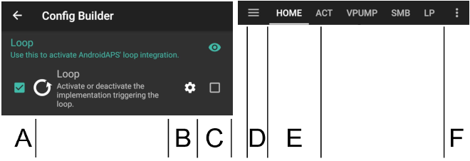

# Générateur de configuration

Selon vos paramètres, vous pouvez ouvrir le générateur de configuration via un onglet situé en haut de l'écran ou via le menu hamburger.

Le Générateur de configuration (Conf) est l'onglet dans lequel vous activez et désactivez les fonctions modulaires. Les cases du côté gauche (A) vous permettent de choisir celles à utiliser, les cases du côté droit (C) vous permettent de les visualiser sous forme d'onglet (E) dans AndroidAPS. Si la case de droite n'est pas cochée, vous pouvez atteindre la fonction en utilisant le menu hamburger (D) en haut à gauche de l'écran.

Lorsque des paramètres supplémentaires sont disponibles dans le module, vous pouvez cliquer sur la roue crantée (B) qui vous amènera a des paramètres spécifiques dans les préférences.

**Première configuration :** Depuis lAPS 2.0, un assistant de configuration vous guide à travers le processus de configuration de AndroidAPS. Appuyez sur le menu 3 points en haut à droite de l'écran (F) et sélectionnez 'Assistant de configuration' pour l'utiliser.

(Config-Builder-tab-or-hamburger-menu)=

## Onglet ou menu hamburger

With the checkbox under the eye symbol you can decide how to open the corresponding program section.

(Config-Builder-profile)=

## Profil

* Sélectionnez le profil de basal que vous souhaitez utiliser. Voir la page [Profils](../Usage/Profiles.md) pour plus d'informations sur la configuration.
* A partir d'AAPS 3.0, seul le profil local est disponible.

However, it is possible to synchronise a Nightscout profile into a local profile. To do this, however, it is important to clone the whole database record consisting of several profiles in the Nightscout editor. Please see the instructions below. This can be helpful if major changes to a more extensive profile can be entered more easily via the web interface, e.g. to manually copy data from a spreadsheet.

(Config-Builder-local-profile)=

### Profil Local

Local profile uses the basal profile manually entered in phone. As soon as it is selected, a new tab appears in AAPS, where you can change the profile data read out from the pump if necessary. With the next profile switch they are then written to the pump in profile 1. This profile is recommended as it does not rely on internet connectivity.

Your local profiles are part of [exported settings](../Usage/ExportImportSettings.md). So make sure to have a backup in a safe place.

Buttons:

* Plus vert : ajouter
* X rouge : supprimer
* Flèche bleue : dupliquer

If you make any changes to your profile, make sure, you are editing the correct profile. In profile tab there is not always shown the actual profile being used - e.g. if you made a profile switch by using the profile tab on homescreen it may differ from the profile actually shown in profile tab as there is no connection between these.

#### Dupliquer un changement de profil

You can easily create a new local profile from a profile switch. In this case timeshift and percentage will be applied to the new local profile.

1. Cliquez sur le menu 3 points en haut à droite de l'écran d'accueil.
2. Sélectionnez 'Traitements'.
3. Cliquez sur l'icone en forme d'étoile pour accéder à la page de changement de profil.
4. Sélectionnez le changement de profil souhaité et appuyez sur "Dupliquer".
5. Vous pouvez éditer le nouveau profil local dans l'onglet Profil local (PL) ou via le menu hamburger.

(Config-Builder-upload-local-profiles-to-nightscout)=

#### Remonter les profils locaux sur Nightscout

Local profiles can also be uploaded to Nightscout. The settings can be found in [NSClient preferences](Preferences-nsclient).

#### Changer de profil dans l'éditeur de profil Nighscout

You can synchronoze changes to the profile in the Nighscout profile editor to local profiles. The settings can be found in [NSClient preferences](Preferences-nsclient).

It is necessary to clone the actual active entire Nightscout database records for the profiles and not just a profile with the blue arrow! The new database records then carries the current date and can be activated via the tab "local profile".

### Assistant Profil

Profile helper offers two functions:

1. Trouver un profil pour les enfants
2. Comparer deux profils ou changements de profil pour cloner un nouveau profil

Details are explained on the separate [profile helper page](../Configuration/profilehelper.md).

(Config-Builder-insulin)=

## Insuline

* Sélectionnez le type de courbe d'insuline que vous utilisez.
* Les options 'Insuline à Action rapide Oref', 'Insuline à action Ultra Rapide Oref', 'Lyumjev' et 'Profil d'insuline ajustable Oref' ont toutes une forme exponentielle. Vous trouverez plus d'informations dans la [Documentation OpenAPS](https://openaps.readthedocs.io/en/latest/docs/While%20You%20Wait%20For%20Gear/understanding-insulin-on-board-calculations.html#understanding-the-new-iob-curves-based-on-exponential-activity-curves). 
* Les courbes varient en fonction de la DAI et le temps du pic.
    
    * La ligne ROSE montre la quantité **d'insuline restante** dans le corps après avoir été injectée car elle se dégrade avec le temps.
    * La ligne BLUE montre de **combien l'insuline est active**.

### DAI

* La DAI n'est pas la même pour chaque personne. C'est pourquoi vous devez la tester par vous-même. 
* Mais elle doit toujours être au minimum de 5 heures.
* Pour beaucoup de personnes utilisant des insulines ultra rapide comme la FIASP, il n'y a pratiquement pas d'effet notable après 3-4 heures tout au plus, même si 0.0 xx unités sont disponibles en tant que règle. Cette quantité résiduelle peut encore être perceptible pendant le sport, par exemple. Par conséquent, AndroidAPS utilise au moins 5h comme DAI.
* You can read more about that in the Insulin Profile section of [this](Screenshots-insulin-profile) page.

### Différences entre les types d'insuline

* Pour l'insuline à "Action Rapide", "Ultra-Rapide" et "Lyumjev", la DAI est la seule variable que vous pouvez ajuster vous-même, le temps du pic est fixé. 
* Le Profil d'insuline ajustable vous permet d'ajuster à la fois la DAI et le temps du pic, et ne doit être utilisé que par les utilisateurs confirmés qui connaissent les effets de ces paramètres. 
* The [insulin curve graph](Screenshots-insulin-profile) helps you to understand the different curves.
* Vous pouvez le voir en activant la case à cocher pour l'afficher sous forme d'onglet, sinon il se trouve dans le menu hamburger.

#### Insuline à Action Rapide Oref 

* recommandé pour Humalog, Novolog et Novorapid
* DAI = au moins 5.0h
* Pic maxi = 75 minutes après l'injection (fixe, non réglable)

#### Insuline Ultra Rapide Oref

* recommendé pour FIASP
* DAI = au moins 5.0h
* Pic maxi = 55 minutes après l'injection (fixe, non réglable)

(Config-Builder-lyumjev)=

#### Lyumjev

* profil d'insuline spécifique pour Lyumjev
* DAI = au moins 5.0h
* Pic maxi = 45 minutes après l'injection (fixe, non réglable)

#### Profil d'insuline ajustable Oref

* Avec le "Profil d'insuline ajustable 0ref" vous pouvez entrer individuellement l'heure du pic. Pour cela, cliquez sur la roue crantée pour entrer dans les paramètres avancés.
* La DAI est automatiquement définie à 5 heures s'il n'est pas spécifié plus haut dans le profil.
* Ce profil est recommandé si une insuline non soutenue ou un mélange d'insulines différentes est utilisé.

(Config-Builder-bg-source)=

## Source GLY

Select the blood glucose source you are using - see [BG Source](BG-Source.md) page for more setup information.

* [Construisez votre propre application Dexcom (BYODA)](https://docs.google.com/forms/d/e/1FAIpQLScD76G0Y-BlL4tZljaFkjlwuqhT83QlFM5v6ZEfO7gCU98iJQ/viewform?fbzx=2196386787609383750&fbclid=IwAR2aL8Cps1s6W8apUVK-gOqgGpA-McMPJj9Y8emf_P0-_gAsmJs6QwAY-o0).
* [xDrip+](https://xdrip-plus-updates.appspot.com/stable/xdrip-plus-latest.apk) - Cannot be used as receiver for Dexcom G6 as of AAPS 3.0 (see [release notes](Releasenotes-important-hints-3-0-0) for details.
* [Medtronic 640g](https://github.com/pazaan/600SeriesAndroidUploader/releases)
* [Glimp](https://play.google.com/store/apps/details?id=it.ct.glicemia&hl=de) - seule la version 4.15.57 et plus récentes sont prise en charge
* [Poctech](https://www.poctechcorp.com/en/contents/268/5682.html)
* [Application Tomato](http://tomato.cool/) pour les transmetteurs MiaoMiao
* [Application Glunovo](https://infinovo.com/) pour le système MGC Glunovo
* Glycémie NSClient - non recommandé car la boucle fermée repose sur la couverture des données mobiles / wifi dans ce cas. Les données MGC ne seront reçues que s'il y a une connexion en ligne à votre site NS. Mieux vaut utiliser la diffusion locale de l'une des autres sources de données de la MGC.
* Gly Aléatoire : Génère des données de glycémie aléatoires (mode Démo uniquement)

(Config-Builder-pump)=

## Pompe

Select the pump you are using.

* [DanaR](DanaR-Insulin-Pump.md)
* DanaR coréenne (pour la pompe DanaR domestique)
* DanaRv2 (pompe DanaR avec mise à niveau du firmware non officiel)
* [Dana-i/RS](DanaRS-Insulin-Pump.md)
    
    * Pour les pompes Dana, utilisez **Paramètres avancés** pour activer le "Watchdog BT" si nécessaire. Il éteint le Bluetooth pendant une seconde si aucune connexion à la pompe n'est possible. Cela peut être utile sur certains téléphones où la puce bluetooth se bloque.
    * [Le mot de passe pour les pompes Dana RS](../Configuration/DanaRS-Insulin-Pump.md) doit être entré correctement. Le mot de passe n'était vérifié dans les versions précédentes.

* [Accu Chek Insight](Accu-Chek-Insight-Pump.md)

* [Accu Chek Combo](Accu-Chek-Combo-Pump.md) (nécessite l'installation de ruffy)
* [Omnipod Eros](OmnipodEros.md)
* [Omnipod Dash](OmnipodDASH.md)
* [Medtronic](MedtronicPump.md)
* [Diaconn G8](DiaconnG8.md)
* MIQ (Permet de recevoir des suggestions de AAPS pour des thérapies avec de Multiples Injection Quotidiennes)
* Pompe virtuelle (boucle ouverte pour les pompes qui n'ont pas encore de pilote - suggestions AAPS uniquement)

## Estimation de Sensibilité

Select the type of sensitivity detection. For more details of different designs please [read on here](../Configuration/Sensitivity-detection-and-COB.md). This will analyze historical data on the go and make adjustments if it recognizes that you are reacting more sensitively (or conversely, more resistant) to insulin than usual. More details about the Sensitivity algorithm can be read in the [OpenAPS docs](https://openaps.readthedocs.io/en/latest/docs/Customize-Iterate/autosens.html).

You can view your sensitivity on the homescreen by selecting SEN and watching the white line. Note, you need to be in [Objective 8](Objectives-objective-8-adjust-basals-and-ratios-if-needed-and-then-enable-autosens) in order to let Sensitivity Detection/[Autosens](Open-APS-features-autosens) automatically adjust the amount of insulin delivered. Before reaching that objective, the Autosens percentage / the line in your graph is displayed for information only.

(Config-Builder-absorption-settings)=

### Paramètres d’absorption

If you use Oref1 with SMB you must change **min_5m_carbimpact** to 8. The value is only used during gaps in CGM readings or when physical activity "uses up" all the blood glucose rise that would otherwise cause AAPS to decay COB. At times when [carb absorption](../Usage/COB-calculation.md) can't be dynamically worked out based on your bloods reactions it inserts a default decay to your carbs. Basically, it is a failsafe.

(Config-Builder-aps)=

## APS

Select the desired APS algorithm for therapy adjustments. You can view the active detail of the chosen algorithm in the OpenAPS(OAPS) tab.

* OpenAPS AMA (Assistance Améliorée Repas, état de l'algorithme en 2017) En termes simples, les avantages sont après un bolus de repas le système peut faire une temporaire haute plus rapidement SI vous entrez les glucides de manière fiable.
* [OpenAPS SMB](../Usage/Open-APS-features.md) (super micro bolus, most recent algorithm for advanced users) Note you need to be in [Objective 9](Objectives-objective-9-enabling-additional-oref1-features-for-daytime-use-such-as-super-micro-bolus-smb) in order to use OpenAPS SMB and min_5m_carbimpact must be set to 8 in Config builder > Sensitivity detection > Sensitivity Oref1 settings.

## Boucle

* Basculer entre Boucle Ouverte, Boucle Fermée et Arrêt Glycémie Basse (AGB).

(Config-Builder-open-loop)=

### Boucle Ouverte

* AAPS évalue en permanence toutes les données disponibles (IA, GA, Gly ...) et fait des propositions de traitement pour ajuster votre thérapie si nécessaire. 
* Les suggestions ne seront pas exécutées automatiquement (comme dans la boucle fermée) doivent être entrées manuellement dans la pompe ou en utilisant un bouton si vous utiliserez une pompe compatible (Dana R/RS, Accu Chek Combo, Insight...). 
* Cette option permet de savoir comment AndroidAPS fonctionne ou si vous utilisez une pompe non prise en charge.

(Config-Builder-closed-loop)=

### Boucle Fermée

* AAPS évalue en permanence toutes les données disponibles (IA, GA, Gly ...) et ajuste automatiquement le traitement si nécessaire (c'est-à-dire sans intervention de votre part) pour atteindre la plage ou la valeur cible fixée (bolus, débit de basal temporaire, arrêt de l'insuline pour éviter l'hypo, etc.). 
* La boucle fermée fonctionne avec de nombreuses limites de sécurité, que vous pouvez définir individuellement.
* Closed Loop is only possible if you are in [Objective 6](Objectives-objective-6-starting-to-close-the-loop-with-low-glucose-suspend) or higher and use a supported pump.
* Remarque : En mode boucle fermée, une cible unique au lieu de la plage cible (par ex. 5,5 mmol ou 100 mg/dl au lieu de 5,0 - 7,0 mmol ou 90 - 125 mg/dl) est recommandée.

### Arrêt Glycémie Basse (AGB)

* maxIA est fixé à zéro
* Cela signifie que si le taux de glycémie chute, il peut réduire le débit de basal pour vous.
* Mais si la glycémie augmente, aucune correction automatique ne sera apportée. Vos débits de basal resteront les mêmes que votre profil sélectionné.
* Ce n'est que si l'insuline basale active est négative (à cause d'un arrêt glycémie basse antérieur), que de l'insuline additionnelle sera administrer pour faire baisser la glycémie.

### Changement minimum

* Lorsque vous utilisez le mode boucle ouverte, vous recevrez des notifications chaque fois que le programme AAPS vous recommande d'ajuster le débit de basal. 
* Pour réduire le nombre de notifications, vous pouvez utiliser une plage cible de glycémie plus étendue ou augmenter le pourcentage de changement minimal.
* Ce paramètre défini le changement relatif minimum qui déclenchera une notification.

## Objectifs (programme d'apprentissage)

AndroidAPS has a leraning program (objectives) that you have to fulfill step by step. This should guide you safely through setting up a closed loop system. It guarantees that you have set everything up correctly and understand what the system does exactly. This is the only way you can trust the system.

You should [export your settings](../Usage/ExportImportSettings.md) (including progress of the objectives) on a regularly basis. In case you have to replace your smartphone later (new purchase, display damage etc.) you can simply import those settings.

See [Objectives](../Usage/Objectives.md) page for more information.

## Traitements

If you view the Treatments (Treat) tab, you can see the treatments that have been uploaded to nightscout. Should you wish to edit or delete an entry (e.g. you ate less carbs than you expected) then select 'Remove' and enter the new value (change the time if necessary) through the [carbs button on the home screen](Screenshots-carb-correction).

## Généralités

### Aperçu

Displays the current state of your loop and buttons for most common actions (see [section The Homescreen](../Getting-Started/Screenshots.md) for details). Settings can be accessed by clicking the cog wheel.

#### Garder l'écran allumé

Option 'Keep screen on' will force Android to keep the screen on at all times. This is useful for presentations etc. But it consumes a lot of battery power. Therefore, it is recommended to connect the smartphone to a charger cable.

#### Boutons

Define which Buttons are shown on the home screen.

* Traitements
* Assistant
* Insuline
* Glucides
* MGC (ouvre xDrip+)
* Étalonnage

Furthermore, you can set shortcuts for insulin and carb increments and decide whether the notes field should be shown in treatment dialogues.

#### Assistant Rapide

Create a button for a certain standard meal (carbs and calculation method for the bolus) which will be displayed on the home screen. Use for standard meals frequently eaten. If different times are specified for the different meals you will always have the appropriate standard meal button on the home screen, depending on the time of day.

Note: Button will not be visible if outside the specified time range or if you have enough IOB to cover the carbs defined in the QuickWizard button.

#### Cibles Temporaires par défaut

Choose default temp-targets (duration and target). Preset values are:

* Repas imminent : cible 72 mg/dl / 4,0 mmol/l, durée 45 min
* Activité : cible 140 mg/dl / 7,8 mmol/l, durée 90 min
* Hypo : cible 125 mg/dl / 6,9 mmol/l, durée 45 min

#### Insuline par défaut pour Amorcer/Remplir

Choose the default amounts of the three buttons in fill/prime dialogue, depending on the length of your catheter.

#### Fourchette de visualisation

Choose the high and low marks for the BG-graph on AndroidAPS overview and smart watch. It is only the visualization, not the target range for your BG. Example: 70 - 180 mg/dl or 3.9 - 10 mmol/l

#### Raccourcir les titres des onglets

Choose wether the tab titles in AndroidAPS are long (e.g. ACTIONS, LOCAL PROFILE, AUTOMATION) or short (e.g. ACT, LP, AUTO)

#### Affiche les notes dans les dialogues

Choose if you want to have a notes field when entering treatments or not.

#### Voyants d'état

Choose if you want to have [status lights](Preferences-status-lights) on overview for cannula age, insulin age, sensor age, battery age, reservoir level or battery level. When warning level is reached, the color of the status light will switch to yellow. Critical age will show up in red.

#### Paramètres Avancés

**Deliver this part of bolus wizard result**: When using SMB, many people do not meal-bolus 100% of needed insulin, but only a part of it (e.g. 75 %) and let the SMB with UAM (unattended meal detection) do the rest. In this setting, you can choose a default value for the percenteage the bolus wizard should calculate with. If this setting is 75 % and you had to bolus 10u, the bolus wizard will propose a meal bolus of only 7.5 units.

**Enable super bolus functionality in wizard** (It is different from *super micro bolus*!): Use with caution and do not enable until you learn what it really does. Basically, the basal for the next two hours is added to the bolus and a two hour zero-temp activated. **AAPS looping functions will be disabled - so use with care! If you use SMB AAPS looping functions will be disabled according to your settings in ["Max minutes of basal to limit SMB to"](Open-APS-features-max-minutes-of-basal-to-limit-smb-to), if you do not use SMB looping functions will be disabled for two hours.** Details on super bolus can be found [here](https://www.diabetesnet.com/diabetes-technology/blue-skying/super-bolus).

(Config-Builder-actions)=

### Actions

* Quelques boutons pour accéder rapidement aux fonctions communes.
* See [AAPS screenshots](Screenshots-action-tab) for details.

### Automatisation

User defined automation tasks ('if-then-else'). Please [read on here](../Usage/Automation.md).

(Config-Builder-sms-communicator)=

### Communicateur SMS

Allows remote caregivers to control some AndroidAPS features via SMS, see [SMS Commands](../Children/SMS-Commands.md) for more setup information.

### Aliments

Displays the food presets defined in the Nightscout food database, see [Nightscout Readme](https://github.com/nightscout/cgm-remote-monitor#food-custom-foods) for more setup information.

Note: Entries cannot be used in the AndroidAPS calculator. (View only)

(Config-Builder-wear)=

### Wear

Monitor and control AAPS using your Android Wear watch (see [page Watchfaces](../Configuration/Watchfaces.md)). Use settings (cog wheel) to define which variables should be considered when calculating bolus given though your watch (i.e. 15min trend, COB...).

Si vous voulez commander AAPS depuis la montre (bolus etc) alors dans les "Paramètres Wear" vous devez activer "Commandes depuis la montre".

Through Wear tab or hamburger menu (top left of screen, if tab is not displayed) you can

* Renvoyer toutes les données. Cela peut être utile si la montre n'est pas connectée pendant un certain temps et que vous voulez envoyer toutes les informations à la montre.
* Ouvrez le menu Paramètres de votre montre directement depuis votre téléphone.

### Barre d'état pour xDrip (Montre)

Display loop information on your xDrip+ watchface (if you are not using AAPS/[AAPSv2 watchface](../Configuration/Watchfaces.md)

### NSClient

* Configurer la synchronisation de vos données AndroidAPS avec Nightscout.
* Settings in [preferences](Preferences-nsclient) can be opened by clicking the cog wheel.

### Maintenance

Email and number of logs to be send. Normally no change necessary.

### Générateur de configuration

Use tab for config builder instead of hamburger menu.