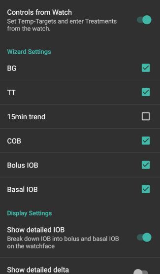

# Générateur de configuration

Selon vos paramètres, vous pouvez ouvrir le générateur de configuration via un onglet situé en haut de l'écran ou via le menu hamburger.

Le Générateur de configuration (Conf) est l'onglet dans lequel vous activez et désactivez les fonctions modulaires. Les cases du côté gauche (A) vous permettent de choisir celles à utiliser, les cases du côté droit (C) vous permettent de les visualiser sous forme d'onglet (E) dans AndroidAPS. Si la case de droite n'est pas cochée, vous pouvez atteindre la fonction en utilisant le menu hamburger (D) en haut à gauche de l'écran.

Lorsque des paramètres supplémentaires sont disponibles dans le module, vous pouvez cliquer sur la roue crantée (B) qui vous amènera a des paramètres spécifiques dans les préférences.

**Première configuration :** Depuis lAPS 2.0, un assistant de configuration vous guide à travers le processus de configuration de AndroidAPS. Appuyez sur le menu 3 points en haut à droite de l'écran (F) et sélectionnez 'Assistant de configuration' pour l'utiliser.

## Onglet ou menu hamburger

Avec la case à cocher sous le symbole de l'oeil, vous pouvez décider comment ouvrir la section correspondante du programme.

## Profil

Sélectionnez le profil de basal que vous souhaitez utiliser. Voir la page [Profils](../Usage/Profiles.md) pour plus d'informations sur la configuration.

### Profil local (recommandé)

Le profil local utilise le profil de basal entré manuellement sur le téléphone. Dès qu'il est sélectionné, un nouvel onglet apparaît dans AAPS, où vous pouvez modifier les données de profil lues à partir de la pompe si nécessaire. Avec le changement de profil suivant, les données sont ensuite écrites dans la pompe dans le profil 1. Ce profil est recommandé car il ne dépend pas de la connectivité Internet.

Vos profils locaux font partie des [paramètres exportés](../Usage/ExportImportSettings.rst). Donc assurez vous d'avoir une sauvegarde dans un endroit sûr.

Boutons :

* Plus vert : ajouter
* X rouge : supprimer
* Flèche bleue : dupliquer

#### Dupliquer un changement de profil

Vous pouvez facilement créer un profil local à partir d'un changement de profil. Dans ce cas, le décalage temporel et le pourcentage seront appliqués au nouveau profil local.

1. Allez dans l'onglet Traitements.
2. Sélectionnez Changement Profil.
3. Appuyez sur "Dupliquer".
4. Vous pouvez éditer le nouveau profil local dans l'onglet Profil local (PL) ou via le menu hamburger.

Si vous souhaitez passer du profil Nightscout au profil local, faites simplement un changement de profil sur votre profil NS et clonez le changement de profil comme décrit ci-dessus.

#### Remonter les profils locaux sur Nightscout

Les profils locaux peuvent également être téléchargés sur Nightscout. Les paramètres se trouvent dans les préférences NS Client.

Avantages :

* il n'est pas nécessaire d'avoir une connexion internet pour modifier les paramètres du profil
* les modifications du profil peuvent être effectuées directement sur le téléphone
* un nouveau profil peut être créé à partir d'un changement de profil
* les profils locaux peuvent être téléchargés sur Nightscout

Inconvénients :

* aucun

### Profil NS

NS Profile utilise les profils que vous avez enregistrés sur votre site Nightscout (https: //[yournightscoutsiteaddress]/profile). Vous pouvez utiliser le [changement de profil](../Usage/Profiles.md) pour définir lequel de ces profils est actif, ceci écrit le profil dans la pompe en cas de problème avec AndroidAPS. Cela vous permet de créer facilement plusieurs profils dans Nightscout (par ex. travail, maison, sports, vacances, etc.). Peu après avoir cliqué sur "Sauver", ils seront transférés à AAPS si votre smartphone est en ligne. Même sans connexion Internet ou sans connexion avec Nightscout, les profils Nightscout sont disponibles dans AAPS une fois qu'ils ont été synchronisés.

Effectuez un **changement de profil** pour activer un profil de Nightscout. Faites un appui long sur le nom du profil en cours dans la page d'accueil AAPS en haut (zone grise entre le champ "Boucle ouverte / fermée" et la zone cible) > Changement de profil > Profil > OK. AAPS écrit également le profil sélectionné dans la pompe après le changement de profil, de sorte qu'il est disponible sans AAPS en cas d'urgence et continue de s'exécuter.

Avantages :

* profils multiples
* facile à modifier via un PC ou une tablette

Inconvénients :

* aucune modification locale des paramètres de profil
* le profil ne peut pas être modifié directement sur le téléphone

## Insuline

Sélectionnez le type de courbe d'insuline que vous utilisez. Les options 'Insuline à Action rapide Oref', 'Insuline à action Ultra Rapide Oref' et 'Profil d'insuline ajustable Oref' ont toutes une forme exponentielle. Plus d'informations sont listées dans les [docs OpenAPS](http://openaps.readthedocs.io/en/latest/docs/While%20You%20Wait%20For%20Gear/understanding-insulin-on-board-calculations.html#understanding-the-new-iob-curves-based-on-exponential-activity-curves), les courbes varieront en fonction du DAI et du temps maximum.

La DAI n'est pas la même pour chaque personne. C'est pourquoi vous devez la tester par vous-même. Mais elle doit toujours être au minimum de 5 heures. Vous pouvez en savoir plus à ce sujet dans la section Profil d'Insuline de [cette page](../Getting-Started/Screenshots#insulin-profile).

Pour l'insuline à Action Rapide et l'insuline à Action Ultra-Rapid, la DAI est la seule variable que vous pouvez ajuster vous-même, le temps du pic est fixé. Le Profil d'insuline ajustable vous permet d'ajuster à la fois la DAI et le temps du pic, et ne doit être utilisé que par les utilisateurs confirmés qui connaissent les effets de ces paramètres.

Le [graphique de courbe d'insuline](../Getting-Started/Screenshots#insulin-profile) vous aide à comprendre les différentes courbes. Vous pouvez le voir en activant la case à cocher pour l'afficher sous forme d'onglet, sinon il se trouve dans le menu hamburger.

### Insuline à Action Rapide Oref 

* recommandé pour Humalog, Novolog et Novorapid
* DAI = au moins 5.0h
* Pic maxi = 75 minutes après l'injection (fixe, non réglable)

### Insuline Ultra Rapide Oref

* recommendé pour FIASP
* DAI = au moins 5.0h
* Pic maxi = 55 minutes après l'injection (fixe, non réglable)

Pour beaucoup de personnes, il n'y a pratiquement pas d'effet notable de FIASP après 3-4 heures tout au plus, même si 0.0 xx unités sont disponibles en tant que règle. Cette quantité résiduelle peut encore être perceptible pendant le sport, par exemple. Par conséquent, AndroidAPS utilise au moins 5h comme DAI.

### Profil d'insuline ajustable Oref

Avec le "Profil d'insuline ajustable 0ref" vous pouvez entrer individuellement l'heure du pic. La DAI est automatiquement définie à 5 heures s'il n'est pas spécifié plus haut dans le profil.

Ce profil est recommandé si une insuline non soutenue ou un mélange d'insulines différentes est utilisé.

## Source GLY

Sélectionnez la source de glycémie que vous utilisez - consultez la page [Source Gly](BG-Source.rst) pour plus d'informations sur la configuration.

* [xDrip+](https://xdrip-plus-updates.appspot.com/stable/xdrip-plus-latest.apk)
* Glycémie NSClient
* [Medtronic 640g](https://github.com/pazaan/600SeriesAndroidUploader/releases)
* [Glimp](https://play.google.com/store/apps/details?id=it.ct.glicemia&hl=de) - seule la version 4.15.57 et plus récentes sont prise en charge
* [App Dexcom (patché)](https://github.com/dexcomapp/dexcomapp/) - Sélectionnez "Envoyer des données Gly à xDrip+" si vous voulez utiliser des alarmes xDrip+.
    
    

* [Poctech](http://www.poctechcorp.com/en/contents/268/5682.html)

## Pompe

Sélectionner la pompe que vous utilisez.

* [DanaR](DanaR-Insulin-Pump.md)
* DanaR coréenne (pour la pompe DanaR domestique)
* DanaRv2 (pompe DanaR avec mise à niveau firmware)
* [DanaRS](DanaRS-Insulin-Pump.md)
* [Pompe Accu-Chek Combo](Accu-Chek-Combo-Pump.md) (nécessite l'installation de ruffy)
* MIQ (Permet de recevoir des suggestions de AAPS pour des thérapies avec de Multiples Injection Quotidiennes)
* Pompe virtuelle (boucle ouverte pour les pompes qui n'ont pas encore de pilote - suggestions AAPS uniquement)

Pour les pompes Dana, utilisez **Paramètres avancés** pour activer le "Watchdog BT" si nécessaire. Il éteint le Bluetooth pendant une seconde si aucune connexion à la pompe n'est possible. Cela peut être utile sur certains téléphones où la puce bluetooth se bloque.

## Estimation de Sensibilité

Sélectionnez le type de calcul pour la sensibilité. Cela analysera les données historiques au fur et à mesure et fera des ajustements si elle détecte que vous réagissez de façon plus sensible (ou plus résistante) à l'insuline que d'habitude. Les détails sur l'algorithme de la Sensitibilité Oref0 peuvent être lus dans la [documentation OpenAPS](http://openaps.readthedocs.io/en/latest/docs/walkthrough/phase-4/advanced-features.html#auto-sensitivity-mode).

Vous pouvez voir votre sensibilité sur l'écran d'accueil en sélectionnant Sensibilité dans les paramètres du graphique et en observant la ligne blanche. Note, you need to be in [Objective 8](../Usage/Objectives#objective-8-adjust-basals-and-ratios-if-needed-and-then-enable-autosens) in order to let Sensitivity Detection/[Autosens](../Usage/Open-APS-features.html#autosens) automatically adjust the amount of insulin delivered. Before reaching that objective, the Autosens percentage / the line in your graph is displayed for information only.

### Paramètres d’absorption

Si vous utilisez le type Oref1 avec les SMB, vous devez modifier **min_5m_carbimpact** à 8. La valeur n'est utilisée que pendant les lacunes dans les lectures de CGM ou lorsque l'activité physique "utilise" l'augmentation de la glycémie qui autrement aurai permis la décomposition des GA par AAPS. At times when [carb absorption](../Usage/COB-calculation.rst) can't be dynamically worked out based on your bloods reactions it inserts a default decay to your carbs. De base, c'est une sécurité intégrée.

## APS

Sélectionnez l'algorithme APS souhaité pour les ajustements de thérapie. Vous pouvez afficher le détail actif de l'algorithme choisi dans l'onglet OpenAPS (OAPS).

* OpenAPS MA (Assistant Repas, état de l'algorithme en 2016)
* OpenAPS AMA (Assistance Améliorée Repas, état de l'algorithme en 2017)  
    Plus de détails sur OpenAPS AMA peuvent être trouvé dans la [documentation OpenAPS](http://openaps.readthedocs.io/en/latest/docs/Customize-Iterate/autosens.html#advanced-meal-assist-or-ama). En termes simples, les avantages sont une fois que vous vous êtes fait un bolus de repas, le système peut augmenter la basale temp plus rapidement SI vous entrez des glucides de manière fiable.  
    Notez que vous devez être à l'[Objectif 9](../Usage/Objectives#objectif-9-activation-de-fonctionnalites-supplementaires-en-journee-comme-l-aide-au-repas-amelioree-ara-ama) pour utiliser OpenAPS AMA.
* [OpenAPS SMB](../Usage/Open-APS-features.md) (Super Micro Bolus, l'algorithme le plus récent pour les utilisateurs avancés)  
    Notez que vous devez être à l'[Objectif 10](../Usage/Objectives#objectif-10-activation-de-fonctionnalites-supplementaires-pour-l-utilisation-en-journee-telles-que-la-fonction-smb) pour utiliser OpenAPS SMB et min_5m_carbimpact doit être mis à 8 dans le Générateur de configuration > Sensitivity detection > Estimation de Sensibilité > paramètres Oref1.

## Boucle

Définissez si vous souhaitez autoriser ou non les contrôles automatiques AAPS.

### Boucle Ouverte

AAPS évalue en permanence toutes les données disponibles (IA, GA, Gly ...) et fait des propositions de traitement pour ajuster votre thérapie si nécessaire. Les suggestions ne seront pas exécutées automatiquement (comme dans la boucle fermée) doivent être entrées manuellement dans la pompe ou en utilisant un bouton si vous utiliserez une pompe compatible (Dana R/RS, Accu Chek Combo, Insight...). Cette option permet de savoir comment AndroidAPS fonctionne ou si vous utilisez une pompe non prise en charge.

### Boucle Fermée

AAPS évalue en permanence toutes les données disponibles (IA, GA, Gly ...) et ajuste automatiquement le traitement si nécessaire (c'est-à-dire sans intervention de votre part) pour atteindre la plage ou la valeur cible fixée (bolus, débit de basal temporaire, arrêt de l'insuline pour éviter l'hypo, etc.). La boucle fermée fonctionne avec de nombreuses limites de sécurité, que vous pouvez définir individuellement. La boucle fermée n'est possible que si vous êtes à l'[Objectif 6](../Usage/Objectives#objective-6-starting-to-close-the-loop-with-low-glucose-suspend) ou plus et si vous utilisez une pompe prise en charge.

## Objectifs (programme d'apprentissage)

AndroidAPS a un certain nombre d'objectifs que vous devez réaliser étape par étape. Cela devrait vous guider en toute sécurité à travers la mise en place d'un système de boucle fermée. Ce programme d'apprentissage garantit que vous avez tout mis en place correctement et que vous comprenez ce que le système fait exactement. C'est la seule façon pour vous de faire confiance au système.

Vous devez [exporter régulièrement vos paramètres](../Usage/ExportImportSettings.rst) (y compris la progression des objectifs). Au cas où vous devrez remplacer votre smartphone plus tard (nouvel achat, problème d'écran, etc.) vous pouvez simplement importer ces paramètres.

Voir la page [Objectifs](../Usage/Objectives.rst) pour plus d'informations.

## Traitements

Si vous affichez l'onglet Traitements (TRAIT), vous pouvez voir les traitements qui ont été téléchargés dans Nightscout. Si vous voulez modifier ou supprimer une entrée (par ex. vous avez mangé moins de glucides que prévu), alors sélectionnez 'Supprimer' et entrez la nouvelle valeur (changes l'heure si nécessaire) via le [bouton Glucides de l'écran d'accueil](../Getting-Started/Screenshots.md#carb-correction).

## Généralités

### Aperçu

Affiche l'état en cours de votre boucle et les boutons de la plupart des actions courantes (voir la section [Ecran d'accueil](../Getting-Started/Screenshots.md) pour plus de détails). Vous pouvez accéder aux paramètres en cliquant sur la roue crantée.

#### Garder l'écran allumé

L'option 'Garder l'écran allumé' forcera Android à garder l'écran allumé en permanence. C'est utile par ex. pour des présentations, etc. Mais cela consomme beaucoup d'énergie. Par conséquent, il est recommandé dans ce cas de connecter le smartphone à un chargeur.

#### Boutons

Définissez quels boutons sont affichés sur l'écran d'accueil.

* Traitements
* Calculatrice
* Insuline
* Glucides
* MGC (ouvre xDrip+)
* Étalonnage

De plus, vous pouvez définir des raccourcis pour l'insuline et les incréments de glucides et décider si le champ de notes doit être affiché dans les boites de dialogues des traitements.

#### Paramètres de l'Assistant Rapide

Créez un bouton pour un repas standard (Glucides et méthode de calcul pour le bolus) qui sera affiché sur l'écran d'accueil. C'est à utiliser pour des repas standards souvent consommés. Si des heures différentes sont renseignées pour les différents repas, vous aurez toujours le bouton de repas standard approprié sur l'écran d'accueil, en fonction de l'heure de la journée.

Remarque : Le bouton ne sera pas visible si vous êtes en dehors de la plage de temps spécifiée ou si vous avez suffisamment d'IA pour couvrir les glucides définis dans le bouton d'assistant rapide.

#### Paramètres Avancés

Activer la fonction super bolus dans l'Assistant. Utilisez avec prudence et ne l'activez pas tant que vous n'avez pas parfaitement compris ce qu'il fait réellement. En gros, l'insuline correspondant au débit de basal des deux heures suivantes est ajoutée au bolus et deux heures de zéro-temp sont activées. **Les fonctions de boucle AAPS seront désactivées - c'est donc à utiliser avec prudence ! Si vous utilisez OpenAPS SMB, les fonctions de la boucle seront désactivées selon le paramètre ["Max. minutes de basal pour limiter le SMB"](../Usage/Open-APS-features#max-minutes-of-basal-to-limit-smb-to), si vous n'utilisez pas les SMB les fonctions de la boucle seront désactivées pendant deux heures.** Plus de détails sur le super bolus peuvent être trouvés [ici](https://www.diabetesnet.com/diabetes-technology/blue-skying/super-bolus).

### Actions

Quelques boutons pour accéder rapidement aux fonctions communes:

* Changement de profils (voir la page [Changement de profil](../Usage/Profiles.md) pour plus d'informations sur la configuration)
* Cibles temporaires
* Définir/Annuler des Débit de Base
* Bolus étendu (pompe DanaR/RS ou Combo uniquement)
* Enregistrement de tous les soins spécifiques
    
    * Contrôle de la glycémie
    * Amorcer/Remplir - enregistrement d'un changement de site et d'un changement de cartouche (si pas fait sur la pompe)
    * Pose du capteur MGC
    * Changement de la pile de pompe
    * Remarque
    * Activité Physique
* Affichage des informations capteur, insuline, canule et age de la pile de pompe
* Historique
* DTI (Dosage Total d'Insuline quotidien = bolus + basale par jour)

Certains médecins utilisent - en particulier pour les nouveaux utilisateurs de pompes - une proportion basal-bolus de 50:50. Par conséquent, le rapport est calculé ainsi DTI/(2*DTB) (Dose Totale de Basale = somme des débits de basal en 24 heures). D'autres préfèrent une fourchette allant de 32% à 37% de DTI pour DTB. Comme la plupart de ces règles empiriques, leur validité réelle est limitée. Remarque : Votre diabète peut varier!

### Communicateur SMS

Permet aux aidants à distance de contrôler certaines fonctionnalités d'AndroidAPS via SMS, voir [Commandes SMS](../Children/SMS-Commands.rst) pour plus d'informations sur la configuration.

### Aliments

Affiche les préréglages alimentaires définis dans la base de données Nightscout, voir [Nightscout Lisez-moi](https://github.com/nightscout/cgm-remote-monitor#food-custom-foods) pour plus d'informations sur la configuration.

Remarque : Les entrées ne peuvent pas être utilisées dans la calculatrice AndroidAPS. (Affichage uniquement)

### Wear

Contrôler et contrôler AAPS à l'aide de votre montre Android Wear (voir la page [AAPS sur montres Wear OS](../Configuration/Watchfaces.md)). Utilisez les paramètres (roue crantée) pour définir quelles variables doivent être prises en compte lors du calcul du bolus donné par votre montre (par ex. tendance de 15min, GA...).

Si vous voulez commander AAPS depuis la montre (bolus etc) alors dans les "Paramètres Wear" vous devez activer "Commandes depuis la montre".

Via l'onglet Wear ou le menu hamburger (en haut à gauche de l'écran, si l'onglet n'est pas affiché), vous pouvez

* Renvoyer toutes les données. Cela peut être utile si la montre n'est pas connectée pendant un certain temps et que vous voulez envoyer toutes les informations à la montre.
* Ouvrez le menu Paramètres de votre montre directement depuis votre téléphone.

### Barre d'état pour xDrip (Montre)

Affiche les informations de la boucle sur votre cadran xDrip+ (si vous n'utilisez pas les cadrans AAPS/[cadran AAPSv2](../Configuration/Watchfaces.md)

### Notification en cours

Affiche un récapitulatif des Gly, delta, %DBT actif, basale u/h et profil actif, IA décomposée en IA bolus et IA basal sur l'écran de veille et l'écran de verrouillage du téléphone.

### NS Client

Configurer la synchronisation de vos données AndroidAPS avec Nightscout.

Si **Démarrage AAPS entré dans NS** est activé chaque lancement de AndroidAPS sera visible dans Nightscout. Peut être utile pour détecter des problèmes avec l'application (par ex. si l'optimisation de la batterie n'a pas été désactivée pour l'AAPS), mais peut saturer le graphique Nightscout avec les entrées.

#### Options d'alarme

Activez/désactivez les alarmes AndroidAPS

#### Paramètres de connexion

Bloucler hors connexion, désactiver l'itinérance...

Si vous souhaitez utiliser uniquement un réseau WiFi spécifique, vous pouvez entrer son **SSID**. Plusieurs SSID peuvent être séparés par un point-virgule. Pour supprimer tous les SSID, entrez un espace dans la zone.

#### Paramètres Avancés

* Remplissage automatique des glycémies manquantes en utilisant NS
* Créer des messages d'erreurs Créer une annonce Nightscout pour les messages d'erreur et les alertes locales (également visible dans la section Careportal de l'onglet traitements)
* Activer la diffusion locale vers d'autres applications telles que xDrip +
* Remonter uniquement vers NS (synchronisation désactivée)
* Pas de téléchargement vers NS
* Utiliser toujours les valeurs absolues du basal -> Doit être activé si vous voulez utiliser [Autotune](https://openaps.readthedocs.io/en/latest/docs/Customize-Iterate/autotune.html) correctement.

### Maintenance

E-mail et le nombre de journaux à envoyer. Normalement pas de changement nécessaire.

### Générateur de configuration

Utilisez l'onglet pour le générateur de configuration au lieu du menu hamburger.