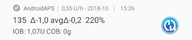

# Générateur de configuration

Selon vos paramètres, vous pouvez ouvrir le générateur de configuration via un onglet situé en haut de l'écran ou via le menu hamburger.

Le Générateur de configuration (Conf) est l'onglet dans lequel vous activez et désactivez les fonctions modulaires. Les cases du côté gauche (A) vous permettent de choisir celles à utiliser, les cases du côté droit (C) vous permettent de les visualiser sous forme d'onglet (E) dans AndroidAPS. Si la case de droite n'est pas cochée, vous pouvez atteindre la fonction en utilisant le menu hamburger (D) en haut à gauche de l'écran.

Lorsque des paramètres supplémentaires sont disponibles dans le module, vous pouvez cliquer sur la roue crantée (B) qui vous amènera a des paramètres spécifiques dans les préférences.

**Première configuration :** Depuis lAPS 2.0, un assistant de configuration vous guide à travers le processus de configuration de AndroidAPS. Appuyez sur le menu 3 points en haut à droite de l'écran (F) et sélectionnez 'Assistant de configuration' pour l'utiliser.

## Onglet ou menu hamburger

Avec la case à cocher sous le symbole de l'oeil, vous pouvez décider comment ouvrir la section correspondante du programme.

## Profil

Sélectionnez le profil de basal que vous souhaitez utiliser. Voir la page [Profils](../Usage/Profiles.md) pour plus d'informations sur la configuration.

### Profil local (recommandé)

Le profil local utilise le profil de basal entré manuellement sur le téléphone. Dès qu'il est sélectionné, un nouvel onglet apparaît dans AAPS, où vous pouvez modifier les données de profil lues à partir de la pompe si nécessaire. Avec le changement de profil suivant, les données sont ensuite écrites dans la pompe dans le profil 1. Ce profil est recommandé car il ne dépend pas de la connectivité Internet.

Avantages :

* pas de connexion internet nécessaire de modifier les paramètres de profil
* les modifications du profil peuvent être effectués directement sur le téléphone

Inconvénients :

* seulement un profil

### Profil NS

NS Profile utilise les profils que vous avez enregistrés sur votre site Nightscout (https: //[yournightscoutsiteaddress]/profile). Vous pouvez utiliser le [changement de profil](../Usage/Profiles.md) pour définir lequel de ces profils est actif, ceci écrit le profil dans la pompe en cas de problème avec AndroidAPS. Cela vous permet de créer facilement plusieurs profils dans Nightscout (par ex. travail, maison, sports, vacances, etc.). Peu après avoir cliqué sur "Sauver", ils seront transférés à AAPS si votre smartphone est en ligne. Même sans connexion Internet ou sans connexion avec Nightscout, les profils Nightscout sont disponibles dans AAPS une fois qu'ils ont été synchronisés.

Effectuez un **changement de profil** pour activer un profil de Nightscout. Faites un appui long sur le nom du profil en cours dans la page d'accueil AAPS en haut (zone grise entre le champ "Boucle ouverte / fermée" et la zone cible) > Changement de profil > Profil > OK. AAPS écrit également le profil sélectionné dans la pompe après le changement de profil, de sorte qu'il est disponible sans AAPS en cas d'urgence et continue de s'exécuter.

Avantages :

* profils multiples
* facile à modifier via un PC ou une tablette

Inconvénients :

* aucune modification locale des paramètres de profil
* le profil ne peut pas être modifié directement sur le téléphone

### Profil simple

Le Profil simple n'a qu'un seul bloc de temps pour la DAI, G/I, SI, le débit de basal et la plage cible (c.-à-d. aucun changement de taux de basal durant la journée). Plus susceptible d'être utilisé à des fins de test, sauf si vous avez les mêmes données sur 24 heures. Une fois que le "Profil simple" est sélectionné, un nouvel onglet apparaît dans AAPS où vous pouvez entrer les données de profil.

## Insuline

Sélectionnez le type de courbe d'insuline que vous utilisez. Les options 'Insuline à Action rapide Oref', 'Insuline à action Ultra Rapide Oref' et 'Profil d'insuline ajustable Oref' ont toutes une forme exponentielle. Plus d'informations sont listées dans les [docs OpenAPS](http://openaps.readthedocs.io/en/latest/docs/While%20You%20Wait%20For%20Gear/understanding-insulin-on-board-calculations.html#understanding-the-new-iob-curves-based-on-exponential-activity-curves), les courbes varieront en fonction du DAI et du temps maximum.

La DAI n'est pas la même pour chaque personne. C'est pourquoi vous devez la tester par vous-même. Mais elle doit toujours être au minimum de 5 heures. Vous pouvez en savoir plus à ce sujet dans la section Profil d'Insuline de [cette page](../Getting-Started/Screenshots#insulin-profile).

Pour l'insuline à Action Rapide et l'insuline à Action Ultra-Rapid, la DAI est la seule variable que vous pouvez ajuster vous-même, le temps du pic est fixé. Le Profil d'insuline ajustable vous permet d'ajuster à la fois la DAI et le temps du pic, et ne doit être utilisé que par les utilisateurs confirmés qui connaissent les effets de ces paramètres.

Le [graphique de courbe d'insuline](../Getting-Started/Screenshots#insulin-profile) vous aide à comprendre les différentes courbes. Vous pouvez le voir en activant la case à cocher pour l'afficher sous forme d'onglet, sinon il se trouve dans le menu hamburger.

### Insuline à Action Rapide Oref 

* recommandé pour Humalog, Novolog et Novorapid
* DAI = au moins 5.0h
* Pic maxi = 75 minutes après l'injection (fixe, non réglable)

### Insuline à Action Ultra Rapide Oref

* recommendé pour FIASP
* DAI = au moins 5.0h
* Pic maxi = 55 minutes après l'injection (fixe, non réglable)

Pour beaucoup de personnes, il n'y a pratiquement pas d'effet notable de la FIASP après 3-4 heures tout au plus, même si 0.0 xx unités sont disponibles en tant que règle. Cette quantité résiduelle peut encore être perceptible pendant le sport, par exemple. Par conséquent, AndroidAPS utilise au moins 5h comme DAI.

### Profil d'insuline ajustable Oref

Avec le "Profil d'insuline ajustable 0ref" vous pouvez entrer individuellement l'heure du pic. La DAI est automatiquement définie à 5 heures si elle n'est pas spécifiée plus haut dans le profil.

Ce profil est recommandé si une insuline non supportée ou un mélange d'insulines différentes est utilisé.

## Source GLY

Sélectionnez la source de glycémie que vous utilisez - consultez la page [Source Gly](BG-Source.rst) pour plus d'informations sur la configuration.

* [xDrip+](https://xdrip-plus-updates.appspot.com/stable/xdrip-plus-latest.apk)
* Glycémie NSClient
* [Medtronic 640g](https://github.com/pazaan/600SeriesAndroidUploader/releases)
* [Glimp](https://play.google.com/store/apps/details?id=it.ct.glicemia&hl=de) - seule la version 4.15.57 et plus récentes sont prise en charge
* [App Dexcom (patché)](https://github.com/dexcomapp/dexcomapp/) - Sélectionnez "Envoyer des données Gly à xDrip+" si vous voulez utiliser des alarmes xDrip+.
    
    

* [Poctech](http://www.poctechcorp.com/en/contents/268/5682.html)

## Pompe

Sélectionner la pompe que vous utilisez.

* [DanaR](DanaR-Insulin-Pump.md)
* DanaR coréenne (pour la pompe DanaR domestique)
* DanaRv2 (pompe DanaR avec mise à niveau firmware)
* [DanaRS](DanaRS-Insulin-Pump.md)
* [Pompe Accu-Chek Combo](Accu-Chek-Combo-Pump.md) (nécessite l'installation de ruffy)
* MIQ (Permet de recevoir des suggestions de AAPS pour des thérapies avec de Multiples Injection Quotidiennes)
* Pompe virtuelle (boucle ouverte pour les pompes qui n'ont pas encore de pilote - suggestions AAPS uniquement)

Use **Advanced settings** to activate BT watchdog if necessary. It switches off bluetooth for one second if no connection to the pump is possible. This may help on some phones where the bluetooth stack freezes.

## Estimation de Sensibilité

Sélectionnez le type de calcul pour la sensibilité. Cela analysera les données historiques au fur et à mesure et fera des ajustements si elle détecte que vous réagissez de façon plus sensible (ou plus résistante) à l'insuline que d'habitude. Les détails sur l'algorithme de la Sensitibilité Oref0 peuvent être lus dans la [documentation OpenAPS](http://openaps.readthedocs.io/en/latest/docs/walkthrough/phase-4/advanced-features.html#auto-sensitivity-mode).

Vous pouvez voir votre sensibilité sur l'écran d'accueil en sélectionnant Sensibilité dans les paramètres du graphique et en observant la ligne blanche. Remarque : vous devez être à l'[Objectif 8](../Usage/Objectives#objective-8-adjust-basals-and-ratios-if-needed-and-then-enable-autosens) pour utiliser la détection de sensibilité / Autosens.

### Paramètres d’absorption

Si vous utilisez le type Oref1 avec les SMB, vous devez modifier **min_5m_carbimpact** à 8. La valeur n'est utilisée que pendant les lacunes dans les lectures de CGM ou lorsque l'activité physique "utilise" l'augmentation de la glycémie qui autrement aurai permis la décomposition des GA par AAPS. Parfois, lorsque l'absorption de glucides ne peut pas être déterminée de façon dynamique en fonction de glycémies, elle intègre une décomposition par défaut à vos glucides. De base, c'est une sécurité intégrée.

## APS

Sélectionnez l'algorithme APS souhaité pour les ajustements de thérapie. Vous pouvez afficher le détail actif de l'algorithme choisi dans l'onglet OpenAPS (OAPS).

* OpenAPS MA (Assistant Repas, état de l'algorithme en 2016)
* OpenAPS AMA (Assistance Améliorée Repas, état de l'algorithme en 2017)  
    Plus de détails sur OpenAPS AMA peuvent être trouvé dans la [documentation OpenAPS](http://openaps.readthedocs.io/en/latest/docs/Customize-Iterate/autosens.html#advanced-meal-assist-or-ama). En termes simples, les avantages sont une fois que vous vous êtes fait un bolus de repas, le système peut augmenter la basale temp plus rapidement SI vous entrez des glucides de manière fiable.  
    Notez que vous devez être à l'[Objectif 9](../Usage/Objectives#objective-9-enabling-additional-oref0-features-for-daytime-use-such-as-advanced-meal-assist-ama) pour utiliser OpenAPS AMA.
* [OpenAPS SMB](../Usage/Open-APS-features.md) (Super Micro Bolus, l'algorithme le plus récent pour les utilisateurs avancés)  
    Notez que vous devez être à l'[Objectif 10](../Usage/Objectives#objective-10-enabling-additional-oref1-features-for-daytime-use-such-as-super-micro-bolus-smb) pour utiliser OpenAPS SMB et min_5m_carbimpact doit être mis à 8 dans le Générateur de configuration > Sensitivity detection > Estimation de Sensibilité > paramètres Oref1.

## Boucle

Définissez si vous souhaitez autoriser ou non les contrôles automatiques AAPS.

### Boucle Ouverte

AAPS évalue en permanence toutes les données disponibles (IA, GA, Gly ...) et fait des propositions de traitement pour ajuster votre thérapie si nécessaire. Les suggestions ne seront pas exécutées automatiquement (comme dans la boucle fermée) doivent être entrées manuellement dans la pompe ou en utilisant un bouton si vous utiliserez une pompe compatible (Dana R/RS, Accu Chek Combo, Insight...). Cette option permet de savoir comment AndroidAPS fonctionne ou si vous utilisez une pompe non prise en charge.

### Boucle Fermée

AAPS évalue en permanence toutes les données disponibles (IA, GA, Gly ...) et ajuste automatiquement le traitement si nécessaire (c'est-à-dire sans intervention de votre part) pour atteindre la plage ou la valeur cible fixée (bolus, débit de basal temporaire, arrêt de l'insuline pour éviter l'hypo, etc.). La boucle fermée fonctionne avec de nombreuses limites de sécurité, que vous pouvez définir individuellement. La boucle fermée n'est possible que si vous êtes à l'[Objectif 6](../Usage/Objectives#objective-6-starting-to-close-the-loop-with-low-glucose-suspend) ou plus et si vous utilisez une pompe prise en charge.

## Objectifs (programme d'apprentissage)

AndroidAPS a un certain nombre d'objectifs que vous devez réaliser étape par étape. Cela devrait vous guider en toute sécurité à travers la mise en place d'un système de boucle fermée. Ce programme d'apprentissage garantit que vous avez tout mis en place correctement et que vous comprenez ce que le système fait exactement. C'est la seule façon pour vous de faire confiance au système.

Vous devez [exporter régulièrement vos paramètres](../Usage/ExportImportSettings.rst) (y compris la progression des objectifs). Au cas où vous devrez remplacer votre smartphone plus tard (nouvel achat, problème d'écran, etc.) vous pouvez simplement importer ces paramètres.

Voir la page [Objectifs](../Usage/Objectives.rst) pour plus d'informations.

## Traitements

Si vous affichez l'onglet Traitements (TRAIT), vous pouvez voir les traitements qui ont été téléchargés dans Nightscout. Si vous souhaitez modifier ou supprimer une entrée (par ex. vous avez mangé moins de glucides que prévu), alors sélectionnez "Supprimer" et entrez la nouvelle valeur (changement de l'heure si nécessaire) via l'onglet Careportal (CP).

## Généralités

### Aperçu

Affiche l'état en cours de votre boucle et les boutons de la plupart des actions courantes (voir la section [Ecran d'accueil](../Getting-Started/Screenshots.md) pour plus de détails). Vous pouvez accéder aux paramètres en cliquant sur la roue crantée.

#### Garder l'écran allumé

L'option 'Garder l'écran allumé' forcera Android à garder l'écran allumé en permanence. C'est utile par ex. pour des présentations, etc. Mais cela consomme beaucoup d'énergie. Par conséquent, il est recommandé dans ce cas de connecter le smartphone à un chargeur.

#### Boutons

Définissez quels boutons sont affichés sur l'écran d'accueil.

* Traitements
* Calculatrice
* Insuline
* Glucides
* MGC (ouvre xDrip+)
* Étalonnage

De plus, vous pouvez définir des raccourcis pour l'insuline et les incréments de glucides et décider si le champ de notes doit être affiché dans les boites de dialogues des traitements.

#### Paramètres de l'Assistant Rapide

Créez un bouton pour un repas standard (Glucides et méthode de calcul pour le bolus) qui sera affiché sur l'écran d'accueil. C'est à utiliser pour des repas standards souvent consommés. Si des heures différentes sont renseignées pour les différents repas, vous aurez toujours le bouton de repas standard approprié sur l'écran d'accueil, en fonction de l'heure de la journée.

Remarque : Le bouton ne sera pas visible si vous êtes en dehors de la plage de temps spécifiée ou si vous avez suffisamment d'IA pour couvrir les glucides définis dans le bouton d'assistant rapide.

#### Paramètres Avancés

Activer la fonction super bolus dans l'Assistant. Utilisez avec prudence et ne l'activez pas tant que vous n'avez pas parfaitement compris ce qu'il fait réellement. En gros, l'insuline correspondant au débit de basal des deux heures suivantes est ajoutée au bolus et deux heures de zéro-temp sont activées. **Les fonctions de boucle AAPS seront désactivées - c'est donc à utiliser avec prudence ! Si vous utilisez OpenAPS SMB, les fonctions de la boucle seront désactivées selon le paramètre ["Max. minutes de basal pour limiter le SMB"](../Usage/Open-APS-features#max-minutes-of-basal-to-limit-smb-to), si vous n'utilisez pas les SMB les fonctions de la boucle seront désactivées pendant deux heures.** Plus de détails sur le super bolus peuvent être trouvés [ici](https://www.diabetesnet.com/diabetes-technology/blue-skying/super-bolus).

### Actions

Quelques boutons pour accéder rapidement aux fonctions communes:

* Profiles Switch (see [Profiles page](../Usage/Profiles.md) for more setup information)
* Temporary targets
* Set / cancel temp. basal rate
* Extended bolus (DanaR/RS or Combo pump only)
* Prime / fill (if supported by pump [DanaR/RS, Combo and Insight])
* Historique
* TDD (Total daily dose = bolus + basal per day)

Some doctors use - especially for new pumpers - a basal-bolus-ratio of 50:50. Therefore ratio is calculated as TDD / 2 * TBB (Total base basal = sum of basal rate within 24 hours). Others prefer range of 32% to 37% of TDD for TBB. Like most of these rules-of-thumb it is of limited real validity. Note: Your diabetes may vary!

### Careportal

Allows you to record any specific care entries and view the current sensor, insulin, canula and pump battery ages in the Careportal (CP) tab.

Note: **No insulin** will be given if entered via careportal (i.e. meal bolus, correction bolus...)

Carbs entered in the careportal (i.e. correction carbs) will be used for COB calculation.

### Communicateur SMS

Permet aux aidants à distance de contrôler certaines fonctionnalités d'AndroidAPS via SMS, voir [Commandes SMS](../Children/SMS-Commands.rst) pour plus d'informations sur la configuration.

### Aliments

Displays the food presets defined in the Nightscout food database, see [Nightscout Readme](https://github.com/nightscout/cgm-remote-monitor#food-custom-foods) for more setup information.

Note: Entries cannot be used in the AndroidAPS calculator. (View only)

### Wear

Contrôler et contrôler AAPS à l'aide de votre montre Android Wear (voir la page [AAPS sur montres Wear OS](../Configuration/Watchfaces.md)). Utilisez les paramètres (roue crantée) pour définir quelles variables doivent être prises en compte lors du calcul du bolus donné par votre montre (par ex. tendance de 15min, GA...).

Si vous voulez commander AAPS depuis la montre (bolus etc) vous devez activer "Commandes depuis la montre" dans les "Paramètres Wear".

Via l'onglet Wear ou le menu hamburger (en haut à gauche de l'écran, si l'onglet n'est pas affiché), vous pouvez

* Renvoyer toutes les données. Cela peut être utile si la montre n'est pas connectée pendant un certain temps et que vous voulez envoyer toutes les informations à la montre.
* Open settings on your watch directly from your phone.

### Barre d'état pour xDrip (Montre)

Display loop information on your xDrip+ watchface (if you are not using AAPS/[AAPSv2 watchface](../Configuration/Watchfaces.md)

### Notification en cours

Displays a summary of current BG, delta, active TBR%, active basal u/h and profile, IOB and split into bolus IOB and basal IOB on the phones's dropdown screen and phone's lock screen.

### NS Client

Setup sync of your AndroidAPS data with Nightscout.

If **Log app start to NS** is activated each AndroidAPS will be visible in Nightscout. Might be useful to detect problems with the app (i.e. battery optimization not disabled for AAPS) but can flood the Nightscout graph with entries.

#### Options d'alarme

Activate/deactivate AndroidAPS alarms

#### Paramètres de connexion

Offline looping, disable roaming...

If you want to use only a specific WiFi network you can enter its **WiFi SSID **. Several SSIDs can be separated by semicolon. To delete all SSIDs enter a blank space in the field.

#### Paramètres Avancés

* Auto backfill missing BGs from Nightscout
* Create announcement from errors Create Nightscout announcement for error dialogs and local alerts (also viewable in careportal in treatments section)
* Enable local broadcast to other apps like xDrip+
* NS upload only (sync disabled)
* Pas de téléchargement vers NS
* Always use basal absolute values -> Must be activated if you want to use [Autotune](https://openaps.readthedocs.io/en/latest/docs/Customize-Iterate/autotune.html) properly.

### Maintenance

Email and number of logs to be send. Normally no change necessary.

### Générateur de configuration

Use tab for config builder instead of hamburger menu.