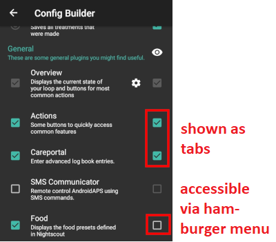

# Générateur de configuration

Selon vos paramètres, vous pouvez ouvrir le générateur de configuration via un onglet situé en haut de l'écran ou via le menu hamburger.

Le Générateur de configuration (Conf) est l'onglet dans lequel vous activez et désactivez les fonctions modulaires. Les cases du côté gauche (A) vous permettent de choisir celles à utiliser, les cases du côté droit (C) vous permettent de les visualiser sous forme d'onglet (E) dans AndroidAPS. Si la case de droite n'est pas cochée, vous pouvez atteindre la fonction en utilisant le menu hamburger (D) en haut à gauche de l'écran.

Lorsque des paramètres supplémentaires sont disponibles dans le module, vous pouvez cliquer sur la roue crantée (B) qui vous amènera a des paramètres spécifiques dans les préférences.

**Première configuration :** Depuis lAPS 2.0, un assistant de configuration vous guide à travers le processus de configuration de AndroidAPS. Appuyez sur le menu 3 points en haut à droite de l'écran (F) et sélectionnez 'Assistant de configuration' pour l'utiliser.

## Onglet ou menu hamburger

Avec la case à cocher sous le symbole de l'oeil, vous pouvez décider comment ouvrir la section correspondante du programme.

## Profil

Sélectionnez le profil de basal que vous souhaitez utiliser. Voir la page [Profils](../Usage/Profiles.md) pour plus d'informations sur la configuration.

### Profil local (recommandé)

Le profil local utilise le profil de basal entré manuellement sur le téléphone. Dès qu'il est sélectionné, un nouvel onglet apparaît dans AAPS, où vous pouvez modifier les données de profil lues à partir de la pompe si nécessaire. Avec le changement de profil suivant, les données sont ensuite écrites dans la pompe dans le profil 1. Ce profil est recommandé car il ne dépend pas de la connectivité Internet.

Vos profils locaux font partie des [paramètres exportés](../Usage/ExportImportSettings.rst). Donc assurez vous d'avoir une sauvegarde dans un endroit sûr.

Boutons :

* Plus vert : ajouter
* X rouge : supprimer
* Flèche bleue : dupliquer

If you make any changes to your profile, make sure, you are editing the correct profile. In profile tab there is not always shown the actual profile beeing used - e.g. if you made a profile switch by using the profile tab on homescreen it may differ from the profile actually shown in profile tab as there is no connection between these.

#### Dupliquer un changement de profil

You can easily create a new local profile from a profile switch. In this case timeshift and percentage will be applied to the new local profile.

1. Allez dans l'onglet Traitements.
2. Sélectionnez Changement Profil.
3. Appuyez sur "Dupliquer".
4. Vous pouvez éditer le nouveau profil local dans l'onglet Profil local (PL) ou via le menu hamburger.

If you want to switch from Nightscout profile to local profile just do a profile switch on your NS profile and clone the profile switch as described above.

#### Remonter les profils locaux sur Nightscout

Local profiles can also be uploaded to Nightscout. The settings can be found in NS Client preferences.

Advantage:

* il n'est pas nécessaire d'avoir une connexion internet pour modifier les paramètres du profil
* les modifications du profil peuvent être effectuées directement sur le téléphone
* un nouveau profil peut être créé à partir d'un changement de profil
* les profils locaux peuvent être téléchargés sur Nightscout

Disadvantage:

* aucun

### Profil NS

NS Profile uses the profiles you have saved on your Nightscout site (https://[yournightscoutsiteaddress]/profile). You can use the [Profile Switch](../Usage/Profiles.md) to change which of those profiles is active, this writes the profile to the pump in case of AndroidAPS failure. This allows you to easily create multiple profiles in Nightscout (i.e.. work, home, sports, holidays, etc.). Shortly after clicking on "Save" they will be transferred to AAPS if your smartphone is online. Even without an Internet connection or without a connection to Nightscout, the Nightscout profiles are available in AAPS once they have been synchronized.

Do a **profile switch** to activate a profile from Nightscout. Press and hold the current profile in the AAPS homescreen at the top (grey field between the light blue "Open/Closed Loop" field and the dark blue target area field) > Profile switch > Select profile > OK. AAPS also writes the selected profile into the pump after the profile change, so that it is available without AAPS in an emergency and continues to run.

Advantage:

* profils multiples
* facile à modifier via un PC ou une tablette

Disadvantage:

* aucune modification locale des paramètres de profil
* le profil ne peut pas être modifié directement sur le téléphone

## Insuline

Select the type of insulin curve you are using. The options 'Rapid-Acting Oref', Ultra-Rapid Oref' and 'Free-Peak Oref' all have an exponential shape. More information is listed in the [OpenAPS docs](http://openaps.readthedocs.io/en/latest/docs/While%20You%20Wait%20For%20Gear/understanding-insulin-on-board-calculations.html#understanding-the-new-iob-curves-based-on-exponential-activity-curves), the curves will vary based on the DIA and the time to peak.

The DIA is not the same for each person. That's why you have to test it for yourself. But it must always be at least 5 hours. You can read more about that in the Insulin Profile section of [this](../Getting-Started/Screenshots#insulin-profile) page.

For Rapid-Acting and Ultra-Rapid, the DIA is the only variable you can adjust by yourself, the time to peak is fixed. Free-Peak allows you to adjust both the DIA and the time to peak, and must only be used by advanced users who know the effects of these settings.

The [insulin curve graph](../Getting-Started/Screenshots#insulin-profile) helps you to understand the different curves. You can view it by enabling the tickbox to show it as a tab, otherwise it will be in the hamburger menu.

### Insuline à Action Rapide Oref 

* recommandé pour Humalog, Novolog et Novorapid
* DAI = au moins 5.0h
* Pic maxi = 75 minutes après l'injection (fixe, non réglable)

### Insuline Ultra Rapide Oref

* recommendé pour FIASP
* DAI = au moins 5.0h
* Pic maxi = 55 minutes après l'injection (fixe, non réglable)

For a lot of people there is practically no noticeable effect of FIASP after 3-4 hours any more, even if 0.0xx units are available as a rule then. This residual amount can still be noticeable during sports, for example. Therefore, AndroidAPS uses minimum 5h as DIA.

### Profil d'insuline ajustable Oref

With the "Free Peak 0ref" profile you can individually enter the peak time. The DIA is automatically set to 5 hours if it is not specified higher in the profile.

This effect profile is recommended if an unbacked insulin or a mixture of different insulins is used.

## Source GLY

Select the blood glucose source you are using - see [BG Source](BG-Source.rst) page for more setup information.

* [xDrip+](https://xdrip-plus-updates.appspot.com/stable/xdrip-plus-latest.apk)
* Glycémie NSClient
* [Medtronic 640g](https://github.com/pazaan/600SeriesAndroidUploader/releases)
* [Glimp](https://play.google.com/store/apps/details?id=it.ct.glicemia&hl=de) - seule la version 4.15.57 et plus récentes sont prise en charge
* [App Dexcom (patché)](https://github.com/dexcomapp/dexcomapp/) - Sélectionnez "Envoyer des données Gly à xDrip+" si vous voulez utiliser des alarmes xDrip+.
    
    

* [Poctech](http://www.poctechcorp.com/en/contents/268/5682.html)

## Pompe

Select the pump you are using.

* [DanaR](DanaR-Insulin-Pump.md)
* DanaR coréenne (pour la pompe DanaR domestique)
* DanaRv2 (pompe DanaR avec mise à niveau firmware)
* [DanaRS](DanaRS-Insulin-Pump.md)
* [Pompe Accu-Chek Combo](Accu-Chek-Combo-Pump.md) (nécessite l'installation de ruffy)
* MIQ (Permet de recevoir des suggestions de AAPS pour des thérapies avec de Multiples Injection Quotidiennes)
* Pompe virtuelle (boucle ouverte pour les pompes qui n'ont pas encore de pilote - suggestions AAPS uniquement)

For dana pumps, use **Advanced settings** to activate BT watchdog if necessary. It switches off bluetooth for one second if no connection to the pump is possible. This may help on some phones where the bluetooth stack freezes.

## Estimation de Sensibilité

Select the type of sensitivity detection. This will analyze historical data on the go and make adjustments if it recognizes that you are reacting more sensitively (or conversely, more resistant) to insulin than usual. Details about the Sensitivity Oref0 algorithm can be read in the [OpenAPS docs](http://openaps.readthedocs.io/en/latest/docs/walkthrough/phase-4/advanced-features.html#auto-sensitivity-mode).

You can view your sensitivity on the homescreen by selecting SEN and watching the white line. Note, you need to be in [Objective 8](../Usage/Objectives#objective-8-adjust-basals-and-ratios-if-needed-and-then-enable-autosens) in order to let Sensitivity Detection/[Autosens](../Usage/Open-APS-features.html#autosens) automatically adjust the amount of insulin delivered. Before reaching that objective, the Autosens percentage / the line in your graph is displayed for information only.

### Paramètres d’absorption

If you use Oref1 with SMB you must change **min_5m_carbimpact** to 8. The value is only used during gaps in CGM readings or when physical activity "uses up" all the blood glucose rise that would otherwise cause AAPS to decay COB. At times when [carb absorption](../Usage/COB-calculation.rst) can't be dynamically worked out based on your bloods reactions it inserts a default decay to your carbs. Basically, it is a failsafe.

## APS

Select the desired APS algorithm for therapy adjustments. You can view the active detail of the chosen algorithm in the OpenAPS(OAPS) tab.

* OpenAPS MA (Assistant Repas, état de l'algorithme en 2016)
* OpenAPS AMA (Assistance Améliorée Repas, état de l'algorithme en 2017)  
    Plus de détails sur OpenAPS AMA peuvent être trouvé dans la [documentation OpenAPS](http://openaps.readthedocs.io/en/latest/docs/Customize-Iterate/autosens.html#advanced-meal-assist-or-ama). En termes simples, les avantages sont une fois que vous vous êtes fait un bolus de repas, le système peut augmenter la basale temp plus rapidement SI vous entrez des glucides de manière fiable.  
    Notez que vous devez être à l'[Objectif 9](../Usage/Objectives#objectif-9-activation-de-fonctionnalites-supplementaires-en-journee-comme-l-aide-au-repas-amelioree-ara-ama) pour utiliser OpenAPS AMA.
* [OpenAPS SMB](../Usage/Open-APS-features.md) (Super Micro Bolus, l'algorithme le plus récent pour les utilisateurs avancés)  
    Notez que vous devez être à l'[Objectif 10](../Usage/Objectives#objectif-10-activation-de-fonctionnalites-supplementaires-pour-l-utilisation-en-journee-telles-que-la-fonction-smb) pour utiliser OpenAPS SMB et min_5m_carbimpact doit être mis à 8 dans le Générateur de configuration > Sensitivity detection > Estimation de Sensibilité > paramètres Oref1.

## Boucle

Define whether you want to allow AAPS automatic controls or not.

### Boucle Ouverte

AAPS continuously evaluates all available data (IOB, COB, BG...) and makes treatment suggestions on how to adjust your therapy if necessary. The suggestions will not be executed automatically (as in closed loop) have to be entered manually into the pump or by using a button in case you are using a compatible pump (Dana R/RS or Accu Chek Combo). This option is for getting to know how AndroidAPS works or if you are using an unsupported pump.

### Boucle Fermée

AAPS continuously evaluates all available data (IOB, COB, BG...) and automatically adjusts the treatment if necessary (i.e. without further intervention by you) to reach the set target range or value (bolus delivery, temporary basal rate, insulin switch-off to avoid hypo etc.). The Closed Loop works within numerous safety limits, which you can be set individually. Closed Loop is only possible if you are in [Objective 6](../Usage/Objectives#objective-6-starting-to-close-the-loop-with-low-glucose-suspend) or higher and use a supported pump.

## Objectifs (programme d'apprentissage)

AndroidAPS has a number of objectives that you have to fulfill step by step. This should guide you safely through setting up a closed loop system. It guarantees that you have set everything up correctly and understand what the system does exactly. This is the only way you can trust the system.

You should [export your settings](../Usage/ExportImportSettings.rst) (including progress of the objectives) on a regularly basis. In case you have to replace your smartphone later (new purchase, display damage etc.) you can simply import those settings.

See [Objectives](../Usage/Objectives.rst) page for more information.

## Traitements

If you view the Treatments (Treat) tab, you can see the treatments that have been uploaded to nightscout. Should you wish to edit or delete an entry (e.g. you ate less carbs than you expected) then select 'Remove' and enter the new value (change the time if necessary) through the [carbs button on the home screen](../Getting-Started/Screenshots.md#carb-correction).

## Généralités

### Aperçu

Displays the current state of your loop and buttons for most common actions (see [section The Homescreen](../Getting-Started/Screenshots.md) for details). Settings can be accessed by clicking the cog wheel.

#### Garder l'écran allumé

Option 'Keep screen on' will force Android to keep the screen on at all times. This is useful for presentations etc. But it consumes a lot of battery power. Therefore, it is recommended to connect the smartphone to a charger cable.

#### Boutons

Define which Buttons are shown on the home screen.

* Traitements
* Calculatrice
* Insuline
* Glucides
* MGC (ouvre xDrip+)
* Étalonnage

Furthermore, you can set shortcuts for insulin and carb increments and decide whether the notes field should be shown in treatment dialogues.

#### Paramètres de l'Assistant Rapide

Create a button for a certain standard meal (carbs and calculation method for the bolus) which will be displayed on the home screen. Use for standard meals frequently eaten. If different times are specified for the different meals you will always have the appropriate standard meal button on the home screen, depending on the time of day.

Note: Button will not be visible if outside the specified time range or if you have enough IOB to cover the carbs defined in the QuickWizard button.

#### Paramètres Avancés

Enable super bolus functionality in wizard. Use with caution and do not enable until you learn what it really does. Basically, the basal for the next two hours is added to the bolus and a two hour zero-temp activated. **AAPS looping functions will be disabled - so use with care! If you use SMB AAPS looping functions will be disabled according to your settings in ["Max minutes of basal to limit SMB to"](../Usage/Open-APS-features#max-minutes-of-basal-to-limit-smb-to), if you do not use SMB looping functions will be disabled for two hours.** Details on super bolus can be found [here](https://www.diabetesnet.com/diabetes-technology/blue-skying/super-bolus).

### Actions

Some buttons to quickly access common features:

* Changement de profils (voir la page [Changement de profil](../Usage/Profiles.md) pour plus d'informations sur la configuration)
* Cibles temporaires
* Définir/Annuler des Débit de Base
* Bolus étendu (pompe DanaR/RS ou Combo uniquement)
* Enregistrement de tous les soins spécifiques
    
    * Contrôle de la glycémie
    * Amorcer/Remplir - enregistrement d'un changement de site et d'un changement de cartouche (si pas fait sur la pompe)
    * Pose du capteur MGC
    * Changement de la pile de pompe
    * Remarque
    * Activité Physique
* Affichage des informations capteur, insuline, canule et age de la pile de pompe
* Historique
* DTI (Dosage Total d'Insuline quotidien = bolus + basale par jour)

Some doctors use - especially for new pumpers - a basal-bolus-ratio of 50:50. Therefore ratio is calculated as TDD / 2 * TBB (Total base basal = sum of basal rate within 24 hours). Others prefer range of 32% to 37% of TDD for TBB. Like most of these rules-of-thumb it is of limited real validity. Note: Your diabetes may vary!

### Communicateur SMS

Allows remote caregivers to control some AndroidAPS features via SMS, see [SMS Commands](../Children/SMS-Commands.rst) for more setup information.

### Aliments

Displays the food presets defined in the Nightscout food database, see [Nightscout Readme](https://github.com/nightscout/cgm-remote-monitor#food-custom-foods) for more setup information.

Note: Entries cannot be used in the AndroidAPS calculator. (View only)

### Wear

Monitor and control AAPS using your Android Wear watch (see [page Watchfaces](../Configuration/Watchfaces.md)). Use settings (cog wheel) to define which variables should be considered when calculating bolus given though your watch (i.e. 15min trend, COB...).

Si vous voulez commander AAPS depuis la montre (bolus etc) alors dans les "Paramètres Wear" vous devez activer "Commandes depuis la montre".

Through Wear tab or hamburger menu (top left of screen, if tab is not displayed) you can

* Renvoyer toutes les données. Cela peut être utile si la montre n'est pas connectée pendant un certain temps et que vous voulez envoyer toutes les informations à la montre.
* Ouvrez le menu Paramètres de votre montre directement depuis votre téléphone.

### Barre d'état pour xDrip (Montre)

Display loop information on your xDrip+ watchface (if you are not using AAPS/[AAPSv2 watchface](../Configuration/Watchfaces.md)

### Notification en cours

Displays a summary of current BG, delta, active TBR%, active basal u/h and profile, IOB and split into bolus IOB and basal IOB on the phones's dropdown screen and phone's lock screen.

### NS Client

Setup sync of your AndroidAPS data with Nightscout.

If **Log app start to NS** is activated each AndroidAPS will be visible in Nightscout. Might be useful to detect problems with the app (i.e. battery optimization not disabled for AAPS) but can flood the Nightscout graph with entries.

#### Options d'alarme

Activate/deactivate AndroidAPS alarms

#### Paramètres de connexion

Offline looping, disable roaming...

If you want to use only a specific WiFi network you can enter its **WiFi SSID **. Several SSIDs can be separated by semicolon. To delete all SSIDs enter a blank space in the field.

#### Paramètres Avancés

* Remplissage automatique des glycémies manquantes en utilisant NS
* Créer des messages d'erreurs Créer une annonce Nightscout pour les messages d'erreur et les alertes locales (également visible dans la section Careportal de l'onglet traitements)
* Activer la diffusion locale vers d'autres applications telles que xDrip +
* Remonter uniquement vers NS (synchronisation désactivée)
* Pas de téléchargement vers NS
* Utiliser toujours les valeurs absolues du basal -> Doit être activé si vous voulez utiliser [Autotune](https://openaps.readthedocs.io/en/latest/docs/Customize-Iterate/autotune.html) correctement.

### Maintenance

Email and number of logs to be send. Normally no change necessary.

### Générateur de configuration

Use tab for config builder instead of hamburger menu.