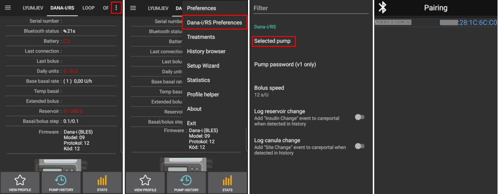

# Pompe DanaRS et Dana-i

*Ces instructions décrivent la configuration de l’application et de votre pompe si vous avez une DanaRS commercialisée depuis 2017 ou la nouvelle Dana-i. Visitez la [pompe à insuline Dana R](./DanaR-Insulin-Pump) si vous avez plutôt la pompe initiale DanaR.*

**Le nouveau firmware Dana RS v3 peut être utilisé depuis la version 2.7 d'AndroidAPS.**

**La nouvelle Dana-i peut être utilisée depuis la version 3.0 d'AndroidAPS.**

* Sur la pompe DanaRS/i, pompe « BASAL A » est utilisé par l'application. Les données existantes se font écrasé.

(DanaRS-Insulin-Pump-pairing-pump)=

## Appairage de la pompe

* Sur l'écran d'accueil AndroidAPS, cliquez sur le menu hamburger en haut à gauche et allez dans le Générateur de Configuration.
* Dans la section Pompe, sélectionnez 'Dana-i/RS'.
* Cliquez sur la roue crantée pour accéder directement aux paramètres de la pompe ou retourner à l'écran d'accueil.
    
    

* Allez dans l'onglet 'DANA-i/RS'.

* Sélectionnez le Menu des préférences en appuyant sur le menu 3 points en haut à droite. 
* Sélectionnez 'Préférences Dana-i/R'.
* Cliquez sur "Pompe sélectionnée".
* Dans la fenêtre d'appairage, cliquez sur l'entrée correspondant à votre pompe.
    
    

* **Vous devez confirmer l'appairage sur la pompe !** C'est juste la façon dont vous êtes habitués à faire d'autres appairages bluetooth (par ex. le smartphone et l'audio de la voiture).
    
    

* Suivez le processus d'appairage basé sur le type et le firmware de votre pompe :
    
    * Pour DanaRS v1, sélectionnez le mot de passe de la pompe dans les préférences et définissez votre mot de passe.
    * Pour DanaRS v3, vous devez taper 2 séquences de chiffres et de lettres affichées sur la pompe dans la boîte de dialogue d'appairage AndroidAPS.
    * Pour Dana-i la boîte de dialogue d'appairage standard Android apparaît et vous devez entrer le numéro à 6 chiffres affiché sur la pompe.

* Sélectionner la vitesse de Bolus pour changer la vitesse de Bolus par défaut souhaitée (12 sec par 1 U, 30 sec par 1 U ou 60 sec par 1 U).

* Régler l'incrément Basale sur pompe à 0,01 U/h en utilisant le menu Médecin (voir le guide de l’utilisateur de la pompe).
* Régler l'incrément Bolus sur la pompe à 0,05 U/h en utilisant le menu de Médecin (voir le guide de l’utilisateur de la pompe).
* Activez les Bolus Étendus sur la pompe

(DanaRS-Insulin-Pump-default-password)=

### Mot de passe par défaut

* Pour les DanaRS avec le firmware v1 et v2, le mot de passe par défaut est 1234.
* Pour la DanaRS avec le firmware v3 ou la Dana-i, le mot de passe par défaut est une combinaison du mois de production et de la date de production (par ex. mois 01 et jour 24).
    
    * Sur votre pompe ouvrez le menu principal -> Rapport -> Info produit. 
    * Le numéro 3 est la date de production. 
    * Pour v3/i, ce mot de passe est utilisé uniquement pour verrouiller le menu sur la pompe. Il n'est pas utilisé pour la communication et il n'est pas nécessaire de le saisir dans AndroidAPS.

(DanaRS-Insulin-Pump-change-password-on-pump)=

## Changer de mot de passe sur la pompe

* Appuyez sur le bouton OK de la pompe
* Dans le menu principal, sélectionnez "OPTION" (déplacer à droite en appuyant sur le bouton flèche plusieurs fois)
    
    

* Dans le menu Options, sélectionnez "OPTION UTILISATEUR"
    
    

* Utilisez le bouton flèche pour faire défiler vers le bas jusqu'à " 11. Mot de passe "
    
    

* Appuyez sur OK pour saisir l'ancien mot de passe.

* Entrez **l'ancien mot de passe** (mot de passe par défaut voir [au-dessus](#mot-de-passe-par-defaut)) et appuyez sur OK
    
    

* Si un mauvais mot de passe est entré ici, il n'y aura pas de message indiquant l'échec !

* Définissez un **nouveau mot de passe** (Modifiez les numéros avec les boutons + & - / Déplacez vers la droite avec le bouton flèche).
    
    

* Confirmez avec le bouton OK.

* Sauvegardez en appuyant à nouveau sur le bouton OK.
    
    

* Déplacer vers le bas jusqu'à " 14. QUITTEZ " et appuyez sur le bouton OK.
    
    

(DanaRS-Insulin-Pump-dana-rs-specific-errors)=

## Erreurs spécifiques à DanaRS

### Erreur lors de la distribution de l'insuline

In case the connection between AAPS and Dana RS is lost during bolus insulin delivery (i.e. you walk away from phone while Dana RS is pumping insulin) you will see the following message and hear an alarm sound.

* Dans la plupart des cas c'est juste un problème de communication et la quantité d'insuline délivrée est correcte.
* Vérifiez dans l'historique de la pompe (à la pompe ou à l'aide de l'onglet Dana > historique de la pompe > bolus) si le bolus est correct.
* Delete error entry in [treatments tab](Screenshots-carb-correction) if you wish.
* Le montant réel est lu et enregistré lors de la prochaine connexion. Pour forcer cette mise à jour, appuyez sur l'icône BT dans l'onglet dana ou attendez juste la prochaine connexion.

## Remarque spéciale lors du changement de téléphone

When switching to a new phone the following steps are necessary:

* [Export settings](ExportImportSettings-export-settings) on your old phone
* Transférez les paramètres de l'ancien vers le nouveau téléphone

### DanaRS v1

* **Appairer manuellement** DanaRS avec le nouveau téléphone
* Comme les paramètres de connexion de la pompe sont également importés dans AAPS sur votre nouveau téléphone, il va déjà "connaître" la pompe et donc ne démarrera pas une analyse bluetooth. Par conséquent, le nouveau téléphone et la pompe doivent être appairés manuellement.
* Installez AndroidAPS sur le nouveau téléphone.
* [Import settings](ExportImportSettings-import-settings) on your new phone

### DanaRS v3, Dana-i

* Start pairing procedure like decribed [above](DanaRS-Insulin-Pump-pairing-pump).
* Il est parfois nécessaire d'effacer les informations d'appairage dans AndroidAPS en faisant un clic long sur l'icône BT dans l'onglet Dana-i/RS.

## Voyager avec différents fuseaux horaires avec la pompe DanaR

For information on traveling across time zones see section [Timezone traveling with pumps](Timezone-traveling-danarv2-danars).