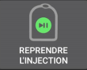

# Omnipod Dash

Ces instructions sont pour configurer la pompe de génération **Omnipod DASH** **(et pas Omnipod Eros)**. Le pilote Omnipod est disponible dans AndroidAPS (AAPS) depuis la version 3.0.

**Ce logiciel est une partie d'un système de pancréas artificiel "Do it yourself" (faire soi-même), et ce n’est pas un produit fini destiné à la mise sur le marché. VOUS devez obligatoirement lire, apprendre et comprendre ce système, y compris la façon de l’utiliser. Attention, vous êtes le seul responsable de ce que vous faite avec ce système.**

## Spécifications de DASH Omnipod

Ce sont les spécifications du **Omnipod DASH** et ce qui le différencie du **Omnipod EROS**:

* Les pompes DASH sont identifiées par un bouchon d'aiguille bleue (EROS a un bouchon d'aiguille clair). Les pods sont par ailleurs identiques en termes de dimensions physiques
* Pas besoin d'un dispositif de liaison Omnipod / pont BLE séparé (pas de RileyLink, OrangeLink ou EmaLink nécessaires).
* Connexion BT uniquement lorsque c'est nécessaire, se connecte pour envoyer la commande et se déconnecte immédiatement après !
* Plus aucune erreur du type "aucune connexion au périphérique / pod"
* AAPS attendra l'accessibilité du pod pour envoyer des commandes
* Lors de l'activation, AAPS trouvera et se connectera à un nouveau pod DASH.
* Distance usuelle : 5-10 mètres (selon les téléphones)

## Configuration matérielle et logicielle requise

* Un nouveau pod **Omnipod DASH** (identifié par un bouchon d'aiguille bleu)

* **Un téléphone Android compatible** avec une connexion Bluetooth BLE
   -  Tous les téléphones et versions d'Android ne sont pas garanties de fonctionner. Veuillez vérifier [**les téléphones testés avec DASH**](https://docs.google.com/spreadsheets/d/1zO-Vf3wv0jji5Gflk6pe48oi348ApF5RvMcI6NG5TnY) ou essayez simplement avec votre téléphone et dites-nous le résultat (référence du téléphone et région géographique, version d'Android, fonctionné / quelques difficultés / n'a pas fonctionné).
   - **Remarque importante : Il y a eu de multiples cas de pertes de connexion permanentes et non récupérables lors de l'utilisation de pods anciens avec la version 3.XX.X. Soyez prudent lorsque vous utilisez ces vieux pods avec AndroidAPS, en particulier en même temps que d'autres périphériques Bluetooth !**  
     Sachez que le pilote AAPS Omnipod Dash se connecte au POD DASH via Bluetooth chaque fois qu'il envoie une commande, et il se déconnecte juste après. Les connexions Bluetooth peuvent être perturbées par d'autres périphériques connectés au téléphone qui exécutent AAPS, comme les écouteurs etc... (qui peuvent occasionner, dans des rares occasions, des problèmes de connexion ou des erreurs/perte de pod lors de l'activation ou par la suite pour certains téléphones), ou être perturbés par elle.
   -  **Version 3.0 or newer of AndroidAPS built and installed** using the [**Build APK**](../Installing-AndroidAPS/Building-APK.md) instructions.
* [**Moniteur Glycémie continue (MGC)**](https://androidaps.readthedocs.io/en/latest/Configuration/BG-Source.html)

Ces instructions supposent que vous commencez une nouvelle session de pod; si ce n'est pas le cas, soyez patient et essayez de commencer ce processus lors de votre prochain changement de pod.

## Avant de commencer

**SÉCURITÉ D'ABORD** - ne pas essayer ce processus dans un environnement où vous ne pouvez pas récupérer d'une erreur (pods supplémentaires, insuline, et les smartphones sont nécessaires).

**Votre PDM Omnipod Dash ne fonctionnera plus suite à l'activation de votre pod avec le pilote AAPS Dash.** Vous avez précédemment utilisé votre PDM Dash pour envoyer des commandes à votre Dash pod. Un pod Dash ne permet qu'à un seul périphérique d'envoyer des commandes pour communiquer avec lui. L'appareil qui active le pod avec succès est le seul appareil autorisé à communiquer avec lui à partir de ce moment. Cela signifie que lorsque vous activez un pod Dash avec votre téléphone Android via le pilote AAPS Dash, **vous ne serez plus en mesure d'utiliser votre PDM avec ce pod**. Le pilote AAPS Dash de votre téléphone Android devient maintenant votre PDM.

*Cela ne veut pas dire que vous pouvez jeter votre PDM, il est recommandé de le garder comme une sauvegarde, et en cas d'urgence dans le cas où vous perdez votre téléphone ou AAPS ne fonctionne pas correctement.*

**Votre pod n'arrêtera pas de délivrer d'insuline lorsqu'il n'est pas connecté à AndroidAPS**. Les débits de basal par défaut définis dans le profil actif actuel sont programmés dans le pod lors de l'activation. Tant qu'AndroidAPS est opérationnel, il enverra des commandes de débit de base qui s'exécuteront pendant 120 minutes au maximum. Lorsque, pour une raison quelconque, le pod ne reçoit pas de nouvelles commandes (par exemple parce que la communication a été perdue à cause de la distance Pod - téléphone) le pod retourne automatiquement aux débits de basal par défaut.

**Les profils de débit de base 30 min NE sont PAS pris en charge dans AndroidAPS.** **Le profil AndroidAPS ne supporte pas une période de 30 minutes de durée de débit basal** Si vous êtes nouveau sur AndroidAPS et que vous configurez votre profil de débit de basal pour la première fois; veuillez noter que les débits de basal à partir d'une demi-heure ne sont pas pris en charge, et vous devrez ajuster votre profil de débit de basal pour commencer au début de l'heure. Par exemple, si vous avez un débit de basal de 1,1 unités qui commence à 09h30 et a une durée de 2 heures se terminant à 11h30, cela ne marchera pas. Vous devrez mettre à jour ce taux de basal de 1,1 sur une plage horaire de 9h00 à 11h00 ou de 10h00 à 12h00. Même si Omnipod Dash lui-même prend en charge les incréments de débit basal de 30 min, AndroidAPS n'est pas en mesure de les prendre en compte avec ses algorithmes actuellement.

## Activation du Driver Dash dans AAPS

Vous pouvez activer le pilote Dash dans AAPS de **deux façons**:

### Option 1 : Nouvelles installations

Lorsque vous installez AndroidAPS pour la première fois, l' **Assistant d'installation** vous guidera dans l'installation d'AndroidAPS. Sélectionnez « DASH » lorsque vous atteignez la sélection de pompe.

En cas de doute, vous pouvez également sélectionner « Pompe virtuelle » et sélectionner « DASH » plus tard, après avoir configuré AndroidAPS (voir l’option 2).

### Option 2 : Le Générateur de configuration

Sur une installation existante, vous pouvez sélectionner la pompe **DASH** dans l'Assistant de configuration :

Sur le coin en haut à gauche dans le ** menu hamburger** sélectionnez **Configuration (1)**\ ➜\ **Pompe**\ ➜\ **Dash**\ ➜\ **Roue crantée des paramètres (3)** en sélectionnant le **bouton radio (2)** intitulé **Dash**.

La sélection de la **case à cocher (4)** à côté de la **Roue crantée des Paramètres (3)** permettra d'afficher le menu DASH sous la forme d'un onglet dans l'interface AAPS intitulée **DASH**. Cocher cette case facilitera votre accès aux commandes DASH lorsque vous utilisez AAPS.

**NOTE:** A faster way to access the [**Dash settings**](DanaRS-Insulin-Pump-dash-settings) can be found below in the Dash settings section of this document.

### Vérification de la sélection du pilote Omnipod

Pour vérifier que vous avez activé le pilote Dash dans AAPS, si vous avez coché la case (4), **glisser vers la gauche** depuis l'onglet **Aperçu** , où vous verrez maintenant un onglet **DASH**. Si vous n'avez pas coché la case, vous trouverez l'onglet DASH dans le menu hamburger en haut à gauche.

## Configuration du Dash

Veuillez **glisser vers la gauche** vers l'onglet **DASH** où vous serez en mesure de gérer toutes les fonctions du pod (certaines de ces fonctions ne sont pas activées ou visibles sans une session pod active):

 Rafraîchir la connectivité et le statut du Pod, être en mesure de couper les alarmes lorsque le pod émet un bip

 Gestion du Pod (activer, désactiver, jouer le bip de test et l'historique du Pod)

(OmnipodDASH-activate-pod)=

### Activer le Pod

1. Naviguez vers l'onglet **DASH** et cliquez sur le bouton **POD MGMT (1)** , puis cliquez sur **Activer Pod (2)**.

    

2. L'écran **Remplir le pod** s'affiche. Remplissez le nouveau pod avec au moins 80 unités d'insuline et écoutez le deux bips indiquant que le pod est prêt à être amorcé. Lors du calcul de la quantité totale d'insuline dont vous avez besoin pour 3 jours, veuillez prendre en compte que l'amorçage du pod utilisera de 3 à 10 unités.

    

Ensure that the new pod and the phone running AAPS are within close proximity of each other and click the **Next** button.

**NOTE**: Just in case you get the below error message (this can happen), do not panic. Click on the **Retry** button. In most situations activation will continue successfully.

3. Sur l'écran **Initialiser le Pod** le pod commencera à amorcer (vous entendrez un clic suivi d'une série de tics pendant que le pod s'amorce).  Une coche verte s'affichera en cas d'amorçage réussi, et le bouton **Suivant** sera activé. Cliquer sur le bouton **Suivant** pour terminer l'initialisation de l'amorçage du pod et afficher l'écran **Attacher Pod**.

    

4. Ensuite, préparer le site de perfusion du nouveau pod. Retirez le bouchon en plastique de l'aiguille du Pod. Si vous voyez quelque chose qui depasse du pod, annulez le processus et recommencez avec un nouveau pod. Si tout semble OK, retirez le papier blanc de protection de l'adhésif et appliquez le pod sur le site sélectionné sur votre corps. Une fois terminé, cliquez sur le bouton **Suivant**.

5. La boîte de dialogue **Attacher Pod** apparaîtra. **cliquez sur le bouton OK UNIQUEMENT si vous êtes prêt à déployer la canule**.

6. Après avoir appuyé sur **OK**, il peut se passer un certain temps avant que le pod Dash réponde et insère la canule (1-2 minutes maximum), donc soyez patient.

 *REMARQUE : Avant d'insérer la canule, il est recommandé de pincer la peau près du point d'insertion de la canule. Cela permet une insertion en douceur de l'aiguille et réduira les risques d'occlusions.*

    

7. Une coche verte s'affiche, et le bouton **Suivant** est activé en cas d'insertion de canule réussie. Cliquer sur le button **Suivant**.

9. L'écran **Pod activé** s'affiche. Cliquer sur le bouton vert **Terminé**. Félicitations ! Vous avez démarré une nouvelle session de Pod actif.

10. L'écran de menu **Gestion pod** devrait maintenant afficher le bouton **Activer Pod (1)** *désactivé* et le **Désactiver Pod (2)** bouton *activé*. Ceci est dû au fait qu'un pod est maintenant actif et que vous ne pouvez pas activer un pod supplémentaire sans désactiver d'abord le pod actuellement actif.

    Cliquez sur le bouton Retour de votre téléphone pour retourner à l'onglet **DASH** qui affichera maintenant les informations du Pod pour votre session active de pod, y compris le débit de basal actuel, le niveau du réservoir de pod, l'insuline délivrée, les erreurs de pod et les alertes.

    For more details on the information displayed go to the [**DASH Tab**](OmnipodDASH-dash-tab) section of this document.

    

It is good practice to export settings AFTER activating the pod. Do this at each pod change and once a month, copy the exported file to your internet drive. see [**Export settings Doc**](https://androidaps.readthedocs.io/en/latest/Usage/ExportImportSettings.html?highlight=exporting#export-import-settings).

(OmnipodDASH-deactivate-pod)=

### Désactiver Pod

Under normal circumstances, the expected lifetime of a pod is three days (72 hours) and an additional 8 hours after the pod expiration warning for a total of 80 hours of pod usage.

To deactivate a pod (either from expiration or from a pod failure):

1. Allez à l'onglet **DASH** , cliquez sur le bouton **POD MGMT (1)** , sur l'écran de **Gestion du pod** cliquez sur le bouton **Désactiver Pod (2)**.

    

2. Sur l'écran **Désactiver Pod** , cliquez sur le bouton **Suivant** pour commencer le processus de désactivation du pod. Vous recevrez un bip de confirmation du pod indiquant une désactivation réussie.

 

3. Une coche verte apparaîtra une fois la désactivation réussie. Cliquer sur le bouton **Suivant** pour afficher l'écran désactivé du pod. Vous pouvez maintenant supprimer votre pod car la session active a été désactivée.

4. Cliquez sur le bouton vert pour retourner à l'écran de **Gestion du Pod**.

5. Vous êtes maintenant dans le menu **Gestion de pod** ; appuyez sur le bouton retour de votre téléphone pour retourner à l'onglet **DASH**. Verify that the **Pod status:** field displays a **No active Pod** message.

 

(OmnipodDASH-resuming-insulin-delivery)=

### Reprendre l'injection d'insuline

**Note**: During profile switches, dash must suspend delivery before setting the new basal profile. If communication fails between the two commands, then delivery can be suspended. Read [**Delivery suspended**](OmnipodDASH) in the troubleshooting section for more details.

Use this command to instruct the active, currently suspended pod to resume insulin delivery. After the command is successfully processed, insulin will resume normal delivery using the current basal rate based on the current time from the active basal profile. The pod will again accept commands for bolus, TBR, and SMB.

1. Allez à l'onglet **DASH** et assurez-vous que le champ **statut du pod (1)** affiche **SUSPENDU**, puis appuyez sur le bouton **REPRENDRE LA LIVRAISON (2)** pour démarrer le processus pour indiquer au pod actuel de reprendre la distribution normale d'insuline. Un message **REPRENDRE LA LIVRAISON** s'affichera dans le champ **Statut du pod (3)**.

   

2. Lorsque la commande de reprise de livraison est réussie, une boîte de dialogue de confirmation affichera le message **La livraison d'insuline a été reprise**. Cliquez sur **OK** pour confirmer et continuer.

3. L'onglet **DASH** mettra à jour le champ **état du pod (1)** pour afficher **En cours d'exécution,** et le bouton **Reprendre la distribution** ne sera plus affichés

### Arrêter les alarmes du pod

*NOTE - The SILENCE ALERTS button is only available on the **DASH** tab when the pod expiration or low reservoir alert has been triggered. If the SILENCE ALERTS button is not visible and you hear beep sounds from the pod, try to 'Refresh pod status'.*

The process below will show you how to acknowledge and dismiss pod beeps when the active pod time reaches the warning time limit before the pod expiration of 72 hours (3 days). This warning time limit is defined in the **Hours before shutdown** Dash alerts setting. The maximum life of a pod is 80 hours (3 days 8 hours), however Insulet recommends not exceeding the 72 hours (3 days) limit.

1. When the defined **Hours before shutdown** warning time limit is reached, the pod will issue warning beeps to inform you that it is approaching its expiration time and pod change will be required soon. You can verify this on the **DASH** tab, the **Pod expires: (1)** field will show the exact time the pod will expire (72 hours after activation), and the text will turn **red** after this time has passed. Under the **Active Pod alerts (2)** field the status message **Pod will expire soon** is displayed. This also will trigger displaying the **SILENCE ALERTS (3)** button.

2. Go to the **DASH** tab and press the **SILENCE ALERTS (2)** button . AAPS sends the command to the pod to deactivate the pod expiration warning beeps and updates the **Pod status (1)** field with **ACKNOWLEDGE ALERTS**.

3. Upon **successful deactivation** of the alerts, **2 beeps** will be issued by the active pod and a confirmation dialog will display the message **Activate alerts have been Silenced**. Click the **OK** button to confirm and dismiss the dialog.

4. Go to the **DASH** tab. Under the **Active Pod alerts** field, the warning message is no longer displayed, and the active pod will no longer issue pod expiration warning beeps.

(OmnipodDASH-view-pod-history)=

### Voir l'historique du Pod

This section shows you how to review your active pod history and filter by different action categories. The pod history tool allows you to view the actions and results committed to your currently active pod during its three days (72 - 80 hours) life.

This feature is helpful in verifying boluses, TBRs and basal commands that were sent to the pod. The remaining categories are useful for troubleshooting issues and determining the order of events that occurred leading up to a failure.

*NOTE:* **Only the last command can be uncertain**. New commands *will not be sent* until the **last 'uncertain' command becomes 'confirmed' or 'denied'**. The way to 'fix' uncertain commands is to **'refresh pod status'**.

1. Go to the **DASH** tab and press the **POD MGMT (1)** button to access the **Pod Management** menu and then press the **Pod history (2)** button to access the pod history screen.

 

2. On the **Pod history** screen, the default category of **All (1)** is displayed, showing the **Date and Time (2)** of all pod **Actions (3)** and **Results (4)** in reverse chronological order. Use your phone’s **back button 2 times** to return to the **DASH** tab in the main AAPS interface.

 

(OmnipodDASH-dash-tab)=

## Onglet DASH

Below is an explanation of the layout and meaning of the icons and status fields on the **DASH** tab in the main AAPS interface.

*NOTE: If any message in the **DASH** tab status fields report (uncertain), then you will need to press the Refresh button to clear it and refresh the pod status.*

### Champs

* **Bluetooth Address:** Displays the current bluetooth address of the connected Pod.
* **Bluetooth Status:** Displays the current connection status.
* **Sequence Number:** Displays the sequence number of the active POD.
* **Firmware Version:** Displays the firmware version for the active connection.
* **Time on Pod:** Displays the current time on the Pod.
* **Pod expires:** Displays the date and time when the Pod will expire.
* **Pod status:** Displays the Pod status.
* **Last connection:** Displays time of last communication with the Pod.

   - *Moments ago* - less than 20 seconds ago.
   - *Less than a minute ago* - more than 20 seconds but less than 60 seconds ago.
   - *1 minute ago* - more than 60 seconds but less than 120 seconds (2 min)
   - *XX minutes ago* - more than 2 minutes ago as defined by the value of XX

* **Last bolus:** Displays the amount of the last bolus sent to the active pod and how long ago it was issued in parenthesis.
* **Base Basal rate:** Displays the basal rate programmed for the current time from the basal rate profile.
* **Temp basal rate:** Displays the currently running Temporary Basal Rate in the following format

   - {Units per hour} @{TBR start time}  ({minutes run}/{total minutes TBR will be run})
   - *Example:* 0.00U/h @18:25 ( 90/120 minutes)

* **Reservoir:** Displays over 50+U left when more than 50 units are left in the reservoir. Below 50 U, the exact units are displayed.
* **Total delivered:** Displays the total number of units of insulin delivered from the reservoir. This includes insulin used for activating and priming.
* **Errors:** Displays the last error encountered. Review the [Pod history](OmnipodDASH-view-pod-history) and log files for past errors and more detailed information.
*  **Active pod alerts:** Reserved for currently running alerts on the active pod.

### Boutons

 : Sends a refresh command to the active pod to update communication.

   * A utiliser pour actualiser l'état du pod et rejeter les champs qui contiennent le texte (incertain).
   * See the Troubleshooting section below for additional information.

 : Navigates to the Pod management menu.

 : When pressed this will disable the pod alerts beeps and notifications (expiry, low reservoir..).

   * Le bouton ne s'affiche que lorsque la durée d'utilisation du pod dépasse le seuil d'alerte d'expiration.
   * En cas de désactivation réussi, cette icône n'apparaîtra plus.

 : Resumes the currently suspended insulin delivery in the active pod.

### Menu de Gestion du pod

Below is the meaning of the icons on the **Pod Management** menu accessed by pressing **POD MGMT (0)** button from the **DASH** tab.  

* 1 - [**Activate Pod**](OmnipodDASH-activate-pod) : Primes and activates a new pod.
* 2 - [**Deactivate Pod**](OmnipodDASH-deactivate-pod) : Deactivates the currently active pod.
* 3 - **Play Test Beep** : Plays a single test beep on the pod when pressed.
* 4 - [**Pod history**](OmnipodDASH-view-pod-history) : Displays the active pod activity history.

(DanaRS-Insulin-Pump-dash-settings)=

## Paramètres Dash

The Dash driver settings are configurable from the top-left hand corner **hamburger menu** under **Config Builder (1)**\ ➜\ **Pump**\ ➜\ **Dash**\ ➜\ **Settings Gear (3)** by selecting the **radio button (2)** titled **Dash**. La sélection de la **case à cocher (4)** à côté de la **Roue crantée des Paramètres (3)** permettra d'afficher le menu DASH sous la forme d'un onglet dans l'interface AAPS intitulée **DASH**.

 

**NOTE:** A faster way to access the **Dash settings** is by accessing the **3 dot menu (1)** in the upper right hand corner of the **DASH** tab and selecting **Dash preferences (2)** from the dropdown menu.

The settings groups are listed below; you can enable or disable via a toggle switch for most entries described below:

*NOTE: An asterisk (\*) denotes the default setting is enabled.*

### Bips de confirmation

Provides confirmation beeps from the pod for bolus, basal, SMB, and TBR delivery and changes.

* **Bolus beeps enabled:** Enable or disable confirmation beeps when a bolus is delivered.
* **Basal beeps enabled:** Enable or disable confirmation beeps when a new basal rate is set, active basal rate is canceled or current basal rate is changed.
* **SMB beeps enabled:** Enable or disable confirmation beeps when a SMB is delivered.
* **TBR beeps enabled:** Enable or disable confirmation beeps when a TBR is set or canceled.

### Alertes

Provides AAPS alerts for pod expiration, shutdown, low reservoir based on the defined threshold units.

*Note an AAPS notification will ALWAYS be issued for any alert after the initial communication with the pod since the alert was triggered. Dismissing the notification will NOT dismiss the alert UNLESS automatically acknowledge Pod alerts is enabled. To MANUALLY dismiss the alert you must visit the **DASH** tab and press the **Silence ALERTS button**.*

* **Expiration reminder enabled:** Enable or disable the pod expiration reminder set to trigger when the defined number of hours before shutdown is reached.
* **Hours before shutdown:** Defines the number hours before the active pod shutdown occurs, which will then trigger the expiration reminder alert.
* **Low reservoir alert enabled:** Enable or disable an alert when the pod's remaining units low reservoir limit is reached as defined in the Number of units field.
* **Number of units:** The number of units at which to trigger the pod low reservoir alert.

### Notifications

Provides AAPS notifications and audible phone alerts when it is uncertain if TBR, SMB, or bolus, and delivery suspended events were successful.

*NOTE: These are notifications only, no audible beep alerts are made.*

* **Sound for uncertain TBR notifications enabled:** Enable or disable this setting to trigger an audible alert and visual notification when AAPs is uncertain if a TBR was successfully set.
* **Sound for uncertain SMB notifications enabled:** Enable or disable this setting to trigger an audible alert and visual notification when AAPS is uncertain if an SMB was successfully delivered.
* **Sound for uncertain bolus notifications enabled:** Enable or disable this setting to trigger an audible alert and visual notification when AAPS is uncertain if a bolus was successfully delivered.
* **Sound when delivery suspended notifications enabled:** Enable or disable this setting to trigger an audible alert and visual notification when suspend delivery was successfully delivered.

## Onglet Actions (ACT)

This tab is well documented in the main AAPS documentation but there are a few items on this tab that are specific to how the Omnipod Dash pod differs from tube based pumps, especially after the processes of applying a new pod.

1. Go to the **Actions (ACT)** tab in the main AAPS interface.

2. Under the **Careportal (1)** section the **Insulin** and **Cannula** filds will have their **age reset** to 0 days and 0 hours **after each pod change**. C'est dû à la façon dont la pompe Omnipod est construite et opérationnelle. Puisque le pod insère la canule directement dans la peau au niveau du site d'application pod, il n'y a pas de tubulure traditionnelle dans les pompes Omnipod. *Therefore after a pod change the age of each of these values will automatically reset to zero.* **Pump battery age** is not reported as the battery in the pod will always be more than the life of the pod (maximum 80 hours). The **pump battery** and **insulin reservoir** are self contained inside of each pod.

### Niveau

**Insulin Level**

Insulin level displayed is the amount reported by Omnipod DASH. However, the pod only reports the actual insulin reservoir level when it is below 50 units. Until then “Above 50 units” will be displayed. The amount reported is not exact: when the pod reports ‘empty’ in most cases the reservoir will still have some additional units of insulin left. The omnipod DASH overview tab will display as described the below:

  * **Above 50 Units** - The Pod reports more than 50 units currently in the reservoir.
  * **Below 50 Units** - The amount of insulin remaining in the reservoir as reported by the Pod.

Additional note:
  * **SMS** - Returns value or 50+U for SMS responses
  * **Nightscout** - Uploads value of 50 when over 50 units to Nightscout (version 14.07 and older).  Les nouvelles versions afficheront la valeur de plus de 50+ si au-dessus de 50 unités.

## Résolution de problèmes

(OmnipodDASH-delivery-suspended)=

### Delivery suspended

  * There is no suspend button anymore. If you want to "suspend" the pod, you can set a zero TBR for x minutes.
  * During profile switches, dash must suspend delivery before setting the new basal profile. If communication fails between the two commands, then delivery can stay suspended. When this happens:
     - There will be no insulin delivery, that includes Basal, SMB, Manual bolusing etc.
     - There might be notification that one of the commands is unconfirmed: this depends on when the failure happened.
     - AAPS will try to set the new basal profile every 15 minutes.
     - AAPS will show a notification informing that the delivery is suspended every 15min, if the delivery is still suspended (resume delivery failed).
     - The [**Resume delivery**](OmnipodDASH-resuming-insulin-delivery) button will be active if the user chooses to resume delivery manually.
     - If AAPS fail to resume delivery on its own (this happens if the Pod is unreachable, sound is muted, etc), the pod will start beeping 4 time every minute for 3 minutes, then repeated every 15 minutes if delivery is still suspended for more than 20minutes.
  * For unconfirmed commands, "refresh pod status" should confirm/deny them.

**Note:** When you hear beeps from the pod, do not assume that delivery will continue without checking the phone, delivery might stay suspended, **so you need to check !**

### Erreurs Pod

Pods fail occasionally due to a variety of issues, including hardware issues with the Pod itself. It is best practice not to call these into Insulet, since AAPS is not an approved use case. A list of fault codes can be [**found here**](https://github.com/openaps/openomni/wiki/Fault-event-codes) to help determine the cause.

### Empêcher l'erreur 49 échecs du pod

This failure is related to an incorrect pod state for a command or an error during an insulin delivery command. This is when the driver and Pod disagree on the actual state. The Pod (out of a build-in safety measure) then reacts with an unrecoverable error code 49 (0x31) ending up with what is know as a “screamer”: the long irritating beep that can only be stopped by punching a hole at the appropriate location at the back of the Pod. The exact origin of a “49 pod failure” often is hard to trace. In situations that are suspected for this failure to occur (for instance on application crashes, running a development version or re-installation).

### Alertes Pompe hors de portée

When no communication can be established with the pod for a preconfigured time a “Pump unreachable” alert will be raised. Pump unreachable alerts can be configured by going to the top right-hand side three-dot menu, selecting **Preferences**\ ➜\ **Local Alerts**\ ➜\ **Pump unreachable threshold [min]**. Recommended value is alerting after **120** minutes.

### Export  Settings

Exporting AndroidAPS settings enables you to restore all your settings, and maybe more importantly, all your Objectives. You may need to restore settings to the “last known working situation” or after uninstalling/reinstalling AndroidAPS or in case of phone loss, reinstalling on the new phone.

Note: The active pod information is included in the exported settings. If you import an "old" exported file, your actual pod will "die". There is no other alternative. In some cases (like a _programmed_ phone change), you may need to use the exported file to restore AndroisAPS settings **while keeping the current active Pod**. In this case it is important to only use the recently exported settings file containing the pod currently active.

**It is good practice to do an export immediately after activating a pod**. This way you will always be able to restore the current active Pod in case of a problem. For instance when moving to another backup phone.

Regularly copy your exported settings to a safe place (as a cloud drive) that can be accessible by any phone when needed (e.g. in case of a phone loss or factory reset of the actual phone).

### Import Settings

**WARNING** Please note that importing settings will possibly import an outdated Pod status. As a result, there is a risk of losing the active Pod! (see **Exporting Settings**). It is better to only try it when no other options are available.

When importing settings with an active Pod, make sure the export was done with the currently active pod.

**Importing while on an active Pod:** (you risk losing the Pod!)

1. Make sure you are importing settings that were recently exported with the currently active Pod.
2. Import your settings
3. Check all preferences

**Importing (no active Pod session)**

1. Importing any recent export should work (see above)
2. Import your settings.
3. Check all preferences.
4. You may need to **Deactivate** the "non exixting" pod if the imported settings included any active pod data.

### Importing settings that contain Pod state from an inactive Pod

When importing settings containing data for a Pod that is no longer active, AndroidAPS will try to connect with it, which will obviously fail. You can not activate a new Pod in this situation.

To remove the old Pod session “try” to de-activate the Pod. The de-activation will fail. Select “Retry”. After the second or third retry you will get the option to remove the pod. Once the old pod is removed you will be able to activate a new Pod.

### Reinstalling AndroidAPS

When uninstalling AndroidAPS you will lose all your settings, objectives and the current Pod session. To restore them make sure you have a recent exported settings file available!

When on an active Pod, make also sure that you have an export for the current Pod session or you will lose the currently active Pod when importing older settings.

1. Exportez vos paramètres et stockez en une copie dans un endroit sûr.
2. Uninstall AndroidAPS and restart your phone.
3. Install the new version of AndroidAPS.
4. Import your settings
5. Verify all preferences (optionally import settings again)
6. Activate a new Pod
7. When done: Export current settings

### Updating AndroidAPS to a newer version

In most cases there is no need to uninstall. You can do an “in-place” install by starting the installation for the new version. This is also possible when on an active Pod  session.

1. Exporter les paramètres.
2. Install  the new AndroidAPS version.
3. Verify the installation was successful
4. RESUME the Pod or activate a new Pod.
5. When done: Export current settings.

### Alertes Pilote Omnipod

Please note that the Omnipod Dash driver presents a variety of unique alerts on the **Overview tab**, most of them are informational and can be dismissed while some provide the user with an action to take to resolve the cause of the triggered alert. A summary of the main alerts that you may encounter is listed below:

* No active Pod No active Pod session detected. This alert can temporarily be dismissed by pressing **SNOOZE** but it will keep triggering as long as a new pod has not been activated. Once activated this alert is automatically be silenced.
* Pod suspended Informational alert that Pod has been suspended.
* Setting basal profile failed : Delivery might be suspended! Veuillez actualiser manuellement l'état du Pod à partir de l'onglet Omnipod et reprendre l'injection si nécessaire.. Informational alert that the Pod basal profile setting has failed, and you will need to hit *Refresh* on the Omnipod tab.
* Impossible de vérifier si le bolus SMB a réussi. Si vous êtes sûr que le Bolus n'a pas réussi, vous devez supprimer manuellement l'entrée SMB dans les traitements. Alert that the SMB bolus command success could not be verified, you will need to verify the *Last bolus* field on the DASH tab to see if SMB bolus succeeded and if not remove the entry from the Treatments tab.
* Incertain si l'action "Bolus/DBT/SMB" est terminée, merci de vérifier manuellement s'il a réussi.

## Where to get help for Omnipod DASH driver

All of the development work for the Omnipod DASH driver is done by the community on a **volunteer** basis; we ask that you to remember that fact and use the following guidelines before requesting assistance:

-  **Level 0:** Read the relevant section of this documentation to ensure you understand how the functionality with which you are experiencing difficulty is supposed to work.
-  **Level 1:** If you are still encountering problems that you are not able to resolve by using this document, then please go to the *#androidaps* channel on **Discord** by using [this invite link](https://discord.gg/4fQUWHZ4Mw).
-  **Level 2:** Search existing issues to see if your issue has already been reported at [Issues](https://github.com/nightscout/AndroidAPS/issues) if it exists, please confirm/comment/add information on your problem. If not, please create a [new issue](https://github.com/nightscout/AndroidAPS/issues) and attach [your log files](../Usage/Accessing-logfiles.md).
-  **Be patient - most of the members of our community consist of good-natured volunteers, and solving issues often requires time and patience from both users and developers.**
