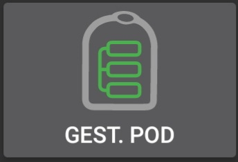

=====================================================
 Documentation du driver AndroidAPS pour la pompe à insuline Omnipod
=====================================================

Ces instructions permettent de configurer la pompe Omnipod Eros (**PAS Omnipod Dash**). Le pilote Omnipod est disponible dans AndroidAPS (AAPS) depuis la version 2.8.

**Ce logiciel est une partie d'un système de pancréas artificiel "Do it yourself" (faire soi-même), et ce n’est pas un produit fini destiné à la mise sur le marché. VOUS devez obligatoirement lire, apprendre et comprendre ce système, y compris la façon de l’utiliser. Attention, vous êtes le seul responsable de ce que vous faite avec ce système.**

.. contenus:: 
   :backlinks: entrée
   :depth: 2

Configuration matérielle et logicielle requise
==================================

* **Périphérique de communication Pod** 

  Composant qui permet la communication entre votre téléphone avec AndroidAPS et les Pods de génération Eros.

   -  |OrangeLink|  `Site internet OrangeLink <https://getrileylink.org/product/orangelink>`_    
   -  |RileyLink| `433MHz RileyLink <https://getrileylink.org/product/rileylink433>`__
   -  |EmaLink|  `Site internet Emalink <https://github.com/sks01/EmaLink>`__ - `Contact <mailto:getemalink@gmail.com>`__     
   -  |LoopLink|  `Site internet LoopLink <https://www.getlooplink.org/>`__ - `Contact <https://jameswedding.substack.com/>`__ - Non testé

* |Android_Phone| **Téléphone Mobile** 

  Composant qui utilisera AndroidAPS et enverra des commandes de contrôle au périphérique de communication Pod.

      +  Smartphone compatible du `driver Omnipod Android <https://docs.google.com/spreadsheets/d/1eNtXAWwrdVtDvsvXaR_72wgT9ICjZPNEBq8DbitCv_4/edit#gid=0>`__ avec une version AAPS 2.8 et `composants <https://androidaps.readthedocs.io/en/latest/EN/index.html#composants>`__ associés

* |Omnipod_Pod| **Dispositif d'injection d'Insuline** 

  Composant qui interprétera les commandes reçues du périphérique de communication Pod en provenance de votre téléphone AndroidAPS.

      + Un nouveau pod Omnipod (génération Eros - **PAS DASH**)

Ces instructions supposent que vous commencez une nouvelle session pod; si ce n'est pas le cas, soyez patient et essayez de commencer ce processus lors de votre prochain changement de pod.

Avant de commencer
================

**SÉCURITÉ D'ABORD** - ne pas essayer ce processus dans un environnement où vous ne pouvez pas récupérer une erreur (pods supplémentaires, insuline, RileyLink chargé et les smartphones sont nécessaires).

**Votre PDM Omnipod ne fonctionnera plus après l'activation de votre pod par le driver AAPS Omnipod**. Vous avez précédemment utilisé votre PDM Omnipod pour envoyer des commandes à votre pod Omnipod Eros. Un pod Omnipod Eros ne permet qu'à un seul appareil de la communiquer avec lui. L'appareil qui active le pod avec succès est le seul appareil autorisé à communiquer avec lui à partir de ce moment. Cela signifie qu'une fois que vous activez un pod Omnipod Eros avec votre RileyLink via le pilote AAPS Omnipod, **vous ne pourrez plus utiliser votre PDM avec votre pod**. Le pilote AAPS Omnipod avec le RileyLink est maintenant votre PDM. *Cela ne veut pas dire que vous pouvez jeter votre PDM, il est recommandé de le garder comme une sauvegarde, et en cas d'urgence dans le cas où AAPS ne fonctionne pas correctement.*

**Vous pouvez configurer plusieurs RileyLinks, mais un seul RileyLink à la fois peut communiquer avec un pod.** Le pilote AAPS Omnipod supporte la possibilité d'ajouter plusieurs RileyLinks dans la configuration de RileyLink, cependant, un seul RileyLink à la fois peut être sélectionné pour la communication.

**Votre pod ne s'arrêtera pas lorsque le RileyLink sera hors de portée.** Lorsque votre RileyLink est hors de portée ou que le signal est bloqué pour communiquer avec le pod actif, votre pod continuera à injecter l'insuline basale. Lors de l'activation d'un pod, le profil basal défini dans AAPS sera programmé dans le nouveau pod. Si vous perdez le contact avec le pod, il retournera à ce profil de basal. Vous ne serez pas en mesure d'émettre de nouvelles commandes tant que le RileyLink ne reviendra pas à portée et rétablira la connexion.

**Les profils de débit de base de 30 min ne sont PAS pris en charge dans AndroidAPS.** Si vous êtes nouveau sur AndroidAPS et que vous configurez votre profil de débit de basal pour la première fois, veuillez noter que les débits de basal commençant par une demi-heure ne sont pas pris en charge et que vous devrez ajuster votre profil de débit de basal pour démarrer sur les heures. Par exemple, si vous avez un débit de basal de 1,1 unités qui commence à 09h30 et a une durée de 2 heures se terminant à 11h30, cela ne marchera pas.  Vous devrez mettre à jour ce taux de basal de 1,1 sur une plage horaire de 9h00 à 11h00 ou de 10h00 à 12h00.  Même si les changements de débit de basal du profil toutes les 30 min sont supportés par le matériel Omnipod lui-même, AndroidAPS n'est pas en mesure de les prendre en compte avec ses algorithmes actuellement.

Activation du pilote Omnipod dans AAPS
===================================

Vous pouvez activer le pilote Omnipod dans AAPS de **deux façons**:

Option 1 : L'Assistant de configuration
--------------------------

Après avoir installé une nouvelle version d'AndroidAPS, l'**Assistant de configuration** démarrera automatiquement.  Cela se produit également lors des mises à jour.  Si vous avez déjà exporté vos paramètres à partir d'une installation précédente, vous pouvez quitter l'assistant d'installation et importer vos anciens paramètres.  Pour les nouvelles installations, procédez comme suit.

Via l'**Assistant de configuration AAPS (2)** situé dans le coin supérieur droit **menu trois points (1)**, passez par les menus de l'assistant jusqu'à ce que vous arriviez à l'écran **Pompe**. Ensuite, sélectionnez le **bouton radio Omnipod (3)**.

    |Enable_Omnipod_Driver_1|  |Enable_Omnipod_Driver_2|

Sur le même écran, sous la sélection de la pompe, les **Paramètres du pilote Omnipod** s'affichent, dans la **Configuration du RileyLink** ajoutez votre appareil RileyLink en appuyant sur le texte **Non configuré**. 

Sur l'écran de **Recherche du RileyLink** appuyez sur le bouton **Rechercher** et sélectionnez votre RileyLink en scannant tous les périphériques Bluetooth disponibles et en sélectionnant votre RileyLink dans la liste. Lorsque c'est correctement sélectionné, vous êtes basculé sur l'écran de sélection de la pompe, qui affiche les paramètres du pilote Omnipod montrant votre RileyLink sélectionné avec l'adresse MAC listée. 

Appuyez sur le bouton **Suivant** pour continuer avec le reste de l'**Assistant de configuration**. Cela peut prendre jusqu'à une minute pour que le RileyLink sélectionné s'initialise et que le bouton **Suivant** devienne actif.

Les étapes détaillées sur la façon de configurer votre appareil de communication pod sont listées ci-dessous dans la section `Configuration RileyLink <#configuration-rileylink>`__.

**OU**

Option 2 : Le Générateur de configuration
----------------------------

Via le **menu hamburger** situé dans le coin supérieur gauche, sous le **Générateur de configuraiton (1)** ➜\ **Pompe**\ ➜\ **Omnipod** en sélectionnant le **bouton radio (2) Omnipod**. En sélectionnant la **case à cocher (4)** à côté de la **roue crantée (3)** cela affichera le menu Omnipod sous la forme d'un onglet intitulé **POD** dans l'interface AAPS. C'est ce que l'on appelle dans cette documentation l'onglet **Omnipod (POD)**.

    **REMARQUE :** Un moyen plus rapide d'accéder aux **paramètres Omnipod** est décrit ci-dessous dans la section `Paramètres Omnipod <#configuration-omnipod>`__ de ce document.

    |Enable_Omnipod_Driver_3| |Enable_Omnipod_Driver_4|

Vérification de la sélection du pilote Omnipod
----------------------------------------

*Remarque : Si vous avez quitté l'Assistant de configuration plus tôt sans sélectionner votre RileyLink, Le pilote Omnipod est activé mais vous devrez toujours sélectionner votre RileyLink.  Vous pouvez voir l'onglet Omnipod (POD) s'afficher comme ci-dessous*

Pour vérifier que vous avez activé le pilote Omnipod dans AAPS **glissez vers la gauche** depuis l'onglet **Aperçu**, où vous verrez maintenant un onglet **Omnipod** ou **POD**.

|Enable_Omnipod_Driver_5|

Configuration Omnipod
======================

Veuillez **glisser vers la gauche** jusqu'à l'onglet **Omnipod (POD)** où vous pourrez gérer toutes les fonctions du pod et du RileyLink (certaines de ces fonctions ne sont pas activées ou visibles sans une session de pod active):

    |refresh_pod_status| Rafraîchir la connectivité et l'état du Pod

    |pod_management| Gestion du Pod (activer, désactiver, tester les beep, stats du RileyLink et historique du Pod)

Configuration RileyLink
---------------

Si vous avez déjà appairé avec succès votre RileyLink dans l'assistant de configuration ou les étapes ci-dessus, alors procédez à `l'activation d'un Pod <#activation-d-un-pod>`__ ci-dessous.

*Remarque : Un bon indicateur visuel indiquant que le RileyLink n'est pas connecté est que les boutons Insuline et Assistant de l'onglet Accueil seront manquants. Cela se produira également pendant environ les 30 premières secondes après le démarrage d'AAPS, car il se connecte activement au RileyLink.*

1. Assurez-vous que votre RileyLink est complètement chargé et mis en marche.

2. Après avoir sélectionné le pilote Omnipod, identifiez et sélectionnez votre RileyLink dans **Générateur de configuration (1)** ➜\ **Pompe**\ ➜\ **Omnipod**\ ➜\ **Roue crantée (2)** ➜\ **Configuration du RileyLink (3)** en appuyant sur **Non configuré** ou sur le texte de **l'adresse MAC (si présent)**.   

    Assurez-vous que votre batterie RileyLink est chargée et qu'il est `positionné à proximité <#positionnement-optimal-omnipod-et-rileylink>`__ (~30 cm de distance ou moins) de votre téléphone pour que AAPS l'identifie par son adresse MAC. Une fois sélectionné, vous pouvez continuer à activer votre première session de pod. Utilisez le bouton retour de votre téléphone pour revenir à l'interface principale AAPS.

    |RileyLink_Setup_1| |RileyLink_Setup_2|

3. Sur l'écran de **Sélection RileyLink** appuyez sur le bouton **Rechercher (4)** pour lancer un balayage bluetooth. **Sélectionnez votre RileyLink (5)** dans la liste des périphériques Bluetooth disponibles.

    |RileyLink_Setup_3| |RileyLink_Setup_4|

4. Après avoir sélectionné avec succès vous êtes revenu sur la page des paramètres Omnipod indiquant l'**adresse MAC du RileyLink actuellement sélectionné (6).** 

    |RileyLink_Setup_5|

5. Vérifiez que dans l'onglet **Omnipod (POD)** que l'**Etat du RileyLink (1)** apparaît comme étant **connecté.** Le champ **Etat du pod (2)** doit afficher **Aucun Pod actif**; si ce n'est pas le cas, veuillez réessayer l'étape précédente ou quitter AAPS pour voir si cela rafraîchit la connexion.

    |RileyLink_Setup_6|

Activation d’un Pod
----------------

Avant de pouvoir activer un pod, veuillez vous assurer que vous avez correctement configuré et connecté votre connexion RileyLink dans les paramètres d'Omnipod

*RAPPEL : La communication avec le Pod pour l'activation de celui-ci se fait sur des périodes limitées pour des raisons de sécurité. Avant d'être appairé le signal radio du Pod est plus faible, mais après l'appairage, il fonctionnera à pleine puissance. Lors de ces procédures, assurez-vous que votre pod est* `à proximité immédiate <#positionnement-optimal-omnipod-et-rileylink>`__ *(~30 cm de distance ou moins) mais pas au dessus ou juste à côté du RileyLink.  

1. Naviguez vers l'onglet **Omnipod (POD)** et cliquez sur le bouton **GEST. POD (1)**, puis cliquez sur **Activer Pod (2)**.

    |Activate_Pod_1| |Activate_Pod_2|

2. L'écran **Remplir Pod ** s'affiche. Remplissez le nouveau pod avec au moins 85 unités d'insuline et écoutez le deux bips indiquant que le pod est prêt à être amorcé.

    |Activate_Pod_3|

    Assurez-vous que le nouveau pod et le RileyLink sont à proximité les uns des autres (~30 cm ou moins) et cliquez sur le bouton **Suivant**.

3. Sur l'écran **Initialiser le Pod**, le pod commencera à s'amorcer (vous entendrez un clic suivi d'une série de cliquetis quand le pod s'initialise). Si le RileyLink est hors de portée du pod en cours d'activation, vous recevrez un message d'erreur **Aucune réponse du Pod**. Si cela se produit, `rapprochez le RileyLink <#positionnement-optimal-omnipod-et-rileylink>`__ (~30 cm de distance ou moins) mais pas au dessus ni juste à côté du Pod et cliquez sur le bouton **Réessayer (1)**.

    |Activate_Pod_4| |Activate_Pod_5|

4. Une fois amorcé avec succès, une coche verte sera affichée et le bouton **Suivant** sera activé. Cliquez sur le bouton **Suivant** pour terminer l'initialisation de l'amorçage du pod et afficher l'écran **Coller Pod**.

    |Activate_Pod_6|

5. Ensuite, préparer le site de perfusion du nouveau pod. Retirez le capuchon en plastique du pod et le papier blanc de l'adhésif et appliquez le pod à l'endroit habituel sur votre corps. Une fois terminé, cliquez sur le bouton **Suivant**.

    |Activate_Pod_7|

6. La boîte de dialogue **Coller Pod** va maintenant apparaître. **Ne cliquez sur le bouton Ok QUE si vous êtes prêt à déployer la canule**.

    |Activate_Pod_8|

7. Après avoir appuyé sur **Ok**, il peut se passer un certain temps avant que l'Omnipod réponde et insère la canule (1-2 minutes maximum), donc soyez patient.

    Si le RileyLink est hors de portée du pod en cours d'activation, vous recevrez un message d'erreur **Aucune réponse du Pod**. Si cela se produit, rapprochez le RileyLink (~30 cm de distance ou moins) mais pas au dessus ni juste à côté du Pod et cliquez sur le bouton **Réessayer**.

    Si le RileyLink est hors de portée Bluetooth ou n'a pas de connexion active avec le téléphone, vous recevrez un message d'erreur **Pas de réponse du RileyLink**. Si cela se produit, rapprochez le RileyLink du téléphone et cliquez sur le bouton **Réessayer**.

    *REMARQUE : Avant d'insérer la canule, il est recommandé de pincer la peau près du point d'insertion de la canule. Cela permet une insertion en douceur de l'aiguille et réduira les risques d'occlusions.*

    |Activate_Pod_9|

    |Activate_Pod_10| |Activate_Pod_11|

8. Une coche verte s'affiche, et le bouton **Suivant** est activé si l'insertion de la canule a réussi. Cliquez sur le bouton **Suivant**.

    |Activate_Pod_12|

9. L'écran **Pod activé** s'affiche. Cliquez sur le bouton vert **Terminer**. Félicitations ! Vous avez démarré une nouvelle session de Pod actif.

    |Activate_Pod_13|

10. Le menu de **Gestion du pod** devrait maintenant s'afficher avec le bouton **Activer Pod (1)** *désactivé* et le bouton **Désactiver Pod (2)** *activé*. Ceci est dû au fait qu'un pod est maintenant actif et que vous ne pouvez pas activer un pod supplémentaire sans désactiver d'abord le pod actuellement actif.

    Cliquez sur le bouton Retour de votre téléphone pour retourner à l'écran de l'onglet **Omnipod (POD)** qui affichera maintenant les informations du Pod pour votre session de pod actif, y compris le débit de basal actuel, le niveau du réservoir du pod, l'insuline injectée, les erreurs du pod et les alertes.

    Pour plus de détails sur les informations affichées, allez dans l'onglet `Omnipod (POD) <#onglet-omnipod-pod>`__ de ce document.

    |Activate_Pod_14| |Activate_Pod_15|

Désactivation du Pod
------------------

En utilisation normale, la durée de vie d'un pod est de l'ordre de trois jours (72 heures) et de 8 heures supplémentaires après l'expiration du pod soit un total de 80 heures d'utilisation du pod.

Pour désactiver un pod (soit après son expiration soit à cause d'une erreur du pod) :

1. Allez dans l'onglet **Omnipod (POD)**, cliquez sur le bouton **GEST. POD (1)** sur l'écran **Gestion du Pod** cliquez sur le bouton **Désactiver Pod (2)**.

    |Deactivate_Pod_1| |Deactivate_Pod_2|

2. Sur l'écran **Désactiver Pod**, commencez par vérifier que le RileyLink se trouve à proximité du pod mais ni au dessus' ni juste à côté du pod, puis cliquez sur le bouton **Suivant** pour commencer le processus de désactivation du Pod.

    |Deactivate_Pod_3|

3. L'écran **Désactivation Pod** apparaîtra et vous recevrez un bip de confirmation du pod que la désactivation a réussi.

    |Deactivate_Pod_4|

    **SI la désactivation échoue** et que vous ne recevez pas de bip de confirmation, vous pouvez recevoir un message **Pas de réponse du RileyLink** ou **Pas de réponse du Pod**. Veuillez cliquer sur le bouton **Réessayer (1)** pour essayer à nouveau de le désactiver. Si la désactivation continue à échouer, veuillez cliquer sur le bouton **Supprimer Pod (2)** pour le supprimer. Vous pouvez maintenant supprimer votre pod car la session active a été désactivée. Si votre Pod se met à hurler, vous devrez peut-être couper le son manuellement (à l'aide d'une épingle ou d'un trombone) car le bouton **Supprimer Pod (2)** ne le fera pas taire.
	
	|Deactivate_Pod_5| |Deactivate_Pod_6|

4. Une coche verte apparaîtra une fois la désactivation réussie. Cliquez sur le bouton **Suivant** pour afficher l'écran de Pod désactivé. Vous pouvez maintenant supprimer votre pod car la session active a été désactivée.

    |Deactivate_Pod_7|

5. Cliquez sur le bouton vert pour retourner à l'écran **Gestion du pod**.

    |Deactivate_Pod_8|

6. Vous êtes maintenant retourné dans le menu de **Gestion du pod**, appuyez sur le bouton retour de votre téléphone pour retourner à l'onglet **Omnipod (POD)**. Vérifiez que le champ **État du RileyLink :** indique **Connecté** et que le champ **État du Pod :** affiche un message **Pas de Pod actif**.

    |Deactivate_Pod_9| |Deactivate_Pod_10|

Suspendre et reprendre l'injection d'Insuline
----------------------------------------

Le processus ci-dessous vous montrera comment suspendre et reprendre l'injection d'insuline par la pompe.

*REMARQUE : si vous ne voyez pas de bouton SUSPENDRE*, son affichage n'a pas été activé dans l'onglet Omnipod (POD). Activez **Montrer le bouton Suspendre l'injection dans l'onglet Omnipod** dans les paramètres `Omnipod <#parametres-omnipod>`__ sous **Autres**.

Suspendre l'injection d’Insuline
~~~~~~~~~~~~~~~~~~~~~~~~~~~

Utilisez cette commande pour placer le pod actif dans un état suspendu. Dans cet état suspendu, la pod n'injectera plus aucune insuline. Cette commande imite la fonction de suspension que le PDM Omnipod d'origine envoie à un pod actif.

1. Allez dans l'onglet **Omnipod (POD)** et cliquez sur le bouton **SUSPENDRE (1)**. La commande de suspension est envoyée depuis le RileyLink vers le pod actif et le bouton **SUSPENDRE (3)** sera grisé. L'**État Pod (2)** affichera **SUSPRENDRE L'INJECTION**.

    |Suspend_Insulin_Delivery_1| |Suspend_Insulin_Delivery_2|

2. Lorsque la commande de suspension est confirmée avec succès par le RileyLink, une boîte de dialogue de confirmation affiche le message **Toutes les injections d'insuline ont été suspendues.**. Cliquez sur **OK** pour confirmer et continuer.

    |Suspend_Insulin_Delivery_3|

3. Votre pod actif a maintenant suspendu toute injection d'insuline. L'onglet **Omnipod (POD)** mettra à jour l' **état du Pod (1)** vers **Suspendu**. Le bouton **SUSPENDRE** sera remplacer par un nouveau bouton **Reprendre l'injection (2)**

    |Suspend_Insulin_Delivery_4|

Reprendre l'injection d'insuline
~~~~~~~~~~~~~~~~~~~~~~~~~

Utilisez cette commande pour demander au pod actif, actuellement suspendu, de reprendre l'injection d'insuline. Une fois la commande exécutée avec succès, l'insuline sera à nouveau injectée normalement avec le débit de basal défini dans le profil actif pour l'heure actuelle. Le pod acceptera à nouveau les commandes pour les bolus, DBT, et SMB.

1. Allez dans l'onglet **Omnipod (POD)** et assurez-vous que le champ **État Pod (1)** affiche **Suspendu**, puis appuyez sur le bouton **Reprendre l'injection (2)** pour demander au pod actuel de reprendre l'injection normale d'insuline. Un message **REPRENDRE L'INJECTION** s'affichera dans le champ **État Pod (3)** indiquant que le RileyLink envoie activement la commande au pod suspendu.

    |Resume_Insulin_Delivery_1| |Resume_Insulin_Delivery_2|

2. Lorsque la commande Reprendre l'injection est confirmée avec succès par le RileyLink, une boîte de dialogue de confirmation affiche le message **L'injection de l'insuline a été reprise**. Cliquez sur **OK** pour confirmer et continuer.

    |Resume_Insulin_Delivery_3|

3. L'onglet **Omnipod (POD)** mettra à jour le champ **État du pod (1)** pour afficher **EN COURS D'EXÉCUTION** et le bouton **Reprendre l'injection** sera maintenant remplacé par le bouton **SUSPENDRE (2)**.

    |Resume_Insulin_Delivery_4|

Valider les alertes Pod
------------------------

*REMARQUE - si vous ne voyez pas de bouton ACCEPTER ALERTES, c'est parce qu'il n'est affiché dans l'onglet Omnipod (POD) QUE si l'alerte d'expiration pod ou l'alerte de réservoir bas ont été déclenchées.*

Le processus ci-dessous vous montrera comment accepter et arêter les bips du pod qui se produisent lorsque la durée d'activité du pod atteint le seuil d'alerte avant son expiration 72 heures (3 jours) après son activation. Ce délai d'avertissement est défini dans le paramètrage **Heures avant arrêt** des alertes Omnipod. La durée de vie maximale d'un pod est de 80 heures (3 jours 8 heures), cependant Insulet recommande de ne pas dépasser la limite de 72 heures (3 jours).

*REMARQUE - Si vous avez activé le paramètre "Accepter automatiquement les alertes Pod" dans les alertes Omnipod, cette alerte sera traitée automatiquement après la première occurrence et vous n'aurez PAS à l'arrêter manuellement.*

1. Lorsque le délai d'avertissement défini dans **Heures avant l'arrêt** est atteint, le pod émettra un bip d'avertissement pour vous informer qu'il approche de sa date d'expiration et qu'un changement de pod sera bientôt nécessaire. Vous pouvez le vérifier dans l'onglet **Omnipod (POD)**, le champ **Pod expiré : (1)** affichera l'heure exacte où le pod expirera (72 heures après l'activation) et le texte basculera en **rouge** après ce délai, et dessous dans le champ **Alertes Pod actives (2)** où le message de statut **Le Pod expire bientôt** est affiché. Ceci déclenchera l'affichage du bouton **ACCEPTER ALERTES (3)**. Une **notification système (4)** vous informera également de l'expiration imminente du pod

    |Acknowledge_Alerts_1| |Acknowledge_Alerts_2|

2. Allez dans l'onglet **Omnipod (POD)** et appuyez sur le bouton **ACCEPTER ALERTES (2)**. Le RileyLink envoie la commande au pod pour désactiver le bip d'avertissement d'expiration du pod et met à jour le champ **Etat pod (1)** avec **VALIDER LES ALERTES**.

    |Acknowledge_Alerts_3|

3. Lors de la **désactivation réussie** des alertes, **2 bips** seront émis par le pod actif et une boîte de dialogue de confirmation affichera le message **Les alertes actives ont été acceptées.**. Cliquez sur le bouton **OK** pour confirmer et fermer la boîte de dialogue.

    |Acknowledge_Alerts_4|

    Si le RileyLink est hors de portée du pod alors que la commande d'acceptation des alertes est en cours de traitement, un message d'avertissement affichera 2 options. **Coupure son (1)** fera taire cette alerte. **OK (2)** confirmera cette alerte et permettra à l'utilisateur d'essayer d'accepter à nouveau les alertes.

    |Acknowledge_Alerts_5|

4. Allez dans l'onglet **Omnipod (POD)** sous le champ **Alertes Pod actives** le message d'avertissement n'est plus affiché et le pod actif n'émettra plus de bips d'avertissement d'expiration du pod.

Voir l'historique du Pod
----------------

This section shows you how to review your active pod history and filter by different action categories. The pod history tool allows you to view the actions and results committed to your currently active pod during its three day (72 - 80 hours) life.

This feature is useful for verifying boluses, TBRs, basal changes that were given but you may be unsure if they completed. The remaining categories are useful in general for troubleshooting issues and determining the order of events that occurred leading up to a failure.

*NOTE:*
**Uncertain** commands will appear in the pod history, however due to their nature you cannot ensure their accuracy.

1. Go to the **Omnipod (POD**) tab and press the **POD MGMT (1)** button to access the **Pod management** menu and then press the **Pod history (2)** button to access the pod history screen.

    |Pod_History_1| |Pod_History_2|

2. On the **Pod history** screen, the default category of **All (1)** is displayed showing the **Date and Time (2)** of all pod **Actions (3)** and **Results (4)** in reverse chronological order. Use your phone’s **back button 2 times** to return to the **Omnipod (POD)** tab in the main AAPS interface.

    |Pod_History_3| |Pod_History_4|

View RileyLink Settings and History
-----------------------------------

This section shows you how to review the settings of your active pod and RileyLink along with the communication history of each. This feature, once accessed, is split into two sections: **Settings** and **History**.

The primary use of this feature is when your RileyLink is out of the Bluetooth range of your phone after a period of time and the **RileyLink status** reports **RileyLink unreachable**. The **REFRESH** button on the main **Omnipod (POD)** tab will manually attempt to re-establish Bluetooth communication with the currently configured RileyLink in the Omnipod settings.

In the event the **REFRESH** button on the main **Omnipod (POD)** tab does not restore the connection to the RileyLink, please follow the additional steps below for a manual reconnection.

Manually Re-establish RileyLink Bluetooth Communication
~~~~~~~~~~~~~~~~~~~~~~~~~~~~~~~~~~~~~~~~~~~~~~~~~~~~~~~

1. From the **Omnipod (POD)** tab when the **RileyLink Status: (1)** reports **RileyLink unreachable** press the **POD MGMT (2)** button to navigate to the **Pod Management** menu. On the **Pod Management** menu you will see a notification appear actively searching for a RileyLink connection, press the **RileyLink stats (3)** button to access the **RileyLink settings** screen.

    |RileyLink_Bluetooth_Reset_1| |RileyLink_Bluetooth_Reset_2|

2. On the **RileyLink Settings (1)** screen under the **RileyLink (2)** section you can confirm both the Bluetooth connection status and error in the **Connection Status and Error: (3)** fields. A *Bluetooth Error* and *RileyLink unreachable* status should be shown. Start the manual Bluetooth reconnection by pressing the **refresh (4)** button in the lower right corner.

    |RileyLink_Bluetooth_Reset_3|
    
    If the RileyLink is unresponsive or out of range of the phone while the Bluetooth refresh command is being processed a warning message will display 2 options.

   * **Mute (1)** will silence this current warning.
   * **OK (2)** will confirm this warning and allow the user to try to re-establish the Bluetooth connection again.
	
    |RileyLink_Bluetooth_Reset_4|	
	
3. If the **Bluetooth connection** does not re-establish, try manually turning **off** and then back **on** the Bluetooth function on your phone.

4. After a successful RileyLink Bluetooth reconnection the **Connection Status: (1)** field should report **RileyLink ready**. Congratulations, you have now reconnected your configured RileyLink to AAPS!

    |RileyLink_Bluetooth_Reset_5|

RileyLink and Active Pod Settings
~~~~~~~~~~~~~~~~~~~~~~~~~~~~~~~~~

This screen will provide information, status, and settings configuration information for both the currently configured RileyLink and the currently active Omnipod Eros pod. It will also allow you to manually refresh the RileyLink Bluetooth connection.

1. Go to the **Omnipod (POD**) tab and press the **POD MGMT (1)** button to access the **Pod management** menu, then press the **RileyLink stats (2)** button to view your currently configured **RileyLink (3)** and active pod **Device (4)** settings.

    |RileyLink_Statistics_Settings_1| |RileyLink_Statistics_Settings_2|

    |RileyLink_Statistics_Settings_3|
    
RileyLink (3) fields
++++++++++++++++++++

	* **Configured Address:** MAC address of the selected RileyLink defined in the Omnipod Settings.
	* **Configured RileyLink Name:** Bluetooth identification name of the selected RileyLink defined in your phone's Bluetooth settings.
	* **Connected Device:** Model of the Omnipod pod currently communicating with the RileyLink (currently only eros pods work with the RileyLink
	* **Connection Status**: The current status of the Bluetooth connection between the RileyLink and the phone running AAPS.
	* **Connection Error:** If there is an error with the RileyLink Bluetooth connection details will be displayed here.
	* **RL Firmware:** Current firmware version installed on the actively connected RileyLink.

Device (4) fields - With an Active Pod
++++++++++++++++++++++++++++++++++++++

	* **Device Type:** The type of device communicating with the RileyLink (Omnipod pod pump)
	* **Device Model:** The model of the active device connected to the RileyLink (the current model name of the Omnipod pod, which is Eros)
	* **Pump Serial Number:** Serial number of the currently activated pod
	* **Pump Frequency:** Communication radio frequency the RileyLink has tuned to enable communication between itself and the pod.
	* **Last used frequency:** Last known radio frequency the pod used to communicate with the RileyLink.
	* **Last device contact:** Date and time of the last contact the pod made with the RileyLink.
	* **Refresh button** to manually refresh RileyLink Bluetooth communication with the phone.

RileyLink and Active Pod History
~~~~~~~~~~~~~~~~~~~~~~~~~~~~~~~~

This screen provides information in reverse chronological order of each state or action that either the RileyLink or currently connected pod is in or has taken. The entire history is only available for the currently active pod, after a pod change this history will be erased and only events from the newly activated pod will be recorded and shown.

1. Go to the **Omnipod (POD**) tab and press the **POD MGMT (1)** button to access the **Pod management** menu, then press the **RileyLink stats (2)** button to view the **Settings** and **History** screen. Click on the **HISTORY (3)** text to display the entire history of the RileyLink and currently active pod session.

    |RileyLink_Statistics_History_1| |RileyLink_Statistics_History_2|

    |RileyLink_Statistics_History_3|
    
Fields
++++++
    
   * **Date & Time**: In reverse chronological order the timestamp of each event.
   * **Device:** The device to which the current action or state is referring.
   * **State or Action:** The current state or action performed by the device.

Onglet Omnipod (POD)
=================

Below is an explanation of the layout and meaning of the icons and status fields on the **Omnipod (POD)** tab in the main AAPS interface.

*NOTE: If any message in the Omnipod (POD) tab status fields report (uncertain) then you will need to press the Refresh button to clear it and refresh the pod status.*

|Omnipod_Tab|

Fields
------

* **RileyLink Status:** Displays the current connection status of the RileyLink

   - *RileyLink Unreachable* - RileyLink is either not within Bluetooth range of the phone, powered off or has a failure preventing Bluetooth communication.
   - *RileyLink Ready* - RileyLink is powered on and actively initializing the Bluetooth connection
   - *Connected* - RileyLink is powered on, connected and actively able to communicate via Bluetooth.

* **Pod address:** Displays the current address in which the active pod is referenced
* **LOT:** Displays the LOT number of the active pod
* **TID:** Displays the serial number of the pod.
* **Firmware Version:** Displays the firmware version of the active pod.
* **Time on Pod:** Displays the current time on the active pod.
* **Pod expires:** Displays the date and time when the active pod will expire.
* **Pod status:** Displays the status of the active pod.
* **Last connection:** Displays the last time communication with the active pod was achieved.

   - *Moments ago* - less than 20 seconds ago.
   - *Less than a minute ago* - more than 20 seconds but less than 60 seconds ago.
   - *1 minute ago* - more than 60 seconds but less than 120 seconds (2 min)
   - *XX minutes ago* - more than 2 minutes ago as defined by the value of XX

* **Last bolus:** Displays the dosage of the last bolus sent to the active pod and how long ago it was issued in parenthesis.
* **Base Basal rate:** Displays the basal rate programmed for the current time from the basal rate profile.
* **Temp basal rate:** Displays the currently running Temporary Basal Rate in the following format

   - Units / hour @ time TBR was issued (minutes run / total minutes TBR will be run)
   - *Example:* 0.00U/h @18:25 ( 90/120 minutes)

* **Reservoir:** Displays over 50+U left when more than 50 units are left in the reservoir. Below this value the exact units are displayed in yellow text.
* **Total delivered:** Displays the total number of units of insulin delivered from the reservoir. *Note this is an approximation as priming and filling the pod is not an exact process.*
* **Errors:** Displays the last error encountered. Review the `Pod history <#view-pod-history>`__, `RileyLink history <#rileylink-and-active-pod-history>`__ and log files for past errors and more detailed information.
*  **Active pod alerts:** Reserved for currently running alerts on the active pod. Normally used when pod expiration is past 72 hours and native pod beep alerts are running.

Icons
-----

.. table:: 

   ====================  ===========================================
   |refresh_pod_status|  **REFRESH:** 
   			 
			 Sends a refresh command to the active pod to update communication
			 
			 * Use to refresh the pod status and dismiss status fields that contain the text (uncertain).
			 * See the `Troubleshooting section <#troubleshooting>`__ below for additional information.

   |pod_management|   	 **POD MGMT:**

			 Navigates to the Pod management menu
   |ack_alerts|		 **ACK ALERTS:**
   			 
			 When pressed this will disable the pod expiration beeps and notifications. 
			 
			 * Button is displayed only when pod time is past expiration warning time
			 * Upon successful dismissal, this icon will no longer appear.
			 
   |set_time|		 **SET TIME:**
   
			 When pressed this will update the time on the pod with the current time on your phone.
   |suspend|  		 **SUSPEND:**
   
			 Suspends the active pod
   |resume| 		 **RESUME DELIVERY:**
   
			 Resumes the currently suspended, active pod
   ====================  ===========================================

Pod Management Menu
-------------------

Below is an explanation of the layout and meaning of the icons on the **Pod Management** menu accessed from the **Omnipod (POD)** tab.

|Omnipod_Tab_Pod_Management|

.. table:: 

   =========================  ===========================================
   |activate_pod|	      **Activate Pod**
   
   			      Primes and activates a new pod

   |deactivate_pod|	      **Deactivate Pod**
 
 			      Deactivates the currently active pod.
			 
		   	      *  A partially paired pod ignores this command.
			      *  Use this command to deactivate a screaming pod (error 49).
			      *  If the button is disabled (greyed out) use the Discard Pod button.

   |play_test_beep| 	      **Play test beep**
 
 			      Plays a single test beep on the pod when pressed.

   |discard_pod|	      **Discard pod**

			      Deactivates and discards the pod state of an unresponsive pod when pressed.
			      
			      Button is only displayed when very specific cases are met as proper deactivation is no longer possible:

			      * A **pod is not fully paired** and thus ignores deactivate commands.
			      * A **pod is stuck** during the pairing process between steps
	 		      * A **pod simply does not pair at all.**

   |pod_history| 	      **Pod history** 
   
   			      Displays the active pod activity history

   |rileylink_stats| 	      **RileyLink stats:**
   
   			      Navigates to the RileyLink Statistics screen displaying current settings and RileyLink Connection history

			      * **Settings** - displays RileyLink and active pod settings information
			      * **History** - displays RileyLink and Pod communication history

   |reset_rileylink_config|   **Reset RileyLink Config** 
   
   			      When presssed this button resets the currently connected RileyLink configuration. 
			      
			      * When communication is started, specific data is sent to and set in the RileyLink 
			      
			        - Memory Registers are set
				- Communication Protocols are set
				- Tuned Radio Frequency is set
				
			      * See `addtional notes <#reset-rileylink-config-notes>`__ at the end of this table

   |pulse_log|		      **Read pulse log:** 
    
    			      Sends the active pod pulse log to the clipboard
   =========================  ===========================================			    

*Reset RileyLink Config Notes*
~~~~~~~~~~~~~~~~~~~~~~~~~~~~~~

* The primary usage of this feature is when the currently active RileyLink is not responding and communication is in a stuck state.
* If the RileyLink is turned off and then back on, the **Reset RileyLink Config** button needs to be pressed, so that it sets these communication parameters in the RileyLink configuration.
* If this is NOT done then AAPS will need to be restarted after the RileyLink is power cycled.
* This button **DOES NOT** need to be pressed when switching between different pod communication devices (RileyLinks)

Paramètres Omnipod
================

The Omnipod driver settings are configurable from the top-left hand corner **hamburger menu** under **Config Builder**\ ➜\ **Pump**\ ➜\ **Omnipod**\ ➜\ **Settings Gear (2)** by selecting the **radio button (1)** titled **Omnipod**. Selecting the **checkbox (3)** next to the **Settings Gear (2)** will allow the Omnipod menu to be displayedas a tab in the AAPS interface titled **OMNIPOD** or **POD**. C'est ce que l'on appelle dans cette documentation l'onglet **Omnipod (POD)**.

|Omnipod_Settings_1|

**NOTE:** A faster way to access the **Omnipod settings** is by accessing the **3 dot menu (1)** in the upper right hand corner of the **Omnipod (POD)** tab and selecting **Omnipod preferences (2)** from the dropdown menu.

|Omnipod_Settings_2|

The settings groups are listed below; you can enable or disable via a toggle switch for most entries described below:

|Omnipod_Settings_3|

*NOTE: An asterisk (\*) denotes the default for a setting is enabled.*

RileyLink
---------

Allows for scanning of a RileyLink device. The Omnipod driver cannot select more than one RileyLink device at a time.

Bips de confirmation
------------------

Provides confirmation beeps from the pod for bolus, basal, SMB, and TBR delivery and changes.

* **\*Bolus beeps enabled:** Enable or disable confirmation beeps when a bolus is delivered.
* **\*Basal beeps enabled:** Enable or disable confirmation beeps when a new basal rate is set, active basal rate is canceled or current basal rate is changed.
* **\*SMB beeps enabled:** Enable or disable confirmation beeps when a SMB is delivered.
* **TBR beeps enabled:** Enable or disable confirmation beeps when a TBR is set or canceled.

Alertes
------

Provides AAPS alerts and Nightscout announcements for pod expiration, shutdown, low reservoir based on the defined threshold units.

*Note an AAPS notification will ALWAYS be issued for any alert after the initial communication with the pod since the alert was triggered. Dismissing the notification will NOT dismiss the alert UNLESS automatically acknowledge Pod alerts is enabled. To MANUALLY dismiss the alert you must visit the Omnipod (POD) tab and press the ACK ALERTS button.*
	
* **\*Expiration reminder enabled:** Enable or disable the pod expiration reminder set to trigger when the defined number of hours before shutdown is reached.
* **Hours before shutdown:** Defines the number hours before the active pod shutdown occurs, which will then trigger the expiration reminder alert.
* **\*Low reservoir alert enabled:** Enable or disable an alert when the pod's remaining units low reservoir limit is reached as defined in the Number of units field.
* **Number of units:** The number of units at which to trigger the pod low reservoir alert.
* **Automatically acknowledge Pod alerts:** When enabled a notification will still be issued however immediately after the first pod communication contact since the alert was issued it will now be automatically acknowledged and the alert will be dismissed.

Notifications
-------------

Provides AAPS notifications and audible phone alerts when it is uncertain if TBR, SMB, or bolus events were successful. 

*NOTE: These are notifications only, no audible beep alerts are made.*

* **Sound for uncertain TBR notifications enabled:** Enable or disable this setting to trigger an audible alert and visual notification when AAPs is uncertain if a TBR was successfully set.
* **\*Sound for uncertain SMB notifications enabled:** Enable or disable this setting to trigger an audible alert and visual notification when AAPS is uncertain if an SMB was successfully delivered.
* **\*Sound for uncertain bolus notifications enabled:** Enable or disable this setting to trigger an audible alert and visual notification when AAPS is uncertain if a bolus was successfully delivered.
   
Autres
-----

Provides advanced settings to assist debugging.
	
* **Show Suspend Delivery button in Omnipod tab:** Hide or display the suspend delivery button in the **Omnipod (POD)** tab.
* **Show Pulse log button in Pod Management menu:** Hide or display the pulse log button in the **Pod Management** menu.
* **Show RileyLink Stats button in Pod Management menu:** Hide or display the RileyLink Stats button in the **Pod Management** menu.
* **Use battery level reported by OrangeLink/EmaLink:** Reports the actual battery level of the OrangeLink/EmaLink. We **strongly recommend** that all OrangeLink/EmaLink users enable this setting.

	+  DOES NOT work with the original RileyLink.
	+  May not work with RileyLink alternatives.
	+  Enabled - Reports the current battery level for supported pod communication devices.
	+  Disabled - Reports a value of n/a.
* **\*DST/Time zone detect on enabled:** allows for time zone changes to be automatically detected if the phone is used in an area where DST is observed.

Switching or Removing an Active Pod Communication Device (RileyLink)
--------------------------------------------------------------------

With many alternative models to the original RileyLink available or the need have multiple/backup versions of the same pod communication device (RileyLink), it becomes necessary to switch or remove the selected pod communication device (RileyLink) from Omnipod Setting configuration. 

The following steps will show how to **Remove** and existing pod communication device (RileyLink) as well as **Add** a new pod communication device.  Executing both **Remove** and **Add** steps will switch your device.

1. Access the **RileyLink Selection** menu by selecting the **3 dot menu (1)** in the upper right hand corner of the **Omnipod (POD)** tab and selecting **Omnipod preferences (2)** from the dropdown menu. On the **Omnipod Settings** menu under **RileyLink Configuration (3)** press the **Not Set** (if no device is selected) or **MAC Address** (if a device is present) text to open the **RileyLink Selection** menu. 

    |Omnipod_Settings_2| |RileyLink_Setup_2|  

Remove Currently Selected Pod Communication Device (RileyLink)
--------------------------------------------------------------

This process will show how to remove the currently selected pod communication device (RileyLink) from the Omnipod Driver settings.

1. Under **RileyLink Configuration** press the **MAC Address (1)** text to open the **RileyLink Selection** menu. 

    |RileyLink_Setup_Remove_1|

2. On the **RileyLink Selection** menu the press **Remove (2)** button to remove **your currently selected RileyLink (3)**

    |RileyLink_Setup_Remove_2|

3. At the confirmation prompt press **Yes (4)** to confirm the removal of your device.

    |RileyLink_Setup_Remove_3|
    
4. You are returned to the **Omnipod Setting** menu where under **RileyLink Configuration** you will now see the device is **Not Set (5)**.  Congratulations, you have now successfully removed your selected pod communication device (RileyLink).

    |RileyLink_Setup_Remove_4|

Add Currently Selected Pod Communication Device (RileyLink)
-----------------------------------------------------------

This process will show how to add a new pod communication device (RileyLink) to the Omnipod Driver settings.

1. Under **RileyLink Configuration** press the **Not Set (1)** text to open the **RileyLink Selection** menu. 

    |RileyLink_Setup_Add_1|
    
2. Press the **Scan (2)** button to start scanning for all available Bluetooth devices.

    |RileyLink_Setup_Add_2|

3. Select **your RileyLink (3)** from the list of available devices and you will be returned to the **Omnipod Settings** menu displaying the **MAC Address (4)** of your newly selected device.  Congratulations you have successfully selected your pod communication device (RileyLink).

    |RileyLink_Setup_Add_3| |RileyLink_Setup_Add_4|
    

Onglet Actions (ACT)
=================

This tab is well documented in the main AAPS documentation but there are a few items on this tab that are specific to how the Omnipod pod differs from tube based pumps, especially after the processes of applying a new pod.

1. Go to the **Actions (ACT)** tab in the main AAPS interface.

2. Under the **Careportal (1)** section the following 3 fields will have their **age reset** to 0 days and 0 hours **after each pod change**: **Insulin** and **Cannula**. This is done because of how the Omnipod pump is built and operates. The **pump battery** and **insulin reservoir** are self contained inside of each pod. Since the pod inserts the cannula directly into the skin at the site of the pod application, a traditional tube is not used in Omnipod pumps. *Therefore after a pod change the age of each of these values will automatically reset to zero.* **Pump battery age** is not reported as the battery in the pod will always be more than the life of the pod (maximum 80 hours).

  |Actions_Tab|

Niveaux
------

**Insuln Level**

Reporting of the amount of insulin in the Omnipod Eros Pod is not exact.  This is because it is not known exactly how much insulin was put in the pod, only that when the 2 beeps are triggered while filling the pod that over 85 units have been injected. A Pod can hold a maximum of 200 units. Priming can also introduce variance as it is not and exact process.  With both of these factors, the Omnipod driver has been written to give the best approximation of insulin remainin in the reservoir.  

  * **Abover 50 Units** - Reports a value of 50+U when more than 50 units are currently in the reservoir.
  * **Below 50 Units** - Reports an approximate calculated value of insulin remaining in the reservoir. 
  * **SMS** - Returns value or 50+U for SMS responses
  * **Nightscout** - Uploads value of 50 when over 50 units to Nightscout (version 14.07 and older).  Newer versions will report a value of 50+ when over 50 units.

**Battery Level**

Battery level reporting is a setting that can be enabled to return the current battery level of pod communicaton devices like the OrangeLink and EmaLink.  The RileyLink hardware is not capable of reporting its battery level.  The battery level is reported after each communication with the pod, so when charging a linear increase may not be observed.  A manual refresh will update the current battery level.  When a supported Pod communicaton device is disconnected a value of 0% will be reported.

  * **RileyLink hardware is NOT capable of report battery level** 
  * **Use battery level reported by OrangeLink/EmaLink Setting MUST be enabled in the Omnipod settings to reporting battery level values**
  * **Battery Level ONLY works for OrangeLink and EmaLink Devices**
  * **Battery Level reporting MAY work for other devices (excluding RileyLink)**
  * **SMS** - Returns current battery level as a response when an actual level exists, a value of n/a will not be returned.
  * **Nightscout** - Battery level is reported when an actual level exists, value of n/a will not be reported

Dépannage
===============

Pod Failures
------------

Pods fail occasionally due to a variety of issues, including hardware issues with the Pod itself. It is best practice not to call these into Insulet, since AAPS is not an approved use case. A list of fault codes can be found `here <https://github.com/openaps/openomni/wiki/Fault-event-codes>`__ to help determine the cause.

Preventing error 49 pod failures
--------------------------------

This failure is related to an incorrect pod state for a command or an error during an insulin delivery command. We recommend users to switch to the Nightscout client to *upload only (Disable sync)* under the **Config Builder**\ ➜\ **General**\ ➜\ **NSClient**\ ➜\ **cog wheel**\ ➜\ **Advanced Settings** to prevent possible failures.

Pump Unreachable Alerts
-----------------------

It is recommended that pump unreachable alerts be configured to **120 minutes** by going to the top right-hand side three-dot menu, selecting **Preferences**\ ➜\ **Local Alerts**\ ➜\ **Pump unreachable threshold [min]** and setting this to **120**.

Importer les paramètres AAPS de versions précédentes
----------------------------------

Please note that importing settings has the possibility to import an outdated Pod status. As a result, you may lose an active Pod. It is therefore strongly recommended that you **do not import settings while on an active Pod session**.

1. Deactivate your pod session. Verify that you do not have an active pod session.
2. Export your settings and store a copy in a safe place.
3. Uninstall the previous version of AAPS and restart your phone.
4. Install the new version of AAPS and verify that you do not have an active pod session.
5. Import your settings and activate your new pod.

Omnipod driver alerts
---------------------

please note that the Omnipod driver presents a variety of unique alerts on the **Overview tab**, most of them are informational and can be dismissed while some provide the user with an action to take to resolve the cause of the triggered alert. A summary of the main alerts that you may encounter is listed below:

Pas de Pod actif
~~~~~~~~~~~~~

No active Pod session detected. This alert can temporarily be dismissed by pressing **SNOOZE** but it will keep triggering as long as a new pod has not been activated. Once activated this alert is automatically silenced.

Pod suspendu
~~~~~~~~~~~~~

Informational alert that Pod has been suspended.

Echec Paramétrage Profil Basal. Delivery might be suspended! Please manually refresh the Pod status from the Omnipod tab and resume delivery if needed..
~~~~~~~~~~~~~~~~~~~~~~~~~~~~~~~~~~~~~~~~~~~~~~~~~~~~~~~~~~~~~~~~~~~~~~~~~~~~~~~~~~~~~~~~~~~~~~~~~~~~~~~~~~~~~~~~~~~~~~~~~~~~~~~~~~~~~~~~~~~~~~~~~~~~~

Informational alert that the Pod basal profile setting has failed, and you will need to hit *Refresh* on the Omnipod tab.

Unable to verify whether SMB bolus succeeded. If you are sure that the Bolus didn't succeed, you should manually delete the SMB entry from Treatments.
~~~~~~~~~~~~~~~~~~~~~~~~~~~~~~~~~~~~~~~~~~~~~~~~~~~~~~~~~~~~~~~~~~~~~~~~~~~~~~~~~~~~~~~~~~~~~~~~~~~~~~~~~~~~~~~~~~~~~~~~~~~~~~~~~~~~~~~~~~~~~~~~~~~~~~~~~~~

Alert that the SMB bolus success could not be verified, you will need to verify the *Last bolus* field on the Omnipod tab to see if SMB bolus succeeded and if not remove the entry from the Treatments tab.

Uncertain if "task bolus/TBR/SMB" completed, please manually verify if it was successful.
~~~~~~~~~~~~~~~~~~~~~~~~~~~~~~~~~~~~~~~~~~~~~~~~~~~~~~~~~~~~~~~~~~~~~~~~~~~~~~~~~~~~~~~~~

Due to the way that the RileyLink and Omnipod communicate, situations can occur where it is *uncertain* if a command was successfully processed. The need to inform the user of this uncertainty was necessary.

Below are a few examples of when an uncertain notification can occur.

* **Boluses** - Uncertain boluses cannot be automatically verified. The notification will remain until the next bolus but a manual pod refresh will clear the message. *By default alerts beeps are enabled for this notification type as the user will manually need to verify them.*
* **TBRs, Pod Statuses, Profile Switches, Time Changes** - a manual pod refresh will clear the message. By default alert beeps are disabled for this notification type.
* **Pod Time Deviation -** When the time on the pod and the time your phone deviates too much then it is difficult for AAPS loop to function and make accurate predictions and dosage recommendations. If the time deviation between the pod and the phone is more than 5 minutes then AAPS will report the pod is in a Suspended state under Pod status with a HANDLE TIME CHANGE message. An additional **Set Time** icon will appear at the bottom of the Omnipod (POD) tab. Clicking Set Time will synchronize the time on the pod with the time on the phone and then you can click the RESUME DELIVERY button to continue normal pod operations.

Best Practices
==============

Positionnement optimal Omnipod et RileyLink
-----------------------------------------

The antenna used on the RileyLink to communicate with an Omnipod pod is a 433 MHz helical spiral antenna. Due to its construction properties it radiates an omni directional signal like a three dimensional doughnut with the z-axis representing the vertical standing antenna. This means that there are optimal positions for the RileyLink to be placed, especially during pod activation and deactivation routines.

|Toroid_w_CS|

    *(Fig 1. Graphical plot of helical spiral antenna in an omnidirectional pattern*)

Because of both safety and security concerns, pod *activation* has to be done at a range *closer (~30 cm away or less)* than other operations such as giving a bolus, setting a TBR or simply refreshing the pod status. Due to the nature of the signal transmission from the RileyLink antenna it is NOT recommended to place the pod directly on top of or right next to the RileyLink.

The image below shows the optimal way to position the RileyLink during pod activation and deactivation procedures. The pod may activate in other positions but you will have the most success using the position in the image below.

*Note: If after optimally positioning the pod and RileyLink communication fails, this may be due to a low battery which decreases the transmission range of the RileyLink antenna. To avoid this issue make sure the RileyLink is properly charged or connected directly to a charging cable during this process.*

|Omnipod_pod_and_RileyLink_Position|

Where to get help for Omnipod driver
====================================

All of the development work for the Omnipod driver is done by the community on a volunteer basis; we ask that you please be considerateand use the following guidelines when requesting assistance:

-  **Level 0:** Read the relevant section of this documentation to ensure you understand how the functionality with which you are experiencing difficulty is supposed to work.
-  **Level 1:** If you are still encountering problems that you are not able to resolve by using this document, then please go to the `AndroidAPS <https://gitter.im/MilosKozak/AndroidAPS>`__ channel on **Gitter** or the *#androidaps* channel on **Discord** by using `this invite link <https://discord.com/invite/NhEUtzr>`__.
-  **Level 2:** Search existing issues to see if your issue has already been reported; if not, please create a new `issue <https://github.com/nightscout/AndroidAPS/issues>`__ and attach your `log files <https://androidaps.readthedocs.io/en/latest/CROWDIN/sk/Usage/Accessing-logfiles.html>`__.
-  **Be patient - most of the members of our community consist of good-natured volunteers, and solving issues often requires time and patience from both users and developers.**

..
	Omnipod image aliases resource for referencing images by name with more positioning flexibility

..
	Interface Icons

..
	Omnipod (POD) Overview Tab

.. |ack_alerts|                    image:: ../images/omnipod/ICONS/omnipod_overview_ack_alerts.png

.. |refresh_pod_status|            image:: ../images/omnipod/ICONS/omnipod_overview_refresh_pod_status.png
.. |resume|               	   image:: ../images/omnipod/ICONS/omnipod_overview_resume.png
.. |set_time|                      image:: ../images/omnipod/ICONS/omnipod_overview_set_time.png
.. |suspend|                       image:: ../images/omnipod/ICONS/omnipod_overview_suspend.png

..
	Pod Management Tab

.. |activate_pod|                  image:: ../images/omnipod/ICONS/omnipod_overview_pod_management_activate_pod.png
.. |deactivate_pod|                image:: ../images/omnipod/ICONS/omnipod_overview_pod_management_deactivate_pod.png
.. |discard_pod|                   image:: ../images/omnipod/ICONS/omnipod_overview_pod_management_discard_pod.png
.. |play_test_beep|                image:: ../images/omnipod/ICONS/omnipod_overview_pod_management_play_test_beep.png
.. |pod_history|                   image:: ../images/omnipod/ICONS/omnipod_overview_pod_management_pod_history.png
.. |pulse_log|                     image:: ../images/omnipod/ICONS/omnipod_overview_pod_management_pulse_log.png
.. |reset_rileylink_config|        image:: ../images/omnipod/ICONS/omnipod_overview_pod_management_reset_rileylink_config.png
.. |rileylink_stats|               image:: ../images/omnipod/ICONS/omnipod_overview_pod_management_rileylink_stats.png

..
	Instructional Section Images
	
..
	Configuration matérielle et logicielle requise
.. |EmaLink|				image:: ../images/omnipod/EmaLink.png
.. |LoopLink|				image:: ../images/omnipod/LoopLink.png
.. |OrangeLink|				image:: ../images/omnipod/OrangeLink.png		
.. |RileyLink|				image:: ../images/omnipod/RileyLink.png
.. |Android_phone|			image:: ../images/omnipod/Android_phone.png	
.. |Omnipod_Pod|			image:: ../images/omnipod/Omnipod_Pod.png
	
..
		Valider les alertes
.. |Acknowledge_Alerts_1|               image:: ../images/omnipod/Acknowledge_Alerts_1.png
.. |Acknowledge_Alerts_2|               image:: ../images/omnipod/Acknowledge_Alerts_2.png
.. |Acknowledge_Alerts_3|               image:: ../images/omnipod/Acknowledge_Alerts_3.png
.. |Acknowledge_Alerts_4|               image:: ../images/omnipod/Acknowledge_Alerts_4.png
.. |Acknowledge_Alerts_5|               image:: ../images/omnipod/Acknowledge_Alerts_5.png

..
	Actions Tab
.. |Actions_Tab|                  		image:: ../images/omnipod/Actions_Tab.png

..
	Activer le Pod
.. |Activate_Pod_1|                     image:: ../images/omnipod/Activate_Pod_1.png
.. |Activate_Pod_2|                     image:: ../images/omnipod/Activate_Pod_2.png
.. |Activate_Pod_3|                     image:: ../images/omnipod/Activate_Pod_3.png
.. |Activate_Pod_4|                     image:: ../images/omnipod/Activate_Pod_4.png
.. |Activate_Pod_5|                     image:: ../images/omnipod/Activate_Pod_5.png
.. |Activate_Pod_6|                     image:: ../images/omnipod/Activate_Pod_6.png
.. |Activate_Pod_7|                     image:: ../images/omnipod/Activate_Pod_7.png
.. |Activate_Pod_8|                     image:: ../images/omnipod/Activate_Pod_8.png
.. |Activate_Pod_9|                     image:: ../images/omnipod/Activate_Pod_9.png
.. |Activate_Pod_10|                    image:: ../images/omnipod/Activate_Pod_10.png
.. |Activate_Pod_11|                    image:: ../images/omnipod/Activate_Pod_11.png
.. |Activate_Pod_12|                    image:: ../images/omnipod/Activate_Pod_12.png
.. |Activate_Pod_13|                    image:: ../images/omnipod/Activate_Pod_13.png
.. |Activate_Pod_14|                    image:: ../images/omnipod/Activate_Pod_14.png
.. |Activate_Pod_15|                    image:: ../images/omnipod/Activate_Pod_15.png

..
	Désactiver Pod
.. |Deactivate_Pod_1|                   image:: ../images/omnipod/Deactivate_Pod_1.png
.. |Deactivate_Pod_2|                   image:: ../images/omnipod/Deactivate_Pod_2.png
.. |Deactivate_Pod_3|                   image:: ../images/omnipod/Deactivate_Pod_3.png
.. |Deactivate_Pod_4|                   image:: ../images/omnipod/Deactivate_Pod_4.png
.. |Deactivate_Pod_5|                   image:: ../images/omnipod/Deactivate_Pod_5.png
.. |Deactivate_Pod_6|                   image:: ../images/omnipod/Deactivate_Pod_6.png
.. |Deactivate_Pod_7|                   image:: ../images/omnipod/Deactivate_Pod_7.png
.. |Deactivate_Pod_8|                   image:: ../images/omnipod/Deactivate_Pod_8.png
.. |Deactivate_Pod_9|                   image:: ../images/omnipod/Deactivate_Pod_9.png
.. |Deactivate_Pod_10|                  image:: ../images/omnipod/Deactivate_Pod_10.png

..
	Activation du pilote Omnipod dans AAPS
.. |Enable_Omnipod_Driver_1|            image:: ../images/omnipod/Enable_Omnipod_Driver_1.png
.. |Enable_Omnipod_Driver_2|            image:: ../images/omnipod/Enable_Omnipod_Driver_2.png
.. |Enable_Omnipod_Driver_3|            image:: ../images/omnipod/Enable_Omnipod_Driver_3.png
.. |Enable_Omnipod_Driver_4|            image:: ../images/omnipod/Enable_Omnipod_Driver_4.png
.. |Enable_Omnipod_Driver_5|            image:: ../images/omnipod/Enable_Omnipod_Driver_5.png

..
	Optimally Positioning the RileyLink and Omnipod pod
.. |Omnipod_pod_and_RileyLink_Position|	image:: ../images/omnipod/Omnipod_pod_and_RileyLink_Position.png
.. |Toroid_w_CS|                  		image:: ../images/omnipod/Toroid_w_CS.png

..
	Paramètres Omnipod
.. |Omnipod_Settings_1|                 image:: ../images/omnipod/Omnipod_Settings_1.png
.. |Omnipod_Settings_2|                 image:: ../images/omnipod/Omnipod_Settings_2.png
.. |Omnipod_Settings_3|                 image:: ../images/omnipod/Omnipod_Settings_3.png

..
	Omnipod Tab
.. |Omnipod_Tab|                  		image:: ../images/omnipod/Omnipod_Tab.png
.. |Omnipod_Tab_Pod_Management|         image:: ../images/omnipod/Omnipod_Tab_Pod_Management.png

..
	Historique Pod
.. |Pod_History_1|                  	image:: ../images/omnipod/Pod_History_1.png
.. |Pod_History_2|                  	image:: ../images/omnipod/Pod_History_2.png
.. |Pod_History_3|                  	image:: ../images/omnipod/Pod_History_3.png
.. |Pod_History_4|                  	image:: ../images/omnipod/Pod_History_4.png

..
	Resume Insulin Delivery
.. |Resume_Insulin_Delivery_1|          image:: ../images/omnipod/Resume_Insulin_Delivery_1.png
.. |Resume_Insulin_Delivery_2|          image:: ../images/omnipod/Resume_Insulin_Delivery_2.png
.. |Resume_Insulin_Delivery_3|          image:: ../images/omnipod/Resume_Insulin_Delivery_3.png
.. |Resume_Insulin_Delivery_4|          image:: ../images/omnipod/Resume_Insulin_Delivery_4.png

..
	RileyLink Bluetooth Reset
.. |RileyLink_Bluetooth_Reset_1|        image:: ../images/omnipod/RileyLink_Bluetooth_Reset_1.png
.. |RileyLink_Bluetooth_Reset_2|        image:: ../images/omnipod/RileyLink_Bluetooth_Reset_2.png
.. |RileyLink_Bluetooth_Reset_3|        image:: ../images/omnipod/RileyLink_Bluetooth_Reset_3.png
.. |RileyLink_Bluetooth_Reset_4|        image:: ../images/omnipod/RileyLink_Bluetooth_Reset_4.png
.. |RileyLink_Bluetooth_Reset_5|        image:: ../images/omnipod/RileyLink_Bluetooth_Reset_5.png

..
	Configuration RileyLink
.. |RileyLink_Setup_1|                  image:: ../images/omnipod/RileyLink_Setup_1.png
.. |RileyLink_Setup_2|                  image:: ../images/omnipod/RileyLink_Setup_2.png
.. |RileyLink_Setup_3|                  image:: ../images/omnipod/RileyLink_Setup_3.png
.. |RileyLink_Setup_4|                  image:: ../images/omnipod/RileyLink_Setup_4.png
.. |RileyLink_Setup_5|                  image:: ../images/omnipod/RileyLink_Setup_5.png
.. |RileyLink_Setup_6|                  image:: ../images/omnipod/RileyLink_Setup_6.png

..
	RileyLink Setup Add Device
.. |RileyLink_Setup_Add_1|                  image:: ../images/omnipod/RileyLink_Setup_Add_1.png
.. |RileyLink_Setup_Add_2|                  image:: ../images/omnipod/RileyLink_Setup_Add_2.png
.. |RileyLink_Setup_Add_3|                  image:: ../images/omnipod/RileyLink_Setup_Add_3.png
.. |RileyLink_Setup_Add_4|                  image:: ../images/omnipod/RileyLink_Setup_Add_4.png

..
	RileyLink Setup Remove Device
.. |RileyLink_Setup_Remove_1|                  image:: ../images/omnipod/RileyLink_Setup_Remove_1.png
.. |RileyLink_Setup_Remove_2|                  image:: ../images/omnipod/RileyLink_Setup_Remove_2.png
.. |RileyLink_Setup_Remove_3|                  image:: ../images/omnipod/RileyLink_Setup_Remove_3.png
.. |RileyLink_Setup_Remove_4|                  image:: ../images/omnipod/RileyLink_Setup_Remove_4.png

..
	RileyLink Statistics History
.. |RileyLink_Statistics_History_1|     image:: ../images/omnipod/RileyLink_Statistics_History_1.png
.. |RileyLink_Statistics_History_2|     image:: ../images/omnipod/RileyLink_Statistics_History_2.png
.. |RileyLink_Statistics_History_3|     image:: ../images/omnipod/RileyLink_Statistics_History_3.png

..
	RileyLink Statistics Settings
.. |RileyLink_Statistics_Settings_1|    image:: ../images/omnipod/RileyLink_Statistics_Settings_1.png
.. |RileyLink_Statistics_Settings_2|    image:: ../images/omnipod/RileyLink_Statistics_Settings_2.png
.. |RileyLink_Statistics_Settings_3|    image:: ../images/omnipod/RileyLink_Statistics_Settings_3.png

..
	Suspend Insulin Delivery
.. |Suspend_Insulin_Delivery_1|         image:: ../images/omnipod/Suspend_Insulin_Delivery_1.png
.. |Suspend_Insulin_Delivery_2|         image:: ../images/omnipod/Suspend_Insulin_Delivery_2.png
.. |Suspend_Insulin_Delivery_3|         image:: ../images/omnipod/Suspend_Insulin_Delivery_3.png
.. |Suspend_Insulin_Delivery_4|         image:: ../images/omnipod/Suspend_Insulin_Delivery_4.png
