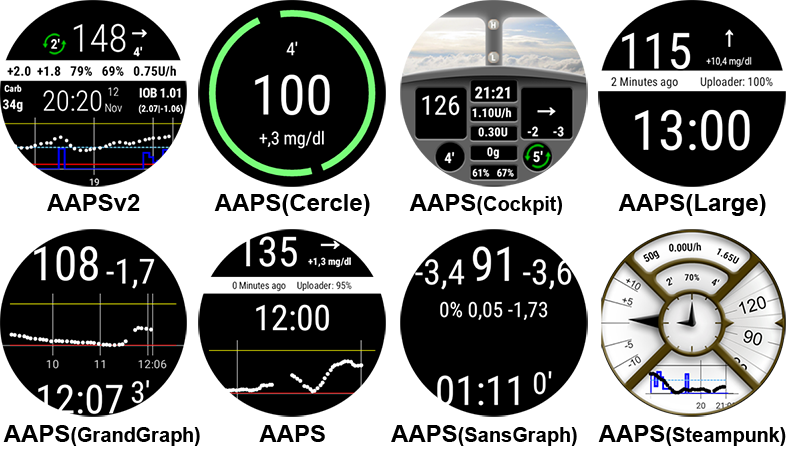
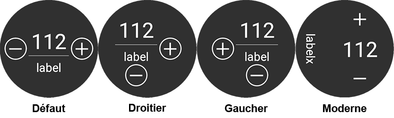
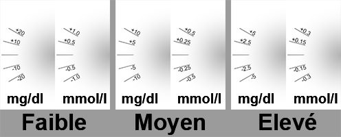

# AAPS sur montres Wear OS

Vous pouvez installer l'application AndroidAPS sur votre montre connectée **Wear OS**. La version montre de AAPS vous permet de:

* **display data on your watch**: by providing [custom watchfaces](Watchfaces-aaps-watchfaces) or in standard watchfaces with use of [complications](Watchfaces-complications)
* **contrôler AAPS du téléphone** : pour faire un bolus, définir une cible temporaire, etc.

### Avant d'acheter la montre...

* Certaines fonctions comme les *complications* nécessitent une version 2.0 ou plus récente de Wear OS
* Google a rebaptisé *Android Wear 1.x* en *Wear OS* depuis la version 2.x, donc quand il est indiqué *Android Wear* il est possible que ce soit une ancienne version 1.x du système
* Si la description indique seulement *Compatibilité avec Android* et *iOS* - cela **ne signifie pas** que la montre fonctionne sous *Wear OS* - cela peut tout à fait être une autre sorte de système d'exploitation spécifique au fournisseur **qui n'est pas compatible avec les cadrans AAPS wear!**
* Check [list of tested phones and watches](Phones-list-of-tested-phones) and [ask community](../Where-To-Go-For-Help/Connect-with-other-users.md) if in doubt if your watch will be supported

### Construction de la version Wear OS d'AAPS

L’application Wear OS de AAPS a été séparée de la compilation de AAPS pour Android mobile. Par conséquent, vous devez générer un second APK signé. Sélectionnez le module "AndroidAPS.wear" avec la variante "fullRelease" et un 2ème fichier apk pour la montre Wear OS est généré quand vous [générez l'APK](../Installing-AndroidAPS/Building-APK.md) (ou encore "pumpcontrolRelease" qui vous permettra de juste controler la pompe sans boucler).

À partir de mars 2021, vous devez mettre AAPS sur la montre, il n'est plus accessible via le Google Play Store de la montre. Vous pouvez utiliser [Wear Installer](https://youtu.be/8HsfWPTFGQI) que vous devrez installer sur votre montre et votre téléphone. L'application Wear Installer peut être téléchargée depuis le Google Play Store. La vidéo liée de Malcolm Bryant le développeur de Wear Installer vous donne des instructions détaillées pour a) télécharger l'apk sur votre mobile b) configurer le Débogueur Android sur la montre c) utiliser Wear Installer sur le mobile et la montre pour installer la version Wear OS de AAPS sur la montre. Une fois que vous aurez sélectionné AndroidAPS comme application pour la télécharger sur la montre, vous serez en mesure d'utiliser les cadrans, les complications et les contrôles AAPS.

### Configuration sur le téléphone

Dans AAPS, dans la Configuration, vous devez [activer le plugin Wear](Config-Builder-wear).

## Contrôler AAPS depuis la montre

AndroidAPS est conçu pour être *contrôlé* par les montres Android Wear. Si vous voulez commander AAPS depuis la montre (bolus etc) alors dans les "Paramètres Wear" vous devez activer "Commandes depuis la montre".

Les fonctions suivantes peuvent être déclenchées à partir de la montre :

* définir une cible temporaire
* utiliser l'assistant bolus (les paramètres à prendre en compte dans le calculs peuvent être définis dans [Paramètres de l'Assistant](Config-Builder-wear) sur le téléphone)
* administrer des eGlucides
* administrer un bolus (insuline + glucides)
* afficher les paramètres sur la montre
* état 
    * vérifier l'état de la pompe
    * vérifier l'état de la pompe
    * vérifier et modifier le profil (décalage horaire + pourcentage)
    * montrer la DTQ (Dose Totale Quotidienne = bolus + basale par jour)

(Watchfaces-aaps-watchfaces)=

## Cadrans AAPS

Il y a plusieurs cadrans à choisir qui incluent le delta moyen, l'IA, le débit temporaire de basal actuel et les profils de basal + le graphique de lecture MGC.

Vérifiez que les notifications d'AAPS ne sont pas bloquées sur la montre. La confirmation de l'action (par ex. bolus, cible temporaire) est envoyée par une notification que vous devrez glisser et cocher.

Pour accéder plus rapidement au menu AAPS, appuyez deux fois sur votre Gly. Avec un double appui sur la courbe Gly vous pouvez changer l'échelle de temps.

## Cadrans disponibles

(Watchfaces-new-watchface-as-of-androidaps-2-8)=

### Nouveau cadran depuis AndroidAPS 2.8

* La couleur, les lignes et le cercle sont personnalisables via la roue crantée du menu de sélection du cadran.

## Cadran AAPSv2 - Légende

A - temps écoulé depuis le dernier calcul de la boucle

B - lecture du capteur MGC

C - nombre de minutes depuis la dernière lecture MGC

D - changement par rapport à la dernière lecture MGC (en mmol ou mg/dl)

E - variation moyenne des lectures MGC depuis 15 minutes

F - niveau de batterie du téléphone

G - débits de basal (en U/h ou en % pendant un DBT)

H - IG (BGI) Impact Glycémique -> l'augmentation ou diminution que "devrait" avoir la glycémie en fonction de l'activité de l'insuline seule.

I - glucides (glucides actifs | e-glucides à venir)

J - Insuline Active (de bolus | de basal)

## Accès menu principal de AAPS

Pour accéder au menu principal d'AAPS, vous pouvez utiliser les options suivantes :

* double appui sur votre valeur de glycémie
* sélectionnez l'icône AAPS dans les applications de la montre
* appuyez sur la complication AAPS (si configuré pour le menu)

## Paramètres (dans la montre)

Pour accéder aux paramètres du cadran, entrez dans le menu principal AAPS, faites glisser vers le haut et sélectionnez "Paramètres".

L'étoile remplie est pour l'état activé (**On**), et l'étoile vide indique que le paramètre est désactivé (**Off**) :

### Paramètres du compagnon AAPS

* **Vibrer sur Bolus** (par défaut `Oui`):
* **Unités des Actions** (par défaut `mg/dl`) : si **On** l'unité des actions est `mg/dl`, si **Off** l'unité est `mmol/l`. Utilisé lors de la définition d'une CT à partir de la montre.

(Watchfaces-watchface-settings)=

### Paramètres cadran

* **Afficher Date** (par défaut `Off`): remarque, la date n'est pas disponible sur tous les cadrans
* **Afficher IA** (par défaut `On`) : afficher ou non la valeur de l'IA (le paramétrage de l'affichage des valeurs détaillées est dans les paramètres Wear du Générateur de configurations de AAPS)
* **Afficher GA** (par défaut `On`) : afficher ou non la valeur GA
* **Afficher Delta** (par défaut `On`) : afficher ou non la variation de Gly des 5 dernières minutes
* ** Afficher Delta Moyen** (par défaut `On`) : afficher ou non la variation moyenne des Gly des 15 dernières minutes
* **Afficher Batterie Téléphone** (par défaut `On`) : batterie du téléphone en %. Rouge si en dessous de 30%.
* **Afficher Batterie Système** (par défaut `Off`) : la batterie système est une synthèse de la batterie du Téléphone, de la pompe et de la pile du capteur (en général la plus faible des 3 valeurs)
* **Afficher Basale** (par défaut `On`) : afficher ou non le débit de basal (en U/h ou en % si DBT)
* **Afficher État Boucle** (par défaut `On`) : afficher ou non le nombre de minutes depuis le dernier calcul de boucle (les flèches autour de la valeur deviennent rouge si au-dessus de 15').
* **Afficher Glycémie** (par défaut `On`) : afficher ou non la dernière valeur de glycémie
* **Afficher flèche** (par défaut `On`) : afficher ou non la flèche de tendance Gly
* **Afficher Min Passées** (par défaut `On`) : afficher ou non le nombre de minutes depuis la dernière lecture.
* **Sombre** (par défaut `On`) : Vous pouvez changer l'arrière plan du cadran de noir à blanc (sauf pour les cadrans Cockpit et Steampunk)
* **Surbrillance Basale** (par défaut `Off`) : Améliorer la visibilité des débits de basal et basales temporaires
* **Séparateur** (par défaut `Off`) : pour les cadrans AAPS, AAPSv2 et AAPS(Large), affiche le fond du séparateur contrasté avec l'arrière plan (**Off**) ou de la même couleur que l'arrière plan (**On**)
* **Echelle Graphique** (par défaut `3 heures`) : vous pouvez sélectionner dans le sous-menu de la durée max de votre graphique entre 1 heure et 5 heures.

### Paramètre Interface Utilisateur

* **Design de saisie** : avec ce parametre, vous pouvez sélectionner la position des boutons "+" et "-" quand vous entrez des commandes pour AAPS (CT, Insuline, Glucides...)

### Paramètres spécifiques à certains cadrans

#### Cadran Steampunk

* **Précision Delta** (par défaut `Moyenne`)

#### Cercle WF

* **Gros chiffres** (par défaut `Off`) : Augmenter la taille du texte pour améliorer la visibilité
* **Historique** (par défaut `Off`) : Afficher graphiquement l'historique des Gly avec des cercles gris à l'intérieur de l'anneau vert de l'heure
* **Historique Léger** (par défaut `On`) : cercles plus discrets avec un gris foncé
* **Animations** (par défaut `On`) : Si activé, sur les montres supportée et hors mode économie d'énergie basse résolution, le cercle du cadran est animé

### Paramètres des commandes

* **Assistant dans Menu** (par défaut `On`) : Autoriser l'action Assistant dans le menu principal pour renseigner les Glucides et faire des Bolus à partir de la montre
* **Amorcer dans Menu** (par défaut `Off`) : Autoriser l'action Amorcer/Remplir à partir de la montre
* **Cible unique** (par défaut `On`):
    
    * `On`: vous définissez une valeur unique pour une CT
    * `Off`: vous définissez une cible basse et haute pour une CT

* **Assistant Pourcentage** (par défaut `Off`) : Autoriser la correction du bolus à partir de l'assistant (valeur saisie en pourcentage avant la confirmation)

(Watchfaces-complications)=

## Complications

La *complication* est un terme issu de l'horlogerie traditionnelle, il décrit l'ajout à la montre principale d'une autre petite fenêtre ou sous-cadran (avec date, jour de la semaine, phase lunaire, etc.). Wear OS 2.0 apporte cette métaphore pour permettre aux fournisseurs de données personnalisés, comme la météo, les notifications, compteurs de fitness et plus encore, d'ajouter ces informations à tous les cadrans qui supportent les complications.

AAPS Wear OS prend en charge les complications depuis la version `2.6`, et permet à tout les cadrans qui supporte les complications d'être configuré pour afficher les données liées à AAPS (Gly avec tendance, IA, GA, etc.).

Les complications servent également de **raccourci** aux fonctions AAPS. En appuyant dessus, vous pouvez ouvrir les menus et dialogues de AAPS (selon la complication et la configuration).

### Types de Complication

AAPS Wear OS ne fournit que des données brutes, selon les formats prédéfinis. Il revient au cadran récepteur de décider où et comment mettre en forme les complications, y compris sa mise en page, sa bordure, sa couleur et sa police. Parmi les nombreux types de complications Wear OS disponibles, AAPS utilise :

* `TEXTE COURT` - Contient deux lignes de texte, 7 caractères chacune, parfois appelés valeur et étiquette. Il est généralement affiché à l'intérieur d'un cercle ou d'une petite pilule - l'un au-dessous de l'autre, ou côte à côte. C'est une complication très compacte. AAPS essaye de supprimer les caractères inutiles pour l'ajuster : en arrondissant les valeurs, en supprimant les zéros de début et de fin des valeurs, etc.
* `TEXTE LONG` - Contient deux lignes de texte, d'environ 20 caractères chacune. Il est généralement affiché à l'intérieur d'un rectangle ou d'une longue pilule - l'une en dessous d'un autre. Il est utilisé pour plus de détails et des statuts textuels.
* `PLAGE DE VALEUR` - Utilisée pour les valeurs d'une plage prédéfinie, comme un pourcentage. Il contient une icône, une étiquette et est généralement rendu en tant que cadran de progression circulaire.
* `GRANDE IMAGE` - Image d'arrière-plan personnalisée qui peut être utilisée (si pris en charge par le cadran) en arrière-plan.

### Paramètres des complications

Pour ajouter une complication à un cadran, configurez-le par un appui long et cliquez sur la roue crantée en dessous. Selon la façon dont s'effectue le paramétrage du cadran - soit cliquez sur les espaces réservés, soit entrez dans le menu de paramétrage des complications du cadran. Les complications de AAPS sont regroupées dans le sous-menu AAPS.

Quand vous configurez les complications dans un cadran, Wear OS présente et filtre la liste des complications qui sont adaptées à la zone sélectionnée dans le cadran. Si certaines complications ne sont pas dans la liste, c'est probablement parce qu'elle ne peut pas être utilisée à cet endroit.

### Complications fournies par AAPS

AAPS fournit les complications suivantes :

* **Gly, GA & IA** (`TEXTE COURT`, ouvre *Menu*) : Affiche *Débit de Basal* sur la première ligne et *Glucides Actifs* et *Insuline Active* sur la deuxième ligne.
* **Glycémie** (`TEXTE COURT`, ouvre *Menu*) : Affiche la valeur de la *Glycémie* et la flèche de *tendance* sur la première ligne et *l'âge de la mesure* et le *delta Gly* sur la deuxième ligne.
* **GA & IA** (`TEXTE COURT`, ouvre *Menu*) : affiche *Glucides Actifs* sur la première ligne et *Insuline Active* sur la deuxième ligne.
* **GA Détaillé** (`TEXTE COURT`, ouvre *Assistant*) : affiche la valeur courante de *Glucides Actifs* sur la première ligne et les glucides planifiés (Glucides étendus à venir) sur la deuxième ligne.
* **Icone GA** (`TEXTE COURT`, ouvre *Assistant*) : affiche la valeur de *Glucides Actifs* avec une icône statique.
* **Statut Complet** (`TEXTE LONG`, ouvre *Menu*) : Indique que la plupart des données en même temps : *Glycémie* et flèche de *tendance*, *Delta Gly* et *âge de la mesure* sur la première ligne. Sur la deuxième ligne *Glucides Actifs*, *Insuline Active* et *Débit de basal*.
* **Statut Complet (inversé)** (`TEXTE LONG`, ouvre *Menu*) : Même données que pour le *Statut Complet*, mais les lignes sont inversées. Peut être utilisé dans certains cadrans qui ignorent l'une des deux lignes dans les `TEXTE LONG`
* **IA Détaillé** (`TEXTE COURT`, ouvre *Bolus*) : Affiche l'*Insuline Active* totale sur la première ligne et la part d'*IA* pour le *Bolus* et la *Basale* sur la deuxième ligne.
* **Icone IA** (`TEXTE COURT`, ouvre *Bolus*) : Affiche la valeur *Insuline Active* avec une icône statique.
* **Batterie du téléphone** (`PLAGE DE VALEURS`, ouvre *Etats*) : Affiche le pourcentage de batterie du téléphone AAPS, tel que signalé par AAPS. Affichée avec une jauge de pourcentage avec de l'icône de la batterie qui reflète la valeur envoyée. Il peut ne pas être mis à jour en temps réel, mais lorsque d'autres données importantes de AAPS changent (en général: toutes les ~ 5 minutes avec une nouvelle mesure de *Glycémie*).

De plus, il y a trois complications de type `IMAGE LARGE` : **Fond d'écran noir**, **fond d'écran gris** et **fond d'écran clair**, affichant une image AAPS statique.

### Paramètres des complications

* **Action Appui Complication** (par défaut `Défaut`) : Décide de l'action qui s'ouvre lorsque l'utilisateur appui sur la Complication : 
    * *Défaut* : action spécifique à chaque complication *(voir la liste ci-dessus)*
    * *Menu* : menu principal AAPS
    * *Assistant* : assistant bolus - calculateur bolus
    * *Bolus* : Bolus et glucides saisis directement
    * *eGlucides* : boîte de dialogue de configuration eGlucides
    * *Etats* : sous-menu d'états
    * *Aucun* : Désactive l'action sur les complications AAPS
* **Unicode dans Complications** (par défaut `On`) : Si `On`, la complication utilise des caractères Unicode pour les symboles tels que `Δ` Delta, `⁞` séparateur de point vertical ou `⎍` symbole du débit de basal. Le rendu de ces symboles dépend de la police, et cela peut être très spécifique au cadran. Cette option permet de désactiver les symboles `Unicode` quand c'est nécessaire - si la police utilisée par le cadran personnalisé ne prend pas en charge ces symboles - pour éviter les problèmes graphiques.

## Tuiles Wear OS

Les tuiles Wear OS fournissent un accès facile aux informations et aux actions utilisateur pour faire les choses. Les tuiles ne sont disponibles que sur montres Android fonctionnant sur Wear Os version 2.0 et supérieure.

Les tuiles vous permettent d'accéder rapidement aux actions de l'application AAPS sans passer par le menu de la montre. Les tuiles sont optionnelles et peuvent être ajoutées et configurées par l'utilisateur.

Les tuiles sont utilisées « à côté » de n'importe quel cadran de montre. Pour accéder à une tuile, une fois activé, glissez de droite à gauche sur votre cadran pour les afficher.

Veuillez noter que les tuiles n'affichent pas l'état courant de l'application AAPS et ne feront qu'une demande, qui devra-t être confirmée sur la montre avant d'être appliquée.

## Comment ajouter les tuiles :

Avant d'utiliser les tuiles, vous devez activer "Commandes depuis la montre" dans les paramètres "Wear OS" d'AAPS.

Selon votre version de Wear OS, la marque et le smartphone il y a deux façons d'activer les tuiles :

1. Sur votre montre, depuis votre cadran : 
    * Glissez de droite à gauche jusqu'à ce que vous atteigniez le "+ Ajouter des tuiles" 
    * Sélectionnez une des tuiles.
2. Sur votre téléphone, ouvrez l'application compagnon pour votre montre. 
    * Pour Samsung ouvrez "Galaxy Wearable", ou pour d'autres marques "Wear OS"
    * Cliquez sur la section "Tuiles", puis sur le bouton "+ Ajouter"
    * Trouvez la tuile AAPS que vous souhaitez ajouter en la sélectionnant.  L'ordre des tuiles peut être modifié en glisser-déposer

Le contenu des tuiles peut être personnalisé en appuyant longuement sur une tuile et en cliquant sur le bouton "Éditer" ou l'icône "Engrenage".

### Tuile APS(Actions)

La tuile d'action peut contenir de 1 à 4 boutons d'action définis par l'utilisateur. Pour configurer, appuyez longuement sur la tuile, qui affichera les options de configuration. Des actions similaires sont également disponibles via le menu de montre standard.

Les actions prises en charge dans la tuile d'action peuvent envoyer des requêtes dans l'application AAPS pour

* **Calc** : faire un calcul de bolus, basé sur l'entrée de glucides et avec un pourcentage optionnel [1]
* **Insuline** : demander l'injection d'insuline en entrant les unités d'insuline
* **Traitement** : demander à la fois l'injection d'insuline et ajouter des glucides
* **Glucides** : ajouter des glucides (étendus)
* **TempT** : définir une cible temporaire personnalisée ainsi que sa durée

[1] Via, le menu Wear OS, réglez l'option "Pourcentage de Calculateur" à "ON" pour afficher le pourcentage d'entrée dans la calculatrice de bolus. Le pourcentage par défaut est basé sur les paramètres du téléphone dans la section "Aperçu" ["Injecter cette partie de Bolus calculée par l’assistant en %"](Config-Builder.html#advanced-settings) Quand l'utilisateur ne fournit pas de pourcentage, la valeur par défaut du téléphone est utilisée. Configurez les autres paramètres de l'assistant bolus dans l'application téléphone via "Préférences" "Paramètres de l'assistant".

### AAPS(Cible Temp)

La tuile cible temporaire peut demander une cible temporaire basée sur les préréglages du téléphone AAPS. Configurez l'heure prédéfinie et les cibles à travers les paramètres de l'application téléphone en allant dans "Préférences", "Aperçu", ["Cibles temporaires par défaut"](Config-Builder.html#default-temp-targets) et définissez la durée et les cibles pour chaque raccourci. Configurez les actions visibles sur la tuile à travers les paramètres de tuile. Faites un appui long sur la tuile pour afficher les options de configuration et sélectionnez 1 à 4 options :

* **Activité** : pour le sport
* **Hypo** : pour augmenter la cible pendant le traitement d'une hypo
* **Repas imminent** : pour baisser la cible et augmenter l'insuline à bord
* **Manuel** : pour définir une cible temporaire personnalisée ainsi que sa durée
* **Annuler** : pout arrêter la cible temporaire actuelle

### AAPS(Assistant rapide)

The QuickWizard tile can hold 1 to 4 quick wizard action buttons, defined with the phone app[2]. See [QuickWizard](Config-Builder.html#quickwizard-settings). You can set standard meals (carbs and calculation method for the bolus) to be displayed on the tile depending on the time of the day. Ideal for the most common meals/snacks you eat during the day. You can specify if the quick wizard buttons will show on the phone, watch, or both. Please note that the phone can show only one quick wizard button at a time. The quick wizard setup also can specify a custom percentage of the insulin for the bolus. The custom percentage enables you to vary, for example, snack at 120%, slow absorbing breakfast 80% and hypo treatment sugar snack at 0%

[2] Wear OS limits tiles update frequency to only once every 30 seconds. When you notice that the changes on your phone are not reflected on the tile, consider; waiting 30 seconds, using the "Resend all data" button from the Wear OS section of AAPS, or removing the tile and adding it again. To change the order of the QuickWizard buttons dragging an item up or down.

## Toujours actif

La durée de vie de la batterie pour les montres Android Wear OS est un défi. Certaines montres tiennent jusqu'à 30 heures avant de les recharger. The display should be switched off for optimal power saving when not in use. Most watches support the “Always on” display.

Since AAPS version 3, we can use a “Simplify UI” during always-on-mode. This UI only contains the blood glucose, direction, and time. This UI is power-optimized with less frequent updates, showing less information and lightening fewer pixels to save power on OLED displays.

The simplified UI mode is available for the watch-faces: AAPS, AAPS V2, Home Big, Digital Style, Steampunk, and Cockpit. The simplified UI is optional and is configured through the watch face settings. (log press the watch face and click “edit” or the gear icon) Select the configuration “Simplify UI" and set it to “Always on” or “Always on and charging”.

### Mode nuit

While charging, it would be helpful if the display could stay “always-on” and show your blood glucose during the night. However, the standard watch-faces are too bright and have too much information, and the details are hard to read with sleepy eyes. Therefore, we added an option for the watch-face to simplify the UI only during charging when set in the configuration.

The simplified UI mode is available for the watch-faces: AAPS, AAPS V2, Home Big, Digital Style, Steampunk, and Cockpit. The simplified UI is optional and is configured through the watch face settings. (log press the watch face and click “edit” or the gear icon) Select the configuration “Simplify UI" and set it to “During charging” or “Always on and charging”

The Android developer options enable your watch to stay awake during charging. To make the developer options available, see https://developer.android.com/training/wearables/get-started/debugging. Set the “Stay awake when charging” to “on” in the developer options”.

Note: not all displays can handle always-on very well. It can cause screen burn-in, especially on the older OLED displays. The watches will generally dim the display to prevent burn-in; please check your owner’s manual, the manufacturing, or the internet for advice.

### Conseils sur les performances et la durée de vie des batteries

Wear OS watches are very power-constrained devices. The size of the watch case limits the capacity of the included battery. Even with recent advancements both on hardware and software side, Wear OS watches still require daily charging.

If an experienced battery span is shorter than a day (from dusk to dawn), here are some tips to troubleshoot the issues.

Main battery-demanding areas are:

* Affichage actif avec rétroéclairage (pour LED) ou en mode pleine intensité (pour OLED)
* Le rendu à l'écran
* Communication radio via Bluetooth

Since we cannot compromise on communication (we need up-to-date data) and want to have the most recent data rendered, most of the optimizations can be done in *display time* area:

* Les cadrans standards sont généralement mieux optimisés que ceux personnalisés, téléchargés depuis le store.
* Il est préférable d'utiliser des cadrans qui limitent la quantité de données affichées en mode inactif/veille.
* Soyez conscient lorsque vous utilisez d'autres Complications, comme les widgets météo de tiers - ou d'autres encore - qui utilisent des données provenant de sources externes.
* Commencez par des cadrans plus simples. Ajoutez une complication à la fois et observez comment elle affecte la durée de vie de la batterie.
* Try to use **Dark** theme for AAPS watchfaces, and [**Matching divider**](Watchfaces-watchface-settings). Sur les montres OLED, cela limitera la quantité de pixels allumés et limitera la consommation.
* Vérifiez ce qui fonctionne le mieux sur votre montre : les cadrans AAPS standards ou d'autres cadrans avec les Complications AAPS.
* Observez sur quelques jours, avec différents profils d'activités. La plupart des montres activent l'affichage sur le regard, des mouvements de poignet et d'autres déclencheurs liés à l'utilisation.
* Vérifiez les paramètres du système global qui affectent les performances : notifications, durée du rétro éclairage, affichage actif quand le GPS est activé.
* Check [list of tested phones and watches](Phones-list-of-tested-phones) and [ask community](../Where-To-Go-For-Help/Connect-with-other-users.md) for other users experiences and reported battery lifetime.
* **Nous ne pouvons pas garantir que les données affichées sur les Cadrans ou les complications sont à jour**. A la fin, c'est Wear OS qui décide quand mettre à jour le cadran ou la complication. Même lorsque l'application AAPS demande une mise à jour, le système peut décider de reporter ou d'ignorer les mises à jour pour préserver la batterie. En cas de doute et de batterie de montre faible - faites toujours une double vérification avec l'application AAPS sur le téléphone.

(Watchfaces-troubleshooting-the-wear-app)=

## Dépannage de l'application wear :

* Parfois, cela peut aider de resynchroniser AAPS avec la montre car cela peut être un peu lent quand il le fait tout seul : Wear / Renvoyer toutes les données
* Activez le débogage ADB dans les Options Développeur (sur la montre), connectez la montre via l'USB et démarrez l'application Wear une fois dans Android Studio.
* Si les Complications ne mettent pas à jour les données - vérifiez d'abord si les cadrans AAPS fonctionnent correctement.

### Sony Smartwatch 3

* La montre Sony Smartwatch 3 est l'une des plus populaires utilisée avec AAPS.
* Malheureusement, Google a abandonné la prise en charge des appareils sous Wear OS 1.5 à l'automne 2020. Cela entraîne des problèmes lors de l'utilisation de Sony SW3 avec AndroidAPS 2.7 et plus.
* A possible workaround can be found on this [troubleshooting page](../Usage/SonySW3.md).

## Afficher les données Nightscout

If you are using another looping system and want to *view* your looping detail on an Android Wear watch, or want to watch your child's looping, then you can build/download just the NSClient APK. To do this follow the [build APK instructions](../Installing-AndroidAPS/Building-APK.md) selecting the build variant "NSClientRelease". Il y a plusieurs cadrans à choisir qui incluent le delta moyen, l'IA, le débit temporaire de basal actuel et les profils de basal + le graphique de lecture MGC.

# Pebble

Pebble users can use the [Urchin watchface](https://github.com/mddub/urchin-cgm) to *view* looping data (if uploaded to Nightscout), but you will not be able to interact with AndroidAPS through the watch. You can choose fields to display such as IOB and currently active temp basal rate and predictions. If open looping you can use [IFTTT](https://ifttt.com/) to create an applet that says if Notification received from AndroidAPS then send either SMS or pushover notification.