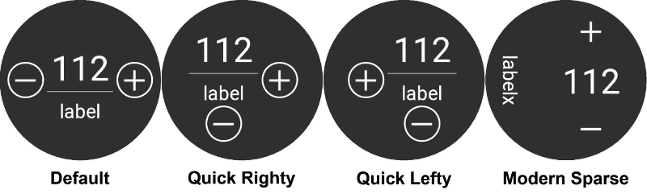

# AAPS sur montres Wear OS

You can install AndroidAPS app on your **Wear OS based** smartwatch. Watch version of AAPS allows you to:

* **display data on your watch**: by providing [custom watchfaces](../Configuration/Watchfaces#aaps-watchfaces) or in standard watchfaces with use of complications
* **control AAPS on phone**: to bolus, set a temporary target etc. 

### Before you buy watch...

* Some features like *complications* require Wear OS version 2.0 or newer to work
* Google rebranded *Android Wear 1.x* to *Wear OS* from version 2.x, so when it says *Android Wear* it may indicate older 1.x version of system
* If description of smartwatch indicates only compatibility with *Android* and *iOS* - it **does not** means it runs on *Wear OS* - it may as well be some other sort of Vendor specific OS **which is not compatible with AAPS wear!**
* Check [list of tested phones and watches](../Getting-Started/Phones#list-of-tested-phones) and [ask community](../Where-To-Go-For-Help/Connect-with-other-users.md) if in doubt if your watch will be supported

### Building Wear OS version of AAPS

To build Wear OS version of AAPS you needed to select the build variant "fullRelease" when [building the APK](../Installing-AndroidAPS/Building-APK.md) (or "pumpRelease" will allow you to just remote control the pump without looping).

Make sure both phone and wear versions of AAPS are signed with same keys!

Wear variant of APK need to be installed on watch in the same way you will install phone APK on phone. It may require enabling *developer mode* on watch and uploading and installing APK on watch with: `adb install wear-full-release.apk`

When using wear version of AAPS, always update it together with phone version of app - keep their versions in sync.

### Setup on the Phone

Within AndroidAPS, in the ConfigBuilder you need to [enable Wear plugin](../Configuration/Config-Builder#wear).

## Controlling AAPS from Watch

AndroidAPS est conçu pour être *contrôlé* par les montres Android Wear. If you want to bolus etc. from the watch then within "Wear settings" you need to enable "Controls from Watch".

Les fonctions suivantes peuvent être déclenchées à partir de la montre :

* définir une cible temporaire
* administrer un bolus
* administrer des eGlucides
* utilisez le calculateur de bolus (les paramètres à prendre en compte dans le calculs peuvent être définis dans [Paramètres de l'Assistant](../Configuration/Config-Builder#wear) sur le téléphone)
* vérifier l'état de la boucle et de la pompe
* montrer le DTI (Dosage Total d'Insuline quotidien = bolus + basale par jour)

## Cadrans AAPS

Il y a plusieurs cadrans à choisir qui inclus le delta moyen, l'IA, le débit temporaire de basal actuel et les profils de basal + le graphique de lecture MGC.

Vérifiez que les notifications d'AndroidAPS ne sont pas bloquées sur la montre. La confirmation de l'action (par ex. bolus, cible temporaire) est envoyée par une notification que vous devrez glisser et cocher.

Pour accéder plus rapidement au menu AAPS, appuyez deux fois sur votre Gly. Avec un double appui sur la courbe Gly vous pouvez changer l'échelle de temps.

## Cadrans disponibles

## Cadran AAPSv2 - Légende

A - temps écoulé depuis le dernier calcul de la boucle

B - lecture du capteur MGC

C - nombre de minutes depuis la dernière lecture MGC

D - changement par rapport à la dernière lecture MGC (en mmol ou mg/dl)

E - variation moyenne des lectures MGC depuis 15 minutes

F - niveau de batterie du téléphone

G - débits de basal (en U/h ou en % pendant un DBT)

H - BGI (blood glucose interaction) -> the degree to which BG “should” be rising or falling based on insulin activity alone.

I - glucides (glucides actifs | e-glucides à venir)

J - Insuline Active (de bolus | de basal)

## Accès menu principal de AAPS

Pour accéder au menu principal d'AAPS, vous pouvez utiliser les options suivantes :

* double appui sur votre valeur de glycémie
* sélectionnez l'icône AAPS dans les applications de la montre
* appuyez sur la complication AAPS (si configuré pour le menu)

## Paramètres (dans la montre)

Pour accéder aux paramètres du cadran, entrez dans le menu principal AAPS, faites glisser vers le haut et sélectionnez "Paramètres".

L'étoile remplie est pour l'état activé (**On**), et l'étoile vide indique que le paramètre est désactivé (**Off**) :

### Paramètres du compagnon AAPS

* **Vibrer sur Bolus** (par défaut `Oui`):
* **Unités des Actions** (par défaut `mg/dl`) : si **On** l'unité des actions est `mg/dl`, si **Off** l'unité est `mmol/l`. Utilisé lors de la définition d'une CT à partir de la montre.

### Paramètres cadran

* **Afficher Date** (par défaut `Off`): remarque, la date n'est pas disponible sur tous les cadrans
* **Afficher IA** (par défaut `On`) : afficher ou non la valeur de l'IA (le paramétrage de l'affichage des valeurs détaillées est dans les paramètres Wear du Générateur de configurations de AAPS)
* **Afficher GA** (par défaut `On`) : afficher ou non la valeur GA
* **Afficher Delta** (par défaut `On`) : afficher ou non la variation de Gly des 5 dernières minutes
* ** Afficher Delta Moyen** (par défaut `On`) : afficher ou non la variation moyenne des Gly des 15 dernières minutes
* **Afficher Batterie Téléphone** (par défaut `On`) : batterie du téléphone en %. Rouge si en dessous de 30%.
* **Afficher Batterie Système** (par défaut `Off`) : la batterie système est une synthèse de la batterie du Téléphone, de la pompe et de la pile du capteur (en général la plus faible des 3 valeurs)
* **Afficher Basale** (par défaut `On`) : afficher ou non le débit de basal (en U/h ou en % si DBT)
* **Afficher État Boucle** (par défaut `On`) : afficher ou non le nombre de minutes depuis le dernier calcul de boucle (les flèches autour de la valeur deviennent rouge si au-dessus de 15').
* **Afficher Glycémie** (par défaut `On`) : afficher ou non la dernière valeur de glycémie
* **Afficher flèche** (par défaut `On`) : afficher ou non la flèche de tendance Gly
* **Afficher Min Passées** (par défaut `On`) : afficher ou non le nombre de minutes depuis la dernière lecture.
* **Sombre** (par défaut `On`) : Vous pouvez changer l'arrière plan du cadran de noir à blanc (sauf pour les cadrans Cockpit et Steampunk)
* **Surbrillance Basale** (par défaut `Off`) : Améliorer la visibilité des débits de basal et basales temporaires
* **Séparateur** (par défaut `Off`) : pour les cadrans AAPS, AAPSv2 et AAPS(Large), affiche le fond du séparateur contrasté avec l'arrière plan (**Off**) ou de la même couleur que l'arrière plan (**On**)
* **Echelle Graphique** (par défaut `3 heures`) : vous pouvez sélectionner dans le sous-menu de la durée max de votre graphique entre 1 heure et 5 heures.

### Paramètre Interface Utilisateur

* **Input Design**: with this parameter, you can select the position of "+" and "-" buttons when you enter commands for AAPS (TT, Insulin, Carbs...)

### Paramètres spécifiques à certains cadrans

#### Cadran Steampunk

* **Précision Delta** (par défaut `Moyenne`)

#### Cadran Cercle

* **Big Numbers** (default `Off`): Increase text size to improve visibility
* **Ring History** (default `Off`): View graphically BG history with gray rings inside the hour's green ring
* **Light Ring History** (default `On`): Ring history more discreet with a darker gray
* **Animations** (default `On`): When enabled, on supported by watch and not in power saving low-res mode, watchface circle will be animated

### Paramètres des commandes

* **Assistant dans Menu** (par défaut `On`) : Autoriser l'action Assistant dans le menu principal pour renseigner les Glucides et faire des Bolus à partir de la montre
* **Amorcer dans Menu** (par défaut `Off`) : Autoriser l'action Amorcer/Remplir à partir de la montre
* **Cible unique** (par défaut `On`):
  
  * `On` : vous définissez une valeur unique pour une CT
  * `Off`: vous définissez une cible basse et haute pour une CT

* **Assistant Pourcentage** (par défaut `Off`) : Autoriser la correction du bolus à partir de l'assistant (valeur saisie en pourcentage avant la confirmation)

## Dépannage de l'application wear :

* Sur Android Wear 2.0, le cadran de la montre ne s'installe plus tout seul. Vous devez aller dans le playstore sur la montre (pas le même playstore que celui du téléphone) et le trouver dans la catégorie applications installées sur votre téléphone, à partir de là, vous pouvez l'activer. Activer également les mises à jour automatiques 
* Parfois, cela peut aider de resynchroniser AAPS avec la montre car cela peut être un peu lent quand il le fait tout seul : Wear / Renvoyer toutes les données
* Enable ADB debugging in Developer Options (on watch), connect the watch via USB and start the Wear app once in Android Studio.

## Afficher les données Nightscout

Si vous utilisez un autre système de bouclage et que vous voulez *voir* le détail de la boucle sur une montre Android Wear, ou si vous voulez regarder la boucle de votre enfant, vous pouvez juste construire/télécharger le fichier APK NSClient. Pour ce faire, suivez les instructions [construire l'APK](../Installing-AndroidAPS/Building-APK.md) en sélectionnant la variante de génération "NSClientRelease". Il y a plusieurs cadrans à choisir qui inclus le delta moyen, l'IA, le débit temporaire de basal actuel et les profils de basal + le graphique de lecture MGC.

# Pebble

Pebble users can use the [Urchin watchface](https://github.com/mddub/urchin-cgm) to *view* looping data (if uploaded to Nightscout), but you will not be able to interact with AndroidAPS through the watch. You can choose fields to display such as IOB and currently active temp basal rate and predictions. If open looping you can use [IFTTT](https://ifttt.com/) to create an applet that says if Notification received from AndroidAPS then send either SMS or pushover notification.