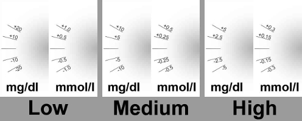

# AAPS sur montres Wear OS

Vous pouvez installer l'application AndroidAPS sur votre montre connectée **Wear OS**. La version montre de AAPS vous permet de:

* **afficher les données sur votre montre** : en fournissant des [cadrans personnalisés](#aaps-watchfaces) ou dans des cadrans standards avec l'utilisation de [complications](#complications)
* **contrôler AAPS du téléphone** : pour faire un bolus, définir une cible temporaire, etc. 

### Avant d'acheter la montre...

* Certaines fonctions comme les *complications* nécessitent une version 2.0 ou plus récente de Wear OS
* Google a rebaptisé *Android Wear 1.x* en *Wear OS* depuis la version 2.x, donc quand il est indiqué *Android Wear* il est possible que ce soit une ancienne version 1.x du système
* Si la description indique seulement *Compatibilité avec Android* et *iOS* - cela **ne signifie pas** que la montre fonctionne sous *Wear OS* - cela peut tout à fait être une autre sorte de système d'exploitation spécifique au fournisseur **qui n'est pas compatible avec les cadrans AAPS wear!**
* Vérifiez la [liste des téléphones et des montres testés](../Getting-Started/Phones#list-of-tested-phones) et [demandez à la communauté](../Where-To-Go-For-Help/Connect-with-other-users.md) si vous avez un doute si votre montre sera prise en charge

### Construction de la version Wear OS d'AAPS

Pour compiler la version Wear OS de AAPS vous devez choisir la version "fullRelease" quans vous [générez l'APK](../Installing-AndroidAPS/Building-APK.md) (ou "pumpRelease" qui permet juste de contrôler à distance la pompe sans boucle).

Assurez vous que les deux versions de AAPS (téléphone et montre) sont signées avec la même clé !

To install the APK on Android Wear smartwatch, follow these steps:

1. Enable developer mode on the watch. Press button on watch and click `settings` then `system` then `about` and repeatedly click the `build number` at least 7 times until it confirms you are a developer.
2. Enable ADB on watch. Press button on watch and click `settings` then `developer options` then `adb debugging` and `debug over wifi`. Note down the IP address you get next to this, it will be in the form of an IP address followed by :5555.
3. On PC, note down the file location of `wear-full-release.apk` (will be in the same folder as `app-full-release.apk` which you installed on your phone).
4. On PC, get the command prompt (type `command` in the search box). 
5. In command prompt: `cd c:\Program Files (x86)\Android\android-sdk\platform-tools`.
6. In command prompt: `adb connect [enter the IP address from step 2 including the :5555]`.
7. In command prompt: `adb install -r [enter path from step 3]\wear-full-release.apk`.
8. That will install AAPS on the watch, and AAPS watchfaces will be available to select.

When using wear version of AAPS, always update it together with phone version of app - keep their versions in sync. To do this you'll need to follow the steps above again, although you won't need to reenable developer mode.

### Configuration sur le téléphone

Dans AndroidAPS, dans le Générateur de configuration, vous devez [activer Wear](../Configuration/Config-Builder#wear).

## Contrôler AAPS depuis la montre

AndroidAPS est conçu pour être *contrôlé* par les montres Android Wear. Si vous voulez commander AAPS depuis la montre (bolus etc) alors dans les "Paramètres Wear" vous devez activer "Commandes depuis la montre".

Les fonctions suivantes peuvent être déclenchées à partir de la montre :

* définir une cible temporaire
* utiliser l'assistant bolus (les paramètres à prendre en compte dans le calculs peuvent être définis dans [Paramètres de l'Assistant](../Configuration/Config-Builder#wear) sur le téléphone)
* administrer des eGlucides
* administrer un bolus (insuline + glucides)
* afficher les paramètres sur la montre
* état 
    * vérifier l'état de la pompe
    * vérifier l'état de la pompe
    * vérifier et modifier le profil (décalage horaire + pourcentage)
    * montrer le DTI (Dosage Total d'Insuline quotidien = bolus + basale par jour)

## Cadrans AAPS

Il y a plusieurs cadrans à choisir qui inclus le delta moyen, l'IA, le débit temporaire de basal actuel et les profils de basal + le graphique de lecture MGC.

Vérifiez que les notifications d'AndroidAPS ne sont pas bloquées sur la montre. La confirmation de l'action (par ex. bolus, cible temporaire) est envoyée par une notification que vous devrez glisser et cocher.

Pour accéder plus rapidement au menu AAPS, appuyez deux fois sur votre Gly. Avec un double appui sur la courbe Gly vous pouvez changer l'échelle de temps.

## Cadrans disponibles

## Cadran AAPSv2 - Légende

A - temps écoulé depuis le dernier calcul de la boucle

B - lecture du capteur MGC

C - nombre de minutes depuis la dernière lecture MGC

D - changement par rapport à la dernière lecture MGC (en mmol ou mg/dl)

E - variation moyenne des lectures MGC depuis 15 minutes

F - niveau de batterie du téléphone

G - débits de basal (en U/h ou en % pendant un DBT)

H - IG (BGI) Impact Glycémique -> l'augmentation ou diminution que "devrait" avoir la glycémie en fonction de l'activité de l'insuline seule.

I - glucides (glucides actifs | e-glucides à venir)

J - Insuline Active (de bolus | de basal)

## Accès menu principal de AAPS

Pour accéder au menu principal d'AAPS, vous pouvez utiliser les options suivantes :

* double appui sur votre valeur de glycémie
* sélectionnez l'icône AAPS dans les applications de la montre
* appuyez sur la complication AAPS (si configuré pour le menu)

## Paramètres (dans la montre)

Pour accéder aux paramètres du cadran, entrez dans le menu principal AAPS, faites glisser vers le haut et sélectionnez "Paramètres".

L'étoile remplie est pour l'état activé (**On**), et l'étoile vide indique que le paramètre est désactivé (**Off**) :

### Paramètres du compagnon AAPS

* **Vibrer sur Bolus** (par défaut `Oui`):
* **Unités des Actions** (par défaut `mg/dl`) : si **On** l'unité des actions est `mg/dl`, si **Off** l'unité est `mmol/l`. Utilisé lors de la définition d'une CT à partir de la montre.

### Paramètres cadran

* **Afficher Date** (par défaut `Off`): remarque, la date n'est pas disponible sur tous les cadrans
* **Afficher IA** (par défaut `On`) : afficher ou non la valeur de l'IA (le paramétrage de l'affichage des valeurs détaillées est dans les paramètres Wear du Générateur de configurations de AAPS)
* **Afficher GA** (par défaut `On`) : afficher ou non la valeur GA
* **Afficher Delta** (par défaut `On`) : afficher ou non la variation de Gly des 5 dernières minutes
* ** Afficher Delta Moyen** (par défaut `On`) : afficher ou non la variation moyenne des Gly des 15 dernières minutes
* **Afficher Batterie Téléphone** (par défaut `On`) : batterie du téléphone en %. Rouge si en dessous de 30%.
* **Afficher Batterie Système** (par défaut `Off`) : la batterie système est une synthèse de la batterie du Téléphone, de la pompe et de la pile du capteur (en général la plus faible des 3 valeurs)
* **Afficher Basale** (par défaut `On`) : afficher ou non le débit de basal (en U/h ou en % si DBT)
* **Afficher État Boucle** (par défaut `On`) : afficher ou non le nombre de minutes depuis le dernier calcul de boucle (les flèches autour de la valeur deviennent rouge si au-dessus de 15').
* **Afficher Glycémie** (par défaut `On`) : afficher ou non la dernière valeur de glycémie
* **Afficher flèche** (par défaut `On`) : afficher ou non la flèche de tendance Gly
* **Afficher Min Passées** (par défaut `On`) : afficher ou non le nombre de minutes depuis la dernière lecture.
* **Sombre** (par défaut `On`) : Vous pouvez changer l'arrière plan du cadran de noir à blanc (sauf pour les cadrans Cockpit et Steampunk)
* **Surbrillance Basale** (par défaut `Off`) : Améliorer la visibilité des débits de basal et basales temporaires
* **Séparateur** (par défaut `Off`) : pour les cadrans AAPS, AAPSv2 et AAPS(Large), affiche le fond du séparateur contrasté avec l'arrière plan (**Off**) ou de la même couleur que l'arrière plan (**On**)
* **Echelle Graphique** (par défaut `3 heures`) : vous pouvez sélectionner dans le sous-menu de la durée max de votre graphique entre 1 heure et 5 heures.

### Paramètre Interface Utilisateur

* **Design de saisie** : avec ce parametre, vous pouvez sélectionner la position des boutons "+" et "-" quand vous entrez des commandes pour AAPS (CT, Insuline, Glucides...)

### Paramètres spécifiques à certains cadrans

#### Cadran Steampunk

* **Précision Delta** (par défaut `Moyenne`)

#### Cercle WF

* **Gros chiffres** (par défaut `Off`) : Augmenter la taille du texte pour améliorer la visibilité
* **Historique** (par défaut `Off`) : Afficher graphiquement l'historique des Gly avec des cercles gris à l'intérieur de l'anneau vert de l'heure
* **Historique Léger** (par défaut `On`) : cercles plus discrets avec un gris foncé
* **Animations** (par défaut `On`) : Si activé, sur les montres supportée et hors mode économie d'énergie basse résolution, le cercle du cadran est animé

### Paramètres des commandes

* **Assistant dans Menu** (par défaut `On`) : Autoriser l'action Assistant dans le menu principal pour renseigner les Glucides et faire des Bolus à partir de la montre
* **Amorcer dans Menu** (par défaut `Off`) : Autoriser l'action Amorcer/Remplir à partir de la montre
* **Cible unique** (par défaut `On`):
    
    * `On`: vous définissez une valeur unique pour une CT
    * `Off`: vous définissez une cible basse et haute pour une CT

* **Assistant Pourcentage** (par défaut `Off`) : Autoriser la correction du bolus à partir de l'assistant (valeur saisie en pourcentage avant la confirmation)

## Complications

La *complication* est un terme issu de l'horlogerie traditionnelle, il décrit l'ajout à la montre principale d'une autre petite fenêtre ou sous-cadran (avec date, jour de la semaine, phase lunaire, etc.). Wear OS 2. apporte cette métaphore pour permettre aux fournisseurs de données personnalisés, comme la météo, les notifications, compteurs de fitness et plus encore, d'ajouter ces informations à tous les cadrans qui supportent les complications.

AndroidAPS Wear OS prend en charge les complications depuis la version `2.6`, et permet à tout les cadrans qui supporte les complications d'être configuré pour afficher les données liées à AAPS (Gly avec tendance, IA, GA, etc.).

Les complications servent également de **raccourci** aux fonctions AAPS. En appuyant dessus, vous pouvez ouvrir les menus et dialogues de AAPS (selon la complication et la configuration).

### Types de Complication

AAPS Wear OS ne fournit que des données brutes, selon les formats prédéfinis. Il revient au cadran récepteur de décider où et comment mettre en forme les complications, y compris sa mise en page, sa bordure, sa couleur et sa police. Parmi les nombreux types de complications Wear OS disponibles, AAPS utilise :

* `TEXTE COURT` - Contient deux lignes de texte, 7 caractères chacune, parfois appelés valeur et étiquette. Il est généralement affiché à l'intérieur d'un cercle ou d'une petite pilule - l'un au-dessous de l'autre, ou côte à côte. C'est une complication très compacte. AAPS essaye de supprimer les caractères inutiles pour l'ajuster : en arrondissant les valeurs, en supprimant les zéros de début et de fin des valeurs, etc.
* `TEXTE LONG` - Contient deux lignes de texte, d'environ 20 caractères chacune. Il est généralement affiché à l'intérieur d'un rectangle ou d'une longue pilule - l'une en dessous d'un autre. Il est utilisé pour plus de détails et des statuts textuels.
* `PLAGE DE VALEUR` - Utilisée pour les valeurs d'une plage prédéfinie, comme un pourcentage. Il contient une icône, une étiquette et est généralement rendu en tant que cadran de progression circulaire.
* `GRANDE IMAGE` - Image d'arrière-plan personnalisée qui peut être utilisée (si pris en charge par le cadran) en arrière-plan.

### Paramètres des complications

Pour ajouter une complication à un cadran, configurez-le par un appui long et cliquez sur la roue crantée en dessous. Selon la façon dont s'effectue le paramétrage du cadran - soit cliquez sur les espaces réservés, soit entrez dans le menu de paramétrage des complications du cadran. Les complications de AAPS sont regroupées dans le sous-menu AAPS.

Quand vous configurez les complications dans un cadran, Wear OS présente et filtre la liste des complications qui sont adaptées à la zone sélectionnée dans le cadran. Si certaines complications ne sont pas dans la liste, c'est probablement parce qu'elle ne peut pas être utilisée à cet endroit.

### Complications fournies par AAPS

AndroidAPS fournit les complications suivantes :

* **Gly, GA & IA** (`TEXTE COURT`, ouvre *Menu*) : Affiche *Débit de Basal* sur la première ligne et *Glucides Actifs* et *Insuline Active* sur la deuxième ligne.
* **Glycémie** (`TEXTE COURT`, ouvre *Menu*) : Affiche la valeur de la *Glycémie* et la flèche de *tendance* sur la première ligne et *l'âge de la mesure* et le *delta Gly* sur la deuxième ligne.
* **GA & IA** (`TEXTE COURT`, ouvre *Menu*) : affiche *Glucides Actifs* sur la première ligne et *Insuline Active* sur la deuxième ligne.
* **GA Détaillé** (`TEXTE COURT`, ouvre *Assistant*) : affiche la valeur courante de *Glucides Actifs* sur la première ligne et les glucides planifiés (Glucides étendus à venir) sur la deuxième ligne.
* **Icone GA** (`TEXTE COURT`, ouvre *Assistant*) : affiche la valeur de *Glucides Actifs* avec une icône statique.
* **Statut Complet** (`TEXTE LONG`, ouvre *Menu*) : Indique que la plupart des données en même temps : *Glycémie* et flèche de *tendance*, *Delta Gly* et *âge de la mesure* sur la première ligne. Sur la deuxième ligne *Glucides Actifs*, *Insuline Active* et *Débit de basal*.
* **Statut Complet (inversé)** (`TEXTE LONG`, ouvre *Menu*) : Même données que pour le *Statut Complet*, mais les lignes sont inversées. Peut être utilisé dans certains cadrans qui ignorent l'une des deux lignes dans les `TEXTE LONG`
* **IA Détaillé** (`TEXTE COURT`, ouvre *Bolus*) : Affiche l'*Insuline Active* totale sur la première ligne et la part d'*IA* pour le *Bolus* et la *Basale* sur la deuxième ligne.
* **Icone IA** (`TEXTE COURT`, ouvre *Bolus*) : Affiche la valeur *Insuline Active* avec une icône statique.
* **Batterie du téléphone** (`PLAGE DE VALEURS`, ouvre *Etats*) : Affiche le pourcentage de batterie du téléphone AAPS, tel que signalé par AAPS. Affichée avec une jauge de pourcentage avec de l'icône de la batterie qui reflète la valeur envoyée. Il peut ne pas être mis à jour en temps réel, mais lorsque d'autres données importantes de AAPS changent (en général: toutes les ~ 5 minutes avec une nouvelle mesure de *Glycémie*).

De plus, il y a trois complications de type `IMAGE LARGE` : **Fond d'écran noir**, **fond d'écran gris** et **fond d'écran clair**, affichant une image AAPS statique.

### Paramètres des complications

* **Action Appui Complication** (par défaut `Défaut`) : Décide de l'action qui s'ouvre lorsque l'utilisateur appui sur la Complication : 
    * *Défaut* : action spécifique à chaque complication *(voir la liste ci-dessus)*
    * *Menu* : menu principal AAPS
    * *Assistant* : assistant bolus - calculateur bolus
    * *Bolus* : Bolus et glucides saisis directement
    * *eGlucides* : boîte de dialogue de configuration eGlucides
    * *Etats* : sous-menu d'états
    * *Aucun* : Désactive l'action sur les complications AAPS
* **Unicode dans Complications** (par défaut `On`) : Si `On`, la complication utilise des caractères Unicode pour les symboles tels que `Δ` Delta, `⁞` séparateur de point vertical ou `⎍` symbole du débit de basal. Le rendu de ces symboles dépend de la police, et cela peut être très spécifique au cadran. Cette option permet de désactiver les symboles `Unicode` quand c'est nécessaire - si la police utilisée par le cadran personnalisé ne prend pas en charge ces symboles - pour éviter les problèmes graphiques.

## Conseils sur les performances et la durée de vie des batteries

Les montres Wear OS sont des appareils très limités en énergie. La taille de la montre limite la capacité de la batterie incluse. Même avec les progrès récents tant du côté matériel que du côté logiciel, les montres Wear OS nécessitent toujours une charge quotidienne.

Si la durée de vie de la batterie est inférieure à une journée (de l'aube au crépuscule), voici quelques conseils pour résoudre les problèmes.

Les principaux consomateurs de batterie sont :

* Affichage actif avec rétroéclairage (pour LED) ou en mode pleine intensité (pour OLED)
* Le rendu à l'écran
* Communication radio via Bluetooth

Puisque nous ne pouvons pas transiger sur la communication (nous avons besoin de la mise à jour des données) et que nous voulons avoir les données les plus récentes, la plupart des optimisations peuvent être fait du côté du *délai d'affichage* :

* Les cadrans standards sont généralement mieux optimisés que ceux personnalisés, téléchargés depuis le store.
* Il est préférable d'utiliser des cadrans qui limitent la quantité de données affichées en mode inactif/veille.
* Soyez conscient lorsque vous utilisez d'autres Complications, comme les widgets météo de tiers - ou d'autres encore - qui utilisent des données provenant de sources externes.
* Commencez par des cadrans plus simples. Ajoutez une complication à la fois et observez comment elle affecte la durée de vie de la batterie.
* Essayez d'utiliser le thème **Sombre** pour les montres AAPS, et [**Séparateur invisible**](#watchface-settings). Sur les montres OLED, cela limitera la quantité de pixels allumés et limitera la consommation.
* Vérifiez ce qui fonctionne le mieux sur votre montre : les cadrans AAPS standards ou d'autres cadrans avec les Complications AAPS.
* Observez sur quelques jours, avec différents profils d'activités. La plupart des montres activent l'affichage sur le regard, des mouvements de poignet et d'autres déclencheurs liés à l'utilisation.
* Vérifiez les paramètres du système global qui affectent les performances : notifications, durée du rétro éclairage, affichage actif quand le GPS est activé.
* Vérifiez la [liste des téléphones et des montres testés](../Getting-Started/Phones#list-of-tested-phones) et [demandez à la communauté](../Where-To-Go-For-Help/Connect-with-other-users.md) pour avoir le retour d'expérience des autres utilisateurs et sur la durée de vie des batteries.
* **Nous ne pouvons pas garantir que les données affichées sur les Cadrans ou les complications sont à jour**. A la fin, c'est Wear OS qui décide quand mettre à jour le cadran ou la complication. Même lorsque l'application AAPS demande une mise à jour, le système peut décider de reporter ou d'ignorer les mises à jour pour préserver la batterie. En cas de doute et de batterie de montre faible - faites toujours une double vérification avec l'application AAPS sur le téléphone.

## Dépannage de l'application wear :

* Sur Android Wear 2.0, le cadran de la montre ne s'installe plus tout seul. Vous devez aller dans le playstore sur la montre (pas le même playstore que celui du téléphone) et le trouver dans la catégorie applications installées sur votre téléphone, à partir de là, vous pouvez l'activer. Activer également les mises à jour automatiques 
* Parfois, cela peut aider de resynchroniser AAPS avec la montre car cela peut être un peu lent quand il le fait tout seul : Wear / Renvoyer toutes les données
* Activez le débogage ADB dans les Options Développeur (sur la montre), connectez la montre via l'USB et démarrez l'application Wear une fois dans Android Studio.
* Si les Complications ne mettent pas à jour les données - vérifiez d'abord si les cadrans AAPS fonctionnent correctement.

### Sony Smartwatch 3

* The Sony Smartwach 3 is one of the most popular watches to be used with AAPS. 
* Malheureusement, Google a abandonné la prise en charge des appareils sous Wear OS 1.5 à l'automne 2020. This leads to problems when using Sony SW3 with AndroidAPS and above.
* A possible workaround can be found on this [troubleshooting page](../Usage/SonySW3.rst).

## Afficher les données Nightscout

Si vous utilisez un autre système de bouclage et que vous voulez *voir* le détail de la boucle sur une montre Android Wear, ou si vous voulez regarder la boucle de votre enfant, vous pouvez juste construire/télécharger le fichier APK NSClient. Pour ce faire, suivez les instructions [construire l'APK](../Installing-AndroidAPS/Building-APK.md) en sélectionnant la variante de génération "NSClientRelease". Il y a plusieurs cadrans à choisir qui inclus le delta moyen, l'IA, le débit temporaire de basal actuel et les profils de basal + le graphique de lecture MGC.

# Pebble

Les utilisateurs de Pebble peuvent utiliser le [Cadran Urchin](https://github.com/mddub/urchin-cgm) pour *voir* les données de la boucle (si elles sont téléchargée sur Nightscout), mais vous ne pourrez pas interagir avec AndroidAPS depuis la montre. Vous pouvez choisir des zones à afficher telles que l'IA, le débit de basal temporaire courant et les courbes de prédiction. Si vous êtes en boucle ouverte, vous pouvez utiliser [IFTTT](https://ifttt.com/) pour créer un applet qui dira si une Notification reçue de AndroidAPS doit envoyer un SMS ou une Notification.