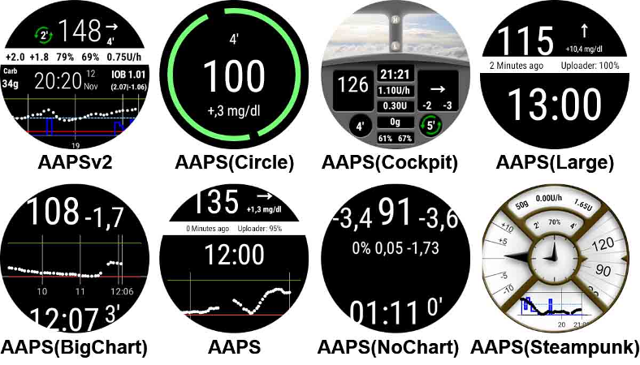

# AAPS sur montres Wear OS

You can install AndroidAPS app on your **Wear OS based** smartwatch. Watch version of AAPS allows you to:

* **display data on your watch**: by providing [custom watchfaces](#aaps-watchfaces) or in standard watchfaces with use of [complications](#complications)
* **control AAPS on phone**: to bolus, set a temporary target etc. 

### Before you buy watch...

* Some features like *complications* require Wear OS version 2.0 or newer to work
* Google rebranded *Android Wear 1.x* to *Wear OS* from version 2.x, so when it says *Android Wear* it may indicate older 1.x version of system
* If description of smartwatch indicates only compatibility with *Android* and *iOS* - it **does not** means it runs on *Wear OS* - it may as well be some other sort of Vendor specific OS **which is not compatible with AAPS wear!**
* Check [list of tested phones and watches](../Getting-Started/Phones#list-of-tested-phones) and [ask community](../Where-To-Go-For-Help/Connect-with-other-users.md) if in doubt if your watch will be supported

### Building Wear OS version of AAPS

To build Wear OS version of AAPS you needed to select the build variant "fullRelease" when [building the APK](../Installing-AndroidAPS/Building-APK.md) (or "pumpRelease" will allow you to just remote control the pump without looping).

Make sure both phone and wear versions of AAPS are signed with same keys!

Wear variant of APK need to be installed on watch in the same way you will install phone APK on phone. It may require enabling *developer mode* on watch and uploading and installing APK on watch with: `adb install wear-full-release.apk`

When using wear version of AAPS, always update it together with phone version of app - keep their versions in sync.

### Setup on the Phone

Within AndroidAPS, in the ConfigBuilder you need to [enable Wear plugin](../Configuration/Config-Builder#wear).

## Controlling AAPS from Watch

AndroidAPS est conçu pour être *contrôlé* par les montres Android Wear. If you want to bolus etc. from the watch then within "Wear settings" you need to enable "Controls from Watch".

Les fonctions suivantes peuvent être déclenchées à partir de la montre :

* définir une cible temporaire
* administrer un bolus
* administrer des eGlucides
* utilisez le calculateur de bolus (les paramètres à prendre en compte dans le calculs peuvent être définis dans [Paramètres de l'Assistant](../Configuration/Config-Builder#wear) sur le téléphone)
* vérifier l'état de la boucle et de la pompe
* montrer le DTI (Dosage Total d'Insuline quotidien = bolus + basale par jour)

## Cadrans AAPS

Il y a plusieurs cadrans à choisir qui inclus le delta moyen, l'IA, le débit temporaire de basal actuel et les profils de basal + le graphique de lecture MGC.

Vérifiez que les notifications d'AndroidAPS ne sont pas bloquées sur la montre. La confirmation de l'action (par ex. bolus, cible temporaire) est envoyée par une notification que vous devrez glisser et cocher.

Pour accéder plus rapidement au menu AAPS, appuyez deux fois sur votre Gly. Avec un double appui sur la courbe Gly vous pouvez changer l'échelle de temps.

## Cadrans disponibles

## Cadran AAPSv2 - Légende

A - temps écoulé depuis le dernier calcul de la boucle

B - lecture du capteur MGC

C - nombre de minutes depuis la dernière lecture MGC

D - changement par rapport à la dernière lecture MGC (en mmol ou mg/dl)

E - variation moyenne des lectures MGC depuis 15 minutes

F - niveau de batterie du téléphone

G - débits de basal (en U/h ou en % pendant un DBT)

H - BGI (blood glucose interaction) -> the degree to which BG “should” be rising or falling based on insulin activity alone.

I - glucides (glucides actifs | e-glucides à venir)

J - Insuline Active (de bolus | de basal)

## Accès menu principal de AAPS

Pour accéder au menu principal d'AAPS, vous pouvez utiliser les options suivantes :

* double appui sur votre valeur de glycémie
* sélectionnez l'icône AAPS dans les applications de la montre
* appuyez sur la complication AAPS (si configuré pour le menu)

## Paramètres (dans la montre)

Pour accéder aux paramètres du cadran, entrez dans le menu principal AAPS, faites glisser vers le haut et sélectionnez "Paramètres".

L'étoile remplie est pour l'état activé (**On**), et l'étoile vide indique que le paramètre est désactivé (**Off**) :

### Paramètres du compagnon AAPS

* **Vibrer sur Bolus** (par défaut `Oui`):
* **Unités des Actions** (par défaut `mg/dl`) : si **On** l'unité des actions est `mg/dl`, si **Off** l'unité est `mmol/l`. Utilisé lors de la définition d'une CT à partir de la montre.

### Paramètres cadran

* **Afficher Date** (par défaut `Off`): remarque, la date n'est pas disponible sur tous les cadrans
* **Afficher IA** (par défaut `On`) : afficher ou non la valeur de l'IA (le paramétrage de l'affichage des valeurs détaillées est dans les paramètres Wear du Générateur de configurations de AAPS)
* **Afficher GA** (par défaut `On`) : afficher ou non la valeur GA
* **Afficher Delta** (par défaut `On`) : afficher ou non la variation de Gly des 5 dernières minutes
* ** Afficher Delta Moyen** (par défaut `On`) : afficher ou non la variation moyenne des Gly des 15 dernières minutes
* **Afficher Batterie Téléphone** (par défaut `On`) : batterie du téléphone en %. Rouge si en dessous de 30%.
* **Afficher Batterie Système** (par défaut `Off`) : la batterie système est une synthèse de la batterie du Téléphone, de la pompe et de la pile du capteur (en général la plus faible des 3 valeurs)
* **Afficher Basale** (par défaut `On`) : afficher ou non le débit de basal (en U/h ou en % si DBT)
* **Afficher État Boucle** (par défaut `On`) : afficher ou non le nombre de minutes depuis le dernier calcul de boucle (les flèches autour de la valeur deviennent rouge si au-dessus de 15').
* **Afficher Glycémie** (par défaut `On`) : afficher ou non la dernière valeur de glycémie
* **Afficher flèche** (par défaut `On`) : afficher ou non la flèche de tendance Gly
* **Afficher Min Passées** (par défaut `On`) : afficher ou non le nombre de minutes depuis la dernière lecture.
* **Sombre** (par défaut `On`) : Vous pouvez changer l'arrière plan du cadran de noir à blanc (sauf pour les cadrans Cockpit et Steampunk)
* **Surbrillance Basale** (par défaut `Off`) : Améliorer la visibilité des débits de basal et basales temporaires
* **Séparateur** (par défaut `Off`) : pour les cadrans AAPS, AAPSv2 et AAPS(Large), affiche le fond du séparateur contrasté avec l'arrière plan (**Off**) ou de la même couleur que l'arrière plan (**On**)
* **Echelle Graphique** (par défaut `3 heures`) : vous pouvez sélectionner dans le sous-menu de la durée max de votre graphique entre 1 heure et 5 heures.

### Paramètre Interface Utilisateur

* **Input Design**: with this parameter, you can select the position of "+" and "-" buttons when you enter commands for AAPS (TT, Insulin, Carbs...)

### Paramètres spécifiques à certains cadrans

#### Cadran Steampunk

* **Précision Delta** (par défaut `Moyenne`)

#### Cadran Cercle

* **Big Numbers** (default `Off`): Increase text size to improve visibility
* **Ring History** (default `Off`): View graphically BG history with gray rings inside the hour's green ring
* **Light Ring History** (default `On`): Ring history more discreet with a darker gray
* **Animations** (default `On`): When enabled, on supported by watch and not in power saving low-res mode, watchface circle will be animated

### Paramètres des commandes

* **Assistant dans Menu** (par défaut `On`) : Autoriser l'action Assistant dans le menu principal pour renseigner les Glucides et faire des Bolus à partir de la montre
* **Amorcer dans Menu** (par défaut `Off`) : Autoriser l'action Amorcer/Remplir à partir de la montre
* **Cible unique** (par défaut `On`):
  
  * `On` : vous définissez une valeur unique pour une CT
  * `Off`: vous définissez une cible basse et haute pour une CT

* **Assistant Pourcentage** (par défaut `Off`) : Autoriser la correction du bolus à partir de l'assistant (valeur saisie en pourcentage avant la confirmation)

## Complications

*Complication* is a term from traditional watchmaking, where it describes addition to the main watchface - as another small window or sub-dial (with date, day of the week, moon phase, etc.). Wear OS 2.0 brings that metaphor to allow custom data providers, like weather, notifications, fitness counters and more - to be added to any watchfaces that support complications.

AndroidAPS Wear OS app supports complications since build `2.6`, and allow any third party watchface that supports complications to be configured to display AAPS related data (BG with the trend, IOB, COB, etc.).

Complications also serve as **shortcut** to AAPS functions. By tapping them you can open AAPS related menus and dialogs (depending on complication type and configuration).

### Complication Types

AAPS Wear OS app provides only raw data, according to predefined formats. It is up to third-party watchface to decide where and how to render complications, including its layout, border, color, and font. From many Wear OS complication types available, AAPS uses:

* `SHORT TEXT` - Contains two lines of text, 7 characters each, sometimes referred to as value and label. Usually rendered inside a circle or small pill - one below another, or side by side. It is a very space-limited complication. AAPS tries to remove unnecessary characters to fit-in: by rounding values, removing leading and trailing zeroes from values, etc.
* `LONG TEXT` - Contains two lines of text, about 20 characters each. Usually rendered inside a rectangle or long pill - one below another. It is used for more details and textual status.
* `RANGED VALUE` - Used for values from predefined range, like a percentage. It contains icon, label and is usually rendered as circle progress dial.
* `LARGE IMAGE` - Custom background image that can be used (when supported by watchface) as background.

### Complication Setup

To add complication to watchface, configure it by long press and clicking the gear icon below. Depending on how specific watchface configures them - either click on placeholders or enter the watchface setup menu for complications. AAPS complications are grouped under the AAPS menu entry.

When configuring complications on watchface, Wear OS will present and filter the list of complications that can be fit into selected complication place on watchface. If specific complications cannot be found on the list, it is probably due to its type that cannot be used for the given place.

### Complications provided by AAPS

AndroidAPS provides following complications:

* **BR, CoB & IoB** (`SHORT TEXT`, opens *Menu*): Displays *Basal Rate* on the first line and *Carbs on Board* and *Insulin on Board* on the second line.
* **Blood Glucose** (`SHORT TEXT`, opens *Menu*): Displays *Blood Glucose* value and *trend* arrow on the first line and *measurement age* and *BG delta* on the second line.
* **CoB & IoB** (`SHORT TEXT`, opens *Menu*): Displays *Carbs on Board* on the first line and *Insulin on Board* on the second line.
* **CoB Detailed** (`SHORT TEXT`, opens *Wizard*): Displays current active *Carbs on Board* on the first line and planned (future, eCarbs) Carbs on the second line.
* **CoB Icon** (`SHORT TEXT`, opens *Wizard*): Displays *Carbs on Board* value with a static icon.
* **Full Status** (`LONG TEXT`, opens *Menu*): Shows most of the data at once: *Blood Glucose* value and *trend* arrow, *BG delta* and *measurement age* on the first line. On the second line *Carbs on Board*, *Insulin on Board* and *Basal Rate*.
* **Full Status (flipped)** (`LONG TEXT`, opens *Menu*): Same data as for standard *Full Status*, but lines are flipped. Can be used in watchfaces which ignores one of two lines in `LONG TEXT`
* **IoB Detailed** (`SHORT TEXT`, opens *Bolus*): Displays total *Insulin on Board* on the first line and split of *IoB* for *Bolus* and *Basal* part on the second line.
* **IoB Icon** (`SHORT TEXT`, opens *Bolus*): Displays *Insulin on Board* value with a static icon.
* **Uploader/Phone Battery** (`RANGED VALUE`, opens *Status*): Displays battery percentage of AAPS phone (uploader), as reported by AAPS. Displayed as percentage gauge with a battery icon that reflects reported value. It may be not updated in real-time, but when other important AAPS data changes (usually: every ~5 minutes with new *Blood Glucose* measurement).

Additionally, there are three complications of `LARGE IMAGE` kind: **Dark Wallpaper**, **Gray Wallpaper** and **Light Wallpaper**, displaying static AAPS wallpaper.

### Complication related settings

* **Complication Tap Action** (default `Default`): Decides which dialog is opened when user taps complication: 
  * *Default*: action specific to complication type *(see list above)*
  * *Menu*: AAPS main menu
  * *Wizard*: bolus wizard - bolus calculator
  * *Bolus*: direct bolus value entry
  * *eCarb*: eCarb configuration dialog
  * *Status*: status sub-menu
  * *None*: Disables tap action on AAPS complications
* **Unicode in Complications** (default `On`): When `On`, the complication will use Unicode characters for symbols like `Δ` Delta, `⁞` vertical dot separator or `⎍` Basal Rate symbol. Rendering of them depends on the font, and that can be very watchface-specific. This option allows switching Unicode symbols `Off` when needed - if the font used by custom watchface does not support those symbols - to avoid graphical glitches.

## Performance and battery life tips

Wear OS watches are very power-constrained devices. The size of the watch case limits the capacity of the included battery. Even with recent advancements both on hardware and software side, Wear OS watches still require daily charging.

If an experienced battery span is shorter than a day (from dusk to dawn), here are some tips to troubleshoot the issues.

Main battery-demanding areas are:

* Active display with a backlight on (for LED) or in full intensity mode (for OLED)
* Rendering on screen
* Radio communication over Bluetooth

Since we cannot compromise on communication (we need up-to-date data) and want to have the most recent data rendered, most of the optimizations can be done in *display time* area:

* Stock watchfaces are usually better optimized than custom one, downloaded from the store.
* It is better to use watchfaces that limit the amount of rendered data in inactive / dimmed mode.
* Be aware when mixing other Complications, like third party weather widgets, or other - utilizing data from external sources.
* Start with simpler watchfaces. Add one complication at the time and observe how they affect battery life.
* Try to use **Dark** theme for AAPS watchfaces, and **Matching divider**. On OLED devices it will limit the amount of pixels lit and limit burnout.
* Check what performs better on your watch: AAPS stock watchfaces or other watchfaces with AAPS Complications.
* Observe over a few days, with different activity profiles. Most watches activate the display on glancing, movement and other usage-related triggers.
* Check your global system settings that affect performance: notifications, backlight/active display timeout, when GPS is activated.
* Check [list of tested phones and watches](../Getting-Started/Phones#list-of-tested-phones) and [ask community](../Where-To-Go-For-Help/Connect-with-other-users.md) for other users experiences and reported battery lifetime.
* **We cannot guarantee that data displayed on watchface or complication is up-to-date**. In the end, it is up to Wear OS to decide when to update a watchface or a complication. Even when the AAPS app requests update, the System may decide to postpone or ignore updates to conserve battery. When in doubt and low on battery on watch - always double-check with main AAPS app on phone.

## Troubleshooting the wear app:

* On Android Wear 2.0 the watch screen does not install by itself anymore. You need to go into the playstore on the watch (not the same as the phone playstore) and find it in the category apps installed on your phone, from there you can activate it. Also enable auto update. 
* Sometimes it helps to re-sync the apps to the watch as it can be a bit slow to do so itself: Android Wear > Cog icon > Watch name > Resync apps.
* Enable ADB debugging in Developer Options (on watch), connect the watch via USB and start the Wear app once in Android Studio.
* If Complications does not update data - check first if AAPS watchfaces work at all.

## View Nightscout data

If you are using another looping system and want to *view* your looping detail on an Android Wear watch, or want to watch your child's looping, then you can build/download just the NSClient APK. To do this follow the [build APK instructions](../Installing-AndroidAPS/Building-APK.md) selecting the build variant "NSClientRelease". Il y a plusieurs cadrans à choisir qui inclus le delta moyen, l'IA, le débit temporaire de basal actuel et les profils de basal + le graphique de lecture MGC.

# Pebble

Pebble users can use the [Urchin watchface](https://github.com/mddub/urchin-cgm) to *view* looping data (if uploaded to Nightscout), but you will not be able to interact with AndroidAPS through the watch. You can choose fields to display such as IOB and currently active temp basal rate and predictions. If open looping you can use [IFTTT](https://ifttt.com/) to create an applet that says if Notification received from AndroidAPS then send either SMS or pushover notification.