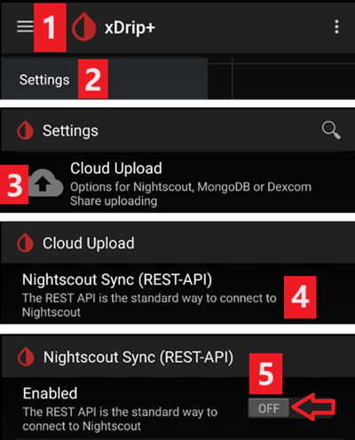
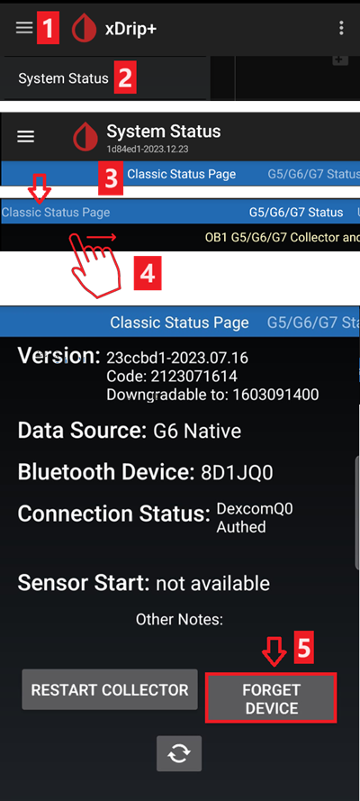

# Paramètres xDrip+

(Pour plus d'informations concernant xDrip+, veuillez vous référer à https://xdrip.readthedocs.io/en/latest/)

S'il n'est pas déjà configuré, téléchargez [xDrip+](https://jamorham.github.io/#xdrip-plus).

**Cette documentation est pour xDrip+ pour Android.** Il y a une application "xDrip pour iOS" qui n'a rien à voir avec l'original xDrip+ pour Android.

Pour les émetteurs G6 fabriqués après l’automne/fin 2018 (c.a.d. N° de série commençant par 80 ou 81) vous pouvez utiliser la version [master](https://jamorham.github.io/#xdrip-plus).

Si le numéro de série de votre émetteur Dexcom G6 commence par 8G, 8H ou 8J utilisez l'une des [dernières "Nightly build"](https://github.com/NightscoutFoundation/xDrip/releases).

Si votre téléphone tourne Android 10 et que vous avez des difficultés avec la version master de xDrip+ essayez la[ build 2019/12/31 ou plus récente ](https://github.com/NightscoutFoundation/xDrip/releases).

## Paramètres de base pour tous les systèmes MGC & MGF

* Assurez-vous de définir correctement l'URL de base incluant **S** à la fin de http**s**:// (et non http://)
   
   par ex. https://API_SECRET@your-app-name.herokuapp.com/api/v1/
   
   -> Menu Hamburger (en haut à gauche de l'écran d'accueil) -> Paramètres-> Cloud Upload -> Syncchronisation Nightscout (REST-API) -> URL de base

* Désactivez `Automatic Calibration` Si la case `Automatic Calibration` est cochée, Activez `Download data` une fois, ensuite décochez la case pour `Automatic Calibration` et désactivez `Download data` à nouveau, sinon les traitements (insuline & glucides) seront ajoutés deux fois dans Nightscout.

* Appuyez sur `Extra Options`

* Désactivez `Upload treatments` et `Back-fill data`.
   
   **Avertissement de sécurité : Vous devez désactiver "Upload treatments" dans xDrip, sinon les traitements peuvent être doublés dans les AAPS conduisant à de faux GA et IA.**

* L'option `Alert on failures` doit également être désactivée. Sinon, vous aurez une alarme toutes les 5 minutes dans le cas ou le wifi / réseau mobile est trop mauvais, ou si le serveur n'est pas disponible.
   
   
   
   

* **Inter App-Settings** (Diffusion locale) Si vous voulez utiliser AndroidAPS et que les données doivent être transmises à AndroidAPS, vous devez activer la Diffusion locale dans xDrip + dans les paramètres Inter-app.

* Pour que les valeurs soient les mêmes, vous devez activer `Send Display Glucose`.

* Si vous avez aussi activé `Accept Treatments` et "Activé la diffusion locale" dans AndroidAPS, alors xDrip+ recevra l'insuline, les glucides et les informations sur les débits de basal d'AndroidAPS et peut estimer la prédiction des hypo, etc. avec plus de précision.
   
   

(identify-receiver)=

### Identifier le récepteur

* Si vous rencontrez des problèmes avec la diffusion locale (AAPS ne recevant pas les valeurs de glycémie de xDrip+) allez dans Réglages > Réglages Inter-app > Identifier le récepteur et entrez `info.nightscout.androidaps` pour AndroidAPS (si vous utilisez la version PumpControl , veuillez entrer `info.nightscout.aapspumpcontrol` à la place!!).
* Attention: La correction automatique a parfois tendance à changer la lettre i en majuscules. Vous **devez utiliser uniquement des lettres minuscules** en tapant `info.nightscout.androidaps` (ou `info.nightscout.aapspumpcontrol` pour PumpControl). Un I majuscule empêcherait l'apoplication de recevoir les valeurs de Gly de xDrip+.
   
   

## xDrip+ & Dexcom G6

* L'émetteur Dexcom G6 peut être connecté simultanément au récepteur Dexcom (ou alternativement à la pompe t:slim) et à une application sur votre téléphone.
* Lorsque vous utilisez xDrip+ comme récepteur, désinstallez d'abord l'application Dexcom. **Vous ne pouvez pas connecter xDrip + et l'application Dexcom avec l'émetteur en même temps !**
* If you need Clarity and want to profit from xDrip+ alarms use the [Build Your Own Dexcom App](../Hardware/DexcomG6.md#if-using-g6-with-build-your-own-dexcom-app) with local broadcast to xDrip+.

### Version de XDrip+ en fonction du numéro de série de l'émetteur G6.

* Pour les émetteurs G6 fabriqués après l’automne/fin 2018 (c.a.d. N° de série commençant par 80 ou 81) vous pouvez utiliser la version [master](https://jamorham.github.io/#xdrip-plus). 
* Si le numéro de série de votre émetteur Dexcom G6 commence par 6G, 8H ou 8J, essayez la [version pre-release du 28/07/2019 ou plus récente](https://github.com/NightscoutFoundation/xDrip/releases).

### Paramètres spécifiques à Dexcom

* Ouvez les paramètres de débogage G5/G6 -> Menu Hamburger (en haut à gauche de l'écran d'accueil) -> Paramètres -> G5/G6 Debug Settings 

* Activez les paramètres suivants
   
   * `Use the OB1 Collector`
   * `Native Algorithm` (important if you want to use SMB)
   * `G6 support`
   * `Allow OB1 unbonding`
   * `Allow OB1 initiate bonding`
* Toutes les autres options doivent être désactivées
* Ajuster le niveau d'alerte batterie à 280 (en bas des paramètres de débogage G5/G6)
   
   

### Redémarrages préventifs non recommandés

**With Dexcom transmitters who's serial no. is starting with 8G, 8H or 8J preemptive restarts do not work and might kill the sensor completely!**

The automatic extension of Dexcom sensors (`preemptive restarts`) is not recommended as this might lead to “jumps” in BG values on day 9 after restart.

What’s clear is that using the G6 is perhaps a little more complex than it as first suggests. To use it safely, there are a few points to be aware of:

* Si vous utilisez les données natives avec le code d'étalonnage dans xDrip+ ou Spike, la chose la plus sûre à faire est de ne pas autoriser les redémarrages préventifs du capteur.
* Si vous devez faire un redémarrage préventif, assurez-vous de le faire à un moment de la journée où vous pouvez observer le changement et faire la calibration si nécessaire. 
* Si vous redémarrez des capteurs, fais-le sans l'étalonnage de l'usine pour obtenir les résultats les plus sûrs les jours 11 et 12, ou assurez-vous que vous êtes prêt à le calibrer et à garder un oeil sur la variation.
* La pré-installation du G6 avec un étalonnage d'usine peut entraîner des variations dans les résultats. Si vous faites une pré-installation, alors pour obtenir les meilleurs résultats, vous devrez probablement calibrer le capteur.
* Si vous n'êtes pas attentif aux changements qui peuvent avoir lieu, il peut être préférable de revenir dans un mode "non calibré en usine" et d'utiliser le système comme un G5.

To learn more about the details and reasons for these recommendations read the [complete article](https://www.diabettech.com/artificial-pancreas/diy-looping-and-cgm/) published by Tim Street at [www.diabettech.com](https://www.diabettech.com).

(connect-g6-transmitter-for-the-first-time)=

### Connecter l'émetteur G6 pour la première fois

**For second and following transmitters see [Extend transmitter life](#extend-transmitter-life) below.**

Pour les émetteurs G6 fabriqués après l’automne/fin 2018 (c.a.d. N° de série commençant par 80 ou 81) vous pouvez utiliser la version [master](https://jamorham.github.io/#xdrip-plus).

Si le numéro de série de votre émetteur Dexcom G6 commence par 6G, 8H ou 8J, essayez la [version pre-release du 28/07/2019 ou plus récente](https://github.com/NightscoutFoundation/xDrip/releases).

* Désactivez le récepteur Dexcom d'origine (s'il est utilisé).
* Faites un appui long sur l'icône rouge xDrip+ sur l'écran principal pour activer `Source Wizard Button`.
* Utilisez le Source Wizard Button qui assure les paramétrages par défaut incluant OB1 & Native Mode 
   * Ce guide vous aidera lors du paramétrage initial.
   * Vous aurez besoin de votre numéro de série de l'émetteur si c'est la première fois que vous l'avez utilisé.

* Mettre le numéro de série du nouveau transmetteur (présent sur l'emballage du transmetteur ou à l'arrière de celui-ci). Attention à ne pas confondre `0` (zéro) et `O` (o majuscule).
   
   

* Insérer un nouveau capteur (uniquement en cas de remplacement)

* Placer l'émetteur dans le capteur
* Si un message apparaît demandant de faire ls'appairage avec "DexcomXX", où "XX" sont les deux derniers caractères du numéro de série de l'émetteur. acceptez-le (appuyez sur "appairer")
* Ne démarrez pas le nouveau capteur avant que l'information suivante soit présente dans la page Etat du système -> Classic Status Page -> G5/G6 status -> PhoneServiceState :
   
   * Numéro de série du transmetteur commençant par 80 ou 81 : "Got data hh:mm" (par ex. "Got data 19:04")
   * Numéro de série du transmetteur commençant par 8G, 8H ou 8J : "Got glucose hh:mm" (par ex. "Got glucose 19:04") ou "Got now raw hh:mm" (par ex. "Got now raw 19:04")
   
   

* Insérer un nouveau capteur (uniquement en cas de remplacement)
   
   -> En bas de l'écran, `Warm Up x,x hours left` doit être affiché après quelques minutes.

-> If your transmitter serial no. does not start with 8G, 8H or 8J and there is no time specification after a few minutes stop and restart the sensor.

* Redémarrer le transmetteur (état du système - si pas de remplacement du capteur)
* Ne rallumez pas le récepteur Dexcom d'origine (si utilisé) avant que xDrip+ affiche les premières lectures.
* Faites un appui long sur l'icône rouge xDrip+ sur l'écran principal pour désactiver `Source Wizard Button`.
   
   
   
   
   
   
   
   

(transmitter-battery-status)=

### Etat de la batterie de l'émetteur

* L'état de la batterie peut être contrôlé dans l'état du système (menu Hamburger en haut à gauche sur l'écran d'accueil)
* Balayez vers la gauche une fois pour voir le deuxième écran. 

* Les valeurs exactes lorsque l'émetteur "meurt" à cause d'une batterie vide ne sont pas connues. Les renseignements suivants ont été affichés après la mort de l'émetteur :
   
   * Affichage 1 : Transmitter days: 151 / Voltage A: 297 / Voltage B: 260 / Resistance: 2391
   * Affichage 2 : Transmitter days: 249 / Voltage A: 275 (at time of failure)

### Étendre la durée de vie de l'émetteur

* Pour l'instant la durée de vie des émetteurs dont le numéro de série commence par 8G, 8H ou 8J ne peut pas être étendue. Même chose pour les émetteurs dont le numéro de série starting with 81 and firmware 1.6.5.**27** (see xDrip+ System Status - G5/G6 status as shown in [screenshot above](../Configuration/xdrip.md#transmitter-battery-status)).
* Pour éviter les difficultés de démarrage de capteurs il est fortement recommandé d'étendre la durée de vie de l'émetteur avant le jour 100 de la première utilisation.
* L'utilisation d'émetteurs dont le numéro de série commence par 81 et avec un firmware 1.6.5.**27** est possible au delà de 100 jour uniquement si le ["mode ingénierie"](../Usage/Enabling-Engineering-Mode-in-xDrip) est activé et le 'mode natif' est désactivé (menu hamburger -> paramètres -> G5/G6 debug settings -> native algorithm) car un reset hard de l'émetteur n'est PAS possible.
* La session en cours du capteur sera stoppée lors de l'extension de la durée de vie de l'émetteur. Donc étendre la durée de vie avant un changement de capteur, ou soyez conscient qu'il y aura une nouvelle phase de démarrage du capteur d'une durée de 2h.
* Arrêtez le capteur manuellement via le menu hamburger.
* Basculez dans le mode `engineering` : 
   * appuyez sur le caractère à droite de l'écran de démarrage xDrip+ qui représente une seringue
   * puis appuyez sur l'icône du microphone dans le coin inférieur droit
   * dans le champs de texte qui s'ouvre, tapez "enable engineering mode" 
   * cliquez sur "Done"
   * si le moteur de reconnaissance vocal Google est activé, vous pouvez aussi dire la commande vocale : "enable engineering mode". 
* Accédez aux paramètres de débogage G5 et vérifiez que `Use the OB1 collector` est activé.
* Utilisez la commande vocale : “hard reset transmitter”
* La commande vocale sera exécutée lors de la prochaine réception de données du transmetteur
* Regardez l'état du système (menu Hamburger -> état du système) et voyez ce qui se passe
* Après environ 10 min. vous pouvez passer à la page "Classic Status Page" (glissez vers la droite) et cliquer sur "Restart collector". Cela va régler le nombre de jour du capteur à 0 sans avoir besoin de redémarrer un nouveau capteur.
* Variante : Si vous voyez un message "Phone Service State: Hard Reset maybe failed" sur la deuxième page d'Etat système, démarrez simplement le capteur et ce message devrait disparaitre.
   
   

* Le nombre de jours du transmetteur doit être à 0 après l'extension réussie de l'émetteur et le démarrage du capteur.

(replace-transmitter)=

### Remplacement du transmetteur

Pour les émetteurs G6 fabriqués après l’automne/fin 2018 (c.a.d. N° de série commençant par 80 ou 81) vous pouvez utiliser la version [master](https://jamorham.github.io/#xdrip-plus).

Si le numéro de série de votre émetteur Dexcom G6 is starting with 8G, 8H or 8Juse one of the [latest nightly builds](https://github.com/NightscoutFoundation/xDrip/releases).

* Désactivez le récepteur Dexcom d'origine (s'il est utilisé).
* Arrêtez le capteur (uniquement en cas de remplacement)
   
   Vérifiez qu'il est vraiment arrêté :
   
   Sur le 2ème écran d'état "G5/G6 Status", regardez `Queue Items` à peu prèt au milieu - cela devrait afficher quelque chose comme `(1) Stop Sensor`
   
   Attendez jusqu'à ce que cela arrive - en général en quelques minutes. L'état du capteur doit être "Stopped" (voir la capture d'écran).
   
   -> Pour retirer le transmetteur sans arrêter le capteur, voir cette vidéo <https://youtu.be/AAhBVsc6NZo>.
   
   
   
   

* Oubliez le périphérique dans l'état du système xDrip+ (Forget Device) ET dans les réglages BT du smartphone (sera affiché comme DexcomXX où XX sont les deux derniers chiffres du numéro de série du transmetteur)
   
   

* Retirez le transmetteur (et le capteur en cas de remplacement du capteur)

* Eloignez l'ancien émetteur pour éviter une reconnexion. Un four à micro-ondes est une parfaite cage de Faraday pour cela, mais débranchez le cordon d'alimentation pour être sûr à 100% que personne ne fera marcher le micro-ondes.
* Faites un appui long sur l'icône rouge xDrip+ sur l'écran principal pour activer `Source Wizard Button`.
* Utilisez le Source Wizard Button qui assure les paramétrages par défaut incluant OB1 & Native Mode 
   * Ce guide vous aidera lors du paramétrage initial.
   * Vous aurez besoin du numéro de série du transmetteur si c'est la première fois que vous l'utilisez.
* Mettez le numéro de série du nouveau transmetteur. Veillez à ne pas confondre 0 (zéro) et O (o majuscule).
* Insérez un nouveau capteur (uniquement en cas de remplacement).
* Placez le transmetteur dans le capteur - **Ne pas démarrer immédiatement le capteur !**
* Les nouveaux "Transmetteurs Firefly" (numéros de série commençant par 8G, 8H ou 8J) ne peuvent être utilisés que dans le mode natif.
* Les options suivantes ne doivent pas être activées pour les nouveaux "transmetteurs Firefly" (numéro de série commençant par 8G, 8H ou 8J) :
   
   * Redémarrage préemptif (désactivé !)
   * Redémarrage du capteur (désactivé !)
   * Retour à xDrip+ (désactivé !)
   
   

* Vérifiez dans la page Etat du système -> G5/G6 status -> Phone Service State si une des informations suivantes est affichée :
   
   * Numéro de série du transmetteur commençant par 80 ou 81 : "Got data hh:mm" (par ex. "Got data 19:04")
   * Numéro de série du transmetteur commençant par 8G, 8H ou 8J : "Got glucose hh:mm" (par ex. "Got glucose 19:04") ou "Got now raw hh:mm" (par ex. "Got now raw 19:04")
   
   

* Attendez 15 minutes car l'émetteur doit communiquer plusieurs fois avec xDrip avant le démarrage du nouveau capteur. Les données de la batterie seront affichées sous les informations de Firmware.
   
   

* Démarrez le capteur et de NE PAS ANTIDATER ! Sélectionnez toujours "Oui, aujourd'hui" !

* Redémarrez le transmetteur (état du système - si pas de remplacement du capteur)
* Ne rallumez pas le récepteur Dexcom d'origine (si utilisé) avant que xDrip+ affiche les premières lectures.
* Faites un appui long sur l'icône rouge xDrip+ sur l'écran principal pour désactiver `Source Wizard Button`.
   
   
   
   
   
   
   
   

### Nouveau capteur

* Désactivez le récepteur Dexcom d'origine (s'il est utilisé).
* Arrêtez le capteur si nécessaire
   
   Vérifiez qu'il est vraiment arrêté :
   
   Sur le 2ème écran d'état "G5/G6 Status", regardez `Queue Items` à peu prèt au milieu - cela devrait afficher quelque chose comme `(1) Stop Sensor`
   
   Attendez jusqu'à ce que cela arrive - en général en quelques minutes.
   
   
   
   

* Nettoyez les contacts (à l'arrière du transmetteur) avec de l'alcool et laissez sécher à l'air.

* Dans le cas ou vous utilisez cette fonction, désactivez `Restart Sensor` et `Preemptive restarts` (menu Hamburger -> Paramètres -> G5/G6 Debug Settings). Si vous oubliez cette étape et que ces fonctions sont activées, le nouveau détecteur ne démarrera pas correctement.
   
   

* Démarrez le capteur
   
   **Pour les nouveaux transmetteurs Firefly** (numéros de série commençant par 8G, 8H ou 8J) **c'est obligatoire, pour tous les autres transmetteurs il est recommandé d'attendre environ 15 minutes entre l'arrêt et le démarrage du nouveau capteur (jusqu'à ce que `Sensor Status: Stopped` soit affiché sur la deuxième page de l'état du système). NE PAS ANTIDATER !**

* Réglez l'heure de l'insertion
   
   * Pour utiliser le mode natif G6, vous devez attendre les 2 heures de démarrage (l'heure d'insertion est maintenant).
   * Si vous utilisez l'algorithme xDrip+, vous pouvez définir une heure d'insertion antérieure de 2 heures pour éviter le temps de démarrage. Les glycémies peuvent être très irrégulière. Par conséquent, ce n'est pas recommandé.
* Entrez le code du capteur (sur la protection du capteur) 
   * Conserver le code pour un usage ultérieur (par ex. pour redémarrer le transmetteur s'il a dû être retiré)
   * Code can also be found in [xDrip+ logs](../Configuration/xdrip.md#retrieve-sensor-code): Click 3-dots-menu on xDrip+ homescreen and choose `View Event Logs`.
* Aucune calibration n'est nécessaire si vous utilisez le G6 en "mode natif". xDrip+ affichera automatiquement les glycémies après les 2 heures de démarrage.
* Ne rallumez pas le récepteur Dexcom d'origine (s'il est utilisé) avant que xDrip+ n'affiche les premières lectures.
   
   
   
   

(retrieve-sensor-code)=

### Récupérez le code du capteur

* Dans la version master datée du 18/05/2019 et les dernière pre-releases le code du capteur est affiché dans l'état du système (menu Hamburger en haut à gauche de l'écran d'accueil).
* Balayez vers la gauche une fois pour voir le deuxième écran.
   
   

* Le code du capteur Dexcom peut également être trouvé dans les journaux de xDrip+.

* Appuyez sur le menu 3 points (en haut à droite de l'écran d'accueil)
* Selectionnez `View Event Logs` et cherchez "code"
   
   

(troubleshooting-dexcom-g5-g6-and-xdrip)=

## Dépannage Dexcom G5/G6 et xDrip+

### Problème de connexion du transmetteur

* Le transmetteur doit être affiché dans les paramètres bluetooth de votre smartphone.
* Le transmetteur sera affiché comme DexcomXX où XX sont les deux derniers chiffres du numéro de série du transmetteur) (par ex. DexcomHY).
* Ouvrez l'Etat du système dans xDrip+ (menu hamburger sur le côté gauche de l'écran).
* Vérifiez si votre transmetteur est affiché sur la première page d'état ("Classic Status Page").
* Si non : Supprimez le transmetteur dans les paramètres Bluetooth du smartphone et redémarrez le transmetteur.
* Attendez environ 5 min. jusqu'à ce que le transmetteur Dexcom se reconnecte automatiquement.

### Problème lors du démarrage du nouveau capteur

Please note that the following method might likely not work if your Dexcom G6 transmitter's serial no. is starting with 8G, 8H or 8J.

* Le capteur natif est indiqué comme "FAILED: Sensor Failed Start"
* Arrêter le capteur
* Redémarrez votre téléphone
* Démarrez le capteur avec le code 0000 (quatre fois zéro)
* Attendez 15 minutes
* Arrêter le capteur
* Démarrez le capteur avec le code "réel" (imprimé sur la protection adhésive)

Check in xDrip+ logs if xDrip+ starts counting "Duration: 1 minute" (and so on). Only in the xDrip+ logs you can detect at an early stage whether xdrip+ has stopped a sensor. Latest status is not always shown correctly on bottom of startscreen.

## xDrip+ & Freestyle Libre

### Paramètres spécifiques au Freestyle Libre

* Ouvrir les paramètres Bluetooth -> Menu Hamburger (en haut à gauche de l'homescreen) -> Paramètres -> défilement vers le bas -> Paramètres moins courants -> Bluetooth Settings
   
   

* Activez les paramètres suivants
   
   * `Turn Bluetooth on` 
   * `Use scanning`
   * `Always discover services`

* Toutes les autres options doivent être désactivées
   
   

### Niveau de batterie du transmetteur Freestyle Libre

* Le niveau de batterie de certains transmetteurs comme le MiaoMiao 2 est affiché dans AAPS.
* Details can be found on [screenshots page](../Getting-Started/Screenshots.md#sensor-level-battery).

### Connectez l'émetteur du Freestyle Libre & démarrez le capteur

