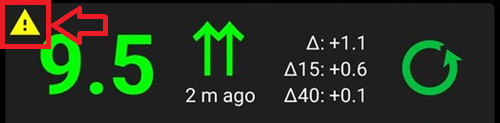
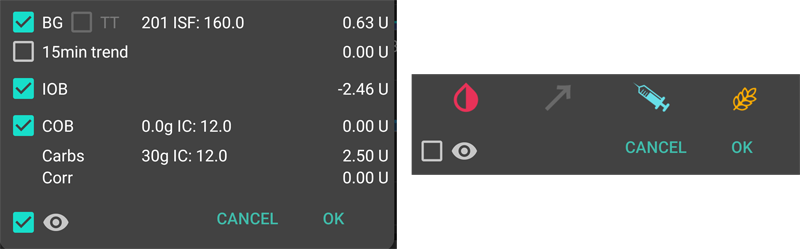

# Les écrans d'AAPS

```{contents}
:backlinks: entry
:depth: 2
```

(AapsScreens-the-homescreen)=

## The Homescreen


This is the first screen you will come across when you open **AAPS**, and it contains most of the information that you will need day to day.

### Section A - Tabs

* Navigate between the various **AAPS** modules.
* Alternatively you can change screens by swiping left or right.
* Displayed tabs can be selected in the [config builder](#Config-Builder-tab-or-hamburger-menu).

(aaps-screens-profile--target)=

### Section B - Profile & target

#### Current Profile

The current profile is displayed in the left bar.

Short press profile bar to view profile details. Long press profile bar to [switch between different profiles](../DailyLifeWithAaps/ProfileSwitch-ProfilePercentage.md).


1. Regular display with a standard profile activation.
2. Profile switch with a remaining duration of 59mn.
3. Profile switch with a specific percentage of 120%.
4. Profile switch with a specific percentage of 80% and a remaining duration of 59 mn.
5. Profile switch with a time shift of -1 hour.
6. Profile switch with a specific percentage of 120%, time shift of 1 hour, and a remaining duration of 59mn.

#### Target


Current target blood glucose level is displayed in the right bar.

Short press target bar to set a **[Temporary Target](../DailyLifeWithAaps/TempTargets.md)**.

If a temp target is set, the bar turns yellow and the remaining time in minutes is shown in brackets.

(AapsScreens-visualization-of-dynamic-target-adjustment)=

#### Visualization of Dynamic target adjustment


When using the [SMB algorithm](#Config-Builder-aps) and [Autosens](#Open-APS-features-autosens) functionality, **AAPS** can dynamically adjust your target based on sensitivity.

Enable either one or both of the following options in [Preferences > OpenAPS SMB settings](#Preferences-openaps-smb-settings):

* "sensitivity raises target" and/or 
* "resistance lowers target" 

If **AAPS** detects resistance or sensitivity, the target will change from what is set from profile. When it alters the target glucose, the background will change to green.

(AapsScreens-section-c-bg-loop-status)=

### Section C - BG & loop status

#### Current blood glucose

The latest blood glucose reading from your CGM is shown on the left side.

The color of the BG value reflects the status to the defined [range](#Preferences-range-for-visualization).

* green = in range
* red = below range
* yellow = above range 


The blocks in the middle shows:

1. how many minutes since last **CGM** reading
2. differences with the last reading: Δ, and with the last 15 and 40 minutes average (Δ15 and Δ40).  
    Long deltas are calculated as an average value of deltas in the past, indicating what was the average change.

(AapsScreens-loop-status)=

#### Loop status


On the right side, an icon shows the loop status:

1. Green circle = loop running
2. Green circle with dotted line = [low glucose suspend (LGS)](#objectives-objective6)
3. Red circle = loop disabled (not working permanently)
4. Red circle = loop suspended (temporarily paused but basal insulin will be given) - remaining time is shown below icon
5. Grey circle = pump disconnected (temporarily no insulin dosage at all) - remaining time is shown below icon
6. Orange circle = super bolus running - remaining time is shown below icon
7. Blue circle with dotted line = open loop

Short press or Long press the icon to open the Loop dialog to switch loop mode (Close, Low Glucose Suspend, Open or Disable), suspend / re-enable loop or disconnect / reconnect pump.

* If short press on Loop icon, a validation is required after selection in Loop Dialog
    
    

(aaps-screens-bg-warning-sign)=

#### BG warning sign

If for any reason, there are issues in the BG readings **AAPS** receives, you will get a warning signal beneath your BG number on the main screen.

##### Red warning sign: Duplicate BG data

The red warning sign is signaling you to get active immediately: You are receiving **duplicate BG data**, which does avoid the loop to do its work right. Therefore, your loop will be disabled until it is resolved.

    {admonition} Your loop is not running
    :class: note
    Your loop is not running until you solve this issue !


Vous devez savoir pourquoi vous avez des Gly dupliquées :

* Is Dexcom bridge enabled on your Nightscout site? Disable the bridge by going to the administration panel of your Nightscout instance, edit the "enable" variable and remove the "bridge" part there. (Pour heroku les [détails peuvent être trouvés ici](https://nightscout.github.io/troubleshoot/troublehoot/#heroku-settings).)
* Do multiple sources upload your BG to Nightscout? If you use the BYODA app, enable the upload in **AAPS** but do not enable it in xDrip+, if you use that.
* Do you have any followers that might receive your BG but do also upload it again to your Nightscout site?
* Last resort: In **AAPS**, go to [Preferences > NSClient](#Preferences-nsclient), select the sync settings and disable the "Accept CGM data from NS" option.

To remove the warning immediately and get to loop running again, you need to manually delete a couple of entries from the Dexcom/xDrip+ tab.

Cependant, quand il y a beaucoup de doublons, il peut être plus facile de

* [backup your settings](../Maintenance/ExportImportSettings.md),
* réinitialiser votre base de données dans le menu de maintenance et
* [import your settings](../Maintenance/ExportImportSettings.md) again

##### Signe d'alerte jaune

The yellow warning signal is indicating that your BG arrived in irregular time intervals or that some BGs are missing. When pressing the sign, the message indicates “Recalculated data used”.



Habituellement, vous n'avez rien à faire. La boucle fermée va continuer à fonctionner !

As a sensor change is interrupting the constant flow of BG data, a yellow warning sign after sensor change is normal and nothing to worry about.

Special note for Libre users:

* Chaque capteur FSL glisse d'une ou deux minutes toutes les quelques heures, ce qui signifie que vous n’obtenez jamais un flux parfaitement régulier de glycémie.
* Also, jumpy readings interrupt the continuous flow.
* Therefore, the yellow warning sign will be 'always on' for Libre users.

*Note*: Up to 30h hours are taken into accord for **AAPS** calculations. Donc, même après avoir résolu la cause racine, cela peut prendre environ 30 heures pour que le triangle jaune disparaisse après le dernier interval irrégulier.

#### Simple mode

An icon with a kid's face at the top right of this section indicates that you are in [Simple mode](#preferences-simple-mode).


### Section D - IA, GA, Basal et AS


1. **Syringe**: insulin on board (IOB) - amount of active insulin inside your body  
    The insulin on board figure would be zero if just your standard basal was running and there was no insulin remaining from previous boluses.
    
    * L'IA peut être négative s’il y a eu récemment des périodes de basal réduit.
    * Appuyez sur l'icône pour voir la répartition entre l'IA bolus et l'IA basale

2. **Grain**: [carbs on board (COB)](../DailyLifeWithAaps/CobCalculation.md) - yet unabsorbed carbs you have eaten before The icon pulses red if carbs are required (see [below](#aaps-screens-carbs-required))

3. **Purple line**: current basal rate. The icon changes to reflect temporary changes in basal rate (flat at 100%) 
    * Appuyez sur l'icône pour voir le débit de basal du profil et les détails de n'importe quel basal temporaire (y compris la durée restante)
4. **Arrows up & down**: indicates dynamic sensitivity features status ([Autosens](#Open-APS-features-autosens) or [DynamicISF](#Open-APS-features-DynamicISF)): enabled or disabled. Several values may be shown in this section: 
    * AS: Autosens value. Shown even if Autosens is disabled (for information only). Also shown when DynISF is activated, although it has no effect.
    * Alg: DynamicISF value (based on TDD). More information on the last line on [DynamicISF](#Open-APS-features-DynamicISF) page.

(aaps-screens-carbs-required)=

#### Glucides requis


Des suggestions de glucides sont données lorsque l'algorithme détecte que des glucides supplémentaires sont nécessaires.

This is when the oref algorithm thinks it can't rescue you by zero-temping, and you will need carbs to fix.

Les notifications de glucides sont beaucoup plus sophistiquées que celles de l'Assistant bolus. Vous pouvez voir la suggestion des glucides alors que l'Assistant bolus ne montre pas les glucides manquants.

Les notifications Glucides requis peuvent être envoyées sur Nightscout si vous le souhaitez, dans ce cas une annonce sera affichée et diffusée.

### Section E - Voyants d'état


Les voyants d'état donnent une alerte visuelle pour

* Âge de la canule
* Âge de l'insuline (jours d'utilisation du réservoir)
* Niveau du réservoir (unités)
* Age du capteur
* Âge et niveau de la pile (%)

Si le seuil d'alerte est dépassé, les valeurs seront affichées en jaune.

Si le seuil critique est dépassé, les valeurs seront affichées en rouge.

Settings can be changed in [Preferences > Overview > Status lights](#Preferences-status-lights).

Depending on the pump you use, you may not have all of these icons.

(aaps-screens-main-graph)=

### Section F - Graphique principal


The graph shows your blood glucose (BG) as read from your glucose monitor (CGM).

Les notes saisies dans l'onglet de l'action telles que les calibrations capillaires, les entrées de glucides et les changements de profil sont affichés ici.

Use the menu on top left of the graph or long press anywhere on the graph to change the timescale. You can choose between 6, 12, 18 or 24 hours.

La zone verte reflète votre fourchette cible.

Blue triangles show [SMB](#Open-APS-features-super-micro-bolus-smb) - if enabled in [Preferences > OpenAPS SMB](#Preferences-openaps-smb-settings).

(AapsScreens-activate-optional-information)=

#### Activation des informations optionnelles

On the main graph, you can switch on these optional information:

* Prédictions
* Traitements
* Basals
* Activité - courbe d'activité de l'insuline

To show this information, click the triangle on the right side of the main graph. For the main graph just the four options above the line "Graph 1 2 3 4" are available.


(aaps-screens-prediction-lines)=

#### Lignes de prédiction

* **Orange** line: [COB](CobCalculation) (color is used generally to represent COB and carbs)
    
    This prediction line shows where your BG (not where COB itself!) will go based on the current **Profile** settings, assuming that the deviations due to carb absorption remain constant. Cette ligne n'apparaît que s'il y a des GA connus.

* **Dark blue** line: IOB (color is used generally to represent IOB and insulin)
    
    This prediction line shows what would happen under the influence of insulin only. For example if you dialed in some insulin and then didn’t eat any carbs.

* Ligne **bleu clair** ligne : zéro-temp (glycémie prévisionnelle si un débit de base temporaire à 0% était défini)
    
    This prediction line shows how the BG trajectory line would change if the pump stopped all insulin delivery (0% TBR).
    
    *This line appears only when the [SMB](#Config-Builder-aps) algorithm is used.*

* **Dark yellow** line: [UAM](#SensitivityDetectionAndCob-sensitivity-oref1) (un-announced meals)
    
    Les Repas Non Signalés signifient qu'une augmentation significative de la glycémie liée aux repas, à l'adrénaline ou à d'autres facteurs est détectée. Prediction line is similar to the **orange COB line**, but it assumes that the deviations will taper down at a constant rate (by extending the current rate of reduction).
    
    *This line appears only when the [SMB](#Config-Builder-aps) algorithm is used.*

* **Ligne orange foncé** : aGA (absorption accélérée des glucides)
    
    Similaire à GA, mais en supposant un taux d'absorption de glucides statique de 10 mg/dL/5m (-0,555 mmol/l/5m). Obsolète et d'une utilité limitée.
    
    *This line appears only when the older [AMA](#Config-Builder-aps) algorithm is used.*

Généralement votre courbe de glycémie réelle finira au milieu de ces lignes, ou proche de la ligne qui représente le mieux votre situation réelle.

#### Basals

Une ligne **bleue continue** indique le débit de basal de votre pompe et reflète l'injection réelle au fil du temps.

La ligne **bleue pointillée** est ce qu'aurait dû être le débit de basal s'il n'y avait pas d'ajustements de débit de basal temporaire (DBT).

When the standard basal rate is given, the area under the curve is shown in dark blue. When the basal rate is temporarily adjusted (increased or decreased), the area under the curve is shown in light blue.

#### Activité

La ligne **jaune fine** montre l'activité de l'insuline.

Elle indique la capacité de l'insuline présente dans votre corps à faire baisser la glycémie, si aucun autre facteur (comme les glucides) n'était présent.

(AapsScreens-section-g-additional-graphs)=

### Section G - Additional graphs

Vous pouvez activer jusqu'à quatre graphiques supplémentaires en dessous du graphique principal. When in [Simple Mode](#preferences-simple-mode), additional graphs are preset and can not be changed. Switch off **Simple Mode** if you wish to set your own configuration of additional graphs.

To open settings for additional graphs click the triangle on the right side of the [main graph](#aaps-screens-main-graph) and scroll down.


To configure additional graphs, check the boxes corresponding to the data you want to see on each graph.

Most users find the following configuration of additional graphs to be adequate :

* Graph 1 with IOB, COB, Sensitivity change
* Graph 2 with Deviations and BGI.

#### Insuline absolue

Insuline Active incluant les bolus **et la basal**.

#### Insuline active

Affiche la quantité d'insuline que vous avez à chaque instant (= insuline active dans votre corps). Il inclut l'insuline des bolus et des débits de basal temporaires, (**mais exclut les débits de basal intégrés dans votre profil**).

If there were no [SMBs](#Open-APS-features-super-micro-bolus-smb), no boluses and no TBR during DIA time this would be zero.

L'IA peut être négative si vous n'avez pas de bolus restants et et que vous avez eu une zéro/faible basal temp pendant longtemps.

Decaying depends on your [DIA and insulin profile settings](../SettingUpAaps/YourAapsProfile.md).

#### Glucides actifs

Affiche la quantité de glucides que vous avez à chaque instant (= glucides actifs dans votre corps, non encore assimilés).

Decaying depends on the [deviations the algorithm detects](../DailyLifeWithAaps/CobCalculation.md).

S'il détecte une absorption plus élevée de glucides que prévu, de l'insuline sera injectée, ce qui augmentera l'IA (plus ou moins, selon vos paramètres de sécurité).

#### Sensitivity change

Shows the sensitivity that [Autosens](#Open-APS-features-autosens) has detected.

C'est le résultat d'un calcul de la sensibilité à l'insuline suite à de l'exercice, aux hormones, etc.

Note, you need to be in [Objective 8](#objectives-objective8) in order to let Sensitivity Detection/[Autosens](#Open-APS-features-autosens) automatically adjust the amount of insulin delivered. Before reaching that objective, the line in your graph is displayed for information only.

### Variable sensitivity

Shows the sensitivity as calculated by [DynamicISF](../DailyLifeWithAaps/DynamicISF.md). Only populated if you use this feature.

(screen-heart-rate-steps)=

#### Heart rate & Steps

This data may be available when using a [Wear smartwatch](../WearOS/WearOsSmartwatch.md). Enable them on **AAPS** Wear app and give permission for health data.

#### Déviations

* **Grey** bars show a deviation due to carbs. 
* **Green** bars show that BG is higher than the algorithm expected it to be. Green bars are used to increase resistance in [Autosens](#Open-APS-features-autosens).
* **Red** bars show that BG is lower than the algorithm expected. Red bars are used to increase sensitivity in [Autosens](#Open-APS-features-autosens).
* **Yellow** bars show a deviation due to UAM.
* **Black** bars show small deviations not taken into account for sensitivity

#### Blood Glucose Impact

This line shows the degree to which BG ‘should’ rise or fall based on insulin activity alone.


It is a good combination to display this line along with the Deviation bars. They share the same scale, but it is a different one than the other optional data, so it is a good idea to display them on a separate graph, as shown above. Comparing the BGI line and the Deviation bars is another way to understand how **BG** fluctuates. Here, at the time marked **1**, the Deviation bars are greater than the BGI line, indicating that BG is rising. Later, during the hours marked **2**, BGI and DEV are pretty much in line, indicating that BG is stable.

### Section H - Boutons


Buttons for Insulin and Carbs are almost always visible. If the connection to the pump is lost, the Calculator button will not be visible.

Other Buttons can be setup in [Preferences > Overview > Buttons](#Preferences-buttons).

About using the Insulin, Carbs and Calculator buttons : If enabled in the [Preferences > Overview](#Preferences-show-notes-field-in-treatments-dialogs), the **Notes** field allows you to enter text that will show on the main graph, and may be uploaded to Nightscout - depending on your settings for NS client.

(aaps-screens-buttons-insulin)=

#### Insuline


To give a certain amount of insulin without using the [bolus calculator](#aaps-screens-bolus-wizard).

By checking the box **Start eating soon TT**, you can automatically start your [eating soon temp target](#TempTargets-eating-soon-temp-target).

If you do not want to bolus through the pump but record an insulin amount (i.e. insulin given by pen) check the corresponding box. When checking this box, you get an additional field “Time offset”, that you can use to record an insulin injection made in the past.

You can use the buttons to quickly increase the insulin quantity. The increment values can be changed in the [Preferences > Overview > Buttons](#Preferences-buttons).

The insulin button can be used when the pump is suspended as well, i.e. to record insulin injected with a pen. In this case, the header will show in yellow, and the checkbox “Do not bolus, record only” can not be unchecked.


#### Glucides


Permet d'enregistrer les glucides sans faire de bolus.

Certain [pre-set temporary targets](#TempTargets-hypo-temp-target) can be set directly by checking the box.

**Time offset**: When will you / have you been eaten carbs (in minutes).

**Duration**: To be used for ["extended carbs"](ExtendedCarbs)

You can use the buttons to quickly increase the carb amount. The increment values can be changed in the [Preferences > Overview > Buttons](#Preferences-buttons).

#### Assistant

See Bolus Wizard [section below](#aaps-screens-bolus-wizard).

#### Étalonnages

Envoie un étalonnage à xDrip+ ou ouvre la boîte de dialogue de calibration du Dexcom.

Must be activated in [Preferences > Overview > Buttons](#Preferences-buttons).

#### MGC

Ouvre xDrip+.

Back button returns to **AAPS**.

Must be activated in [Preferences > Overview > Buttons](#Preferences-buttons).

#### Assistant Rapide

Entrez facilement la quantité de glucides et définissez les paramètres de calcul.

Details are set up in [Preferences > Overview > QuickWizard settings](#Preferences-quick-wizard).

(aaps-screens-bolus-wizard)=

## Assistant bolus


When you want to make a meal bolus, this is where you will normally make it from.

### Section I

Affiche le bolus calculé et permet de renseigner une note.

Si la quantité d'insuline active dépasse déjà le bolus calculé, elle affichera simplement la quantité de glucides encore nécessaire.

(AapsScreens-section-j)=

### Section J

Le champ "Gly" est normalement déjà renseigné avec la dernière lecture de votre MGC. Si vous n'avez pas de MGC en cours, il sera vide.

In the **Carbs** field, you add your estimate of the amount of carbs - or equivalent - that you want to bolus for.

The **Corr** field is if you want to modify the end dosage for some reason.

The **Carb time** field is for pre-bolusing so you can tell the system that there will be a delay before the carbs are to be expected. Vous pouvez mettre une valeur négative dans ce champ si vous faites un bolus pour des glucides déjà consommés.

**Eating reminder** : For carbs in the future, the alarm checkbox can be selected (and is by default when a time in the future is entered) so that you can be reminded at the given time, when to eat the carbs you have input into **AAPS**.


### Section K

**Profile** allows you to select a different profile than the current one, to make the calculation for the insulin required. This profile selection applies only for the current bolus, it is not a profile change.

**Super Bolus** is where the basal insulin for the next two hours is added to the immediate bolus and a zero TBR is issued for the following two hours to take back the extra insulin. The option only shows when "Enable Superbolus in wizard" is set in the [Preferences > Overview > Advanced Settings](#Preferences-advanced-settings-overview). L'idée est de fournir l'insuline plus tôt et, espérons-le, de réduire les pointes.

Pour plus de détails, voir [diabetesnet.com](https://www.diabetesnet.com/diabetes-technology/blue-skying/super-bolus/).

### Section L

Details of the wizard's bolus calculation.

You can deselect any that you do not want to include, but you normally wouldn't want to.

For safety reasons the **TT box must be ticked manually**, if you want the bolus wizard to calculate based on an existing temporary target.

#### Combinaisons de COB (Carb On Board = glucides actifs) et IOB (Insulin On Board = insuline active) et leur signification

* For safety reasons, the IOB box cannot be unticked when COB box is ticked as you might run the risk of too much insulin as **AAPS** is not accounting for what’s already given.
* If you tick COB and IOB, unabsorbed carbs that are not already covered with insulin + all insulin that has been delivered as TBR or SMB will be taken into account.
* If you tick IOB without COB, **AAPS** takes account of already delivered insulin but won’t cover that off against any carbs still to be absorbed. Cela conduit à un avis de « manque de glucides ».
* Si vous faites un bolus pour de la **nourriture supplémentaire** rapidement après un bolus de repas (par exemple pour un dessert supplémentaire) il peut être utile de **décocher toutes les cases**. De cette façon, les nouveaux glucides seront juste additionnés car le repas principal ne sera pas nécessairement absorbé et l'IA ne correspondra pas avec le GA aussi prêt d'un bolus de repas.



The box near the eye allows you to choose between the detailed view, with the numbers entering the calculation for each item, or the simple view with icons. Pressing on an icon will enable / disable this entry from the calculation.

(AapsScreens-wrong-cob-detection)=

#### Détection incorrecte des GA


If you see the warning above after using bolus wizard, **AAPS** has detected that the calculated COB value may be wrong. So, if you want to bolus again after a previous meal with COB, you should be aware of overdosing!

For details, see the hints on [COB calculation page](#CobCalculation-detection-of-wrong-cob-values).

(screens-action-tab)=

## Onglet Actions


### Actions - section M

Button **[Profile switch](../DailyLifeWithAaps/ProfileSwitch-ProfilePercentage.md)** as an alternative to pressing the [current profile](#aaps-screens-profile--target) on homescreen.

Button **[Temporary target](../DailyLifeWithAaps/TempTargets.md)** as an alternative to pressing the [current target](#aaps-screens-profile--target) on homescreen.

Le bouton pour démarrer ou annuler un débit basal temporaire. Veuillez noter que le bouton passe de "BASAL TEMPORAIRE" à "ANNULER x%" lorsqu'un débit de base temporaire est défini.

Even though [extended boluses](#extended-bolus-and-why-they-wont-work-in-closed-loop-environment) do not really work in a closed loop environment some people were asking for an option to use extended bolus anyway.

* Cette option n'est disponible que pour les pompes Dana RS et Insight. 
    * La boucle fermée sera automatiquement arrêtée et basculera en mode boucle ouverte pour la durée du bolus étendu.
    * Make sure to read the [details](../DailyLifeWithAaps/ExtendedCarbs.md) before using this option.

(aaps-screens-careportal)=

### Careportal - section N

Displays information on:

* sensor age & level (battery percentage)
* insulin age & level (units)
* cannula age
* pump battery age & level (percentage

Less information will be shown if **low resolution skin** is used ([Preferences > General > Skin](#Preferences-skin)).

(screens-sensor-level-battery)=

#### Niveau du capteur (batterie)

Works for CGM with an additional transmitter such as MiaoMiao 2. (Techniquement le capteur doit envoyer les informations de niveau de pile à xDrip+).

Thresholds can be set in [Preferences > Overview > Status lights](#Preferences-status-lights).

### Careportal - section O

BG check, prime/fill, sensor insert and pump battery change are the base for the data displayed in [section N](#aaps-screens-careportal).

Amocer/Remplir vous permet d'enregistrer le changement de site et de la cartouche d'insuline de la pompe.

La section O vous permet de renseigner les infos Careportal de Nightscout. Ainsi, Activité physique, Notification et Question sont des formes spéciales de Remarques ou Notes.

### Outils - section P

#### Historique

Allows you to ride back in **AAPS** [history](../Maintenance/Reviewing.md).

#### DTQ

Dosage Total d'Insuline = bolus + base par jour

Certains médecins utilisent - en particulier pour les nouveaux utilisateurs de pompes - une proportion basal-bolus de 50:50.

Therefore, ratio is calculated as TDD / 2 * TBB (Total base basal = sum of basal rate within 24 hours).

D'autres préfèrent une fourchette allant de 32% à 37% de DTQ pour DTB.

Comme la plupart de ces règles empiriques, leur validité réelle est limitée. Remarque : Votre diabète peut varier!

(AapsScreens-insulin-profile)=

## Profil d'Insuline


This shows the activity profile of the insulin you have chosen in [Config builder > Insulin](#Config-Builder-insulin). The curves will vary based on the [DIA](#your-aaps-profile-duration-of-insulin-action) and the time to peak.

The **purple** line shows how much insulin remains after it has been injected as it decays with time and the **blue** line shows how active it is.

See [Your AAPS Profile > Duration of insulin action](#your-aaps-profile-duration-of-insulin-action) to learn more about what it is and how to set it.

## Statut de la pompe


* Contient différentes informations sur l'état de la pompe. Les informations affichées dépendent du modèle de votre pompe.
* See [pumps page](../Getting-Started/CompatiblePumps.md) for details.

## Boucle / AMA / SMB

These tabs show details about the algorithm's calculations and why **AAPS** acts the way it does.

Calculations are run each time the system gets a fresh reading from the CGM.

For more details see [APS section on config builder page](#Config-Builder-aps).

(aaps-screens-profile)=

## Profil


Profile contains information on your individual diabetes settings, see the detailed **[Profile](../SettingUpAaps/YourAapsProfile.md)** page for more information.

## Automatisation

See the dedicated page [here](../DailyLifeWithAaps/Automations.md).

## NSClient


This page displays the status of the connection with your Nightscout site.

Settings can be changed in [Preferences > NS Client](#Preferences-nsclient).

For troubleshooting see this [page](../GettingHelp/TroubleshootingNsClient.md).

## Source Glycémie - xDrip+, BYODA...


Depending on your BG source settings, this tab is named differently.

Shows history of CGM readings and offers option to remove reading in case of failure (i.e. compression low) or duplicate readings.

(aaps-screens-treatments)=

## Traitements

This view can be accessed by pressing the 3 dots on the right of the menu, then Treatments. It is not possible to show it in the main menu through the Config Builder. In this view, you can view and alter the history of the following treatments:

* Bolus & carbs
* [Bolus étendu](#Extended-Carbs-extended-bolus-and-switch-to-open-loop-dana-and-insight-pump-only)
* Basal temporaire
* [Cible Temp](../DailyLifeWithAaps/TempTargets.md)
* [Changement de profil](../DailyLifeWithAaps/ProfileSwitch-ProfilePercentage.md)
* Careportal: notes entered through action tab and notes in dialogues
* User entry: other notes that are not sent to Nightscout

In the last column, the data source for each line is displayed in blue. It can be :

* NS for Nightscout : the data comes from or has been recorded to Nightscout
* PH for Pump History : the data has been processed by the pump

(screens-bolus-carbs)=

### Bolus & carbs


On this tab you can view the bolus and carbs log. Each bolus (line **1** and **4**) shows the remaining associated IOB next to the insulin amount. The origin of the bolus can be either :

* Meal (manually entered though the Insulin, Quick Wizard or Bolus Wizard buttons)
* SMB, when using the SMB Functionality

The carbs (line **2**) are only stored in Nightscout. If you have used the [Bolus Wizard](#aaps-screens-bolus-wizard) to calculate insulin dosage, you can press the “Calc” text (line **3**) to show the details of how the bolus was calculated.

Depending on the pump used, insulin and carbs can be shown in one single line, or will result in multiple lines: one for the calculation detail, one for the carbs, one for the bolus itself.

The treatment tab can be used to correct faulty carb entries (*i.e.* you over- or underestimated carbs). Note that it is not possible to edit an existing entry, you need to follow the following process:

1. Vérifiez et mémorisez les GA et IA actuels sur l'écran d'accueil.
2. Selon la pompe, dans l'onglet Traitement, les glucides peuvent être affichés avec l'insuline sur une seule ligne ou dans deux lignes séparées (par ex. avec Dana RS).
3. Remove the entry with the faulty carb amount. (Latest versions have trashcan icon in treatments screen. Press the trashcan icon, select the lines to remove, and then press the trashcan icon again to finalize.)
4. Assurez-vous que les glucides ont bien été enlevés en vérifiant à nouveau les GA sur l'écran d'accueil.
5. Vérifiez également l'IA s'il n'y a qu'une seule ligne dans l'onglet de Traitement contenant les glucides et l'insuline.
    
    → If carbs are not removed as intended, and you add additional carbs as explained here (6.), COB will be too high and that might lead to too high insulin delivery.

6. Entrez la bonne quantité de glucides par le bouton Glucides sur l'écran d'accueil et définissez l'heure correcte de l'événement.

7. S'il n'y a qu'une seule ligne dans l'onglet Traitement, contenant les glucides et l'insuline, vous devez remettre la quantité d'insuline qui a été injectée. Assurez-vous de régler correctement l'heure de l'événement et vérifiez bien l'IA sur l'écran d'accueil après avoir confirmé la nouvelle entrée.

### Temp Basal


The **temp basals** applied by the loop are shown here. When there is still an impact on the IOB for an entry, the information is shown in green. It can be:

* Positive IOB if the temp basal was higher than the one set in the Profile (line **2**)
* Negative IOB for a zero-temp or if the temp basal was lower than the one set in the Profile (line **1**)

Deleting the entries only affects your reports in Nightscout and will probably tamper your real IOB - it is not recommended.

On the left of a line, a red S means “Suspend” : it happens when basal is not currently delivered. This is a normal situation when in the process of changing a pod, for example.

### Cible Temp


The history of temporary targets can be seen here.

### Profile Switch


The history of profile switches can be seen here. You may see multiple entries each time you switch profile : line **1**, stored in Nightscout but not in Pump History, corresponds to the request of a profile switch made by the user. Line **2**, stored both in NS and PH, correspond to the actual switch.

Deleting the entries only affects your reports in Nightscout and will never actually change the current profile.

You can use the **Clone** button shown on line **1** to make a copy of a **Profile Switch**. See [Your AAPS Profile > Manage your profiles](#your-aaps-profile-clone-profile-switch) for more information.

### Care portal


This tab shows all notes and alerts recorded in Nightscout.

## Historique

This view can be accessed by pressing the 3 dots on the right of the menu, then History. It is not possible to put in the main menu through the Config Builder. It can also be accessed through a button at the bottom of the [Action tab](#screens-action-tab).

Allows you to ride back in **AAPS** history. See the dedicated page [Reviewing your data > History Browser](../Maintenance/Reviewing.md).

## Statistics

This view can be accessed by pressing the 3 dots on the right of the menu, then Statistics. It is not possible to put in the main menu through the Config Builder.

Gives you statistics about your Time In Range and Total Daily Dose. See the dedicated page [Reviewing your data > Statistics](#reviewing-statistics).

(aaps-screens-profile-helper)=

## Profile Helper

This view can be accessed by pressing the 3 dots on the right of the menu, then Profile Helper. It is not possible to put in the main menu through the Config Builder. The Profile Helper can help you:

* [build a profile from scratch for a kid](#your-aaps-profile-profile-from-scratch-for-a-kid)
* [compare two profiles](#your-aaps-profile-compare-profiles)