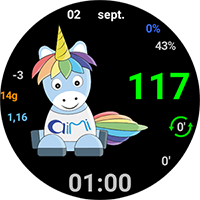
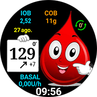
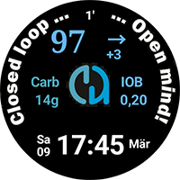
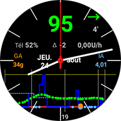

# Site d'échange pour les cadrans personnalisés

Ici, vous pouvez télécharger les fichiers Zip des cadrans personnalisés que d'autres utilisateurs ont préparés et partagés avec vous.

Les fichiers Zip que vous souhaitez partager peuvent être téléchargés dans le dossier "**[_static/ExchangeSiteCustomWatchfaces](https://github.com/openaps/AndroidAPSdocs/tree/master/docs/_static/ExchangeSiteCustomWatchfaces)**" via un "Pull Request" dans Github comme d'habitude.

Lors de la fusion du "Pull Request", l'équipe de documentation extraira le fichier image et le nom du cadran du fichier Zip, et ajoutera le lien de téléchargement à la liste ci-dessous.

|                                                                                                                                                                                                      |                                                                                                                                                                                                  |                                                                                                                                                                                                     |
| ---------------------------------------------------------------------------------------------------------------------------------------------------------------------------------------------------- | ------------------------------------------------------------------------------------------------------------------------------------------------------------------------------------------------ | --------------------------------------------------------------------------------------------------------------------------------------------------------------------------------------------------- |
| [  **AAPS V2**](../../_static/ExchangeSiteCustomWatchfaces/AAPS_V2.zip)                                       | [  **AAPS**](../../_static/ExchangeSiteCustomWatchfaces/AAPS.zip)                                               | [  **AIMICO**](../../_static/ExchangeSiteCustomWatchfaces/AIMICO-V1_1.zip)                                |
| [  **Analog G-Watch**](../../_static/ExchangeSiteCustomWatchfaces/Analog_G-Watch.zip)           | [  **Cockpit**](../../_static/ExchangeSiteCustomWatchfaces/Cockpit.zip)                                   | [  **Digital G-Watch**](../../_static/ExchangeSiteCustomWatchfaces/Digital_G-Watch.zip)      |
| [  **DigitalBigGraph**](../../_static/ExchangeSiteCustomWatchfaces/DigitalBigGraph_v1.5.zip) | [  **Gears**](../../_static/ExchangeSiteCustomWatchfaces/Gears.zip)                                           | [  **Gota**](../../_static/ExchangeSiteCustomWatchfaces/Gota_v2.4.zip)                                             |
| [  **LuckyLoopKoeln**](../../_static/ExchangeSiteCustomWatchfaces/LuckyLoopKoeln.zip)           | [  **P-Zero**](../../_static/ExchangeSiteCustomWatchfaces/pzero_v1.0.zip)                              | [  **PinkFloydTheWall**](../../_static/ExchangeSiteCustomWatchfaces/PinkFloydTheWall.zip) |
| [  **Robby watchface**](../../_static/ExchangeSiteCustomWatchfaces/Robby_watchface.zip)       | [  **SimpleDigital**](../../_static/ExchangeSiteCustomWatchfaces/SimpleDigital_v1.3.zip) | [  **SteamPunk**](../../_static/ExchangeSiteCustomWatchfaces/SteamPunk.zip)                              |
|                                                                                                                                                                                                      |                                                                                                                                                                                                  |                                                                                                                                                                                                     |
