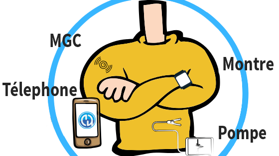

# Vue d'ensemble des composants

**AAPS** is not just a (self-built) application, it is but one of several modules of your closed loop system. Before deciding for components, it would be a good idea to have a look at the component documentation.



```{admonition} IMPORTANT SAFETY NOTICE
:class: important

The foundation of **AAPS** safety features discussed in this documentation is built on the safety features of the hardware used to build your system. For closing an automated insulin dosing loop, it is critically important that you only use an insulin pump and CGM that are tested, fully functioning and approved by the official instances of your country. Les modifications matérielles ou logicielles de ces composants peuvent entraîner un dosage incorrect de l'insuline, causant un risque significatif pour l'utilisateur. If you find or get offered broken, modified or self-made insulin pumps or CGM receivers, **do not use** these for creating an **AAPS** system.

De plus, il est également important d'utiliser uniquement des fournitures d'origine telles que serteurs, canules et réservoirs d'insuline approuvés par le fabricant pour une utilisation avec votre pompe ou votre MGC. L'utilisation de consommables non testés ou modifiés peut entraîner une imprécision du MGC et des erreurs de dosage de l'insuline. L'insuline est très dangereuse lorsqu'elle est mal dosée - veuillez ne pas jouer avec votre vie en piratant avec vos fournitures.

Last but not least, you must not take SGLT-2 inhibitors (gliflozins) as they incalculably lower blood sugar levels. La combinaison avec un système qui réduit les débits de base pour augmenter la glycémie est particulièrement dangereuse car en raison de la gliflozine, cette augmentation de glycémie pourrait ne pas se produire et un état dangereux d'absence d'insuline peut se produire. [More information here](#PreparingForAaps-no-sglt-2-inhibitors).
```

## Composants Nécessaires

### Un bon algorithme de dosage individuel pour votre diabète

Même si ce n'est pas quelque chose à créer ou à acheter, c'est le "composant" qui est probablement le plus sous-estimé, mais essentiel. Quand vous laissez un algorithme vous aider à gérer votre diabète, il doit en connaître les bons réglages pour ne pas faire de graves erreurs. Even if you are still missing other modules, you can already verify and adapt your **Profile** in collaboration with your diabetes team.

The **Profile** includes:

- BR (Basal rates): provides background insulin;
- ISF (insulin sensitivity factor): how much your blood glucose level will be reduced by 1 unit of insulin;
- CR (carb ratio): how many grams of carbohydrate are covered by one unit of insulin;
- DIA (duration of insulin action).

La plupart des "boucleurs" utilisent le rythme circadien pour les DB, la SI et le G/I, qui adaptent la sensibilité à l'insuline hormonale durant la journée.

More information about your **Profile** [on the dedicated page](../SettingUpAaps/YourAapsProfile.md).

### Téléphone

See the dedicated page [Phones](../Getting-Started/Phones.md).

### Pompe à insuline

See the dedicated page [Compatible Pumps](../Getting-Started/CompatiblePumps.md).

**Advantages and disadvantages of some pump models**

The Combo, the Insight and the older Medtronic are solid pumps, and loopable. The Combo has the advantage of many more infusion set types to choose from as it has a standard Luer-Lock. And the battery is a default one you can buy at any gas station, 24-hour convenience store and if you really need one, you can steal/borrow it from the remote control in the hotel room ;-).

Les avantages de la DanaR/RS et Dana-i vs. la Combo comme choix de pompe de choix sont :

- L'appairage initial est plus simple avec la Dana-i/RS. Mais en général, vous ne le faites qu'une seule fois, cela n'a d'impact que si vous voulez tester une nouvelle fonctionnalité avec des pompes différentes.
- Jusqu'à présent, le Combo fonctionne avec l'écran en veille. En général, cela fonctionne bien, mais c'est lent. Pour le bouclage, cela n'a pas d'importance car tout fonctionne en arrière-plan. Still there is much more time you need to be connected so more time when the BT connection might break, which isn't so easy if you walk away from your phone whilst bolusing & cooking.
- La Combo vibre à la fin des DBTs (Basal Temporaire), la DanaR vibre (ou bips) sur les SMB. At nighttime, you are likely to be using TBRs more than SMB.  The Dana-i/RS is configurable so that it does neither beep nor vibrate.
- Reading the history on the Dana-i/RS in a few seconds with carbs makes it possible to switch phones easily while offline and continue looping as soon as some CGM values are in.
- All pumps **AAPS** can talk with are waterproof on delivery. Seules les pompes Dana sont également "étanches par garantie" en raison du compartiment de batteries scellées et du système de remplissage du réservoir.

### Source GLY

See the dedicated page [Compatible CGMs](../Getting-Started/CompatiblesCgms.md).

### **AAPS**-.apk file

The main component of the system. In order to install the app, you have to build the apk-file yourself first. Instructions are [here](../SettingUpAaps/BuildingAaps.md).

### Reporting server

A reporting server displays your glucose and treatment data, and creates reports for detailed analysis. There are currently two reporting servers available for use with AAPS : [Nightscout](#SettingUpTheReportingServer-nightscout) and [Tidepool](#SettingUpTheReportingServer-tidepool). They both provide ways to visualize your diabetes data over time, provide statistics about the **time in range** (TIR) and other measures.

The Reporting server is independent of the other modules. If you don’t want to use a reporting server, you should know that it is not mandatory for running **AAPS** in the long term. But you still need to set up one as it will be required to fulfill [**Objective 1**](#objectives-objective1).

Additional information on how to set up your reporting server can be found [here](../SettingUpAaps/SettingUpTheReportingServer.md).

## Composants optionnels

### Montres connectées

You can choose any smartwatch with Android WearOS 2.x up to 4.x. **Beware, WearOS 5.x is not always compatible!**

Users are creating a [list of tested phones and watches](#Phones-list-of-tested-phones). There are different watchfaces for use with **AAPS**, which you can find [here](../WearOS/WearOsSmartwatch.md).

### xDrip+

Even if you don't need to have the xDrip+ App as **BG Source**, you can still use it for _i.e._ alarms or a different blood glucose display. You can have as many alarms as you want, specify the time when the alarm should be active, if it can override silent mode, etc. Some xDrip+ information can be found [here](../CompatibleCgms/xDrip.md). Veuillez noter que les documentations de cette application ne sont pas toujours à jour car leur progression est assez rapide.

## Que faire en attendant les composants

It sometimes takes a while to get all the modules for closing the loop. Mais pas de soucis, il y a beaucoup de choses que vous pouvez faire en attendant. It is **necessary** to check and (where appropriate) adapt basal rates (BR), insulin-carbratio (IC), insulin-sensitivity-factors (ISF) etc. And maybe open loop can be a good way to test the system and get familiar with **AAPS**. Using this mode, **AAPS** gives treatment recommendations you can manually execute.

You can keep on reading through the docs here, get in touch with other loopers online or offline, [read](../UsefulLinks/BackgroundReading.md) documentations or what other loopers write (even if you have to be careful, not everything is correct or good for you to reproduce).

**Done?** If you have your **AAPS** components all together (congrats!) or at least enough to start in open loop mode, you should first read through the [Objective description](../SettingUpAaps/CompletingTheObjectives.md) before each new Objective and setup up your hardware.
