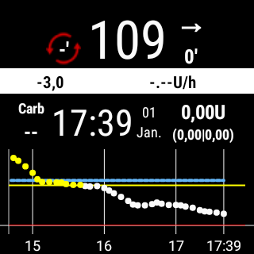

# Exemple d'installation : Samsung S7, DanaRS, Dexcom G6 et montre connectée Sony

## Description

Dans cette configuration, le smartphone Samsung Galaxy S7 est utilisé comme centre de contrôle de la boucle. L'application Dexcom légèrement modifiée lit les valeurs de glycémie du MGC Dexcom G6. AndroidAPS est utilisé pour contrôler la pompe à insuline Dana RS du fabricant coréen SOOIL via bluetooth. D'autres appareils ne sont pas requis.

Comme l'application Dexcom offre uniquement des options d'alarme limitées, l'application open source xDrip+ est utilisée pour définir non seulement des alarmes élevées et basses, mais aussi des alarmes supplémentaires selon les besoins individuels.

Une montre smartwatch Android peut être utilisée (dans cet exemple, le Sony Smartwatch 3 (SWR50)) pour afficher les valeurs de glycémie et AndroidAPS sur votre poignet (optionnel). La montre peut même être utilisée pour contrôler AndroidAPS (par ex. pour lancer discrètement un bolus de repas).

Le système fonctionne hors ligne. Cela signifie qu'il n'est pas nécessaire d'utiliser une connexion de données depuis le smartphone vers Internet.

Néanmoins, les données sont automatiquement envoyées à Nightscout "in the cloud = dans le nuage" lorsqu'une connexion est établie. En faisant cela, vous pouvez fournir des rapports complets lors de la visite de votre médecin ou partager les valeurs avec les membres de votre famille à tout moment. Il est également possible d'envoyer des données à Nightscout uniquement lorsque vous utilisez une connexion Wi-Fi (prédéfinie) afin de profiter des différents rapports Nightscout.

## Composants requis

1. Samsung Galaxy S7
    
    * Alternatives : voir [liste des téléphones et montres testés](https://docs.google.com/spreadsheets/d/1gZAsN6f0gv6tkgy9EBsYl0BQNhna0RDqA9QGycAqCQc/edit) pour AndroidAPS

2. [DanaRS](http://www.sooil.com/eng/product/)
    
    * Alternatives: 
    * [Accu-Chek Combo](../Configuration/Accu-Chek-Combo-Pump.md)
    * [Accu-Chek Insight](../Configuration/Accu-Chek-Insight-Pump.md)
    * [DanaR](../Configuration/DanaR-Insulin-Pump.md)
    * [Quelques anciennes pompes Medtronic (également nécessaire : RileyLink/Gnarl hardware, téléphone Android avec bluetooth low energy / BLE-chipset)](../Configuration/MedtronicPump.md)
    * D'autres pompes pourraient être disponibles à l'avenir, voir [futures pompes possibles](Future-possible-Pump-Drivers.md) pour plus de détails.

3. [Dexcom G6](https://dexcom.com)
    
    * Alternatives: see list of possible [BG sources](../Configuration/BG-Source.md)

4. Optionnel : Sony Smartwatch 3 (SWR50)
    
    * Alternatives : Toutes les [montres avec Google Wear OS](https://wearos.google.com/intl/de_de/#find-your-watch) devraient fonctionner correctement, pour plus de détails, voir la [liste des téléphones et montres testés](https://docs.google.com/spreadsheets/d/1gZAsN6f0gv6tkgy9EBsYl0BQNhna0RDqA9QGycAqCQc/edit) pour AndroidAPS (l'OS doit être Android Wear ou Wear OS)

## Configuration de Nightscout

Voir la configuration détaillée [Nightscout](../Installing-AndroidAPS/Nightscout.md)

## Configuration de l'ordinateur

Pour pouvoir créer une application Android à partir du code source AAPS disponible gratuitement, vous devez disposer d'Android Studio sur votre ordinateur (Windows, Mac, Linux). Les instructions détaillées peuvent être trouvées sur : [construction de l'APK](../Installing-AndroidAPS/Building-APK.md).

Soyez patient lors de l'installation d'Android Studio car le logiciel télécharge beaucoup de données supplémentaires une fois installé sur votre ordinateur.

## Configuration du Smartphone

### Vérifier le firmware (logiciel interne) du smartphone

* Menu > Paramètres > A propose du téléphone > Informations sur le logiciel : au moins "Android-Version 8.0" (testé avec succès jusqu'à Android version 8.0.0 Oreo - Samsung Experience Version 9.0) 
* Pour la mise à jour du firmware : menu > paramètres > mise à jour du logiciel

### Autoriser l'installation d'applications issues de sources inconnues

Menu > Paramètres > Sécurité de l'appareil > Sources inconnues > curseur vers la droite (= actif)

Pour des raisons de sécurité, ce paramètre devrait être réglé à nouveau sur inactif une fois l'installation de toutes les applications décrites ici terminée.

### Activez le Bluetooth

1. Menu > Paramètres > Connections > Bluetooth > curseur vers le côté droit (= actif)
2. Menu > Paramètres > Connections > Emplacement > curseur vers le côté droit (= actif)

Les services de géolocalisation ("GPS") doivent être activés pour que Bluetooth fonctionne correctement.

### Installer l'application Dexcom (version modifiée)

L'application Dexcom originale du Google Play Store ne fonctionnera pas parce qu'elle ne diffuse pas de valeurs vers d'autres applications. Par conséquent, une version légèrement modifiée par la communauté est nécessaire. Seule cette application Dexcom modifiée peut communiquer avec AAPS. De plus, l'application Dexcom modifiée peut être utilisée avec tous les smartphones Android et non pas seulement ceux de [la liste de compatibilité Dexcom](https://www.dexcom.com/dexcom-international-compatibility).

Pour ce faire, effectuez les étapes suivantes sur votre smartphone :

1. Si l'application Dexcom originale est déjà installée : 
    * Arrêter le capteur
    * Désinstallez l'application via Menu > Paramètres > Apps > Dexcom G6 Mobile > Désinstaller
2. Download and install the [BYODA Dexcom ap](../Hardware/DexcomG6.md#if-using-g6-with-build-your-own-dexcom-app)
3. Démarrez l'application Dexcom G6 patchée, activez/calibrez le capteur selon les instructions données et attendez la fin de la phase de démarrage.
4. Une fois que l'application Dexcom patchée affiche la valeur actuelle de la glycémie, configurez les alertes (menu hamburger sur le côté gauche de l'écran) comme suit : 
    * Urgent glycémie basse `55mg/dl` / `3.1mmol/l` (impossible à désactiver)
    * Glycémie basse `OFF`
    * Glyécmie haute `OFF`
    * Taux d'augmentation `OFF`
    * Taux de baisse `OFF`
    * Perte de signal `OFF`

## Installer AndroidAPS

1. Follow the instructions to [build the APK](../Installing-AndroidAPS/Building-APK.md#generate-signed-apk)
2. [Transfer](../Installing-AndroidAPS/Building-APK.md#transfer-apk-to-smartphone) the generated APK to your phone
3. [Configurez AndroidAPS](../Configuration/Config-Builder.md) selon vos besoins en utilisant l'assistant de configuration ou manuellement
4. Dans cet exemple de configuration, nous avons utilisé (entre autres)

* BG source: `Dexcom G6 App (patched)` -- click cock-wheel and activate `Upload BG data to NS` and `Send BG data to xDrip+` (see [BG source](../Configuration/BG-Source.md))

* NSClient activé (voir [Nightscout](../Installing-AndroidAPS/Nightscout.md))

## Installer xDrip+

xDrip+ est une autre application open source très aboutie qui offre d'innombrables possibilités. Dans cette configuration, contrairement à l'utilisation première prévue par les développeurs, xDrip+ n'est pas utilisée pour collecter des données de glycémie à partir du Dexcom G6, mais seulement pour utiliser des alarmes et afficher la valeur de glycémie actuelle, y compris la courbe sur l'écran d'accueil Android dans le widget. Avec xDrip+ les alarmes peuvent être réglées beaucoup plus individuellement qu'avec le logiciel Dexcom, AAPS ou Nightscout (sans limitation dans la sélection des sons, différentes alarmes selon le jour/nuit etc.).

1. Téléchargez la dernière version stable de xDrip+ avec votre smartphone <https://xdrip-plus-updates.appspot.com/stable/xdrip-plus-latest.apk> - pas la version de Google Play Store!
2. Installez xDrip+ en sélectionnant le fichier APK téléchargé.
3. Démarrez xDrip+ et indiquez les paramètres suivants (menu hamburger en haut à gauche) 
    * Paramètres > Alarmes et alertes > Liste d'alerte de niveau Glucose > Créer des alertes (hautes et basses) selon vos besoins.
    * Les alarmes existantes peuvent être modifiées avec une longue pression sur l'alarme.
    * Paramètres > Alarmes et alertes > Alertes de calibrage : désactivées (rappelées via l'application Dexcom modifiée)
    * Paramètres > Source de données matérielles > 640G/EverSense
    * Paramètres > Paramètres Inter-app > Accepter les calibrations > `ON`
    * Menu > Démarrer le capteur (n'est rien qu'un "pro forma" et n'a rien à voir avec le capteur G6 en cours. Ceci est nécessaire sinon un message d'erreur apparaîtra régulièrement.) 

For more information about xDrip+, see here [BG source page](../Configuration/BG-Source.md).

### Exemple d'une installation d'alarme

La "Urgent alarme glycémie basse" (en dessous de 55 mg/dl càd. 3,1 mmol) est une alarme standard de l'application Dexcom modifiée qui ne peut pas être désactivée.

Astuce pour les réunions / visites d'église / cinéma etc..:

Si le mode "Ne pas déranger" est activé dans le Samsung Galaxy S7 (Menu > Paramètres > Sons et vibrations > Ne pas déranger : curseur vers le côté droit (= actif)), lors d'une alarme basse, le téléphone ne fait que vibrer et ne délivre pas d'avertissement sonore. Pour les autres alarmes configurées via xDrip+ vous pouvez choisir si le mode silencieux doit être ignoré (son joué) ou non.

## Désactiver l'option économie d'énergie

Sur votre Samsung Galaxy S7 allez dans Menu > Paramètres > Maintenance de l'appareil > Batterie > Applications non surveillées > + Ajouter des applications : Sélectionnez les applications AndroidAPS, Dexcom G6 Mobile, xDrip+ et Android Wear (si la montre connectée est utilisée) l'une après l'autre

## Optionnel : Configurer la Sony Smartwatch 3 (SWR50)

Avec une montre Android Wear, vivre avec son diabète peut être encore plus discrèt. La montre peut être utilisée pour afficher le niveau de glycémie actuel, l'état de la boucle, etc. sur le poignet. La montre peut même être utilisée pour contrôler AndroidAPS (par ex. pour lancer discrètement un bolus de repas). Pour ce faire, appuyez deux fois sur la valeur MGC du cadran d'AAPSv2. Le SWR50 fonctionne généralement pour une journée complète jusqu'à ce que la batterie ait besoin d'être rechargée (même chargeur que le Samsung Galaxy S7 : microUSB).

Pour plus d'informations sur les informations affichées sur le cadran, voir [ici](../Configuration/Watchfaces.md).

* Installez l'application "Android Wear" sur votre smartphone via le Google Play Store et connectez la smartwatch selon les instructions qui y sont données.
* Dans AAPS, choisissez le menu hamburger (coin supérieur gauche) > Générateur de configuration > Général (en bas de la liste) > Wear > Activez sur le côté gauche, cliquez sur la roue crantée > Paramètres de Wear et activez `Commandes depuis la montre`
* Sur votre montre: faites un appui long sur l'afficheur pour changer de cadran et sélectionnez `AAPSv2`
* Si nécessaire redémarrer les deux appareils une fois.

## Configuration de la pompe

voir [pompe Dana RS](../Configuration/DanaRS-Insulin-Pump.md)