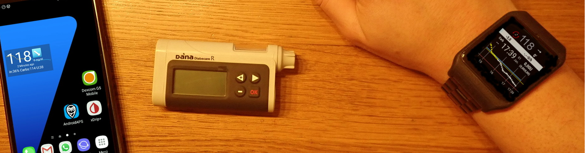
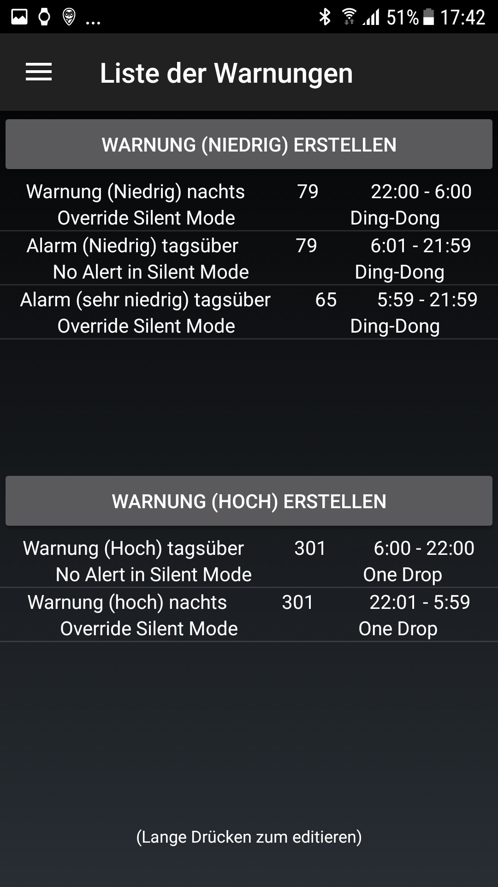

# Exemple d'installation : Samsung S7, DanaRS, Dexcom G6 et montre connectée Sony

## Description

Dans cette configuration, le smartphone Samsung Galaxy S7 est utilisé comme centre de contrôle de la boucle. L'application Dexcom légèrement modifiée lit les valeurs de glycémie du MGC Dexcom G6. AndroidAPS est utilisé pour contrôler la pompe à insuline Dana RS du fabricant coréen SOOIL via bluetooth. D'autres appareils ne sont pas requis.

Comme l'application Dexcom offre uniquement des options d'alarme limitées, l'application open source xDrip+ est utilisée pour définir non seulement des alarmes élevées et basses, mais aussi des alarmes supplémentaires selon les besoins individuels.

Une montre smartwatch Android peut être utilisée (dans cet exemple, le Sony Smartwatch 3 (SWR50)) pour afficher les valeurs de glycémie et AndroidAPS sur votre poignet (optionnel). La montre peut même être utilisée pour contrôler AndroidAPS (par ex. pour lancer discrètement un bolus de repas).

Le système fonctionne hors ligne. Cela signifie qu'il n'est pas nécessaire d'utiliser une connexion de données depuis le smartphone vers Internet.

Néanmoins, les données sont automatiquement envoyées à Nightscout "in the cloud = dans le nuage" lorsqu'une connexion est établie. En faisant cela, vous pouvez fournir des rapports complets lors de la visite de votre médecin ou partager les valeurs avec les membres de votre famille à tout moment. Il est également possible d'envoyer des données à Nightscout uniquement lorsque vous utilisez une connexion Wi-Fi (prédéfinie) afin de profiter des différents rapports Nightscout.

## Composants requis

1. Samsung Galaxy S7
    
    * Alternatives : voir [liste des téléphones et montres testés](https://docs.google.com/spreadsheets/d/1gZAsN6f0gv6tkgy9EBsYl0BQNhna0RDqA9QGycAqCQc/edit) pour AndroidAPS

2. [DanaRS](http://www.sooil.com/eng/product/)
    
    * Alternatives: 
    * [Accu-Chek Combo](../Configuration/Accu-Chek-Combo-Pump.md)
    * [Accu-Chek Insight](../Configuration/Accu-Chek-Insight-Pump.md)
    * [DanaR](../Configuration/DanaR-Insulin-Pump.md)
    * [Quelques anciennes pompes Medtronic (également nécessaire : RileyLink/Gnarl hardware, téléphone Android avec bluetooth low energy / BLE-chipset)](../Configuration/MedtronicPump.md)
    * D'autres pompes pourraient être disponibles à l'avenir, voir [futures pompes possibles](Future-possible-Pump-Drivers.md) pour plus de détails.

3. [Dexcom G6](https://dexcom.com)
    
    * Alternatives : voir la liste des sources [contrôles glycémique possibles](../Configuration/BG-Source.rst)

4. Optionnel : Sony Smartwatch 3 (SWR50)
    
    * Alternatives : Toutes les [montres avec Google Wear OS](https://wearos.google.com/intl/de_de/#find-your-watch) devraient fonctionner correctement, pour plus de détails, voir la [liste des téléphones et montres testés](https://docs.google.com/spreadsheets/d/1gZAsN6f0gv6tkgy9EBsYl0BQNhna0RDqA9QGycAqCQc/edit) pour AndroidAPS (l'OS doit être Android Wear ou Wear OS)

## Configuration de Nightscout

Voir la configuration détaillée [Nightscout](../Installing-AndroidAPS/Nightscout.md)

## Configuration de l'ordinateur

Pour pouvoir créer une application Android à partir du code source AAPS disponible gratuitement, vous devez disposer d'Android Studio sur votre ordinateur (Windows, Mac, Linux). Les instructions détaillées peuvent être trouvées sur : [construction de l'APK](../Installing-AndroidAPS/Building-APK.md).

Soyez patient lors de l'installation d'Android Studio car le logiciel télécharge beaucoup de données supplémentaires une fois installé sur votre ordinateur.

## Configuration du Smartphone

### Vérifier le firmware (logiciel interne) du smartphone

* Menu > Paramètres > A propose du téléphone > Informations sur le logiciel : au moins "Android-Version 8.0" (testé avec succès jusqu'à Android version 8.0.0 Oreo - Samsung Experience Version 9.0) 
* Pour la mise à jour du firmware : menu > paramètres > mise à jour du logiciel

### Autoriser l'installation d'applications issues de sources inconnues

Menu > Paramètres > Sécurité de l'appareil > Sources inconnues > curseur vers la droite (= actif)

Pour des raisons de sécurité, ce paramètre devrait être réglé à nouveau sur inactif une fois l'installation de toutes les applications décrites ici terminée.

### Activez le Bluetooth

1. Menu > Paramètres > Connections > Bluetooth > curseur vers le côté droit (= actif)
2. Menu > Paramètres > Connections > Emplacement > curseur vers le côté droit (= actif)

Les services de géolocalisation ("GPS") doivent être activés pour que Bluetooth fonctionne correctement.

### Installer l'application Dexcom (version modifiée)

L'application Dexcom originale du Google Play Store ne fonctionnera pas parce qu'elle ne diffuse pas de valeurs vers d'autres applications. Par conséquent, une version légèrement modifiée par la communauté est nécessaire. Seule cette application Dexcom modifiée peut communiquer avec AAPS. De plus, l'application Dexcom modifiée peut être utilisée avec tous les smartphones Android et non pas seulement ceux de [la liste de compatibilité Dexcom](https://www.dexcom.com/dexcom-international-compatibility).

To do this perform the following steps on your smartphone:

1. Si l'application Dexcom originale est déjà installée : 
    * Arrêter le capteur
    * Désinstallez l'application via Menu > Paramètres > Apps > Dexcom G6 Mobile > Désinstaller
2. Download and install the [BYODA Dexcom ap](../Hardware/DexcomG6#if-using-g6-with-build-your-own-dexcom-app)
3. Start modified Dexcom G6 app, activate/calibrate the sensor according to the given instructions and wait until the warm-up phase is finished.
4. Once the modified Dexcom app shows actual glucose value, setup the warnings (hamburger menu on top left side of the screen) as follows: 
    * Urgent low `55mg/dl` / `3.1mmol/l` (cannot be disabled)
    * Low `OFF`
    * High `OFF`
    * Rise rate `OFF`
    * Fall rate `OFF`
    * Signal loss `OFF`

## Installer AndroidAPS

1. Suivez les instructions de [construire l'APK](../Installing-AndroidAPS/Building-APK#generer-un-apk-signe)
2. [Transférez](../Installing-AndroidAPS/Building-APK#transferer-le-fichier-apk-sur-le-smartphone) l'APK généré sur votre téléphone
3. [Configurez AndroidAPS](../Configuration/Config-Builder.md) selon vos besoins en utilisant l'assistant de configuration ou manuellement
4. Dans cet exemple de configuration, nous avons utilisé (entre autres)

* BG source: `Dexcom G6 App (patched)` -- click cock-wheel and activate `Upload BG data to NS` and `Send BG data to xDrip+` (see [BG source](../Configuration/BG-Source.rst))

* NS Client activated (see [Nightscout setup](../Installing-AndroidAPS/Nightscout.md))

## Installer xDrip+

xDrip+ is another mature open source app that offers countless possibilities. In this setup, contrary to what the developers first wrote the app for, xDrip+ is not used to collect glucose data from the Dexcom G6, but only to output alarms and to display the current glucose value including the curve on the Android home screen in the widget. With xDrip+ the alarms can be set much more individually than with the Dexcom software, AAPS or Nightscout (no limitation in the selection of sounds, different alarms depending on day/night time etc.).

1. Téléchargez la dernière version stable de xDrip+ avec votre smartphone <https://xdrip-plus-updates.appspot.com/stable/xdrip-plus-latest.apk> - pas la version de Google Play Store!
2. Installez xDrip+ en sélectionnant le fichier APK téléchargé.
3. Démarrez xDrip+ et indiquez les paramètres suivants (menu hamburger en haut à gauche) 
    * Paramètres > Alarmes et alertes > Liste d'alerte de niveau Glucose > Créer des alertes (hautes et basses) selon vos besoins.
    * Les alarmes existantes peuvent être modifiées avec une longue pression sur l'alarme.
    * Paramètres > Alarmes et alertes > Alertes de calibrage : désactivées (rappelées via l'application Dexcom modifiée)
    * Paramètres > Source de données matérielles > 640G/EverSense
    * Paramètres > Paramètres Inter-app > Accepter les calibrations > `ON`
    * Menu > Démarrer le capteur (n'est rien qu'un "pro forma" et n'a rien à voir avec le capteur G6 en cours. Ceci est nécessaire sinon un message d'erreur apparaîtra régulièrement.) 

For more information about xDrip+, see here [BG source page](../Configuration/BG-Source.rst).

### Exemple d'une installation d'alarme

The "Urgent low alarm" (below 55 mg/dl resp. 3,1 mmol) is a standard alarm from the modified Dexcom app that cannot be disabled.

Tip for meetings / church visits / cinema etc..:

If "Do not disturb" mode is activated in the Samsung Galaxy S7 (Menu > Settings > Sounds and vibration > Do not disturb: slider to right side (= active)), the phone only vibrates during urgent low alarm and does not issue an acoustic warning. For the other alarms set up via xDrip+ you can select whether the silent mode should be ignored (acoustic sound played) or not.

## Désactiver l'option économie d'énergie

On your Samsung Galaxy S7 go to Menu > Settings > Device Maintenance > Battery > Unmonitored Apps > + Add apps: Select the apps AndroidAPS, Dexcom G6 Mobile, xDrip+ and Android Wear (if smartwatch is used) one after the other

## Optionnel : Configurer la Sony Smartwatch 3 (SWR50)

With an Android Wear smartwatch life with diabetes can be made even more inconspicuous. The watch can be used to display the current glucose level, the status of the loop etc. on the wrist. La montre peut même être utilisée pour contrôler AndroidAPS (par ex. pour lancer discrètement un bolus de repas). To do this, double tap the CGM value of the AAPSv2 watchface. The SWR50 usually runs for a full day until the battery needs to be recharged (same charger as the Samsung Galaxy S7: microUSB).

Details about the information displayed on the watchface can be found [here](../Configuration/Watchfaces.md).

* Installez l'application "Android Wear" sur votre smartphone via le Google Play Store et connectez la smartwatch selon les instructions qui y sont données.
* Dans AAPS, choisissez le menu hamburger (coin supérieur gauche) > Générateur de configuration > Général (en bas de la liste) > Wear > Activez sur le côté gauche, cliquez sur la roue crantée > Paramètres de Wear et activez `Commandes depuis la montre`
* Sur votre montre: faites un appui long sur l'afficheur pour changer de cadran et sélectionnez `AAPSv2`
* Si nécessaire redémarrer les deux appareils une fois.

## Configuration de la pompe

see [Dana RS pump](../Configuration/DanaRS-Insulin-Pump.md)