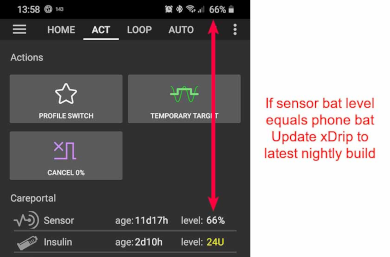

# Ecrans AndroidAPS

## Écran d'accueil

Ceci est le premier écran que vous verrez quand vous ouvrirez AndroidAPS et il contient la plupart des informations dont vous aurez besoin au jour le jour.

### Section A - Onglets

* Permet de naviguer entre les différents modules AndroidAPS.
* Vous pouvez également changer d'écrans en glissant vers la gauche ou la droite.
* Displayed tabs can be selected in [config builder](Config-Builder-tab-or-hamburger-menu).

(Screenshots-section-b-profile-target)=

### Section B - Profil & cible

#### Profil actuel

* Le profil actuel est affiché dans la barre de gauche.
* Un appui court sur le profil permet de voir les détails du profil
* Long press profile bar to [switch between different profiles](Profiles-profile-switch).
* Si le changement de profil a été effectué avec une durée, le temps restant en minutes est indiqué entre parenthèses.

#### Cible

* La cible de glycémie actuelle est affichée dans la barre de droite.
* Un appui court sur la barre de cible permet de définir une [cible temporaire](../Usage/temptarget.md).
* Si une cible temporaire est définie, la barre devient jaune et le temps restant en minutes est affiché entre parenthèses.

(Screenshots-visualization-of-dynamic-target-adjustment)=

#### Visualisation de l'ajustement dynamique de la cible

* AAPS peut ajuster dynamiquement votre cible en fonction de la sensibilité si vous utilisez l'algorithme SMB.
* Enable either one or both of the [following options](Preferences-openaps-smb-settings) 
   * "Sensibilité augmente la cible" et/ou 
   * "Résistance diminue la cible" 
* Si AAPS détecte une résistance ou une sensibilité, la cible change en fonction de ce qui est défini dans le profil. 
* Lorsqu'il modifie la cible glycémique, l'arrière-plan passe en vert.

### Section C - Gly & état de la boucle

#### Glycémie actuelle

* La dernière glycémie reçue de votre MGC est affichée sur le côté gauche.
* Color of the BG value reflects the status to the defined [range](Preferences-range-for-visualization). 
   * vert = dans la fourchette
   * rouge = en dessous de la fourchette
   * jaune = au-dessus de la fourchette
* Le bloc gris du milieu affiche les minutes depuis la dernière lecture et les variations depuis la dernière lecture ainsi que depuis les 15 et 40 dernières minutes.

(Screenshots-loop-status)=

#### État de la boucle

* Une nouvelle icône affiche l'état de la boucle:
   
   * cercle vert = boucle fermée en cours d'exécution
   * green circle with dotted line = [low glucose suspend (LGS)](Objectives-objective-6-starting-to-close-the-loop-with-low-glucose-suspend)
   * cercle rouge = boucle désactivée (ne fonctionne pas de façon permanente)
   * cercle jaune = boucle suspendue (temporairement en pause, mais l'insuline basale sera délivrée) - le temps restant est affiché sous l'icône
   * cercle gris = pompe déconnectée (temporairement aucune insuline n'est délivrée) - le temps restant est affiché sous l'icône
   * cercle orange = super bolus en cours - le temps restant est affiché sous l'icône
   * cercle bleu avec pointillés = boucle ouverte

* Un appui court ou long sur l'icône de la boucle permet d'ouvrir une boite de dialogue pour changer la boucle (Fermée, Mode Arrêt Glycémie Basse, Ouverte), suspendre/réactiver la boucle ou déconnecter/reconnecter la pompe.
   
   * En cas d'appui court sur l'icône de la boucle, une validation est nécessaire après la sélection dans la boite de dialogue
   
   

(Screenshots-bg-warning-sign)=

#### Avertissement Glycémie

À partir d'Android 3.0, vous pouvez avoir un signal d'avertissement à côté de votre glycémie sur l'écran principal.

*Remarque* : Jusqu'à 30 heures sont prises en compte pour les calculs AAPS. Donc, même après avoir résolu la cause racine, cela peut prendre environ 30 heures pour que le triangle jaune disparaisse après le dernier interval irrégulier.

Pour le supprimer immédiatement, vous devez supprimer manuellement quelques entrées dans l'onglet Dexcom/xDrip+.

However, when there are a lot of duplicates, it might be easier to

* [backup your settings](../Usage/ExportImportSettings.md),
* réinitialiser votre base de données dans le menu de maintenance et
* [import your settings](../Usage/ExportImportSettings.md) again

##### Signe d'alerte rouge : données Gly dupliquées

The red warning sign is signaling you to get active immediately: You are receiving duplicate BG data, which does avoid the loop to do its work right. Therefore your loop will be disabled until it is resolved.

You need to find out why you get duplicate BGs:

* Est-ce que le passerelle Dexcom Bridge est activé dans votre site NS ? Désactivez le pont de connexion en allant sur heroku (ou tout autre fournisseur d'hébergement), éditez la variable "activer" et retirez la partie "bridge" à cet endroit. (Pour heroku les [détails peuvent être trouvés ici](https://nightscout.github.io/troubleshoot/troublehoot/#heroku-settings).)
* Est-ce que plusieurs sources téléchargent votre Gly vers NS ? Si vous utilisez l'application BYODA, activez le téléchargement dans AAPS mais ne l'activez pas dans xDrip+, si vous l'utilisez.
* Avez-vous des abonnés qui pourraient recevoir votre glycémie mais qui la téléchargeraient également sur votre site NS ?
* Dernier recours : Dans AAPS, allez dans les paramètres NSClient, sélectionnez les paramètres de synchronisation et désactivez l'option "Accepter les données MGC de NS".

##### Signe d'alerte jaune

* Le signal d'alerte jaune indique que votre Gly est arrivée dans des intervalles de temps irréguliers ou qu'il manque des Gly.
   
   

* Habituellement, vous n'avez rien à faire. La boucle fermée va continuer à fonctionner !

* Comme un changement de capteur interrompt le flux constant de données Gly, un signe d'avertissement jaune après le changement de capteur est normal et il n'y a rien à craindre.
* Note spéciale pour les utilisateurs du freestyle libre :
   
   * Chaque capteur FSL glisse d'une ou deux minutes toutes les quelques heures, ce qui signifie que vous n’obtenez jamais un flux parfaitement régulier de glycémie.
   * En outre, des sauts de lectures interrompent le flux continu.
   * Par conséquent, le signe d'avertissement jaune sera 'toujours activé' pour les utilisateurs du FSL.

### Section D - IA, GA, Basal et AS

* Seringue : insuline active (IA) - quantité d'insuline active à l'intérieur de votre corps
   
   * Le chiffre de l’insuline active serait à 0 s’il n’y avait que votre basal standard en cours et qu’il ne restait plus d’insuline active d’un précédent bolus. 
   * L'IA peut être négative s’il y a eu récemment des périodes de basal réduit.
   * Appuyez sur l'icône pour voir la répartition entre l'IA bolus et l'IA basale

* Grain: [carbs on board (COB)](../Usage/COB-calculation.md) - yet unabsorbed carbs you have eaten before -> icon pulses if carbs are required

* Ligne violette : débits de basal - les changements d'icône reflétant les changements des débits de base temporaires (plat à 100%) 
   * Appuyez sur l'icône pour voir le débit de basal du profil et les détails de n'importe quel basal temporaire (y compris la durée restante)
* Arrows up & down: indicating actual [autosens](Open-APS-features-autosens) status (enabled or disabled) and value is shown below icon

#### Glucides requis

* Des suggestions de glucides sont données lorsque l'algorithme détecte que des glucides supplémentaires sont nécessaires.
* C'est quand l'algorithme oref pense que je ne peux pas vous sauver par un 0 (zéro) temp et que vous aurez besoin de manger des glucides pour corriger.
* Les notifications de glucides sont beaucoup plus sophistiquées que celles de l'Assistant bolus. Vous pouvez voir la suggestion des glucides alors que l'Assistant bolus ne montre pas les glucides manquants.
* Les notifications Glucides requis peuvent être envoyées sur Nightscout si vous le souhaitez, dans ce cas une annonce sera affichée et diffusée.

### Section E - Voyants d'état

* Les voyants d'état donnent une alerte visuelle pour 
   * Âge de la canule
   * Âge de l'insuline (jours d'utilisation du réservoir)
   * Niveau du réservoir (unités)
   * Age du capteur
   * Âge et niveau de la pile (%)
* Si le seuil d'alerte est dépassé, les valeurs seront affichées en jaune.
* Si le seuil critique est dépassé, les valeurs seront affichées en rouge.
* Settings can be made in [preferences](Preferences-status-lights).

(Screenshots-section-f-main-graph)=

### Section F - Graphique principal

* Le graphique montre votre glycémie (Gly) telle qu'elle est lue par votre capteur de glycémie (MGC). 
* Les notes saisies dans l'onglet de l'action telles que les calibrations capillaires, les entrées de glucides et les changements de profil sont affichés ici. 
* Un appui long sur le graphique permet de changer l'échelle de temps. Vous pouvez choisir 6, 12, 18 ou 24 heures.
* La zone verte reflète votre fourchette cible. It can be configured in [preferences](Preferences-range-for-visualization).
* Blue triangles show [SMB](Open-APS-features-super-micro-bolus-smb) - if enabled in [preferences](Preferences-openaps-smb-settings).
* Information optionnelle :
   
   * Prédictions
   * Basals
   * Activité - courbe d'activité de l'insuline

#### Activation des informations optionnelles

* Cliquez sur le triangle situé sur le côté droit du graphique principal pour sélectionner les informations qui seront affichées dans le graphique principal.
* Pour le graphique principal, juste les trois options au-dessus de la ligne "\---\---- Graph 1 \---\----" sont disponibles.
   
   

(Screenshots-prediction-lines)=

#### Lignes de prédiction

* **Orange** line: [COB](../Usage/COB-calculation.md) (colour is used generally to represent COB and carbs)
   
   Cette ligne de prédiction montre comment votre Glycémie (et pas les GA eux mêmes) devrait évoluer sur la base de vos réglages actuels de la pompe, en supposant que les déviations liées à l'absorption des glucides restent constantes. Cette ligne n'apparaît que s'il y a des GA connus.

* Ligne **bleu foncé** : Insuline Active (IA) (la couleur est généralement utilisée pour représenter l'insuline)
   
   Cette ligne de prédiciton montre ce qui pourrait arriver uniquement avec l'action de l'Insuline. Par exemple si vous avez injecté de l'insuline mais que vous n'avez pas mangé de glucides.

* Ligne **bleu clair** ligne : zéro-temp (glycémie prévisionnelle si un débit de base temporaire à 0% était défini)
   
   Cette ligne de prédiction montre comment la trajectoire de l'IA changerai si la pompe arrêtait toute injection d'insuline (DBT 0%).
   
   *This line appears only when the [SMB](Preferences-advanced-meal-assist-ama-or-super-micro-bolus-smb) algorithm is used.*

* **Dark yellow** line: [UAM](Sensitivity-detection-and-COB-sensitivity-oref1) (un-announced meals)
   
   Les Repas Non Signalés signifient qu'une augmentation significative de la glycémie liée aux repas, à l'adrénaline ou à d'autres facteurs est détectée. Cette ligne de prédiction est similaire à la ligne ORANGE GA, mais elle suppose que les déviations diminueront de façon constante (en étendant le taux de réduction actuel).
   
   *This line appears only when the [SMB](Preferences-advanced-meal-assist-ama-or-super-micro-bolus-smb) algorithm is used.*

* **Dark orange** line: aCOB (accelerated carbohydrate absorption)
   
   Similar to COB, but assuming a static 10 mg/dL/5m (-0.555 mmol/l/5m) carb absorption rate. Deprecated and of limited usefulness.
   
   *This line appears only when the older [AMA](Preferences-advanced-meal-assist-ama-or-super-micro-bolus-smb) algorithm is used.*

Usually your real glucose curve ends up in the middle of these lines, or close to the one which makes assumptions that closest resemble your situation.

#### Basals

* Une ligne **bleue continue** indique le débit de basal de votre pompe et reflète l'injection réelle au fil du temps.
* La ligne **bleue pointillée** est ce qu'aurait dû être le débit de basal s'il n'y avait pas d'ajustements de débit de basal temporaire (DBT).
* Quand le débit de basal standard est donné, la zone sous la courbe est affichée en bleu foncé.
* Quand le débit de basal est temporairement ajusté (augmenté ou diminué), la zone sous la courbe est affichée en bleu clair.

#### Activité

* La ligne **jaune fine** montre l'activité de l'insuline. 
* Elle indique la capacité de l'insuline présente dans votre corps à faire baisser la glycémie, si aucun autre facteur (comme les glucides) n'était présent.

### Section G - Graphiques additionnels

* Vous pouvez activer jusqu'à quatre graphiques supplémentaires en dessous du graphique principal.
* To open settings for additional graphs click the triangle on the right side of the [main graph](Screenshots-section-f-main-graph) and scroll down.

* Pour ajouter un graphique supplémentaire, cochez la case sur le côté gauche de son nom (par ex. \---\---- Graph 1 \---\----).

#### Insuline absolue

* Insuline Active incluant les bolus **et la basal**.

#### Insuline active

* Affiche la quantité d'insuline que vous avez à chaque instant (= insuline active dans votre corps). Il inclut l'insuline des bolus et des débits de basal temporaires, (**mais exclut les débits de basal intégrés dans votre profil**).
* If there were no [SMBs](Open-APS-features-super-micro-bolus-smb), no boluses and no TBR during DIA time this would be zero.
* L'IA peut être négative si vous n'avez pas de bolus restants et et que vous avez eu une zéro/faible basal temp pendant longtemps.
* Decaying depends on your [DIA and insulin profile settings](Config-Builder-local-profile). 

#### Glucides actifs

* Affiche la quantité de glucides que vous avez à chaque instant (= glucides actifs dans votre corps, non encore assimilés). 
* La diminution dépend des écarts que l'algorithme détecte. 
* S'il détecte une absorption plus élevée de glucides que prévu, de l'insuline sera injectée, ce qui augmentera l'IA (plus ou moins, selon vos paramètres de sécurité). 

#### Déviations

* barres **GRISES** montrent un écart dû aux glucides. 
* barres **VERTES** montrent que la Gly est supérieure à l'attendu de l'algorithme Green bars are used to increase resistance in [Autosens](Open-APS-features-autosens).
* barres **ROUGES** montrent que la Gly est inférieur à l'attendu de l'algorithme. Red bars are used to increase sensitivity in [Autosens](Open-APS-features-autosens).
* barres **JAUNES** montrent une déviation due aux RNS.
* barres **NOIRES** montrent de petites déviations non prises en compte pour la sensibilité

#### Sensibilité

* Shows the sensitivity that [Autosens](Open-APS-features-autosens) has detected. 
* C'est le résultat d'un calcul de la sensibilité à l'insuline suite à de l'exercice, aux hormones, etc.

#### Activité

* Affiche l'activité de l'insuline, calculée par votre profil d'insuline (elle n'est pas dérivée de l'IA). 
* La valeur est plus élevée quand l'insuline délivrée est proche de son pic d'activité.
* Elle n'est pas dérivée de l'IA, car si c'était le cas elle serait négative quand l'IA diminue. 

#### Pente de déviations

* Valeur interne utilisée dans l'algorithme.

### Section H - Boutons

* Les boutons pour l'Insuline, les Glucides et l'Assistant bolus sont "quasiment toujours affichés".
   
   * Si la connexion à la pompe est perdue, le bouton d'insuline ne sera pas visible.

* Other Buttons have to be setup in [preferences]Preferences-buttons).

#### Insuline

* To give a certain amount of insulin without using [bolus calculator](Screenshots-bolus-wizard).
* By checking the box you can automatically start your [eating soon temp target](Preferences-default-temp-targets).
* Si vous ne voulez pas injecter de bolus avec la pompe mais juste enregistrer la quantité d'insuline (par ex. pour de l'insuline injectée avec un stylo ou une seringue), cochez la case correspondante.

#### Glucides

* Permet d'enregistrer les glucides sans faire de bolus.
* Certain [pre-set temporary targets](Preferences-default-temp-targets) can be set directly by checking the box.
* Décalage horaire : Quand vous avez / allez manger les glucides (en minutes).
* Duration: To be used for ["extended carbs"](../Usage/Extended-Carbs.md)
* Vous pouvez utiliser les boutons pour augmenter rapidement la quantité de glucides.
* Notes will be uploaded to Nightscout - depending on your settings for [NS client](Preferences-nsclient).

#### Assistant

* See Bolus Wizard [section below](Screenshots-bolus-wizard)

#### Étalonnages

* Envoie un étalonnage à xDrip+ ou ouvre la boîte de dialogue de calibration du Dexcom.
* Must be activated in [preferences](Preferences-buttons).

#### MGC

* Ouvre xDrip+.
* Le bouton Retour permet de revenir à AAPS.
* Must be activated in [preferences](Preferences-buttons).

#### Assistant Rapide

* Entrez facilement la quantité de glucides et définissez les paramètres de calcul.
* Details are setup in [preferences](Preferences-quick-wizard).

(Screenshots-bolus-wizard)=

## Assistant bolus

When you want to make a meal bolus this is where you will normally make it from.

### Section I

* Le champ "Gly" est normalement déjà renseigné avec la dernière lecture de votre MGC. Si vous n'avez pas de MGC en cours, il sera vide. 
* Dans le champ Glucides, vous ajoutez votre estimation de la quantité de glucides -ou équivalent- que vous souhaitez pour le bolus. 
* Le champ "Corr" vous permet de modifier le dosage final pour une raison quelconque.
* Le champ "Décalage horaire" est destiné au pré-bolus pour que vous puissiez renseigner qu'il y aura un délai avant que les glucides ne soient mangés. Vous pouvez mettre une valeur négative dans ce champ si vous faites un bolus pour des glucides déjà consommés.

(Screenshots-eating-reminder)=

#### Rappel repas

* Pour les glucides dans le futur, la case à cocher "alarme" peut être sélectionnée (cochée par défaut lorsqu'un décalage horaire positif est renseigné) afin de vous rappeler quand vous avez prévu de manger les glucides entrés dans AndroidAPS
   
   

### Section J

* La case Superbolus permet d'ajouter l'insuline basale des 2 prochaines heures au bolus immédiat, et un débit basal temporaire (DBT) à 0 est défini pour les 2 prochaines heures afin de ne pas avoir d'insuline supplémentaire. The option only shows when "Enable [superbolus](Preferences-superbolus) in wizard" is set in the [preferences overview](Preferences-overview).
* L'idée est de fournir l'insuline plus tôt et, espérons-le, de réduire les pointes.
* Pour plus de détails, voir [diabetesnet.com](https://www.diabetesnet.com/diabetes-technology/blue-skying/super-bolus/).

### Section K

* Affiche le bolus calculé et permet de renseigner une note. 
* Si la quantité d'insuline active dépasse déjà le bolus calculé, elle affichera simplement la quantité de glucides encore nécessaire.
* Notes will be uploaded to Nightscout - depending on your settings for [NS client](Preferences-nsclient).

### Section L

* Détails du calcul de l'assistant bolus.
* Vous pouvez décocher tout ce que vous ne souhaitez pas inclure mais vous ne voudrez normalement pas faire cela.
* Pour des raisons de sécurité, la case **TT doit être cochée manuellement** si vous voulez que l'assistant de bolus soit calculé en fonction d'une cible temporaire existante.

#### Combinaisons de COB (Carb On Board = glucides actifs) et IOB (Insulin On Board = insuline active) et leur signification

* Pour des raisons de sécurité, les IA ne peuvent pas être décochés lorsque la case GA est cochée car vous risqueriez d'avoir trop d'insuline, AAPS ne tient pas compte de ce qui a déjà été donné.
* Si vous cochez COB et IOB, les glucides non absorbés qui ne sont pas couverts par de l'insuline + toute l'insuline qui a été délivrée en TBR (basal temporaire) ou SMB seront pris en compte.
* Si vous cochez l’IA sans GA, AAPS prendra en compte l’insuline déjà délivrée, mais pas les glucides absorbés. Cela conduit à un avis de « manque de glucides ».
* Si vous faites un bolus pour de la **nourriture supplémentaire** rapidement après un bolus de repas (par exemple pour un dessert supplémentaire) il peut être utile de **décocher toutes les cases**. De cette façon, les nouveaux glucides seront juste additionnés car le repas principal ne sera pas nécessairement absorbé et l'IA ne correspondra pas avec le GA aussi prêt d'un bolus de repas.

(Screenshots-wrong-cob-detection)=

#### Détection incorrecte des GA

* Si vous voyez l'avertissement ci-dessus après avoir utilisé l'assistant bolus, AndroidAPS a détecté que la valeur de GA calculée est peut-être incorrecte. 
* Donc si vous voulez faire un nouveau bolus après un précédent repas avec des GA, vous devez être conscient du risque de surdose ! 
* For details see the hints on [COB calculation page](COB-calculation-detection-of-wrong-cob-values).

(Screenshots-action-tab)=

## Onglet Actions

### Actions - section M

* Button [profile switch](Profiles-profile-switch) as an alternative to pressing the [current profile](Screenshots-section-b-profile-target) on homescreen.
* Button [temporary target](temptarget-temp-targets) as an alternative to pressing the [current target](Screenshots-section-b-profile-target) on homescreen.
* Le bouton pour démarrer ou annuler un débit basal temporaire. Veuillez noter que le bouton passe de "BASAL TEMPORAIRE" à "ANNULER x%" lorsqu'un débit de base temporaire est défini.
* Even though [extended boluses](Extended-Carbs-extended-bolus-and-why-they-wont-work-in-closed-loop-environment) do not really work in a closed loop environment some people were asking for an option to use extended bolus anyway.
   
   * Cette option n'est disponible que pour les pompes Dana RS et Insight. 
   * La boucle fermée sera automatiquement arrêtée et basculera en mode boucle ouverte pour la durée du bolus étendu.
   * Make sure to read the [details](../Usage/Extended-Carbs.md) before using this option.

(Screenshots-careportal-section-n)=

### Careportal - section N

* Afficher les informations
   
   * âge du capteur & niveau (pourcentage de la batterie)
   * âge & niveau d'insuline (unités)
   * âge canule
   * âge de la batterie de la pompe & niveau (pourcentage)

* Less information will be shown if [low resolution skin](Preferences-skin) is used.

(Screenshots-sensor-level-battery)=

#### Niveau du capteur (batterie)

* Nécessite xDrip+ nightly build du 10 décembre 2020 ou plus récent.
* Fonctionne pour les MGC qui ont des émetteurs supplémentaires tels que MiaoMiao 2. (Techniquement le capteur doit envoyer les informations de niveau de pile à xDrip+).
* Thresholds can be set in [preferences](Preferences-status-lights).
* Si le niveau du capteur est le même que celui de la batterie du téléphone, la version xDrip+ est probablement trop ancienne et nécessite une mise à jour.
   
   

### Careportal - section O

* BG check, prime/fill, sensor insert and pump battery change are the base for the data displayed in [section N](Screenshots-careportal-section-n).
* Amocer/Remplir vous permet d'enregistrer le changement de site et de la cartouche d'insuline de la pompe.
* La section O vous permet de renseigner les infos Careportal de Nightscout. Ainsi, Activité physique, Notification et Question sont des formes spéciales de Remarques ou Notes.

### Outils - section P

#### Historique

* Vous permet de revoir l'historique des données AAPS.

#### DTQ

* Dosage Total d'Insuline = bolus + base par jour
* Certains médecins utilisent - en particulier pour les nouveaux utilisateurs de pompes - une proportion basal-bolus de 50:50. 
* Par conséquent, le rapport est calculé ainsi DTQ/(2*DTB) (Dose Totale de Basale = somme des débits de basal en 24 heures). 
* D'autres préfèrent une fourchette allant de 32% à 37% de DTQ pour DTB. 
* Comme la plupart de ces règles empiriques, leur validité réelle est limitée. Remarque : Votre diabète peut varier!

(Screenshots-insulin-profile))=

## Profil d'Insuline

* This shows the activity profile of the insulin you have chosen in [config builder](Config-Builder-insulin). 
* La ligne MAUVE indique la quantité d’insuline restante après son injection car elle décroît avec le temps, tandis que la ligne BLEUE indique son activité.
* Le point important à noter est que la décomposition a une longue queue. 
* Si vous êtes habitué à la pompe manuellement, vous êtes probablement habitué à supposer que l'insuline se désintègre en environ 3,5 heures. 
* Toutefois, lorsque vous bouclez la longue queue est importante, car les calculs sont beaucoup plus précis et ces petites quantités s’additionnent lorsqu’elles sont soumises aux calculs récursifs de l’algorithme AndroidAPS.

For a more detailed discussion of the different types of insulin, their activity profiles and why all this matters you can read an article here on [Understanding the New IOB Curves Based on Exponential Activity Curves](https://openaps.readthedocs.io/en/latest/docs/While%20You%20Wait%20For%20Gear/understanding-insulin-on-board-calculations.html#understanding-the-new-iob-curves-based-on-exponential-activity-curves)

And you can read an excellent blog article about it here: [Why we are regularly wrong in the duration of insulin action (DIA) times we use, and why it matters…](https://www.diabettech.com/insulin/why-we-are-regularly-wrong-in-the-duration-of-insulin-action-dia-times-we-use-and-why-it-matters/)

And even more at: [Exponential Insulin Curves + Fiasp](https://seemycgm.com/2017/10/21/exponential-insulin-curves-fiasp/)

## Statut de la pompe

* Contient différentes informations sur l'état de la pompe. Les informations affichées dépendent du modèle de votre pompe.
* Voir la page [Pompes](../Hardware/pumps.md) pour plus de détails.

## Careportal

Careportal replicated the functions you will find on your Nightscout screen under the “+” symbol which allows you to add notes to your records.

### Revoir le calcul des glucides

* If you have used the [Bolus Wizard](Screenshots-bolus-wizard) to calculate insulin dosage you can review this calculation later on ts tab.
* Appuyez simplement sur le lien vert Calc. (Depending on pump used insulin and carbs can also be shown in one single line in ts.)

(Screenshots-carb-correction)=

### Correction de Glucides

Treatment tab can be used to correct faulty carb entries (i.e. you over- or underestimated carbs).

1. Vérifiez et mémorisez les GA et IA actuels sur l'écran d'accueil.
2. Selon la pompe, dans l'onglet Traitement, les glucides peuvent être affichés avec l'insuline sur une seule ligne ou dans deux lignes séparées (par ex. avec Dana RS).
3. Supprimez l'entrée qui a la mauvaise quantité de glucides.
4. Assurez-vous que les glucides ont bien été enlevés en vérifiant à nouveau les GA sur l'écran d'accueil.
5. Vérifiez également l'IA s'il n'y a qu'une seule ligne dans l'onglet de Traitement contenant les glucides et l'insuline.
   
   -> Si les glucides ne sont pas enlevés comme prévu et que vous ajoutez des glucides supplémentaires comme expliqué ci-dessous (6.), les GA seront trop élevés et cela pourrait conduire à un surdosage d'insuline.

6. Entrez la bonne quantité de glucides par le bouton Glucides sur l'écran d'accueil et définissez l'heure correcte de l'événement.

7. S'il n'y a qu'une seule ligne dans l'onglet Traitement, contenant les glucides et l'insuline, vous devez remettre la quantité d'insuline qui a été injectée. Assurez-vous de régler correctement l'heure de l'événement et vérifiez bien l'IA sur l'écran d'accueil après avoir confirmé la nouvelle entrée.

## Boucle / AMA / SMB

* Ces onglets montrent des détails sur les calculs de l'algorithme et pourquoi AAPS agit de cette façon.
* Les calculs sont fait à chaque fois que le système obtient une nouvelle lecture du MGC.
* For more details see [APS section on config builder page](Config-Builder-aps).

## Profil

* Le profil contient des informations sur vos paramètres individuels du diabète :
   
   * DAI (durée d'action de l'insuline)
   * G/I : est le rapport quantité de glucides divisé par le nombre d'unité d'insuline
   * SI : Sensibilité à l'Insuline, appelée également facteur de correction
   * Débit de Basal
   * Cible : Niveau de glycémie que vous voulez que AAPS vise

* As of version 3.0 only [local profile](Config-Builder-local-profile) is possible. Le profil local peut être modifié sur votre smartphone et synchronisé sur votre site Nightscout.

(Screenshots-treatment)=

## Traitement

History of the following treatments:

* Bolus & carbs -> option to [remove entries](Screenshots-carb-correction) to correct history
* [Bolus étendu](Extended-Carbs-extended-bolus-and-switch-to-open-loop-dana-and-insight-pump-only)
* Basal temporaire
* [Cible Temp](../Usage/temptarget.md)
* [Changement de profil](../Usage/Profiles.md)
* [Careportal](CPbefore26-careportal-discontinued) - notes entered through action tab and notes in dialogues

## Source Glycémie - xDrip+, BYODA...

* Selon les votre source de glycémie, cet onglet est nommé différemment.
* Affiche l'historique des lectures MGC et propose l'option de supprimer la lecture en cas d'échec (par ex. sous la limite basse).

## NSClient

* Affiche l'état de la connexion avec votre site Nightscout.
* Settings are made in [preferences](Preferences-nsclient). Vous pouvez ouvrir la section correspondante en cliquant sur la roue crantée en haut à droite de l'écran.
* Pour le dépannage, voir [cette page](../Usage/Troubleshooting-NSClient.md).