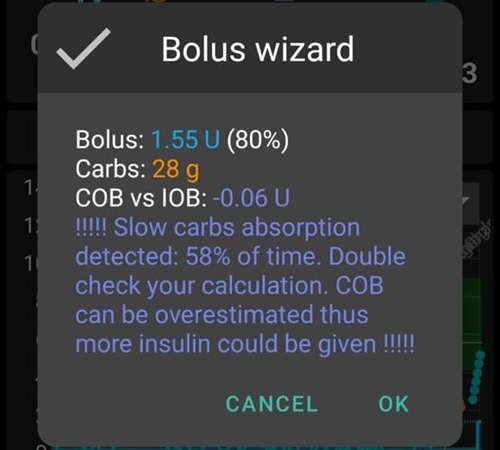
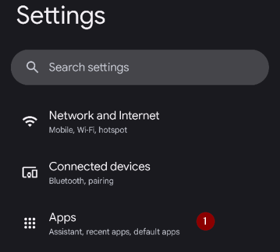
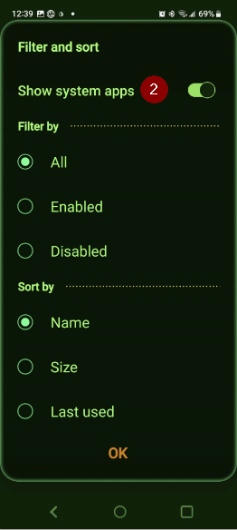

# Troubleshooting

Vous pouvez trouver des informations de dépannage sur de nombreuses pages dans le wiki. Cette page est une collection de liens pour vous aider à trouver les informations nécessaires pour résoudre votre problème.

D'autres informations utiles peuvent également être disponibles dans la [FAQ](../UsefulLinks/FAQ.md).

## Application AAPS

### Génération et mise à jour

* [Fichier de clés perdu](#troubleshooting_androidstudio-lost-keystore)
* [Dépannage AndroidStudio](TroubleshootingAndroidStudio)

### Installing

You may see a Google Play Protect warning that the app is unsafe, was built for older Android versions and doesn't include latest privacy protections.

Ignore it: More details, Install anyway.

### Paramètres
* Profil

  

* [Pompe - données provenant de différentes pompes](#update30-failure-message-data-from-different-pump)

  

* [Client Nightscout](../GettingHelp/TroubleshootingNsClient.md)

### Utilisation
* [Valeur de glucides incorrectes](#CobCalculation-detection-of-wrong-cob-values)

   

* [Commandes SMS](#SMSCommands-troubleshooting)

### Cannot start Omnipod with Android 16

Upgrade to minimum version of AndroidAPS: 3.3.2.1.

### Frequent Bluetooth connection problems

#### Android 15

After upgrading Android or moving to a recent phone, **AAPS** frequently loses Bluetooth connection to the pump. The problem disappears temporarily when restarting the phone. If the phone runs Android 15, you can try to enable the following:

1) **Open preferences** by clicking the three-dot menu on the top right side of the home screen.

2. Scroll down and open the **Confirmation beeps** / **Advanced** submenu. Enable **Bond BT device on Android 15+**.

   

3. If the pump asks for a pairing request, accept it.

4. Restart your phone.

#### Battery optimization

Cela peut se produire avec diverses pompes. Apart from excluding AAPS from any battery optimization, you can also exclude the system Bluetooth app from battery optimization. Cela peut être utile dans certains cas. Depending on the phone you use, you will find the Bluetooth app differently.

Voici des exemples pour les trouver sur des téléphones Android spécifiques.

##### Pixel phones (stock Android)

* Allez dans les paramètres d'Android, sélectionnez "Applications".

  

* Sélectionnez "Voir toutes les applications"

  

* Dans le menu à droite, sélectionnez "Afficher les applications système".

  

* Maintenant, recherchez et sélectionnez l'application "Bluetooth".

  

* Cliquez sur "Optimisation de la batterie" et sélectionnez "Ne pas optimiser".

  

##### Téléphone Samsung

* Allez dans les paramètres d'Android, sélectionnez "Applications"

* Sur l'icône qui modifie soi-disant l'algorithme de tri (1), sélectionnez "Afficher les applications système" (2).

  

  

* Maintenant, recherchez l'application bluetooth et sélectionnez-la pour voir ses paramètres.

  

* Sélectionnez "batterie".

  

* Réglez le sur "Non optimisé"

  

## MGC

* [General](#general-cgm-troubleshooting)
* [Dexcom G6](#DexcomG6-troubleshooting-g6)
* [Libre 3](#libre3-experiences-and-troubleshooting)
* [Libre 2](#Libre2-experiences-and-troubleshooting)
* [xDrip - pas de données MGC](#xdrip-identify-receiver)
* [Dépannage xDrip - Dexcom](#xdrip-troubleshooting-dexcom-g5-g6-and-xdrip)

## Pompes

* [DanaRS](#DanaRS-Insulin-Pump-dana-rs-specific-errors)
* [Accu-Chek Combo généralités](../CompatiblePumps/Accu-Chek-Combo-Tips-for-Basic-usage.md)
* [Accu-Chek Insight](#Accu-Chek-Insight-Pump-insight-specific-errors)
* [Medtronic + RileyLink](#MedtronicPump-what-to-do-if-i-loose-connection-to-rileylink-and-or-pump)

## Téléphones

* [Jelly](../CompatiblePhones/Jelly.md)
* [Huawei optimisation bluetooth & batterie](../CompatiblePhones/Huawei.md)

## Montres connectées

* [Dépannage de l'application Wear](#Watchfaces-troubleshooting-the-wear-app)
