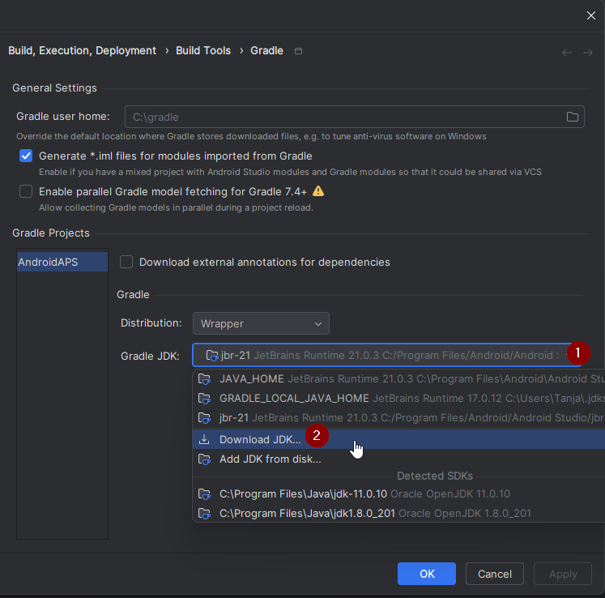

(troubleshooting_androidstudio-troubleshooting-android-studio)=
# Dépannage d'Android Studio

(troubleshooting_androidstudio-lost-keystore)=
## Fichier de clés perdu
Si vous utilisez le même fichier de clés lors de la mise à jour d'AAPS, vous n'avez pas besoin de désinstaller la version précédente sur votre smartphone. C'est pourquoi il est recommandé de stocker le fichier de clés dans un dossier de sauvegarde sûr.

Si vous essayez d'installer l'apk, signé avec un fichier de clés différent de celui d'avant, vous recevrez un message d'erreur indiquant que l'installation a échoué!

Si vous ne trouvez plus votre ancien fichier de clés ou son mot de passe, procédez comme suit :

1. [Exportez les paramètres](../Maintenance/ExportImportSettings.md) sur votre ancien téléphone.
2. Copiez le fichier de configuration de votre téléphone vers un emplacement externe (par ex. votre ordinateur, un service cloud...).
4. Générez l'apk signé de la nouvelle version comme décrit dans le [Guide de mise à jour](../Maintenance/UpdateToNewVersion) et transférez-le sur votre téléphone.
5. Désinstallez la précédente version de AAPS sur votre téléphone.
6. Installez la nouvelle version de AAPS sur votre téléphone.
7. [Importez les paramètres](#ExportImportSettings-restoring-from-your-backups-on-a-new-phone-or-fresh-installation-of-aaps) pour restaurer vos objectifs et votre configuration.

   Si vous ne pouvez pas les trouver sur votre téléphone, copiez les depuis le stockage externe vers votre téléphone.

8. Vérifiez vos options d'optimisation de la batterie et désactivez-les à nouveau.
9. Continuez à boucler.

## Gradle Sync en échec
Gradle Sync peut échouer pour diverses raisons. Quand vous recevez un message indiquant que la synchronisation gradle a échouée, ouvrez l'onglet "Build" (1) en bas d'Android Studio et vérifiez quel message d'erreur (2) est affiché.

  

Ci-dessous les échecs courants de synchronisation de gradle :
* [Uncommitted changes](#uncommitted-changes)
* [No cached version of ... available](#could-not-resolveno-cached-version)
* [Incompatible Gradle JVM](#incompatible-gradle-jvm)
* [Incompatible version of the Android Gradle plugin](#incompatible-version-of-android-gradle-plugin)

*Important*: Après avoir suivi les instructions pour votre problème spécifique, vous devez déclencher la [synchronisation gradle](#gradle-resync) à nouveau.

(troubleshooting_androidstudio-uncommitted-changes)=
### Uncommitted changes

Si vous recevez un message d'erreur comme ceci


#### Étape 1 - Vérifiez l'installation de git
  * Ouvrez l'onglet Terminal (1) en bas d'Android Studio, copiez le texte suivant et collez le dans le terminal.
    ```
    git --version
    ```

    

    Note : Il y a un espace et deux traits d'union entre git et version !

  * Vous devez recevoir un message indiquant quelle version de git est installée, comme vous pouvez le voir dans la capture d'écran ci-dessus. Dans ce cas, allez à l'[étape 2](#troubleshooting-android-studio-check-for-uncommitted-changes).

  * Dans le cas où vous recevez un message disant
    ```
    Git: command not found
    ```
    votre installation Git n'est pas correcte.

  * [Vérifiez l'installation de git](#BuildingAaps-steps-for-installing-git)

  * Quand vous êtes sur Windows et que git vient juste d'être installé, vous devez redémarrer votre ordinateur pour rendre git disponible après l'installation

  * Si Git est installé, que vous avez redémarré (si sous Windows), et git n'est toujours pas trouvé :

  * Cherchez dans votre ordinateur un fichier "git.exe".

    Notez pour vous, dans quel répertoire il se trouve.

  * Allez dans les variables d'environnement de Windows, sélectionnez la variable "PATH" et cliquez sur Modifier. Ajoutez le répertoire où vous avez trouvé votre installation de git.

  * Sauver et fermer.

  * Redémarrer Android Studio.

(troubleshooting-android-studio-check-for-uncommitted-changes)=
#### Étape 2 : Vérifier les modifications non commitées.

  * Dans Android Studio, observez l'onglet « Commit » (1) à gauche. 
  * Vous pouvez voir "Default changeset" (2) ou "Unversioned files" (3):

    * Pour "Default Changeset", vous avez probablement mis à jour gradle ou modifié certains contenus du fichier par erreur.

    * Faites un clic droit sur "Default Changeset" et sélectionnez "Rollback"

      

    * Les fichiers sont récupérés à nouveau depuis le serveur Git. S'il n'y a pas d'autres changements dans l'onglet commit, allez à l'[étape 3](#gradle-resync).

  * Si vous pouvez voir "Unversioned Files", vous pouvez avoir stocké des fichiers dans votre répertoire soure qui devraient être ailleurs, par ex. votre fichier de de clés.

    * Utilisez votre explorateur de fichiers habituel sur votre ordinateur pour déplacer ou couper et coller ce(s) fichier(s) à un autre endroit.

    * Retournez à Android Studio et cliquez sur le bouton Refresh (4) dans l'onglet Commit pour vous assurer que le fichier n'est plus stocké dans le répertoire AAPS.

      S'il n'y a pas d'autres changements dans l'onglet commit, allez à l'[étape 3](#gradle-resync).


(troubleshooting_androidstudio-step-3-gradle-resync)=

#### Étape 3 : Resynchroniser Gradle (encore)

Suivez les instructions de [Resynchronisation Gradle](#gradle-resync).

(troubleshooting_androidstudio-android-gradle-plugin-requires-java-11-to-run)=

(incompatible-gradle-jvm)=
### Incompatible Gradle JVM

 If you experience the following error message, you need to download a correct JVM version before you can try again:
* Open the gradle view by clicking on the elephant (1) on the right side of Android Studio and open the settings (2) and select **Gradle Settings** (3):


* Open the **Gradle JDK** options, then select **Download JDK...**



* At **Version** (1), you need to select **17**. Then select the **JetBrains Runtime** from the **Vendor** (2) options. Do not change the **Location** (3).


* Close the **Settings** dialog with **OK**.
* You now need to restart the Gradle Sync. Suivez les instructions de [Resynchronisation Gradle](#gradle-resync).

(incompatible-version-of-android-gradle-plugin)=
### Incompatible version of Android Gradle plugin

  If you experience the following error message

  

  You are using an outdated version of Android Studio. In the menu, go to Help > Check for updates and install any updates of Android Studio and its plugins that are found.

(troubleshooting_androidstudio-could-not-resolve-no-cached-version)=
### Could not resolve/No cached version

  Si vous rencontrez ce message d'erreur:


  * Sur la droite, ouvrez l'onglet Gradle (1).

    Assurez-vous que le bouton affiché (2) n'est *PAS* sélectionné.

    

  * Now you need to trigger a [Gradle Resync](#gradle-resync)

(troubleshooting_androidstudio-unable-to-start-daemon-process)=
### Unable to start daemon process

  Si vous voyez un message d'erreur ci-dessous, vous utilisez probablement un système Windows 10 32 bits. Ceci n'est pas pris en charge par Android Studio 3.5.1 et plus et il n'y a malheureusement rien que le développeur d'AAPS ne puisse faire!

  There are a lot of manuals on the internet how to determine wether you have a 32-bit or 64-bit OS - i.e. [this one](https://support.microsoft.com/en-us/windows/32-bit-and-64-bit-windows-frequently-asked-questions-c6ca9541-8dce-4d48-0415-94a3faa2e13d).

  

(gradle-resync)=
### Resynchronisation Gradle

  Si vous pouvez toujours voir le message que la synchronisation de gradle a échoué, sélectionnez maintenant le lien "Try again".


  Si vous ne voyez plus le message, vous pouvez toujours le déclencher manuellement:

  * Ouvrez l'onglet Gradle (1) sur le côté droit de Android Studio.

    

  * Right-click on AAPS (2)

  * Cliquez sur "Reload Gradle Project" (3)

## Générer l'APK signé avec succès mais avec 0 variantes de compilation

Lorsque vous générez l'apk signé, vous pouvez obtenir la notification que la génération a été effectuée avec succès mais on vous dit que 0 variantes de compilation ont été générées:


C'est un faux avertissement. Check the directory your selected as "Destination folder" for generation (step [Generate Signed APK](#Building-APK-generate-signed-apk)) and you will find the generated apk there!


## L'application a été créée avec les avertissements du compilateur/kotlin

Si votre compilation est terminée avec succès mais que vous obtenez des avertissements du compilateur ou de kotlin (indiqués par un point d'exclamation jaune ou bleu), alors vous pouvez ignorer ces avertissements.

 

Votre application a été correctement compilée et peut être transférée au téléphone!


## La clé a été créée avec des erreurs

Lors de la création d'un fichier de clés pour pouvoir générer un APK signé, sous Windows, le message d'erreur suivant peut apparaître


Cela semble être un bug avec Android Studio 3.5.1 et son environnement Java livré sous Windows. La clé est créée correctement mais une recommandation est affichée à tort comme une erreur. Cela peut actuellement être ignoré.


## No CGM data is received by AAPS

* Si vous utilisez l'application Dexcom G6 patchée, cette application est obsolète. Use the [BYODA](#DexcomG6-if-using-g6-with-build-your-own-dexcom-app) app instead.

* In case you are using xDrip+: Identify receiver as described on [xDrip+ settings page](#xdrip-identify-receiver).


## Application non installée.


* Assurez-vous d'avoir transféré le fichier “app-full-release.apk” sur votre téléphone.
* Si vous avez le message "App non installé" sur votre téléphone, suivez ces étapes :

1. [Export settings](../Maintenance/ExportImportSettings.md) (in AAPS version already installed on your phone)
2. Désinstaller AAPS sur votre téléphone.
3. Activer le mode avion & désactiver bluetooth.
4. Installer la nouvelle version (« app-full-release.apk »)
5. [Importer les paramètres](../Maintenance/ExportImportSettings.md)
6. Activer le bluetooth et désactiver le mode avion

## Application installée mais ancienne version

If you built the app successfully, transferred it to your phone and installed it successfully but the version number stays the same then you might have missed to [update your local copy](#Update-to-new-version-update-your-local-copy)

## Rien ci-dessus n'a marché

Si aucun des conseils ci-dessus ne vous a aidé, vous pourriez envisager de repartir de zéro pour reconstruire l'application :

1. [Export settings](../Maintenance/ExportImportSettings.md) (in AAPS version already installed on your phone)

2. Ayez vos mots de passe pour la clé et le fichier de clés sous la main. Si vous avez oublié ces mots de passe vous pouvez essayer de les retrouver dans les fichiers du projet comme c'est décrit [ici](https://youtu.be/nS3wxnLgZOo).

    Ou vous pouvez recréer un nouveau fichier de clés.

3. Build app from scratch as described [here](#Building-APK-download-AAPS-code).

4. Quand vous avez construit l'APK avec succès, supprimez l'application existante sur votre téléphone, transférez le nouvel apk sur votre téléphone et installez le.
5. [Import settings](../Maintenance/ExportImportSettings.md) again to restore your objectives and settings.
6. Vous devez vérifier vos options d'optimisation de la batterie et désactivez-les à nouveau.

## Pire scénario

Dans le cas où même construire l'application à partir de rien ne résout pas votre problème, vous pouvez essayer de désinstaller complètement Android Studio. Certains utilisateurs ont signalé que cela a résolu leur problème.

**Assurez-vous de désinstaller tous les fichiers associés à Android Studio.** Si vous ne supprimez pas complètement tous les fichiers cachés, la désinstallation peut provoquer de nouveaux problèmes au lieu de résoudre ceux existants. Les manuels pour une désinstallation complète peuvent être trouvés en ligne, par ex.

[https://stackoverflow.com/questions/39953495/how-to-completely-uninstall-android-studio-from-windowsv10](https://stackoverflow.com/questions/39953495/how-to-completely-uninstall-android-studio-from-windowsv10).

Installez Android Studio à partir de zéro comme c'est décrit [ici](#Building-APK-install-android-studio).
