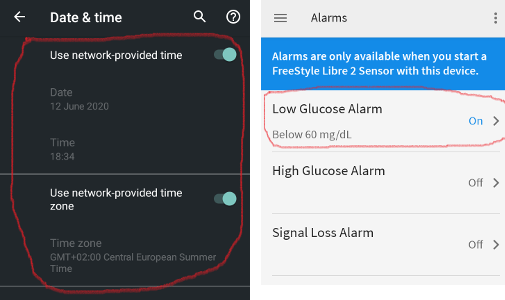

Freestyle Libre 2
**************************************************

Le système Freestyle Libre 2 peut automatiquement signaler des niveaux de glycémie dangereux. Le capteur Libre2 envoie le taux de glycémie actuel à un récepteur (lecteur ou smartphone) chaque minute. Le récepteur déclenche une alarme si nécessaire. Avec une application LibreLink modifiée par vous-même et l'application xDrip+, vous pouvez recevoir en permanence votre taux de sucre dans le sang sur votre smartphone. 

The sensor can be calibrated in the range of -40 mg/dl to +20 mg/dl (-2,2 mmol/l to +1,1 mmol/l) to adjust differences between finger prick measurements and sensor readings.

Les glycémies peuvent également être transmise avec un émetteur BT comme avec le Libre1.

Step 1: Build your own patched LibreLink-App
==================================================

Pour des raisons légales, le soi-disant correctifs doit être fait par vous-même. Utilisez les moteurs de recherche pour trouver les liens correspondants. Il y a deux principales variantes : L'application patchée d'origine recommandée bloque tout trafic Internet pour éviter le suivi. L'autre variante supporte LibreView qui peut être nécessaire pour votre médecin.

The patched app has to be installed instead of the original app. The next sensor started with it will transmit the current BG values to the xDrip+ app running on your smartphone via Bluetooth.

Important : Pour éviter d'éventuels problèmes, il peut être utile dans un premier temps d'installer et de désinstaller l'application originale sur un smartphone compatible NFC. Le NFC doit être activé. Cela ne consomme pas plus d'énergie. Installez ensuite l'application patchée. 

L'application patchée peut être identifiée par la notification d'autorisation au premier plan. Le service d'autorisation au premier plan améliore la stabilité de la connexion par rapport à l'application d'origine qui n'utilise pas ce service.

.. image:: ../images/Libre2_ForegroundServiceNotification.png
  :alt: LibreLink Foreground Service

Other indications could be the Linux penguin logo three dot menu -> Info or the font of the patched app. These criteria are optional depending on the app source you choose.

.. image:: ../images/LibreLinkPatchedCheck.png
  :alt: LibreLink Font Check

Ensure that NFC is activated, enable the memory and location permission for the patched app, enable automatic time and time zone and set at least one alarm in the patched app. 

Maintenant, démarrez le détecteur Libre2 avec l'application patchée en scannant simplement le capteur. Assurez-vous d'avoir défini tous les paramètres.

Paramètres obligatoires pour réussir le démarrage du capteur : 

* NFC activé / BT activé
* autorisation de mémoire et d'emplacement activée 
* service d'emplacement activé
* automatic time and time zone setting
* définir au moins une alarme dans l'application patchée

Veuillez noter que l'activation du service de localisation est primordial. This is not the app location permission which has to be set also!

.. image:: ../images/Libre2_AppPermissionsAndLocation.png
  :alt: LibreLink autorisation mémoire & localisation
  
  

The sensor remembers the device it was started from. Seul cet appareil peut recevoir les alarmes à l'avenir.

La première configuration de connexion au capteur est critique. L'application LibreLink tente d'établir une connexion sans fil au capteur toutes les 30 secondes. Si un ou plusieurs paramètres obligatoires sont manquants, ils doivent être renseignés. Vous n'avez pas de limite de temps pour le faire. Le capteur essaye constamment de configurer la connexion. Même si cela dure plusieurs heures. Be patient and try different settings before even think of changing the sensor.

As long as you see a red exclamation mark ("!") on the upper left corner of the LibreLink's start screen there is no connection or some other setting blocks LibreLink to signal alarms. Vérifiez si le son est activé et que toutes les applications de blocage de notifications sont désactivées. Ce n'est que lorsque le point d'exclamation est parti, que la connexion est établie et que les valeurs de glycémies sont envoyées au smartphone. Cela devrait se produire après un maximum de 5 minutes.

.. image:: ../images/Libre2_ExclamationMark.png
  :alt: LibreLink no connection
  
Si le point d'exclamation reste ou si vous obtenez un message d'erreur, cela peut avoir plusieurs raisons :

- le service de localisation Android n'est pas autorisé - veuillez l'activer dans les paramètres système
- automatic time and time zone not set - please change the settings accordingly
- activez les alarmes - au moins une des trois alarmes doit être activée dans LibreLink
- le Bluetooth est éteint - veuillez l'activer
- le son est bloqué
- les notifications de l'application sont bloquées
- les notifications de l'écran de veille sont bloqués 
- vous avez un capteur Libre 2 défectueux (LOT avec un 'K' suivi de 8 chiffres). Vous trouvez ce numéro imprimé sur le paquet jaune. These sensors have to be replaced as they don't function on bluetooth.

Le redémarrage du téléphone peut vous aider, vous devrez peut-être le faire plusieurs fois. Dès que la connexion est établie, le point d'exclamation rouge disparaît et l'étape la plus importante est franchie. Il peut arriver que, selon les paramètres du système, le point d'exclamation reste mais que vous obtenez des lectures. Dans les deux cas, c'est bon. Le capteur et le téléphone sont maintenant connectés, chaque minute une valeur de glycémie est transmise.

.. image:: ../images/Libre2_Connected.png
  :alt: LibreLink connexion établie
  
Dans de rares cas, cela peut aider à vider le cache bluetooth et/ou réinitialiser toutes les connexions réseau via le menu système. Cela supprime tous les périphériques bluetooth connectés ce qui peut aider à configurer une nouvelle connexion bluetooth spécifique. That procedure is save as the started sensor is remembered by the patched LibreLink app. Nothing additional has to be done here. Simply wait for the patched app to connect to the sensor.

After a successful connection the smartphone settings can be changed if necessary. Cela n'est pas recommandé, mais vous pouvez vouloir économiser de l'énergie. Le service de localisation peut être éteint, le volume peut être réglé à zéro ou les alarmes peuvent être à nouveau désactivées. The blood sugar levels are transferred anyway.

Toutefois, lors du démarrage du capteur suivant, tous les paramètres devront à nouveau être définis !

Remark: The patched app need the mandatory settings set in that hour after warmup to enable a connection. Pour les 14 jours de fonctionnement, ils ne sont pas nécessaires. In most cases when you have problems with starting a sensor the location service was switched off. For Android it is needed for proper bluetooth operation(!) to connect. Please refer to Google's Android documentation.

During the 14 days you can use in parallel one or more NFC capable smartphones (not the reader device!) running the original LibreLink app for scanning via NFC. There is no time limitation to start that. You could use a parallel phone for example on day 5 or so. The parallel phones(s) could upload the blood sugar values into the Abbott Cloud (LibreView). LibreView can generate reports for your diabetes team. Il y a beaucoup de parents qui en ont absolument besoin. 

Please note that the original patched app **does not have any connection to the internet** to avoid tracking.

However there is a variant of the patched app supporting LibreView with enabled internet access. Please be aware that your data is transferred to the cloud then. But your diadoc tool- and reporting chain is fully supported then. With that variant it is also possible to move the alarms of a running sensor to a different device which not has started the sensor. Please google in diabetes related German forums how this could be done.

Étape 2 : Installer et configurer l'application xDrip+
==================================================

Les glycémies sont reçues sur le smartphone par l'application xDrip+. 

* If not already set up then download xDrip+ app and install one of the latest nightly builds from `here <https://github.com/NightscoutFoundation/xDrip/releases>`_.
* Dans xDrip+ sélectionnez "Libre2 (patched App)" comme source de données matérielle
* Si nécessaire, entrez "BgReading:d,xdrip libre_receiver:v" dans Paramètres moins courants -> Extra Logging Settings -> Balises supplémentaires pour le log. Cela permettra de consigner des messages d'erreur supplémentaires pour le dépannage.
* Dans xDrip allez dans Paramètres > Inter-app settings > Diffusion Locale et sélectionnez ON.
* Dans xDrip allez dans Paramètres > Inter-app settings > Accept Treatments et sélectionnez OFF.
* to enable AAPS to receive blood sugar levels (version 2.5.x and later) from xDrip+ please set `Settings > Interapp Settings > Identify Receiver "info.nightscout.androidaps" <https://androidaps.readthedocs.io/en/latest/EN/Configuration/xdrip.html#identify-receiver>`_
* Si vous voulez pouvoir utiliser AndroidAPS pour calibrer, alors dans xDrip, allez dans Paramètres > Inter-app settings > Accept Calibrations et sélectionnez ON.  Vous pouvez également consulter les options dans Paramètres > Paramètres moins courants > Paramètres Avancés de Calibration.

.. image:: ../images/Libre2_Tags.png
  :alt: xDrip+ journaux LibreLink

Étape 3 : Démarrer le capteur
==================================================

Dans xDrip+ démarrez le capteur avec "Start Sensor" et "not today". 

En fait, cela ne démarre aucun capteur Libre2 ou n'interagit en aucun cas avec eux. Il s'agit simplement d'indiquer à xDrip+ qu'un nouveau capteur envoie des glycémies. Si possible, entrez deux valeurs de glycémie capillaire pour l'étalonnage initial. Maintenant, les glycémies doivent être affichées dans xDrip+ toutes les 5 minutes. Les valeurs manquantes, par ex. parce que vous étiez trop loin de votre téléphone, ne seront pas remises.

Après un changement de capteur, xDrip+ détectera automatiquement le nouveau capteur et supprimera toutes les données d'étalonnage. You may check you bloody BG after activation and make a new initial calibration.

Étape 4 : Configurer AndroidAPS (pour la boucle uniquement)
==================================================
* Dans AndroidAPS allez dans le Générateur de configuration > Source des glycémies et cochez 'xDrip+' 
* If AndroidAPS does not receive BG values when phone is in airplane mode, use `Identify receiver` as describe on `xDrip+ settings page <../Configuration/xdrip.html#identify-receiver>`_.

Jusqu'à présent, en utilisant le Freestyle Libre 2 comme source Gly, vous ne pouvez pas activer les fonctions 'Activer SMB toujours' et 'Activer SMB après les glucides' dans l'algorithme SMB. Les valeurs de GLY du Freestyle Libre 2 ne sont pas assez lisses pour l'utiliser en toute sécurité. Voir `Lissage des données de glycémie <../Usage/Smoothing-Blood-Glucose-Data-in-xDrip.html>`_ pour plus de détails.

Astuces et Dépannages
==================================================

Connectivity
--------------------------------------------------
The connectivity is extraordinarily good. With the exception of Huawei mobile phones, all current smartphones seams to work well. Le taux de reconnexion en cas de perte de connexion est phénoménal. La connexion peut s'interrompre si le téléphone portable se trouve dans la poche opposée au capteur ou si vous êtes à l'extérieur. Lorsque je jardinage, je porte mon téléphone du même côté que le capteur. In rooms, where Bluetooth spreads over reflections, no problems should occur. Si vous avez des problèmes de connectivité, testez avec un autre téléphone. Cela peut aussi aider positionner le capteur avec l'antenne BT interne pointant vers le bas. La fente sur l'applicateur doit pointer vers le bas lors de la pose du capteur.

Value smoothing & raw values
--------------------------------------------------
Techniquement, la glycémie est transmise chaque minute à xDrip+. Une moyenne pondérée calcule une valeur lissée sur les 25 dernières minutes. Ceci est obligatoire pour la boucle. Les courbes sont lisses et les résultats avec la boucle sont excellents. Les valeurs brutes sur lesquelles les alarmes sont basées sont un peu plus instables, mais correspondent également aux valeurs que le lecteur affiche. De plus, les valeurs brutes peuvent être affichées dans le graphique xDrip+ afin de pouvoir réagir à temps en cas de changements rapides. Veuillez activer Paramètres moins courants > Advanced settings for Libre2 > "show Raw values in Graph" et "show Sensors Infos in Status". Then the raw values are additionally displayed as small white dots and additional sensor info is available in the system menu.

The raw values are very helpful when the blood sugar is moving fast. Even if the dots are more jumpy you would detect the tendency much better as using the smoothed line to make proper therapy decisions.

.. image:: ../images/Libre2_RawValues.png
  :alt: xDrip+ advanced settings Libre 2 & raw values

Sensor runtime
--------------------------------------------------
La durée d'exécution du capteur est fixée à 14 jours. Les 12 heures supplémentaires du capteur Libre1 n'existent plus. xDrip+ shows additional sensor information after enabling Advanced Settings for Libre2 > "show Sensors Infos" in the system menu like the starting time. Le temps restant du capteur peut également être vu dans l'application Librelink patchée. Soit sur l'écran principal avec le nombre de jours restants affiché, soit avec la date de démarrage du capteur dans le menu 3 points -> Aide -> Journal des évènements sous "Nouveau capteur trouvé".

.. image:: ../images/Libre2_Starttime.png
  :alt: Libre 2 start time

New sensor
--------------------------------------------------
Un échange de capteurs a lieu à la volée : configurez le nouveau capteur peu avant l'activation. Dès que xDrip+ ne reçoit plus de données de l'ancien capteur, démarrez le nouveau capteur avec l'application patchée. Après une heure, les nouvelles valeurs doivent apparaître automatiquement dans xDrip+. 

Si ce n'est pas le cas, vérifiez les paramètres du téléphone et procédez comme avec le premier démarrage. Vous n'avez pas de limite de temps. Try to find the correct settings. Vous n'avez pas besoin de remplacer immédiatement le capteur avant d'avoir vous essayé différentes combinaisons. Les capteurs sont robustes et essaient en permanence d'établir une connexion. Veuillez prendre votre temps. In most cases you accidentally changed one setting which causes now problems. 

Une fois réussi, sélectionnez "Sensor Stop" et "Supprimer l'étalonnage seulement" dans xDrip+. Cela indique à xDrip+ qu'un nouveau capteur est mis en place et que les anciennes calibrations ne sont plus valables et doivent donc être supprimées. Aucune interaction n'est faite avec le capteur Libre2 ici ! You do not need to start the sensor in xDrip+.

.. image:: ../images/Libre2_GapNewSensor.png
  :alt: xDrip+ missing data when changing Libre 2 sensor

Étalonnage
--------------------------------------------------
You can calibrate the Libre2 with an offset of -40 mg/dl to +20 mg/dL [-2,2 mmol/l to +1,1 mmol/l] (intercept). The slope isn't changeable as the Libre2 is much more accurate compared to the Libe1. Veuillez vérifier la glycémie capillaire dès le début de la pose d'un nouveau capteur. On sait qu'il peut y avoir de grandes différences avec les mesures de glycémies. Pour être en sécurité, étalonner toutes les 24 - 48 heures. Les valeurs sont précises jusqu'à la fin du capteur et ne sautent pas comme avec le Libre1. Cependant, si le capteur est complètement éteint, cela ne changera pas. Le capteur doit alors être remplacé immédiatement.

Plausibility checks
--------------------------------------------------
Les capteurs Libre2 vérifient que les glycémies lues sont plausibles pour détecter les mauvaises valeurs. Dès que le capteur bouge sur le bras ou est légèrement relevé, les valeurs peuvent commencer à fluctuer. Dans ce cas le capteur Libre2 s'éteindra pour des raisons de sécurité. Malheureusement, lors du scan avec l'application, des vérifications complémentaires sont faites. L'application peut désactiver le capteur même si celui-ci est OK. Actuellement le test interne est trop strict. J'ai complètement arrêté de scanner le capteur et je n'ai pas eu d'échec depuis.

Time zone travelling
--------------------------------------------------
In other `time zones <../Usage/Timezone-traveling.html>`_ there are two strategies for looping: 

Either 

1. laisser l'heure du smartphone inchangée et décaler le profil de basal (smartphone en mode avion) ou 
2. supprimer l'historique de la pompe et changer l'heure du smartphone pour le mettre à l'heure locale. 

La méthode 1 est excellente tant que vous n'avez pas à mettre en place un nouveau capteur de Libre2. En cas de doute, choisissez la méthode 2, surtout si le voyage dure plus longtemps. Si vous posez un nouveau capteur, la mise à l'heure automatique de la zone doit être réglée, donc la méthode 1 sera perturbée. Il faut donc vérifier avant de partir ailleurs, sinon vous risquez d'avoir rapidement des problèmes.

Experiences
--------------------------------------------------
C'est l'un des plus petits systèmes MGC sur le marché. Il est petit, n'a pas besoin d'émetteur et surtout il envoie des valeurs très précises sans fluctuations. After approx. 12 hours running-in phase with deviations of up to 30 mg/dl (1,7 mmol/l)the deviations are typical smaller than 10 mg/dl (0,6 mmol/l). Les meilleurs résultats sont à l'arrière de l'avant bras, prudence avec les autres zones d'insertion ! Pas besoin d'installer un nouveau capteur un jour plus tôt pour le pré-chauffage. That would disturb the internal leveling mechanism.

Il semble y avoir de mauvais capteurs de temps en temps, qui sont loin des glycémies capillaires. Cela restera ainsi. Ceux-ci doivent être immédiatement remplacés.

Si le capteur bouge un peu sur la peau ou est soulevé d'une manière ou d'une autre, cela peut entraîner de mauvais résultats. Le filament qui se trouve dans la peau est un peu sorti et mesurera ensuite des valeurs différentes. Mostly probably you will see jumping values in xDrip+. Ou les écarts avec les glycémies capillaires augmenteront. Veuillez remplacer le capteur immédiatement ! Les résultats sont inexacts maintenant.

Using bluetooth transmitter and OOP
==================================================

En plus de l'application patchée, le nouveau transmetteur Droplet ou (bientôt disponible) le nouvel algorithme OOP de xDrip+ pourra être utilisé pour recevoir les glycémies. MM2 et blucon ne fonctionnent pas pour l'instant.

Bluetooth transmitter can be used with the Libre2 with the latest xDrip+ nightlys. Veuillez vous référer au site web miaomiao pour trouver une description. This will also work with the Bubble devices and in the future with other transmitter devices.

The Droplet transmitter is working with Libre2 but uses a internet service. Please refer to FB or Google to get further information.

Even if the patched LibreLink app approach is smart there may be some reasons to use a bluetooth transmitter instead.

* the BG readings are identical to the reader results
* the Libre2 sensor can be used 14.5 days as with the Libre1 before 
* 8 hours Backfilling is fully supported.
* get BG readings during the 1 hour startup time of a new sensor

Remark: The transmitter can be used in parallel to the LibreLink app. It doesn't disturb the patched LibreLink app operation.
