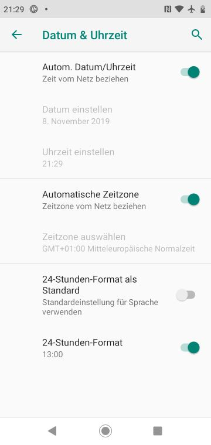
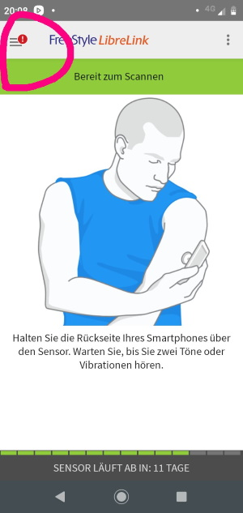

Freestyle Libre 2
**************************************************

Le système Freestyle Libre 2 peut automatiquement signaler des niveaux de glycémie dangereux. Le capteur Libre2 envoie le taux de glycémie actuel à un récepteur (lecteur ou smartphone) chaque minute. Le récepteur déclenche une alarme si nécessaire. Avec une application LibreLink auto-modifiée, vous pouvez recevoir en permanence votre taux de sucre dans le sang sur votre smartphone. Comme ils les envoient directement via bluetooth à votre téléphone, vous n'aurez plus besoin d'acheter un adaptateur bluetooth comme MiaoMiao ou blucon. 

Étape 1 : Construire votre propre application Librelink patchée
==================================================

Pour des raisons légales, le soi-disant correctifs doit être fait par vous-même. Utilisez les moteurs de recherche pour trouver les liens correspondants.

L'application corrigée doit être installée à la place de l'application originale. Le capteur suivant transmettra ses valeurs au smartphone.

Important : Première installation et désinstallation de l'application originale sur un smartphone NFC. Le NFC doit être activé. Cela ne consomme pas plus d'énergie. Installez ensuite l'application patchée. Elle peut être identifiée par la notification d'autorisation au premier plan. 

.. image:: ../images/fsl2pic1.jpg
  :alt: LibreLink Foreground Service

Cela améliore considérablement la stabilité de la connexion par rapport à l'application originale. Assurez-vous que le NFC est activé, activez les autorisations d'accès à la mémoire et à la localisation pour l'application patchée, activez le fuseau horaire automatique et réglez au moins une alarme dans l'application patchée. 

Maintenant, démarrez le détecteur Libre2 avec l'application patchée en scannant simplement le capteur. Suivez les instructions. Le capteur se souvient de l'appareil avec lequel il a été démarré. Seul cet appareil peut recevoir les alarmes à l'avenir.

Paramètres obligatoires pour réussir le démarrage du capteur : 

* NFC activé / BT activé
* Autorisation d'accès mémoire activée 
* localisation activée
* réglage automatique de l'heure et du fuseau horaire
* définir au moins une alarme dans l'application patchée

.. image:: ../images/fsl2pic2.jpg
  :alt: LibreLink permissions memory & location
  

  

  
.. image:: ../images/fsl2pic4.jpg
  :alt: LibreLink settings alarm
  
La première configuration de connexion au capteur est critique. L'application LibreLink tente d'établir une connexion sans fil au capteur toutes les 30 secondes. Si un ou plusieurs paramètres obligatoires sont manquants, ils doivent être renseignés. Vous n'avez pas de limite de temps pour le faire. Le capteur essaye constamment de configurer la connexion. Même si cela dure plusieurs heures. Soyez patient et essayez différents paramétres avant d'envisager de changer le capteur.

Tant que vous voyez un point d'exclamation rouge ("!") dans le coin supérieur gauche de l'écran de démarrage LibreLink, il n'y a pas de connexion. Ce n'est que lorsque le point d'exclamation est parti, que la connexion est établie et que les valeurs de glycémies sont envoyées au smartphone. Cela devrait se produire après un maximum de 5 minutes.

  
Si le point d'exclamation reste ou si vous obtenez un message d'erreur, cela peut avoir plusieurs raisons :

- le service de localisation Android n'est pas autorisé - veuillez l'activer dans les paramètres système
- le réglage automatique de l'heure et du fuseau horaire n'est pas activé - veuillez modifier les paramètres en conséquence
- activez les alarmes - au moins une des trois alarmes doit être activée dans LibreLink
- le Bluetooth est éteint - veuillez l'activer

Le redémarrage du téléphone peut vous aider, vous devrez peut-être le faire plusieurs fois. Dès que la connexion est établie, le point d'exclamation rouge disparaît et l'étape la plus importante est franchie. Le capteur et le téléphone sont maintenant connectés, chaque minute une valeur de glycémie est transmise.

  
Now the smartphone settings can be changed again if necessary, e.g. if you want to save power. Location service can be switched off, volume can be set to zero or alarms can be switched off again. The bloodsugar levels are transferred anyway.

When starting the next sensor, however, all settings must be set again!

You can use a second NFC capable smartphone with the original LibreLink app for scanning via NFC. The Reader can NOT be used any more, it cannot be connected in parallel! The second phone can upload the blood sugar values into the Abbott Cloud (LibreView). LibreView can generate reports for the DiaDoc. There are many parents who absolutely need this. 

Remark: The patched app does not have any connection to the Internet.

Étape 2 : Installer et configurer l'application xDrip+
==================================================

The blood sugar values are received on the smartphone by the xDrip+ App. 

* If not already set up then download xdrip app and install one of the latest nightly builts from `here <https://github.com/NightscoutFoundation/xDrip/releases>`_.
* In xDrip+ select "Libre2 (patched App)" as data source
* If necessary, enter "BgReading:d,xdrip libre_receiver:v" under Less Common Settings->Extra Logging Settings->Extra tags for logging. This will log additional error messages for trouble shooting.
* Dans xDrip allez dans Paramètres > Compatibilité Interapp > Diffusion Locale des Données et sélectionnez ON.
* Dans xDrip allez dans Paramètres > Compatibilité Interapp > Diffusion Locale des Données et sélectionnez ON.
* to enable AAPS to receive blood sugar levels (version 2.5.x and later) from xdrip please set `Settings > Interapp Settings > Identify Receiver "info.nightscout.androidaps" <https://androidaps.readthedocs.io/en/latest/EN/Configuration/xdrip.html#identify-receiver>`_
* Si vous voulez pouvoir utiliser AndroidAPS pour calibrer, alors dans xDrip, allez dans Paramètres > Compatibilité Interapp > Accepter les Calibrations et sélectionnez ON.  Vous pouvez également consulter les options dans Paramètres > Paramètres moins courants > Paramètres Avancés de Calibration.

.. image:: ../images/fsl2pic7.jpg
  :alt: xDrip+ journaux LibreLink
  
.. image:: ../images/fsl2pic7a.jpg
  :alt: xDrip+ log
  #
Étape 3 : Démarrer le capteur
==================================================

Dans xDrip+ démarrez le capteur avec "Start Sensor" et "not today". 

In fact this will not start any Libre2 sensor or interact with them in any case. This is simply to indicate xDrip+ that a new sensor is delivering blood sugar levels. If available, enter two bloody measured values for the initial calibration. Now the blood glucose values should be displayed in xDrip+ every 5 minutes. Skipped values, e.g. because you were too far away from your phone, will not be backfilled.

Étape 4 : Configurer AndroidAPS
==================================================
* Dans AndroidAPS allez dans le Générateur de configuration > Source des glycémies et cochez 'xDrip+' 
* Si AndroidAPS ne reçoit pas de Glycémie lorsque le téléphone est en mode avion, utilisez `Identify receiver` comme c'est décrit dans la page `Paramètres xDrip+ <../Configuration/xdrip.html#identifier-le-recepteur>`_.

Jusqu'à présent, en utilisant le Freestyle Libre 2 comme source Gly, vous ne pouvez pas activer les fonctions 'Activer SMB toujours' et 'Activer SMB après les glucides' dans l'algorithme SMB. Les valeurs de GLY du Freestyle Libre 2 ne sont pas assez lisses pour l'utiliser en toute sécurité. Voir `Lissage des données de glycémie <../Usage/Smoothing-Blood-Glucose-Data-in-xDrip.html>`_ pour plus de détails.

Astuces et Dépannages
==================================================

The connectivity is extraordinary good. With the exception of Huawei mobile phones, all current smartphones seems to work well. The reconnect in case of connection loss is phenomenal. The connection can break off if the mobile phone is in the pocket opposite the sensor or if you are outdoors. When I am gardening, I use to wear my phone on the sensor side of my body. In rooms, where Bluettooth spreads over refections, no problems should occur. If you have connectivity problems please test another phone.

Technically, the current blood sugar value is transmitted to xDrip+ every minute. A weighted average filter calculates a smoothed value over the last 25 minutes. This is mandatory for looping. The curves look smooth and the loop results are great. The raw values on which the alarms are based jitter a little more, but correspond to the values that the reader also displays. In addition, the raw values can be displayed in the xDrip+ graph in order to be able to react in time to rapid changes. Please switch on Less Common Settings > Advanced Settings for Libre2 > "show Raw values" and "show Sensors Infos". Then the raw values are additionally displayed as small white dots and additional sensor infos are available in the System menu.

.. image:: ../images/fsl2pic8.jpg
  :alt: xDrip+ advanced settings Libre 2
  
.. image:: ../images/fsl2pic9.jpg
  :alt: xDrip+ homescreen with raw data
  
The sensor runtime is fixed to 14 days. The 12 extra hours of Libre1 no longer exist. xDrip+ shows additional sensor information after enabling Avanced Settings for Libre2 > "show Sensors Infos" in the system menu like the starting time. The remaining sensor time can also be seen in the patched LibreLink app. Either in the main screen as remaining days display or as the sensor start time in the three-point menu->Help->Event log under "New sensor found".

.. image:: ../images/fsl2pic10.jpg
  :alt: Libre 2 start time
  
Altogether it is one of the smallest CGM systems on the market. Small, no transmitter necessary and mostly very accurate values without fluctuations. After approx. 12 hours running-in phase with deviations of up to 30 mg/dL the deviations are typical smaller than 10 md/dL. Best results at the rear orbital arm, other setting points with caution! No need to set a new sensor one day ahead for soaking. That would disturbe the internal leveling mechanism.

There seem to be bad sensors from time to time, which are far away from the blood values. It stays that way. These should be immediately replaced.

If the sensor moved a little bit on the skin or is lifted somehow this can cause bad results. The filament which sits in the tissue is a little bit pulled out of the tissue and will measure different results then. Mostly probabaly you will see jumping values in xDrip+. Or the difference to the bloody values change. Please replace the sensor immediately! The results are inaccurate now.

A sensor exchange takes place on-the-fly: Set new sensor shortly before activation. As soon as xDrip+ receives no more data from the old sensor, start the new sensor with the patched app. After one hour new values should appear automatically in xDrip+. 

If not, please check the phone settings and proceed as with the first start. You have no time limit. Try to find the correct seetings. No need to immediately replace the sensor before you tried different combinations. The sensors are robust and try permanently to establish a connection. Please take your time. In most cases you accidentially changed one setting which causes now problems. 

Once successful please select "Sensor Stop" and "Delete calibration only" in xDrip. This indicates for xDrip+ that a new sensor is releasing blood sugar levels and the old calibrations are no longer valid and therefore have to be deleted. No real interaction is done with the Libre2 sensor here! You do not need to start the sensor in xDrip.

.. image:: ../images/fsl2pic11.jpg
  :alt: xDrip+ missing data when changing Libre 2 sensor
  
You can calibrate the Libre2 with an offset of plus/minus 20 mg/dL (intercept), but no slope. To be on the safe side, calibrate every 24 - 48 hours. The values are accurate up to the end of the sensor and do not jitter as with the Libre1. However, if the sensor is completely off, this will not change. The sensor should then be replaced immediately.

The Libre2 sensors contain plausibility checks to detect bad sensor values. As soon as the sensor moves on the arm or is lifted slightly, the values may start to fluctuate. The Libre2 sensor will then shut down for safety reasons. Unfortunately, when scanning with the App, additional checks are made. The app can deactivate the sensor even though the sensor is OK. Currently the internal test are too strict. I have completely stopped scanning and haven't had a failure since then.

In other `time zones <../Usage/Timezone-traveling.html>`_ there are two strategies for looping: Either 

1. leave the smartphone time unchanged and shift the basal profile (smartphone in flight mode) or 
2. delete the pump history and change the smartphone time to local time. 

Method 1. is great as long as you don't have to set a new Libre2 sensor on-site. If in doubt, choose method 2., especially if the trip takes longer. If you set a new sensor, the automatic time zone must be set, so method 1. would be disturbed. Please check before, if you are somewhere else, you can run otherwise fast into problems.

Besides the patched app the new Droplet transmitter or (soon available) the new OOP algorithm of xDrip+ can be used to receive blood sugar values. MM2 and blucon do NOT work so far.
