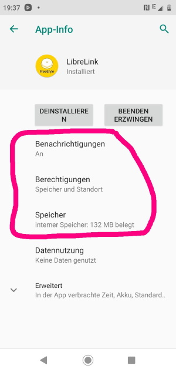

Freestyle Libre 2
**************************************************

Le système Freestyle Libre 2 peut automatiquement signaler des niveaux de glycémie dangereux. Le capteur Libre2 envoie le taux de glycémie actuel à un récepteur (lecteur ou smartphone) chaque minute. Le récepteur déclenche une alarme si nécessaire. Avec une application LibreLink auto-modifiée, vous pouvez recevoir en permanence votre taux de sucre dans le sang sur votre smartphone. Comme ils les envoient directement via bluetooth à votre téléphone, vous n'aurez plus besoin d'acheter un adaptateur bluetooth comme MiaoMiao ou blucon. 

Étape 1 : Construire votre propre application Librelink patchée
==================================================

Pour des raisons légales, le soi-disant correctifs doit être fait par vous-même. Utilisez les moteurs de recherche pour trouver les liens correspondants.

To check whether you correctly patched the LibreLink app, take a look at the font of the patched app. The fonts in the original and patched app differ. Your patching was successful if the font looks like the font on the right:

.. image:: ../images/LibreLinkPatchedCheck.png
  :alt: LibreLink Foreground Service

L'application corrigée doit être installée à la place de l'application originale. Le capteur suivant transmettra ses valeurs au smartphone.

Important : Première installation et désinstallation de l'application originale sur un smartphone NFC. Le NFC doit être activé. Cela ne consomme pas plus d'énergie. Installez ensuite l'application patchée. Elle peut être identifiée par la notification d'autorisation au premier plan. 

.. image:: ../images/fsl2pic1.jpg
  :alt: LibreLink Foreground Service

Cela améliore considérablement la stabilité de la connexion par rapport à l'application originale. Assurez-vous que le NFC est activé, activez les autorisations d'accès à la mémoire et à la localisation pour l'application patchée, activez le fuseau horaire automatique et réglez au moins une alarme dans l'application patchée. 

Maintenant, démarrez le détecteur Libre2 avec l'application patchée en scannant simplement le capteur. Suivez les instructions. Le capteur se souvient de l'appareil avec lequel il a été démarré. Seul cet appareil peut recevoir les alarmes à l'avenir.

Paramètres obligatoires pour réussir le démarrage du capteur : 

* NFC activé / BT activé
* Autorisation d'accès mémoire activée 
* localisation activée
* réglage automatique de l'heure et du fuseau horaire
* définir au moins une alarme dans l'application patchée

  
.. image:: ../images/fsl2pic3.jpg
  :alt: Android settings location
  
.. image:: ../images/fsl2pic4a.jpg
  :alt: automatic time and timezone
  
.. image:: ../images/fsl2pic4.jpg
  :alt: LibreLink settings alarm
  
La première configuration de connexion au capteur est critique. L'application LibreLink tente d'établir une connexion sans fil au capteur toutes les 30 secondes. Si un ou plusieurs paramètres obligatoires sont manquants, ils doivent être renseignés. Vous n'avez pas de limite de temps pour le faire. Le capteur essaye constamment de configurer la connexion. Même si cela dure plusieurs heures. Soyez patient et essayez différents paramétres avant d'envisager de changer le capteur.

Tant que vous voyez un point d'exclamation rouge ("!") dans le coin supérieur gauche de l'écran de démarrage LibreLink, il n'y a pas de connexion. Ce n'est que lorsque le point d'exclamation est parti, que la connexion est établie et que les valeurs de glycémies sont envoyées au smartphone. Cela devrait se produire après un maximum de 5 minutes.

.. image:: ../images/fsl2pic5.jpg
  :alt: LibreLink no connection
  
Si le point d'exclamation reste ou si vous obtenez un message d'erreur, cela peut avoir plusieurs raisons :

- le service de localisation Android n'est pas autorisé - veuillez l'activer dans les paramètres système
- le réglage automatique de l'heure et du fuseau horaire n'est pas activé - veuillez modifier les paramètres en conséquence
- activez les alarmes - au moins une des trois alarmes doit être activée dans LibreLink
- le Bluetooth est éteint - veuillez l'activer

Le redémarrage du téléphone peut vous aider, vous devrez peut-être le faire plusieurs fois. Dès que la connexion est établie, le point d'exclamation rouge disparaît et l'étape la plus importante est franchie. Le capteur et le téléphone sont maintenant connectés, chaque minute une valeur de glycémie est transmise.

.. image:: ../images/fsl2pic6.jpg
  :alt: LibreLink connexion établie
  
Maintenant, les paramètres du smartphone peuvent être à nouveau modifiés si besoin, par ex. si vous voulez économiser de l'énergie. Le service de localisation peut être éteint, le volume peut être réglé à zéro ou les alarmes peuvent être à nouveau désactivées. Les glycémies sont de toute façon transmises.

Toutefois, lors du démarrage du capteur suivant, tous les paramètres devront à nouveau être définis !

Vous pouvez utiliser un deuxième smartphone NFC avec l'application LibreLink d'origine pour scanner le capteur via NFC. Le lecteur NE peut plus être utilisé, il ne peut pas être connecté en parallèle ! Le second téléphone peut télécharger les glycémies dans Cloud d'Abbott (LibreView). LibreView peut générer des rapport pour le DiaDoc. Il y a beaucoup de parents qui en ont absolument besoin. 

Remarque : L'application patchée n'a aucune connexion Internet.

Étape 2 : Installer et configurer l'application xDrip+
==================================================

Les glycémies sont reçues sur le smartphone par l'application xDrip+. 

* Si ce n'est pas déjà configuré, alors téléchargez l'application xDrip+ et installez une des dernières pre-release à partir d'`ici <https://github.com/NightscoutFoundation/xDrip/releases>`_.
* Dans xDrip+ sélectionnez "Libre2 (patched App)" comme source de données matérielle
* Si nécessaire, entrez "BgReading:d,xdrip libre_receiver:v" dans Paramètres moins courants -> Extra Logging Settings -> Balises supplémentaires pour le log. Cela permettra de consigner des messages d'erreur supplémentaires pour le dépannage.
* Dans xDrip allez dans Paramètres > Compatibilité Interapp > Diffusion Locale des Données et sélectionnez ON.
* Dans xDrip allez dans Paramètres > Compatibilité Interapp > Diffusion Locale des Données et sélectionnez ON.
* pour permettre à AAPS de recevoir les glycémies (version 2.5.x et supérieures) de la part de xDrip+ veuillez renseigner dans `Paramètres > Inter-app settings > Identify receiver "info.nightscout.androidaps" <https://androidaps.readthedocs.io/en/latest/EN/Configuration/xdrip.html#identifier-le-recepteur>`_
* Si vous voulez pouvoir utiliser AndroidAPS pour calibrer, alors dans xDrip, allez dans Paramètres > Compatibilité Interapp > Accepter les Calibrations et sélectionnez ON.  Vous pouvez également consulter les options dans Paramètres > Paramètres moins courants > Paramètres Avancés de Calibration.

.. image:: ../images/fsl2pic7.jpg
  :alt: xDrip+ journaux LibreLink
  
.. image:: ../images/fsl2pic7a.jpg
  :alt: xDrip+ log
  #
Étape 3 : Démarrer le capteur
==================================================

Dans xDrip+ démarrez le capteur avec "Start Sensor" et "not today". 

En fait, cela ne démarre aucun capteur Libre2 ou n'interagit en aucun cas avec eux. Il s'agit simplement d'indiquer à xDrip+ qu'un nouveau capteur envoie des glycémies. Si possible, entrez deux valeurs de glycémie capillaire pour l'étalonnage initial. Maintenant, les glycémies doivent être affichées dans xDrip+ toutes les 5 minutes. Les valeurs manquantes, par ex. parce que vous étiez trop loin de votre téléphone, ne seront pas remises.

Étape 4 : Configurer AndroidAPS
==================================================
* Dans AndroidAPS allez dans le Générateur de configuration > Source des glycémies et cochez 'xDrip+' 
* Si AndroidAPS ne reçoit pas de Glycémie lorsque le téléphone est en mode avion, utilisez `Identify receiver` comme c'est décrit dans la page `Paramètres xDrip+ <../Configuration/xdrip.html#identifier-le-recepteur>`_.

Jusqu'à présent, en utilisant le Freestyle Libre 2 comme source Gly, vous ne pouvez pas activer les fonctions 'Activer SMB toujours' et 'Activer SMB après les glucides' dans l'algorithme SMB. Les valeurs de GLY du Freestyle Libre 2 ne sont pas assez lisses pour l'utiliser en toute sécurité. Voir `Lissage des données de glycémie <../Usage/Smoothing-Blood-Glucose-Data-in-xDrip.html>`_ pour plus de détails.

Astuces et Dépannages
==================================================

La connectivité est extrêmement bonne. A l'exception des téléphones portables Huawei, tous les smartphones actuels semblent bien fonctionner. La reconnexion en cas de perte de connexion est phénoménale. La connexion peut s'interrompre si le téléphone portable se trouve dans la poche opposée au capteur ou si vous êtes à l'extérieur. Lorsque je jardinage, je porte mon téléphone du même côté que le capteur. Dans les pièces, où le Bluetooth se propage avec des réflexions, aucun problème ne devrait survenir. Si vous avez des problèmes de connectivité, testez avec un autre téléphone.

Techniquement, la glycémie est transmise chaque minute à xDrip+. Une moyenne pondérée calcule une valeur lissée sur les 25 dernières minutes. Ceci est obligatoire pour la boucle. Les courbes sont lisses et les résultats avec la boucle sont excellents. Les valeurs brutes sur lesquelles les alarmes sont basées sont un peu plus instables, mais correspondent également aux valeurs que le lecteur affiche. De plus, les valeurs brutes peuvent être affichées dans le graphique xDrip+ afin de pouvoir réagir à temps en cas de changements rapides. Veuillez activer Paramètres moins courants > Advanced settings for Libre2 > "show Raw values in Graph" et "show Sensors Infos in Status". Ainsi les valeurs brutes sont affichées sous forme de petits points blancs et des informations supplémentaires sur les capteurs sont disponibles dans le menu Système.

.. image:: ../images/fsl2pic8.jpg
  :alt: xDrip+ advanced settings Libre 2
  
.. image:: ../images/fsl2pic9.jpg
  :alt: xDrip+ homescreen with raw data
  
La durée d'exécution du capteur est fixée à 14 jours. Les 12 heures supplémentaires du capteur Libre1 n'existent plus. Après avoir activé Paramètres moins courants > Advanced settings for Libre2 > "show Sensors Infos in Status", xDrip+ affiche des informations supplémentaires sur le capteur dans le menu système comme le temps de démarrage. Le temps restant du capteur peut également être vu dans l'application Librelink patchée. Soit sur l'écran principal avec le nombre de jours restants affiché, soit avec la date de démarrage du capteur dans le menu 3 points -> Aide -> Journal des évènements sous "Nouveau capteur trouvé".

.. image:: ../images/fsl2pic10.jpg
  :alt: Libre 2 start time
  
C'est l'un des plus petits systèmes MGC sur le marché. Il est petit, n'a pas besoin d'émetteur et surtout il envoie des valeurs très précises sans fluctuations. Après environ 12 heures de fonctionnement avec des variations allant jusqu'à 30 mg/dL, les écarts sont généralement inférieurs à 10 mg/dl. Les meilleurs résultats sont à l'arrère de l'avant bras, prudence avec les autres zones d'insertion ! Pas besoin d'installer un nouveau capteur un jour plus tôt pour le pré-chauffage. Cela perturberait le mécanisme de nivellement interne.

Il semble y avoir de mauvais capteurs de temps en temps, qui sont loin des glycémies capillaires. Cela restera ainsi. Ceux-ci doivent être immédiatement remplacés.

Si le capteur bouge un peu sur la peau ou est soulevé d'une manière ou d'une autre, cela peut entraîner de mauvais résultats. Le filament qui se trouve dans la peau est un peu sorti et mesurera ensuite des valeurs différentes. Vous verrez probablement des sauts dans xDrip+. Ou les écarts avec les glycémies capillaires augmenteront. Veuillez remplacer le capteur immédiatement ! Les résultats sont inexacts maintenant.

Un échange de capteurs a lieu à la volée : configurez le nouveau capteur peu avant l'activation. Dès que xDrip+ ne reçoit plus de données de l'ancien capteur, démarrez le nouveau capteur avec l'application patchée. Après une heure, les nouvelles valeurs doivent apparaître automatiquement dans xDrip+. 

Si ce n'est pas le cas, vérifiez les paramètres du téléphone et procédez comme avec le premier démarrage. Vous n'avez pas de limite de temps. Essayez de trouver les bons paramètres. Vous n'avez pas besoin de remplacer immédiatement le capteur avant d'avoir vous essayé différentes combinaisons. Les capteurs sont robustes et essaient en permanence d'établir une connexion. Veuillez prendre votre temps. Dans la plupart des cas, vous avez accidentellement changé un paramètre qui cause maintenant des problèmes. 

Une fois réussi, sélectionnez "Sensor Stop" et "Supprimer l'étalonnage seulement" dans xDrip+. Cela indique à xDrip+ qu'un nouveau capteur est mis en place et que les anciennes calibrations ne sont plus valables et doivent donc être supprimées. Aucune interaction n'est faite avec le capteur Libre2 ici ! Vous n'avez pas besoin de démarrer le capteur dans xDrip+.

.. image:: ../images/fsl2pic11.jpg
  :alt: xDrip+ missing data when changing Libre 2 sensor
  
Vous pouvez calibrer le Libre2 avec un décalage de plus / moins 20 mg/dl (intercept), mais pas de pente. Pour être en sécurité, étalonner toutes les 24 - 48 heures. Les valeurs sont précises jusqu'à la fin du capteur et ne sautent pas comme avec le Libre1. Cependant, si le capteur est complètement éteint, cela ne changera pas. Le capteur doit alors être remplacé immédiatement.

Les capteurs Libre2 vérifient que les glycémies lues sont plausibles pour détecter les mauvaises valeurs. Dès que le capteur bouge sur le bras ou est légèrement relevé, les valeurs peuvent commencer à fluctuer. Dans ce cas le capteur Libre2 s'éteindra pour des raisons de sécurité. Malheureusement, lors du scan avec l'application, des vérifications complémentaires sont faites. L'application peut désactiver le capteur même si celui-ci est OK. Actuellement le test interne est trop strict. J'ai complètement arrêté de scanner le capteur et je n'ai pas eu d'échec depuis.

En cas de changement de `fuseau horaire <../Usage/Timezone-traveling.html>`_ Il y a deux stratégies pour la boucle : 

1. laisser l'heure du smartphone inchangée et décaler le profil de basal (smartphone en mode avion) ou 
2. supprimer l'historique de la pompe et changer l'heure du smartphone pour le mettre à l'heure locale. 

La méthode 1 est excellente tant que vous n'avez pas à mettre en place un nouveau capteur de Libre2. En cas de doute, choisissez la méthode 2, surtout si le voyage dure plus longtemps. Si vous posez un nouveau capteur, la mise à l'heure automatique de la zone doit être réglée, donc la méthode 1 sera perturbée. Il faut donc vérifier avant de partir ailleurs, sinon vous risquez d'avoir rapidement des problèmes.

En plus de l'application patchée, le nouveau transmetteur Droplet ou (bientôt disponible) le nouvel algorithme OOP de xDrip+ pourra être utilisé pour recevoir les glycémies. MM2 et blucon ne fonctionnent pas pour l'instant.
