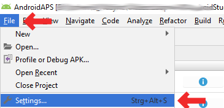

# Construire l'APK

## Construire vous-même au lieu de télécharger

**AndroidAPS n'est pas disponible en téléchargement en raison de la réglementation concernant les dispositifs médicaux. Il est légal de construire l'application pour votre usage personnel, mais vous ne devez en aucun cas donner une copie à d'autres personnes ! Voir la [page FAQ](../Getting-Started/FAQ.md) pour plus de détails.**

## ## Remarques importantes

***Remarque*** : Utilisez [Android Studio Version 3.5.1](https://developer.android.com/studio/) ou une version plus récente pour construire l'apk.

**Configuration onr demand** n'est pas pris en charge par la version actuelle du plug-in Android Gradle !

Si votre construction échoue avec une erreur concernant la "configuration sur demande", faites les actions suivantes :

* Ouvrez la fenêtre Préférences en cliquant sur File > Settings (sur Mac, Android Studio > Preferences).
* Dans le panneau de gauche, cliquez sur Build, Execution, Deployment > Compiler.
* Décochez la case Configure on demand.
* Cliquez sur Appliquer ou OK.

* * *

### Cet article est divisé en deux parties.

* La partie "aperçu" indique les étapes nécessaires pour construire le fichier APK.
* Dans la partie "pas à pas", vous trouverez les captures d'écran d'une installation concrète. Les versions d'Android Studio - l'environnement de développement logiciel que nous utiliserons pour construire l'APK - changent très rapidement. Les exemples ne seront donc pas identiques à votre installation, mais cela devrait vous donner un bon point de départ. Android Studio fonctionne sous Windows, Mac OS X et Linux et il peut y avoir de petites différences entre chaque plateforme. Si vous trouvez que quelque chose d'important est incorrect ou manquant, merci d'informer le groupe facebook "utilisateurs AndroidAPS" ou dans les chats Gitter [Android APS](https://gitter.im/MilosKozak/AndroidAPS) ou [AndroidAPSwiki](https://gitter.im/AndroidAPSwiki/Lobby) afin que nous puissions y remédier.

## Aperçu

En général, les étapes nécessaires pour construire le fichier APK sont :

* [Install git](../Installing-AndroidAPS/git-install.rst)
* Installez et configurez Android Studio.
* Utilisez git pour cloner le code source du répertoire central Github où les développeurs ont mis le code réel pour l'application.
* Ouvrez le projet cloné dans Android Studio comme projet actif.
* Construisez l'APK signé.
* Transférez l'APK généré sur votre téléphone.

## Step by step walkthrough

Description détaillée des étapes nécessaires à la construction du fichier APK.

## Installer git (si vous ne l'avez pas)

Follow the manual on the [git installation page](../Installing-AndroidAPS/git-install.rst).

## Install Android Studio

The following screenshots have been taken from Android Studio Version 3.1.3. Your screen might look a bit different depending on the Android Studio version you use. But you should be able to find your way through. Help from the community is provided for example in the [AndroidAPS Facebook group](https://www.facebook.com/groups/1900195340201874/) and [other places](../Where-To-Go-For-Help/Connect-with-other-users.md).

Install [Android Studio](https://developer.android.com/studio/install.html) and setup during first start.

Select "Do not import settings" as you have not used it before.

Click "Next".

Select "Standard" installation and click "Next".

Select the theme for the user interface you like. (In this manual we used "Intellij". Then click "Next". This is just the color scheme. You can select any you like (i.e. "Darcula" for dark mode). This selection has no influence on building the APK.

Click "Next" on the "Verify Settings" dialog.

The Android emulator (to emulate the smartphone on your PC or Mac) is not used to build the APK. You can click "Finish" to finish the installation and read the documentation later on demand.

Android Studio is downloading a lot of software components it uses. You can click on the "Show Details" button to the what happens but that's not important at all.

After the downloads are completed click the "Finish" button.

* Applause, applause you have now finished the Android Studio installation and can start cloning the source code. Maybe it's time for a short break?

## Set git path in preferences

### Windows

* Let Studio know where is git.exe located: File - Settings
  
  

* In the next window: Version Control - Git

* Choose correct path: .../Git<b>/bin</b>

* Make sure update method "Merge" is selected.
  
  

### Mac

* If you install git via homebrew there is no need to change any preferences. Just in case: They can be found here: Android Studio - Preferences.

## Download code and additional components

* Use git clone in Android Studio as shown in screenshots below. Select "Check out project from Version Control" with "Git" as concrete version control system.

Fill in the URL to the main AndroidAPS repository ("https://github.com/MilosKozak/AndroidAPS") and click "clone".

Android Studio will start cloning. Don't click "Background" as it goes fast and makes things more complicated at the moment.

Finish the checkout from version control with opening the project by clicking "Yes".

Use the standard "default gradle wrapper" and click "OK".

Read and close the "Tip of Day" screen of Android Studio by pressing "Close".

* Excellent, you have your own copy of the source code and are ready to start the build.
* Now we are approaching our first error message. Fortunately, Android Studio will directly give us the solution for this.

Click "Install missing platform(s) and sync project" as Android Studio needs to install a missing platform.

Accept the license agreement by selecting "Accept" and clicking "Next".

As it is said in the dialog please wait until the download is finished.

Now it's finished. Please click "Finish".

Aaaahhh, next error. But Android Studio suggests a similar solution. Click "Install Build Tools and sync project" as Android Studio needs to download missing Tools.

As it is said in the dialog please wait until the download is finished.

Now it's finished. Please click "Finish".

And another error to handle as Android Studio needs to download again a missing platform. Click "Install missing platform(s) and sync project".

As it is said in the dialog please wait until the download is finished.

Now it's finished. Please click "Finish".

Click "Install Build Tools and sync project" as Android Studio needs to download missing Tools.

As it is said in the dialog please wait until the download is finished.

Now it's finished. Please click "Finish".

Yeah, the error messages are gone and the first gradle build is runing. Maybe it's time to drink some water?

Android Studio recommends to update the gradle system. **Never update gradle!** This might lead to difficulties!

Please click "Don't remind me again for this project".

The build is running again.

Yeah, the first build is successful but we are not finished.

## Générer un APK signé

Dans le menu , sélectionnez "Build" puis "Generate Signed Bundle / APK...". (Le menu d'Android Studio a changé en septembre 2018. In older versions select in the menu “Build” and then “Generate Signed APK...”.)

Signing means that you sign your generated app but in a digital way as a kind of digital fingerprint in the app itself. C'est nécessaire car Android a une règle qui impose de n'accepter que du code signé pour des raisons de sécurité. Pour plus d'informations sur ce sujet, suivez le lien [ici](https://developer.android.com/studio/publish/app-signing.html#generate-key). La sécurité est un sujet important et complexe et vous n'avez pas besoin de cela maintenant.

Dans la boite de dialogue suivante, sélectionnez "APK" à la place de "Android App Bundle" et cliquez sur le bouton "Next".

Sélectionnez "app" et cliquez sur "Next".

Click "Create new..." to start creating your keystore. A keystore in this case is nothing more than a file in which the information for signing is stored. It is encrypted and the information is secured with passwords. We suggest storing it in your home folder and remember the passwords but if you lose this information it's not a big issue because then you just have to create a new one. Best practice is to store this information carefully.

* Fill in the information for the next dialog. 
  * Key store path: is the path to the keystore file. **Do not save in same folder as projekt. You must use a different directory!**
  * The password fields below are for the keystore to double check for typing errors.
  * Alias is a name for the key you need. You can leave the default or give it a fancy name you want.
  * The password fields below the key are for the key itself. As always to double check for typing errors.
  * You can let the validity at the default of 25 years.
  * You only have to fill out first name and last name but feel free to complete the rest of information. Then click "OK".

Fill in the information of the last dialog in this dialog and click "Next".

Sélectionnez "fullRelease" pour Buid Variants. Sélectionnez "V1 (Jar Signature)" (V2 est optionnel) et cliquez sur "Finish". Les informations suivantes peuvent être importantes pour une utilisation ultérieure.

* 'Release' devrait être votre choix par défaut pour "Build Variants", 'Debug' est juste pour les personnes qui codent.
* Sélectionnez le type de génération que vous souhaitez complier. 
  * full (c'est à dire recommandations automatiquement adoptées en boucle fermée)
  * openloop (i.e. recommendations given to user to manually enact)
  * pumpcontrol (c'est-à-dire télécommande pour la pompe, pas pour le bouclage)
  * nsclient (c'est-à-dire que les données de bouclage d'un autre utilisateur sont affichées et que des entrées de careportal peuvent être ajoutées)

Dans le journal des événements, vous voyez que l'APK signé a été généré avec succès.

Cliquez sur le lien "locate" dans le journal des événements.

## Transférer le fichier APK sur le smartphone

Une fenêtre du gestionnaire de fichiers s'ouvre. Comme j'utilise Linux, il se peut que ce soit un peu différent sur votre système. Sur Windows, il y aura l'Explorateur de fichiers et sur Mac OS X le Finder. Vous devez voir le répertoire avec le fichier APK généré. Malheureusement, c'est le mauvais endroit car "wear-release.apk" n'est pas l'application signée "app" APK que nous recherchons.

Veuillez sélectionner le répertoire AndroidAPS/app/full/release pour trouver le fichier "app-full-release.apk". Transférez ce fichier sur votre smartphone Android. You can do it on your preferred way, i.e.

* Bluetooth
* cloud upload (Google Drive or other cloud services)
* connect computer and phone by cable 
* by mail (Note that some mail apps do not allow apk attachments, in this case use other transfer method.)

In this example Gmail is used as it is fairly simple. To install the self-signed app you need to allow Android on your smartphone to do this installation even if this file is received via Gmail which is normally forbidden. Si vous utilisez une autre solution, veuillez procéder en conséquence.

Dans les paramètres de sécurité votre smartphone, il y a un paramètre "Sources inconnues" qu'il faut autoriser pour donner le droit d'installer les fichiers APK reçus par Gmail ou copiés manuellement sur le téléphone.

Autorisez "Sources inconnues". Après l'installation, vous pouvez le désactiver à nouveau.

La dernière étape consiste à cliquer sur le fichier APK obtenu via Gmail et installer l'application. Si l'APK ne s'installe pas et que vous avez une version plus ancienne d'AndroidAPS sur votre téléphone (signé avec une autre clé), vous devrez au préalable la désinstaller. N'oubliez pas dans ce cas d'exporter vos paramètres auparavant !

Yes, vous l'avez et pouvez maintenant commencer à configurer AndroidAPS pour votre utilisation (MGC, pompe à insuline), etc.

## Identify receiver if using xDrip

[See xDrip page](../Configuration/xdrip#identify-receiver)

## Dépannage

See separate page [troubleshooting Android Studio](../Installing-AndroidAPS/troubleshooting_androidstudio.rst).