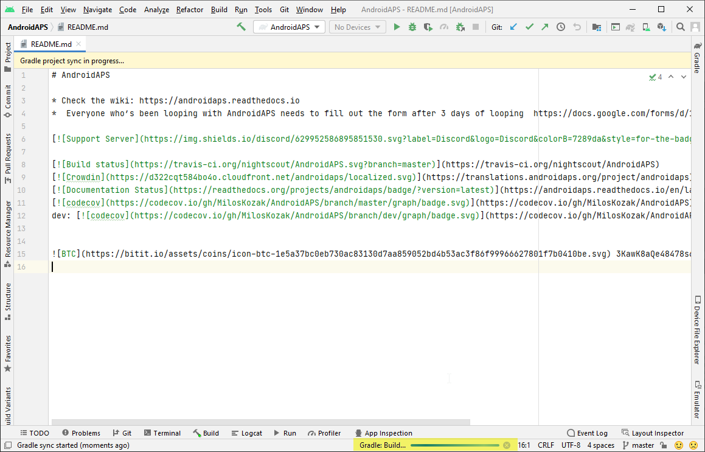

# Construire l'APK

## Construire vous-même au lieu de télécharger

**AndroidAPS n'est pas disponible en téléchargement en raison de la réglementation concernant les dispositifs médicaux. Il est légal de construire l'application pour votre usage personnel, mais vous ne devez en aucun cas donner une copie à d'autres personnes ! Voir la [page FAQ](../Getting-Started/FAQ.md) pour plus de détails.**

## Remarques importantes

* Utilisez **[Android Studio Version 2020.3.1](https://developer.android.com/studio/)** ou une version plus récente pour construire l'apk.
* [Windows 10 32-bit systems](troubleshooting_androidstudio-unable-to-start-daemon-process) are not supported by Android Studio 2020.3.1

(Building-APK-recommended-specification-of-computer-for-building-apk-file)=

## Configuration recommandée de l'ordinateur pour construire un fichier apk

<table class="tg">
  
<thead>
  <tr>
    <th class="tg-baqh">OS (seulement 64 bits)</th>
    <th class="tg-baqh">Windows 8 ou supérieur</th>
    <th class="tg-baqh">Mac OS 10.14 ou supérieur</th>
    <th class="tg-baqh">N'importe quel Linux prend en charge Gnome, KDE, ou Unity DE;&nbsp;&nbsp;GNU C Library 2.31 ou ultérieure</th>
  </tr>
</thead>
<tbody>
  <tr>
    <td class="tg-baqh"><p align="center">CPU (seulement 64 bits)</td>
    <td class="tg-baqh">architecture processeur x86_64 ; Core Intel de 2ème génération ou plus récente, ou processeur AMD prenant en charge un <br><a href="https://developer.android.com/studio/run/emulator-acceleration#vm-windows" target="_blank" rel="noopener noreferrer"><span style="text-decoration:var(--devsite-link-text-decoration,none)">Hypervisor Windows</span></a></td>
    <td class="tg-baqh">Intel Core de 2ème génération ou plus récente, ou processeur AMD prenant en charge un <br><a href="https://developer.android.com/studio/run/emulator-acceleration#vm-mac" target="_blank" rel="noopener noreferrer"><span style="text-decoration:var(--devsite-link-text-decoration,none)">Hypervisor.Framework</span></a></td>
    <td class="tg-baqh">architecture du processeur x86_64, Intel Core de 2ème génération ou plus récent ou processeur AMD avec support pour la virtualisation AMD (AMD-V) et SSSE3</td>
  </tr>
  <tr>
    <td class="tg-baqh"><p align="center">RAM</td>
    <td class="tg-baqh" colspan="3"><p align="center">8GB or more</td>
  </tr>
  <tr>
    <td class="tg-baqh"><p align="center">Disque</td>
    <td class="tg-baqh" colspan="3"><p align="center">Au moins 30 Go d'espace libre. Un SSD est recommandé.</td>
  </tr>
  <tr>
    <td class="tg-baqh"><p align="center">Résolution</td>
    <td class="tg-baqh" colspan="3"><p align="center">Minimum 1280 x 800 <br></td>
  </tr>
  <tr>
    <td class="tg-baqh"><p align="center">Internet</td>
    <td class="tg-baqh" colspan="3"><p align="center">Haut débit</td>
  </tr>
</tbody>
</table>

Please be in mind that both **64 bit CPU and 64 bit OS are mandatory condition.** If your system DOES NOT meet this condition, you have to change affected hardware or software or the whole system. **It is strongly recommended to use SSD (Solid State Disk) instead of HDD (Hard Disk Drive) because it will take less time when you are building the APS installation apk file.** Recommended is just recommended and it is not a mandatory. However, you may still use a HDD when you are building apk file but note that the building process can take a long time to complete, although once started, you can leave it running unattended.

* * *

### Cet article est divisé en deux parties.

* La partie "aperçu" indique les étapes nécessaires pour construire le fichier APK.
* Dans la partie "pas à pas", vous trouverez les captures d'écran d'une installation complète. Les versions d'Android Studio - l'environnement de développement logiciel que nous utiliserons pour construire l'APK - changent très rapidement. Les exemples ne seront donc pas identiques à votre installation, mais cela devrait vous donner un bon point de départ. Android Studio fonctionne sous Windows, Mac OS X et Linux et il peut y avoir de petites différences entre chaque plateforme. Si vous trouvez que quelque chose d'important qui est incorrect ou manquant, merci d'informer le groupe facebook "utilisateurs AndroidAPS" ou dans les chats Discord [Android APS ou AndroidAPSwiki](https://discord.gg/4fQUWHZ4Mw) afin que nous puissions y remédier.

## Aperçu

In general, the steps necessary to build the APK file:

1. [Installer Git](../Installing-AndroidAPS/git-install.md)
2. [Installer Android Studio](Building-APK-install-android-studio)
3. [Définir le chemin d’accès git dans Android Studio](Building-APK-set-git-path-in-preferences)
4. [Télécharger le code AndroidAPS](Building-APK-download-androidaps-code)
5. [Télécharger Android SDK](Building-APK-download-android-sdk)
6. [Build the app](Building-APK-generate-signed-apk) (generate signed apk)
7. [Transférer le fichier apk sur votre téléphone](Building-APK-transfer-apk-to-smartphone)
8. [Identifier le récepteur si vous utilisez xDrip+](xdrip-identify-receiver)

## Démarche pas à pas

Detailed description of the steps necessary to build the APK file.

## Installer git (si vous ne l'avez pas)

Follow the manual on the [git installation page](../Installing-AndroidAPS/git-install.md).

(Building-APK-install-android-studio)=

## Installer Android Studio

Les captures d'écran suivantes ont été prises à partir de Android Studio Version Arctic Fox | 2020.3.1. Les écrans peuvent changer dans les versions futures d'Android Studio. Mais vous devriez y arriver. Vous pouvez demande de [l'aide auprès de la commauté](../Where-To-Go-For-Help/Connect-with-other-users.md).

Une des choses les plus importantes lors de l'installation d'Android Studio : **Soyez patient !** Au cours de l'installation et de la configuration, Android Studio télécharge beaucoup de choses ce qui prendra du temps.

Téléchargez [Android Studio ici](https://developer.android.com/studio/install.html) et installez le sur votre ordinateur.

Au premier démarrage, vous trouverez l'assistant d'installation :

Sélectionnez "Do not import settings" car vous n'avez pas eu d'utilisation préalable.


Décidez si vous voulez partager les données avec Google ou non.


Dans l'écran suivant, cliquez sur "Next".


Sélectionnez l'installation "Standard" et cliquez sur "Next".


Sélectionnez le thème de l'interface utilisateur que vous souhaitez (dans ce manuel, nous avons utilisé "Light"). Cliquez ensuite sur "Next".

> ***Remarque :*** Ce n'est que le modèle de couleurs. Vous pouvez choisir n'importe quel type (par ex. "Darcula" pour le mode sombre). Cette sélection n'a aucune influence sur la construction de l'APK, mais les captures d'écran suivantes peuvent être différentes.


Cliquez sur "Finish" dans la boite de dialogue "Verify Settings".


Attendez qu'Android Studio télécharge des composants supplémentaires et soyez patient. Une fois que tout est téléchargé, le bouton "Finish" devient bleu. Cliquez sur le bouton maintenant.


(Building-APK-set-git-path-in-preferences)=

## Définir le chemin de git dans les préférences

Assurez-vous que [git est installé](../Installing-AndroidAPS/git-install.md) sur votre ordinateur et que vous avez redémarré votre ordinateur après l'installation.

Sur l'écran d'accueil d'Android Studio cliquez sur "Customize" (1) à gauche, puis sélectionnez le lien "All settings..." (2):


### Windows

* En tant qu'utilisateur de Windows, assurez-vous que vous avez redémarré votre ordinateur après [avoir installé Git](../Installing-AndroidAPS/git-install.md).

* Double-cliquez sur "Version Control" (1) pour ouvrir le sous-menu.

* Cliquez sur Git (2).
* Assurez-vous que la méthode de mise à jour "Merge" (3) est sélectionnée.
* Vérifiez si Android Studio peut localiser le chemin d'accès à git.exe automatiquement en cliquant sur le bouton "Test" (4).
    
    

* Si la configuration automatique est réussie, la version de git s'affiche sous chemin d'accès.
    
    

* Éventuellement git.exe peut ne pas être trouvé automatiquement ou le test entraînera une erreur (1) :
    
    
    
    Dans ce cas, cliquez sur l'icône de dossier (2).

* Utilisez la [fonction de recherche](https://www.tenforums.com/tutorials/94452-search-file-explorer-windows-10-a.html) dans l'explorateur windows pour trouver "git.exe" si vous n'êtes pas sûr de l'endroit ou il a été installé. Vous cherchez un fichier nommé "git.exe", situé dans le dossier **\bin**.

* Sélectionnez le chemin d'accès à git.exe et vérifiez que vous avez sélectionné le dossier ** \bin\ ** (3) et cliquez sur "OK" (4).
    
    

* Vérifiez à nouveau votre chemin d'accès git sélectionné avec le bouton "Test" comme décrit ci-dessus.

* Lorsque la version de git est affichée sous le chemin (voir la capture d'écran ci-dessus), fermez la fenêtre de configuration en cliquant sur le bouton "OK" (5).

### Mac

* N’importe quelle version de git devrait fonctionner. Par exemple <https://git-scm.com/download/mac>.
* Utilisez homebrew pour installer git: ```$ brew install git```.
* Pour plus de détails sur l'installation de git, voir la [documentation officielle](https://git-scm.com/book/en/v2/Getting-Started-Installing-Git).
* Si vous installez git via homebrew, il n'est pas nécessaire de modifier les préférences. Juste au cas où : on peut y accéder ici : Android Studio - Preferences.

(Building-APK-download-androidaps-code)=

## Télécharger le code AndroidAPS

* Sur l'écran d'accueil d'Android Studio, sélectionnez "Projects" (1) à gauche, puis "Get from VCS" (2).
    
    
    
    * Si vous avez déjà ouvert Android Studio et que vous ne voyez plus l'écran d'accueil, sélectionnez File (1.) > New (2.) > Project from Version Control ... (3)
        
        
    
    * Nous allons maintenant indiquer à Android Studio d'où recevoir le code :
    
    * Assurez-vous d'avoir sélectionné "Repository URL" sur la gauche (1).
    
    * Vérifier si "Git" est sélectionné comme contrôle de version (2).
    * Copiez et collez l'URL ```https://github.com/nightscout/AndroidAPS``` dans le dépôt principal d'AndroidAPS dans la zone de texte d'URL (3).
    * Choisissez le répertoire dans lequel vous voulez enregistrer le code cloné (4).
        
        

* Cliquez sur le bouton "Clone" (5).
    
    

* Ne cliquez pas sur "Background" pendant que le répertoire est cloné !

* Une fois que le dépôt a été cloné avec succès, Android Studio ouvrira le projet cloné.

* On vous demandera si vous voulez faire confiance au projet. Cliquez sur "Trust project" !
    
    

* Dans le coin inférieur droit, vous verrez l'information qu'Android Studio exécute les tâches d'arrière-plan.
    
    

* Accorder l'accès si votre pare-feu demande l'autorisation.
    
    

* Une fois que les tâches de fond sont terminées, vous verrez probablement une erreur indiquant que des erreurs se sont produites (1) ou (2) ou (3).
    
    
    
    Ne vous inquiétez pas, cela sera bientôt résolu!

(Building-APK-download-android-sdk)=

## Télécharger Android SDK

* Dans le menu, allez dans "File" (1) > "Settings" (2).
    
    

* Double-cliquez sur "Appearance & Behaviour" pour ouvrir son sous-menu (1).

* Double-cliquez sur "System Settings" (2) et sélectionnez "Android SDK" (3).
* Cochez la case à gauche de "Android 9.0 (Pie)" (4.) (API niveau 28).
    
    

* Confirmez les modifications en cliquant sur OK.
    
    

* Acceptez le contrat de licence (1) et cliquez sur « Next» (2).
    
    

* Attendez que le téléchargement et l'installation du SDK soient terminés.
    
    

* Lorsque l'installation du SDK est terminée, le bouton "Finish" devient bleu. Cliquez sur ce bouton.
    
    

* Android Studio recommande de mettre à jour le "gradle system". **Ne jamais mettre à jour gradle !** Cela pourrait entraîner des difficultés !

* Si vous voyez une information sur le côté inférieur droit de votre fenêtre Android Studio qui indique que le plugin Android Gradle est prêt à mettre à jour, cliquez sur le texte "update" (1).
    
    

* Dans la boîte de dialogue sélectionnez "Don't remind me again for this project" (2).
    
    

* Redémarrez Android Studio avant de continuer.

(Building-APK-generate-signed-apk)=

## Générer un APK signé

Signer signifie que vous signez votre application générée mais d'une façon numérique comme une sorte d'empreinte digitale intégrée dans l'application elle-même. C'est nécessaire car Android a une règle qui impose de n'accepter que du code signé pour des raisons de sécurité. Pour plus d'informations sur ce sujet, suivez [ce lien](https://developer.android.com/studio/publish/app-signing.html#generate-key).

* Après le démarrage d'Android Studio, attendez que toutes les tâches en arrière-plan soient terminées.
    
    
    
    * ***Avertissement :*** Si des erreurs se produisent, ne continuez pas avec les étapes suivantes. \ Consulter la [section dépannage](../Installing-AndroidAPS/troubleshooting_androidstudio) pour les problèmes connus !
    
    

* Click "Build" (1) in the menu bar and select "Generate Signed Bundle / APK..." (2).
    
    

* Select "APK" (1) instead of "Android App Bundle" and click "Next" (2).
    
    

* Make sure that module is set to "AndroidAPS.app" (1).

* Click "Create new..." (2) to start creating your key store.
    
    ***Note:*** A key store in this case is nothing more than a file in which the information for signing is stored. Il est crypté et les informations sont sécurisées avec des mots de passe.
    
    

* Click the folder symbol to select a path on your computer for your key store.
    
    

* Sélectionnez le répertoire dans lequel votre fichier de clés doit être sauvé (1).
    
    
    
    ***Warning: Do not save in same folder as project. Vous devez utiliser un dossier différent !*** Un bon emplacement peut être votre répertoire d'accueil.

* Type a file name for your key store (2) and confirm with "OK" (3).

* Entrez (2) et confirmez (3) le mot de passe de votre fichier de clés.
    
    ***Note:*** Passwords for key store and key do not have to be very sophisticated. Assurez vous de bien vous en souvenir ou notez le dans un endroit sûr. In case you will not remember your passwords in the future, see [troubleshooting for lost key store](troubleshooting_androidstudio-lost-keystore).

* Enter an alias (4) for your key. Choose whatever you like.

* Enter (5) and confirm (6) the password for your key

* Validity (7) is 25 years by default. Vous n'avez pas à modifier la valeur par défaut.

* Le prénom et le nom sont obligatoires (8). Toutes les autres informations sont facultatives.

* Click "OK" (9) when you are done.

* Assurez-vous que la case permettant de mémoriser les mots de passe est cochée (1). Ainsi vous n'aurez pas à les saisir à nouveau la prochaine fois que vous génèrerez le fichier apk (par ex. en faisant une mise à jour avec une nouvelle version d'AndroidAPS).

* Cliquez sur "Next" (2).
    
    

* Select build variant "fullRelease" (1) and press "Finish".
    
    

* Android Studio will show "Gradle Build running" at the bottom. This takes some time, depending on your computer and internet connection. **Be patient!**
    
    

* Android Studio will display the information "Generate Signed APK" after build is finished.
    
    

* Dans le cas ou la génération n'a pas réussie, référez vous à la [section dépannage](../Installing-AndroidAPS/troubleshooting_androidstudio).

* Click on the notification to expand it.

* Click on the link "locate".
    
    
    
    * Si la notification est supprimée, vous pouvez toujours ouvrir le "Journal des événements" et sélectionner le même lien ici.

* Your file manager/explorer will open. Navigate to the directory "full" (1) > "release" (2).
    
    

* "app-full-release.apk" (3) is the file you are looking for!

(Building-APK-transfer-apk-to-smartphone)=

## Transférer le fichier APK sur le smartphone

La façon la plus facile de transférer le fichier app-full-release.apk dans votre téléphone est via [un câble USB ou Google Drive](https://support.google.com/android/answer/9064445?hl=en). Veuilez noter que le transfert par email peut entraîner des difficultés et n'est pas la méthode conseillée.

Sur votre téléphone, vous devez autoriser l'installation à partir de sources inconnues. Les explications peuvent être trouvées sur internet (par ex. [ici](https://www.expressvpn.com/de/support/vpn-setup/enable-apk-installs-android/) ou [ici](https://www.androidcentral.com/unknown-sources)).

## Résolution de problèmes

Voir la page spécifique [dépannage Android Studio](../Installing-AndroidAPS/troubleshooting_androidstudio).