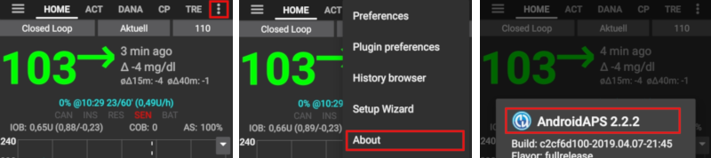

# Mise à jour vers une nouvelle version ou une branche

## Construire vous-même au lieu de télécharger

**AndroidAPS n'est pas disponible en téléchargement en raison de la réglementation concernant les dispositifs médicaux. Il est légal de construire l'application pour votre usage personnel, mais vous ne devez en aucun cas donner une copie à d'autres personnes ! Voir la [page FAQ](../Getting-Started/FAQ.md) pour plus de détails.**

## Remarques importantes

* Veuillez mettre à jour dès que possible quand une nouvelle version est disponible. Vous recevrez une [information dans la page d'accueil AndroidAPS](../Installing-AndroidAPS/Releasenotes#notes-de-version) à propos de la nouvelle version.
* À partir de la version 2.3, vous devez utiliser git pour la mise à jour. La mise à jour via le fichier zip ne fonctionne plus.
* Utilisez [Android Studio Version 4.0.1](https://developer.android.com/studio/) ou une version plus récente pour construire l'apk.
* [Les systèmes d'exploitation Windows 10 32 bits](../Installing-AndroidAPS/troubleshooting_androidstudio#unable-to-start-daemon-process) ne sont pas pris en charge par Android Studio 4.0.1.
* Si vous utilisez xDrip+ assurez vous de bien renseigner [identify receiver](../Configuration/xdrip.html#identifier-le-recepteur).
* Si vous utilisez Dexcom G6 avec l'application [Dexcom patchée](../Hardware/DexcomG6#if-using-g6-with-patched-dexcom-app), vous aurez besoin de la version du [dossier 2.4](https://github.com/dexcomapp/dexcomapp/tree/master/2.4).

## Accès rapide aux utilisateurs expérimentés

Veuillez sauter ce paragraphe si vous mettez à jour AAPS pour la première fois. L'accès rapide est destiné aux utilisateurs expérimentés. Votre étape suivante serait [d'installer git](../Installing-AndroidAPS/git-install.rst) si vous ne l'avez pas déjà.

Si vous avez déjà mis à jour AAPS dans les versions précédentes et que vous utilisez un PC, vous pouvez faire une mise à jour en quatre étapes simples :

1. [Exportez vos paramètres](../Usage/ExportImportSettings.html#comment-exporter-les-parametres) à partir de la version AAPS existante sur votre téléphone pour être à jour côté sauvegardes
2. [Mettez à jour la copie locale](../Installing-AndroidAPS/Update-to-new-version.html#mettez-a-jour-votre-copie-locale) (VCS -> Git -> Pull)
3. [Générez un APK signé](../Installing-AndroidAPS/Update-to-new-version.html#generer-un-apk-signe) (Sélectionnez 'app' au lieu de 'wear' au passage !)
4. En fonction de votre [source de glycémie](../Configuration/BG-Source.rst) vérifiez bien [identify receiver](../Configuration/xdrip.html#identifier-le-recepteur) dans xDrip+ ou utilisez l'application Dexcom patchée à partir du [dossier 2.4](https://github.com/dexcomapp/dexcomapp/tree/master/2.4).

## Installer git (si vous ne l'avez pas)

Suivez le manuel sur la [page d'installation de git](../Installing-AndroidAPS/git-install.rst).

## Mettez à jour votre copie locale

* Cliquez sur : VCS -> Git -> Pull
    
    

* Cliquez sur Pull (pas de changements dans la boîte de dialogue)
    
    

* Attendez tant que le téléchargement est en cours.
    
    

* Quand ce sera fini Android Studio vous informera que "tous les fichiers sont à jour".
    
    

## Générer un APK signé

<!--- Text is maintained in page building-apk.md --->

* Cliquez sur "Build" dans la barre de menus et sélectionnez "Generate Signed Bundle / APK ...".

* Sélectionnez "APK" (1.) au lieu de "Android App Bundle" et cliquez sur "Suivant" (2.).

* Assurez-vous que le module est défini sur "app".
* Sélectionnez le chemin de votre fichier de clés en cliquant sur "Choose existing...".
* Entrez vos mots de passe pour le fichier de clés et la clé.
* Si la case "Remember passwords" est cochée, vous n'avez pas à les saisir à chaque fois. Si la case n'a pas été cochée lors du dernière génération ("Build") et que vous ne vous souvenez pas des mots de passe, veuillez vous référer à la [section dépannage](../Installing-AndroidAPS/troubleshooting_androidstudio#certificats-perdus).
* Cliquez sur "Next".

* Sélectionnez la variante "fullRelease" (1.). 
* Cochez les cases V1 et V2 pour les versions de signature (2.).
* Cliquez sur "Finish". (3.)

* Android Studio affiche l'information "APK(s) generated successfully..." quand la génération est terminée.
* Dans le cas ou la génération n'a pas réussie, référez vous à la [section dépannage](../Installing-AndroidAPS/troubleshooting_androidstudio.rst).
* La façon la plus facile de trouver l'apk est de cliquer sur "Event log".

* Dans la section "event log" cliquez sur "locate".

* Le fichier que vous cherchez est "app-full-release.apk".

## Transférer le fichier APK sur le smartphone

La façon la plus facile de transférer le fichier app-full-release.apk dans votre téléphone est via [un câble USB ou Google Drive](https://support.google.com/android/answer/9064445?hl=fr). Veuilez noter que le transfert par email peut entraîner des difficultés et n'est pas la méthode conseillée.

Sur votre téléphone, vous devez autoriser l'installation à partir de sources inconnues. Les explications peuvent être trouvées sur internet (par ex. [ici](https://www.expressvpn.com/de/support/vpn-setup/enable-apk-installs-android/) ou [ici](https://www.androidcentral.com/unknown-sources)).

## Vérifier la version d'AAPS sur le téléphone

Vous pouvez vérifier la version AAPS sur votre téléphone en cliquant sur le menu 3 points en haut à droite puis sur "à propos".

## Dépannage

Voir la page spécifique [dépannage Android Studio](../Installing-AndroidAPS/troubleshooting_androidstudio.rst).