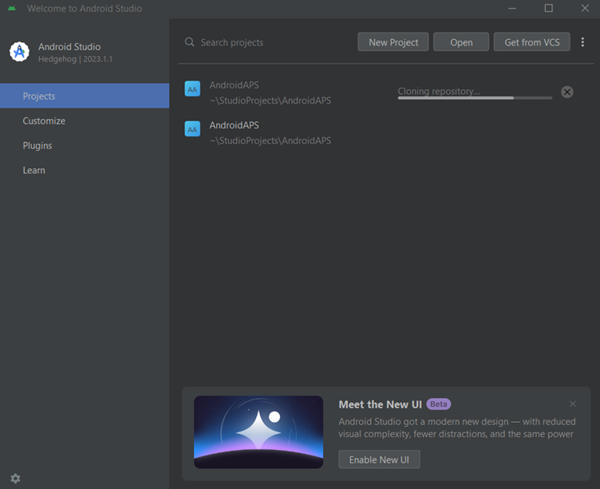
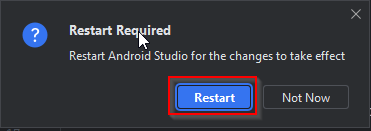
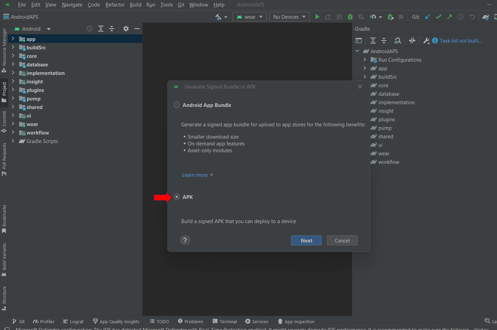

# Compilation d'AAPS

## Construire vous-même au lieu de télécharger

**L'application AAPS (le fichier apk) n'est pas disponible en téléchargement, en raison de la réglementation concernant les dispositifs médicaux. Il est légal de compiler l'application pour votre usage personnel, mais vous ne devez en aucun cas en donner une copie à quelqu'un d'autre !**

Voir la [page FAQ](../Getting-Started/FAQ.md) pour plus de détails.

(Building-APK-recommended-specification-of-computer-for-building-apk-file)=

## Prérequis matériels et logiciels pour la compilation de AAPS

- Please use the **[Android Studio version called at least Hedgehog or one more recent like Iguana, Jellyfish, and Koala](https://developer.android.com/studio/)** to build the apk. <u>**Do not use the Ladybug version.**</u> Older versions of Android Studio need to be updated first!
- Les systèmes [Windows 32-bit systems](troubleshooting_androidstudio-unable-to-start-daemon-process) ne sont pas pris en charge par Android Studio. Veuillez garder à l'esprit qu'à la fois **le processeur (CPU 64 bits) et le système d'exploitation 64 bits sont des conditions obligatoires**. Si votre système NE satisfait PAS à cette condition, vous devez changer le matériel ou le système d'exploitation qui pose problème, ou tout le système.

<table class="tg">
<thead>
  <tr>
    <th class="tg-baqh">OS (seulement 64 bits)</th>
    <th class="tg-baqh">Windows 8 ou supérieur</th>
    <th class="tg-baqh">Mac OS 10.14 ou supérieur</th>
    <th class="tg-baqh">N'importe quel Linux prend en charge Gnome, KDE, ou Unity DE;&nbsp;&nbsp;GNU C Library 2.31 ou ultérieure</th>
  </tr>
</thead>
<tbody>
  <tr>
    <td class="tg-baqh"><p align="center">CPU (seulement 64 bits)</td>
    <td class="tg-baqh">architecture processeur x86_64 ; Core Intel de 2ème génération ou plus récente, ou processeur AMD prenant en charge un <br><a href="https://developer.android.com/studio/run/emulator-acceleration#vm-windows" target="_blank" rel="noopener noreferrer"><span style="text-decoration:var(--devsite-link-text-decoration,none)">Hypervisor Windows</span></a></td>
    <td class="tg-baqh">Intel Core de 2ème génération ou plus récente, ou processeur AMD prenant en charge un <br><a href="https://developer.android.com/studio/run/emulator-acceleration#vm-mac" target="_blank" rel="noopener noreferrer"><span style="text-decoration:var(--devsite-link-text-decoration,none)">Hypervisor.Framework</span></a></td>
    <td class="tg-baqh">architecture du processeur x86_64, Intel Core de 2ème génération ou plus récent ou processeur AMD avec support pour la virtualisation AMD (AMD-V) et SSSE3</td>
  </tr>
  <tr>
    <td class="tg-baqh"><p align="center">RAM</td>
    <td class="tg-baqh" colspan="3"><p align="center">8GB or more</td>
  </tr>
  <tr>
    <td class="tg-baqh"><p align="center">Disque</td>
    <td class="tg-baqh" colspan="3"><p align="center">Au moins 30 Go d'espace libre. Un SSD est recommandé.</td>
  </tr>
  <tr>
    <td class="tg-baqh"><p align="center">Résolution</td>
    <td class="tg-baqh" colspan="3"><p align="center">Minimum 1280 x 800 <br></td>
  </tr>
  <tr>
    <td class="tg-baqh"><p align="center">Internet</td>
    <td class="tg-baqh" colspan="3"><p align="center">Haut débit</td>
  </tr>
</tbody>
</table>

**Il est fortement recommandé (non obligatoire) d'utiliser un disque dur SSD au lieu d'un HDD car cela prendra moins de temps lorsque vous compilerez le fichier apk de AAPS.**  Vous pouvez malgré tout utiliser un disque HDD lorsque vous compilez le fichier apk de **AAPS**. Si vous le faites, le processus de compilation peut prendre beaucoup de temps avant de se terminer, mais une fois lancé, vous pouvez le laisser tourner sans surveillance.

## Aide et support pour le processus de compilation

Si vous rencontrez des difficultés dans le processus de compilation de l'application **AAPS**, il existe une page dédiée au [**dépannage d'Android Studio**](../Installing-AndroidAPS/troubleshooting_androidstudio), veuillez la consulter en premier lieu.

Si vous pensez que quelque chose est incorrect, manquant ou confus dans les instructions de compilations, ou si vous avez encore des difficultés, n'hésitez pas à contacter d'autres utilisateurs **AAPS** sur [Facebook](https://www.facebook.com/groups/AndroidAPSUsers) ou [Discord](https://discord.gg/4fQUWHZ4Mw). Si vous voulez changer quelque chose vous-même (mettre à jour les captures d'écran _etc_), veuillez soumettre un [pull request (PR)](../make-a-PR.md).

## Guide pas à pas pour compiler l'application AAPS

```{admonition} WARNING
:class: warning
If you have built AAPS before, you don't need to take all the following steps again.
Please jump directly to the [update guide](../Installing-AndroidAPS/Update-to-new-version)!
```

Les grandes étapes pour construire le fichier apk **AAPS** sont les suivantes :

4.1 [Installer Git](Install-Git)

4.2 [Installer Android Studio](Building-APK-install-android-studio)

4.3 [Télécharger le code source AAPS](Building-APK-download-AAPS-code)

4.4. [Définir le chemin Git dans les préférences d'Android Studio](Building-APK-set-git-path-in-preferences)

4.5. [Compiler l'APK AAPS signé](Building-APK-generate-signed-apk)

Dans ce guide, vous trouverez des captures d'écran de la compilation du fichier apk de **AAPS** à titre d'_exemple_. Étant donné que  **Android Studio** - le logiciel que nous utilisons pour compiler l'apk **AAPS** - est régulièrement mis à jour, ces captures d'écran peuvent ne pas être identiques à votre installation, mais vous devriez toujours arriver à les suivre.

Puisque **Android Studio** fonctionne sous Windows, Mac OS X et Linux, il peut également y avoir de légères différences dans les étapes en fonction de la plate-forme.
Veuillez noter qu'**Android Studio** n'est pas disponible en français, toutes les instructions relatives au logiciel seront données en anglais et français.

(Install-Git)=

### Installer Git (si ce n'est déjà fait)

```{admonition} Why Git? 
:class: dropdown

Git is known as a “_Versioning Control System_” (VCS).\
Git is a program that allows you to track changes in code and to collaborate with others. You will use Git to make a copy of the **AAPS** source code from the GitHub website to your local computer. Then, you will use Git on your computer to build the **AAPS** application (apk). 
```

#### Étapes pour l'installation de Git

1. Vérifiez que vous n'avez pas déjà installé **Git**. Pour cela, tapez "git" dans la barre de recherche de Windows : si vous voyez **"Git bash"** ou **Git-autre chose**, c'est qu'il est déjà installé. Dans ce cas, vous pouvez passer directement à [l'installation d'Android Studio](Building-APK-install-android-studio) :


2. Si Git n'est pas installé, téléchargez et installez la dernière version pour votre système à partir de [**ce lien**](https://git-scm.com/downloads). N'importe quelle version récente de Git devrait fonctionner, sélectionnez la version correspondant à votre système d'exploitation : Mac, Windows ou Linux.

**Note pour les utilisateurs de Mac :** la page Web de Git vous proposera également d'installer un programme supplémentaire appelé "homebrew" pour faciliter l'installation. Si vous installez Git via homebrew, vous n'avez pas besoin de modifier la configuration.

(Make_a_note_of_Git_path)=

- Pendant l'installation, lorsque vous êtes invité à "sélectionner l'emplacement de destination", notez _où_ Git va s'installer (le "**chemin d'installation**"), vous en aurez besoin plus tard. Ca devrait ressembler à "C:\Program Files\Git\cmd\git.exe"

- Au fur et à mesure que vous avancez sur les différentes étapes de l'installation de Git, validez simplement en gardant les options par défaut.

- Après l'installation, si vous avez oublié de noter l'endroit où Git a été installé, vous pouvez le trouver comme suit : tapez "git" dans la barre de recherche du PC, cliquez avec le bouton droit sur "Git bash", sélectionnez "Ouvrir l'emplacement du fichier", survolez l'icône "Git bash" avec votre souris, ce qui vous indiquera alors où il est installé.

- Redémarrez votre ordinateur avant de continuer.

(Building-APK-install-android-studio)=

### Installer Android Studio

- \*\*Vous devez rester connecté à internet pour les prochaines étapes, étant donné qu'Android Studio va télécharger différentes mises à jour \*\*

```{admonition} What is Android Studio?
:class: dropdown
Android Studio is a program which runs on your computer. It allows you to download source code from the internet (using Git) and build smartphone (and smartwatch) apps. You cannot "break" a current, looping version of **AAPS** which you might have running on a smartphone by building a new or updated app on your PC with Android Studio, these are totally separate processes. 
```

The following screenshots have been taken from Android Studio Version **Hedgehog**, they should be identical with more recent versions.

Une des choses les plus importantes lors de l'installation d'Android Studio : **Soyez patient(e)** ! Lors du processus d'installation et de configuration, Android Studio télécharge beaucoup de choses, ce qui prendra du temps.

**Download a supported version of Android Studio (Hedgehog, Iguana, Jellyfish or Koala - not Ladybug)** from [**here**](https://developer.android.com/studio/archive), locate it in your browser downloads folder, and install it on your computer:


Lorsque vous lancez Android Studio pour la première fois, vous serez accueilli(e) comme ceci :


Cliquez "Next/Suivant" :


Laissez les cases cochées et cliquez "Next/Suivant" :


Validez l'installation à l'emplacement suggéré par défaut, et cliquez "Next/Suivant":


Lorsqu'on vous demande de choisir le dossier du menu Démarrer, cliquez simplement "Install/Installer". Patientez maintenant quelques minutes pendant l'installation d'Android Studio. Vous devriez ensuite voir que l'installation est terminée, sélectionnez "Next/Suivant" :


Cliquez maintenant "Finish/Terminer" :


Android Studio va maintenant se lancer.

Si on vous demande si vous voulez importer les paramètres, sélectionnez "Do not import settings/Ne pas importer les paramètres". Nous ne voulons pas importer de paramètres d'une installation précédente :


Décidez si vous voulez partager des données avec Google ou non (si vous n'êtes pas sûr, cliquez simplement "Don't send/Ne pas envoyer").


Vous allez maintenant recevoir un message concernant un kit de développement logiciel (SDK) manquant (ne vous inquiétez pas, cela sera bientôt résolu), cliquez "Suivant" :


Le logiciel devrait sélectionner automatiquement le SDK requis et choisir un emplacement.

```{admonition} What is an Android SDK?
:class: dropdown

In order to run **AAPS** on the phone the application needs to integrate with Android itself. Android provides “_software development kits_” (SDK) which allow apps like **AAPS** to interface with an Android operating system.
```

Le package de la plateforme SDK n'a **pas** de rapport avec la version d'Android installée sur votre téléphone, mais avec la compilation d'**AAPS**. La version 3.2 de **AAPS** (et suivantes) utilise l'API version 34, qui est celle automatiquement sélectionnée dans la version **Hedgehog** de **Android Studio**. Par conséquent, il vous suffit de cliquer sur "Next/Suivant":


Lorsqu'on vous demande de vérifier les paramètres (Verify settings), cliquez simplement sur "Next/Suivant":


Lorsque vous êtes invité.e à accepter le Contrat de Licence (License Agreement), sélectionnez "Accept/Accepter" puis cliquez sur "Finish/Terminer" :


> **_Remarque :_** Selon votre configuration, les licences à accepter peuvent différer de ce qui est affiché dans la capture d'écran.

Patientez pendant qu'Android Studio télécharge les composants supplémentaires, cela peut prendre quelques minutes :


Une fois que tout est téléchargé, le bouton "Finish/Terminer" devient bleu et vous pouvez cliquer dessus :


Vous êtes maintenant accueilli.e avec l'écran "Welcome to Android Studio/Bienvenue dans Android Studio".


(Building-APK-download-AAPS-code)=

### Télécharger le code source AAPS

```{admonition} Why can it take a long time to download the AAPS code?
:class: dropdown

The first time **AAPS** is downloaded, Android Studio will connect over the internet to the Github website to download the source code for **AAPS**. This should take about 1 minute. 

Android Studio will then use **Gradle** (a development tool in  Android studio) to identify other components needed to install these items on your computer. 

```

Sur l'écran d'accueil d'Android Studio, vérifiez que "**Projects/Projets**" (1) est en surbrillance sur la gauche. Ensuite, cliquez sur "**Get from VCS/Obtenir depuis VCS**" (2) sur la droite :


- Nous allons maintenant indiquer à Android Studio où aller chercher le code :

- "Repository URL/URL du dépôt" devrait être sélectionné (par défaut) à gauche (1).

- "Git" devrait être sélectionné (par défaut) comme système de contrôle de version (2).

Copiez maintenant cette URL :

```
https://github.com/nightscout/AndroidAPS.git
```

et collez-la dans la zone de texte de l'URL (3).

- Vérifiez que le répertoire (par défaut) où enregistrer le code cloné est sensé (4).

```{admonition} INFORMATION
:class: information
Make a note of the directory. It is where your sourcecode is stored!
```

- Cliquez sur le bouton "Clone" (5).


Vous allez alors voir un écran vous indiquant que le dépôt est en train d'être cloné (cloning repository) :



A un moment, on vous demandera si vous voulez faire confiance au projet (Trust and Open Project). Cliquez sur "Trust project/Faire confiance au projet" :


Pour les utilisateurs de Windows : Si votre pare-feu demande la permission, autorisez l'accès :


Une fois le dépôt cloné avec succès, Android Studio ouvrira le projet en question.

Cliquez sur l'engrenage en haut à droite et sélectionnez "**Switch to Classic UI.../Passer à l'interface classique...**" pour revenir à la vue utilisée dans cette documentation.

Si vous ne voyez pas cet engrenage, ne vous inquiétez pas. Vous utilisez déjà l'interface classique !


Redémarrez Android Studio pour que les modifications prennent effet.



Vous pourriez recevoir un ou les deux avertissements suivants à propos de processus en cours d'exécution. Vous pouvez les interrompre sans problème !

 

Lorsque Android Studio se relance, attendez patiemment (cela peut prendre quelques minutes), et surtout, **ne mettez pas** à jour le projet comme proposé dans la notification.


```{admonition} NEVER UPDATE GRADLE!
:class: warning

Android Studio might recommend updating the gradle system. **Never update gradle!** This will lead to difficulties.
```

_Optionnel_ - Si vous souhaitez faire disparaître la notification **"project update recommended/mise à jour du projet recommandée"**, cliquez sur le texte bleu "More/Plus" (1). Dans la boîte de dialogue sélectionnez "Don't ask for this project/Ne plus me demander pour ce projet" (2).


Pour les utilisateurs de Windows :
Si vous n'avez pas encore redémarré votre ordinateur depuis l'installation ou la mise à jour de Git, quittez maintenant Android Studio. Ensuite, redémarrez votre ordinateur et rouvrez Android Studio.

(Building-APK-set-git-path-in-preferences)=

### Définir le chemin d’accès git dans Android Studio

Maintenant, nous allons dire à Android Studio où trouver Git, tel que vous l'avez installé [juste avant](Install-Git).

- Pour les utilisateurs de Windows : assurez-vous que vous avez redémarré votre ordinateur après avoir [installé Git](Install-Git).
- Ouvrez **Android Studio** (vous pouvez le retrouver en faisant une recherche dans le menu Démarrer).
- Dans le coin supérieur gauche de **Android Studio**, ouvrez les préférences via le menu _File > Settings_ (Windows) ou _Android Studio > Préférences_ (Mac). La fenêtre suivante s'ouvre, cliquez pour développer le menu déroulant appelé "Version Control/Contrôle de Version" (1) :


- Cliquez sur "**Git**" (2).
- Dans le milieu bas de la page, assurez-vous que la _méthode de mise à jour_ est sur _Fusionner_ : Update Method = Merge (3).
- Vérifiez si Android Studio peut trouver le chemin d'accès à **git.exe**\* automatiquement en cliquant sur le bouton "Test" (4) :


- Si la détection automatique réussit, la version de **Git** s'affiche sous chemin d'accès.

  

- Si jamais **git.exe** n'est pas trouvé automatiquement, ou que le clic sur "Test" déclenche une erreur (1), vous pouvez soit entrer manuellement le chemin que vous avez enregistré [plus tôt](Make_a_note_of_Git_path), soit cliquer sur l'icône de dossier (2) et naviguer jusqu'au répertoire où vous avez installé **git.exe** :

  

- Utilisez la [fonction de recherche](https://www.tenforums.com/tutorials/94452-search-file-explorer-windows-10-a.html) dans l'explorateur Windows pour retrouver "git.exe" si vous n'êtes pas sûr de l'endroit où il a été installé. La procédure pour cela est expliquée de manière plus détaillée [ci-dessus](Make_a_note_of_Git_path).

- Si vous avez défini le chemin vous-même, vérifiez que c'est correct avec le bouton "Test" comme décrit ci-dessus.

Quand la version Git s'affiche en dessous du chemin (voir capture d'écran ci-dessus), vous avez terminé cette étape et vous pouvez fermer la fenêtre des "Settings/Paramètres" d'Android Studio en cliquant sur "**OK**" (5) :


(Building-APK-generate-signed-apk)=

### Compilez l'APK AAPS signé

```{admonition} Why does the AAPS app need to be "signed"?
:class: dropdown

Android requires each app to be _signed_, to ensure that it can only be updated later from the same trusted source that released the original app. For more information on this topic, follow [this link](https://developer.android.com/studio/publish/app-signing.html#generate-key). For our purposes, this just means that we generate a signing or "keystore" file and use it when we build the **AAPS** app.
```

- Ouvrez le menu "Build/Compiler" (1) puis "Generate Signed Bundle / APK - Générer un paquet / une APK signés" (2)


- Sélectionnez "APK" au lieu de "Android App Bundle" et cliquez sur "Next" :



- Sur l'écran suivant, vérifiez que le "Module" sélectionné est bien "AAPS.app" (1).

(Building-APK-wearapk)=

```{admonition} INFORMATION!
:class: information
Si vous souhaitez créer l'APK pour votre montre, sélectionnez alors AAPS.wear !
```

- Cliquez sur "Create new.../Créer nouveau..." (2) pour commencer la création de votre fichier de clés.

```{admonition} INFORMATION!
:class: information
You will only need to create the keystore once.
If you have build AAPS before, do NOT create a new keystore but select your existing one!
```

**_Note:_** Le fichier de clés contient les informations nécessaires pour signer l'application. Il est crypté et les informations sont sécurisées avec un mot de passe.


- Cliquez sur l'icône "dossier" (1) pour sélectionner l'endroit sur votre ordinateur où vous allez conserver votre fichier de clés :


- Cliquez sur le menu déroulant (1) pour sélectionner l'endroit où vous souhaitez enregistrer votre fichier de clés. Dans cet exemple, il est enregistré dans "Mes documents" (2). Ne sauvegardez pas le fichier de clés dans le même dossier que vos fichiers Android Studio (StudioProject). Utilisez un nom de fichier simple pour votre fichier de clés (2) et confirmez avec "OK" (3) :


Cela vous ramènera à l'écran précédent. L'emplacement choisi pour enregistrer le fichier de clés est affiché.

```{admonition} WARNING!
:class: warning
Make sure to note down for yourself where your keystore is stored. You will need it when you build the next AndroidAPS update!
```

Maintenant choisissez un mot de passe simple (et conservez-le bien), saisissez-le dans le champ "Password/Mot de passe" (1) et confirmez-le (2).  Les mots de passe du fichier de clés et de la clé n'ont pas besoin d'être très complexes. Si jamais vous perdez votre mot de passe, consultez la page Dépannage : [Fichier de clés perdu](troubleshooting_androidstudio-lost-keystore).

L'alias par défaut (3) de votre clé est "key0", laissez-le tel quel.

Il vous faut maintenant un mot de passe pour la clé. Pour simplifier, vous pouvez si vous le souhaitez, utiliser le même mot de passe que pour le fichier de clés au-dessus. Entrez le mot de passe (4) et confirmez-le (5).

```{admonition} WARNING!
:class: warning
Note down these passwords! You will need them when you build the next AAPS update!
```

La validité (6) par défaut est de 25 ans, laissez-la telle quelle.

Entrez vos nom et prénom (7). Laissez les autres champs vides.

Cliquez sur "OK" (8) pour continuer :


Sur la page "Generate signed bundle or APK / Générer un paquet ou un APK signé", le chemin de votre fichier de clés est désormais affiché. Ré-entrez le mot de passe du fichier de clés (1) et le mot de passe de la clé (2). Cochez la case pour se souvenir des mots de passe "Remember passwords" (3), pour ne pas avoir à les ressaisir la prochaine fois que vous construisez l'APK (c'est-à-dire lorsque vous mettrez à jour vers une nouvelle version d'AAPS). Cliquez sur "Next/Suivant" (4):


Sur l'écran suivant, sélectionnez la variante de build Build Variant "fullRelease" (1) et cliquez sur "Create/Créer" (2).


Android Studio va maintenant compiler l'APK **AAPS**. Vous verrez "Gradle Build running/Compilation Gradle en cours" en bas à droite. Le processus prend du temps, en fonction de votre ordinateur et de votre connexion internet, **soyez patient(e) !** Si vous voulez suivre la progression de la construction, cliquez sur l'icône de petit marteau "Build" en bas d'Android Studio :


Vous pouvez maintenant voir la compilation en cours :


Le message "BUILD SUCCESSFUL / COMPILATION RÉUSSIE" s'affiche quand la génération est terminée. Vous verrez peut-être une notification sur laquelle vous pouvez cliquer "locate/localiser". Si vous la ratez, cliquez sur la notification "locate or analyse the APK/trouver ou analyser l'APK" (surlignée en jaune) en bas de l'écran pour faire apparaître les notifications :


_Si la compilation a échoué, reportez-vous au [sous-chapitre Dépannage](../Installing-AndroidAPS/troubleshooting_androidstudio)._

Dans la fenêtre des notifications, cliquez sur le lien bleu "locate/trouver" :


Votre gestionnaire de fichiers/explorateur va s'ouvrir. Naviguez vers le répertoire "full" (1) > "release" (2).


Ouvrez le dossier "release". Le fichier "app-full-release.apk" (1) est l'APK **AAPS** que vous venez de compiler, vous transférerez ce fichier sur votre smartphone dans la prochaine page de la documentation :


Félicitations ! Maintenant que vous avez compilé le fichier APK **AAPS**, vous pouvez passer à l'étape suivante de [Transfert et Installation d'**AAPS**](Transferring-and-installing-AAPS.md).
