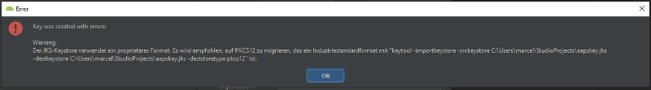

(troubleshooting_androidstudio-troubleshooting-android-studio)=
# Dépannage d'Android Studio

(troubleshooting_androidstudio-lost-keystore)=
## Fichier de clés perdu
If you use the same keystore when updating AndroidAPS you do not have to uninstall the previous version on your smartphone. That's why it is recommended to store the keystore in a save place.

If you try to install the apk, signed with a different keystore than before, you will get an error message that the installation failed!

In case you cannot find your old keystore or its password anymore, proceed as follows:

1. [Export settings](ExportImportSettings-export-settings) on your phone.
2. Copiez le fichier de configuration de votre téléphone vers un emplacement externe (par ex. votre ordinateur, un service cloud...).
4. Generate signed apk of new version as described on the [Update guide](../Installing-AndroidAPS/Update-to-new-version.md) and transfer it to your phone.
5. Désinstaller la précédente version de AAPS sur votre téléphone.
6. Installez la nouvelle version de AAPS sur votre téléphone.
7. [Import settings](ExportImportSettings-import-settings) to restore your objectives and configuration.
8. Vérifiez vos options d'optimisation de la batterie et désactivez-les à nouveau.

   Si vous ne pouvez pas les trouver sur votre téléphone, copiez les depuis le stockage externe vers votre téléphone.
8. Continuez à boucler.

## Gradle Sync en échec
Gradle Sync can fail to various reasons. Wen you get a message saying that gradle sync failed, open the "Build" tab (1) at the bottom of Android Studio and check what error message (2) is displayed.

  

These are the usual gradle sync failures:
* [Uncommitted changes](troubleshooting_androidstudio-uncommitted-changes)
* [No cached version of ... available](troubleshooting_androidstudio-could-not-resolve-no-cached-version)
* [Android Gradle requires Java 11 to run](troubleshooting_androidstudio-android-gradle-plugin-requires-java-11-to-run)

*Important*: After you have followed the instructions for your specific problem, you need to trigger the [gradle sync](troubleshooting_androidstudio-gradle-resync) again.

(troubleshooting_androidstudio-uncommitted-changes)=
### Uncommitted changes

If you receive a failure message like


#### Étape 1 - Vérifiez l'installation de git
  * Ouvrez l'onglet Terminal (1) en bas d'Android Studio, copiez le texte suivant et collez le dans le terminal.
    ```
    git --version
    ```

    

    Note : Il y a un espace et deux traits d'union entre git et version !

  * Vous devez recevoir un message indiquant quelle version de git est installée, comme vous pouvez le voir dans la capture d'écran ci-dessus. In this case, go to [Step 2](troubleshooting_androidstudio-step-2-check-for-uncommitted-changes).

  * Dans le cas où vous recevez un message disant
    ```
    Git: command not found
    ```
    votre installation Git n'est pas correcte.

  * [Vérifiez l'installation de git](git-install-check-git-settings-in-android-studio)

  * Quand vous êtes sur Windows et que git vient juste d'être installé, vous devez redémarrer votre ordinateur pour rendre git disponible après l'installation

  * Si Git est installé, que vous avez redémarré (si sous Windows), et git n'est toujours pas trouvé :

  * Cherchez dans votre ordinateur un fichier "git.exe".

    Notez pour vous, dans quel répertoire il se trouve.

  * Allez dans les variables d'environnement de Windows, sélectionnez la variable "PATH" et cliquez sur Modifier. Ajoutez le répertoire où vous avez trouvé votre installation de git.

  * Sauver et fermer.

  * Redémarrer Android Studio.

#### Étape 2 : Vérifier les modifications non commitées.

  * Dans Android Studio, observez l'onglet « Commit » (1) à gauche. 
  * Vous pouvez voir "Default changeset" (2) ou "Unversioned files" (3):

    * Pour "Default Changeset", vous avez probablement mis à jour gradle ou modifié certains contenus du fichier par erreur.

    * Faites un clic droit sur "Default Changeset" et sélectionnez "Rollback"

      

    * Les fichiers sont récupérés à nouveau depuis le serveur Git. If there are no other changes in the commit tab, go to [Step 3](troubleshooting_androidstudio-step-3-gradle-resync).

  * Si vous pouvez voir "Unversioned Files", vous pouvez avoir stocké des fichiers dans votre répertoire soure qui devraient être ailleurs, par ex. votre fichier de de clés.

    * Utilisez votre explorateur de fichiers habituel sur votre ordinateur pour déplacer ou couper et coller ce(s) fichier(s) à un autre endroit.

    * Retournez à Android Studio et cliquez sur le bouton Refresh (4) dans l'onglet Commit pour vous assurer que le fichier n'est plus stocké dans le répertoire AndroidAPS.

      If there are no other changes in the commit tab, go to [Step 3](troubleshooting_androidstudio-step-3-gradle-resync).


(troubleshooting_androidstudio-step-3-gradle-resync)=

#### Étape 3 : Resynchroniser Gradle (encore)

Follow the instructions at [Gradle Resync](troubleshooting_androidstudio-step-3-gradle-resync).

(troubleshooting_androidstudio-android-gradle-plugin-requires-java-11-to-run)=

### Android Gradle requires Java 11 to run

  You might experience this error message:

  

  Click on "Gradle Settings" (1) to go to open the gradle settings.

  If you don't have the link to the "Gradle Settings", open the Gradle settings manually by selecting the Gradle Tab on the right border (1), select the tools icon (2) and there the item 'Gradle Settings' (3).

  

  When you have opened the Gradle settings dialog, open the options (1) at "Gradle JDK" and selected the "Embedded JDK version" (2).

  

  Press "OK" to save and close the settings dialog.

  *Important*: If you don't see the setting "Gradle JDK", you might have not updated Android Studio. Make sure you are using Android Studio 2021.1.1 Bumblebee) or newer.

  Now you need to trigger a [Gradle Resync](troubleshooting_androidstudio-step-3-gradle-resync)

(troubleshooting_androidstudio-could-not-resolve-no-cached-version)=

### Could not resolve/No cached version

  You might get this error message:

    

  * Sur la droite, ouvrez l'onglet Gradle (1).

    Assurez-vous que le bouton affiché (2) n'est *PAS* sélectionné.

    

  * Now you need to trigger a [Gradle Resync](troubleshooting_androidstudio-step-3-gradle-resync)

(troubleshooting_androidstudio-unable-to-start-daemon-process)=
### Unable to start daemon process

  If you see an error message like the one below you probably use a Windows 10 32-bit system. This is not supported by Android Studio 3.5.1 and above and unfortunately nothing the AAPS developer can do about.

  If you are using Windows 10 you must use a 64-bit operating system.

  There are a lot of manuals on the internet how to determine wether you have a 32-bit or 64-bit OS - i.e. [this one](https://www.howtogeek.com/howto/21726/how-do-i-know-if-im-running-32-bit-or-64-bit-windows-answers/).

  

### Resynchronisation Gradle

  If you can still see the message that the gradle sync failed, now select the Link "Try again". 


  If you don't see the a message anymore, you can still trigger this manually:

  * Ouvrez l'onglet Gradle (1) sur le côté droit de Android Studio.

    

  * Faites un clic droit sur AndroidAPS (2)

  * Cliquez sur "Reload Gradle Project" (3)

## Générer l'APK signé avec succès mais avec 0 variantes de compilation

When you generate the signed apk, you might get the notification that generation was successfully but are told that 0 build variants where generated:


This is a false warning. Check the directory your selected as "Destination folder" for generation (step [Generate Signed APK](Building-APK-generate-signed-apk)) and you will find the generated apk there!


## L'application a été créée avec les avertissements du compilateur/kotlin

If your build completed successfully but you get compiler or kotlin warnings (indicated by a yellow or blue exclamation mark) then you can just ignore these warnings.

 

Your app was build successfully and can be transferred to phone!


## La clé a été créée avec des erreurs

When creating a new keystore for building the signed APK, on Windows the following error message might appear



This seems to be a bug with Android Studio 3.5.1 and its shipped Java environment in Windows. The key is created correctly but a recommendation is falsely displayed as an error. This can currently be ignored.


## Aucune donnée MGC n'est reçue par AndroidAPS

* Si vous utilisez l'application Dexcom G6 patchée, cette application est obsolète. Use the [BYODA](DexcomG6-if-using-g6-with-build-your-own-dexcom-app) app instead.

* In case you are using xDrip+: Identify receiver as described on [xDrip+ settings page](xdrip-identify-receiver).


## Application non installée.


* Assurez-vous d'avoir transféré le fichier “app-full-release.apk” sur votre téléphone.
* Si vous avez le message "App non installé" sur votre téléphone, suivez ces étapes :

1. [Exporter les paramètres](../Usage/ExportImportSettings) (dans la version AAPS déjà installée sur votre téléphone)
2. Désinstaller AAPS sur votre téléphone.
3. Activer le mode avion & désactiver bluetooth.
4. Installer la nouvelle version (« app-full-release.apk »)
5. [Importer les paramètres](../Usage/ExportImportSettings)
6. Activer le bluetooth et désactiver le mode avion

## Application installée mais ancienne version

If you built the app successfully, transferred it to your phone and installed it successfully but the version number stays the same then you might have missed to [update your local copy](Update-to-new-version-update-your-local-copy)

## Rien ci-dessus n'a marché

If non of the above tips helped you might consider building the app from scratch:

1. [Exporter les paramètres](../Usage/ExportImportSettings) (dans la version AAPS déjà installée sur votre téléphone)

2. Ayez vos mots de passe pour la clé et le fichier de clés sous la main. Si vous avez oublié ces mots de passe vous pouvez essayer de les retrouver dans les fichiers du projet comme c'est décrit [ici](https://youtu.be/nS3wxnLgZOo).

    Ou vous pouvez recréer un nouveau fichier de clés.

3. Build app from scratch as described [here](Building-APK-download-androidaps-code).

4. Quand vous avez construit l'APK avec succès, supprimez l'application existante sur votre téléphone, transférez le nouvel apk sur votre téléphone et installez le.
5. [Importer à nouveau les paramètres](../Usage/ExportImportSettings#importer-les-parametres) pour restaurer vos paramètres et objectifs.
6. Vous devez vérifier vos options d'optimisation de la batterie et désactivez-les à nouveau.

## Pire scénario

In case even building the app from scratch does not solve your problem you might want to try to uninstall Android Studio completely. Some Users reported that this solved their problem.

**Make sure to uninstall all files associated with Android Studio.** If you do not completely remove Android Studio with all hidden files, uninstalling may cause new problems instead of solving your existing one(s). Manuals for complete uninstall can be found online i.e.

[https://stackoverflow.com/questions/39953495/how-to-completely-uninstall-android-studio-from-windowsv10](https://stackoverflow.com/questions/39953495/how-to-completely-uninstall-android-studio-from-windowsv10).

Install Android Studio from scratch as described [here](Building-APK-install-android-studio).
