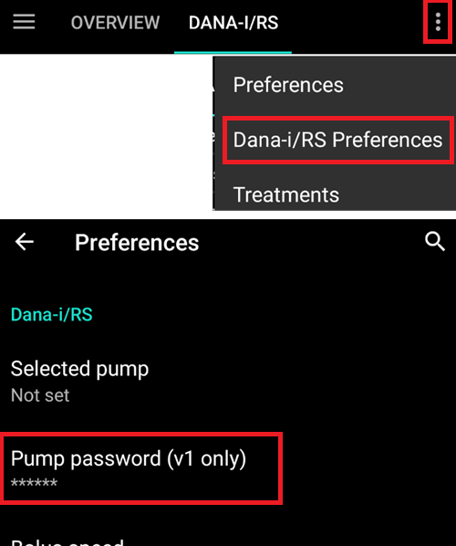

# Necessary checks after update coming from AAPS 2.6

- Le code du programme a été changé de façon significative lors du passage à AAPS 2.7.
- Par conséquent, il est important de faire des changements ou de vérifier les paramètres après la mise à jour.
- Please see [release notes](#Releasenotes-version-2-7-0) for details on new and extended features.

## Vérifier la source de glycémie

- Vérifiez si la source de glycémie est correcte après la mise à jour.
- Especially when using [xDrip+](../CompatibleCgms/xDrip.md) it might happen, that BG source is changed to Dexcom app (patched).
- Open [Config builder](#Config-Builder-bg-source) (hamburger menu on top left side of home screen)
- Faites défiler vers le bas jusqu'à "Source des glycémies".
- Sélectionnez la bonne source de glycémie si des changements sont nécessaires.

## Terminer les objectifs

- AAPS 2.7 contains new objective 11 (in later versions renumbered to objective 10!) for [automation](../DailyLifeWithAaps/Automations.md).
- You have to finish exam ([objective 3 and 4](#objectives-objective3)) in order to complete objective 11.
- If for example you did not finish the exam in [objective 3](#objectives-objective3) yet, you will have to complete the exam before you can start objective 11.
- Cela n'affectera pas les autres objectifs que vous avez déjà terminés. Vous conserverez tous les objectifs terminés !

## Définir le mot de passe principal

- Necessary to be able to [export settings](ExportImportSettings.md) as they are encrypted as of version 2.7.
- Ouvrez les préférences (menu trois points en haut à droite de l'écran d'accueil)
- Cliquez sur le triangle sous " Général "
- Cliquez sur " Mot de passe principal "
- Entrez le mot de passe, confirmez le et cliquez sur OK.

## Exporter les paramètres

- AAPS 2.7 utilise un nouveau format de sauvegarde chiffré.
- You must [export your settings](ExportImportSettings.md) after updating to version 2.7.
- Les fichiers de paramètres des versions précédentes ne peuvent être que importés dans AAPS 2.7. L'exportation sera dans le nouveau format.
- Assurez-vous de stocker vos paramètres exportés non seulement sur votre téléphone, mais également dans au moins un autre endroit sûr (votre pc, stockage cloud...).
- Si vous construisez l'apk AAPS 2.7 avec le même fichier de clés que dans les versions précédentes, vous pouvez installer la nouvelle version sans supprimer la version précédente.
- Tous les paramètres ainsi que les objectifs terminés resteront tels qu'ils étaient dans la version précédente.
- In case you have lost your keystore build version 2.7 with new keystore and import settings from previous version as described in the [troubleshooting section](#troubleshooting_androidstudio-lost-keystore).

## Autosens (un indice - aucune action nécessaire)

- Autosens est changé pour un modèle qui reproduit la conception de référence avec une commutation dynamique.
- Autosens bascule maintenant entre une fenêtre de 24 heures et une de 8 heures pour calculer la sensibilité. Il choisira celle qui est le plus sensible.
- Les utilisateurs qui utilisaient oref1 remarqueront probablement que le système peut être moins dynamique en raison de la variation de sensibilité entre 24 heures et 8 heures.

## Définir le mot de passe de la pompe Dana RS (si vous utilisez une Dana RS)

- Pump password for [Dana RS](../CompatiblePumps/DanaRS-Insulin-Pump.md) was not checked in previous versions.
- Ouvrez les préférences (menu trois points en haut à droite de l'écran d'accueil)
- Faites défiler vers le bas et cliquez sur triangle à côté de "Dana RS".
- Cliquez sur "Mot de passe pompe (v1 uniquement)"
- Enter pump password ([Default password](#DanaRS-Insulin-Pump-default-password) is different depending on firmware version) and click OK.

To change password on Dana RS follow instructions on [DanaRS page](#DanaRS-Insulin-Pump-change-password-on-pump).
