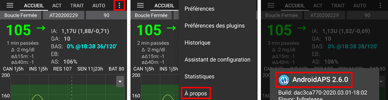

# Mise à jour vers une nouvelle version ou une branche

## Construire vous-même au lieu de télécharger

**AAPS** is not available to download, due to regulations concerning medical devices. Il est légal de construire l'application pour votre usage personnel, mais vous ne devez en aucun cas donner une copie à d'autres personnes ! See [FAQ page](../UsefulLinks/FAQ.md) for details.

## Remarques importantes

* Please update to the new version of **AAPS** as soon as possible after a new release is available.
* When a new release is available, in the **AAPS** app itself, you will receive an information banner about the new version.
* The new version will also be announced on Facebook at the time of release.
* Following the release, please read the [Release Notes](ReleaseNotes.md) in detail, and clarify any queries with the community on Facebook or Discord, before proceeding with the update.

## Update AAPS with browser build

If you already built your AAPS app with the Browser Build method, follow [these instructions](./UpdateBrowserBuild.md).

## Update AAPS with a computer

Follow [these instructions.](./UpdateComputerBuild.md).

(Update-to-new-version-check-aaps-version-on-phone)=

### Vérifier la version d'AAPS sur le téléphone

Après avoir installer le nouvel apk, vous pouvez vérifier la version AAPS sur votre téléphone en cliquant sur le menu 3 points en haut à droite puis sur "à propos". Vous devriez voir la version actuelle en résultat.

Check in the [Release Notes](../Maintenance/ReleaseNotes.md) if there are any specific instructions after update.