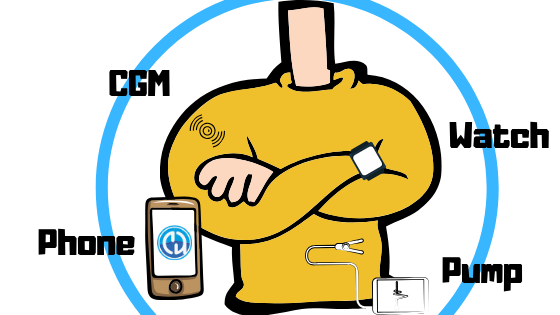

Vue d'ensemble des composants 
**************************************************
AndroidAPS n'est pas seulement une application (faite vous même), c'est juste un des modules fonctionnels de votre système de boucle fermée. Avant de décider des composants, ce serait une bonne idée de jeter un oeil à la `configuration des composants <https://androidaps.readthedocs.io/en/dev/EN/index.html#component-setup>`_.
   

.. note:: 
   ** AVIS DE SÉCURITÉ IMPORTANT * *

   La base des fonctions de sécurité d'AndroidAPS présentée dans cette documentation s'appuie sur les fonctions de sécurité du matériel utilisé pour construire votre système. Il est extrêmement important que vous utilisiez uniquement une pompe à insuline et un capteur de MGC approuvés FDA/CE pour mettre en oeuvre une boucle fermée d'administration automatique d'insuline. Les modifications matérielles ou logicielles de ces composants peuvent entraîner un dosage incorrect de l'insuline, causant un risque significatif pour l'utilisateur. Si vous trouvez ou recevez des pompes à insuline ou des récepteurs CGM cassés, modifiés ou fabriqués par vos soins, *ne les utilisez pas* pour créer un système AndroidAPS.

   De plus, il est également important d'utiliser uniquement des fournitures d'origine telles que serteurs, canules et réservoirs d'insuline approuvés par le fabricant pour une utilisation avec votre pompe ou votre MGC. L'utilisation de consommables non testés ou modifiés peut entraîner une imprécision du MGC et des erreurs de dosage de l'insuline. L'insuline est très dangereuse lorsqu'elle est mal dosée - veuillez ne pas jouer avec votre vie en piratant avec vos fournitures.
   
   Enfin et surtout, vous ne devez pas prendre d'inhibiteurs du SGLT-2 (gliflozines), car ils abaissent de façon incalculable la glycémie.  La combinaison avec un système qui réduit les débits de base pour augmenter la glycémie est particulièrement dangereuse car en raison de la gliflozine, cette augmentation de glycémie pourrait ne pas se produire et un état dangereux d'absence d'insuline peut se produire.

Modules Nécessaires
==================================================
Un bon algorithme de dosage individuel pour votre diabète
--------------------------------------------------
Même si ce n'est pas quelque chose à créer ou à acheter, c'est le "module" qui est probablement le plus sous-estimé, mais essentiel. Quand vous laissez un algorithme vous aider à gérer votre diabète, il doit en connaître les bons réglages pour ne pas faire de graves erreurs.
Même si d'autres modules vous manquent, vous pouvez déjà vérifier et adapter votre « profil » en collaboration avec votre équipe médicale. 
La plupart des "boucleurs" utilisent le rythme circadienpour les DB, la SI et le G/I, qui adaptent la sensibilité à l'insuline hormonale durant la journée.

Le profil inclut :

* DB (débits de basal)
* SI (sensibilité à l'insuline) est la baisse de glycémie que provoque une unité d'insuline
* G/I (ratio Glucides / Insuline) est la quantité de glucides en grammes par unité d'insuline
* DAI (durée d'action de l'insuline).

Ne pas utiliser d'inhibiteurs SGLT-2
--------------------------------------------------
Les inhibiteurs SGLT-2, aussi appelés gliflozines, empêchent la réabsorption du glucose dans le rein. Comme ils abaissent de façon incalculable la glycémie, vous NE DEVEZ PAS les prendre en utilisant un système à boucle fermée comme AndroidAPS! Il y aurait un risque énorme d'une acidocétose ou d'une hypoglycémie ! La combinaison de ce médicament avec un système qui abaisse les débits de basal pour augmenter la glycémie est particulièrement dangereuse car en raison de la gliflozine, cette augmentation de Gly pourrait ne pas se produire et un état dangereux d'absence d'insuline peut se produire.

Téléphone
--------------------------------------------------
Il vous faut un smartphone Android avec Google Android 6.0 ou supérieur. Les utilisateurs sont en train de créer une `liste des téléphones et des montres testées <https://docs.google.com/spreadsheets/d/1gZAsN6f0gv6tkgy9EBsYl0BQNhna0RDqA9QGycAqCQc/edit?usp=sharing>`_

Pour enregistrer un téléphone ou une montre qui n'est pas déjà dans la feuille de calcul, veuillez remplir le `formulaire <https://docs.google.com/forms/d/e/1FAIpQLScvmuqLTZ7MizuFBoTyVCZXuDb__jnQawEvMYtnnT9RGY6QUw/viewform>`_.

En cas de problème avec la feuille de calcul, merci d'envoyer un mail à `hardware@androidaps.org <mailto:hardware@androidaps.org>`_, pour tous les dons de téléphone/montre qui ont encore besoin d'être testés, merci d'envoyer un mail à `donations@androidaps.org <mailto:hardware@androidaps.org>`_.

Pompe à insuline
--------------------------------------------------
AndroidAPS fonctionne **actuellement** avec 

- `Accu-Chek Combo <../Configuration/Accu-Chek-Combo-Pump.html>`_ (également nécessaire : application Ruffy, LineageOS ou Android 8.1 sur votre téléphone)
- `Accu-Chek Insight <../Configuration/Accu-Chek-Insight-Pump.html>`_ 
- `DanaR <../Configuration/DanaR-Insulin-Pump.html>`_ 
- `DanaRS <../Configuration/DanaRS-Insulin-Pump.html>`_  
- `quelques vieilles pompes Medtronic <../Configuration/MedtronicPump.html>`_ à partir de la version 2.4 (également nécessaires : RileyLink/Gnarl, téléphone Android avec bluetooth basse énergie / puce BLE)

**D'autres pompes ** qui peuvent potentiellement fonctionner avec AndroidAPS sont listées sur la page `Futures pompes (possible) <../Getting-Started/Future-possible-Pump-Drivers.html>`_.

Si vous avez besoin d'acheter ** à titre privé** une pompe alors vous pouvez trouver différents distributeurs dans ` cette feuille de calcul <https://drive.google.com/open?id=1CRfmmjA-0h_9nkRViP3J9FyflT9eu-a8HeMrhrKzKz0>` _, veuillez s'il vous plaît partager les détails de la vôtre si elle n'est pas déjà listée.

**Alors quelle est la meilleure pompe pour boucler avec AndroidAPS ?**

La Combo, l'Insight et les anciennes Medtronics sont des pompes solides et bouclables. La Combo offre l’avantage d'avoir un choix parmi beaucoup plus de sets d’infusion, car elle est dotée d’un verrouillage Luer standard. Et elle est alimentée par une pile standard que vous pouvez acheter dans n'importe quelle station service, un magasin de proximité 24 heures / 24 et si vous en avez vraiment besoin, vous pouvez l'emprunter à la télécommande de votre chambre d'hôtel ;-).

Les avantages de la DanaR/RS vs. la Combo comme choix de pompe de choix sont :

- The Dana*R/RS connects to almost any phone with Android >= 5.1 without the need to flash lineage. If your phone breaks you usually can find easily any phone that works with the Dana*R/RS pumps as quick replacement... ce n'est pas aussi facile avec la Combo. (Cela pourrait changer à l'avenir quand Android 8.1 sera plus populaire)
- Initial pairing is simpler with the Dana* RS. Mais en général, vous ne le faites qu'une seule fois, cela n'a d'impact que si vous voulez tester une nouvelle fonctionnalité avec des pompes différentes.
- Jusqu'à présent, le Combo fonctionne avec l'écran en veille. En général, cela fonctionne bien, mais c'est lent. Pour le bouclage, cela n'a pas d'importance car tout fonctionne en arrière-plan. Still there is much more time you need to be connected so more time where the BT connection might break, which isn't so easy if you walk away from your phone whilst bolusing & cooking. 
- The Combo vibrates on the end of TBRs, the Dana* R vibrates (or beeps) on SMB. La nuit, vous êtes susceptibles de plus utiliser les DBT que les SMB.  Le Dana * RS est configurable pour ne pas émettre de bip ni vibrer.
- La lecture de l'historique sur le RS en quelques secondes avec des glucides permet de changer facilement de téléphone en mode hors connexion et de poursuivre la boucle dès que des valeurs de MGC sont lues.
- All pumps AndroidAPS can talk with are waterproof on delivery. Seules les pompes Dana sont également "étanches par garantie" en raison du compartiment de batteries scellées et du système de remplissage du réservoir. 

Source GLY
--------------------------------------------------
This is just a short overview of all compatible CGMs/FGM with AndroidAPS. For further details, look `here <../Configuration/BG-Source.html>`_. Just a short hint: if you can display your glucose data in xDrip+ app or Nightscout website, you can choose xDrip+ (or Nightscout with web connection) as BG source in AAPS.

* `Dexcom G6 <../Hardware/DexcomG6.html>`_: It works with xDrip+ app or patched Dexcom app
* `Dexcom G5 <../Hardware/DexcomG5.html>`_: It works with xDrip+ app or patched Dexcom app
* `Dexcom G4 <../Hardware/DexcomG4.html>`_: These sensors are quite old, but you can find instructions on how to use them with xDrip+ app
* `Libre 2 <../Hardware/Libre2.html>`_: It works with xDrip+ (no transmitter needed), but you have to build your own patched app.
* `Libre 1 <../Hardware/Libre1.html>`_: You need a transmitter like Bluecon or MiaoMiao for it (build or buy) and xDrip+ app
* `Eversense <../Hardware/Eversense.html>`_: It works so far only in combination with ESEL app and a patched Eversense-App (works not with Dana RS and LineageOS, but DanaRS and Android or Combo and Lineage OS work fine)
* `Enlite <../Hardware/MM640g.html>`_: quite complicated with a lot of extra stuff

Nightscout
--------------------------------------------------
Nightscout is a open source web application that can log and display your CGM data and AndroidAPS data and creates reports. You can find more information on the `website of the Nightscout project <http://www.nightscout.info/>`_. You can create your own Nightscout website `using Heroko <http://www.nightscout.info/wiki/welcome/set-up-nightscout-using-heroku>`_, use the semi-automated Nightscout setup on `zehn.be <https://ns.10be.de/en/index.html>`_ or host it on your own server (this is for IT experts).

Nightscout is independent of the other modules. You will need it to fulfill Objective 1.

Additional information on how to configure Nightscout for use with AndroidAPS can be found `here <../Installing-AndroidAPS/Nightscout.html>`_.

AAPS-.apk file
--------------------------------------------------
The basic component of the system. Before installing the app, you have to build the apk-file (which is the filename extension for an Android App) first. Instructions are  `here <../Installing-AndroidAPS/Building-APK.html>`_.  

Optional Modules
==================================================
Smartwatch
--------------------------------------------------
You can choose any smartwatch with Android Wear 1.x and above. Most loopers wear a Sony Smartwatch 3 (SWR50) as it is the only watch that can get readings from Dexcom G5/G5 when phone is out of range. Some other watches can be patched to work as a standalone receiver as well (see `this documentation <https://github.com/NightscoutFoundation/xDrip/wiki/Patching-Android-Wear-devices-for-use-with-the-G5>`_ for more details).

Users are creating a `list of tested phones and watches <https://docs.google.com/spreadsheets/d/1gZAsN6f0gv6tkgy9EBsYl0BQNhna0RDqA9QGycAqCQc/edit?usp=sharing>`_. There are different watchfaces for use with AndroidAPS, which you can find `here <../Configuration/Watchfaces.html>`_.

Pour enregistrer un téléphone ou une montre qui n'est pas déjà dans la feuille de calcul, veuillez remplir le `formulaire <https://docs.google.com/forms/d/e/1FAIpQLScvmuqLTZ7MizuFBoTyVCZXuDb__jnQawEvMYtnnT9RGY6QUw/viewform>`_.

En cas de problème avec la feuille de calcul, merci d'envoyer un mail à `hardware@androidaps.org <mailto:hardware@androidaps.org>`_, pour tous les dons de téléphone/montre qui ont encore besoin d'être testés, merci d'envoyer un mail à `donations@androidaps.org <mailto:hardware@androidaps.org>`_.

xDrip+
--------------------------------------------------
Even if you don't need to have the xDrip+ App as BG Source, you can still use it for i.e. alarms or a good blood glucose display. You can have as many as alarms as you want, specify the time when the alarm should be active, if it can override silent mode, etc. Some xDrip+ information can be found `here <../Configuration/xdrip.html>`_. Please be aware that the documentations to this app are not always up to date as its progress is quite fast.

Exemple de configuration
==================================================
If you want to get a step by step example, you might want to look at a sample setup. The first sample setup is quite old, but should be still up-to-date.

.. toctree::
   :maxdepth: 1
   :glob:
   
   Sample Setup <../Getting-Started/Sample-Setup.rst>
 
  
What to do while waiting for modules
==================================================
It sometimes takes a while to get all modules for closing the loop. But no worries, there are a lot of things you can do while waiting. It is NECESSARY to check and (where approporiate) adapt basal rates (BR), insulin-carbration (IC), insulin-sensitivity-factors (ISF) etc. And maybe open loop can be a good way to test the system and get familiar with AndroidAPS. Using this mode, AndroidAPS gives treatment advices you can manually execute.

You can keep on reading through the docs here, get in touch with other loopers online or offline, `read <https://androidaps.readthedocs.io/en/dev/EN/Where-To-Go-For-Help/Background-reading.html>`_ documentations or what other loopers write (even if you have to be careful, not everything is correct or good for you to reproduce).

**Done?**
If you have your AAPS components all together (congrats!) or at least enough to start in open loop mode, you should first read through the `Objective description <../Usage/Objectives.html>`_ before each new Objective and setup up your `hardware <../index.html#component-setup>`_.
