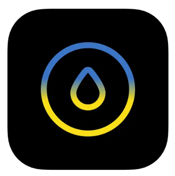
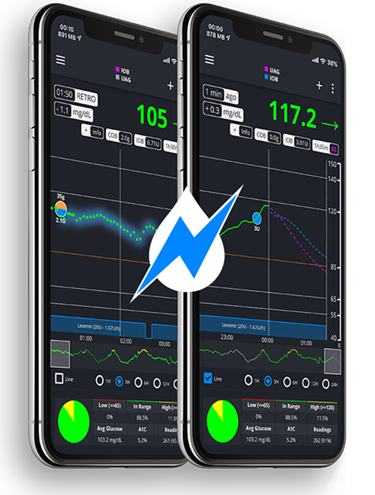

# Suivre AAPS (pas d'interaction avec le système AAPS)

In addition to the range of possibilities available for remotely controlling _and_ following **AAPS** which are described at [remote control](../RemoteFeatures/RemoteControl.md), there are several additional apps and devices which the community has developed, to simply follow numbers (glucose levels and other information), without interacting with AAPS.

A good overview of the extensive options available for following **AAPS** is at [Nightscout follower](https://nightscout.github.io/nightscout/downloaders/#) webpage; if you expand the menu on the left-hand side:


The most common strategies used in combination with **AAPS** are explained in more detail below.

## 1) Smartphone apps

These are some of the main “follower” apps used by **AAPS** users. All of these apps are “free”:

A)  Dexcom Follow (Android/iOs)

B)  Nightguard (iOs)

C)  Nightwatch (Android)

D)  xDrip+ (Android)

E)  xDrip4iOS (iOs)

F)  Sugarmate (iOs)

G)  Spike (iOs)


### A) Dexcom Follow (Android and iOS)


●   Dexcom Follow is compatible with a wide range of handsets (both Android and iPhone). Dexcom Follow can be used even if you are not using the official Dexcom app to receive sensor data.

●   Many caregivers are familiar with Dexcom Follow, preferring its clear interface over something more complicated.

●   Dexcom Follow is very good for teachers/grandparents and people who know very little about diabetes and sugar levels. It has customisable alerts (BG level, what sound to play etc). Alarms can be completely switched off if needed, which is very useful if you have a sensor which is still settling down and creating multiple fake lows.

#### Setting up Dexcom Follow: how-to-guide

If you use the unofficial Dexcom app BYODA for receiving sensor data, you may be able to send invites to followers from within the BYODA app. You should also be able to send invitations to Dexcom Follow from xDrip+ (settings - Cloud upload - Dexcom share server upload, see instructions here:

https://xdrip.readthedocs.io/en/latest/use/cloud/?h=#dexcom-share-server-upload

You cannot send invite emails to Dexcom followers anymore from these third-party apps. In xDrip+ the invite request will just result in the message “invite not sent”.

You must install the official Dexcom app, send the invite, and then uninstall the official app.

The steps to do this are as follows:

1)  Install the official “Dexcom” app on _any_ smartphone (Android/iPhone), this can be the Follower phone, if it is more convenient. 2)  Log in with your Dexcom username and password, this is the same login details you would use for Dexcom Clarity, if you are already a current Dexcom/Clarity customer. If you don’t have a Dexcom login, there is the option to create a new login at this point.   
3)  Swipe through the introduction menus. 4)  Add “no code” for the sensor code. 5)  Under Transmitter SN select “enter manually” and enter any valid transmitter code (use one of your expired transmitter codes, if you know one, so it doesn’t interfere with the running of your current transmitter, they follow a specific format of certain numbers and letters: “NLNNNL” and only use certain combinations, so it’s easiest to use one you already know is valid). 6)  Once the app is trying to find the transmitter and sensor, you will be able to invite followers: select the small three dots in the top left of the app, and add new follower. You can also use this if one of your followers has changed their handset and needs a fresh invite, here you can delete them from the follower list and resend a new invite email for them to use on their new handset. 7)  On the Follower phone, install Dexcom Follow by downloading it from the App Store (iPhone) or Play (Android). Set up the Dexcom Follow app, and you will be prompted to open your email to find the invite to be a Follower.    
8)  You can now delete the official Dexcom G6 app.

For Dexcom Follow, the sensor data is then exported from the AAPS phone either directly from BYODA, or from xDrip+, depending on which app you are using.


### B) Nightguard (iOS)


Pros (as reported by users):

●   Available in the [app store](https://apps.apple.com/us/app/nightguard/id1116430352), simple, user-friendly interface.

●   Swipe button or shake phone to snooze alarms at different intervals ranging from 5 mins to 24 hours

●   Customize alarms (high, low alerts, missed readings when no data for 15-45 minutes.

●   Fast rise/drop over 2-5 consecutive readings (you choose). Can also choose the delta between two individual readings

●   Smart snooze so doesn't alert if levels are moving in right direction

●   There is a Care tab which appears to enable you to set a new temp target for a certain duration, delete the temp target or enter carbs.

Cons (as reported by users)

●   Only available for iOS

●   The TT shows as 5 mmol regardless of which TT level is set

●   Never shows Temp Basal rate even though it shows TB

### C) Nightwatch (Android)


●   Nightwatch markets itself as a Nightscout client and monitors the user’s Nightscout glucose levels on either Android phone or tablet.

●   The app can be downloaded from [Google play](https://play.google.com/store/apps/details?id=se.cornixit.nightwatch) and displays BG data in real time.

●   The user can be alerted with customised noisy low and high alarms set.

●   BG data can be viewed in either mmol/L or mg/dL.

●   It requires Android 5.0 and up.

●   It has a dark Ul, large readings and buttons, designed for usage at night.

### D) xDrip+ (Android)

You can use xDrip+ as a follower.

#### With Nightscout

Set xDrip+ as a Nightscout Follower. You will receive BG and treatments, not basal.


#### Without Nightscout - xDrip+ BG data source

If your AAPS data source is xDrip+ (or if xDrip+ can also receive BG from another app like BYODA, Juggluco, ...) you can use it from the master phone to share data with xDrip+ followers, displaying BG, treatments and basal rates.


#### Without Nightscout - xDrip+ BG companion app

If your AAPS data source is not xDrip+ but you can display BG data from the Companion App data source, you can use it from the master phone to share data with xDrip+ followers, displaying BG, treatments and basal rates.


### E) xDrip4iOS/Shuggah (iOS)


xDripSwift was created from porting the original xDrip app to iOS and evolved to "xDrip for iOS" written **xDrip4iOS** .

A version of **xDrip4iOS** is available in the Apple Store under the name of **Shuggah**.

```{admonition} Further detail about how to attempt to obtain the original **xDrip4iOS** app
:class: dropdown
The [xDrip4iOS Facebook group](https://www.facebook.com/groups/853994615056838/announcements) is the main community support for xDrip4iOS and Shuggah. **xDrip4iOS** can connect to many different CGM systems and transmitters and display blood glucose values, charts and statistics as well as provide alarms. It can also upload to Nightscout or act as a [follower app for Nightscout](https://xdrip4ios.readthedocs.io/en/latest/connect/follower/). However, it is difficult to actually _get_ the **xDrip4iOS** app for your phone. 

"How can I get **xDrip4iOS** on my iPhone?"
There are two options:

1. If you have a Mac and an Apple Developer account (99 EUR/USD per year) you can build your own xDrip4iOS by following the instructions below:

https://xdrip4ios.readthedocs.io/en/latest/install/build/

If you want, you can then become a "releaser" and share a Personal Testflight xDrip4iOS with up to 100 other people to help them:
https://xdrip4ios.readthedocs.io/.../personal_testflight/

2. You join the [xDrip4iOS Facebook group](https://www.facebook.com/groups/853994615056838/announcements) and monitor the posts… wait for somebody to offer an invitation to their Personal Testflight releases in the group. **You should not ask for an invitation to the app** (read the group rules). 

An easier solution is therefore to download the **Shuggah** app. 
```

#### [Shuggah](https://apps.apple.com/sa/app/shuggah/id1586789452)

App:




"What is Shuggah?" A group of Ukrainian developers copied the project code for xDrip4iOS (which is shared publicly on GitHub) and released it on the App Store under a business account (the app is free, and their intentions are good). The app had to be slightly modified to add a privacy statement and disclaimer to get past the review, but the rest of the app should be the same as xDrip4iOS. The Shuggah release is not managed by the xDrip4iOS developers so it cannot be guaranteed that it will function in the same way as xDrip4iOS, that it will be updated at the same time, or that Apple won't remove it from the App Store at some point.

The [xDrip4iOS Facebook group](https://www.facebook.com/groups/853994615056838/announcements) supports xDrip4iOS, Shuggah, and the matching Apple Watch apps.

### F) Sugarmate (iOS)


[Sugarmate](https://sugarmate.io/) is available to download onto iPhones from the App store. Sugarmate is compatible with: ●   Apple iPhone (Requires software version 13.0 or later) ●   Apple iPad (Requires software version 13.0 or later) ●   Google Android (Save web app to your homescreen)

It has been reported by users of Sugarmate that it can be used with Apple CarPlay in the USA to display glucose readings when driving. It is not yet established if this is possible in countries outside the USA. If you know more about this, please add details in here to the documentation by completing a pull-request (link) which is quick and easy to do.


### G)  [Spike](https://spike-app.com/) (iOS)



Spike can be used as a primary receiver or as a follower app, providing BG, alarms and IOB and more. The website and app are no longer developed. Details [here](https://spike-app.com/#features2). Support can be found on [Facebook](https://www.facebook.com/groups/1973791946274873) and [Gitter](https://gitter.im/SpikeiOS/Lobby).

To install Spike, see [here](https://spike-app.com/#installation)

## 2) Smartwatches for **Monitoring of AAPS** (full profile data, or glucose-only) where **AAPS** is running on a phone.

Smartwatch options which also allow interaction with **AAPS** are described in the ["remote control"](../RemoteFeatures/RemoteControl.md) section of the documentation.

There are a wide range of affordable smartwatches which can provide display only. If you are using Nightscout, then a good overview of all the options is [here](https://nightscout.github.io/nightscout/wearable/#)

Here we summarize some of the follow-only watch options popular with **AAPS** users:

### a)  **Xiaomi and Amazfit watches**

[Artem](https://github.com/bigdigital) has created an xDrip+ integration app WatchDrip+ for various smartwatch models, mostly for Xiaomi (_e.g._ Mi band) and Amazfit brands:


You can read more about them, including how to set-up at his website [here](https://bigdigital.home.blog/). The advantage of these watches is that they are small and relatively affordable (the Xiaomi Mi Band 5 has a RRP of £39.99 GBP). They are a popular option especially for kids and those with smaller wrists to wear.

### b) Pebble watch


Pebble watches ([now discontinued](https://en.wikipedia.org/wiki/Pebble_(watch))) were on general sale from 2013 - 2016, and may still be available second-hand. Fitbit took over Pebble’s assets. Pebble users can use the Urchin watchface to view Nightscout data. Displayed data options include IOB, currently active temp basal rate and predictions. If open looping you can use IFTTT to create an applet that says if a Notification has been received from **AAPS**  then send either an SMS or pushover notification.

### c) [Bluejay GTS watch](https://bluejay.website/shop/product/bluejay-gts-26)


This is a unique piece of technology which can receive glucose data **directly** from the Dexcom G6 transmitter. It is not widely known that a Dexcom G6 transmitter actually broadcasts the current glucose data on _two_ separate channels, a phone channel and a pump channel. The Bluejay GTS watch runs a modified version of Xdrip+ software, and can be set to receive glucose data on either channel, so if **AAPS **  is using the phone channel, then the Bluejay GTS watch can use the pump channel.

The Bluejay GTS watch is small, waterproof and reasonably affordable (currently £115 GBP) and can be shipped internationally from the UK. The key advantage is that it is currently the only watch which is completely independent of both the phone and the looping system. So, for example, if you disconnect the pump and the **AAPS**  phone at the beach or flume park, and are out of range of the AAPS phone, you can still get readings from the Dexcom G6 directly to the Bluejay watch.

Reported disadvantages are that it doesn’t always pickup a reading every 5 min, and the battery is not replaceable. The Bluejay GTS watch runs a modified version of Xdrip+ software, and it currently doesn’t work with other Dexcom versions (G7) or Libre sensors.

### d) Apple watch

Check [Nightscout on your watch](https://nightscout.github.io/nightscout/wearable/#):

Options include Nightguard, sugarmate, Gluco-Tracker and Loop Follow.


## 3) Devices for following AAPS

Devices include: A)  M5 stack/M5 stickC

B)  Sugarpixel

C)  PC (Teamviewer)


### A) M5 stack


The M5Stack is a small box which can be programmed for many applications, Martin's project [M5Stack NightscoutMon](https://github.com/mlukasek/M5_NightscoutMon/wiki) is displaying sensor glucose values and trends, IOB and COB. It is in a plastic box, equipped with a colour display, micro SD card slot, 3 buttons, speaker and internal battery. It is a great blood sugar monitor and is relatively easy to set-up if you have a Nightscout account. Users typically run it on their home wifi, but some users report using it as a display when motorbiking, by running it off a phone wifi hotspot.

### B) Sugarpixel

SugarPixel is a device for secondary glucose display alert system for continuous glucose monitoring that connects with Dexcom app or Nightscout app on the user’s smartphone. The device displays real time blood sugar readings. This CGM hardware monitor benefits from random tone generation audio alerts (which are incredibly loud), vibration alerts for hearing impaired, customisable display options and native multi-user following.


●   SugarPixel has multiple display options in mg/dL and mmol/L to suit the user’s needs with colour-coded glucose values. ●   The standard face displays BG, Trend Arrow, and Delta. Delta is the change + or - from the last reading. ●   SugarPixel can be customised for use in low brightness with the BG and Time face to see the user’s BG reading and current time on the user’s nightstand. ●   SugarPixel’s xolour face utilises the entire display to show a single colour representing the BG value. This enables the user to see BG readings at a distance through the window while outside playing in the backyard, patio, or pool. ●   The Big BG face is useful for nightstand users who wear glasses or contact lenses.


### C) PC (TeamViewer)
Some users find a full remote access tool like [TeamViewer](https://www.teamviewer.com/) to be helpful for advanced remote troubleshooting.


 


