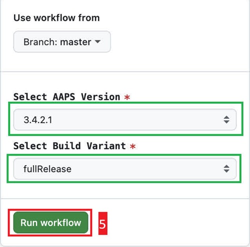

- - -
orphan: true
- - -

### Run the Workflow to Build the Signed APK

1. In your GitHub copy of AndroidAPS, select Actions.
2. Expand All Workflows.
3. Select AAPS-CI

4. Scroll down and tap Run Workflow.

5. Select the branch you want to deploy (master), the [variant](#variant) (fullRelease) and tap Run Workflow.

6. You will see the message Workflow run was successfully requested. Refresh your browser page and you will be able to monitor the build progress. When the action completes, the AAPS CI action will show a green tick mark. You have successfully built the updated version of Android APS.

### Install the AAPS APK

1. Open your Google Drive
2. Browse into AAPS, select the new version folder and you will find both the phone and Android Wear versions.

