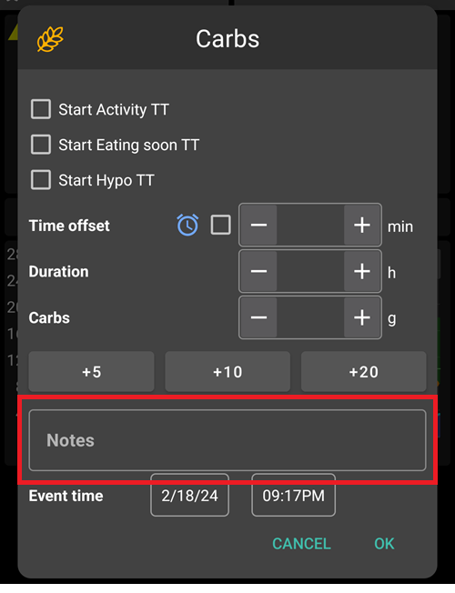
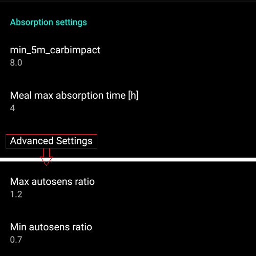

# Préférences

- **Open preferences** by clicking the three-dot menu on the top right side of the home screen.

  

- Vous pouvez accéder directement aux préférences d'un certain onglet (par ex. onglet pompe) en sélectionnant cet onglet et en cliquant sur Préférences du plugin.

  

- **Les sous-menus** peuvent être ouverts en cliquant sur le triangle situé sous le titre du sous-menu.

  

- Avec le **filtre** en haut de l'écran des préférences, vous pouvez accéder rapidement à certaines préférences. Il suffit de taper une partie du texte que vous cherchez.

  

```{contents}
:backlinks: entry
:depth: 2
```

(Preferences-general)=
## General


**Unités**

- Définissez les unités mmol/l ou mg/dl selon vos préférences.

**Langue**

- Nouvelle option pour utiliser la langue par défaut du téléphone (recommandé).

- Si vous voulez AAPS dans une autre langue que la langue du téléphone, vous pouvez choisir parmi une large variété.

- Si vous utilisez des langues différentes, vous pouvez parfois voir un mélange de langues. Cela est dû à un problème Android, le remplacement de la langue par défaut d'Android parfois ne fonctionne pas.


**Nom du patient**

- Peut être utilisé si vous devez différencier plusieurs configurations (par ex. deux enfants DT1 de votre famille).

(Preferences-protection)=
### Protection

(Preferences-master-password)=


#### Mot de passe principal

- Necessary to be able to [export settings](../Maintenance/ExportImportSettings.md) as they are encrypted from version 2.7. **La protection biométrique ne fonctionne pas sur les téléphones OnePlus. Ceci est un problème connu de OnePlus sur certains téléphones.**

- Ouvrez les préférences (menu trois points en haut à droite de l'écran d'accueil)

- Cliquez sur le triangle sous " Général "

- Cliquez sur " Mot de passe principal "

- Entrez le mot de passe, confirmez le et cliquez sur OK.

  

#### Protection des paramètres

- Protect your settings with a password or phone's biometric authentication (i.e. [child is using AAPS](../RemoteFeatures/RemoteMonitoring.md)).

- Custom password should be used if you want to use master password just for securing [exported settings](../Maintenance/ExportImportSettings.md).

- If you are using a custom password click on line "Settings password" to set password as described [above](#Preferences-master-password).

  

#### Protection de l'Application

- Si l'application est protégée, vous devez entrer un mot de passe ou utiliser l'authentification biométrique du téléphone pour ouvrir AAPS.
- L'application s'arrêtera immédiatement si un mot de passe erroné est entré, mais s'exécute toujours en arrière-plan si elle a déjà été ouverte avec succès.

#### Protection des bolus

- Bolus protection might be useful if AAPS is used by a small child and you [bolus via SMS](../RemoteFeatures/SMSCommands.md).

- Dans l'exemple ci-dessous, vous voyez l'invite de protection biométrique. Si l'authentification biométrique ne fonctionne pas, cliquez dans la zone au-dessus de l'invite blanche et entrez le mot de passe principal.

  

(Preferences-skin)=
#### Thème

- Vous pouvez choisir parmi quatre thèmes :

  

- Le thème 'Basse résolution' a des étiquettes plus courte et "âge/niveau" ont été enlevé dans la zone Careportal de l'onglet Action pour avoir plus d'espace disponible sur un écran de très basse résolution.

- La différence entre les autres thèmes dépend de l'orientation du téléphone.

##### Orientation portrait

- **Thème d'origine** et **Les boutons sont toujours affichés en bas de l'écran** sont identiques
- **Grand écran** a une taille de graphiques augmentée comparé aux autres thèmes

##### Orientation paysage

- En utilisant **Thème d'origine** et **Grand écran**, vous devez défiler vers le bas pour voir les boutons en bas de l'écran

- **Grand écran** a une taille de graphiques augmentée comparé aux autres thèmes

  

(Preferences-overview)=
## Aperçu

- Dans la section Aperçu, vous pouvez définir les préférences de l'écran d'accueil.

  

### Garder l'écran allumé

- Utile lors d'une présentation.
- Cela consomme beaucoup d'énergie, il est donc prudent de brancher votre téléphone sur un chargeur.

(Preferences-buttons)=
### Boutons

- Définissez quels boutons sont visibles en bas de votre écran d'accueil.

  

- Avec les paramètres incrément, vous pouvez définir les quantités pour les trois boutons des boîtes de dialogue glucides et insuline pour une entrée facile.

  

  

(Preferences-quick-wizard)=
### Assistant Rapide

- Si vous avez une collation ou un repas fréquent, vous pouvez utiliser le bouton Assistant Rapide pour entrer facilement la quantité de glucides et définir les règles de calcul.

- Dans le paramétrage, vous définissez au cours de quelle période le bouton sera visible sur votre écran d'accueil - ne définissez qu'un bouton par période.

  

- Si vous cliquez sur le bouton Assistant Rapide, AAPS calculera et proposera un bolus pour ces glucides en fonction de vos valeurs actuelles (glycémie ou insuline active si configurées).

- La proposition doit être confirmée avant l'injection de l'insuline.

  

(Preferences-default-temp-targets)=
### Cibles Temporaires par défaut

- [Temp targets (TT)](../DailyLifeWithAaps/TempTargets.md) allow you to define change your blood glucose target for a certain time period.

- Avec la configuration de CT par défaut, vous pouvez facilement changer vos cibles d'activité, de repas imminent, etc.

  

- Faites un appui long sur votre cible dans le coin supérieur droit de l'écran d'accueil ou utilisez les raccourcis dans le bouton orange « Glucides » en bas.

  

###

### Insuline par défaut pour Amorcer/Remplir

- If you want to fill tube or prime cannula through AAPS you can do this through [actions tab](#screens-action-tab).
- Les valeurs prédéfinies peuvent être configurées dans cette boite de dialogue.

(Preferences-range-for-visualization)=
### Fourchette de visualisation

- Définissez quelle partie du graphique sur l'écran d'accueil doit être votre plage cible et sera remplie avec fond vert.

  

### Raccourcir les titres des onglets

- Permet de voir plus de onglets à l'écran.

- Par exemple, l'onglet "OpenAPS AMA" devient "OAPS", "Objectifs" devient "OBJ" etc.

  

(Preferences-show-notes-field-in-treatments-dialogs)=
### Afficher les notes dans les boîtes de dialogue

- Vous permet d'ajouter des textes courts de notes à vos traitements (assistant bolus, glucides, insuline...)

  

(Preferences-status-lights)=
### Voyants d'état

- Les voyants d'état donnent une alerte visuelle pour

  - Age du capteur
  - Sensor battery level for certain smart readers (see [screenshots page](#screens-sensor-level-battery) for details).
  - Âge de l'insuline (jours d'utilisation du réservoir)
  - Niveau du réservoir (unités)
  - Âge de la canule
  - Âge Pile Pompe
  - Âge Pile Pompe (%)

- Si le seuil d'alerte est dépassé, les valeurs seront affichées en jaune.

- Si le seuil critique est dépassé, les valeurs seront affichées en rouge.

- Dans les versions antérieures à AAPS 2.7 le paramètrage des seuils pour les voyants d'état être effectué dans Nightscout.

  

(Preferences-deliver-this-part-of-bolus-wizard-result)=
### Deliver this part of bolus wizard result

Set the [default percentage](#AapsScreens-section-j) of the bolus calculated when using the bolus wizard.

Default is 100%: no correction. Even when setting a different value here, you can still change each time you use the bolus wizard.

When using [SMB](#objectives-objective9), using a value lower than 100% here can be useful:
* for people with slow digestion: sending all the bolus upfront can cause hypo because the insulin action is faster than the digestion.
* to leave more room to *AAPS** to deal by itself with **BG rise**. In both cases, **AAPS** will compensate the missing part of the bolus with SMBs, if/when deemed adequate.

(Preferences-advanced-settings-overview)=
### Paramètres avancés (Aperçu)


(Preferences-superbolus)=
#### Superbolus

- Activer les Superbolus dans l'Assistant.
- le principe des [Superbolus](https://www.diabetesnet.com/diabetes-technology/blue-skying/super-bolus/) est "d'emprunter" de l'insuline du débit de basal dans les deux prochaines heures pour éviter les pics.

## Traitements de sécurité

### Type de patient

- Les limites de sécurité sont établies en fonction de l'âge sélectionné dans ce paramètre.
- Si vous commencez à atteindre ces limites restrictives (comme le Maximum Bolus), il est temps de changer d’un cran.
- C’est une mauvaise idée de selectionner un âge supérieur a l'âge réel car cela peut conduire à un surdosage lorsque l'on entre une valeur incorrecte dans la boîte de dialogue de l’insuline (en oubliant le point décimal ou la virgule par exemple).
- If you want to know the actual numbers for these hard-coded safety limits, scroll to the algorithm feature you are using on [this page](../DailyLifeWithAaps/KeyAapsFeatures.md).

### Maximum Bolus autorisé \[U\]

- Défini la quantité maximale d’insuline que AAPS est autorisé à administrer en une fois lors d'un bolus.
- Ce paramètre existe comme une limite de sécurité pour empêcher l'injection d’un bolus trop important dû à une saisie accidentelle ou une erreur de l’utilisateur.
- Il est recommandé de définir cette valeur à un montant raisonnable qui correspond approximativement à la quantité maximale d’insuline de bolus que vous êtes susceptible d’avoir besoin pour un repas ou pour une dose de correction.
- Cette restriction s’applique également aux résultats de l'assistant bolus.

### Maximum de Glucides autorisé \[g\]

- Défini la quantité maximale de glucides que l'assistant bolus de AAPS est autorisée à utiliser.
- Ce paramètre existe comme une limite de sécurité pour empêcher l'injection d’un bolus trop important dû à une saisie accidentelle ou une erreur de l’utilisateur.
- Il est recommandé de définir cette valeur à un montant raisonnable qui correspond approximativement à la quantité maximale de glucides que vous êtes susceptible d’avoir dans d'un repas.

## Boucle

(Preferences-aps-mode)=
### Mode APS

- Basculer entre les boucles ouvertes et fermées ainsi que le mode arrêt glycémie basses (AGB)
- **Boucle ouverte** signifie que les suggestions DBT sont faites en fonction de vos données et apparaissent comme une notification. Après confirmation manuelle, la commande d'injection de l'insuline sera transférée à la pompe. Ce n'est que si vous utilisez la pompe virtuelle que vous devez la saisir manuellement.
- **La Boucle fermée** signifie que les suggestions DBT (Débit de Basal Temporaire) sont automatiquement envoyées à votre pompe sans confirmation ou entrée de votre part.
- Le mode **Arrêt Glycémie Basse** est similaire à la boucle fermée, mais limite le paramètre maxIOB à zéro. Cela signifie que si la glycémie diminue, le système peut réduire le débit basal pour vous, mais si la glycémie augmente, il n'augmentera le débit basal que si l'IA est négative (liée à un Arrêt Glycémie Basse précédent).

(Preferences-minimal-request-change)=
### Changement minimum \[%\]

- Lorsque vous utilisez le mode boucle ouverte, vous recevrez des notifications chaque fois que le programme AAPS vous recommande d'ajuster le débit de basal.
- Pour réduire le nombre de notifications, vous pouvez utiliser une plage cible de glycémie plus étendue ou augmenter le pourcentage de changement minimal.
- Ce paramètre défini le changement relatif minimum qui déclenchera une notification.

(Preferences-advanced-meal-assist-ama-or-super-micro-bolus-smb)=
## Assistance Améliorée Repas (AAR ou AMA) ou Super Micro Bolus (SMB)

Depending on your settings in [config builder](../SettingUpAaps/ConfigBuilder.md) you can choose between two algorithms:

- [Advanced meal assist (OpenAPS AMA)](#Open-APS-features-advanced-meal-assist-ama) - state of the algorithm in 2017
- [Super Micro Bolus (OpenAPS SMB)](#Open-APS-features-super-micro-bolus-smb) - most recent algorithm recommended for beginners

### Paramètres OpenAPS AMA

- Permet au système de reagir plus rapidement après un bolus de repas SI vous entrez les Glucides de manière fiable.
- Plus de détail sur les paramètres et l'Autosens peuvent être trouvés dans la [documentation OpenAPS](https://openaps.readthedocs.io/en/latest/docs/Customize-Iterate/autosens.html).

(Preferences-max-u-h-a-temp-basal-can-be-set-to)=
#### Débit max en U/h pour une Temp Basal

- Existe comme une limite de sécurité pour empêcher AAPS d'etre capable d'administrer un dosage de Basal dangereusement élevé.
- La valeur est definie en Unités d'insuline par heure (U/h).
- Il est conseillé de definir cette valuer de facon raisonnable et sensée. Une bonne recommandation est de prendre le **débit de basal le plus élevé** de votre profil et de le **multiplier par 4**.
- Par exemple, si le dosage basal le plus élevé de votre profil est de 0,5 U/h, vous pourriez le multiplier par 4 pour obtenir la valeur de 2 U/h.
- See also [detailed feature description](#Open-APS-features-max-u-h-a-temp-basal-can-be-set-to).

#### L'IA basal maximum que OpenAPS peut délivrer \[U\]

- Une quantité d'insuline basale supplémentaire (en unités) a pu s'accumuler dans votre corps, en plus de votre profil basal normal.
- Une fois cette valeur atteinte, AAPS cessera de délivrer de l'insuline basale supplémentaire jusqu'à ce que votre Insuline basale Active (IA) aie diminuée et soit de nouveau dans cette plage.
- Cette valeur **ne prend pas en compte pas l'Insuline Active IA des bolus**, mais seulement la basale.
- Cette valeur est calculée et surveillée indépendamment de votre débit de basal normal. Ce n'est que l'insuline basale additionnelle en plus du débit normal qui est pris en compte.

Lorsque vous commencez à boucler, **il est conseillé de mettre l'IA basal Max à 0** pour une période de temps, pendant que vous vous habituez au système. Cela empêche AAPS de donner de l'insuline basale supplémentaire. Pendant ce temps, AAPS sera toujours en mesure de limiter ou de désactiver votre insuline basale pour prévenir l'hypoglycémie. C'est une étape importante pour :

- Avoir un certain temps pour s'habituer en toute sécurité au système AAPS et surveiller son fonctionnement.
- Profiter de l'occasion pour parfaire votre profil basal et votre Sensibilité à l'Insulin (SI).
- Voir comment AAPS limite votre insuline basale pour prévenir l'hypoglycémie.

Lorsque vous vous sentez à l'aise, vous pouvez autoriser le système à commencer à vous donner de l'insuline basale supplémentaire, en augmentant la valeur de l'IA basal Max. Une bonne recommandation est de prendre le **débit de basal maximum** de votre profil et de le **multiplier par 3**. Par exemple, si le dosage basal le plus élevé de votre profil est de 0,5 U/h, vous pourriez le multiplier par 3 pour obtenir la valeur de 1,5 U/h.

- Vous pouvez commencer prudemment avec cette valeur et l'augmenter lentement avec le temps.
- Ce ne sont que des lignes directrices; chacun a un corps différent. Vous trouverez peut-être que vous avez besoin plus ou moins que ce qui est recommandé ici, mais commencez toujours prudemment et ajustez lentement.

**Remarque : En tant que fonction de sécurité, l'IA Max Basal est limitée à 7 U.**

#### Autosens

- [Autosens](#Open-APS-features-autosens) looks at blood glucose deviations (positive/negative/neutral).
- Il essaiera de comprendre à quel point vous êtes sensible/résistant en fonction de ces écarts et ajustera le débit basal et la SI en fonction de ces écarts.
- Si vous sélectionnez "Autosens ajuste aussi les cibles" l'algorithme modifiera également votre cible de glycémie.

#### Paramètres avancés (OpenAPS AMA)

- Normalement, vous n'avez pas à modifier les paramètres dans cette boîte de dialogue !
- Si vous voulez quand même les changer, lisez en détail la [documentation OpenAPS](https://openaps.readthedocs.io/en/latest/docs/While%20You%20Wait%20For%20Gear/preferences-and-safety-settings.html#) et assurez-vous de bien comprendre ce que vous faites.

(Preferences-openaps-smb-settings)=
### Paramètres OpenAPS SMB

- In contrast to AMA, [SMB](#Open-APS-features-super-micro-bolus-smb) does not use temporary basal rates to control glucose levels, but mainly small super micro boluses.

- You must have started [objective 9](#objectives-objective9) to use SMB.

- The first three settings are explained [above](#Preferences-max-u-h-a-temp-basal-can-be-set-to).

- Details on the different enable options are described in [OpenAPS feature section](#Open-APS-features-enable-smb).

- *La fréquence à laquelle les SMB seront donnés en min* est une restriction pour que le SMB ne soit distribué que toutes les 4 minutes par défaut. Cette valeur empêche le système d'émettre trop souvent des SMB (par exemple dans le cas où une cible temporaire a été définie). Vous ne devriez pas modifier ce paramètre sauf si vous en connaissez exactement les conséquences.

- If 'Sensitivity raises target' or 'Resistance lowers target' is enabled [Autosens](#Open-APS-features-autosens) will modify your glucose target according to your blood glucose deviations.

- Si la cible est modifiée, elle sera affichée avec un fond vert sur votre écran d'accueil.

  

(Preferences-carb-required-notification)=
#### Notification glucides requis

- Cette fonctionnalité n'est disponible que si l'algorithme SMB est sélectionné.

- Il sera suggéré de manger des glucides supplémentaires quand l'algorithme détecte que des glucides sont requis.

- Dans ce cas, vous recevrez une notification qui peut être reportée pendant 5, 15 ou 30 minutes.

- De plus, les glucides requis seront affichés dans la section GA sur votre écran d'accueil.

- Un seuil peut être défini - Glucides minimum requis pour suggestion.

- Les notifications Glucides requis peuvent être envoyées sur Nightscout si vous le souhaitez, dans ce cas une annonce sera affichée et diffusée.

  

#### Paramètres avancés (OpenAPS SMB)

- Normalement, vous n'avez pas à modifier les paramètres dans cette boîte de dialogue !
- Si vous voulez quand même les changer, lisez en détail la [documentation OpenAPS](https://openaps.readthedocs.io/en/latest/docs/While%20You%20Wait%20For%20Gear/preferences-and-safety-settings.html#) et assurez-vous de bien comprendre ce que vous faites.

## Paramètres d’absorption



(Preferences-min_5m_carbimpact)=
### min_5m_carbimpact

- L'algorithme utilise l'IGly (impact glycémique) pour déterminer quand les glucides sont absorbés.

- La valeur n'est utilisée que pendant les lacunes dans les lectures MGC ou lorsque l'activité physique "consomme" l'augmentation de la glycémie qui autrement aurai permis la décomposition des GA par AAPS.

- Parfois, lorsque l'absorption de glucides ne peut pas être déterminée de façon dynamique en fonction des glycémies, AAPS intègre une décomposition par défaut à vos glucides. De base, c'est une sécurité intégrée.

- Pour le dire simplement: L'algorithme "sait" comment vos glycémies *devraient* se comporter quand elles sont affectées par la dose actuelle d'insuline, etc.

- Chaque fois qu'il y a un écart positif par rapport au comportement attendu, certains glucides sont absorbés/décomposés. Gros changement = beaucoup de glucides, etc.

- Le min_5m_carbimpact définit l'impact par défaut de l'absorption des glucides par 5 minutes. Pour plus de détails, voir la [documentation OpenAPS](https://openaps.readthedocs.io/en/latest/docs/While%20You%20Wait%20For%20Gear/preferences-and-safety-settings.html?highlight=carbimpact#min-5m-carbimpact).

- La valeur standard pour AMA est de 5, pour SMB c'est 8.

- Le graphique GA sur l'écran d'accueil indique quand min_5m_impact est utilisé en plaçant un cercle orange en haut.

  

### Durée max d’absorption d'un repas

- Si vous mangez souvent des repas riches en matières grasses ou en protéines, vous devrez augmenter votre temps d'absorption des repas.

### Paramètres avancés - Ratio autosens

- Define min. and max. [autosens](#Open-APS-features-autosens) ratio.
- Normalement les valeurs standards (max. 1,2 et min. 0,7) ne devrait pas être modifiées.

## Paramètres de la pompe

The options here will vary depending on which pump driver you have selected in [Config Builder](#Config-Builder-pump).  Appairez et réglez votre pompe selon les instructions relatives à la pompe :

- [Pompe à Insuline DanaR](../CompatiblePumps/DanaR-Insulin-Pump.md)
- [Pompe à Insuline DanaRS](../CompatiblePumps/DanaRS-Insulin-Pump.md)
- [Pompe Accu-Chek Combo](../CompatiblePumps/Accu-Chek-Combo-Pump.md)
- [Pompe Accu-Chek Insight](../CompatiblePumps/Accu-Chek-Insight-Pump.md)
- [Pompe Medtronic](../CompatiblePumps/MedtronicPump.md)

If using AAPS to open loop then make sure you have selected Virtual Pump in config builder.

(Preferences-nsclient)=
## NSClient


Original communication protocol, can be used with older Nightscout versions.

- Set your *Nightscout URL* (i.e. <https://yoursitename.yourplaform.dom>).
  - **Vérifiez bien que l'URL est SANS /api/v1/ à la fin.**
- The *[API secret](https://nightscout.github.io/nightscout/setup_variables/#api-secret-nightscout-password)* (a 12 character password recorded in your Nightscout variables).
- This enables data to be read and written between both the Nightscout website and AAPS.
- Vérifiez deux fois les fautes de frappe ici si vous êtes coincé dans l'objectif 1.

## NSClientV3


[New protocol introduced with AAPS 3.2.](#Important-comments-on-using-v3-versus-v1-API-for-Nightscout-with-AAPS) Safer and more efficient.

```{admonition} V3 data uploaders
:class: warning

When using NSClientV3, all uploaders must be using the API V3. Since most are not compatible yet, this means **you must let AAPS upload all data** (BG, treatments, ...) to Nightscout and disable all other uploaders if they're not V3 compliant.
```

- Set your *Nightscout URL* (i.e. <https://yoursitename.yourplaform.dom>).
  - **Vérifiez bien que l'URL est SANS /api/v1/ à la fin.**
- In Nightscout, create an *[Admin token](https://nightscout.github.io/nightscout/security/#create-a-token)* (requires [Nightscout 15](https://nightscout.github.io/update/update/) to use the V3 API) and enter it in **NS access token** (not your API Secret!).
- This enables data to be read and written between both the Nightscout website and AAPS.
- Vérifiez deux fois les fautes de frappe ici si vous êtes coincé dans l'objectif 1.
- Leave Connect to websockets enabled (recommended).

### Synchronization

Synchronization choices will depend on the way you will want to use AAPS.

You can select which data you want to [upload and download to or from Nightscout](#Nightscout-aaps-settings).

### Options d'alarme


- Alarm options allows you to select which Nightscout alarms to use through the app. AAPS will alarm when a Nightscout alarms trigger.
  - For the alarms to sound you need to set the Urgent High, High, Low and Urgent Low alarm values in your [Nightscout variables](https://nightscout.github.io/nightscout/setup_variables/#alarms).
  - They will only work whilst you have a connection to Nightscout and are intended for parent/caregivers.
  - If you have the CGM source on your phone (i.e. xDrip+ or BYODA) then use those alarms instead of Nightscout Alarms.
- Create notifications from Nightscout [announcements](https://nightscout.github.io/nightscout/discover/#announcement) will echo Nightscout announcements in the AAPS notifications bar.
- You can change stale data and urgent stale data alarms threshold when no data is received from Nightscout after a certain time.

### Paramètres de connexion


- Connection settings define when Nightscout connection will be enabled.
- Restreignez le téléchargement de Nightscout au Wi-Fi seulement ou même à certains SSID Wi-Fi.
- Si vous souhaitez utiliser uniquement un réseau WiFi spécifique, vous pouvez entrer son SSID.
- Plusieurs SSID peuvent être séparés par un point-virgule.
- Pour supprimer tous les SSID, entrez un espace dans la zone.

(Preferences-advanced-settings-nsclient)=
### Paramètres avancés (NSClient)


Options in advanced settings are self-explanatory.

## Communicateur SMS

- Options will only be displayed if SMS communicator is selected in [Config Builder](#Config-Builder-sms-communicator).
- Ce paramètre permet de contrôler à distance de l'application en envoyant des instructions au téléphone du patient que l'application appliquera comme Suspendre la boucle ou un bolus.
- Further information is described in [SMS Commands](../RemoteFeatures/SMSCommands.md).
- Une sécurité supplémentaire est obtenue grâce à l'utilisation d'une application authentificateur et d'un code PIN supplémentaire à la fin du jeton.

## Automatisation

Select which location service shall be used:

- Utiliser la localisation passive : AAPS ne prend la localisation que si d'autres applications la demandent
- Utiliser la localisation par le réseau : Localisation de votre Wifi
- Utiliser la localisition GPS (Attention ! Peut entrainer une consommation excessive de la batterie !)

## Alertes locales


- Les paramètres doivent être explicites.

## Choix de données


- Vous pouvez aider davantage au développement d'AAPS en envoyant des rapports de plantage aux développeurs.

## Paramètres de maintenance


- Standard recipient of logs is <logs@aaps.app>.

## Open Humans

- Vous pouvez aider la communauté en faisant don de vos données à des projets de recherche ! Details are described on the [Open Humans page](../SupportingAaps/OpenHumans.md).

- Dans les préférences, vous pouvez définir quand les données doivent être téléchargées

  - uniquement si connecté au WiFi
  - uniquement si en charge
