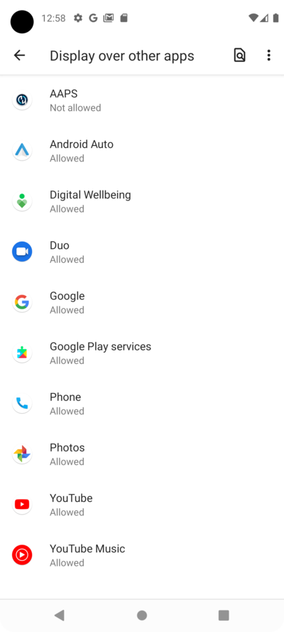
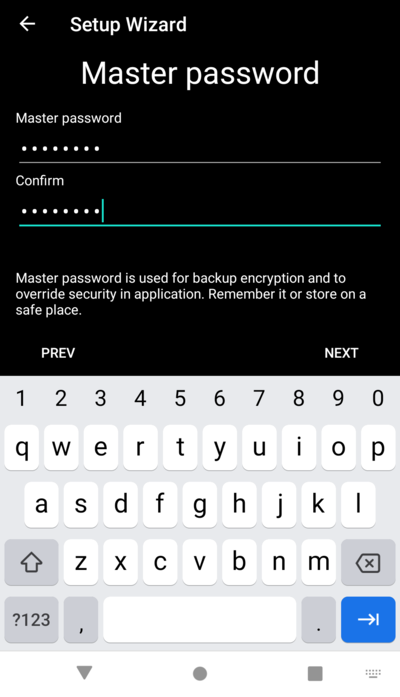
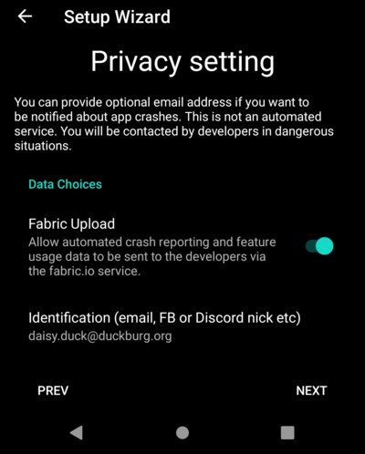
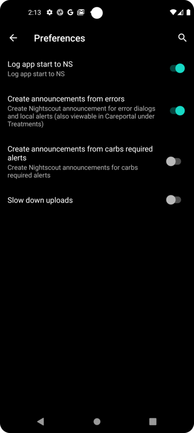

# Assistant de configuration

When you first start **AAPS** you are guided by the "**Setup Wizard**", to quickly setup all the basic configurations of your app in one go. **Setup Wizard** guides you, in order to avoid forgetting something crucial. For example, the **permission settings** are fundamental for setting up **AAPS** correctly.

However, it's not mandatory to get everything completely configured in the first run of using the **Setup Wizard** and you can easily exit the Wizard and come back to it later. There are three routes available after the **Setup Wizard** to further optimise/change the configuration. Ces options seront détaillées dans la prochaine section. Vous pouvez donc tout à fait sauter quelques points de l'Assistant de Configuration, vous pourrez facilement y revenir plus tard.

During, and directly after using the **Setup Wizard** you may not notice any significant observable changes in **AAPS**. To enable your **AAPS** loop, you have to follow the **Objectives** to enable feature after feature. You will start **Objective 1** at the end of the Setup Wizard. You are the master of **AAPS**, not the other way around.

```{admonition} Preview Objectives
:class: note
If you are keen to know the structure of the objectives, please read [Completing the objectives](../SettingUpAaps/CompletingTheObjectives.md) but then come back here to run the Setup Wizard first.

```

From previous experience, we are aware that new starters often put themselves under pressure to setup **AAPS** as fast as possible, which can lead to frustration as it is a big learning curve.

So, please take your time in configuring your loop, the benefits of a well-running **AAPS** loop are huge.

```{admonition} Ask for Help
:class: note
If there is an error in the documentation or you have a better idea for how something can be explained, you can ask for help from the community as explained at [Connect with other users](../GettingHelp/WhereCanIGetHelp.md).
```
## Guide pas à pas de l'assistant de configuration AAPS
### Message de bienvenue

Il s'agit juste d'un message de bienvenue que vous pouvez passer avec le bouton "SUIVANT" :


### Contrat de licence

In the end user license agreement there is important information about the legal aspects of using **AAPS**. Veuillez le lire attentivement.

If you don't understand, or can't agree to the end user license agreement please don't use **AAPS** at all!

Si vous comprenez et êtes d'accord, veuillez cliquer sur le bouton "JE COMPRENDS ET J'ACCEPTE" et poursuivre avec l'Assistant de configuration :


### Autorisations requises

**AAPS** needs some requirements to operate correctly.

In the following screens you are asked several questions you have to agree to, to get **AAPS** working. L'assistant vous explique pourquoi il demande ces paramètres.

Sur cette page, nous nous efforçons de fournir davantage d'informations de contexte, de traduire un langage technique en langage courant ou d'expliquer la raison.

Cliquez sur le bouton "SUIVANT" :


La consommation de la batterie sur les smartphones reste une problématique, car la performance des batteries est encore assez limitée. Par conséquent, le système d'exploitation Android de votre smartphone restreint par défaut les applications qui consomment du temps processeur, et donc de la batterie.

However, **AAPS** needs to run regularly, _e.g._ to receive the glucose readings every few minutes and then apply the algorithm to decide how to deal with your glucose levels, based on your specifications. Par conséquent, nous devons l'autoriser à le faire, au niveau d'Android.

Vous le ferez en donnant cette autorisation.

Cliquez sur le bouton "DEMANDE D'AUTORISATION" :


Cliquez "Autoriser" :


Android définit une autorisation spéciale pour les applications qui souhaitent vous envoyer des notifications.

While it is a good feature to disable notifications _e.g._ from  social media apps, it is essential that you allow **AAPS** to send you notifications.

Cliquez sur le bouton "DEMANDE D'AUTORISATION" :


Sélectionnez l'application "AAPS" :



Activer "Autoriser la superposition sur d'autres applis" en faisant glisser le curseur vers la droite :


Le curseur doit ressembler à ceci une fois activé :


Dans Android, l'utilisation du Bluetooth est liée à la capacité d'utiliser les services de localisation. Peut-être l'avez-vous vu aussi dans d'autres applications. Il est courant d'avoir besoin d'une autorisation de localisation si vous voulez utiliser le bluetooth.

**AAPS** uses bluetooth to communicate with your CGM and insulin pump if they are directly controlled by **AAPS** and not another app which is used by **AAPS**. Les détails peuvent différer d'une configuration à l'autre.

Cliquez sur le bouton "DEMANDE D'AUTORISATION" :


Cette autorisation est importante. Otherwise **AAPS** can not work properly at all.

Cliquez sur "Lorsque vous utilisez l'appli" :


Cliquez sur le bouton "SUIVANT" :


**AAPS** needs to log information to the permanent storage of your smartphone. Ce stockage permanent sur la mémoire interne signifie que les fichiers seront toujours disponibles, même après le redémarrage de votre smartphone. D'autres données sont simplement perdues, car elles ne sont pas enregistrées sur la mémoire interne.

Cliquez sur le bouton "DEMANDE D'AUTORISATION" :


Cliquez sur "Autoriser" :


Vous êtes informé que vous devez redémarrer votre smartphone après ce changement pour qu'il prenne effet.

Please **don't stop the Setup Wizard now**. Vous pourrez le faire après avoir terminé l'Assistant de Configuration.

Cliquez sur "OK" puis sur le bouton "SUIVANT" :


### Mot de passe principal

As the configuration of **AAPS** contains some sensitive data (_e.g._ API_KEY for accessing your Nightscout server) it is encrypted by a password you can set here.

The second sentence is very important, please **DO NOT LOSE YOUR MASTER PASSWORD**. Please make a note of it _e.g._ on Google Drive. Google Drive est pratique pour les sauvegardes car c'est Google qui le gère pour vous. Votre smartphone ou PC peuvent vous lâcher et vous pourriez ne pas avoir de sauvegarde locale. If you forget your Master Password, it can be difficult to recover your profile configuration and progress through the **Objectives** at a later date.

Après avoir saisi le mot de passe deux fois, veuillez cliquer sur le bouton "SUIVANT" :




### Téléchargement Fabric

Ici vous pouvez autoriser l'envoi automatique des rapports d'erreur en cas de plantage, ainsi que de données sur l'utilisation de l'appli.

Ce n'est pas obligatoire, mais c'est une bonne pratique de l'activer.

Cela aide les développeurs à mieux comprendre votre utilisation de l'application et les informe des plantages qui se produisent.

Ils/Elles reçoivent :

1. Des informations quand l'application plante, ce qu'ils/elles ne sauraient pas autrement puisque dans leur propre configuration tout fonctionne correctement et
1. Dans les données envoyées (informations sur le plantage), il y a des informations sur les circonstances dans lesquelles le plantage s'est produit et quel type de configuration est utilisé.

Cela aide donc les développeurs à améliorer l'application.

Veuillez activer le "Téléchargement Fabric" en faisant glisser le curseur vers la droite :


De plus, vous pouvez renseigner un moyen de contact si jamais si les développeurs ont besoin de vous contacter pour des questions ou des préoccupations urgentes :


Après avoir rempli vos "informations de contact", cliquez sur le bouton "OK". Vous pouvez y mettre votre nom sur Facebook, Discord, ... Mettez juste ce qui est le plus simple pour vous pour qu'on puisse vous contacter :


Cliquez sur le bouton "SUIVANT" :



### Units (mg/dL <-> mmol/L)

Veuillez sélectionner si vos glycémies sont en mg/dL ou mmol/L, puis cliquez sur le bouton "SUIVANT" :


### Paramètres d'affichage

 Ici, vous pouvez définir les valeurs entre lesquelles la glycémie sera considérée comme "dans la cible". Vous pouvez le laisser tel quel pour l'instant et le modifier plus tard.

Les valeurs que vous choisissez n'affectent que l'affichage du graphique, et rien d'autre.

Your glucose target _e.g._ is configured separately in your profile.

Votre plage cible pour l'analyse du TIR (temps dans la plage cible) est configurée séparément dans votre serveur de reporting.

Cliquez sur le bouton "SUIVANT" :


(SetupWizard-synchronization-with-the-reporting-server-and-more)=
### Synchronisation avec le serveur de reporting, etc

Ici, vous configurez le téléchargement des données vers votre serveur de reporting.

Vous pourriez également configurer d'autres éléments ici, mais pour cette première exécution, nous nous concentrerons simplement sur le serveur de reporting.

Si vous n'êtes pas en mesure de le configurer pour le moment, passez cette étape pour l'instant. Vous pouvez le configurer plus tard.

If you select an item here on the left tick box, on the right you can then ticking the visibility (eye) box, which will place this plugin in the upper menu on the **AAPS** home screen. Vous devriez cocher la case de visibilité si vous configurez votre serveur de reporting à ce stade.

Dans cet exemple, nous sélectionnons Nightscout comme serveur de reporting, et nous allons le configurer.

```{admonition}  Make sure to choose the correct **NSClient** version for your needs! 
:class: Note

Click [here](#version3200) for the release notes of **AAPS** 3.2.0.0 which explain the differences between the top option **NSClient** (this is "v1", although it is not explicitly labelled) and the second option, **NSClient v3**.

Nightscout users should choose **NSClient v3**, unless you want to monitor or send remote treatments (_e.g._ as a parent or caregiver using **AAPS** for a child) through Nightscout, in which case, choose the first option "**NSClient**" until further notice. 
```
Pour Tidepool, c'est encore plus simple, car vous n'avez besoin que de vos informations de connexion personnelles.

Après avoir fait votre sélection, cliquez sur le bouton Engrenage à côté de l'élément que vous avez sélectionné :


Ici, vous configurez l'accès au serveur de reporting Nightscout.

Veuillez cliquer sur "URL Nightscout" :


Entrez l'URL Nightscout de votre serveur personnel. Il s'agit de l'URL que vous avez configurée vous-même, ou qui vous a été fournie par votre fournisseur Nightscout.

Cliquez sur le bouton "OK" :


Entrez votre jeton d'accès nightscout. Il s'agit du jeton d'accès que vous avez défini pour votre serveur Nightscout. Sans ce jeton, l'accès ne fonctionnera pas.

If you don't have it at the moment please check the documentation for setting up the reporting server in the **AAPS** documentation.

After filling in the "**NS access token**" and clicking "OK", please click on the "Synchronization" button:


Vous pouvez sélectionner "Télécharger des données vers NS" si vous avez bien configuré Nightscout lors des étapes précédentes de l'Assistant de Configuration.

If you have stored profiles on Nightscout and want to download them to **AAPS**, enable "Receive profile store":


Retournez à l'écran précédent et cliquez sur "Option d'alarme" :


Pour l'instant, laissez ces options désactivées. Nous vous avons simplement amenés sur cet écran pour vous montrer les différentes options que vous pourriez utiliser à l'avenir. Pour le moment, vous n'en avez pas besoin.

Retournez à l'écran précédent et sélectionnez "Paramètres de connexion".

Ici vous pouvez affiner les conditions de téléchargement vers le serveur de reporting.

Caregivers must enable "use cellular connection" as otherwise the smartphone which serves the dependant/child can not upload data outside of WiFi range _e.g._ on the way to school.

Other **AAPS** users can disable the tranfer via cellular connection if they want to save data or battery.

Si vous ne savez pas trop, laissez simplement tout coché.

Retournez à l'écran précédent et sélectionnez "Paramètres Avancés".


Activer "Démarrage AAPS entré dans NS" si vous souhaitez voir cette information dans le serveur de reporting. Cela peut vous aider à savoir à distance si et quand l'application a été redémarrée, en particulier en tant qu'aidant.

It might be interesting to see if **AAPS** is correctly configured now, but later it is usually not that important to be able to see **AAPS** stopping or starting in Nightscout.

Activer "Créer des messages d'erreur" et "Créer des annonces à partir des alertes Glucides requis".

Laissez la fonction "Ralentir les téléversements" désactivée. Cette option n'est utile que dans un contexte particulier, si par exemple vous avez beaucoup de données à envoyer au serveur Nightscout, et que ce serveur est lent à traiter les données.

Revenez deux fois en arrière, jusqu'à la liste des plugins et sélectionnez "SUIVANT" pour passer à la suite :



### Patient name

Here you can setup your name in **AAPS**.

Vous pouvez mettre ce que vous voulez. Ça sert uniquement à différencier les utilisateurs.

Pour rester simple, entrez simplement le prénom et nom de famille.

Appuyez sur "SUIVANT" pour passer à l'écran suivant.


### Type de patient

Here you select your "Patient type" which is important, as the **AAPS** software has different limits, depending on the age of the patient. C'est important pour des raisons de sécurité et de sûreté.

Here is where you also configure the **maximum allowed bolus** for a meal. C'est-à-dire, le plus gros bolus dont vous avez besoin pour couvrir un repas standard. C'est une fonction de sécurité pour éviter de surdoser accidentellement lorsque vous faites un bolus pour le repas.

Dans la même idée, la deuxième limite concerne cette fois l'apport maximum en glucides permis.

Après avoir défini ces valeurs, appuyez sur "SUIVANT" pour passer à l'écran suivant :


### Insuline utilisée

Sélectionnez le type d'insuline utilisée dans la pompe.

Les noms d'insuline affichés doivent vous parler.

```{admonition} Don't use the "Free-Peak Oref" unless you know what you are doing
:class: danger
For advanced users or medical studies there is the possibility to define with "Free-Peak Oref" a customised profile of how insulin acts. Please don't use it unless you are an expert, usually the pre-defined values work well for each branded insulin.
```

Appuyez sur "SUIVANT" pour passer à l'écran suivant :


### Source des glycémies

Sélectionnez d'où vous allez recevoir les glycémies. Please read the documentation for your [BG source](../Getting-Started/CompatiblesCgms.md).

Comme il existe diverses possibilités, nous n'expliquons pas la configuration de chacune ici. Nous utilisons Dexcom G6 avec l'application BYODA dans notre exemple ici :


Si vous utilisez Dexcom G6 avec BYODA, cochez la case côté droit pour que cet élément soit visible dans le menu supérieur d'AAPS.

Après avoir fait votre sélection, appuyez sur "SUIVANT" pour passer à l'écran suivant :


Si vous utilisez Dexcom G6 avec BYODA, cliquez sur le bouton Engrenage pour accéder aux paramètres de BYODA.

Cochez "Remonter les glycémies vers NS" et "Enregistrement du changement de capteur sur NS".

Revenez en arrière et cliquez sur "SUIVANT" pour passer à l'écran suivant :


(setup-wizard-profile)=
### Profil

Nous arrivons maintenant à une partie très importante de l'Assistant de configuration.

Please read the documentation about [profiles](../SettingUpAaps/YourAapsProfile.md) before you try to enter your profile details on the following screen.

```{admonition} Working profile required - no exceptions here !
:class: danger
An accurate profile is necessary to control the safe action of **AAPS**

It's required that you have determined and discussed your profile with your doctor, and that it has been proven to work by successful basal rate, ISF and IC testing!

If a robot has an incorrect input it will fail - consistently. **AAPS** can only work with the information it is given. If your profile is too strong, you risk hypoglycemia, and if it is too weak, you risk hyperglycemia. 
```

Appuyez sur "SUIVANT" pour passer à l'écran suivant. Saisissez un "Nom de profil" :


Par la suite, vous pourrez avoir plusieurs profils si nécessaire. Nous n'en créons qu'un ici.

```{admonition} Profile only for tutorial - not for your usage
:class: information
The example profile here is only to show you how to enter data.

It is not intended to be an accurate profile or something very well optimised, because each person's needs are so different.

Don't use it for actually looping!
```

Enter your [Duration of insulin Action (DIA)](#your-aaps-profile-duration-of-insulin-action) in hours. Ensuite, appuyez sur "G/I":


Enter your [IC](#your-aaps-profile-insulin-to-carbs-ratio) values:


Appuyez sur "SI". Enter your [ISF values](#your-aaps-profile-insulin-sensitivity-factor):


Appuyez sur "BAS". Enter your [basal values](#your-aaps-profile-basal-rates):


Appuyez sur "CIBLE". Entrez votre glycémie cible.

For open looping this target can be a wider range, as otherwise **AAPS** notifies you permanently to change the temporary basal rate or another setting, which can be exhausting.

Plus tard, pour la boucle fermée, vous n'aurez généralement qu'une valeur unique en maximum et minimum. That makes it easier for **AAPS** to hit the target and give you better overall diabetes control.

Saisissez les valeurs cibles :


Enregistrez le profil en cliquant sur "ENREGISTRER" :


Après avoir enregistré, un nouveau bouton "Activer le Profil" apparaît.

```{admonition} Several defined but only one active profile
:class: information
Vous pouvez sauvegarder plusieurs profils, mais il n'y aura jamais qu'un seul profil actif à tout moment.
```

Appuyez sur "Activer le Profil" :


La boîte de dialogue de changement de profil apparaît. Pour cette fois, laissez les valeurs prédéfinies.

```{admonition} Several defined but only one active profile
:class: information
Vous apprendrez plus tard comment utiliser cette boite de dialogue pour gérer des situations telles que la maladie ou le sport, quand vous devez modifier votre profil en fonction des circonstances.
```


Appuyez sur "OK" :


Un message de confirmation pour le changement de profil apparaît.

Vous pouvez le confirmer en appuyant sur "OK". Appuyez sur "SUIVANT" pour passer à l'écran suivant :


Votre profil a bien été défini :


### Pompe à insuline


Vous allez maintenant sélectionner votre pompe à insuline.

Une boîte de dialogue d'avertissement importante apparait. Veuillez la lire et appuyez sur "OK".

Si vous avez déjà configuré votre profil dans les étapes précédentes et que vous savez comment connecter votre pompe, n'hésitez pas à la connecter maintenant.

Otherwise, leave the Setup Wizard, using the arrow in the top left corner and let **AAPS** first show you some blood glucose values. Vous pouvez revenir à tout moment ou accéder directement à la configuration (sans utiliser l'Assistant).

Please read the documentation for your [insulin pump](../Getting-Started/CompatiblePumps.md).

Appuyez sur "SUIVANT" pour passer à l'écran suivant.


Dans notre cas, nous sélectionnons "Pompe virtuelle".

Appuyez sur "SUIVANT" pour passer à l'écran suivant :


### APS algorithm

Choisissez l'algorithme SMB OpenAPS comme algorithme APS. Malgré son nom, la fonctionnalité SMB de l'algorithme est désactivée jusqu'à ce que vous soyez familier avec AAPS et ayez déjà travaillé sur les premiers objectifs. L'algorithme OpenAPS SMB est plus récent et de manière générale meilleur par rapport à OpenAPS AMA de toute façon.

La raison pour laquelle le SMB est désactivé au début est que la fonction SMB permet une réaction plus rapide à l'augmentation de la glycémie, en remplaçant une augmentation de la basale par un Super Micro Bolus. As in the beginning your profile is in general not as good as after some time of experience the feature is disabled in the beginning.

```{admonition} Only use the older algorithm **OpenAPS AMA** if you know what you are doing
:class: information
OpenAPS AMA is the most basic algorithm which does not support micro boluses to correct high values. There might be circumstances where it is better to use this algorithm but it is not the recommendation.
```

Appuyez sur le bouton Engrenage pour voir les détails :


Parcourez seulement les options et ne changez rien ici.

Due to the limitations which are imposed by the **Objectives** you can't use either "closed loop" or "SMB features" at the moment anyway.

Revenez en arrière et cliquez sur "SUIVANT" pour passer à l'écran suivant :


### Mode APS

Laissez "Boucle ouverte" sélectionné.

Appuyez sur "SUIVANT" pour passer à l'écran suivant :


### Estimation de Sensibilité

Let "Sensitivity Oref1" the standard for the sensitivity plugins selected.

Appuyez sur "SUIVANT" pour passer à l'écran suivant :


### Commencer l'objectif 1

Vous entrez maintenant les Objectifs. The qualification for access to further **AAPS** features.

Ici, nous commençons l'objectif 1, même si pour le moment notre configuration n'est pas complètement terminée et ne permet pas de valider cet objectif.

Nous n'en sommes qu'au début.

Appuyez sur le bouton vert "DÉPART" pour démarrer l'objectif 1 :


Vous voyez que vous avez déjà complété certaines parties, alors que d'autres restent à faire.

Appuyez sur "TERMINER" pour passer à l'écran suivant.


You are coming to the home screen of **AAPS**.

Here you find the information message in **AAPS** that you set your profile.

Cela a été fait lorsque nous avons basculé vers notre nouveau profil.

Vous pouvez cliquer sur "MASQUER" et il disparaîtra.


If you accidentally leave the Setup Wizard at any point, you can either simply re-start the Wizard, or change the [configuration of the AAPS loop](../SettingUpAaps/ChangeAapsConfiguration.md) manually.

If your **AAPS** loop is now fully setup, please move on to the next section ["Completing the objectives"](../SettingUpAaps/CompletingTheObjectives.md).