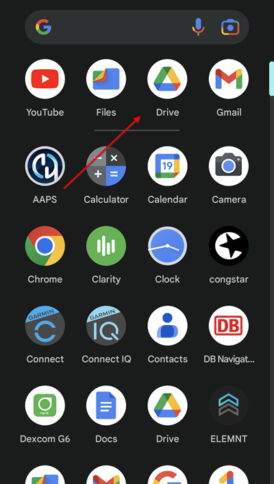

# Transfert et installation de AAPS sur votre smartphone

In the previous section, [building **AAPS**](../SettingUpAaps/BuildingAaps.md), you built the **AAPS** app (which is an .apk file) on a computer.

The next steps are to **transfer** the **AAPS** APK file (as well as other apps you may need, like BYODA, Xdrip+ or another CGM reciever app) to your Android smartphone, and then **install** the app(s).

Following installation of **AAPS** on the smartphone, you will then be able to move onto [**configuring the AAPS loop**](../SettingUpAaps/SetupWizard.md).

There are several ways to transfer the **AAPS** APK file from your computer to the smartphone. Nous détaillons ici deux de ces possibilités :

* Option 1 - Utilisez votre Google drive (Gdrive)
* Option 2 - Utiliser un câble USB

Veuillez noter que le transfert par email peut être compliqué, nous vous déconseillons cette méthode.

## Option 1. Utiliser Google Drive pour transférer des fichiers

Open [Google.com](https://www.google.com/) in your web browser and login to your Google Account.

Sur le coin supérieur droit, sélectionnez l'application Drive dans le menu Google.


Dans l'application Google Drive, faites un clic droit dans la zone libre en dessous des fichiers et dossiers et sélectionnez "Importer un fichier".


Vous devriez maintenant voir le fichier APK téléchargé sur Google Drive.


### Use the Google Drive app to execute the apk file for installation

Passez sur votre téléphone portable et lancez l'application Google Drive. Il s'agit d'une application installée par défaut, que vous retrouverez avec les autres applications Google ou en faisant une recherche sur le nom de l'application.



Lancez l'installation de l'APK en double-cliquant sur le nom de fichier dans l'application Google Drive sur le smartphone.


Si vous recevez une notification de sécurité vous indiquant que vous n'êtes pas autorisé.e à installer des applications depuis Google Drive pour le moment, veuillez l'autoriser temporairement. Pensez à le désactiver par la suite car cela représente un risque de sécurité si vous le laissez activé en permanence.


Une fois l'installation terminée, vous en avez terminé pour cette étape.

you should see the **AAPS** icon and be able to open the app.

```{warning}
**AVIS DE SÉCURITÉ IMPORTANT**
Avez-vous pensé à désactiver l'autorisation d'installation depuis Google Drive ?
```

Please go on with [configuring the AAPS loop](../SettingUpAaps/SetupWizard.md).

## Option 2. Utiliser un câble USB pour transférer des fichiers
The second way to transfer the AAPS apk file is with a  [USB cable](https://support.google.com/android/answer/9064445?hl=en).

Transférez le fichier depuis son emplacement sur votre ordinateur vers le dossier "Downloads" sur le téléphone.

Sur votre téléphone, vous devez autoriser l'installation à partir de sources inconnues. Explanations of how to do this can be found on the internet (_e.g._ [here](https://www.expressvpn.com/de/support/vpn-setup/enable-apk-installs-android/) or [here](https://www.androidcentral.com/unknown-sources)).

Une fois que vous avez transféré le fichier en le faisant glisser de votre ordinateur à votre smartphone, pour l'installer, ouvrez le dossier "Downloads" sur le téléphone, cliquez sur l'APK AAPS et sélectionnez "installer". You can then proceed to the next step, [Setup Wizard](../SettingUpAaps/SetupWizard.md), which will help you setup the **AAPS** app and loop on your smartphone.

Please go on with [configuring the AAPS loop](../SettingUpAaps/SetupWizard.md).