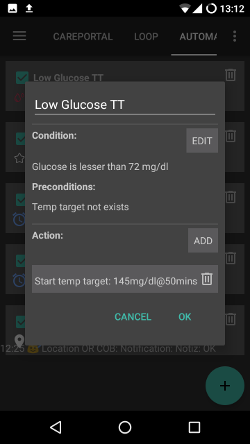
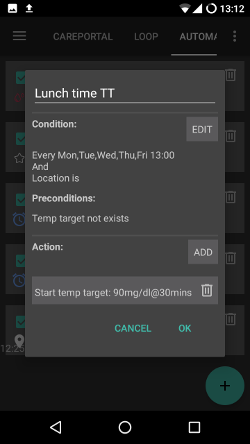

Automatisation
**************************************************

Qu'est-ce que l'Automatisation
==================================================
Pour des évènements identiques et fréquents, vous devrez peut-être toujours changer les mêmes paramètres. Pour éviter ce travail supplémentaires, vous pouvez essayer d'automatiser l'événement si vous pouvez le spécifier suffisamment bien et le laisser AndroidAPS le faire pour vous automatiquement. Par ex. lorsque votre Gly est trop faible, vous pouvez décider d'avoir automatiquement une cible temporaire haute. Ou si vous êtes à votre centre de fitness, vous activez automatiquement une cible temp. Avant d'utiliser l'Automatisation, vous devez être à l'aise avec l'utilisation des cibles temp. <./temptarget.html>`_ ou les changements de profil. 

Comment l’utiliser 
==================================================
Pour mettre en place une automatisation, vous devez lui donner un titre, sélectionner au moins une condition et une action. 

Remarque importante
--------------------------------------------------
**L'automatisation est toujours active lorsque vous désactivez la boucle !**

Veillez donc à désactiver les règles d'automatisation pendant ces moments si nécessaire. Vous pouvez le faire en décochant la case à gauche du nom de votre règle d'automatisation.

.. image:: ../images/Automation_ActivateDeactivate.png
  :alt: Activer et désactiver une règle d'automatisation

Généralités
--------------------------------------------------
Il y a des limites :

* La glycémie doit être comprise entre 72 et 270 mg/dl ou 4 et 15 mmol/l.
* Le pourcentage du profil doit être compris entre 70% et 130%.
* Il y a une durée limite de 5 min. entre les exécutions (et la première exécution).

**Soyez prudent :**

* **inférieur à -2 signifie : -3 et inférieur (-4, -10, etc)**
* **supérieur à -2 signifie : -1 et supérieur (0, 1, +10, etc)**

Condition
--------------------------------------------------
Vous pouvez choisir entre plusieurs conditions. Voici quelques explications, mais la plupart d'entre elles devraient être faciles à comprendre et elles ne sont pas toutes décrites ici :

* conditions de connexion : vous pouvez avoir plusieurs conditions et les connecter avec 

   * "Et"
   * "Ou"
   * "Ou exclusif" (qui signifie que si uniquement une (et une seule) des conditions s'applique, alors la ou les actions se produiront)
   
* Temps vs. Période répétitive

   * Temps = événement unique
   * Période répétitive = quelque chose qui arrive régulièrement (par ex. une fois par semaine, chaque jour ouvrable, etc)
   
* Localisation : dans le générateur de configuration (Automatisation), vous pouvez choisir le service de localisation que vous souhaitez utiliser :

  * Utiliser la localisation passive : AAPS ne prend la localisation que si d'autres applications la demandent
  * Utiliser la localisation par le réseau : Localisation de votre Wifi
  * Utiliser la localisition GPS (Attention ! Peut entrainer une consommation excessive de la batterie !)
  
Action
--------------------------------------------------
Vous pouvez choisir une ou plusieurs actions : 

* démarrer la cible temp 

   * doit être comprise entre 72 mg/dl et 270 mg/dl (4 mmol/l et 15 mmol/l)
   * ne fonctionne que s'il n'y a pas de cible temporaire en cours
   
* arrêter la cible temp
* notification
* pourcentage du profil

   * doit être comprise entre 70% et 130% 
   * ne fonctionne que si le pourcentage précédent est de 100%

Après avoir ajouté votre action, **n'oubliez pas de modifier les valeurs par défaut** pour répondre à vos besoins en cliquant sur les valeurs par défaut.
 
.. image:: ../images/Automation_Default_V2_5.png
  :alt: Automatisation defaut vs. choisir valeur

Bonnes pratiques
==================================================
* Lorsque vous commencez à utiliser l'automatisation ou que vous créez une nouvelle règle, ajoutez une notification jusqu'à ce que vous soyez certain que la règle fonctionne correctement.
* Observez les résultats de la règle.

Exemples
==================================================
Ce ne sont que des exemples, pas des conseils. Ne le reproduisez pas sans savoir ce que vous faites réellement ou pourquoi vous en avez besoin. Voir ci-dessous deux exemples avec des captures d'écran.

* Changement de profil pour vos activités quotidiennes (comme à l'école, gymnastique, week-end, journée de travail...) utilisant la géolocalisation, le wifi, l'heure, etc.
* Définir une cible temporaire d'activités en fonction de l'heure et de l'emplacement...
* Définir une Cible temporaire Repas imminent basée sur l'heure et la localisation...

Cible temp. Glycémie basse
--------------------------------------------------

Ceci est fait par une personne qui veut mettre automatiquement une cible temp. "hypo" quand elle a une hypoglycémie.

Cible Temp. heure du repas
--------------------------------------------------

  
Cet exemple est fait par une personne, qui a déjeune à la même heure pendant la semaine. S'il est à une certaine heure localisé à son lieu de repas, il met une cible temp. basse (repas imminent) en attendant le déjeuner. En raison de la connexion "Et", cela ne se produit que pendant une certaine heure et au bon emplacement. Donc cela ne fonctionne pas à tout autre moment à cet endroit, ou à ce moment là si la personne reste à la maison, ou si elle travaille plus longtemps. 

Utilisation incorrecte de l'automatisation
--------------------------------------------------
Comme tout système, l'Automatisation peut être utilisée de manière incorrecte. Cela pourrait entraîner des difficultés et même être dangereux pour votre santé. Des exemples d'utilisation incorrecte sont :

* Essayer de surcharger l'algorithme au lieu de l'utiliser simplement comme une aide (par ex. en changeant de profil au lieu d'ajuster le débit de basal, le G/I etc.)
* Régler le profil pour compenser la nourriture
* Mettre un profil sans durée
* Créer des règles à sens unique (par ex. faire quelque chose, mais ne pas annuler par une autre règle)
* Créer des règles à long terme

Alternatives
==================================================

Pour les utilisateurs avancés, il existe d'autres posibilités pour automatiser les tâches à l'aide de IFTTT ou d'une application Android tierce appelée Automate. Quelques exemples sont disponibles `ici <./automationwithapp.html>`_.
