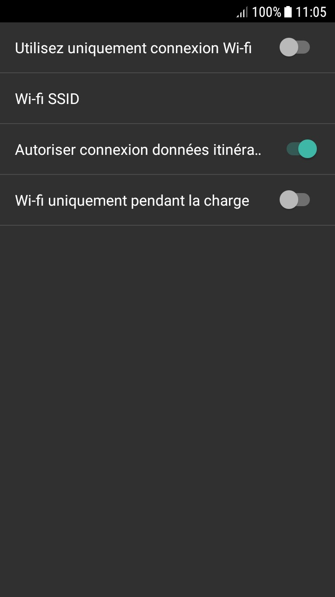
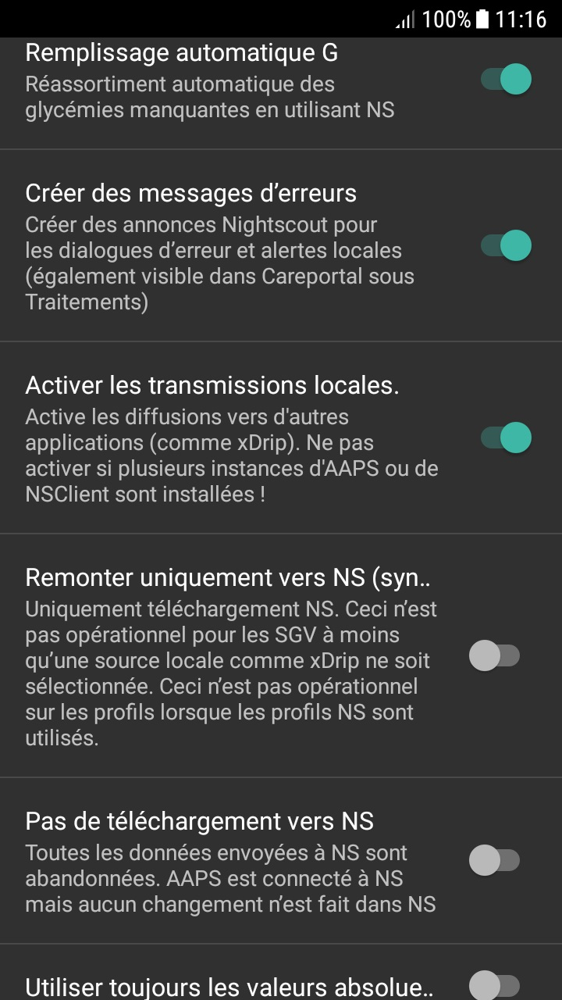

# Automatisation avec une application Android Automate tierce

**This article has been written before AndroidAPS version 2.5. There is an [automation plugin in AndroidAPS](./Automation.md) itself with AndroidAPS version 2.5. For some, this here might be still useful, but should only be used by advanced users.**

Comme AndroidAPS est un système à boucle fermée hybride, une certaine interaction avec l'utilisateur est nécessaire (par ex. dites à la boucle si vous marchez, mangez bientôt, restez couché sur le canapé...). Les entrées manuelles fréquentes peuvent être automatisées via des outils externes tels que Automate ou IFTTT pour étendre la fonctionnalité récente d'AndroidAPS.

## Application Android Automate

L'application gratuite Android™ Automate vous permet d'automatiser diverses tâches sur votre smartphone. Créez vos automatisations avec des diagrammes, faites que votre appareil change automatiquement les paramètres tels que Bluetooth, Wifi, NFC ou exécute des actions comme l'envoi de SMS, d'e-mail, en fonction de votre localisation, de l'heure du jour, ou de tout autre "déclencheur d'événement". Vous pouvez automatiser presque tout sur votre appareil, Automate même en charge les plug-ins conçus pour Tasker et Locale.

A l'aide de cet outil vous pouvez facilement créer des workflows pour traiter votre diabète à l'aide de plusieurs conditions selon le principe de 'si ... et ... et pas ..., alors fait ... et ...'. Il y a des milliers de possibilités que vous pouvez configurer.

Jusqu'à présent, il est **nécessaire de boucler via un profil Nightscout**, car Automate exécute les commandes via des requêtes HTTP directement dans votre site Web nightscout qui le synchronise ensuite avec votre application AndroidAPS.

**La boucle hors ligne (communication directe entre Automate et AndroidAPS) n'est pas encore prise en charge**, mais est techniquement possible. Il y aura peut-être une solution à l'avenir. Si vous avez trouvé un moyen de le faire, veuillez l'ajouter à cette documentation ou contacter un développeur.

### Exigences de base

#### Application Automate

Téléchargez Android Automate dans Google Play Store ou sur <https://llamalab.com/automate/> et installez la sur votre smartphone où AndroidAPS s'exécute.

Dans Automate, appuyez sur le menu hamburger en haut à gauche de l'écran > Settings > Cochez 'Run on system startup'. Cela exécutera automatiquement vos Workflows au démarrage du système.

#### AndroidAPS

Dans AndroidAPS appuyez sur le menu trois points en haut à droite de l'écran et accédez à Paramètres > NSClient > Paramètres de connexion > Décochez la case "Utiliser uniquement la connexion WiFi" et "Uniquement si en charge" comme Automate ne fonctionne que lorsque AndroidAPS a une connexion avec Nightscout.

Dans AndroidAPS appuyez sur le menu trois points en haut à droite de l'écran et accédez à Paramètres > NSClient > Paramètres avancés > Décochez 'Remonter uniquement vers NS (sync désactivée)' et 'Pas de téléchargement vers NS'.

Be aware of the [security issues](Nightscout-security-considerations) that might occure and be very careful if you are using an [Insight pump](Accu-Chek-Insight-Pump-settings-in-aaps).

### Exemples de Scripts

#### Exemple 1: Si une activité (par ex. marche ou course) est détectée, définir une CT élevée. Et si l'activité se termine, attendre 20 minutes puis annuler la CT

Ce script écoutera les capteurs du smartphone (pédomètre, capteur de gravité...) qui détecteront le comportement de l'activité. Si une activité récente comme la marche, la course ou du vélo est détectée, alors Automate définira une cible temp élevée d'une durée spécifiée par l'utilisateur. Si l'activité se termine, votre smartphone le détectera, il attendra 20 minutes, puis il fixera la cible à la valeur normale du profil.

Téléchargez le script Automate <https://llamalab.com/automate/community/flows/27808>.

Éditez le script en appuyant sur le crayon > Script

Personnaliser le script en fonction de vos souhaits comme ceci :

1. = Définir CT élevée
2. = Revenir à la cible normale 20 minutes après la fin de l'activité

1 

2 

URL de la requête : Votre URL-NS se terminant par /api/v1/treatments.json (par ex. https://my-cgm.herokuapp.com/api/v1/treatments.json)

Contenu de la requête :

* targetTop / targetBottom: La valeur de la CT haute (la valeur haute et basse doivent être les mêmes)
* duration: La durée de la CT haute (Après cette durée, il reviendra à la cible du profil standard sauf si l'activité se poursuit). 
* secret : votre hachage SHA1 de l'API. Ce n'est PAS votre clé api ! Vouc pouvez convertir votre clé API au format SHA1 sur <http://www.sha1-online.com/>

Sauvegarde : Appuyez sur 'Save' après chaque modification de bloc puis sur le flèche de retour arrière

Démarrer le script : Cliquez sur le bouton Start

#### Exemple 2 : Si xDrip+ envoie une alerte glycémie haute, alors définir une CT basse pendant xxx minutes.

Ce script va écouter le canal de notification xDrip+. Si une alerte glycémie haute spécifiée par l'utilisateur est déclenchée, alors Automate définira une cible temp basse ayant un niveau et une durée spécifiée par l'utilisateur. Après un certain temps, une autre alerte prolongera si nécessaire la durée de la CT faible.

##### xDrip+

Vous devez d'abord ajouter une alerte haute dans xDrip + comme ceci :

Nom de l'alerte : (Faire attention à lui !) Ce nom est essentiel pour déclencher le script. Il doit être clair et ne pas être similaire à tous les autres noms d'alertes. Par exemple : '180alarm' ne doit pas exister à côté d'une alerte '80alarm'.

Seuil : valeur GLY qui doit déclencher l'alerte élevé.

Snooze par défaut : renseignez la durée souhaitée de votre CT ici, comme cela si après cette durée l'alerte revient à nouveau, cela prolongera peut-être la durée du CT faible.

##### Automate

Ensuite, téléchargez le script d'automatisation <https://llamalab.com/automate/community/flows/27809>.

Éditez le script en appuyant sur le crayon > Script

Personnaliser le script en fonction de vos souhaits comme ceci :

Dans le déclencheur 'Notification posted?', vous devez mettre dans 'Title' le nom de l'alerte xDrip+ qui doit déclencher le script et ajouter un caractère * avant et après ce nom.

URL de la requête : Votre URL-NS se terminant par /api/v1/treatments.json (par ex. https://my-cgm.herokuapp.com/api/v1/treatments.json)

Contenu de la requête :

* targetTop / targetBottom : la valeur de la CT faible (les 2 doivent avoir la même valeur)
* duration : la durée de votre CT faible (après cette durée AAPS reviendra à la cible standard de votre profil). Il est recommandé de mettre la même valeur que 'Snooze par défaut' de l'alerte xDrip+
* secret : votre hachage SHA1 de l'API. Ce n'est PAS votre clé api ! Vouc pouvez convertir votre clé API au format SHA1 sur <http://www.sha1-online.com/>

Sauvegarde : Appuyez sur 'Save' après chaque modification de bloc puis sur le flèche de retour arrière

Démarrer le script : Cliquez sur le bouton Start

#### Exemple 3: À vous de l'ajouter !!!

Veuillez ajouter d'autres scripts en remontant vos fichiers .flo file dans la communauté Automate (sous le mot clé 'Nightscout') et décrivez les ici en faisant un [Pull Request sur le répertoire AndroidAPSdocs](../make-a-PR.md).

## IF This, Then That (IFTTT)

N'hésitez pas à ajouter une aide sur comment faire avec un PR...