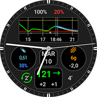
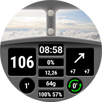
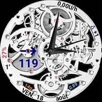
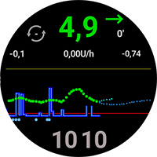

# Site d'échange pour les cadrans personnalisés

Here you can download Zip-Files with custom watchfaces users have prepared and want to share with you.

The Zip-Files can be uploaded in the folder "**[_static/ExchangeSiteCustomWatchfaces](https://github.com/openaps/AndroidAPSdocs/tree/master/docs/_static/ExchangeSiteCustomWatchfaces)**" via a Pull Request into GitHub as usual.

Lors de la fusion du "Pull Request", l'équipe de documentation extraira le fichier image et le nom du cadran du fichier Zip, et ajoutera le lien de téléchargement à la liste ci-dessous.

|                                                                                                                                                                                                                                                                     |                                                                                                                                                                                                                                                                 |                                                                                                                                                                                                                                                                    |
| ------------------------------------------------------------------------------------------------------------------------------------------------------------------------------------------------------------------------------------------------------------------- | --------------------------------------------------------------------------------------------------------------------------------------------------------------------------------------------------------------------------------------------------------------- | ------------------------------------------------------------------------------------------------------------------------------------------------------------------------------------------------------------------------------------------------------------------ |
| [  **AAPS V2**](https://github.com/openaps/AndroidAPSdocs/raw/refs/heads/master/docs/_static/ExchangeSiteCustomWatchfaces/AAPS_V2.zip)                                       | [  **AAPS**](https://github.com/openaps/AndroidAPSdocs/raw/refs/heads/master/docs/_static/ExchangeSiteCustomWatchfaces/AAPS.zip)                                               | [  **AIMICO**](https://github.com/openaps/AndroidAPSdocs/raw/refs/heads/master/docs/_static/ExchangeSiteCustomWatchfaces/AIMICO-V1_1.zip)                                |
| [  **Analog G-Watch**](https://github.com/openaps/AndroidAPSdocs/raw/refs/heads/master/docs/_static/ExchangeSiteCustomWatchfaces/Analog_G-Watch.zip)           | [  **Cockpit**](https://github.com/openaps/AndroidAPSdocs/raw/refs/heads/master/docs/_static/ExchangeSiteCustomWatchfaces/Cockpit.zip)                                   | [  **Digital G-Watch**](https://github.com/openaps/AndroidAPSdocs/raw/refs/heads/master/docs/_static/ExchangeSiteCustomWatchfaces/Digital_G-Watch.zip)      |
| [  **DigitalBigGraph**](https://github.com/openaps/AndroidAPSdocs/raw/refs/heads/master/docs/_static/ExchangeSiteCustomWatchfaces/DigitalBigGraph_v1.5.zip) | [  **Gears**](https://github.com/openaps/AndroidAPSdocs/raw/refs/heads/master/docs/_static/ExchangeSiteCustomWatchfaces/Gears.zip)                                           | [  **Gota**](https://github.com/openaps/AndroidAPSdocs/raw/refs/heads/master/docs/_static/ExchangeSiteCustomWatchfaces/Gota_v2.4.zip)                                             |
| [  **LuckyLoopKoeln**](https://github.com/openaps/AndroidAPSdocs/raw/refs/heads/master/docs/_static/ExchangeSiteCustomWatchfaces/LuckyLoopKoeln.zip)           | [  **P-Zero**](https://github.com/openaps/AndroidAPSdocs/raw/refs/heads/master/docs/_static/ExchangeSiteCustomWatchfaces/pzero_v1.0.zip)                              | [  **PinkFloydTheWall**](https://github.com/openaps/AndroidAPSdocs/raw/refs/heads/master/docs/_static/ExchangeSiteCustomWatchfaces/PinkFloydTheWall.zip) |
| [  **Robby watchface**](https://github.com/openaps/AndroidAPSdocs/raw/refs/heads/master/docs/_static/ExchangeSiteCustomWatchfaces/Robby_watchface.zip)       | [  **SimpleDigital**](https://github.com/openaps/AndroidAPSdocs/raw/refs/heads/master/docs/_static/ExchangeSiteCustomWatchfaces/SimpleDigital_v1.3.zip) | [  **SteamPunk**](https://github.com/openaps/AndroidAPSdocs/raw/refs/heads/master/docs/_static/ExchangeSiteCustomWatchfaces/SteamPunk.zip)                              |
|                                                                                                                                                                                                                                                                     |                                                                                                                                                                                                                                                                 |                                                                                                                                                                                                                                                                    |
