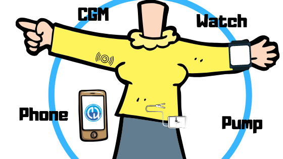

# Welcome to the AAPS documentation



AAPS is an open source app for people living with insulin-dependent diabetes that acts as an artificial pancreas system (APS) on Google Android smartphones. Les principaux composants sont différents algorithmes logiciels de openAPS qui visent à reproduire ce que fait un pancréas vivant : maintenir la glycémie dans des limites de santé en utilisant un dosage automatisé d'insuline. De plus, il vous faut une pompe à insuline compatible approuvée FDA/CE et un capteur de Mesure de Glycémies en Continu (MGC).

The app does *not* use self-learning artificial intelligence. Instead, the calculations of AAPS are based on the individual dosage algorithm and carbohydrate intake the user manually puts into their treatments profile, but they are verified by the system for safety reasons.

L'application n'est pas fournie dans Google Play - vous devez la compiler vous même à partir du code source pour des raisons juridiques.

```{admonition} Ask for help - Writing Docs
:class: note

Please don't be shy, we urgently *need* support in creating the documentation.

A pull request to edit the documentation is relatively simple to create. Vous ne pouvez rien casser. Il y a des procédures pour la publication.

A 3 minute video which explains how to edit the docs via PR is available [here](https://www.youtube.com/watch?v=Vo4L6YYxWak).

```

## Comment lire la documentation ?

Nous avons rédigé ce paragraphe de la documentation en particulier pour ceux qui sont nouveaux dans le concept du Do-It-Yourself-APS (Système de Pancreas Artificiel fait soi même) afin de mieux vous montrer comment faire connaissance avec les informations que nous considérons comme les plus importantes, surtout en ce qui concerne la compréhension des raisons qui justifient les "limites" mises en place lorsque vous commencez votre premier voyage AAPS. These safety limits have been developed over many years by observations of the inadvertent mistakes that new users are most likely to make when first learning to set up, build, and then successfully loop with AAPS - as most often those mistakes occur simply because the user was so excited to get started using the system that they may have forgotten to sit down and dedicate the time needed to understand the information within this documentation thoroughly. Nous sommes tous passés par là!

Certes, l'approche "tout lire" a du mérite et est certainement bonne. Cependant, Il n’est pas rare que les nouveaux arrivants soient rapidement submergés par le volume et la variété des informations qu’ils sont censés comprendre en même temps! Ainsi, ces prochaines paragraphes sont destinées à mettre en place les fondations les plus importantes de la connaissance nécessaire pour gérer avec succès votre propre installation choisie le plus facilement possible. Les nouveaux utilisateurs peuvent se référer à ce guide lorsqu'ils rencontrent des aspects du système avec lesquels ils ne sont pas encore familiers; et pour se rappeler où aller dans la documentation afin de trouver des informations plus détaillées si nécessaire. It is also important to lay out the capabilities of AAPS in an up-front manner, as sometimes it can be disappointing to discover in the middle of reading the documentation that certain necessary tools are currently not available for use (due to constraints on which types of insulin pumps or CGMs are available in some countries vs. other countries etc.) or simply offers less/different functionality than first assumed. Enfin, il est important d'admettre que de nombreux points liés aux retours d'expérience dans cette documentation ne deviennent pertinents que lorsque vous commencetrz à utiliser AAPS en temps réel. Just as it is nearly impossible to learn to play a sport perfectly just by reading about the rules, it takes a combination of first learning the foundations of the rules for safely operating AAPS and then committing the time learning how best to apply those rules as you navigate through the steps of looping with AAPS.

The [Getting started](Getting-Started/Safety-first.md) subsection is a must read to understand the general concept of what an artificial pancreas system is designed to do; and is especially pertinent for users of AAPS.

The subsection [What do I need?](Module/module.md) specifies the CGMs (Continuous Glucose Monitors) and insulin pumps which are are available for use with AAPS. This subsection is important to understand so that your AAPS system can be assembled and built correctly the first time around and will function well in real world situations.

La section [Où chercher de l'aide ?](Where-To-Go-For-Help/Connect-with-other-users.html) devrait vous aider à vous orienter vers les meilleurs endroits pour aller chercher de l'aide en fonction de votre expérience avec AAPS. C'est très important pour que vous ne vous sentiez jamais seuls, surtout au début, et pour que vous puissiez entrer en contact avec d'autres utilisateurs aussi rapidement que possible, clarifier les questions et résoudre les écueils habituels le plus vite possible. Experience shows that a lot of people are already using AAPS successfully, but everyone has a question at some point that they couldn't solve on their own. Ce qui est bien, c'est qu'en raison du grand nombre d'utilisateurs, les temps de réponse aux questions sont généralement très rapides, généralement seulement quelques heures. N'ayez pas peur de demander de l’aide, car il n’y a pas de question stupide! Nous encourageons les utilisateurs, quelque soit leur niveau, à poser autant de questions qu’ils jugent nécessaire pour les aider à fonctionner en toute sécurité. Il suffit juste d'essayez.

Dans la section [Glossaire](Getting-Started/Glossary.md) nous avons compilé une liste des acronymes (ou abbréviations) utilisés dans AAPS. Par exemple, pour savoir ce que signifie les termes SI ou CT, parmi les termes les plus courrants.

For parents who want to build AAPS for their children, we recommend the subsection [AAPS for children](Children/Children.md) , as there you will find more advanced information specifically tailored for learning the extra steps necessary in order to remotely control your child's AAPS app as well as a more comprehensive safety profile as compared to adults. You need to be able to support your children and understand the all the advanced concepts that AAPS offers to help you succeed.

Now that you have a solid understanding of the concepts that AAPS uses, know where to go for the the necessary tools to build your APS and are familiar with where to get help in case of an emergency, it is the right time to start building the app! The subsection [How to install AAPS?](Installing-AAPS/Building-APK.md) shows you this in detail. Étant donné que les exigences sont très différentes de celles que vous avez pu mettre en place dans le passé, nous vous recommandons de suivre vraiment toutes les instructions, pas à pas, les premières fois que vous construisez l'application, afin que vous ayez une meilleure idée de la façon dont le processus de construction de l'application est censé se comporter lorsque toutes les étapes sont suivies exactement. N'oubliez pas de prendre votre temps. Plus tard, cela ira très rapidement lorsque vous devrez reconstruire l'application pour une nouvelle version. De cette façon, vous aurez plus de chances de voir quand quelque chose ne va pas comme prévu avant que trop d'étapes ne soient effectuées. It is important to save the your keystore file (.jks file used to sign your app) in a safe place, so that you can always use that exact same keystore file and password each and every time you are asked to create a new updated version of AAPS, as this file is what makes sure that each new version of the app "remembers" all the information that you have provided to it in previous versions of the app and thus ensure that the updates will go as smoothly as possible. En moyenne, vous pouvez considérer qu'il y aura une nouvelle version et 2 à 3 mises à jour par an. Ce nombre est basé sur le retour d'expérience et peut changer à l'avenir. Mais nous voulons au moins vous donner une estimation sur ce à quoi vous pouvez vous attendre. When you are more experienced at building updated AAPS app versions all the steps that are required in building an updated app will only take 15-30 minutes, on average. Cependant, au début, il peut y avoir une période d'apprentissage assez difficile, car ces étapes ne sont pas toujours considérées comme intuitives par les nouveaux utilisateurs! Donc, ne soyez pas frustré si vous trouvez qu'il vous faut une demi-journée ou une journée entière avec l'aide de la communauté avant d'arriver à faire vos premières mise à jour. Si vous trouvez que vous devenez très frustré, prenez juste des courtes pauses et régulièrement; après un tour du pâté de maisons ou deux, vous trouverez que vous serez plus à même d'aborder le problème à nouveau. We have also compiled a list of questions and answers to most of the typical errors that are likely to occur the first few updates located within the FAQs section; as well as within "How to install AAPS?" that provides additional information in the subsection "Troubleshooting".

The subsection [Component Setup](Configuration/BG-Source.md) explains how to properly integrate each of the various different separate component parts into AAPS, as well as how to set them up to work as seamlessly as possible together. All components are listed under the separate sections: CGM/FGM, xDrip Settings, Pumps, Phones, Nightscout setup, and Smartwatches. The sensor (BG) values and control of the insulin pump are particularly important information to understand. The subsection [Configuration](Configuration/BG-Source.md) describes the best pump configurations to use in AAPS.

This is followed by a particularly important subsection [AAPS Usage](Getting-Started/Screenshots.md), in which you are slowly introduced to the full usage of what AAPS has to offer via a safe and carefully calibrated step-by-step gradual process designed to make sure that you/your child are thoroughly familiar and comfortable navigating all the different levels and menu configurations before graduating on the next phase, each commonly referred to as the next Objective, until you are have enough experience to begin using the more advanced options available within the app. These Objectives are specially designed in such a way that will gradually unlock more possibilities of AAPS and switch from Open Loop to Closed Loop.

After that there is a subsection [General Hints](Usage/Timezone-traveling.md) with e.g. information on how to deal with the crossing of time zones as well as knowing what to do during the Spring Forward - Fall Back daylight saving time changes which will occur twice a year while using AAPS.

There is a subsection for the [clinicians](Resources/clinician-guide-to-AAPS.md) who have expressed interest in open source artificial pancreas technology such as AAPS, or for patients who want to share such information with their clinicians.

Finally, in the subsection [How to help?](make-a-PR.md) we would like to provide you with information so that you are able to suggest small or larger changes to the documentation yourself and work together with us on the documentation. We further need support for [translation of the documentation](translations.md) By the way, it also very helpful for everyone if you could provide links to the corresponding documentation (or screenshots of where the links are located within the Documentation if you are not familiar with how to send a link) when answering questions from other users. That way the correct information can easily be located again should other users also be trying to find answers to the same types of questions in the future.

(index-translation-help-needed)=

```{admonition} Ask for help - Translators Neeeded!!!
:class: note

The documentation is written in English and translated in different languages. We are searching help by the translation of a) the app and b) the documentation.

The translation process is explained [here](translations.md).

The state of the translations per language for app and documentation can be found [here](./Administration/stateTranslations.md).

```

```{toctree}
:caption: Change language

Change language <./changelanguage.md>

```

```{toctree}
:caption: Getting started

Safety first <./Getting-Started/Safety-first.md>

What is a closed loop system <./Getting-Started/ClosedLoop.md>

What is a closed loop system with AAPS <./Getting-Started/WhatisAndroidAPS.md>

Docs updates & changes <./Getting-Started/WikiUpdate.md>

```

(index-what-do-i-need)=

```{toctree}
:caption: What do I need

CGM/FGM choices <./Configuration/BG-Source.md>

Pump choices <./Getting-Started/Pump-Choices.md>

Module <./Module/module.md>

```

```{toctree}
:caption: How to Install AAPS

Building the APK <./Installing-AndroidAPS/Building-APK.md>

Update to a new version or branch <./Installing-AndroidAPS/Update-to-new-version.md>

Hints and Checks after update to AAPS 3.0<./Installing-AndroidAPS/update3_0.md>

Checks after update to AAPS 2.7 <./Installing-AndroidAPS/update2_7.md>

Install git <./Installing-AndroidAPS/git-install.md>

Troubleshooting Android Studio <./Installing-AndroidAPS/troubleshooting_androidstudio.md>

Release notes <./Installing-AndroidAPS/Releasenotes.md>

Dev branch <./Installing-AndroidAPS/Dev_branch.md>

```

(index-component-setup)=

```{toctree}
:caption: Component Setup

CGM/FGM <./Configuration/BG-Source.md>

xDrip Settings <./Configuration/xdrip.md>

Pump choices <./Getting-Started/Pump-Choices.md>

Phones <./Hardware/Phoneconfig.md>

Nightscout setup <./Installing-AndroidAPS/Nightscout.md>

Smartwatch  <./Hardware/Smartwatch.md>

```

(index-configuration)=

```{toctree}
:caption: Configuration

Config builder <./Configuration/Config-Builder.md>

Preferences <./Configuration/Preferences.md>

```

```{toctree}
:caption: AAPS Usage

AAPS screens <./Getting-Started/Screenshots.md>

Objectives <./Usage/Objectives.md>

OpenAPS features <./Usage/Open-APS-features.md>

COB calculation <./Usage/COB-calculation.md>

Sensitivity detection <./Configuration/Sensitivity-detection-and-COB.md>

Profile switch <./Usage/Profiles.md>

Temp-targets <./Usage/temptarget.md>

Extended carbs <./Usage/Extended-Carbs.md>

Automation <./Usage/Automation.md>

Careportal (discontinued) <./Usage/CPbefore26.md>

Open Humans Uploader <./Configuration/OpenHumans.md>

Automation with 3rd party apps <./Usage/automationwithapp.md>

Android auto <./Usage/Android-auto.md>

```

```{toctree}
:caption: General Hints

Crossing timezones with pumps <./Usage/Timezone-traveling.md>

Accessing logfiles <./Usage/Accessing-logfiles.md>

Accu-Chek Combo tips for basic usage <./Usage/Accu-Chek-Combo-Tips-for-Basic-usage.md>

Export/Import Settings <./Usage/ExportImportSettings.md>

xDrip engineering mode <./Usage/Enabling-Engineering-Mode-in-xDrip.md>

```

```{toctree}
:caption: AAPS for children

Remote monitoring <./Children/Children.md>

SMS commands <./Children/SMS-Commands.md>

Profile helper <./Configuration/profilehelper.md>

```

```{toctree}
:caption: Troubleshooting

Troubleshooting <./Usage/troubleshooting.md>

Nightscout client <./Usage/Troubleshooting-NSClient.md>

```

```{toctree}
:caption: FAQ

FAQ <./Getting-Started/FAQ.md>
```

```{toctree}
:caption: Glossary

Glossary <./Getting-Started/Glossary.md>
```

```{toctree}
:caption: Where to go for help

Useful resources to read before you start <./Where-To-Go-For-Help/Background-reading.md>

Where to go for help <./Where-To-Go-For-Help/Connect-with-other-users.md>

Docs updates & changes <./Getting-Started/WikiUpdate.md>

```

```{toctree}
:caption: For Clinicians

For Clinicians <./Resources/clinician-guide-to-AndroidAPS.md>
```

```{toctree}
:caption: How to help

How to help <./Getting-Started/How-can-I-help.md>

How to translate the app and docs <./translations.md>

State of translations <./Administration/stateTranslations.md>

How to edit the docs <./make-a-PR.md>

```

```{toctree}
:caption: Sandbox

Sandbox <./Sandbox/sandbox1.md>
```

```{note}
**Disclaimer And Warning**

- All information, thought, and code described here is intended for informational and educational purposes only. Nightscout ne fait actuellement aucune tentative de conformité à la confidentialité HIPAA. Use Nightscout and AAPS at your own risk, and do not use the information or code to make medical decisions.
- Use of code from github.com is without warranty or formal support of any kind. Veuillez consulter la LICENCE de ce référentiel pour plus de détails.
- All product and company names, trademarks, servicemarks, registered trademarks, and registered servicemarks are the property of their respective holders. Leur utilisation est à titre informatif et n'implique aucune affiliation avec eux ni aucune approbation de leur part.

Please note - this project has no association with and is not endorsed by: [SOOIL](<https://www.sooil.com/eng/>), [Dexcom](<https://www.dexcom.com/>), [Accu-Chek, Roche Diabetes Care](<https://www.accu-chek.com/>) or [Medtronic](<https://www.medtronic.com/>)

```
