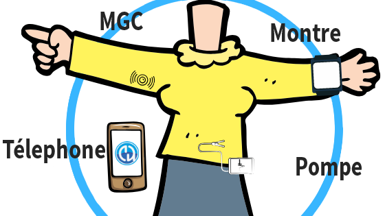

Bienvenue dans la documentation de AndroidAPS
==================================================

AndroidAPS est une application open source pour les personnes vivant avec un diabète insulino-dépendant et qui agit comme un pancréas artificiel (APS) sur les smartphones Google Android. Les principaux composants sont différents algorithmes logiciels de openAPS qui visent à reproduire ce que fait un pancréas vivant : maintenir la glycémie dans des limites de santé en utilisant un dosage automatisé d'insuline. De plus, il vous faut une pompe à insuline compatible approuvée FDA/CE et un capteur de Mesure de Glycémies en Continu (MGC). 

L'application n'utilise PAS d'auto-apprentissage par de l'intelligence artificielle. A la place, les calculs d'AndroidAPS sont basés sur un algorithme de dosage individuel et les apports en glucides que l'utilisateur renseigne manuellement dans son profil de traitement, mais ces informations sont vérifiés par le système pour des raisons de sécurité. 

L'application n'est pas fournie dans Google Play - vous devez la compiler vous même à partir du code source pour des raisons juridiques.

Les principaux composants sont :

Pour plus de détails, lisez la suite ici.

Pour commencer
--------------------------------------------------
.. toctree::
   :maxdepth: 1
   :glob:
   
   Sécurité avant tout <./Getting-Started/Safety-first.rst>
   What is a closed loop system? <./Getting-Started/ClosedLoop.rst>
   Qu'est-ce qu'un système de boucle fermé avec AndroidAPS ? <./Getting-Started/WhatisAndroidAPS.rst>  
   Wiki mises à jour et modifications <./Getting-Started/WikiUpdate.rst>
   
   
What do I need? 
--------------------------------------------------
.. toctree::
   :maxdepth: 1
   :glob:
   
   Composants <./Module/module.rst>
   Exemple de configuration <./Getting-Started/Sample-Setup.md>

   
Comment installer AndroidAPS
--------------------------------------------------
.. toctree::
   :maxdepth: 1
   :glob:

   Construire l'APK <./Installing-AndroidAPS/Building-APK.md>
   Télécharger la nouvelle version ou branche <./Installing-AndroidAPS/Update-to-new-version.md>
   Vérifications à faire après la mise à jour vers AAPS 2.7 <./Installing-AndroidAPS/update2_7.rst>
   Installer git <./Installing-AndroidAPS/git-install.rst>
   Dépannage d'Android Studio <./Installing-AndroidAPS/troubleshooting_androidstudio.rst>
   Notes de versions <./Installing-AndroidAPS/Releasenotes.rst>
   Branches de développement <./Installing-AndroidAPS/Dev_branch.md>
   
   
Configuration des composants
--------------------------------------------------
.. toctree::
   :maxdepth: 1
   :glob:
   
   MGC/MGF <./Configuration/BG-Source.rst>
   Paramètres xDrip <./Configuration/xdrip.md>
   Pompes à insuline <./Hardware/pumps.rst>
   Smartphones <./Hardware/Phoneconfig.rst>
   Paramètres Nightscout <./Installing-AndroidAPS/Nightscout.md>
   Montres connectées  <./Hardware/Smartwatch.rst>
   

Générateur de configuration 
--------------------------------------------------
.. toctree::
   :maxdepth: 1
   :glob:
   
   Générateur de configuration <./Configuration/Config-Builder.md>
   Préférences <./Configuration/Preferences.rst>
   
   
Utilisation d'AndroidAPS
--------------------------------------------------
.. toctree::
   :maxdepth: 1
   :glob:
    
   Les écrans d'AndroidAPS <./Getting-Started/Screenshots.md>
   Objectifs <./Usage/Objectives.rst>
   Fonctionnalités d'OpenAPS <./Usage/Open-APS-features.md>   
   Calcul des GA <./Usage/COB-calculation.rst>
   Estimation de la Sensibilité <./Configuration/Sensitivity-detection-and-COB.md>
   Changement de profil <./Usage/Profiles.md>
   Cibles Temporaires <./Usage/temptarget.md>   
   Glucides étendus <./Usage/Extended-Carbs.rst>
   Automatisation <./Usage/Automation.rst>
   Careportal (supprimé) <./Usage/CPbefore26.rst>
   Téléversement Open Humans <../Configuration/OpenHumans.rst>
   Automatisation avec des applications tierces <./Usage/automationwithapp.md>
   Android auto <./Usage/Android-auto.md>  
 
Conseils généraux 
--------------------------------------------------
.. toctree::
   :maxdepth: 1
   :glob:
   
   Fuseaux horaires <./Usage/Timezone-traveling.md>
   Acces aux fichiers journaux <./Usage/Accessing-logfiles.md>
   Conseils d'utilisation de l'Accu-Chek Combo <./Usage/Accu-Chek-Combo-Tips-for-Basic-usage.md> 
   Export/Import des paramètres <./Usage/ExportImportSettings.rst>
   

AndroidAPS pour les enfants
--------------------------------------------------
.. toctree::
   :maxdepth: 1
   :glob:
   
   Surveillance à distance <./Children/Children.rst>
   Commandes SMS <./Children/SMS-Commands.rst>
   

Dépannage
--------------------------------------------------
.. toctree::
   :maxdepth: 1
   :glob:
  
   Dépannage <./Usage/troubleshooting.rst>
   

Questions fréquentes 
--------------------------------------------------
.. toctree::
   :maxdepth: 1
   :glob:
  
   Questions fréquentes <./Getting-Started/FAQ.md>

   
Glossaire
--------------------------------------------------
.. toctree::
   :maxdepth: 1
   :glob:
  
   Glossaire <./Getting-Started/Glossary.md>
  

Où chercher de l'aide 
--------------------------------------------------
.. toctree::
   :maxdepth: 1
   :glob:

   Ressources utiles à lire avant de commencer <./Where-To-Go-For-Help/Background-reading.md>
   Où chercher de l'aide <./Where-To-Go-For-Help/Connect-with-other-users.md>
   Wiki mises à jour et modifications <./Getting-Started/WikiUpdate.rst>

Pour les professionnels de santé
--------------------------------------------------
.. toctree::
   :maxdepth: 1
   :glob:
            
   Pour les professionnels de santé <./Resources/clinician-guide-to-AndroidAPS>

Comment aider
--------------------------------------------------
.. toctree::
   :maxdepth: 1
   :glob:

   Comment aider <./Getting-Started/How-can-I-help.md>
   Comment traduire l'application et la documentation wiki <./translations.md>
   Comment éditer le wiki <./make-a-PR>

.. note:: 
	**Avertissement**

	* Toutes les informations, pensées et codes décrits ici sont destinés à des fins d'information et d'éducation uniquement. Nightscout ne fait actuellement aucune tentative de conformité à la confidentialité HIPAA. Utilisez Nightscout et AndroidAPS à vos propres risques et n'utilisez pas les informations ni le code pour prendre des décisions médicales.

	* L'utilisation du code de github.com est sans garantie ni support formel d'aucune sorte. Veuillez consulter la LICENCE de ce référentiel pour plus de détails.

	* Tous les noms de produits et de sociétés, marques commerciales, marques de service, marques déposées,  sont la propriété de leurs détenteurs respectifs. Leur utilisation est à titre informatif et n'implique aucune affiliation avec eux ni aucune approbation de leur part.

	A noter - ce projet n'a aucun lien avec, et n'est pas approuvé par : `SOOIL <http://www.sooil.com/eng/>`_, `Dexcom <http://www.dexcom.com/>`_, `Accu-Chek, Roche Diabetes Care <http://www.accu-chek.com/>`_ ou `Medtronic <http://www.medtronic.com/>`_
