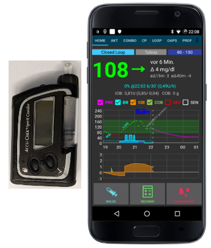

# Accu-Chek Combo

**יישום זה הוא חלק מפתרון "עשה זאת בעצמך", הוא אינו מוצר מדף וככזה הוא דורש קריאה מעמיקה, לימוד והבנה של המערכת, לרבות אופן השימוש בה. היישום לא יחליף אותך בניהול הסוכרת, אלא יאפשר לך לשפר את איזון רמת הסוכר ואיכות החיים שלך, במידה והנך נכון להשקיע את הזמן הנדרש לכך. אל תמהרו יותר מידי. אפשרו לעצמכם זמן ללמוד. האחריות על השימוש במערכת היא עליכם בלבד.**

(hardware-requirements)=

## דרישות חומרה

- משאבת Accu-Check Combo של חברת Roche (אין חשיבות לגרסת ה-firmware, כולן עובדות היטב)
- מכשיר Smartpix או Realtyme עם תוכנת 360 Configuration לקביעת הגדרות המשאבה. (חברת Roche שולחת מכשיר Smartpix ותוכנה ללקוחותיה לפי דרישה.)
- מכשיר טלפון סלולרי מתאים: טלפון אנדרואיד עם מערכת הפעלה LineageOS 14.1 (לשעבר CyanogenMod) או מערכת הפעלה Android 8.1 Oreo. החל מ-AndroidAPS 3.0 אנדרואיד 9 הינו חובה. ראו [הערות פרסום](https://androidaps.readthedocs.io/en/latest/Installing-AndroidAPS/Releasenotes.html#android-version-and-aaps-version) לפרטים.
- במידה ונעשה שימוש ב-LineageOS 14.1 יש לוודא גרסת יוני 2017 או מאוחרת יותר, מאחר ושילוב משאבת Combo לבלוטוס נכלל ממעוד זה. 
- רשימת מכשירי טלפון ניתן למצוא כאן: [AAPS Phones](https://docs.google.com/spreadsheets/d/1gZAsN6f0gv6tkgy9EBsYl0BQNhna0RDqA9QGycAqCQc/edit).
- יש לשים לב - זו אינה רשימת טלפונים תואמים מלאה והיא כוללת התרשמות וחוו"ד שהועלו ע"י משתמשים. לאחר צבירת נסיון, חשוב להעלות את המסקנות והתובנות לגבי המכשיר שלך לטובת המשתמשים הבאים (הפרוייקט הזה ושכמותו נבנה ונסמך על רצון ונכונות המשתמשים "להעביר את זה הלאה").
- היו מודעים לכך שאמנם Android 8.1 תומך בתקשורת עם קומבו, ישנן עדיין סוגיות עם AAPS ב-8.1.
- משתמשים מתקדמים יכולים לבצע צימוד עם טלפון שעבר ROOT ולהעביר לטלפון ROOT אחר לשימוש עם ruffy/AAPS. כך מתאפשר שימוש בטלפונים עם אנדרואיד <8.1 אך זה לא נבדק באופן נרחב: https://github.com/gregorybel/combo-pairing/blob/master/README.md

## מגבלות

- Extended bolus and multiwave bolus are not supported (see [Extended Carbs](../Usage/Extended-Carbs.md) instead).
- רק פרופיל בזאלי אחד נתמך. 
- הגדרת פרופיל בזאלי מעבר לאחד, שימוש בבולוסים מושהים או בולוסים מרובי גלים מגוף המשאבה מפריעים למינונים הבזאליים הזמניים של הלולאה ומאלצת אותה לעבור למצב "השהיה עקב ערך סוכר נמוך" למשך 6 שעות מכיוון שהלולאה לא יכולה לפעול בבטחה בתנאים אלה.
- It's currently not possible to set the time and date on the pump, so [daylight saving time changes](../Usage/Timezone-traveling.md#accu-chek-combo) have to be performed manually (you may disable the phone's automatic clock update in the evening and change it back in the morning together with the pump clock to avoid an alarm during the night).
- כיום נתמכים רק מינונים בזאליים בטווח של 0.05 עד 10 יח'\שעה. מגבלה זו חלה גם בעת שינוי פרופיל, למשל כאשר הוא עולה ל-200%, המינון הבזאלי הגבוה ביותר לא יעלה על 5 יח'\שעה מכיוון שהוא יוכפל. בדומה, בעת הפחתה ל-50%, המינון הבזאלי הנמוך ביותר חייב להיות לפחות 0.10 יח'\שעה. 
- אם הלולאה מבקשת לבטל בזאלי זמני פעיל, המשאבה תגדיר במקום זאת בזאלי זמני של 90% או 110% למשך 15 דקות. הסיבה לכך היא שביטול בזאלי זמני גורם להתראה על המשאבה הגורמת לרטט רב.
- לעיתים רחוקות AAPS עלול להיכשל בביטול אוטומטי של התראת "בזאלי זמני בוטל" והמשתמש צריך לבטלה בעצמו (על ידי לחיצה על כפתור הרענון ב-AAPS כדי להעביר את האזהרה ל-AAPS או לאשר את ההתראה על המשאבה). 
- יציבות חיבור הבלוטות' משתנה בין טלפונים שונים, וגורמת להתראות "המשאבה אינה זמינה", כאשר אובד החיבור למשאבה. 
- אם שגיאה זו מתרחשת, וודאו שהבלוטות' מופעל, לחצו על רענן בלשונית המשאבה כדי לראות אם הדבר נגרם עקב בעיה זמנית שכבר נפתרה אך אם עדיין לא נוצר חיבור, הפעילו מחדש את הטלפון ובדרך כלל הבעיה תיפתר. 
- לעיתים ישנה בעיה נוספת שבה הפעלה מחדש לא עוזרת ויש ללחוץ על כפתור במשאבה (המאפס את הבלוטות' של המשאבה) כדי שהמשאבה תקבל חיבורים מהטלפון שוב. 
- כרגע אין מה לעשות כדי לתקן את הבעיות הללו בשלב זה. אז אם אתם רואים את השגיאות הללו לעתים קרובות, האפשרות היחידה היא להשיג טלפון אחר שידוע שעובד היטב עם AndroidAPS ו-Combo (ראו לעיל).
- הזרקת בולוס מהמשאבה לא תמיד נרשמת בזמן (הרישום יתעדכן בכל פעם ש- AAPS מתחבר למשאבה), מצב כזה עשוי להימשך עד 20 דקות לכל היותר. 
- בולוסים על המשאבה נבדקים תמיד לפני הפעלת בזאלי זמני גבוה או בולוס ידי AAPS אך בשל מגבלות, AAPS יסרב לבצע את הבולוס או את הבזאלי הזמני משום שהם חושבו תחת הנחות שווא. (לכן אסור להזריק בולוס מגוף המשאבה! ראו את הפרק [שימוש](#usage) להלן).
- יש להימנע מהגדרת בזאלי זמני על המשאבה מכיוון שהלולאה שולטת בבזאלי הזמני. זיהוי בזאלי זמני חדש על המשאבה עשוי להימשך עד 20 דקות והשפעתו תחושב רק מרגע גילויו, כך שבמקרה הגרוע ביותר עשויות להיות 20 דקות של TBR שאינן משתקפות בחישוב האינסולין הפעיל. 

## תצורה

- הגדר את המשאבה באמצעות תוכנת 360 Insulin Pump Configuration Tool. 
- אם התוכנה לא ברשותכם, צרו קשר עם משווק ה-Accu-Chek במדינה. בדרך כלל הם שולחים למשתמשים רשומים תקליטור עם "°360 Insulin Pump Configuration Tool." והתקן חיבור אינפרא אדום מסוג SmartPix או Realtyme. 
- **הגדרות נדרשות** (מסומנות בירוק בצילומי המסך): 
    
    - הגדירו\השאירו את תצורת התפריט כ"Standard", זה יראה רק את התפריטים\הפעולות הנתמכים במשאבה ויסתיר פונקציות שאינן נתמכות (בולוס מושהה\רב גל, מספר מינונים בזאליים), הגורמים להגבלת פונקציונליות הלולאה בעת שימוש מכיוון שלא ניתן להריץ את הלולאה בצורה בטוחה בעת שימוש בהן. 
    - ודאו ש-*Quick Info Text* מוגדר כ- "QUICK INFO" (ללא המרכאות, נמצא תחת *Insulin Pump Options*). 
    - הגדירו * TBR Maximum Adjustment* ל-500%
    - כבו את *Signal End of Temporary Basal Rate* 
    - הגדירו *Duration increment* ל-15 דקות
    - הפעילו בלוטות' 

- **הגדרות מומלצות** (מסומנות בכחול בצילומי המסך)
    
    - הגדירו את אזעקת מכל נמוך כרצונכם
    - הגדירו בולוס מקסימלי המתאים לטיפולכם כדי להגן מפני תקלות בתוכנה
    - בדומה, הגדירו את משך הבזאלי הזמני המרבי ליתר ביטחון. אפשר לפחות 3 שעות, מכיוון שהאפשרות לנתק את המשאבה למשך 3 שעות קובעת 0% למשך 3 שעות. 
    - אפשרו נעילת לחצנים על גוף המשאבה כדי למנוע מתן בולוסים מגוף המשאבה בין השאר. במיוחד אם התרגלתם לבצע בולוס מהיר במשאבה. 
    - הגדירו את הזמן הקצוב לתצוגה ואת הזמן הקצוב לתפריט למינימום של 5.5 ו-5 בהתאמה. זה מאפשר ל-AAPS להתאושש מהר יותר ממצבי שגיאה ומפחית את כמות התנודות שיכולות להתרחש במהלך שגיאות כאלה 

- התקינו את AndroidAPS כמתואר ב[מסמכי AndroidAPS](https://androidaps.readthedocs.io/)
- הקפידו לקרוא את המסמכים כדי להבין כיצד להתקין AndroidAPS.
- בחרו את סוג המשאבה (תוסף) MDI ב-AndroidAPS, עוד לא את Combo בשלב זה כדי למנוע מהתוסף להפריע ל-Ruffy במהלך תהליך הצימוד של המשאבה.
- שכפלו את ruffy באמצעות git מ-[MilosKozak/ruffy](https://github.com/MilosKozak/ruffy). כרגע, הענף הראשי הוא הענף `Combo`, במקרה של בעיות אפשר גם לנסות גם את ענף 'pairing (ראו להלן).
- התקינו את Ruffy והשתמשו בו כדי לצמד את המשאבה לטלפון. אם זה לא עובד לאחר ניסיונות מרובים, עבור לענף ` pairing`, צמדו את המשאבה ולאחר מכן החזירו את הענף המקורי. אם המשאבה כבר מצומדת וניתן לשלוט בה באמצעות ruffy, מספיקה התקנת ענף `Combo`. שימו לב שתהליך הצימוד עדין למדי (אך צריך לקרות פעם אחת בלבד) וייתכן שיהיה צורך במספר ניסיונות; הגיבו במהירות להנחיות שעל המסך וכאשר אתם מתחילים מחדש, הסירו את המשאבה מהגדרות הבלוטות' של הטלפון. אפשרות נוספת היא לנסות לעבור לתפריט הבלוטות' של הטלפון לאחר תחילת תהליך הצימוד (פעולה זו שומרת על הטלפון גילוי כל עוד התפריט מוצג) ולחזור ל-Ruffy לאחר אישור על צימוד המשאבה, כאשר המשאבה מציגה את קוד ההרשאה. אם לא הצלחתם לצמד את המשאבה (נניח לאחר 10 ניסיונות), נסו לחכות עד 10 שניות לפני שתאשרו את הצימוד עם המשאבה (זה כששם הטלפון מוצג על המשאבה). אם הגדרת את הזמן הקצוב לתפריט להיות 5 שניות, עליכם להגדיל אותו שוב. היו משתמשים שדיווחו שהיו צריכים לעשות זאת. לבסוף, שקלו לעבור לחדר אחר במקרה של הפרעות בקליטת הרדיו. היה משתמש אחד לפחות שהתגבר על בעיות בצימוד באופן מיידי בכך שעבר חדר.
- כאשר AAPS משתמש ב- Ruffy, לא ניתן להשתמש באפליקציה Ruffy. הדרך הקלה ביותר היא פשוט לאתחל את הטלפון לאחר תהליך הצימוד ולתת ל-AAPS להפעיל את Ruffy ברקע.
- אם המשאבה חדשה לגמרי, עליכם לבצע בולוס בגוף המשאבה, כדי שהמשאבה תיצור ערך היסטוריה ראשון.
- לפני שתפעילו את תוסף Combo ב-AAPS, וודאו שהפרופיל מוגדר כהלכה ומופעל (!) ושהפרופיל הבזאלי מעודכן שכן AAPS יסנכרן את הפרופיל הבזאלי עם המשאבה. לאחר מכן הפעילו את התוסף Combo. לחצו על *רענן* בלשונית Combo כדי לאתחל את המשאבה.
- כדי לאמת את ההתקנה, כאשר המשאבה **מנותקת מהגוף**, הגדירו ב-AAPS בזאלי זמני של 500% למשך 15 דקות והזריקו בולוס. המשאבה צריכה כעת להפעיל בזאלי זמני ולהציג רישום של הבולוס בהיסטוריית המשאבה. AAPS צריך גם להציג את הבזאלי הזמני הנוכחי ואת הבולוס שניתן.

(why-pairing-with-the-pump-does-not-work-with-the-app-ruffy)=

## מדוע צימוד עם המשאבה אינו פועל עם האפליקציה Ruffy?

There are serveral possible reasons. Try the following steps:

1. הכניסו **סוללה חדשה או מלאה** למשאבה. עיינו בפרק על הסוללה בשביל עוד פרטים. וודאו שהמשאבה קרובה מאוד לטלפון. 

2. כבו או הסירו התקני בלוטות' אחרים כך שהם לא יוכלו ליצור חיבור לטלפון בזמן ההתאמה. כל תקשורת בלוטות' מקבילה או בקשה ליצור חיבורים עלולים להפריע לתהליך הצימוד. 

3. מחקו התקנים שכבר מחוברים בתפריט הבלוטות' במשאבה: **BLUETOOTH SETTINGS / CONNECTION / REMOVE** לקבלת **NO DEVICE**.

4. מחקו את משאבה שכבר מחוברת לטלפון בתפריט הבלוטות' של הטלפון: תחת הגדרות \ בלוטות', הסירו את ההתקן המצומד "**SpiritCombo**"
5. וודאו כי AAPS לא פועל ברקע. השביתו את הלולאה ב-AAPS.
6. נסו להשתמש בענף '**pairing**' מהמאגר [MilosKozak/ruffy](https://github.com/MilosKozak/ruffy/tree/pairing) כדי ליצור את החיבור 
7. עכשיו הפעילו את Ruffy בטלפון. תוכלו ללחוץ על Reset! ולהסיר את החיבור הישן. עכשיו לחצו על **Connect!**.
8. בתפריט הבלוטות' של המשאבה, נווטו אל**ADD DEVICE / ADD CONNECTION** לחצו על CONNECT! 
    - שלושת השלבים הבאים תלויים בתזמון, אז ייתכן שתצטרכו לנסות הפסקות\מהירויות שונות של פעולות אם הצימוד נכשל. קראו את הרצף המלא לפני שתנסו לבצע אותו.

9. עכשיו המשאבה צריכה להציג את שם הבלוטות' של הטלפון איתו מצמדים. כאן חשוב להמתין לפחות 5 שניות לפני שתלחץ על כפתור הבחירה במשאבה. אחרת המשאבה לא תשלח את בקשת הצימוד לטלפון כראוי.
    
    - אם המשאבה מוגדרת לפסק זמן מסך של 5 שניות, תוכלו לבדוק אותה עם 40 שניות (ההגדרה מקורית). מניסיון, הזמן שבין הצגת שם המשאבה בטלפון עד ללחיצה על בחירתו הוא בסביבות 5-10 שניות. במקרים רבים אחרים הצימוד נכשל. מאוחר יותר יש להחזיר את הגדרת הזמן הקצוב של המסך ל-5 שניות, כדי לעמוד בהגדרות המשאבה ב-AAPS.
    - אם המשאבה אינה מציגה את הטלפון כמכשיר הניתן לצימוד כלל, מערכת הבלוטות' של הטלפון שלכם כנראה אינה תואמת את המשאבה. ודאו שאתם מפעילים **Android 9 ומעלה**. אם יש צורך, נסו סמארטפון אחר. תוכל למצוא רשימה של טלפונים חכמים שהיו בשימוש כבר בהצלחה תחת \[טלפוני AAPS\] (https://docs.google.com/spreadsheets/d/1gZAsN6f0gv6tkgy9EBsYl0BQNhna0RDqA9QGycAqCQc/edit#gid=698881435). 

10. לפעמים הטלפון מבקש מספר PIN של בלוטות' (בדרך כלל בן 4 ספרות) שאינו קשור ל-PIN בן 10 הספרות המוצג מאוחר יותר על המשאבה. בדרך כלל, ruffy יגדיר את ה-PIN הזה באופן אוטומטי, אבל בגלל בעיות תזמון, זה לא תמיד עובד. אם בקשה ל-PIN לצימוד של הבלוטות' מופיעה בטלפון לפני שמוצג קוד כלשהו במשאבה, עליכם להזין **}gZ='GD?gj2r|B}>** בתור ה-PIN. הדרך הכי קלה לעשות זאץ היא להעתיק את הטקסט הזה בן 16 התווים לפני התחלת רצף הצימוד ולהדביק אותו בתיבת הדו-שיח בשלב זה. ראו את [הדיון הבא](https://github.com/MilosKozak/ruffy/issues/14) לפרטים נוספים.

11. בשלב הבא המשאבה אמורה להציג קוד אבטחה בן 10 ספרות. ו-Ruffy יציג דיאלוג להזנת הקוד. הזינו אותו ב- Ruffy וצפוי שסיימתם.
12. אם ההתאמה לא הצליחה ומופיע פסק זמן על המשאבה, תצטרכו להתחיל מחדש את התהליך.
13. אם השתמשתם בענף 'Pairing כדי לבנות את אפליקציית ruffy, כעת התקינו את הגירסה מענף 'combo' מעליו, מבלי למחוק את הקודם. ודאו שהשתמשתם באותם מפתחות בעת החתימה על שתי גרסאות של האפליקציה כדי שתוכל לשמור את כל ההגדרות והנתונים, מכיוון שהם מכילים גם את מאפייני החיבור.
14. הפעילו מחדש את הטלפון. 
15. כעת תוכל להפעיל מחדש את לולאת AAPS. 

## שימוש

- יש לזכור כי זהו אינו מוצר מדף רשמי, במיוחד בהתחלת השימוש המשתמש צריך לפקח ולהבין את המערכת, את מגבלותיה וכיצד היא עלולה להיכשל. מומלץ מאוד לא להשתמש במערכת זו כאשר המשתמש אינו מבין את המערכת במלואה.
- קראו את תיעוד OpenAPS ב-https://openaps.org כדי להבין את אלגוריתם הלולאה שעליו מבוסס AndroidAPS.
- קראו בעיון את אתר ההוראות כדי להבין את AndroidAPS https://androidaps.readthedocs.io/
- שיטת התקשורת של AAPS מנצלת את אופן התקשורת שבין המשאבה והשלט המצורף לה. השלט מאפשר לשקף את מסך המשאבה ולחיצות הלחצן קדימה אל המשאבה. החיבור למשאבה והעברת לחיצות הכפתור הם מה שאפליקציית Ruffy עושה. ל-Ruffy רכיב שמדמה את הממשק ואת לחיצות הכפתורים וכך מאפשר הזנת פקודות כמו בולוסים ובזאלי זמני ווידוא שהפקודות עובדו כהלכה. AAPS מתממשק עם רכיב זה כדי לבצע את הפקודות הדרושות לניהול הלולאה. לשיטת תקשורת זו מגבלות: העברת הפקודות למשאבה איטית יחסית (אך בכל זאת מספיק מהירה כדי לקיים לולאה) והגדרת בזאלי זמני והזרקת בולוס גורמת למשאבה לרטוט.
- השימוש במשאבת Combo עם AndroidAPS מניח שכל הפקודות מתבצעות בתוך AndroidAPS. בולוסים שהוזנו ישירות על המשאבה יזוהו על ידי AAPS, אך יכולות לחלוף עד 20 דקות לפני ש-AndroidAPS יכיר בבולוס כזה. קריאת בולוסים המוקלדים ישירות על המשאבה היא תכונת בטיחות ואינה מיועדת לשימוש קבוע (הלולאה דורשת גם את צריכת הפחמימות אותה לא ניתן להזין במשאבה וזו עוד סיבה לכך שכל פקודות המשתמש צריכות להתבצע ב-AndroidAPS). 
- אין להגדיר או לבטל בזאלי זמני על גוף המשאבה. הלולאה שולטת במינון הבזאלי הזמני והתערבות זו של המשתמש מפריעה לפעולה בצורה אמינה, מכיוון שלא ניתן לקבוע את זמן התחלת הבזאלי הזמני שהוגדר על ידי המשתמש על המשאבה. 
- הפרופיל הבזאלי של המשאבה נקרא בעת הפעלת היישום ולאחר מכן מתעדכן על ידי AAPS. אין לשנות את המינון הבזאלי באופן ידני על המשאבה, כי השינוי יזוהה ויתוקן כאמצעי בטיחות (אל תסתמכו על אמצעי בטיחות כברירת מחדל, זה נועד לזהות שינוי לא מכוון במשאבה).
- מומלץ לאפשר נעילת לחצנים על המשאבה כדי למנוע ביצוע בולוסים מהמשאבה, במיוחד אם המשאבה הייתה בשימוש בעבר ושימוש בתכונה "בולוס מהיר" היה הרגל של המשתמש. כמו כן, כאשר נעילת מקשים מופעלת, לחיצה על מקש בטעות לא תפריע לתקשורת פעילה בין AAPS והמשאבה.
- כאשר חלה התראת BOLUS/TBR CANCELLED על המשאבה במהלך בולוס או הגדרת בזאלי זמני, הדבר נגרם כתוצאה מנתק בין המשאבה והטלפון, המתרחש מעת לעת. AAPS ינסה להתחבר מחדש ולאשר את ההתראה ולאחר מכן ינסה שוב את הפעולה האחרונה (הזרקת בולוס מחדש לא תנוסה מטעמי בטיחות). לכן ניתן להתעלם מאזעקה כזו שכן AAPS תאשר אותה באופן אוטומטי, בדרך כלל תוך 30 שניות (ביטול אפשרות זו אינה בעיה, אך תוביל לכך שהפעולה הבאה תחכה עד שתצוגת המשאבה תיכבה לפני שהיא תוכל לצאת לפועל). אם התראת המשאבה נמשכת והאישור האוטומטי נכשל, יש לאשר את האזעקה באופן ידני.
- כאשר מופעלות התראות על מכל האינסולין מתרוקן או הסוללה חלשה במהלך בולוס, הם מאושרים ומוצגים כהודעה ב- AAPS. אם ההתראות מוצגות כשאין חיבור פתוח למשאבה, יש לעבור ללשונית Combo כדי ללחוץ על כפתור הרענון שיאשר את ההתראות האלה על ידי ויציג הודעה ב-AAPS.
- כאשר AAPS לא מצליח לאשר התראת בזאלי זמני מבוטל, או אם היא מופעלת מסיבה אחרת, לחיצה על רענון בלשונית Combo יוצרת חיבור, מאשרת את ההתראה ומציגה הודעה על כך ב-AAPS. ניתן לעשות זאת בבטחה, שכן התראות אלה לא דחופות- מינון בזאלי זמני מתאים יוגדר שוב במסגרת החישוב הבא של הלולאה.
- לכל שאר ההתראות שמציגה המשאבה: התראות אלה יופיעו בלשונית Combo, למשל "State: E4: Occlusion" וכן על מסך המשאבה. שגיאה תעלה הודעה דחופה. AAPS אף פעם לא מאשר שגיאות חמורות במשאבה ומאפשר למשאבה לרטוט ולצלצל כדי לוודא שהמשתמש שם לב למצב הקריטי הדורש פעולה.
- לאחר הצימוד, אין להשתמש ישירות ב-Ruffy (AAPS יתחיל ברקע לפי הצורך), מכיוון שאין שימוש ב-Ruffy וגם ב-AAPS בו זמנית.
- אם AAPS קורס (או הופסק מהדיבאגר) בזמן ש-AAPS והמשאבה מתקשרים (באמצעות Ruffy), ייתכן שיהיה צורך לכפות את סגירת Ruffy. הפעלה מחדש של AAPS תתחיל שוב גם את Ruffy. הפעלה מחדש של הטלפון היא גם דרך קלה לפתור זאת אם אינכם יודעים כיצד לכפות סגירת יישום.
- אל תלחצו על אף כפתור במשאבה בזמן ש-AAPS מתקשר עם המשאבה (כשלוגו של בלוטות' מוצג על המשאבה).