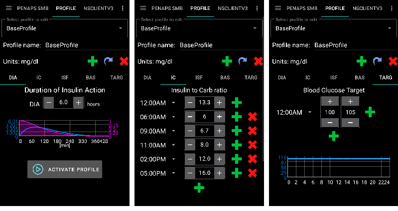
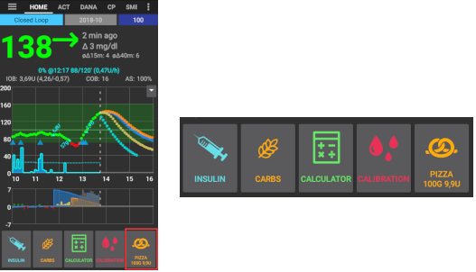
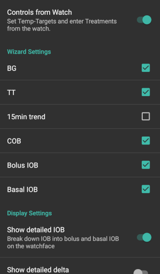

# בונה התצורה

בהתאם להגדרותיכם, תוכלו לפתוח את בונה התצורה דרך הלשונית בחלקו העליון של המסך או דרך תפריט ההמבורגר (≡).

"בונה התצורה" הוא התפריט בו תוכלו להפעיל ולכבות את התכונות המודולריות. במשבצות בצד שמאל (A) תוכלו לבחור באילו תכונות להשתמש ובמשבצות בצד ימין (C) תוכלו לבחור לראות אותן כחלק מהלשונית (E) ב-AndroidAPS. במידה והתיבה בצד שמאל אינה מופעלת, ניתן להגיע לתכונה הרצויה דרך תפריט ההמבורגר (D) בצד העליון הימיני של המסך.

במקומות בהם ישנה אפשרות להגדרות נוספות בתוך המודול, ניתן ללחוץ על גלגל השיניים (B) על מנת להגיע להגדרות הספציפיות בתוך ההעדפות.

**תצורה ראשונית:** החל מ-AAPS 2.0, ישנו אשף התקנה שיוביל אותכם בתהליך הקמת ה-AndroidAPS. על מנת להיעזר בו, לחצו על תפריט 3 הנקודות (⋮) בצד השמאלי העליון של המסך (F), ובחרו ב'אשף ההתקנה'.

(tab-or-hamburger-menu)=

## Tab or hamburger menu

With the checkbox under the eye symbol you can decide how to open the corresponding program section.

(profile)=

## פרופיל

* בחרו את סוג הפרופיל הבזאלי בו תרצו להשתמש. ראו עמוד [פרופילים](../Usage/Profiles.md) למידע נוסף על ההתקנה.
* החל מ-AAPS 3.0, קיים רק פרופיל מקומי.

However, it is possible to synchronise a Nightscout profile into a local profile. To do this, however, it is important to clone the whole database record consisting of several profiles in the Nightscout editor. Please see the instructions below. This can be helpful if major changes to a more extensive profile can be entered more easily via the web interface, e.g. to manually copy data from a spreadsheet.

(local-profile)=

### פרופיל מקומי

Local profile uses the basal profile manually entered in phone. As soon as it is selected, a new tab appears in AAPS, where you can change the profile data read out from the pump if necessary. With the next profile switch they are then written to the pump in profile 1. This profile is recommended as it does not rely on internet connectivity.

Your local profiles are part of [exported settings](../Usage/ExportImportSettings.md). So make sure to have a backup in a safe place.

Buttons:

* פלוס ירוק: הוסף
* X אדום: מחק
* חץ כחול: שכפל

If you make any changes to your profile, make sure, you are editing the correct profile. In profile tab there is not always shown the actual profile being used - e.g. if you made a profile switch by using the profile tab on homescreen it may differ from the profile actually shown in profile tab as there is no connection between these.

#### Clone profile switch

You can easily create a new local profile from a profile switch. In this case timeshift and percentage will be applied to the new local profile.

1. לחצו על תפריט 3 נקודות (⋮) בפינה שמאלית עליונה.
2. בחרו "טיפולים".
3. לחצו על סמל הכוכב כדי להיכנס לעמוד החלפות הפרופיל.
4. בחרו את הפרופיל הרצוי ולחצו על "שכפול".
5. ניתן לערוך את הפרופיל המקומי החדש בלשונית "פרופיל מקומי" או דרך תפריט ההמבורגר.

(upload-local-profiles-to-nightscout)=

#### העלאת פרופילים מקומיים לנייטסקאוט

Local profiles can also be uploaded to Nightscout. The settings can be found in [NSClient preferences](../Configuration/Preferences.md#nsclient).

#### שינוי הפרופיל בעורך הפרופיל של נייטסקאוט

You can synchronoze changes to the profile in the Nighscout profile editor to local profiles. The settings can be found in [NSClient preferences](../Configuration/Preferences.md#nsclient).

It is necessary to clone the actual active entire Nightscout database records for the profiles and not just a profile with the blue arrow! The new database records then carries the current date and can be activated via the tab "local profile".

### עוזר פרופילים

Profile helper offers two functions:

1. הרכבת פרופיל עבור ילדים
2. השוואת פרופילים או החלפות פרופילים כדי לשכפל פרופיל חדש

Details are explained on the separate [profile helper page](../Configuration/profilehelper.md).

(insulin)=

## אינסולין

* בחרו את סוג האינסולין שלכם ואת עקומת פעילותו.
* לאפשרויות 'Oref אינסולין מהיר', 'Oref אינסולין אולטרה מהיר', 'Oref שיא חופשי' ו-'Lyumjev' צורת עקום פעולה אקספוננציאלי. ניתן למצוא מידע נוסף ב[מסמכי OpenAPS](https://openaps.readthedocs.io/en/latest/docs/While%20You%20Wait%20For%20Gear/understanding-insulin-on-board-calculations.html#understanding-the-new-iob-curves-based-on-exponential-activity-curves). 
* העקומות תהיינה שונות, בהתאם ל-DIA ומשך הזמן עד השיא.
    
    * קו סגול מראה כמה **אינסולין נותר** לאחר שהוזרק, כאשר הוא נחלש ככל שעובר הזמן.
    * קו כחול מראה עד כמה האינסולין **פעיל**.

### DIA - משך פעילות אינסולין

* ה-DIA (משך זמן פעילות האינסולין) משתנה מאדם לאדם. משום כך, עליכם לבדוק את הנתון הזה באופן אישי. 
* אבל ה-DIA תמיד חייב להיות לפחות 5 שעות.
* אצל אנשים רבים המשתמשים באינסולין מהיר במיוחד, כמו Fiasp, כמעט ואי אפשר לזהות השפעה כלשהי לאחר שעברו 3-4 שעות, גם אם בעיקרון עדיין נותרו 0.0xx יחידות. הכמות שנותרה בכל זאת עשויה להיות מורגשת בזמן פעילות גופנית, למשל. לכן, AndroidAPS מקפיד על מינימום 5 שעות לזמן פעילות האינסולין.
* You can read more about that in the Insulin Profile section of [this](../Getting-Started/Screenshots.md#insulin-profile) page.

### הבדלים בסוגי אינסולין שונים

* באינסולין מסוג Rapid-Acting, Ultra-Rapid, ו-Lyumjev, ה-DIA הוא הנתון היחיד שתוכלו להגדיר בעצמכם. משך הזמן עד השיא הינו קבוע. 
* שיא חופשי מאפשר לכם להגדיר הן את ה-DIA והן את משך הזמן עד השיא, ומומלץ לשימוש רק על ידי משתמשים מתקדמים המבינים את משמעות ההשלכות של ההגדרות הללו. 
* The [insulin curve graph](../Getting-Started/Screenshots.md#insulin-profile) helps you to understand the different curves.
* ניתן לצפות בו על ידי סימון "V" במשבצת כדי שיופיע כלשונית, או לחילופין למצוא אותו בתוך תפריט ההמבורגר.

#### Oref אינסולין מהיר

* לשימוש עם Humalog, Novolog ,Novorapid
* DIA =לפחות 5 שעות
* שיא = 75 דקות לאחר ההזרקה (קבוע, לא ניתן לשינוי)

#### Oref אינסולין אולטרה מהיר

* מומלץ עבור Fiasp
* DIA =לפחות 5 שעות
* שיא = 55 דקות לאחר ההזרקה (קבוע, לא ניתן לשינוי)

(lyumjev)=

#### Lyumjev

* פרופיל אינסולין במיוחד ל-Lyumjev
* DIA =לפחות 5 שעות
* שיא = 45 דקות לאחר ההזרקה (קבוע, לא ניתן לשינוי)

#### Oref שיא חופשי

* בפרופיל זה תוכלו להגדיר לבד את שיא פעילות האינסולין. לשם כך לחצו על גלגל השיניים כדי להיכנס להגדרות המתקדמות.
* משך הפעילות DIA מוגדר אוטומטית כ-5 שעות אם לא הוגדר גבוה יותר בפרופיל.
* פרופיל זה מומלץ למי שמשתמש באינסולין שאינו נתמך בלופ או שמשתמש בערבוב של סוגי אינסולין.

(bg-source)=

## מקור ערכי הסוכר

Select the blood glucose source you are using - see [BG Source](BG-Source.md) page for more setup information.

* [בנה אפליקציית Dexcom בעצמך (BYODA)](https://docs.google.com/forms/d/e/1FAIpQLScD76G0Y-BlL4tZljaFkjlwuqhT83QlFM5v6ZEfO7gCU98iJQ/viewform?fbzx=2196386787609383750&fbclid=IwAR2aL8Cps1s6W8apUVK-gOqgGpA-McMPJj9Y8emf_P0-_gAsmJs6QwAY-o0).
* [xDrip+](https://xdrip-plus-updates.appspot.com/stable/xdrip-plus-latest.apk) - Cannot be used as receiver for Dexcom G6 as of AAPS 3.0 (see [release notes](../Installing-AndroidAPS/Releasenotes.md#important-hints-3-0-0) for details.
* [Minimed 640G](https://github.com/pazaan/600SeriesAndroidUploader/releases)
* [Glimp](https://play.google.com/store/apps/details?id=it.ct.glicemia&hl=de) - נתמך החל מגרסה 4.15.57
* [Poctech](https://www.poctechcorp.com/en/contents/268/5682.html)
* [יישום Tomato](http://tomato.cool/) למכשירי MiaoMiao
* [Glunovo App](https://infinovo.com/) לשימוש עם חיישן Glunovo
* נתוני סוכר מ-NSClient - לא מומלץ כי במקרה זה תפקוד הלולאה תלוי בחיבור רצוף לאינטרנט. נתוני סוכר יתקבלו רק אם יש חיבור לאתר הנייטסקאוט דרך האינטרנט. עדיף להשתמש בשידור מקומי ממקורות הנתונים האחרים.
* הפקת נתוני גלוקוז אקראיים (מצב הדגמה בלבד)

(pump)=

## משאבה

Select the pump you are using.

* [Dana R](DanaR-Insulin-Pump.md)
* Dana R של השוק הפנים קוראני
* Dana Rv2 (Dana R עם שדרוג גרסת קושחה לא רשמי)
* [Dana-i / RS](DanaRS-Insulin-Pump.md)
    
    * עבור משאבות Dana, במקרה הצורך, הפעילו את האפשרות BT Watchdog שבהעדפות, תחת הכותרת 'משאבה'. אפשרות זו מכבה את הבלוטות' של הטלפון לשניה אחת אם לא נוצר קשר אל המשאבה. זה יכול לעזור בטלפונים מסויימים שיש להם נטייה לניתוקים של בלוטות'.
    * [סיסמת משאבת Dana RS](../Configuration/DanaRS-Insulin-Pump.md) חייבת להיות נכונה. הסיסמה לא נבדקה בגרסאות קודמות.

* [Accu Chek Insight](Accu-Chek-Insight-Pump.md)

* [Accu Chek Combo](Accu-Chek-Combo-Pump.md) (מצריך התקנת ruffy בנוסף)
* [Omnipod Eros](OmnipodEros.md)
* [Omnipod DASH](OmnipodDASH.md)
* [Medtronic](MedtronicPump.md)
* [Diaconn G8](DiaconnG8.md)
* MDI (קבלת המלצות מ-AAPS לטיפול של הזרקות ידניות ללא משאבה)
* משאבה וירטואלית (לולאה פתוחה לשימוש עם משאבות שעוד לא או שאינן מתחברות ל-AAPS - קבלת המלצות בלבד)

## זיהוי רגישות

Select the type of sensitivity detection. For more details of different designs please [read on here](../Configuration/Sensitivity-detection-and-COB.md). This will analyze historical data on the go and make adjustments if it recognizes that you are reacting more sensitively (or conversely, more resistant) to insulin than usual. More details about the Sensitivity algorithm can be read in the [OpenAPS docs](https://openaps.readthedocs.io/en/latest/docs/Customize-Iterate/autosens.html).

You can view your sensitivity on the homescreen by selecting SEN and watching the white line. Note, you need to be in [Objective 8](../Usage/Objectives.md#objective-8-adjust-basals-and-ratios-if-needed-and-then-enable-autosens) in order to let Sensitivity Detection/[Autosens](../Usage/Open-APS-features#autosens) automatically adjust the amount of insulin delivered. Before reaching that objective, the Autosens percentage / the line in your graph is displayed for information only.

(absorption-settings)=

### הגדרות ספיגה

If you use Oref1 with SMB you must change **min_5m_carbimpact** to 8. The value is only used during gaps in CGM readings or when physical activity "uses up" all the blood glucose rise that would otherwise cause AAPS to decay COB. At times when [carb absorption](../Usage/COB-calculation.md) can't be dynamically worked out based on your bloods reactions it inserts a default decay to your carbs. Basically, it is a failsafe.

(aps)=

## APS

Select the desired APS algorithm for therapy adjustments. You can view the active detail of the chosen algorithm in the OpenAPS(OAPS) tab.

* OpenAPS AMA ("עוזר ארוחות מתקדם", אלגוריתם מ-2017) במילים פשוטות, לאחר הזרקת בולוס ארוחה, האלגוריתם יכול לתקן מהר עם בזאלי זמני גבוה אם הזנתם את כמות הפחמימות במדוייק.
* [OpenAPS SMB](../Usage/Open-APS-features.md) (super micro bolus, most recent algorithm for advanced users) Note you need to be in [Objective 9](../Usage/Objectives.md#objective-9-enabling-additional-oref1-features-for-daytime-use-such-as-super-micro-bolus-smb) in order to use OpenAPS SMB and min_5m_carbimpact must be set to 8 in Config builder > Sensitivity detection > Sensitivity Oref1 settings.

## לולאה

* עברו בין לולאה פתוחה, לולאה סגורה, והשעייה בזמן היפו (LGS).

(open-loop)=

### לולאה פתוחה

* AAPS מנתח באופן רציף את כל הנתונים הזמינים (IOB - אינסולין פעיל בגוף, COB - פחמימות פעילות, BG - רמת הסוכר...) ומציע הצעות להתאמת הטיפול במידת הצורך. 
* ההצעות לא תבוצענה באופן אוטומטי (כמו שיקרה בלולאה הסגורה). יש לבצע אותם ידנית במשאבה, או באמצעות המקש המתאים אם הנכם משתמשים במשאבה מתאימה (Dana R/RS, Omnipod או AccuChek Combo). 
* מטרת האפשרות הזו היא כדי לאפשר לכם להכיר כיצד פועל AndroidAPS, או במידה ואתם משתמשים במשאבה לא תואמת.

(closed-loop)=

### לולאה סגורה

* AAPS מנתח ללא הרף את כל הנתונים הזמינים (IOB - אינסולין פעיל בגוף, COB - פחמימות פעילות, BG - רמת הסוכר...) ומתאים אוטומטית את הטיפול במידת הצורך (ללא צורך בהתערבות המשתמש) על מנת להגיע לערך או טווח המטרה שנקבע (על ידי מתן בולוס, שינוי בזאלי זמני, השהיית מתן האינסולין למניעת היפו, וכדו'). 
* הלולאה הסגורה פועלת במסגרת אינספור מגבלות בטיחות, אותן תוכלו להגדיר באופן אישי.
* Closed Loop is only possible if you are in [Objective 6](../Usage/Objectives.md#objective-6-starting-to-close-the-loop-with-low-glucose-suspend) or higher and use a supported pump.
* שימו לב: במצב לולאה סגורה מומלץ להגדיר מטרה יחידה במקום טווח מטרה (לדוגמא, 100 mg/dl במקום 90-125 mg/dl).

### השהייה בזמן רמת גלוקוז נמוכה (LGS)

* maxIOB (מקסימום אינסולין פעיל בגוף) מוגדר כאפס
* המשמעות היא שבמידה ורמת הסוכר בדם צונחת, המערכת תוכל להוריד את המינון הבזאלי.
* אולם אם רמת הסוכר עולה, לא יתבצע תיקון אוטומטי. המינונים הבזאליים יוותרו כפי שהגדרתם בפרופיל שנבחר.
* רק במידה וה-IOB הבזאלי הוא שלילי (עקב השהייה קודמת), יינתן אינסולין נוסף לרמת גלוקוז נמוכה.

### מינימום בקשה לשינוי

* בזמן השימוש בלולאה פתוחה, תקבלו התראות בכל פעם שה-AAPS ימליץ על התאמת בזאל זמנית. 
* על מנת להפחית את מספר ההתראות אתם יכולים לבחור טווח מטרה רחב יותר לסוכר או להגדיל את אחוז השינוי המינימלי להתראה.
* זוהי ההגדרה של השינוי היחסי הדרוש כדי להפעיל התראה על המלצה על שינוי.

## משימות (הלומדה)

AndroidAPS has a leraning program (objectives) that you have to fulfill step by step. This should guide you safely through setting up a closed loop system. It guarantees that you have set everything up correctly and understand what the system does exactly. This is the only way you can trust the system.

You should [export your settings](../Usage/ExportImportSettings.md) (including progress of the objectives) on a regularly basis. In case you have to replace your smartphone later (new purchase, display damage etc.) you can simply import those settings.

See [Objectives](../Usage/Objectives.md) page for more information.

## טיפולים

If you view the Treatments (Treat) tab, you can see the treatments that have been uploaded to nightscout. Should you wish to edit or delete an entry (e.g. you ate less carbs than you expected) then select 'Remove' and enter the new value (change the time if necessary) through the [carbs button on the home screen](../Getting-Started/Screenshots.md#carb-correction).

## כללי

### סקירה כללית

Displays the current state of your loop and buttons for most common actions (see [section The Homescreen](../Getting-Started/Screenshots.md) for details). Settings can be accessed by clicking the cog wheel.

#### השאר את המסך דולק

Option 'Keep screen on' will force Android to keep the screen on at all times. This is useful for presentations etc. But it consumes a lot of battery power. Therefore, it is recommended to connect the smartphone to a charger cable.

#### מקשים

Define which Buttons are shown on the home screen.

* טיפולים
* מחשבון
* אינסולין
* פחמימות
* סנסור (פותח את xDrip או את מקור נתוני הסוכר)
* כיול

Furthermore, you can set shortcuts for insulin and carb increments and decide whether the notes field should be shown in treatment dialogues.

#### הגדרות אשף מהיר

Create a button for a certain standard meal (carbs and calculation method for the bolus) which will be displayed on the home screen. Use for standard meals frequently eaten. If different times are specified for the different meals you will always have the appropriate standard meal button on the home screen, depending on the time of day.

Note: Button will not be visible if outside the specified time range or if you have enough IOB to cover the carbs defined in the QuickWizard button.

#### ברירות מחדל ערכי מטרה

Choose default temp-targets (duration and target). Preset values are:

* אוכלים בקרוב: מטרה 72 mg/dl למשך 45 דקות
* פעילות: מטרה 140 mg/dl למשך 90 דקות
* היפו: מטרה 125 mg/dl למשך 45 דקות

#### מילוי\תיחול כמויות סטנדרטיות של אינסולין

Choose the default amounts of the three buttons in fill/prime dialogue, depending on the length of your catheter.

#### טווח הצגה

Choose the high and low marks for the BG-graph on AndroidAPS overview and smart watch. It is only the visualization, not the target range for your BG. Example: 70 - 180 mg/dl or 3.9 - 10 mmol/l

#### קצר את כותרות הלשוניות

Choose wether the tab titles in AndroidAPS are long (e.g. ACTIONS, LOCAL PROFILE, AUTOMATION) or short (e.g. ACT, LP, AUTO)

#### הצגת שדות הערות בתיבות דו-שיח של טיפול

Choose if you want to have a notes field when entering treatments or not.

#### אורות חיווי

Choose if you want to have [status lights](../Configuration/Preferences.md#status-lights) on overview for cannula age, insulin age, sensor age, battery age, reservoir level or battery level. When warning level is reached, the color of the status light will switch to yellow. Critical age will show up in red.

#### הגדרות מתקדמות

**Deliver this part of bolus wizard result**: When using SMB, many people do not meal-bolus 100% of needed insulin, but only a part of it (e.g. 75 %) and let the SMB with UAM (unattended meal detection) do the rest. In this setting, you can choose a default value for the percenteage the bolus wizard should calculate with. If this setting is 75 % and you had to bolus 10u, the bolus wizard will propose a meal bolus of only 7.5 units.

**Enable super bolus functionality in wizard** (It is different from *super micro bolus*!): Use with caution and do not enable until you learn what it really does. Basically, the basal for the next two hours is added to the bolus and a two hour zero-temp activated. **AAPS looping functions will be disabled - so use with care! If you use SMB AAPS looping functions will be disabled according to your settings in ["Max minutes of basal to limit SMB to"](../Usage/Open-APS-features.md#max-minutes-of-basal-to-limit-smb-to), if you do not use SMB looping functions will be disabled for two hours.** Details on super bolus can be found [here](https://www.diabetesnet.com/diabetes-technology/blue-skying/super-bolus).

(actions)=

### פעולות

* לחצנים לגישה מהירה לפונקציות שימושיות.
* See [AAPS screenshots](../Getting-Started/Screenshots.md#action-tab) for details.

### אוטומציה

User defined automation tasks ('if-then-else'). Please [read on here](../Usage/Automation.md).

(sms-communicator)=

### תקשורת SMS

Allows remote caregivers to control some AndroidAPS features via SMS, see [SMS Commands](../Children/SMS-Commands.md) for more setup information.

### מזון

Displays the food presets defined in the Nightscout food database, see [Nightscout Readme](https://github.com/nightscout/cgm-remote-monitor#food-custom-foods) for more setup information.

Note: Entries cannot be used in the AndroidAPS calculator. (View only)

(wear)=

### Wear

Monitor and control AAPS using your Android Wear watch (see [page Watchfaces](../Configuration/Watchfaces.md)). Use settings (cog wheel) to define which variables should be considered when calculating bolus given though your watch (i.e. 15min trend, COB...).

אם אתם רוצים להזריק בולוס וכו' מהשעון, עליכם להפעיל את "שליטה משעון" בתוך "הגדרות Wear" בבונה התצורה.

Through Wear tab or hamburger menu (top left of screen, if tab is not displayed) you can

* לשלוח מחדש את כל הנתונים. שימושי אם השעון לא היה מחובר במשך זמן מה ואתם רוצים לעדכן את המידע שבשעון.
* לפתוח את ההגדרות בשעון ישירות מהטלפון שלך.

### שורת מצב xDrip (שעון)

Display loop information on your xDrip+ watchface (if you are not using AAPS/[AAPSv2 watchface](../Configuration/Watchfaces.md)

### NSClient

* הגדרת סינכרון נתוני AndroidAPS עם נייטסקאוט.
* Settings in [preferences](../Configuration/Preferences.md#nsclient) can be opened by clicking the cog wheel.

### תחזוקה

Email and number of logs to be send. Normally no change necessary.

### בונה התצורה

Use tab for config builder instead of hamburger menu.