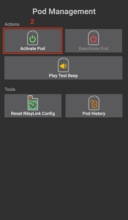
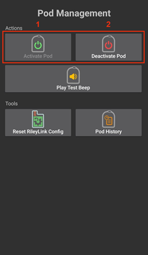
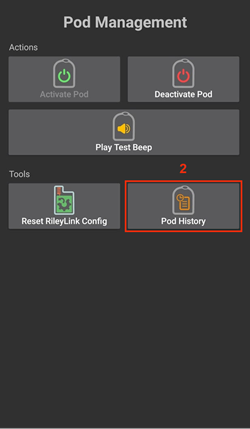
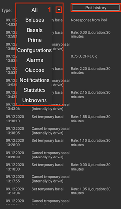
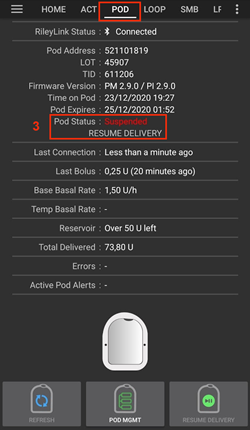
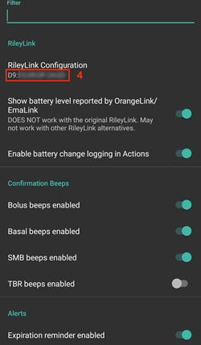

=====================================================
 הוראות מנהל התקן משאבת Omnipod Eros
=====================================================

הוראות אלה מיועדות להגדרת משאבת Omnipod Eros (** לא Omnipod Dash **). מנהל ההתקן של Omnipod זמין כחלק מ-AndroidAPS החל מגרסה 2.8.

** תוכנה זו היא חלק מפתרון לבלב מלאכותי DIY ואינו מוצר אך דורש ממכם לקרוא, ללמוד ולהבין את המערכת, כולל את אופן השימוש בה. האחריות על השימוש במערכת היא עליכם בלבד.**

.. תוכן עניינים:: 
   :backlinks: entry
   :depth: 2

דרישות חומרה ותוכנה
==================================

* **מכשיר תקשורת עם הפודים** 

  רכיב שמגשר בין התקשורת מהטלפון שמריץ את AndroidAPS לפודים מדגם Eros.

   -  |OrangeLink|  `אתר אורנג'לינק <https://getrileylink.org/product/orangelink>`_    
   -  |RileyLink| `433MHz RileyLink <https://getrileylink.org/product/rileylink433>`__
   -  |EmaLink|  `אתר אמה לינק <https://github.com/sks01/EmaLink>`__ - `מייל לפרטים <mailto:getemalink@gmail.com>`__
   -  |DiaLink|  DiaLink - `מייל לפרטים <mailto:Boshetyn@ukr.net>`__     
   -  |LoopLink|  `אתר לופלינק<https://www.getlooplink.org/>`__ - `פרטי התקשרות <https://jameswedding.substack.com/>`__ - לא נוסה

*  |Android_Phone|  **מכשיר טלפון אנדרואיד** 

  רכיב שיפעיל את AndroidAPS וישלח פקודות שליטה למכשיר התקשורת עם ה-Pod.

      +  `רשימת מכשיר טלפון אנדרואיד התומכים בשימוש באומניפוד <https://docs.google.com/spreadsheets/d/1eNtXAWwrdVtDvsvXaR_72wgT9ICjZPNEBq8DbitCv_4/edit>`__ עם AAPS גרסה 2.8 `והרכיבים הנדרשים <../index.html#component-setup>`__

*  |Omnipod_Pod|  **פוד-מכשיר להזרקת האינסולין** 

  רכיב שיפרש פקודות המתקבלות ממכשיר התקשורת, שמקורן בטלפון ה- AndroidAPS שלכם.

      +  פוד אומניפוד חדש (דגם Eros - **לא DASH**)

הוראות אלה מניחות כי אתם מתחילים שימוש בפוד חדש; אם זה לא כך, אנא התאזרו בסבלנות ונסו להתחיל בתהליך זה לקראת החלפת הפוד הבא.

לפני שמתחילים
================

**בטיחות קודמת לכול** - אל תנסו לבצע את תהליך זה בסביבה שבה לא תוכלו להתאושש משגיאה (פודים נוספים, אינסולין, RileyLink טעון ומכשיר הטלפון הם חובה).

** שלט האומניפוד המקורי (PDM) כבר לא יעבוד לאחר ש-AAPS יפעיל את הפוד שלכם **. בעבר השתמשתם בשלט כדי לשלוח פקודות לפוד Eros של Omnipod. פוד מאפשר תקשורת עם מכשיר אחד בלבד. המכשיר שמפעיל את הפוד הוא המכשיר היחיד שמורשה לתקשר איתו מאותה נקודה ואילך. משמעות הדבר היא שברגע שתפעילו פוד עם ה- RileyLink באמצעות AAPS, ** לא תוכלו עוד להשתמש בשלט עם הפוד הזה**. AAPS עם RileyLink משמשים כעת כתחליף מלא לשלט שלכם. *זה לא אומר שצריך לזרוק את השלט, מומלץ לשמור אותו כגיבוי, ובמקרי חירום אם AAPS אינו פועל כראוי.*

** ניתן להגדיר מספר מכשירי ריילילינק, אך רק ריילילינק אחד שנבחר בכל פעם יכול לתקשר עם פוד. **AAPS תומך ביכולת להוסיף מספר ריילילינקים בתפריט תצורת ריילילינק, עם זאת, רק ריילילינק אחד בכל פעם יכול להבחר לשמש לשליחה ולקבלה של פקודות.

** הפוד לא יכבה כאשר ה-RileyLink נמצא מחוץ לטווח. **כאשר ה-RileyLink נמצא מחוץ לטווח או שהאות חסום לתקשורת עם הפוד הפעיל, הפוד שלך ימשיך לספק אינסולין בזאלי. עם הפעלה ראשונית של פוד, הפרופיל הבזאלי המוגדר ב-AAPS יתוכנת לתוך הפוד החדש. אם תאבד את הקשר עם הפוד, הוא יחזור לפרופיל הבזאלי הזה. לא תוכל לשלוח פקודות חדשות עד שה-RileyLink יחזור להיות בטווח וייצור מחדש את החיבור.

**פרופילים בזאליים בהם בשעות אינן עגולות אינם נתמכים ב- AndroidAPS. ** אם אתם חדשים ב-AndroidAPS ומגדירים את הפרופיל הבזאלי בפעם הראשונה, שימו לב שמינוני הבזאלי המתחילים משעות לא עגולות אינם נתמכים ויש להתאים את הפרופיל לכך. לדוגמה, אם יש מינון בזאלי של למשל 1.1 יחידות שמתחיל בשעה 09:30 ויש לו משך של שעתיים ומסתיים בשעה 11:30, זה לא יעבוד.  יהיה עליכם לעדכן את המינון של 1.1 יחידות לטווח זמן של 09:00-11:00 או 10:00-12:00.  למרות שהצעדים של חצאי שעות בפרופיל הבזאלי נתמכים על ידי חומרת Omnipod עצמה, AndroidAPS לא מסוגלת להשתמש בהן עם האלגוריתמים שלה כרגע.

הפעלת מנהל ההתקן של Omnipod ב- AAPS
===================================

ניתן להפעיל את מנהל ההתקן של Omnipod ב-AAPS בשתי דרכים **:

אפשרות 1: אשף ההתקנה
--------------------------

לאחר התקנת גרסה חדשה של AndroidAPS, **אשף ההתקנה** יופעל אוטומטית.  זה יתרחש גם במהלך שדרוגים במקום.  אם כבר ייצאתם את ההגדרות שלכם מהתקנה קודמת, תוכל לצאת מאשף ההתקנה ולייבא את ההגדרות הישנות שלכם.  עבור התקנות חדשות המשיכו מטה.

באמצעות **אשף ההתקנה של AAPS (2)** הממוקם בפינה הימנית העליונה** בתפריט שלוש נקודות (1) ** ומעבר במסכי האשף עד שתגיעו למסך **משאבה**. לאחר מכן בחרו את לחצן הבחירה ב-**Omnipod (3)**.

    |Enable_Omnipod_Driver_1|  |Enable_Omnipod_Driver_2|

באותו המסך, מתחת לבחירת המשאבה, מוצגות **הגדרות מנהל התקן Omnipod**, תחת תצורת ** ריילילינק** הוסיפו את מכשיר הריילילינק שלכם על ידי לחיצה על הטקסט **לא הוגדר**. 

במסך **בחירת ריילילינק** לחצו על הלחצן **סרוק** כדי לסרוק אחר כל התקני ה-בלוטות' הזמינים ובחרו את הריילילינק שלכם מהרשימה. לאחר בחירת הריילילינק, תוחזרו למסך בחירת סוג המשאבה, שם יוצגו הגדרות מנהל ההתקן של Omnipod ואת הריילילינק שבחרתם כולל כתובת ה-MAC שלו. 

לחצו על הלחצן **הבא** כדי להמשיך בשאר אשף ההתקנה. **יכול להיות שתחלוף עד דקה אחת לאתחול של הריילילינק והלחצן **הבא** הופך לפעיל.

תיאור מפורט של התקנת מכשיר התקשורת עם הפוד מפורטים להלן בקטע 'הגדרת RileyLink <#rileylink-setup>`__.

**או**

אפשרות 2: בונה התצורה
----------------------------

דרך הפינה הימנית העליונה **תפריט המבורגר** תחת **בונה התצורה (1)** > **משאבה** > **אומניפוד** על ידי בחירה **בלחצן הבחירה (1)** שכותרתו **אומניפוד**. בחירת תיבת הסימון ** (3) ** לצד **גלגל השיניים (2)** תציג את תפריט Omnipod ככרטיסייה בממשק AAPS שכותרתה **פוד**. בתיעוד זה לשונית זו נקראת **OMNIPOD (POD)**.

    **הערה:** דרך גישה מהירה יותר ל-**הגדרות אומניפוד** ניתן למצוא בקטע `הגדרות אומניפוד <#omnipod-settings>`__ במסמך זה.

    |Enable_Omnipod_Driver_3| |Enable_Omnipod_Driver_4|

אימות בחירת מנהל התקן Omnipod
----------------------------------------

*הערה: אם יצאתם מוקדם מאשף ההתקנה מבלי לבחור את ה-RileyLink, מנהל ההתקן Omnipod מופעל אך עדיין יהיה עליכם לבחור את RileyLink.  ייתכן שתראו שהלשונית OMNIPOD (POD) מופיעה כפי שהיא מופיעה מטה*

כדי לוודא שהפעלתם את מנהל ההתקן של Omnipod ב-AAPS **החליקו ימינה** מהלשונית **סקירה כללית**, שם תראו כעת לשונית **אומניפוד** או **פוד**.

|Enable_Omnipod_Driver_5|

תצורת Omnipod
======================

**החליקו ימינה** ללשונית **OMNIPOD (POD)** שם תוכלו לנהל את כל הפונקציות של הפוד וריילילינק (חלק מהפונקציות הללו אינן מופעלות או נראות ללא הפעלת פודים פעילה):

    |refresh_pod_status| רענן את חיבור וסטטוס הפוד

    |pod_management| ניהול הפוד (הפעלה, השבתה, הפעלת צפצוף בדיקה, סטטוס ריילילינק והיסטוריית פוד)

תצורת RileyLink
---------------

אם כבר צימדתם את הריילילינק בהצלחה באשף ההתקנה או בשלבים שלמעלה, המשיכו אל `הפעלת פוד <#activating-a-pod>`__ מטה.

*הערה: אינדיקציה ויזואלית טובה לכך שהריילילינק אינו מחובר היא שלחצני האינסולין והמחשבון בלשונית "סקירה כללית" יחסרו. הדבר יתרחש גם ב-30 השניות הראשונות לאחר הפעלת AAPS, מכיוון שהוא מתחבר באופן פעיל אל ה-RileyLink.*

1. וודאו שהריילילינק טעון במלואו ומופעל.

2. לאחר בחירת מנהל ההתקן של Omnipod, זהו ובחרו את הריילילינק מתוך **בונה התצורה (1)** > **משאבה** > **Omnipod** > **גלגל השיניים (הגדרות) (2)** > ** תצורת הריילילינק (3)** על ידי לחיצה על הטקסט **לא הוגדר** או **כתובת MAC (אם קיים)**.   

    ודאו שסוללת הריילילינק טעונה ושהוא `ממוקמם בסמיכות <#optimal-omnipod-and-rileylink-positioning>`__ (במרחק של כ-30 ס"מ או פחות) מהטלפון כדי ש-AAPS יזהה אותו על לפי כתובת ה- MAC. לאחר שנבחר, תוכלו להמשיך ולהפעיל את הפוד שלכם. לחצו בלחצן "הקודם" בטלפון כדי לחזור לממשק ה-AAPS הראשי.

    |RileyLink_Setup_1| |RileyLink_Setup_2|

3. במסך **תצורת ריילילינק** לחצו על הלחצן **סריקה (4)** כדי להתחיל סריקת בלוטות'. ** בחרו את הריילילינק שלכם (5)** מרשימת מכשירי הבלוטות' הזמינים.

    |RileyLink_Setup_3| |RileyLink_Setup_4|

4. לאחר בחירתכם תוחזרו לדף הגדרות Omnipod המפרט את **כתובת ה-MAC של הריילילינק שנבחר כרגע (6).** 

    |RileyLink_Setup_5|

5. וודאו שבלשונית **OMNIPOD (POD)**, **סטטוס הריילילינק (1)** מופיע כ- **מחובר**. בשדה **סטטוס פוד (2)** אמור להופיע **אין פוד פעיל**; אם לא, נסו שוב את השלב הקודם או שצאו מ-AAPS כדי לראות אם זה מרענן את החיבור.

    |RileyLink_Setup_6|

הפעלת פוד
----------------

לפני שתוכלו להפעיל פוד, עליכם לוודא שהגדרתם היטב ושחיברתם את הריילילינק בהגדרות האומניפוד

*תזכורת: תקשורת עם פודים מתרחשת בטווחים מוגבלים מהרגיל כשמבצעים צימוד ופעלת פודים כאמצעי אבטחה. לפני הצימוד, אות הרדיו של הפוד חלש אך לאחר הצימוד הוא יפעל בעוצמת האות המלאה. במהלך הצימוד, וודאו כי פוד נמצא `בסמוך <#optimal-omnipod-and-rileylink-positioning>`__ (במרחק של כ-30 ס"מ או פחות) אך לא ממש בצמוד לריילילינק.

1. נווטו ללשונית **OMNIPOD (POD)**, לחצו על הלחצן **ניהול הפוד (1)** ולאחר מכן לחצו על **הפעלת פוד (2)**.

    |Activate_Pod_1| |Activate_Pod_2|

2. יוצג המסך **מילוי פוד**. מלאו פוד חדש עם לפחות 80 יחידות אינסולין והקשיבו לשני צפצופים המעידים על כך שהפוד מוכן להדבקה. בעת חישוב הכמות הכוללת של האינסולין הדרוש למשך 3 ימים, קחו בחשבון כי הפעלת הפוד תשתמש ב-12 עד 15 יחידות. 

    |Activate_Pod_3|

    וודאו שהפוד החדש ושהריילילינק נמצאים בסמיכות זה לזה (כ-30 ס"מ או פחות) ולחצו **הבא**.

3. במסך **אתחול פוד**, הפוד יתחיל להתכונן להדבקה (אתם תשמעו קליק ואחריו סדרה של צלילי תקתוק). אם הריילילינק נמצא מחוץ לטווח של הפוד שמופעל, תתקבל הודעת השגיאה **אין תגובה מהפוד**. אם זה קורה, `קרבו את הריילילינק <#optimal-omnipod-and-rileylink-positioning>`__ (למרחק של כ-30 ס"מ או פחות) אך לא להצמיד אותו ממש לפוד ולחצו על **נסה שוב (1)**.

    |Activate_Pod_4| |Activate_Pod_5|

4. עם סיום האתחול יוצג סימן ביקורת ירוק ולחצן **הבא** יופעל. לחצו על הלחצן **הבא** כדי להשלים את האתחול של הפוד ולמעבר למסך **הצמד פוד**.

    |Activate_Pod_6|

5. לאחר מכן, הכינו את אתר ההדבקה של הפוד החדש. הסירו את מכסה המחט ואת הנייר הלבן מהמדבקה והניחו את הפוד על גופכם כרגיל. לסיום, לחצו על **הבא**.

    |Activate_Pod_7|

6. כעת תופיע תיבת הדו -שיח **הצמד פוד**. ** לחץ רק על כפתור אישור אם אתם מוכנים להחדיר את הקנולה**.

    |Activate_Pod_8|

7. לאחר לחיצה על **אישור**, ייתכן שיחלוף זמן מה עד שהאומניפוד יגיב ויחדיר את הקנולה (עד 1-2 דקות), אנא שמרו על סבלנות.

    אם הריילילינק נמצא מחוץ לטווח של הפוד שמופעל, תתקבל הודעת השגיאה **אין תגובה מהפוד**. אם זה קורה, `קרבו את הריילילינק <#optimal-omnipod-and-rileylink-positioning>`__ (למרחק של כ-30 ס"מ או פחות) אך לא להצמיד אותו ממש לפוד ולחצו על **נסה שוב**.

    אם הריילילינק נמצא מחוץ לטווח הבלוטות' או שאין לו חיבור פעיל לטלפון, תתקבל הודעת שגיאה **אין תגובה מריילילינק**. אם זה קורה, קרבו את הריילילינק אל הטלפון ולחצו על **נסה שוב**.

    *הערה: לפני החדרת הקנולה, מומלץ לצבוט את העור בסביבת נקודת ההחדרה. זה מבטיח החדרה חלקה של המחט ומפחית את הסיכויים לפתח חסימות.*

    |Activate_Pod_9|

    |Activate_Pod_10| |Activate_Pod_11|

8. יופיע V ירוק, ולחצן **הבא** יופעל לאחר החדרת קנולה מוצלחת. לחצו על **הבא**.

    |Activate_Pod_12|

9. יופיע המסך **הפוד הופעל**. לחצו על הלחצן הירוק **סיים**. מזל טוב! הפעלתם את הפוד.

    |Activate_Pod_13|

10. במסך התפריט **ניהול הפוד**, הלחצן **הפעל פוד (1)** *יושבת* והכפתור **כבה פוד (2)** *יופעל*. הסיבה לכך היא שהפוד פעיל כעת ולא ניתן להפעיל פוד נוסף מבלי להשבית את הפוד הנוכחי.

    לחצו על כפתור החזרה בטלפון כדי לחזור ללשונית **OMNIPOD (POD)** שיציג כעת מידע על הפוד הנוכחי, כולל המינון הבזאלי הנוכחי, רמת מכל האינסולין, אינסולין שהוזרק, שגיאות של הפוד והתראות.

    לפרטים נוספים עיינו בפרק `לשונית OMNIPOD (POD) <#omnipod-pod-tab>`__ שבמסמך זה.

    |Activate_Pod_14| |Activate_Pod_15|

השבתת פוד
------------------

בנסיבות רגילות, פוד אמור לפעול שלושה ימים (72 שעות) ועוד 8 שעות לאחר אזהרת תפוגתו, סך הכל 80 שעות שימוש בפוד.

כיצד להשבית את הפוד (מתוקף התפוגה או בעקבות כשל של הפוד):

1. נווטו ללשונית **OMNIPOD (POD)**, לחצו **ניהול הפוד (1)**, במסך **ניהול פוד** לחצו על **כבה פוד (2)**.

    |Deactivate_Pod_1| |Deactivate_Pod_2|

2. במסך **כבה פוד**, ראשית וודאו שהריילילינק נמצא בסמיכות לפוד אך לא בצמוד אליו, לאחר מכן לחצו על **הבא** כדי להתחיל בתהליך השבתת הפוד.

    |Deactivate_Pod_3|

3. המסך **מכבה פוד** יופיע ותשמעו צפצוף אישור מהפוד שההשבתה הצליחה.

    |Deactivate_Pod_4|

    **אם ההשבתה נכשלת** ולא נשמע צפצוף אישור, ייתכן שתקבלו הודעת **אין תגובה מריילילינק** או **אין תגובה מהפוד**. לחצו על **נסה שוב (1)** כדי לנסות להשבית שוב. אם ההשבתה ממשיכה להיכשל, לחצו על הלחצן **היפטר מהפוד (2)** כדי להיפטר מהפוד. כעת תוכלו להסיר את הפוד כיוון שפעילותו הושבתה. אם הפוד הפעיל אזעקה, ייתכן שיהיה עליכם להשתיק אותה ידנית (באמצעות סיכה או מהדק) מכיוון שכפתור **היפטר מהפוד (2)** לא ישתיק אותו.
	
	|Deactivate_Pod_5| |Deactivate_Pod_6|

4. סימון ירוק יופיע לאחר השבתה מוצלחת. לחצו על **הבא** כדי לעבור אל המסך "הפוד הושבת". כעת תוכלו להסיר את הפוד כיוון שפעילותו הושבתה.

    |Deactivate_Pod_7|

5. לחצו על הכפתור הירוק כדי לחזור למסך **ניהול הפוד**.

    |Deactivate_Pod_8|

6. כעת חזרתם לתפריט **ניהול הפוד** לחץ על כפתור החזרה בטלפון שלך כדי לחזור ללשונית **OMNIPOD (POD)**. וודאו שב**סטטוס ריילילינק:** רשום **מחובר** ושב**סטטוס פוד:** רשום **אין פוד פעיל**.

    |Deactivate_Pod_9| |Deactivate_Pod_10|

הפסקה וחידוש אספקת האינסולין
----------------------------------------

התהליך שלהלן יפרט כיצד להפסיק ולחדש את אספקת האינסולין.

*הערה - אם אינכם רואים את הכפתור "השהה"*, זה משום שהצגתו לא אופשרה בלשונית OMNIPOD (POD). אפשרו **הצג לחצן "השהיית מתן אינסולין" בלשונית אומניפוד** `בהגדרות אומניפוד <#omnipod-settings>`__ תחת **אחר**.

השהיית אספקת האינסולין
~~~~~~~~~~~~~~~~~~~~~~~~~~~

השתמשו בפקודה זו כדי להכניס את הפוד הפעיל למצב השהייה. במצב מושהה זה, הפוד לא יספק אינסולין. פקודה זו מחקה את פונקציית ההשהיה של השלט המקורי של אומניפוד.

1. עבור ללשונית **OMNIPOD (POD)** ולחצו על **השהיה (1)**. פקודת ההשהיה נשלחת מהריילילינק אל הפוד הפעיל ולחצן ה**השהייה (3)** יהפוך לאפור. **סטטוס פוד (2)** יציג **השהיית הזרקה**.

    |Suspend_Insulin_Delivery_1| |Suspend_Insulin_Delivery_2|

2. כאשר פקודת ההשהיה נשלחת בהצלחה על ידי הריילילינק, תיבת דו -שיח לאישור תציג את ההודעה **כל הזרקות האינסולין הושהו**. לחץ על **אישור** כדי לאשר ולהמשיך.

    |Suspend_Insulin_Delivery_3|

3. הפוד השהה כעת את כל אספקת האינסולין. בלשונית **OMNIPOD (POD)** יעודכן **סטטוס הפוד(1)** ל**מושהה**. הלחצן **השהיה** ישתנה לכפתור חדש **חידוש הזרקה (2)**

    |Suspend_Insulin_Delivery_4|

חידוש הזרקת האינסולין
~~~~~~~~~~~~~~~~~~~~~~~~~

השתמשו בפקודה זו כדי להנחות את הפוד הפעיל כעת לחדש את אספקת האינסולין. לאחר עיבוד הפקודה, מתן האינסולין יחודש לפי המינון הבזאלי הנוכחי בהתאם להגדרתו בפרופיל. הפוד יקבל שוב פקודות עבור בולוס, מינון בזאלי זמני ו-SMB.

1. עברו ללשונית **OMNIPOD (POD)** וודאו שבשדה **מצב פוד (1)** מוצג **מושהה** ולאחר מכן לחצו על **חידוש הזרקה (2)** כדי להתחיל את תהליך הפוקד על הפוד לחדש את אספקת האינסולין הרגילה. תופיע הודעה **חידוש הזרקה** תחת **סטטוס פוד (3)**, שמציינת שהריילילינק שולח את הפקודה כרגע אל הפוד המושהה.

    |Resume_Insulin_Delivery_1| |Resume_Insulin_Delivery_2|

2. When the Resume delivery command is successfully confirmed by the RileyLink a confirmation dialog will display the message **Insulin delivery has been resumed**. לחץ על **אישור** כדי לאשר ולהמשיך.

    |Resume_Insulin_Delivery_3|

3. The **Omnipod (POD)** tab will update the **Pod status (1)** field to display **RUNNING,** and the **Resume Delivery** button will now display the **SUSPEND (2)** button.

    |Resume_Insulin_Delivery_4|

Acknowledging Pod Alerts
------------------------

*NOTE - if you do not see an ACK ALERTS button, it is because it is conditionally displayed on the Omnipod (POD) tab ONLY when the pod expiration or low reservoir alert has been triggered.*

The process below will show you how to acknowledge and dismiss pod beeps that occur when the active pod time reaches the warning time limit before the pod expiration of 72 hours (3 days). This warning time limit is defined in the **Hours before shutdown** Omnipod alerts setting. The maximum life of a pod is 80 hours (3 days 8 hours), however Insulet recommends not exceeding the 72 hour (3 days) limit.

*NOTE - If you have enabled the "Automatically acknowledge Pod alerts" setting in Omnipod Alerts, this alert will be handled automatically after the first occurrence and you will NOT need to manually dismiss the alert.*

1. When the defined **Hours before shutdown** warning time limit is reached, the pod will issue warning beeps to inform you that it is approaching its expiration time and a pod change will soon be required. You can verify this on the **Omnipod (POD)** tab, the **Pod expires: (1)** field will show the exact time the pod will expire (72 hours after activation) and the text will turn **red** after this time has passed, under the **Active Pod alerts (2)** field where the status message **Pod will expire soon** is displayed. This trigger will display the **ACK ALERTS (3)** button. A **system notification (4)** will also inform you of the upcoming pod expiration

    |Acknowledge_Alerts_1| |Acknowledge_Alerts_2|

2. Go to the **Omnipod (POD)** tab and press the **ACK ALERTS (2)** button (acknowledge alerts). The RileyLink sends the command to the pod to deactivate the pod expiration warning beeps and updates the **Pod status (1)** field with **ACKNOWLEDGE ALERTS**.

    |Acknowledge_Alerts_3|

3. Upon **successful deactivation** of the alerts, **2 beeps** will be issued by the active pod and a confirmation dialog will display the message **Activate alerts have been acknowledged**. Click the **OK** button to confirm and dismiss the dialog.

    |Acknowledge_Alerts_4|

    If the RileyLink is out of range of the pod while the acknowledge alerts command is being processed a warning message will display 2 options. **Mute (1)** will silence this current warning. **OK (2)** will confirm this warning and allow the user to try to acknowledge alerts again.

    |Acknowledge_Alerts_5|

4. Go to the **Omnipod (POD)** tab, under the **Active Pod alerts** field, the warning message is no longer displayed and the active pod will no longer issue pod expiration warning beeps.

View Pod History
----------------

This section shows you how to review your active pod history and filter by different action categories. The pod history tool allows you to view the actions and results committed to your currently active pod during its three day (72 - 80 hours) life.

This feature is useful for verifying boluses, TBRs, basal changes that were given but you may be unsure if they completed. The remaining categories are useful in general for troubleshooting issues and determining the order of events that occurred leading up to a failure.

*NOTE:*
**Uncertain** commands will appear in the pod history, however due to their nature you cannot ensure their accuracy.

1. Go to the **Omnipod (POD**) tab and press the **POD MGMT (1)** button to access the **Pod management** menu and then press the **Pod history (2)** button to access the pod history screen.

    |Pod_History_1| |Pod_History_2|

2. On the **Pod history** screen, the default category of **All (1)** is displayed showing the **Date and Time (2)** of all pod **Actions (3)** and **Results (4)** in reverse chronological order. Use your phone’s **back button 2 times** to return to the **Omnipod (POD)** tab in the main AAPS interface.

    |Pod_History_3| |Pod_History_4|

View RileyLink Settings and History
-----------------------------------

This section shows you how to review the settings of your active pod and RileyLink along with the communication history of each. This feature, once accessed, is split into two sections: **Settings** and **History**.

The primary use of this feature is when your pod communication device is out of the Bluetooth range of your phone after a period of time and the **RileyLink status** reports **RileyLink unreachable**. The **REFRESH** button on the main **Omnipod (POD)** tab will manually attempt to re-establish Bluetooth communication with the currently configured RileyLink in the Omnipod settings.

In the event the **REFRESH** button on the main **Omnipod (POD)** tab does not restore the connection to the pod communication device, please follow the additional steps below for a manual reconnection.

Manually Re-establish Pod Communication Device Bluetooth Communication
~~~~~~~~~~~~~~~~~~~~~~~~~~~~~~~~~~~~~~~~~~~~~~~~~~~~~~~~~~~~~~~~~~~~~~

1. From the **Omnipod (POD)** tab when the **RileyLink Status: (1)** reports **RileyLink unreachable** press the **POD MGMT (2)** button to navigate to the **Pod Management** menu. On the **Pod Management** menu you will see a notification appear actively searching for a RileyLink connection, press the **RileyLink stats (3)** button to access the **RileyLink settings** screen.

    |RileyLink_Bluetooth_Reset_1| |RileyLink_Bluetooth_Reset_2|

2. On the **RileyLink Settings (1)** screen under the **RileyLink (2)** section you can confirm both the Bluetooth connection status and error in the **Connection Status and Error: (3)** fields. A *Bluetooth Error* and *RileyLink unreachable* status should be shown. Start the manual Bluetooth reconnection by pressing the **refresh (4)** button in the lower right corner.

    |RileyLink_Bluetooth_Reset_3|
    
    If the pod communication device is unresponsive or out of range of the phone while the Bluetooth refresh command is being processed a warning message will display 2 options.

   * **Mute (1)** will silence this current warning.
   * **OK (2)** will confirm this warning and allow the user to try to re-establish the Bluetooth connection again.
	
    |RileyLink_Bluetooth_Reset_4|	
	
3. If the **Bluetooth connection** does not re-establish, try manually turning **off** and then back **on** the Bluetooth function on your phone.

4. After a successful RileyLink Bluetooth reconnection the **Connection Status: (1)** field should report **RileyLink ready**. Congratulations, you have now reconnected your configured pod communication device to AAPS!

    |RileyLink_Bluetooth_Reset_5|

Pod Communication Device and Active Pod Settings
~~~~~~~~~~~~~~~~~~~~~~~~~~~~~~~~~~~~~~~~~~~~~~~~

This screen will provide information, status, and settings configuration information for both the currently configured pod communication device and the currently active Omnipod Eros pod. 

1. Go to the **Omnipod (POD**) tab and press the **POD MGMT (1)** button to access the **Pod management** menu, then press the **RileyLink stats (2)** button to view your currently configured **RileyLink (3)** and active pod **Device (4)** settings.

    |RileyLink_Statistics_Settings_1| |RileyLink_Statistics_Settings_2|

    |RileyLink_Statistics_Settings_3|
    
RileyLink (3) fields
++++++++++++++++++++

	* **Address:** MAC address of the selected pod communication device defined in the Omnipod Settings.
	* **Name:** Bluetooth identification name of the selected pod communication device defined in your phone's Bluetooth settings.
	* **Battery Level:** Displays the current battery level of the connected pod communication device
	* **Connected Device:** Model of the Omnipod pod currently communicating with the pod communication device (currently only eros pods work with the RileyLink
	* **Connection Status**: The current status of the Bluetooth connection between the pod communication device and the phone running AAPS.
	* **Connection Error:** If there is an error with the pod communication device Bluetooth connection details will be displayed here.
	* **Firmware Version:** Current firmware version installed on the actively connected pod communication device.

Device (4) fields - With an Active Pod
++++++++++++++++++++++++++++++++++++++

	* **Device Type:** The type of device communicating with the pod communication device (Omnipod pod pump)
	* **Device Model:** The model of the active device connected to the pod communication device (the current model name of the Omnipod pod, which is Eros)
	* **Pump Serial Number:** Serial number of the currently activated pod
	* **Pump Frequency:** Communication radio frequency the pod communication device has tuned to enable communication between itself and the pod.
	* **Last Used frequency:** Last known radio frequency the pod used to communicate with the pod communication device.
	* **Last Device Contact:** Date and time of the last contact the pod made with the pod communication device.
	* **Refresh button** manually refresh the settings on this page.

RileyLink and Active Pod History
~~~~~~~~~~~~~~~~~~~~~~~~~~~~~~~~

This screen provides information in reverse chronological order of each state or action that either the RileyLink or currently connected pod is in or has taken. The entire history is only available for the currently active pod, after a pod change this history will be erased and only events from the newly activated pod will be recorded and shown.

1. Go to the **Omnipod (POD**) tab and press the **POD MGMT (1)** button to access the **Pod management** menu, then press the **RileyLink stats (2)** button to view the **Settings** and **History** screen. Click on the **HISTORY (3)** text to display the entire history of the RileyLink and currently active pod session.

    |RileyLink_Statistics_History_1| |RileyLink_Statistics_History_2|

    |RileyLink_Statistics_History_3|
    
Fields
++++++
    
   * **Date & Time**: In reverse chronological order the timestamp of each event.
   * **Device:** The device to which the current action or state is referring.
   * **State or Action:** The current state or action performed by the device.

Omnipod (POD) Tab
=================

Below is an explanation of the layout and meaning of the icons and status fields on the **Omnipod (POD)** tab in the main AAPS interface.

*NOTE: If any message in the Omnipod (POD) tab status fields report (uncertain) then you will need to press the Refresh button to clear it and refresh the pod status.*

|Omnipod_Tab|

Fields
------

* **RileyLink Status:** Displays the current connection status of the RileyLink

   - *RileyLink Unreachable* - pod communication device is either not within Bluetooth range of the phone, powered off or has a failure preventing Bluetooth communication.
   - *RileyLink Ready* - pod communication device is powered on and actively initializing the Bluetooth connection
   - *Connected* - pod communication device is powered on, connected and actively able to communicate via Bluetooth.

* **Pod address:** Displays the current address in which the active pod is referenced
* **LOT:** Displays the LOT number of the active pod
* **TID:** Displays the serial number of the pod.
* **Firmware Version:** Displays the firmware version of the active pod.
* **Time on Pod:** Displays the current time on the active pod.
* **Pod expires:** Displays the date and time when the active pod will expire.
* **Pod status:** Displays the status of the active pod.
* **Last connection:** Displays the last time communication with the active pod was achieved.

   - *Moments ago* - less than 20 seconds ago.
   - *Less than a minute ago* - more than 20 seconds but less than 60 seconds ago.
   - *1 minute ago* - more than 60 seconds but less than 120 seconds (2 min)
   - *XX minutes ago* - more than 2 minutes ago as defined by the value of XX

* **Last bolus:** Displays the dosage of the last bolus sent to the active pod and how long ago it was issued in parenthesis.
* **Base Basal rate:** Displays the basal rate programmed for the current time from the basal rate profile.
* **Temp basal rate:** Displays the currently running Temporary Basal Rate in the following format

   - Units / hour @ time TBR was issued (minutes run / total minutes TBR will be run)
   - *Example:* 0.00U/h @18:25 ( 90/120 minutes)

* **Reservoir:** Displays over 50+U left when more than 50 units are left in the reservoir. Below this value the exact units are displayed in yellow text.
* **Total delivered:** Displays the total number of units of insulin delivered from the reservoir. *Note this is an approximation as priming and filling the pod is not an exact process.*
* **Errors:** Displays the last error encountered. Review the `Pod history <#view-pod-history>`__, `RileyLink history <#rileylink-and-active-pod-history>`__ and log files for past errors and more detailed information.
*  **Active pod alerts:** Reserved for currently running alerts on the active pod. Normally used when pod expiration is past 72 hours and native pod beep alerts are running.

Icons
-----

.. list-table:: 
      
    * - |refresh_pod_status|
      - **REFRESH:** 
			
	Sends a refresh command to the active pod to update communication
			 
	* Use to refresh the pod status and dismiss status fields that contain the text (uncertain).
	* See the `Troubleshooting section <#troubleshooting>`__ below for additional information.
    * - |pod_management|  	 
      - **POD MGMT:**

	Navigates to the Pod management menu   
    * - |ack_alerts|		 
      - **ACK ALERTS:**
   			 
	When pressed this will disable the pod expiration beeps and notifications. 
			 
	* Button is displayed only when pod time is past expiration warning time
	* Upon successful dismissal, this icon will no longer appear.			 
    * - |set_time|	 
      - **SET TIME:**
   
	When pressed this will update the time on the pod with the current time on your phone.
    * - |suspend|  		 
      - **SUSPEND:**
   
	Suspends the active pod
    * - |resume|	 
      - **RESUME DELIVERY:**
   
	Resumes the currently suspended, active pod

Pod Management Menu
-------------------

Below is an explanation of the layout and meaning of the icons on the **Pod Management** menu accessed from the **Omnipod (POD)** tab.

|Omnipod_Tab_Pod_Management|

.. list-table:: 

    * - |activate_pod|
      - **Activate Pod**
   
        Primes and activates a new pod
    * - |deactivate_pod|
      - **Deactivate Pod**
 
        Deactivates the currently active pod.
		 
	*  A partially paired pod ignores this command.
	*  Use this command to deactivate a screaming pod (error 49).
	*  If the button is disabled (greyed out) use the Discard Pod button.
    * - |play_test_beep|
      - **Play test beep**
 
 	Plays a single test beep on the pod when pressed.
    * - |discard_pod|
      - **Discard pod**

	Deactivates and discards the pod state of an unresponsive pod when pressed.
			      
	Button is only displayed when very specific cases are met as proper deactivation is no longer possible:

	* A **pod is not fully paired** and thus ignores deactivate commands.
	* A **pod is stuck** during the pairing process between steps
	* A **pod simply does not pair at all.**
    * - |pod_history|
      - **Pod history** 
   
   	Displays the active pod activity history
    * - |rileylink_stats|
      - **RileyLink stats:**
   
        Navigates to the RileyLink Statistics screen displaying current settings and RileyLink Connection history

	* **Settings** - displays RileyLink and active pod settings information
	* **History** - displays RileyLink and Pod communication history
    * - |reset_rileylink_config|
      - **Reset RileyLink Config** 
   
   	When pressed this button resets the currently connected pod communication device configuration. 
			      
	* When communication is started, specific data is sent to and set in the RileyLink 
			      
	    - Memory Registers are set
	    - Communication Protocols are set
	    - Tuned Radio Frequency is set
				
	* See `additional notes <#reset-rileylink-config-notes>`__ at the end of this table
    * - |pulse_log|
      - **Read pulse log:** 
    
    	Sends the active pod pulse log to the clipboard		    

*Reset RileyLink Config Notes*
~~~~~~~~~~~~~~~~~~~~~~~~~~~~~~

* The primary usage of this feature is when the currently active pod communication device is not responding and communication is in a stuck state.
* If the pod communication device is turned off and then back on, the **Reset RileyLink Config** button needs to be pressed, so that it sets these communication parameters in the pod communication device configuration.
* If this is NOT done then AAPS will need to be restarted after the pod communication device is power cycled.
* This button **DOES NOT** need to be pressed when switching between different pod communication devices

Omnipod Settings
================

The Omnipod driver settings are configurable from the top-left hand corner **hamburger menu** under **Config Builder**\ ➜\ **Pump**\ ➜\ **Omnipod**\ ➜\ **Settings Gear (2)** by selecting the **radio button (1)** titled **Omnipod**. Selecting the **checkbox (3)** next to the **Settings Gear (2)** will allow the Omnipod menu to be displayed as a tab in the AAPS interface titled **OMNIPOD** or **POD**. בתיעוד זה לשונית זו נקראת **OMNIPOD (POD)**.

|Omnipod_Settings_1|

**NOTE:** A faster way to access the **Omnipod settings** is by accessing the **3 dot menu (1)** in the upper right hand corner of the **Omnipod (POD)** tab and selecting **Omnipod preferences (2)** from the dropdown menu.

|Omnipod_Settings_2|

The settings groups are listed below; you can enable or disable via a toggle switch for most entries described below:

|Omnipod_Settings_3|

*NOTE: An asterisk (\*) denotes the default for a setting is enabled.*

RileyLink
---------

Allows for scanning of a RileyLink device. The Omnipod driver cannot select more than one RileyLink device at a time.

* **Use battery level reported by OrangeLink/EmaLink:** Reports the actual battery level of the OrangeLink/EmaLink. It is **strongly recommend** that all OrangeLink/EmaLink users enable this setting.

	+  DOES NOT work with the original RileyLink.
	+  May not work with RileyLink alternatives.
	+  Enabled - Reports the current battery level for supported pod communication devices.
	+  Disabled - Reports a value of n/a.
* **Enable battery change logging in Actions:** In the Actions menu the battery change button is enabled IF you have enabled this setting AND the battery reporting setting above.  Some pod communication devices now have the ability to use regular batteries which can be changed.  This option allows you to note that and reset battery age timers.

Confirmation beeps
------------------

Provides confirmation beeps from the pod for bolus, basal, SMB, and TBR delivery and changes.

* **\*Bolus beeps enabled:** Enable or disable confirmation beeps when a bolus is delivered.
* **\*Basal beeps enabled:** Enable or disable confirmation beeps when a new basal rate is set, active basal rate is canceled or current basal rate is changed.
* **\*SMB beeps enabled:** Enable or disable confirmation beeps when a SMB is delivered.
* **TBR beeps enabled:** Enable or disable confirmation beeps when a TBR is set or canceled.

Alerts
------

Provides AAPS alerts and Nightscout announcements for pod expiration, shutdown, low reservoir based on the defined threshold units.

*Note an AAPS notification will ALWAYS be issued for any alert after the initial communication with the pod since the alert was triggered. Dismissing the notification will NOT dismiss the alert UNLESS automatically acknowledge Pod alerts is enabled. To MANUALLY dismiss the alert you must visit the Omnipod (POD) tab and press the ACK ALERTS button.*
	
* **\*Expiration reminder enabled:** Enable or disable the pod expiration reminder set to trigger when the defined number of hours before shutdown is reached.
* **Hours before shutdown:** Defines the number hours before the active pod shutdown occurs, which will then trigger the expiration reminder alert.
* **\*Low reservoir alert enabled:** Enable or disable an alert when the pod's remaining units low reservoir limit is reached as defined in the Number of units field.
* **Number of units:** The number of units at which to trigger the pod low reservoir alert.
* **Automatically acknowledge Pod alerts:** When enabled a notification will still be issued however immediately after the first pod communication contact since the alert was issued it will now be automatically acknowledged and the alert will be dismissed.

Notifications
-------------

Provides AAPS notifications and audible phone alerts when it is uncertain if TBR, SMB, or bolus events were successful. 

*NOTE: These are notifications only, no audible beep alerts are made.*

* **Sound for uncertain TBR notifications enabled:** Enable or disable this setting to trigger an audible alert and visual notification when AAPs is uncertain if a TBR was successfully set.
* **\*Sound for uncertain SMB notifications enabled:** Enable or disable this setting to trigger an audible alert and visual notification when AAPS is uncertain if an SMB was successfully delivered.
* **\*Sound for uncertain bolus notifications enabled:** Enable or disable this setting to trigger an audible alert and visual notification when AAPS is uncertain if a bolus was successfully delivered.
   
Other
-----

Provides advanced settings to assist debugging.
	
* **Show Suspend Delivery button in Omnipod tab:** Hide or display the suspend delivery button in the **Omnipod (POD)** tab.
* **Show Pulse log button in Pod Management menu:** Hide or display the pulse log button in the **Pod Management** menu.
* **Show RileyLink Stats button in Pod Management menu:** Hide or display the RileyLink Stats button in the **Pod Management** menu.
* **\*DST/Time zone detect on enabled:** allows for time zone changes to be automatically detected if the phone is used in an area where DST is observed.

Switching or Removing an Active Pod Communication Device (RileyLink)
--------------------------------------------------------------------

With many alternative models to the original RileyLink available (such as OrangeLink or EmaLink) or the need to have multiple/backup versions of the same pod communication device (RileyLink), it becomes necessary to switch or remove the selected pod communication device (RileyLink) from Omnipod Setting configuration. 

The following steps will show how to **Remove** and existing pod communication device (RileyLink) as well as **Add** a new pod communication device.  Executing both **Remove** and **Add** steps will switch your device.

1. Access the **RileyLink Selection** menu by selecting the **3 dot menu (1)** in the upper right hand corner of the **Omnipod (POD)** tab and selecting **Omnipod preferences (2)** from the dropdown menu. On the **Omnipod Settings** menu under **RileyLink Configuration (3)** press the **Not Set** (if no device is selected) or **MAC Address** (if a device is present) text to open the **RileyLink Selection** menu. 

    |Omnipod_Settings_2| |RileyLink_Setup_2|  

Remove Currently Selected Pod Communication Device (RileyLink)
--------------------------------------------------------------

This process will show how to remove the currently selected pod communication device (RileyLink) from the Omnipod Driver settings.

1. Under **RileyLink Configuration** press the **MAC Address (1)** text to open the **RileyLink Selection** menu. 

    |RileyLink_Setup_Remove_1|

2. On the **RileyLink Selection** menu the press **Remove (2)** button to remove **your currently selected RileyLink (3)**

    |RileyLink_Setup_Remove_2|

3. At the confirmation prompt press **Yes (4)** to confirm the removal of your device.

    |RileyLink_Setup_Remove_3|
    
4. You are returned to the **Omnipod Setting** menu where under **RileyLink Configuration** you will now see the device is **Not Set (5)**.  Congratulations, you have now successfully removed your selected pod communication device.

    |RileyLink_Setup_Remove_4|

Add Currently Selected Pod Communication Device (RileyLink)
-----------------------------------------------------------

This process will show how to add a new pod communication device to the Omnipod Driver settings.

1. Under **RileyLink Configuration** press the **Not Set (1)** text to open the **RileyLink Selection** menu. 

    |RileyLink_Setup_Add_1|
    
2. Press the **Scan (2)** button to start scanning for all available Bluetooth devices.

    |RileyLink_Setup_Add_2|

3. Select **your RileyLink (3)** from the list of available devices and you will be returned to the **Omnipod Settings** menu displaying the **MAC Address (4)** of your newly selected device.  Congratulations you have successfully selected your pod communication device.

    |RileyLink_Setup_Add_3| |RileyLink_Setup_Add_4|
    

Actions (ACT) Tab
=================

This tab is well documented in the main AAPS documentation but there are a few items on this tab that are specific to how the Omnipod pod differs from tube based pumps, especially after the processes of applying a new pod.

1. Go to the **Actions (ACT)** tab in the main AAPS interface.

2. Under the **Careportal (1)** section the following 3 fields will have their **age reset** to 0 days and 0 hours **after each pod change**: **Insulin** and **Cannula**. This is done because of how the Omnipod pump is built and operates. The **pump battery** and **insulin reservoir** are self contained inside of each pod. Since the pod inserts the cannula directly into the skin at the site of the pod application, a traditional tube is not used in Omnipod pumps. *Therefore after a pod change the age of each of these values will automatically reset to zero.* **Pump battery age** is not reported as the battery in the pod will always be more than the life of the pod (maximum 80 hours).

  |Actions_Tab|

Levels
------

**Insulin Level**

Reporting of the amount of insulin in the Omnipod Eros Pod is not exact.  This is because it is not known exactly how much insulin was put in the pod, only that when the 2 beeps are triggered while filling the pod that over 85 units have been injected. A Pod can hold a maximum of 200 units. Priming can also introduce variance as it is not and exact process.  With both of these factors, the Omnipod driver has been written to give the best approximation of insulin remaining in the reservoir.  

  * **Above 50 Units** - Reports a value of 50+U when more than 50 units are currently in the reservoir.
  * **Below 50 Units** - Reports an approximate calculated value of insulin remaining in the reservoir. 
  * **SMS** - Returns value or 50+U for SMS responses
  * **Nightscout** - Uploads value of 50 when over 50 units to Nightscout (version 14.07 and older).  Newer versions will report a value of 50+ when over 50 units.

**Battery Level**

Battery level reporting is a setting that can be enabled to return the current battery level of pod communication devices like the OrangeLink and EmaLink.  The RileyLink hardware is not capable of reporting its battery level.  The battery level is reported after each communication with the pod, so when charging a linear increase may not be observed.  A manual refresh will update the current battery level.  When a supported Pod communication device is disconnected a value of 0% will be reported.

  * **RileyLink hardware is NOT capable of report battery level** 
  * **Use battery level reported by OrangeLink/EmaLink Setting MUST be enabled in the Omnipod settings to reporting battery level values**
  * **Battery Level ONLY works for OrangeLink and EmaLink Devices**
  * **Battery Level reporting MAY work for other devices (excluding RileyLink)**
  * **SMS** - Returns current battery level as a response when an actual level exists, a value of n/a will not be returned.
  * **Nightscout** - Battery level is reported when an actual level exists, value of n/a will not be reported

Troubleshooting
===============

Pod Failures
------------

Pods fail occasionally due to a variety of issues, including hardware issues with the Pod itself. It is best practice not to call these into Insulet, since AAPS is not an approved use case. A list of fault codes can be found `here <https://github.com/openaps/openomni/wiki/Fault-event-codes>`__ to help determine the cause.

Preventing error 49 pod failures
--------------------------------

This failure is related to an incorrect pod state for a command or an error during an insulin delivery command. We recommend users to switch to the Nightscout client to *upload only (Disable sync)* under the **Config Builder**\ ➜\ **General**\ ➜\ **NSClient**\ ➜\ **cog wheel**\ ➜\ **Advanced Settings** to prevent possible failures.

Pump Unreachable Alerts
-----------------------

It is recommended that pump unreachable alerts be configured to **120 minutes** by going to the top right-hand side three-dot menu, selecting **Preferences**\ ➜\ **Local Alerts**\ ➜\ **Pump unreachable threshold [min]** and setting this to **120**.

Import Settings from previous AAPS
----------------------------------

Please note that importing settings has the possibility to import an outdated Pod status. As a result, you may lose an active Pod. It is therefore strongly recommended that you **do not import settings while on an active Pod session**.

1. Deactivate your pod session. Verify that you do not have an active pod session.
2. Export your settings and store a copy in a safe place.
3. Uninstall the previous version of AAPS and restart your phone.
4. Install the new version of AAPS and verify that you do not have an active pod session.
5. Import your settings and activate your new pod.

Omnipod driver alerts
---------------------

please note that the Omnipod driver presents a variety of unique alerts on the **Overview tab**, most of them are informational and can be dismissed while some provide the user with an action to take to resolve the cause of the triggered alert. A summary of the main alerts that you may encounter is listed below:

No active Pod
~~~~~~~~~~~~~

No active Pod session detected. This alert can temporarily be dismissed by pressing **SNOOZE** but it will keep triggering as long as a new pod has not been activated. Once activated this alert is automatically silenced.

Pod suspended
~~~~~~~~~~~~~

Informational alert that Pod has been suspended.

Setting basal profile failed. Delivery might be suspended! Please manually refresh the Pod status from the Omnipod tab and resume delivery if needed..
~~~~~~~~~~~~~~~~~~~~~~~~~~~~~~~~~~~~~~~~~~~~~~~~~~~~~~~~~~~~~~~~~~~~~~~~~~~~~~~~~~~~~~~~~~~~~~~~~~~~~~~~~~~~~~~~~~~~~~~~~~~~~~~~~~~~~~~~~~~~~~~~~~~~~~

Informational alert that the Pod basal profile setting has failed, and you will need to hit *Refresh* on the Omnipod tab.

Unable to verify whether SMB bolus succeeded. If you are sure that the Bolus didn't succeed, you should manually delete the SMB entry from Treatments.
~~~~~~~~~~~~~~~~~~~~~~~~~~~~~~~~~~~~~~~~~~~~~~~~~~~~~~~~~~~~~~~~~~~~~~~~~~~~~~~~~~~~~~~~~~~~~~~~~~~~~~~~~~~~~~~~~~~~~~~~~~~~~~~~~~~~~~~~~~~~~~~~~~~~~~~~~~~

Alert that the SMB bolus success could not be verified, you will need to verify the *Last bolus* field on the Omnipod tab to see if SMB bolus succeeded and if not remove the entry from the Treatments tab.

Uncertain if "task bolus/TBR/SMB" completed, please manually verify if it was successful.
~~~~~~~~~~~~~~~~~~~~~~~~~~~~~~~~~~~~~~~~~~~~~~~~~~~~~~~~~~~~~~~~~~~~~~~~~~~~~~~~~~~~~~~~~

Due to the way that the RileyLink and Omnipod communicate, situations can occur where it is *uncertain* if a command was successfully processed. The need to inform the user of this uncertainty was necessary.

Below are a few examples of when an uncertain notification can occur.

* **Boluses** - Uncertain boluses cannot be automatically verified. The notification will remain until the next bolus but a manual pod refresh will clear the message. *By default alerts beeps are enabled for this notification type as the user will manually need to verify them.*
* **TBRs, Pod Statuses, Profile Switches, Time Changes** - a manual pod refresh will clear the message. By default alert beeps are disabled for this notification type.
* **Pod Time Deviation -** When the time on the pod and the time your phone deviates too much then it is difficult for AAPS loop to function and make accurate predictions and dosage recommendations. If the time deviation between the pod and the phone is more than 5 minutes then AAPS will report the pod is in a Suspended state under Pod status with a HANDLE TIME CHANGE message. An additional **Set Time** icon will appear at the bottom of the Omnipod (POD) tab. Clicking Set Time will synchronize the time on the pod with the time on the phone and then you can click the RESUME DELIVERY button to continue normal pod operations.

Best Practices
==============

Optimal Omnipod and RileyLink Positioning
-----------------------------------------

The antenna used on the RileyLink to communicate with an Omnipod pod is a 433 MHz helical spiral antenna. Due to its construction properties it radiates an omni directional signal like a three dimensional doughnut with the z-axis representing the vertical standing antenna. This means that there are optimal positions for the RileyLink to be placed, especially during pod activation and deactivation routines.

|Toroid_w_CS|

    *(Fig 1. Graphical plot of helical spiral antenna in an omnidirectional pattern*)

Because of both safety and security concerns, pod *activation* has to be done at a range *closer (~30 cm away or less)* than other operations such as giving a bolus, setting a TBR or simply refreshing the pod status. Due to the nature of the signal transmission from the RileyLink antenna it is NOT recommended to place the pod directly on top of or right next to the RileyLink.

The image below shows the optimal way to position the RileyLink during pod activation and deactivation procedures. The pod may activate in other positions but you will have the most success using the position in the image below.

*Note: If after optimally positioning the pod and RileyLink communication fails, this may be due to a low battery which decreases the transmission range of the RileyLink antenna. To avoid this issue make sure the RileyLink is properly charged or connected directly to a charging cable during this process.*

|Omnipod_pod_and_RileyLink_Position|

Where to get help for Omnipod driver
====================================

All of the development work for the Omnipod driver is done by the community on a volunteer basis; we ask that you please be considerate and use the following guidelines when requesting assistance:

-  **Level 0:** Read the relevant section of this documentation to ensure you understand how the functionality with which you are experiencing difficulty is supposed to work.
-  **Level 1:** If you are still encountering problems that you are not able to resolve by using this document, then please go to the *#androidaps* channel on **Discord** by using `this invite link <https://discord.gg/4fQUWHZ4Mw>`__.
-  **Level 2:** Search existing issues to see if your issue has already been reported; if not, please create a new `issue <https://github.com/nightscout/AndroidAPS/issues>`__ and attach your `log files <../Usage/Accessing-logfiles.html>`__.
-  **Be patient - most of the members of our community consist of good-natured volunteers, and solving issues often requires time and patience from both users and developers.**

..
	Omnipod image aliases resource for referencing images by name with more positioning flexibility

..
	Interface Icons

..
	Omnipod (POD) Overview Tab

.. |ack_alerts|                    image:: ../images/omnipod/ICONS/omnipod_overview_ack_alerts.png
.. |pod_management|                image:: ../images/omnipod/ICONS/omnipod_overview_pod_management.png
.. |refresh_pod_status|            image:: ../images/omnipod/ICONS/omnipod_overview_refresh_pod_status.png
.. |resume|               	   image:: ../images/omnipod/ICONS/omnipod_overview_resume.png
.. |set_time|                      image:: ../images/omnipod/ICONS/omnipod_overview_set_time.png
.. |suspend|                       image:: ../images/omnipod/ICONS/omnipod_overview_suspend.png

..
	Pod Management Tab

.. |activate_pod|                  image:: ../images/omnipod/ICONS/omnipod_overview_pod_management_activate_pod.png
.. |deactivate_pod|                image:: ../images/omnipod/ICONS/omnipod_overview_pod_management_deactivate_pod.png
.. |discard_pod|                   image:: ../images/omnipod/ICONS/omnipod_overview_pod_management_discard_pod.png
.. |play_test_beep|                image:: ../images/omnipod/ICONS/omnipod_overview_pod_management_play_test_beep.png
.. |pod_history|                   image:: ../images/omnipod/ICONS/omnipod_overview_pod_management_pod_history.png
.. |pulse_log|                     image:: ../images/omnipod/ICONS/omnipod_overview_pod_management_pulse_log.png
.. |reset_rileylink_config|        image:: ../images/omnipod/ICONS/omnipod_overview_pod_management_reset_rileylink_config.png

..
	Instructional Section Images
	
..
	דרישות חומרה ותוכנה
.. |EmaLink|				image:: ../images/omnipod/EmaLink.png
.. |LoopLink|				image:: ../images/omnipod/LoopLink.png
.. |OrangeLink|				image:: ../images/omnipod/OrangeLink.png		
.. |RileyLink|				image:: ../images/omnipod/RileyLink.png
.. |DiaLink|				image:: ../images/omnipod/DiaLink.png
.. |Android_phone|			image:: ../images/omnipod/Android_phone.png	
.. |Omnipod_Pod|			image:: ../images/omnipod/Omnipod_Pod.png
	
..
		Acknowledge Alerts
.. |Acknowledge_Alerts_1|               image:: ../images/omnipod/Acknowledge_Alerts_1.png
.. |Acknowledge_Alerts_2|               image:: ../images/omnipod/Acknowledge_Alerts_2.png
.. |Acknowledge_Alerts_3|               image:: ../images/omnipod/Acknowledge_Alerts_3.png
.. |Acknowledge_Alerts_4|               image:: ../images/omnipod/Acknowledge_Alerts_4.png
.. |Acknowledge_Alerts_5|               image:: ../images/omnipod/Acknowledge_Alerts_5.png

..
	Actions Tab
.. |Actions_Tab|                  		image:: ../images/omnipod/Actions_Tab.png

..
	Activate Pod
.. |Activate_Pod_1|                     image:: ../images/omnipod/Activate_Pod_1.png

.. |Activate_Pod_3|                     image:: ../images/omnipod/Activate_Pod_3.png
.. |Activate_Pod_4|                     image:: ../images/omnipod/Activate_Pod_4.png
.. |Activate_Pod_5|                     image:: ../images/omnipod/Activate_Pod_5.png
.. |Activate_Pod_6|                     image:: ../images/omnipod/Activate_Pod_6.png
.. |Activate_Pod_7|                     image:: ../images/omnipod/Activate_Pod_7.png
.. |Activate_Pod_8|                     image:: ../images/omnipod/Activate_Pod_8.png
.. |Activate_Pod_9|                     image:: ../images/omnipod/Activate_Pod_9.png
.. |Activate_Pod_10|                    image:: ../images/omnipod/Activate_Pod_10.png
.. |Activate_Pod_11|                    image:: ../images/omnipod/Activate_Pod_11.png
.. |Activate_Pod_12|                    image:: ../images/omnipod/Activate_Pod_12.png
.. |Activate_Pod_13|                    image:: ../images/omnipod/Activate_Pod_13.png

.. |Activate_Pod_15|                    image:: ../images/omnipod/Activate_Pod_15.png

..
	Deactivate Pod
.. |Deactivate_Pod_1|                   image:: ../images/omnipod/Deactivate_Pod_1.png
.. |Deactivate_Pod_2|                   image:: ../images/omnipod/Deactivate_Pod_2.png
.. |Deactivate_Pod_3|                   image:: ../images/omnipod/Deactivate_Pod_3.png
.. |Deactivate_Pod_4|                   image:: ../images/omnipod/Deactivate_Pod_4.png
.. |Deactivate_Pod_5|                   image:: ../images/omnipod/Deactivate_Pod_5.png
.. |Deactivate_Pod_6|                   image:: ../images/omnipod/Deactivate_Pod_6.png
.. |Deactivate_Pod_7|                   image:: ../images/omnipod/Deactivate_Pod_7.png
.. |Deactivate_Pod_8|                   image:: ../images/omnipod/Deactivate_Pod_8.png
.. |Deactivate_Pod_9|                   image:: ../images/omnipod/Deactivate_Pod_9.png
.. |Deactivate_Pod_10|                  image:: ../images/omnipod/Deactivate_Pod_10.png

..
	הפעלת מנהל ההתקן של Omnipod ב- AAPS
.. |Enable_Omnipod_Driver_1|            image:: ../images/omnipod/Enable_Omnipod_Driver_1.png
.. |Enable_Omnipod_Driver_2|            image:: ../images/omnipod/Enable_Omnipod_Driver_2.png
.. |Enable_Omnipod_Driver_3|            image:: ../images/omnipod/Enable_Omnipod_Driver_3.png
.. |Enable_Omnipod_Driver_4|            image:: ../images/omnipod/Enable_Omnipod_Driver_4.png
.. |Enable_Omnipod_Driver_5|            image:: ../images/omnipod/Enable_Omnipod_Driver_5.png

..
	Optimally Positioning the RileyLink and Omnipod pod
.. |Omnipod_pod_and_RileyLink_Position|	image:: ../images/omnipod/Omnipod_pod_and_RileyLink_Position.png
.. |Toroid_w_CS|                  		image:: ../images/omnipod/Toroid_w_CS.png

..
	Omnipod Settings
.. |Omnipod_Settings_1|                 image:: ../images/omnipod/Omnipod_Settings_1.png
.. |Omnipod_Settings_2|                 image:: ../images/omnipod/Omnipod_Settings_2.png
.. |Omnipod_Settings_3|                 image:: ../images/omnipod/Omnipod_Settings_3.png

..
	Omnipod Tab
.. |Omnipod_Tab|                  		image:: ../images/omnipod/Omnipod_Tab.png
.. |Omnipod_Tab_Pod_Management|         image:: ../images/omnipod/Omnipod_Tab_Pod_Management.png

..
	Pod History
.. |Pod_History_1|                  	image:: ../images/omnipod/Pod_History_1.png

.. |Pod_History_4|                  	image:: ../images/omnipod/Pod_History_4.png

..
	Resume Insulin Delivery
.. |Resume_Insulin_Delivery_1|          image:: ../images/omnipod/Resume_Insulin_Delivery_1.png

.. |Resume_Insulin_Delivery_3|          image:: ../images/omnipod/Resume_Insulin_Delivery_3.png
.. |Resume_Insulin_Delivery_4|          image:: ../images/omnipod/Resume_Insulin_Delivery_4.png

..
	RileyLink Bluetooth Reset
.. |RileyLink_Bluetooth_Reset_1|        image:: ../images/omnipod/RileyLink_Bluetooth_Reset_1.png
.. |RileyLink_Bluetooth_Reset_2|        image:: ../images/omnipod/RileyLink_Bluetooth_Reset_2.png
.. |RileyLink_Bluetooth_Reset_3|        image:: ../images/omnipod/RileyLink_Bluetooth_Reset_3.png
.. |RileyLink_Bluetooth_Reset_4|        image:: ../images/omnipod/RileyLink_Bluetooth_Reset_4.png
.. |RileyLink_Bluetooth_Reset_5|        image:: ../images/omnipod/RileyLink_Bluetooth_Reset_5.png

..
	תצורת RileyLink
.. |RileyLink_Setup_1|                  image:: ../images/omnipod/RileyLink_Setup_1.png
.. |RileyLink_Setup_2|                  image:: ../images/omnipod/RileyLink_Setup_2.png
.. |RileyLink_Setup_3|                  image:: ../images/omnipod/RileyLink_Setup_3.png
.. |RileyLink_Setup_4|                  image:: ../images/omnipod/RileyLink_Setup_4.png
.. |RileyLink_Setup_5|                  image:: ../images/omnipod/RileyLink_Setup_5.png
.. |RileyLink_Setup_6|                  image:: ../images/omnipod/RileyLink_Setup_6.png

..
	RileyLink Setup Add Device
.. |RileyLink_Setup_Add_1|                  image:: ../images/omnipod/RileyLink_Setup_Add_1.png
.. |RileyLink_Setup_Add_2|                  image:: ../images/omnipod/RileyLink_Setup_Add_2.png
.. |RileyLink_Setup_Add_3|                  image:: ../images/omnipod/RileyLink_Setup_Add_3.png

..
	RileyLink Setup Remove Device
.. |RileyLink_Setup_Remove_1|                  image:: ../images/omnipod/RileyLink_Setup_Remove_1.png
.. |RileyLink_Setup_Remove_2|                  image:: ../images/omnipod/RileyLink_Setup_Remove_2.png
.. |RileyLink_Setup_Remove_3|                  image:: ../images/omnipod/RileyLink_Setup_Remove_3.png
.. |RileyLink_Setup_Remove_4|                  image:: ../images/omnipod/RileyLink_Setup_Remove_4.png

..
	RileyLink Statistics History
.. |RileyLink_Statistics_History_1|     image:: ../images/omnipod/RileyLink_Statistics_History_1.png
.. |RileyLink_Statistics_History_2|     image:: ../images/omnipod/RileyLink_Statistics_History_2.png
.. |RileyLink_Statistics_History_3|     image:: ../images/omnipod/RileyLink_Statistics_History_3.png

..
	RileyLink Statistics Settings
.. |RileyLink_Statistics_Settings_1|    image:: ../images/omnipod/RileyLink_Statistics_Settings_1.png
.. |RileyLink_Statistics_Settings_2|    image:: ../images/omnipod/RileyLink_Statistics_Settings_2.png
.. |RileyLink_Statistics_Settings_3|    image:: ../images/omnipod/RileyLink_Statistics_Settings_3.png

..
	Suspend Insulin Delivery
.. |Suspend_Insulin_Delivery_1|         image:: ../images/omnipod/Suspend_Insulin_Delivery_1.png
.. |Suspend_Insulin_Delivery_2|         image:: ../images/omnipod/Suspend_Insulin_Delivery_2.png
.. |Suspend_Insulin_Delivery_3|         image:: ../images/omnipod/Suspend_Insulin_Delivery_3.png
.. |Suspend_Insulin_Delivery_4|         image:: ../images/omnipod/Suspend_Insulin_Delivery_4.png
