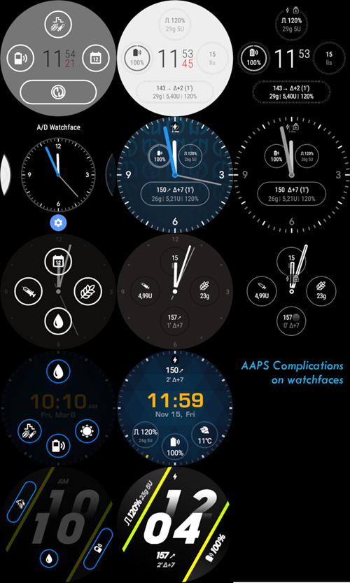
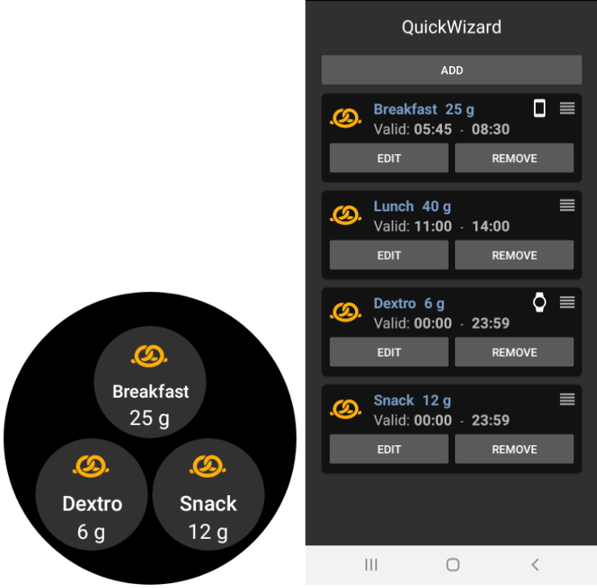

# AAPS בשעונים חכמים עם מערכת הפעלה Wear Os

אתם יכולים להתקין AndroidAPS בשעון החכם שלכם המבוסס **Wear Os**. גרסת השעון של AAPS מאפשר לכם:

* **להציג מידע בשעונכם**: באמצעות מבחר של [תצוגות מותאמות אישית](#aaps-watchfaces) או תצוגות סטנדרטיות בשימוש של [סיבוכים](#complications).
* **לשלוט על AAPS מהשעון**: להזריק בולוס, לקבוע ערך מטרה זמני וכו'.

### לפני קניית שעון...

* כמה תכונות כגון *סיבוכים* מחייבות גרסה 2.0 של Wear Os או מאוחרת יותר כדי לעבוד
* חברת גוגל שינתה שמה של *Android Wear 1.x* לשם *Wear OS* מגרסה 2.x, כך כאשר היא אומרת *Android Wear* יתכן שמתכוונת לגרסה הישנה 1.x של המערכת.
* אם התיאור של השעון החכם מצביעה על תאימות רק עם *Android* וגם *IOS* - זה **לא** אומר שהוא עובד עם *Wear Os* - יתכן שהיצרנים משתמשים במערכות משלהם **שלא תואמות AAPS wear!**
* Check [list of tested phones and watches](Phones-list-of-tested-phones) and [ask community](../Where-To-Go-For-Help/Connect-with-other-users.md) if in doubt if your watch will be supported

### בניית גרסת Wear OS של AAPS

אפליקציית Wear OS של AAPS הופרדה מבניית אפליקציית ה-Android של הטלפון הנייד. לכן עליכם ליצור APK חתום נפרד נוסף. בחרו את המודול "AndroidAPS.wear" ואת הגרסה לבנייה "fullRelease" כדי שאפליקציה שנייה עבור השעון Wear OS תיבנה במסגרת [בניית קובץ ה-APK](../Installing-AndroidAPS/Building-APK.md) (או "pumpcomtrolRelease" אשר תאפשר שליטה מהשעון במשאבה ללא לופ).

החל ממאי 2021 חובה להתקין את AAPS בשעון "מהצד", כי היא לא נגישה יותר דרך חנות האפליקציות של גוגל שבשעון. ניתן להתקין מן הצד בעזרת [Wear Installer](https://youtu.be/8HsfWPTFGQI) אותם צריך להתקין גם בשעון וגם בטלפון. האפליקצה Wear Installer ניתנת להורדה מחנות האפליקציות של גוגל. הסרטון המקושר מעלה של מפתח Wear Installer מלקולם בריינט, נותן הוראות מפורטות ל- א. להורדת האפליקציה לטלפון הנייד. ב. הגדרת ה-Android Debugger בשעון. ג. השימוש ב-Wear Installer בטלפון ובשעון כדי להתקין מהצד את אפליקציית AAPS wear בשעון. לאחר שתבחרו את AndroidAPS כאפליקציה להעלאת הגרסה של Wear בשעון, תוכל להשתמש במסכי תצוגה, סיבוכים ופונקציות לשליטה ב-AAPS.

### הגדרות בטלפון

Within AndroidAPS, in the ConfigBuilder you need to [enable Wear plugin](Config-Builder-wear).

## שליטה ב-AAPS מהשעון

AndroidAPS מותאם להיות *נשלט* על ידי שעוני Android Wear. אם אתם רוצים להזריק בולוס וכו' מהשעון, עליכם להפעיל את "שליטה משעון" בתוך "הגדרות Wear" בבונה התצורה.

הפונקציות הבאות ניתנות להפעלה מהשעון:

* קביעת ערך מטרה זמני
* use the bolus calculator (calculation variables can be defined in [settings](Config-Builder-wear) on the phone)
* הכרזת פחמימות ממושכות
* הזרקת בולוס (אינסולין + פחמימות)
* הגדרות שעון
* סטטוס 
    * בדיקת סטטוס המשאבה
    * בדיקת סטטוס הלופ
    * בדיקה והחלפת פרופיל, CPP (פרופיל אחוזים צירקדיים = היסט זמן + אחוז)
    * הצגת תצרוכת האינסולין הכללית (TDD=סיכום יומי של הבולוסים יחד עם המינונים הבזאליים)

## תצוגות שעונים של AAPS

ישנן כמה תצוגות לשעונים לבחירה אשר כוללים שינוי ממוצע, אינסולין זמין, מינון בזאלי זמני הנוכחי, פרופילים בזאליים וגרפים של קריאות מדידות גלוקוז בדם.

וודאו שהתראות מ-AndroidAPS לא חסומות בשעון. אישור של פעולה (כגון זריקת בולוס, יעד זמני וכו') תבוצע דרך התראות שתצטרכו להחליק ולאשר.

כדי להציג את התפריט של AAPS במהירות, הקישו פעמיים על קריאת גלוקוז הדם במסך. עם הקשה כפולה בעקומת הגלוקוז בדם, אתם יכולים לשנות את קנה מידת הזמן בתצוגה..

## תצוגות שעון זמינות

(Watchfaces-new-watchface-as-of-androidaps-2-8)=

### תצוגות שעון חדשות החל מגרסה AndroidAPS 2.8

* את הצבעים, השורות והעיגולים ניתן להגדיר בתפריט ההגדרות בגלגל השיניים של תפריט בחירת תצוגות השעות.

## תצוגת שעות AAPSv2 - מקרא

A - time since last loop run

B - CGM reading

C - minutes since last CGM reading

D - change compared to last CGM reading (in mmol or mg/dl)

E - average change CGM reading last 15 minutes

F - phone battery

G - basal rate (shown in U/h during standard rate and in % during TBR)

H - BGI (blood glucose interaction) -> the degree to which BG “should” be rising or falling based on insulin activity alone.

I - carbs (carbs on board | e-carbs in the future)

J - insulin on board (from bolus | from basal)

## גישה לתפריט הראשי של AAPS

To access main menu of AAPS you can use on of following options:

* הקשה כפולה בערך הגלוקוז בדם
* לבחור בצלמית AAPS בתפריט האפליקציות בשעון
* הקשה על "סיבוך" (אם מוגדר בתפריט)

## הגדרות (בשעון wear)

To access to the watchface settings, enter AAPS main menu, slide up and select "Settings".

Filled star is for enabled state (**On**), and hollow star icon indicates that setting is disabled (**Off**):

### פרמטרים נלווים של AAPS

* ** רטט בזמן בולוס** (ברירת מחדל `On`):
* **יחידות לפעולות** (ברירת מחדל `mg/dl`): אם **On** יחידות לפעולות `mg/dl`, אם **Off** היחידה היא `mmol/l`. בשימוש כאשר מוגדר יעד זמני (TT) מהשעון.

### הגדרות תצוגת פני השעון

* **הצג תאריך** (ברירת מחדל `Off`): הערה, התאריך לא זמין בכל סוגי פני השעון
* **הצג אינסולין פעיל** (ברירת מחדל `On`): מציג או לא מציג את ערך האינסולין הפעיל (הגדרות לערכים מפורטים נמצאות בפרמטרים של AAPS Wear)
* **הצג פחמימות פעילות** (ברירת מחדל `On`): מציג או לא ערך פחמימות פעילות
* **הצג דלתא** (ברירת מחדל `On`): מציג או לא את השינוי של הגלוקוז בדם ב-5 הדקות האחרונות
* **הצג דלתא ממוצעת** (ברירת מחדל `On`): מציג או לא את השינוי הממוצע של גלוקוז בדם ב-15 הדקות האחרונות
* **הצג סוללת הטלפון** (ברירת מחדל `On`): מצב סוללת הטלפון באחוזים. צבע אדום כשמתחת ל-30%.
* **הצג מצב סוללה משולבת** (ברירת מחדל `Off`): סוללה משולבת היא שילוב ערך מצב סוללה הטלפון, המשאבה והחיישן (בדרך כלל הערך הנמוך משלושת הערכים)
* **הצג מינון בזאלי** (ברירת מחדל `On`): מציג או לא את המינון בזאלי הנוכחי (ביחידות לשעה או באחוזים אם מופעל מינון בזאלי זמני)
* **הצג סטטוס לולאה** (ברירת מחדל`On`): מציג כמה דקות עברו מאז הפעלת הלופ האחרונה (חצים אדומים אם עברו מעל ל-15 דקות).
* **הצג רמת סוכר** (ברירת מחדל `On`): מציג או לא את ערך הגלוקוז האחרון
* **הצג חץ כיוון** (ברירת מחדל `On`): מציג או לא את חץ מגמת ערך הגלוקוז בדם
* **הצג עבר** (ברירת מחדל `On`): מציג כמה זמן עבר מאז הקריאה האחרונה של גלוקוז בדם.
* **כהה** (ברירת מחדל `On`): באפשרותכם להחליף מרקע שחור לרקע לבן (למעט תצוגת פנים של Cockpit ו-Steampunk)
* **הדגש בזאלים** (ברירת מחדל `Off`): משפר את הנראות של המינון הבזאלי והבזאלי הזמני
* **מחיצות מותאמות** (ברירת מחדל `Off`): עבור תצוגות AAPS, AAPSv2 ו- AAPS (גדול), מציג רקע מנוגד לחוצץ (**Off**) או מתאים את צבע הרקע לחוצץ (**On**)
* **מסגרת זמן התרשים** (ברירת מחדל `3 שעות`): הינכם יכולים לבחור בתפריט המשני את מסגרת הזמן המרבית של התרשים, בין שעה אחת לחמש שעות.

### הגדרות ממשק המשתמש

* **עיצוב קלט**: עם פרמטר זה, הנכם יכולים לבחור את מיקום מקשי "+" ו-"-" כאשר אתם מכניסים פקודות ל-AAPS (אינסולין, פחמימות, ע' מטרה זמני...)

### פרמטרים ספציפיים של פני השעון

#### פני שעון Steampunk

* **מפורט** (ברירת המחדל `בינוני`)

#### תצוגת פנים עיגול

* **מספרים גדולים** (ברירת מחדל `Off`): הגדלת גודל האותיות לשיפור הנראות
* **היסטוריית הטבעת** (ברירת מחדל `Off`): ראו בגרף את היסטוריית הגלוקוז בדם עם טבעות אפורות בתוך הטבעת הירוקה של השעות
* **טבעת היסטוריה כהה** (ברירת מחדל `On`): טבעת היסטוריה פחות בולטת בצבע באפור כהה
* **הנפשה** (ברירת מחדל `On`): כאשר מופעלת, העיגול על פני השעון מונפש בתנאי שהאפשרות נתמכת על ידי השעון ושאינו עם רזולוציה נמוכה עקב מצב חיסכון באנרגיה

### הגדרות פקודות

* **אשף בתפריט** (ברירת מחדל `On`): מאפשר ממשק אשף בתפריט הראשי לרישום פחמימות ולהגדרת בולוס מהשעון
* **תיחול בתפריט** (ברירת מחדל `Off`): מאפשר תיחול \ מילוי מהשעון
* **ערך מטרה יחיד** (ברירת מחדל `On`):
    
    * `On`: הנכם מגדירים ערך יחיד של מטרה זמנית
    * `Off`: הנכם מגדירים ערך מטרה נמוך וגבוה עבור מטרה זמנית

* **אחוז האשף** (ברירת המחדל `off`): מאפשר בולוס תיקון מהאשף (הערך הוזן באחוזים לפני הודעת האישור)

(Watchfaces-complications)=

## סיבוכים

*Complication* is a term from traditional watchmaking, where it describes addition to the main watchface - as another small window or sub-dial (with date, day of the week, moon phase, etc.). Wear OS 2.0 brings that metaphor to allow custom data providers, like weather, notifications, fitness counters and more - to be added to any watchfaces that support complications.

AndroidAPS Wear OS app supports complications since build `2.6`, and allow any third party watchface that supports complications to be configured to display AAPS related data (BG with the trend, IOB, COB, etc.).

Complications also serve as **shortcut** to AAPS functions. By tapping them you can open AAPS related menus and dialogs (depending on complication type and configuration).

### סוגי סיבוכים

AAPS Wear OS app provides only raw data, according to predefined formats. It is up to third-party watchface to decide where and how to render complications, including its layout, border, color, and font. From many Wear OS complication types available, AAPS uses:

* `טקסט קצר` - מכיל שתי שורות של טקסט, 7 תווים כל אחת, אליהן מתייחסים לפעמים כערך ותווית. לרוב מוצגים בתוך עיגול או אליפסה - אחד מתחת לאחר, או זה לצד זה. זהו סיבוך עם מקום מוגבל ביותר. AAPS מנסה להסיר תווים לא נחוצים כדי להתאימם: על ידי עיגול ערכים, הסרת אפסים מקדימים או נגררים מהערכים וכו'.
* `טקסט ארוך` - מכיל שתי שורות של טקסט, עם 20 תווים בערך כל אחד. בדרך כלל מוצגות בתוך מלבן או אליפסה ארוכה - אחת מתחת לשניה. משמש למצבים טקסטואלים יותר מפורטים.
* `ערך טווח` - משמש לטווח מוגדר מראש של ערכים, כגון אחוזים. הוא מכיל צלמית, תווית ומוצג כחוגה מעוגלת של התקדמות.
* `תמונה גדולה` - תמונת רקע מותאמת אישית שיכולה לשמש כרקע (כאשר היא נתמכת על ידי השעון).

### הגדרות סיבוכים

To add complication to watchface, configure it by long press and clicking the gear icon below. Depending on how specific watchface configures them - either click on placeholders or enter the watchface setup menu for complications. AAPS complications are grouped under the AAPS menu entry.

When configuring complications on watchface, Wear OS will present and filter the list of complications that can be fit into selected complication place on watchface. If specific complications cannot be found on the list, it is probably due to its type that cannot be used for the given place.

### סיבוכים מסופקים על ידי AAPS

AndroidAPS provides following complications:

* **BR, COB & IOB** (`טקסט קצר`, פותח תפריט): מציג ערך גלוקוז בדם וחץ מגמה בשורה הראשונה וזמן ושינוי המדידה בשורה השנייה.
* **Blood Glucose** (`טקסט קצר`, פותח* תפריט*): מציג ערך גלוקוז בדם וחץ מגמה בשורה הראשונה וזמן ושינוי המדידה בשורה השנייה.
* **CoB & IoB** (`טקסט קצר`, פותח *תפריט*): מציג *פחמימות זמינות* בשורה הראשונה ו*אינסולין זמין* בשורה השנייה.
* **CoB מפורט** (`טקסט קצר`, פותח *אשף*): מציג *פחמימות פעילות* בשורה הראשונה ופחמימות מתוכננות (בעתיד, פחמימות ממושכות) בשורה השנייה.
* **צלמית CoB** (`טקסט קצר`, פותח *אשף*): מציג * ערך פחמימות פעילות* עם צלמית סטטית.
* **Full Status** (`טקסט ארוך`, פותח *תפריט*): מציג את רוב הנתונים בבת-אחת: * ערך גלוקוז בדם *ו*חץ מגמה*,*שינוי גלוקוז בדם* ו* זמן המדידה* בשורה הראשונה. בשורה השנייה *פחמימות פעילות*, *אינסולין פעיל* ו*המינון הבזאלי*.
* **Full Status (הפוך)** (`טקסט ארוך`, פותח *תפריט*): אותם נתונים כמו הסטטוס המלא הסטנדרטי אבל בשורות הפוכות. ניתן להשתמש בו בפני שעונים אשר מתעלמים מאחת משתי השורות ב`טקסט הארוך`
* **IoB מפורט** (`טקסט קצר`, פותח * בולוס*): מציג סך אינסולין פעיל בשורה הראשונה ואת מרכיביו מבולוס ומינונים בזאליים, בשורה השניה.
* **צלמית IoB** (`טקסט קצר`, פותח * בולוס*): מציג ערך אינסולין פעיל עם צלמית סטטית.
* **סוללת הטלפון** (`ערך טווח`, פותח *סטטוס*): מציג את אחוז טעינת סוללת הטלפון, כפי שמדווח על ידי AAPS. מוצג באחוזים עם צלמית של סוללה שמייצגת את הערך המדווח. יתכן שלא יתעדכן בזמן אמת, אבל כן כאשר נתונים חשובים אחרים של AAPS משתנים (בדרך כלל כל 5 דקות עם קריאה חדשה של גלוקוז בדם).

Additionally, there are three complications of `LARGE IMAGE` kind: **Dark Wallpaper**, **Gray Wallpaper** and **Light Wallpaper**, displaying static AAPS wallpaper.

### הגדרות הקשורות לסיבוכים

* **פעולת הקשה על סיבוך** (ברירת מחדל `ברירת מחדל`): מחליט איזה דיאלוג נפתח כאשר המשתמש מקיש על הסיבוך: 
    * *ברירת מחדל*: פעולה מסוימת לסוג הסיבוך *(ראו רשימה לעיל)*
    * *תפריט*: תפריט ראשי של AAPS
    * *אשף*: אשף בולוס - מחשבון בולוס
    * *בולוס*: מינון בולוס ישיר
    * *פחמימות ממושכות*: תיבת שיח של פחמימות ממושכות
    * *סטטוס*: תפריט משני של הסטטוס
    * *None*: מבטל את הפעולה של הסיבוך של AAPS
* **יוניקוד בסיבוכים** (ברירת מחדל `On`): כאשר `On`, הסיבוך משתמש בתווי יוניקוד לסמלים כגון דלתא `Δ`, מפריד נקודות אנכי `⁞` או סימן של שיעור בזאלי `⎍`. הצגתם תלויה בגופן והיא יכולה להיות ספציפית לפני שעון מסוים. אפשרות זו מאפשרת להחליף סמלי יוניקוד `Off` כאשר נדרש - אם הגופן שבשימוש פני השעון לא תומך בסמלים אלה - כדי למנוע תקלות גרפיות.

## Wear OS Tiles

Wear OS Tiles provide easy access to users' information and actions to get things done. The tiles are only available on Android smartwatches running on Wear Os version 2.0 and higher.

Tiles allow you to quickly access actions on the AAPS application without going through the watch face menu. The tiles are optional and can be added and configured by the user.

The tiles are used "next to" any watch face. To access a tile, when enabled, swipe right to left on your watch face to show them.

Please note; that the tiles do not hold the actual state of the AAPS phone app and will only make a request, which has to be confirmed on the watch before it is applied.

## How to add Tiles

Before using the tiles, you have to switch on "Control from Watch" in the "Wear OS" settings of Android APS.

Depending on your Wear OS version, brand and smartphone there are two ways of enabling the tiles:

1. On your watch, from your watch face; 
    * Swipe right to left till you reach the "+ Add tiles" 
    * Select one of the tiles.
2. On your phone open the companion app for your watch. 
    * For Samsung open "Galaxy Wearable", or for other brands "Wear OS"
    * In the click on the section "Tiles", followed by "+ Add" button
    * Find the AAPS tile you like to add by selecting it.  The order of the tiles can be changed by dragging and dropping

The content of the tiles can be customized by long-pressing a tile and clicking the "Edit" or "gear icon" button.

### APS(Actions) Tile

The action tile can hold 1 to 4 user-defined action buttons. To configure, long-press the tile, which will show the configuration options. Similar actions are also available through the standard watch menu.

Actions supported in the Action tile can request the AAPS phone app for:

* **Calc**; do a bolus calculation, based on carb input and optional a percentage [1]
* **Insulin**; request insulin delivery by entering the unit of insulin
* **Treatment**; request both insulin delivery and add carbs
* **Carbs**; add (extended) carbs
* **TempT**; set a custom temporary target and duration

[1] Via, the Wear OS menu, set the "Calculator Percentage" option to "ON" to show the percentage input in the bolus calculator. The default percentage is based on the phone settings in the"Overview" section ["Deliver this part of the bolus wizard result %"](Config-Builder.html#advanced-settings) When the user does not provide a percentage, the default value from the phone is used. Configure the other parameters for the bolus calculator in the phone app via "Preferences" "Wizard Settings".

### AAPS(Temp Target) Tile

The Temp Target Tile can request a temporary target based on AAPS phone presets. Configure preset time and targets through the phone app setting by going to "Preferences", "Overview", ["Default Temp-Targets"](Config-Builder.html#default-temp-targets) and set the duration and targets for each preset. Configure the visible actions on the tile through the tile settings. Long press the tile to show the configuration options and select 1 to 4 options:

* **Activity**; for sport
* **Hypo**; to raise the target during hypo treatment
* **Eating soon**; to lower the target to raise the insulin on board
* **Manual**; set a custom temporary target and duration
* **Cancel**; to stop the current temporary target

### AAPS(QuickWizard)Tile

The QuickWizard tile can hold 1 to 4 quick wizard action buttons, defined with the phone app[2]. See [QuickWizard](Config-Builder.html#quickwizard-settings). You can set standard meals (carbs and calculation method for the bolus) to be displayed on the tile depending on the time of the day. Ideal for the most common meals/snacks you eat during the day. You can specify if the quick wizard buttons will show on the phone, watch, or both. Please note that the phone can show only one quick wizard button at a time. The quick wizard setup also can specify a custom percentage of the insulin for the bolus. The custom percentage enables you to vary, for example, snack at 120%, slow absorbing breakfast 80% and hypo treatment sugar snack at 0%

[2] Wear OS limits tiles update frequency to only once every 30 seconds. When you notice that the changes on your phone are not reflected on the tile, consider; waiting 30 seconds, using the "Resend all data" button from the Wear OS section of AAPS, or removing the tile and adding it again. To change the order of the QuickWizard buttons dragging an item up or down.

## Always on

Long battery life for Android Wear OS smartwatches is a challenge. Some smartwatches get as much as 30 hours before recharging. The display should be switched off for optimal power saving when not in use. Most watches support the “Always on” display.

Since AAPS version 3, we can use a “Simplify UI” during always-on-mode. This UI only contains the blood glucose, direction, and time. This UI is power-optimized with less frequent updates, showing less information and lightening fewer pixels to save power on OLED displays.

The simplified UI mode is available for the watch-faces: AAPS, AAPS V2, Home Big, Digital Style, Steampunk, and Cockpit. The simplified UI is optional and is configured through the watch face settings. (log press the watch face and click “edit” or the gear icon) Select the configuration “Simplify UI" and set it to “Always on” or “Always on and charging”.

### Night-time mode

While charging, it would be helpful if the display could stay “always-on” and show your blood glucose during the night. However, the standard watch-faces are too bright and have too much information, and the details are hard to read with sleepy eyes. Therefore, we added an option for the watch-face to simplify the UI only during charging when set in the configuration.

The simplified UI mode is available for the watch-faces: AAPS, AAPS V2, Home Big, Digital Style, Steampunk, and Cockpit. The simplified UI is optional and is configured through the watch face settings. (log press the watch face and click “edit” or the gear icon) Select the configuration “Simplify UI" and set it to “During charging” or “Always on and charging”

The Android developer options enable your watch to stay awake during charging. To make the developer options available, see https://developer.android.com/training/wearables/get-started/debugging. Set the “Stay awake when charging” to “on” in the developer options”.

Note: not all displays can handle always-on very well. It can cause screen burn-in, especially on the older OLED displays. The watches will generally dim the display to prevent burn-in; please check your owner’s manual, the manufacturing, or the internet for advice.

### Performance and battery life tips

Wear OS watches are very power-constrained devices. The size of the watch case limits the capacity of the included battery. Even with recent advancements both on hardware and software side, Wear OS watches still require daily charging.

If an experienced battery span is shorter than a day (from dusk to dawn), here are some tips to troubleshoot the issues.

Main battery-demanding areas are:

* Active display with a backlight on (for LED) or in full intensity mode (for OLED)
* Rendering on screen
* Radio communication over Bluetooth

Since we cannot compromise on communication (we need up-to-date data) and want to have the most recent data rendered, most of the optimizations can be done in *display time* area:

* Stock watchfaces are usually better optimized than custom one, downloaded from the store.
* It is better to use watchfaces that limit the amount of rendered data in inactive / dimmed mode.
* Be aware when mixing other Complications, like third party weather widgets, or other - utilizing data from external sources.
* Start with simpler watchfaces. Add one complication at the time and observe how they affect battery life.
* Try to use **Dark** theme for AAPS watchfaces, and [**Matching divider**](#watchface-settings). On OLED devices it will limit the amount of pixels lit and limit burnout.
* Check what performs better on your watch: AAPS stock watchfaces or other watchfaces with AAPS Complications.
* Observe over a few days, with different activity profiles. Most watches activate the display on glancing, movement and other usage-related triggers.
* Check your global system settings that affect performance: notifications, backlight/active display timeout, when GPS is activated.
* Check [list of tested phones and watches](Phones-list-of-tested-phones) and [ask community](../Where-To-Go-For-Help/Connect-with-other-users.md) for other users experiences and reported battery lifetime.
* **We cannot guarantee that data displayed on watchface or complication is up-to-date**. In the end, it is up to Wear OS to decide when to update a watchface or a complication. Even when the AAPS app requests update, the System may decide to postpone or ignore updates to conserve battery. When in doubt and low on battery on watch - always double-check with main AAPS app on phone.

(Watchfaces-troubleshooting-the-wear-app)=

## Troubleshooting the wear app:

* Sometimes it helps to re-sync the apps to the watch as it can be a bit slow to do so itself: Android Wear > Cog icon > Watch name > Resync apps.
* Enable ADB debugging in Developer Options (on watch), connect the watch via USB and start the Wear app once in Android Studio.
* If Complications does not update data - check first if AAPS watchfaces work at all.

### Sony Smartwatch 3

* The Sony Smartwach 3 is one of the most popular watches to be used with AAPS.
* Unfortunately Google dropped support for wear OS 1.5 devices in fall 2020. This leads to problems when using Sony SW3 with AndroidAPS 2.7 and above.
* A possible workaround can be found on this [troubleshooting page](../Usage/SonySW3.md).

## View Nightscout data

If you are using another looping system and want to *view* your looping detail on an Android Wear watch, or want to watch your child's looping, then you can build/download just the NSClient APK. To do this follow the [build APK instructions](../Installing-AndroidAPS/Building-APK.md) selecting the build variant "NSClientRelease". ישנן כמה תצוגות לשעונים לבחירה אשר כוללים שינוי ממוצע, אינסולין זמין, מינון בזאלי זמני הנוכחי, פרופילים בזאליים וגרפים של קריאות מדידות גלוקוז בדם.

# Pebble

Pebble users can use the [Urchin watchface](https://github.com/mddub/urchin-cgm) to *view* looping data (if uploaded to Nightscout), but you will not be able to interact with AndroidAPS through the watch. You can choose fields to display such as IOB and currently active temp basal rate and predictions. If open looping you can use [IFTTT](https://ifttt.com/) to create an applet that says if Notification received from AndroidAPS then send either SMS or pushover notification.