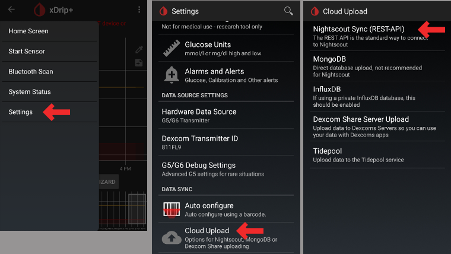
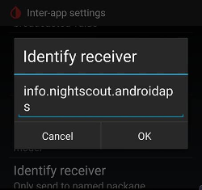
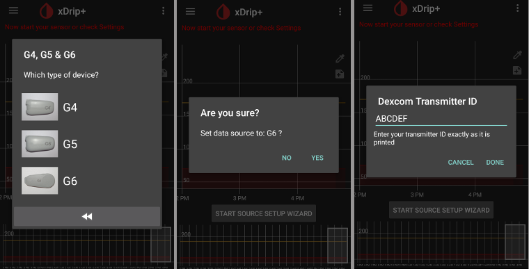
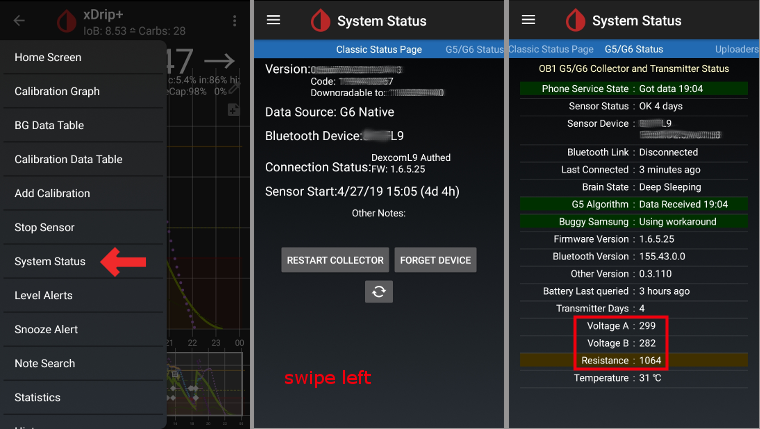
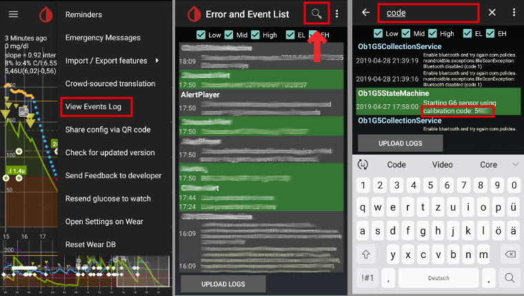
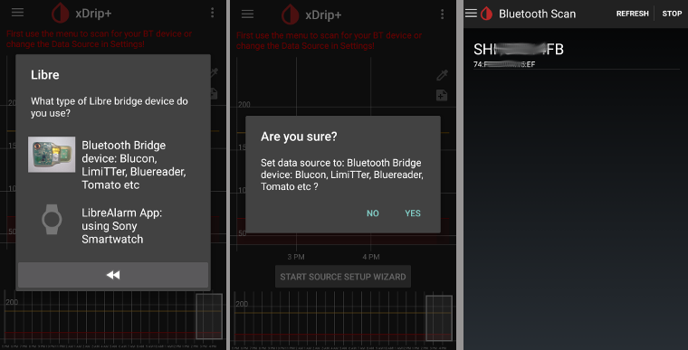

# הגדרות xDrip+

(לקבלת מידע נוסף אודות xDrip+ גשו לכתובת https://xdrip.readthedocs.io/en/latest/)

אם עוד לא התקנתם, הורידו [מכאן את xDrip+](https://jamorham.github.io/#xdrip-plus).

**תיעוד זה נועד ל-xDrip במכשירי אנדרואיד בלבד.** ישנו "xDrip for iOS" ולו אין כל קשר עם xDrip+ של מכשירי אנדרואיד.

עבור משדרי G6 המיוצרים לאחר סתיו/סוף 2018 (כלומר מספר סידורי המתחיל ב-81 או 80) תוכלו להשתמש [בגרסה הראשית](https://jamorham.github.io/#xdrip-plus).

אם המספר הסידורי של משדר G6 מתחיל ב-8G..., 8J... או 8L... השתמשו [בגרסה הלילית העדכנית](https://github.com/NightscoutFoundation/xDrip/releases).

אם הטלפון מפעיל את Android 10 ואתם נתקלים בקשיים ב- xDrip+ בגרסה הראשית, נסו להתקין [גרסה לילית מ-31/12/2019 ואילך](https://github.com/NightscoutFoundation/xDrip/releases).

## הגדרות בסיסיות לכל סוגי החיישנים

* וודאו שהגדרתם את כתובת הנייטסקאוט כראוי, כולל **S** בסוף http**s**:// (לא http://) וכולל הסיומת /api/v1 כמודגם.
   
   לדוגמה: https://API_SECRET@your-app-name.herokuapp.com/api/v1/
   
   ב-xDrip, תפריט המבורגר (בפינה השמאלית העליונה) > הגדרות > העלאה לענן > סינכרון לנייטסקאוט (rest api) > כתובת URL בסיסית

* אם תיבת הסימון של `כיול אוטומטי` מסומנת, הפעילו את `הורדת הנתונים` פעם אחת, ולאחר מכן כבו את תיבת הסימון ל`כיול אוטומטי` והשביתו את `הורדת הנתונים` שוב, אחרת הטיפולים (אינסולין ופחמימות) יתווספו פעמיים לנייטסקאוט.

* בחרו ב`אפשרויות נוספות`

* בטלו את `העלאת טיפולים` ו`נתוני מילוי חוזר`.
   
   **אזהרת בטיחות: עליכם לבטל את "העלאת טיפולים" מ-xDrip+, אחרת הטיפולים יוכפלו ב-AAPS ונתוני האינסולין והפחמימות הפעילים יהיו מוטעים.**

* על האפשרות `התראה על כשלונות` להיות כבויה. אחרת תקבלו התראה כל 5 דקות אם אין חיבור לאינטרנט או אם השרת אינו נגיש.
   
   
   
   

* **הגדרות לשיתוף פעולה בין אפליקציות** (הפץ על הטלפון) אם תשתמשו ב-AndroidAPS והנתונים של xDrip צריכים להיות מופנים ל-AndroidAPS, עליכם להפעיל את הפץ על הטלפון בתפריט הגדרות לשיתוף פעולה בין אפליקציות.

* על מנת שהערכים יהיו שווים, עליכם להפעיל `שלח גלוקוז מוצג`.

* אם אפשרתם את `קבל טיפולים` וגם את "אפשר שידורים מקומיים" ב-AndroidAPS, אז xDrip+ יקבל מידע על אינסולין, פחמימות ומינונים בזאליים מ-AndroidAPS ויוכל להעריך את תחזית להתנהגות הסוכר וכו' טוב יותר.
   
   

(xdrip-identify-receiver)=

### זיהוי מקלט

* If you discover problems with local broadcast (AAPS not receiving BG values from xDrip+) go to Settings > Inter-app settings > Identify receiver and enter `info.nightscout.androidaps` for AndroidAPS build (if you are using PumpControl build, please enter `info.nightscout.aapspumpcontrol` instead!!).
* שימו לב: תיקון אוטומטי נוטה לפעמים לשנות את האות הראשונה לאות גדולה. You **must use only lowercase letters** when typing `info.nightscout.androidaps` (or `info.nightscout.aapspumpcontrol` for PumpControl). Capital I would prevent the App from receiving BG values from xDrip+.
   
   

## xDrip ודקסקום G6

* ניתן לחבר בו-זמנית משדר דקסקום G6 למקלט דקסקום (או לחילופין את המשאבה t:slim) ואפליקציה אחת בטלפון.
* בעת שימוש ב-xDrip+ כמקלט הסירו תחילה את אפליקציית דקסקום. **לא ניתן לחבר את xDrip+ וגם את אפליקציית דקסקום למשדר בו-זמנית!**
* If you need Clarity and want to profit from xDrip+ alarms use the [Build Your Own Dexcom App](DexcomG6-if-using-g6-with-build-your-own-dexcom-app) with local broadcast to xDrip+.

### גרסת xDrip+ בהתאם למספר הסידורי של משדר G6

* עבור משדרי G6 המיוצרים לאחר סתיו/סוף 2018 (כלומר מספר סידורי שמתחיל ב-80 או 81) תוכלו להשתמש ב[גרסת המאסטר](https://jamorham.github.io/#xdrip-plus). 
* אם המספר הסידורי של משדר G6 מתחיל עם 8G, 8H או 8J נסו [גרסה לילית מ-28/07/2019 ואילך](https://github.com/NightscoutFoundation/xDrip/releases).

### הגדרות ספציפיות לדקסקום

* פתחו את הגדרות דיבאג של G5/G6: תפריט המבורגר (משמאל למעלה במסך הבית) > הגדרות > הגדרות דיבאג של G5/G6

* הפעילו את ההגדרות הבאות
   
   * `Use the OB1 Collector`
   * `Native Algorithm` (חשוב למשתמשי SMB)
   * `G6 support`
   * `Allow OB1 unbonding`
   * `Allow OB1 initiate bonding`
* כל שאר ההגדרות בתפריט זה צריכות להיות כבויות
* שנו את רמת האזהרה של הסוללה ל-280 (בתחתית תפריט הגדרות דיבאג G5/G6) 
   
   

### אתחול מונע לא מומלץ 

**With Dexcom transmitters who's serial no. is starting with 8G, 8H or 8J preemptive restarts do not work and might kill the sensor completely!**

The automatic extension of Dexcom sensors (`preemptive restarts`) is not recommended as this might lead to “jumps” in BG values on day 9 after restart.

What’s clear is that using the G6 is perhaps a little more complex than it as first suggests. To use it safely, there are a few points to be aware of:

* אם אתם משתמשים בנתונים הנאטיביים (Native Data) עם קוד הכיול ב-xDrip+ או ב-Spike, הדבר הבטוח ביותר שאפשר לעשות הוא לא לאפשר הפעלה מחדש של החיישן.
* אם אתם מוכרחים להשתמש באתחול מונע, הקפידו להפעיל זאת בזמן ביום בו תוכלו לצפות בשינוי ולכייל במידת הצורך. 
* אם אתם מפעילים מחדש חיישנים, בצעו זאת ללא כיול המפעל לקבלת התוצאות הבטוחות ביותר בימים 11 ו -12, או וודאו שאתם מוכנים לכייל ולשים עין על סטיות.
* "השרייה" מוקדמת של ה-G6 (הדבקת חיישן מבלי להפעילו למספר שעות) עם כיול המפעל עשויה לגרום סטיה בתוצאות. אם אתם עושים השרייה מוקדמת, כדי לקבל את התוצאות הטובות ביותר, סביר להניח שתצטרכו לכייל את החיישן.
* אם אינכם מקפידים לפקח על השינויים שעלולים להתרחש, אולי עדיף לחזור למצב שאינו מכויל ע"H היצרן ולהשתמש במערכת כמו G5.

To learn more about the details and reasons for these recommendations read the [complete article](https://www.diabettech.com/artificial-pancreas/diy-looping-and-cgm/) published by Tim Street at [www.diabettech.com](https://www.diabettech.com).

(xdrip-connect-g6-transmitter-for-the-first-time)=

### חיבור משדר G6 בפעם הראשונה 

**For second and following transmitters see [Extend transmitter life](xdrip-extend-transmitter-life) below.**

עבור משדרי G6 המיוצרים לאחר סתיו/סוף 2018 (כלומר מספר סידורי שמתחיל ב-80 או 81) תוכלו להשתמש ב[גרסת המאסטר](https://jamorham.github.io/#xdrip-plus).

אם המספר הסידורי של משדר G6 מתחיל עם 8G, 8H או 8J נסו [גרסה לילית מ-28/07/2019 ואילך](https://github.com/NightscoutFoundation/xDrip/releases).

* כבו את מקלט דקסקום המקורי (אם נעשה בו שימוש).
* לחצו לחיצה ארוכה על סמל xDrip+ (טיפת דם) במסך הראשי כדי להפעיל את `אשף בחירת סנסור`.
* שימוש בלחצן אשף המקור מבטיח הגדרות ברירת מחדל הכוללות OB1 ומצב נאטיבי 
   * זה ינחה אותכם בהגדרה הראשונית. 
   * תזדקקו להזין את המספר הסידורי של המשדר אם זו הפעם הראשונה שבה אתה משתמש בו. 

* הזינו את המספר הסידורי של המשדר החדש (שעל אריזת המשדר או בגב המשדר). היזהרו לא להתבלבל בין `0` (אפס) לבין ` O ` (האות o).
   
   

* הכניסו חיישן חדש (רק אם מחליפים אותו)

* הכניסו את המשדר לחיישן
* אם צצה הודעה המבקשת להתאמה עם "DexcomXX", כאשר "XX" הוא שני התווים האחרונים של המספר הסידורי של המשדר, אשרו אותה (הקישו על "צמד")
* אין להפעיל חיישן חדש לפני שהמידע הבא מוצג בדף הסטטוס הקלאסי > מצב G5/G6 < PhoneServiceState:
   
   * משדר עם מספר סידורי המתחיל ב- 80 או 81: "Got data hh:mm" (לדוגמה: "Got data 19:04")
   * משדרים עם מספרים סידוריים המתחילים ב-8G, 8H, 8J וכו': "Got glucose hh:mm" (לדוגמה: "Got glucose 19:04") או "Got no raw hh:mm" (לדוגמה: "Got no raw 19:04") 
   
   

* התחל חיישן (רק אם מחליפים)
   
   > בחלק התחתון של המסך יוצג `Warm Up x,x hours left` לאחר מספר דקות.

-> If your transmitter serial no. does not start with 8G, 8H or 8J and there is no time specification after a few minutes stop and restart the sensor.

* הפעילו מחדש את האוסף (סטטוס מערכת - אם לא מחליף חיישן) 
* אל תפעיל את מקלט הדקסקום המקורי (אם יש) לפני ש-xDrip+ יציג נתוני סוכר ראשונים.
* לחצו לחיצה ארוכה על סמל טיפת דם של xDrip+ במסך הראשי כדי להשבית את הלחצן `לחצן אשף המקורות`.
   
   
   
   
   
   
   
   

(xdrip-transmitter-battery-status)=

### מצב סוללת המשדר

* ניתן לשלוט על מצב הסוללה בסטטוס מערכת (תפריט המבורגר משמאל למעלה במסך הבית)
* החליקו שמאלה כדי לראות את המסך השני.

* הערכים המדויקים בהם המשדר "מת" עקב סוללה ריקה אינם ידועים. המידע הבא פורסם ברשת לאחר שהמשדר "מת":
   
   * פרסום 1: ימי משדר: 151 / מתח A: 297 / מתח B: 260 / התנגדות: 2391 
   * פרסום 2: ימי משדר: 249 / מתח A: 275 (בזמן הכישלון)

(xdrip-extend-transmitter-life)=

### הארכת חיי המשדר

* עד כה לא ניתן להאריך את חיי המשדרים עם מספר סידורי שמתחיל עם 8G, 8H, 8J וכו'. כך גם לגבי משדרים עם מספר סידורי starting with 81 and firmware 1.6.5.**27** (see xDrip+ System Status - G5/G6 status as shown in [screenshot above](xdrip-transmitter-battery-status)).
* כדי למנוע קשיים בהפעלת חיישנים, מומלץ מאוד להאריך את חיי המשדר רק לפני היום ה-100 לשימוש הראשון במשדר.
* הארכת חיי משדרים עם מספר סידורי starting with 81 and firmware 1.6.5.**27** beyond day 100 is only possible if [engineering mode](nabling-Engineering-Mode-in-xDrip) is turned on and 'native mode' is deactivated (hamburger menu -> settings -> G5/G6 debug settings -> native algorithm) because a transmitter hard reset is NOT possible.
* הארכת חיי המשדר תפסיק פעולת חיישן שרץ. לכן, האריכו את חיי החיישן לפני החלפתו או שימו לב שיש שלב חימום חדש של שעתיים.
* עצרו את החיישן באופן ידני באמצעות תפריט המבורגר.
* עברו למצב `מצב הנדסה`: 
   * הקישו על הסמל שבצד ימין במסך הראשי של xDrip המייצג מזרק 
   * לאחר מכן הקישו על סמל המיקרופון בפינה הימנית התחתונה 
   * בתיבת הטקסט שנפתחת הקלידו "enable engineering mode" 
   * לחצו על "אישור" 
   * אם מנוע Google Speak מופעל, תוכל גם לדבר בפקודה הקולית: "enable engineering mode". 
* עברו אל הגדרות דיבאג G5/G6 וודאו ש`שימוש באוסף OB1 ` מופעל.
* השתמשו בפקודה הקולית: "hard reset transmitter" 
* הפקודה הקולית תבוצע עם קבלת הנתונים הבאים של מהמשדר 
* עקבו אחר מצב המערכת (תפריט המבורגר -> סטטוס מערכת)
* לאחר כ-10 דקות תוכלו לעבור ל'דף סטטוס קלאסי '(החלקה ימינה) ולחצו על 'הפעל אוסף מחדש'. פעולה זו תקבע את חיי החיישן ל-0 ללא צורך בהפעלת חיישן חדש. 
* חלופה: אם מוצגת הודעה "מצב שירות טלפון: איפוס קשיח אולי נכשל" במסך סטטוס המערכת השני פשוט הפעילו את החיישן והודעה זו אמורה להיעלם. 
   
   

* גיל המשדר יאופס לאחר הארכה מוצלחת והתחלת חיישן. 

(xdrip-replace-transmitter)=

### החלפת משדר

עבור משדרי G6 המיוצרים לאחר סתיו/סוף 2018 (כלומר מספר סידורי שמתחיל ב-80 או 81) תוכלו להשתמש ב[גרסת המאסטר](https://jamorham.github.io/#xdrip-plus).

אם המספר הסידורי של משדר G6 is starting with 8G, 8H or 8Juse one of the [latest nightly builds](https://github.com/NightscoutFoundation/xDrip/releases).

* כבו את מקלט דקסקום המקורי (אם נעשה בו שימוש).
* עצרו את החיישן (רק אם מחליפים)
   
   וודאו שהחיישן עצר:
   
   במסך השני של סטטוס G5\G6, בדקו מה רשום ב-`Queue Items` (באמצע המסך), צפוי שיהיה רשום `(1) Stop Sensor`
   
   המתינו מספר דקות לשינוי בטקסט. על סטטוס הסנסור להיות "נעצר" (ראו תמונת מסך).
   
   > להסרת המשדר ללא עצירת החיישן צפו בסרטון <https://youtu.be/AAhBVsc6NZo>.
   
   
   
   

* לחצו על "שכח מכשיר" במסך סטטוס המערכת וגם מחקו את המשדר מהגדרות חיבור הבלוטות' (יופיע כ-DexcomXX כך ש- XX מציין את התווים האחרונים במספר הסידורי של המשדר)
   
   

* הסירו את המשדר (ואת החיישן אם אתם מעוניינים להחליפו)

* הרחיקו את המשדר כדי למנוע חיבור לטלפון. מיקרוגל הוא כלוב פארדיי מושלם למטרה זו, רק וודאו לנתקו מהחשמל כדי לוודא שלא יופעל בטעות בזמן שהמשדר בתוכו.
* לחצו לחיצה ארוכה על סמל xDrip+ (טיפת דם) במסך הראשי כדי להפעיל את `אשף בחירת סנסור`.
* שימוש בלחצן אשף המקור מבטיח הגדרות ברירת מחדל הכוללות OB1 ומצב נאטיבי 
   * זה ינחה אותכם בהגדרה הראשונית. 
   * תזדקקו להזין את המספר הסידורי של המשדר אם זו הפעם הראשונה שבה אתה משתמש בו. 
* הזינו מספר סידורי של המשדר החדש. היזהרו לא להתבלבל בין 0 (אפס) לבין O (האות o).
* הכניסו חיישן חדש (רק אם מחליפים אותו).
* הכניסו את המשדר לחיישן - **אל תפעילו מיד את החיישן!** 
* במשדרי Firefly החדשים (מס 'סידורי המתחיל ב-8G, 8H, 8J וכו') ניתן להשתמש רק במצב נטיבי. 
* אין להפעיל את האפשרויות הבאות עבור "משדרי Firefly" חדשים (מספר סידורי המתחיל ב-8G, 8H, 8J וכו'): 
   
   * Preemptive Restart (כבו!)
   * Restart sensor (כבו!)
   * Fallback to xDrip+ (כבו!)
   
   

* בדקו בדף סטטוס קלאסי > סטטוס G5/G6 > בשדה PhoneServiceState אם מוצג המידע הבא: 
   
   * משדר עם מספר סידורי המתחיל ב- 80 או 81: "Got data hh:mm" (לדוגמה: "Got data 19:04")
   * משדרים עם מספרים סידוריים המתחילים ב-8G, 8H, 8J וכו': "Got glucose hh:mm" (לדוגמה: "Got glucose 19:04") או "Got no raw hh:mm" (לדוגמה: "Got no raw 19:04") 
   
   

* המתינו 15 דקות מכיוון שהמשדר אמור לתקשר מספר פעמים עם xDrip לפני תחילת חיישן חדש. נתוני הסוללה יוצגו מתחת למידע הקושחה. 
   
   

* הפעילו חיישן ואל תודיעו על הפעלה בעבר! תמיד בחרו "כן, היום"! 

* הפעילו מחדש את האוסף (סטטוס מערכת - אם לא מחליף חיישן) 
* אל תפעיל את מקלט הדקסקום המקורי (אם יש) לפני ש-xDrip+ יציג נתוני סוכר ראשונים.
* לחצו לחיצה ארוכה על סמל טיפת דם של xDrip+ במסך הראשי כדי להשבית את הלחצן `לחצן אשף המקורות`.
   
   
   
   
   
   
   
   

### חיישן חדש

* כבו את מקלט דקסקום המקורי (אם נעשה בו שימוש).
* עצרו את החיישן במידת הצורך 
   
   וודאו שהחיישן עצר:
   
   במסך השני של סטטוס G5\G6, בדקו מה רשום ב-`Queue Items` (באמצע המסך), צפוי שיהיה רשום `(1) Stop Sensor`
   
   המתינו מספר דקות לשינוי בטקסט.
   
   
   
   

* נקו את המגעים (בחלק האחורי של המשדר) עם אלכוהול ותנו להם להתייבש באוויר.

* במקרה שאתם משתמשים בפונקציה זו, השביתו את `אתחל חיישן` ו`אתחול מונע` (תפריט המבורגר > הגדרות > הגדרות דיבאג G5/G6). אם דילגתם על שלב זה והשארתם את האפשרויות פונקציות אלה החיישן החדש לא יופעל כראוי. 
   
   

* התחלת חיישן
   
   **בשימוש במשדרי Firefly** (מספר סידורי המתחילים ב-8G, 8H ,8J וכו') ** חובה ולכל שאר המשדרים מומלץ להמתין כ-15 דקות בין עצירה לבין הפעלת חיישן חדש (עד ש`מצב חיישן: עצר` מוצג במסך סטטוס המערכת השני). אסור להודיע על הפעלה בעבר, רק עכשיו!**

* הגדירו את הזמן הכנסת החיישן 
   
   * כדי להשתמש ב-G6 במצב נטיבי עליכם להמתין לחימום במשך שעתיים (כלומר, זמן ההכנסה הוא עכשיו). 
   * אם אתם משתמשים באלגוריתם של xDrip+, תוכלו להגדיר זמן לפני יותר משעתיים כדי להימנע מהמתנה לחימום. הקריאות עשויות להיות מאוד לא יציבות. לכן, זה לא מומלץ. 
* הזינו את קוד החיישן (על הנייר שעל מדבקת החיישן) 
   * שמרו את הקוד לעיון נוסף (לדוגמה, להתחלה חדשה לאחר הסרת המשדר) 
   * Code can also be found in [xDrip+ logs](xdrip-retrieve-sensor-code): Click 3-dots-menu on xDrip+ homescreen and choose `View Event Logs`.
* אין צורך בכיול אם אתם משתמשים ב-G6 ב"מצב נטיבי". xDrip+ יציג קריאות באופן אוטומטי לאחר חימום של שעתיים.
* אל תפעילו את מקלט הדקסקום המקורי (אם יש) לפני ש-xDrip+ יציג נתוני סוכר ראשונים.
   
   
   
   

(xdrip-retrieve-sensor-code)=

### אחזור קוד חיישן 

* בגרסת מאסטר מתאריך 18/05/2019 ובגרסאות הליליות האחרונות, קוד החיישן מוצג במצב המערכת (תפריט המבורגר שמאל למעלה במסך הבית).
* החליקו שמאלה פעם אחת כדי לראות את המסך השני. 
   
   

* קוד חיישן דקסקום ניתן למצוא גם ביומני xDrip+.

* הקישו על תפריט שלוש נקודות (צד ימין למעלה במסך הבית)
* בחרו `הצג יומן אירועים` וחפשו "code" 
   
   

(xdrip-troubleshooting-dexcom-g5-g6-and-xdrip)=

## פתרון בעיות דקסקום G5/G6 ו-xDrip+ 

### בעיה בחיבור משדר 

* המשדר חייב להיות מוצג בהגדרות הבלוטות' של הסמארטפון שלך. 
* המשדר יוצג כ- DexcomXX כך ש- מייצגים את שני התווים האחרונות של המספר הסידורי של המשדר (לדוגמה DexcomHY).
* פתחו את סטטוס המערכת ב-xDrip+ (תפריט המבורגר בצד שמאל למעלה במסך הבית). 
* בדקו אם המשדר מוצג בדף הסטטוס הראשון ('דף סטטוס קלאסי'). 
* אם לא: מחקו את המכשיר מהגדרות הבלוטות' של הטלפון והפעילו מחדש את האוסף. 
* המתינו כ-5 דקות. עד שהמשדר יתחבר מחדש אוטומטית. 

### בעיה בהפעלת חיישן חדש 

Please note that the following method might likely not work if your Dexcom G6 transmitter's serial no. is starting with 8G, 8H or 8J.

* חיישן נטיבי מסומן כ- "נכשל: ההתחלה נכשלה בחיישן"
* עצרו סנסור
* הפעילו מחדש את הטלפון
* הפעילו חיישן עם קוד 0000 (ארבע פעמים אפס)
* המתינו 15 דקות 
* עצרו סנסור
* הפעילו חיישן הקוד "האמיתי" (מודפס על הנייר שעל המדבקה)

Check in xDrip+ logs if xDrip+ starts counting "Duration: 1 minute" (and so on). Only in the xDrip+ logs you can detect at an early stage whether xdrip+ has stopped a sensor. Latest status is not always shown correctly on bottom of startscreen.

## xDrip+ ו-Freestyle Libre 

### הגדרות ספציפיות לליברה

* פתחו את הגדרות הבלוטות' > תפריט המבורגר (משמאל למעלה במסך הבית) > הגדרות > גללו למטה > הגדרות פחות נפוצות > הגדרות בלוטות' 
   
   

* הפעילו את ההגדרות הבאות
   
   * `הפעל בלוטות'` 
   * `השתמש בסריקה`
   * `תמיד גלה שירותים`

* כל שאר ההגדרות בתפריט זה צריכות להיות כבויות
   
   

### רמת סוללה של קורא חכם של Libre 

* ניתן להציג את רמת הסוללה של קוראים חכמים כגון MiaoMiao 2 ב-AAPS.
* Details can be found on [screenshots page](Screenshots-sensor-level-battery).

### חיבור משדר Libre והפעלת חיישן

