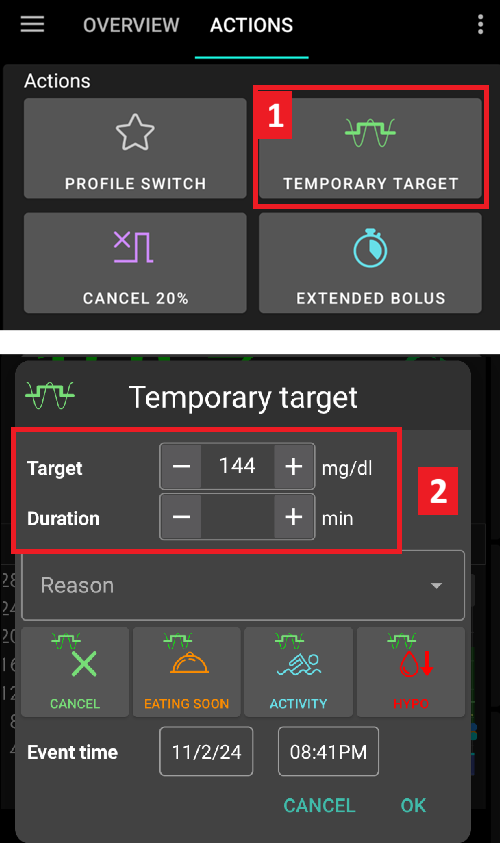
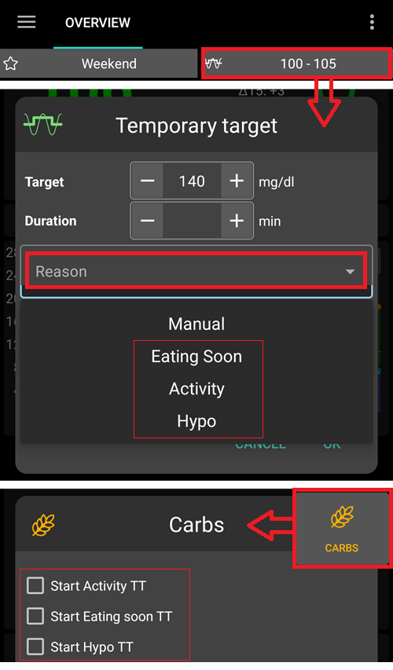

# Temp-Targets

## What are Temp-Targets and where can I set and configure them?

A **Temp-Target** (or short **TT**) is an **AAPS** feature that allows the user to alter their [**BG** target range](#profile-glucose-targets) for planned activities. This is achieved by **AAPS** manipulating the user’s insulin usage.

A glucose target, particularly if it is only short-term (less than 4 hours in duration), does not need to be the *actual value* you expect or want your glucose level to get to, rather, it is a good way to tell **AAPS** to be more or less aggressive, while still keeping your glucose levels in range.

Temporary targets can be defined within those boundaries :

|         | ערך מטרה זמני          |
| ------- | ---------------------- |
| Minimum | 4 mmol/l or 72 mg/dL   |
| Maximum | 15 mmol/l or 225 mg/dL |

**AAPS** provides for three **Temp-Target** options suitable for exercise (**Temp-Target- Activity**), meals (**Temp-Target- Eating soon**) and predicted hypoglycemia (**Temp-Target-Hypo**). **Temp-Targets** are located under the **Actions tab**.

Users should have realistic expectations on the results that can be achieved when selecting a **Temp-Target** in **AAPS**. The success of attaining a desired **BG** target will vary depending on a multiple factors ranging from: the reliability of the user’s **AAPS** settings, overall **BG** control, **IOB**, insulin sensitivity, insulin resistance, level of exertion undertaken during the exercise and so forth.

A **Temp-Target** can take approximately 30 minutes or longer in order to attain a desired **BG** target. It is impossible for **AAPS** to achieve a **BG** target with immediate effect and users should be mindful of this when selecting a **Temp-Target**.

The table below summarizes the features of **Temp-Target- Activity**, **Temp-Target- Eating soon**, and **Temp-Target-Hypo**.

### TT - Activity

**BG Target (depending on users' settings)**

AAPS will aim to reach 8mmol/l or 144mg/dl for 40 minutes

**Other considerations users may wish to factor in when selecting**:

Depending on **BG** level, **AAPS** will "decrease" insulin usage in order to reach **BG** target. If **BG** target is not within range (i.e. above the users **Profile's** selected **BG** target), then **AAPS** may keep the basal on.

In closed loop mode, **SMB**:

- *may be* deactivated (discussed further below); and/or
- basal may be activated if **AAPS** is in negative **IOB** or <0.

Users may also wish to consider:

- *selecting* this **TT** 1-2 hours before the planned exercise to ensure reduced IOB (the correct timing for this TT will vary person to person); and
- *selecting* a temporary Profile (decrease) for the duration of the planned activity to ensure reduced **IOB**;
- *ensuring* **TT** is timed to be *deactivated* shortly before the exercise as reduced **IOB** as some users experience a rapid rise in **BG **post exercise.

### TT - Eating soon

**BG Target (depending on users' settings)**

AAPS will aim to reach 5mmol/l or 90mg/dl for 30 minutes

**Other considerations users may wish to factor in when selecting**:

In closed loop mode, **SMB**:

- will remain activated; and/or
- basal may be also activated depending on the user's **Profile's** settings.

Depending on **BG** level, **AAPS** will "increase" insulin usage within the user's **AAPS** setting parameters in order to achieve the desired **BG** target.

### TT - Hypo

**BG Target (depending on users' settings)**

AAPS will aim to reach 7mmol/l or 126mg/dl for 30 minutes

**Other considerations users may wish to factor in when selecting**:

In closed loop mode, **SMB**:

- *may be* deactivated (discussed further below); and/or
- basal may be activated if **AAPS** is in negative **IOB** or <0.

(TempTargets-where-can-i-select-a-temp-target)=

## Where can I select a Temp-Target?

In the **Actions** tab in **AAPS**.

1. select **Temporary Target** button; and then
2. select desired **Temp-Target**

Or clicking on the "**BG Target**" located in the top right corner of **AAPS**.

- Press long on your target in the top right corner on the home screen or use the shortcuts in the orange “Carbs” button at the bottom.

## Where can I change the default Temp-Target and override with my own preferences?

To reconfigure the ‘BG target range’ and ‘duration’ allocated to the user’s default **Temp-Target** settings, go to the menu in **AAPS** on the top right hand corner and

1. select **Preferences** 
2. scroll down to 'Overview’ 
3. select ‘Default Temp-Targets’
4. step 4 indicates (below) where to change **TT- Eating soon** time period
5. step 5 indicates (below) where to change **TT - Eating soon** **BG** target range (and the same steps can be repeated for **TT -Activity** and **TT - Hypo**.

## How do I cancel a Temp-Target?

To cancel a **Temp-Target** running:

Select the “Cancel” button in **Temporary Target** under the **Actions** tab as shown below.

Or short-click on the ‘BG Target’ in the yellow/green box located in the top right corner of **AAPS**, and select ‘cancel’ as shown below:

## How do I select a “Default-Temp-Targets”

In the **Actions** tab in **AAPS**.

1. select **Temporary Target** button; and then
2. select desired **Temp-Target**

Or clicking on the "**BG Target**" located in the top right corner of **AAPS**.

Or in the **Carbs** button

1. selecting the desired **Temp-Target** in the shortcuts

(TempTargets-hypo-temp-target)=

## Hypo Temp-Target

**Temp-Target Hypo** enables **AAPS** to prevent the user from experiencing low blood sugar by reducing insulin intake. If the user predicts their **BG** will go low: usually, **AAPS** should handle it, but much will depend on the stability of the user’s **AAPS'** settings. A **Temp-Target Hypo** enables the user to get ahead of the predicted low and update **AAPS** to reduce insulin.

Sometimes when hypo-treated carbs are eaten, the user's **BG** can rapidly rise, and **AAPS** will correct against the fast rising **BG** by enabling **SMBs**.

Some users wish to avoid **SMBs** being given during **Temp-Target Hypo**. This is achieved by deactivating *'Enable SMB with high Temp-Target'* in **Preferences** (see further below):

- In (Advanced, objective 9): the user can enable *“High Temp-Targets raises sensitivity”* for **Temp-Targets** of 100mg/dl or 5.5mmol/l or higher in OpenAPS SMB, **AAPS** will be more sensitive.

- In (Advanced, objective 9): the user can deactivate *“SMB with high temp target”*, so that even if **AAPS** has COB > 0, “SMB with Temp-Target” or “SMB always” enabled and OpenAPS SMB active, **AAPS** will not give SMBs while high temp targets are active.

Note: if the user enters carbs with the carb button and your blood glucose is less than 72mg/dl or 4mmol/l, **Temp-Target Hypo** is automatically enabled by **AAPS**.

(TempTargets-activity-temp-target)=

## Activity Temp-Target

Before and during exercise, the user may require a higher target to prevent hypoglycemia during the activity.

To simplify **Temp-Target Activity**, the user can configure a default **Temp-Target - Activity** to raise **BG** levels by reducing insulin usage in order to slow down **BG** fall and avoid hypoglycemia.

New users to **AAPS** may need to experiment and personalise their **Temp-Target Activity** default settings in order to optimise this feature to work best for them. Everyone is different when it comes to attaining stable BG control during exercise. See also the [sports section in FAQ](#FAQ-sports). in FAQ.

Some users also prefer to activate a **Profile switch** (being a Profile decrease < 100% to reduced insulin delivery by **AAPS**) before and while **Temp-Target Activity** is on.

Advanced, objective 9: users can enable *'High Temp-Targets raises sensitivity'* for **Temp-Targets** higher or equal 100mg/dl or 5.5mmol/L in OpenAPS **SMB**. Then **AAPS** is more sensitive.

Additionally, if *'SMB with high Temp-Target'* is deactivated, **AAPS** will not deliver **SMBs**, even with COB > 0, *'SMB with Temp-Target-* or *'SMB always'* enabled and OpenAPS **SMB** active.

(TempTargets-eating-soon-temp-target)=

## Eating soon Temp-Target

**Temp-Target -Eating soon** can help accomplish a gentle drive down of **BG** and ensure there is ample **IOB** before eating.

This can be an important tool for those users who do not pre bolus, however the efficacy of **Temp-Target -Eating soon** will depend on a number of factors including: the user’s settings, if they eat a low carb diet and whether they are using a fast acting insulin (like Fiasp or Lyjumjev) in order to eliminate the need to pre bolus. Ordinarily, until users are experienced in **AAPS** they should expect to pre bolus when using **Temp-Target -Eating soon** and this is particularly so, if eating a high carb diet.

You can read more about the “Eating soon mode” in the article ['How to do “eating soon” mode'](https://diyps.org/2015/03/26/how-to-do-eating-soon-mode-diyps-lessons-learned/) or [here](https://diyps.org/tag/eating-soon-mode/).

Advanced, [objective 9](#objectives-objective9): If you use OpenAPS SMB and have *'Low temp target lowers sensitivity'*, **AAPS** works a little bit more aggressively. For this option there is a requirement for **Temp-Target** to be less than 100mg/dl or 5.5mmol/l.

## How do I turn off SMB during Temp-Targets?

To action this select in **Preferences** > and deactivate *'Enable SMB with high Temp-Target'*.

This will ensure **AAPS** will not give **SMBs**, even with COB > 0, *'SMB with Temp-Target'* or *'SMB always'* enabled and OpenAPS SMB active.