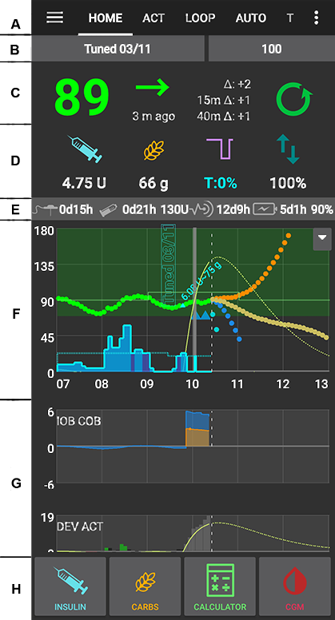
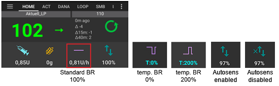
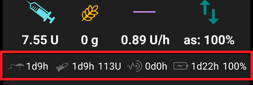
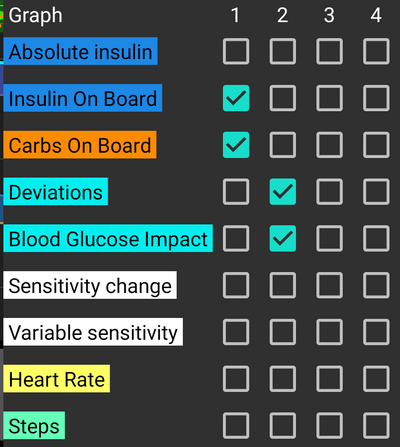
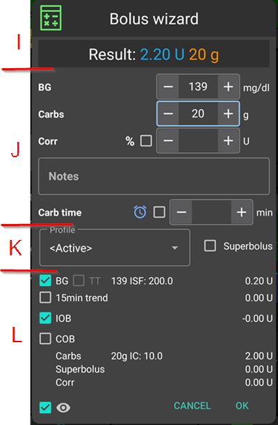

# מסכי AndroidAPS

## מסך הבית

זהו המסך הראשון שתתקלו בו בעת פתיחת AndroidAPS והוא מכיל את רוב המידע שתצטרכו ביום יום.

### חלק A - לשוניות

* ניווט בין מודולי AndroidAPS השונים.
* לחלופין ניתן לעבור בין המסכים ע"י החלקה שמאלה וימינה.
* Displayed tabs can be selected in [config builder](Config-Builder-tab-or-hamburger-menu).

(Screenshots-section-b-profile-target)=

### חלק B - פרופיל וערכי מטרה

#### פרופיל נוכחי

* הפרופיל הנוכחי מוצג בסרגל הימיני (כששפת המערכת עברית).
* לחיצה קצרה על הפרופיל מציגה את פרטי הפרופיל
* Long press profile bar to [switch between different profiles](Profiles-profile-switch).
* אם החלפת הפרופיל בוצעה עם משך זמן מוגדר, הזמן הנותר מוצג בסוגריים.

#### ערך מטרה

* ערך המטרה הנוכחי של הסוכר בדם מוצג בסרגל השמאלי (כששפת המערכת עברית).
* לחצו לחיצה קצרה על ערכי המטרה כדי להגדיר [ערך מטרה זמני](../Usage/temptarget.md).
* אם הוגדר ערך מטרה זמני, צבע הכפתור יצבע בצהוב והזמן הנותר בדקות מוצג בסוגריים.

(Screenshots-visualization-of-dynamic-target-adjustment)=

#### הצגת שינויים דינמיים בערכי המטרה

* AAPS יכול להתאים באופן דינמי את ערכי המטרה על סמך הרגישות אם אתם משתמשים באלגוריתם SMB.
* Enable either one or both of the [following options](Preferences-openaps-smb-settings) 
   * "רגישות מעלה את ערך המטרה" ו\או 
   * "תנגודת מורידה את ערך המטרה" 
* אם AAPS מזהה תנגודת או רגישות, המטרה תשונה ממה שנקבע בפרופיל. 
* כאשר ערך המטרה ישונה, רקע כפתור ערך המטרה יצבע ירוק.

### חלק C - רמת הסוכר בדם וסטטוס לולאה

#### רמת סוכר נוכחית

* קריאת הסוכר האחרונה מהחיישן מוצגת בצד ימין.
* Color of the BG value reflects the status to the defined [range](Preferences-range-for-visualization). 
   * ירוק = בטווח
   * אדום = מתחת לטווח
   * צהוב = מעל הטווח
* הערכים האפורים באמצע מציגים דקות מאז הקריאה האחרונה ושינויים מאז הקריאה האחרונה, ב-15 וב-40 הדקות האחרונות.

(Screenshots-loop-status)=

#### סטטוס הלולאה

* סמל חדש מציג את מצב הלולאה:
   
   * עיגול ירוק = לולאה פועלת
   * green circle with dotted line = [low glucose suspend (LGS)](Objectives-objective-6-starting-to-close-the-loop-with-low-glucose-suspend)
   * מעגל אדום = לולאה מושבתת (קבוע)
   * עיגול צהוב = לולאה מושהת (השהיה זמנית אך אינסולין בזאלי יינתן) - הזמן שנותר להשהיה מוצג מתחת לסמל
   * עיגול אפור = המשאבה מנותקת (האופן זמני, ללא הזרמת כל אינסולין) - הזמן שנותר מוצג מתחת לסמל
   * עיגול כתום = סופר בולוס בפעולה - הזמן שנותר מוצג מתחת לסמל
   * עיגול כחול מְקֻוְוקָּו = לולאה פתוחה

* לחיצה קצרה או לחיצה ארוכה על הסמל תפתח את תיבת הדו-שיח 'לולאה' כדי להחליף מצב לולאה (סגור, השהיית עקב סוכר נמוך, פתיחה או השבתה), השהה / הפעל מחדש את הלולאה או נתק / חבר מחדש משאבה.
   
   * אם הלחיצה על סמל לולאה היתה קצרה, תידרשו לאשר את בחירתכם בתיבת דו-שיח לאחר בחירתכם
   
   

(Screenshots-bg-warning-sign)=

#### סימן אזהרה לצד רמת הסוכר

Beginning with Android 3.0, you might get a warning signal beneath your BG number on the main screen.

*Note*: Up to 30h hours are taken into accord for AAPS calculations. So even after you solved the origin problem, it can take about 30 hours for the yellow triangle to disappear after the last irregular interval occurred.

To remove it immediately you need to manually delete a couple of entries from the Dexcom/xDrip+ tab.

However, when there are a lot of duplicates, it might be easier to

* [backup your settings](../Usage/ExportImportSettings.md),
* לאתחל את מסד הנתונים שלכם בתפריט התחזוקה
* [import your settings](../Usage/ExportImportSettings.md) again

##### סימן אזהרה אדום: כפילות בנתוני סוכר

The red warning sign is signaling you to get active immediately: You are receiving duplicate BG data, which does avoid the loop to do its work right. Therefore your loop will be disabled until it is resolved.

You need to find out why you get duplicate BGs:

* גשר Dexcom מופעל בהגדרת אתר נייטסקאוט? בטלו את את הגשר ע"י כניסה לאתר Heroku שלכם, שנו בהגדרות את המשתנה Enable ובו מחקו את "bridge". (ניתן למצוא [פרטים לגבי Heroku כאן](https://nightscout.github.io/troubleshoot/troublehoot/#heroku-settings))
* האם יש יותר ממקור אחד להעלאות לנייטסקאוט? אם אתם משתמשים ב-BYODA, אפשרו את ההעלאה לנייטסקאוט ב-AAPS ואל תאפשרו את ההעלאה מ-xDrip אם הוא בשימוש.
* יש לכם עוקב שמקבל את נתוני הסוכר וגם מעלים נתוני סוכר לנייטסקאוט?
* מוצא אחרון: ב-AAPS, גשו להגדרות NSClient, בחרו בהגדרת הסינכרון וכבו את "קבלת נתוני סנסור מנייטסקאוט".

##### סימן אזהרה צהוב

* סימן האזהרה הצהוב מציין שהסוכר הגיע במרווחי זמן לא קבועים או שחלק מנתוני הסוכר חסרים.
   
   

* בדרך כלל אין צורך בנקיטת פעולה כלשהי. הלופ ימשיך לתפקד!

* מכיוון שהחלפת חיישן מפריעה לזרימה המתמדת של נתוני הסוכר, סימן אזהרה צהוב לאחר החלפת חיישן הוא נורמלי ואין ממה לדאוג.
* הערה מיוחדת למשתמשי Freestyle Libre:
   
   * כל חיישן Libre מזייף בדקה או שתיים כל כמה שעות, כלומר לעולם אינך מקבל זרימה מושלמת עם מרווחים קבועים לחלוטין.
   * גם קריאות קופצניות קוטעות את הזרימה הרציפה.
   * לכן סימן האזהרה הצהוב יהיה מופעל תמיד אצל משתמשי Libre.

### חלק D - אינסולין פעיל, פחמימות פעילות, מינונים בזאליים ורגישות

* מזרק: אינסולין פעיל (IOB) - כמות אינסולין הפעיל כרגע
   
   * נתון האינסולין הפעיל יהיה אפס אם רק הבזאלי הסטנדרטי מהפרופיל פועל ולא נשאר אינסולין מבולוסים קודמים. 
   * האינסולין הפעיל עשוי להיות שלילי אם היו לאחרונה תקופות של ירידה במינון הבזאלי.
   * לחצו על הסמל כדי לראות את הפיצול של הבולוס והאינסולין הבזאלי

* Grain: [carbs on board (COB)](../Usage/COB-calculation.md) - yet unabsorbed carbs you have eaten before -> icon pulses if carbs are required

* קו סגול: מינון בזאלי - שינויים בסמל המשקפים שינויים זמניים במינון הבזאלי (שטוח ב-100%) 
   * לחצו על הסמל כדי לראות את המינון הבזאלי ופרטים של בזאלי זמני אם מופעל (כולל משך הזמן הנותר)
* Arrows up & down: indicating actual [autosens](Open-APS-features-autosens) status (enabled or disabled) and value is shown below icon

#### דרושות פחמימות

* בקשות לפחמימות ניתנות כאשר המערכת מזהה שנדרשות פחמימות.
* זה קורה כאשר האלגוריתם מחשב שהוא לא יכול להציל אותכם מהיפוגליקמיה ע"י הפסקת המינון הבזאלי לבדו ולכן יש לאכול.
* הבקשות לפחמימות מתוחכמות בהרבה מאלה שמופיעות במחשבון הבולוס. ייתכן שתראו בקשות לפחמימות בעוד שמחשבון בולוס אינו מראה שחסרות פחמימות.
* הודעות של דרישה לפחמימות יכולות להישלח ל-Nightscout אם תרצו, ובמקרה זה תוצג ותשודר הודעה.

### חלק E - חיווי מצב

* נורות הסטטוס נותנות חיווי ויזואלי עבור 
   * גיל הצינורית
   * גיל אינסולין (משך השימוש במכל האינסולין הנוכחי)
   * רמת המכל (יחידות)
   * גיל חיישן
   * גיל ורמת הסוללה (%)
* אם חורגים מסף האזהרה, הערכים יוצגו בצהוב.
* אם חורגים מסף האזהרה הקריטי, הערכים יוצגו באדום.
* Settings can be made in [preferences](Preferences-status-lights).

(Screenshots-section-f-main-graph)=

### חלק F - גרף ראשי

* הגרף מציג את רמת הסוכר בדם (BG) כפי שנקרא מהחיישן. 
* הערות שהוזנו בלשונית פעולות, כגון כיולים מבדיקות עם גלוקומטר וערכים של פחמימות וכן החלפות פרופיל מוצגות כאן. 
* לחצו לחיצה ארוכה על הגרף כדי לשנות את קנה המידה של ציר הזמן. אפשר לבחור 6, 12, 18 או 24 שעות.
* האזור הירוק משקף את טווח המטרה. It can be configured in [preferences](Preferences-range-for-visualization).
* Blue triangles show [SMB](Open-APS-features-super-micro-bolus-smb) - if enabled in [preferences](Preferences-openaps-smb-settings).
* מידע אופציונלי:
   
   * חיזוי
   * בזאלי
   * פעילות - עקומת פעילות אינסולין

#### הפעלת מידע אופציונלי

* לחצו על המשולש בצד שמאל של הגרף הראשי כדי לבחור איזה מידע יוצג בגרף הראשי.
* עבור הגרף הראשי זמינות רק שלוש האפשרויות שמעל ל-"\---\---- גרף 1 \---\----".
   
   

(Screenshots-prediction-lines)=

#### עקומי החיזוי

* **Orange** line: [COB](../Usage/COB-calculation.md) (colour is used generally to represent COB and carbs)
   
   עקום החיזוי מראה לאן הסוכר (ולא לאן הפחמימות הפעילות עצמן!) ילך בהתבסס על הגדרות המשאבה הנוכחיות ובהנחה שהסטיות עקב ספיגת פחמימות נשארות קבועות. עקום זה מופיע רק אם יש פחמימות פעילות ידועות.

* עקום **כחול כהה**: אינסולין פעיל (כחול משמש בדרך כלל לייצוג אינסולין פעיל או כללי)
   
   עקום החיזוי מראה מה יקרה בהשפעת אינסולין לבדו. למשל אם הזרקתם קצת אינסולין ואז לא אכלתם פחמימות.

* עקום **כחול בהיר**: בזאלי אפס זמני (סוכר חזוי אם יוגדר קצב בזאלי זמני של 0%)
   
   עקום החיזוי מראה כיצד ישתנה עקום האינסולין הפעיל אם המשאבה תפסיק כל מתן אינסולין (בזאלי זמני 0%).
   
   *This line appears only when the [SMB](Preferences-advanced-meal-assist-ama-or-super-micro-bolus-smb) algorithm is used.*

* **Dark yellow** line: [UAM](Sensitivity-detection-and-COB-sensitivity-oref1) (un-announced meals)
   
   ארוחות לא מוכרזות מראש - זיהוי של עלייה משמעותית ברמות הסוכר עקב ארוחות, אדרנלין או השפעות אחרות. עקום החיזוי דומה לעקום הפחמימות הכתום אך הוא מניח שהסטיות יצטמצמו בקצב קבוע (על ידי הארכת קצב הדעיכה הנוכחי).
   
   *This line appears only when the [SMB](Preferences-advanced-meal-assist-ama-or-super-micro-bolus-smb) algorithm is used.*

* **Dark orange** line: aCOB (accelerated carbohydrate absorption)
   
   Similar to COB, but assuming a static 10 mg/dL/5m (-0.555 mmol/l/5m) carb absorption rate. Deprecated and of limited usefulness.
   
   *This line appears only when the older [AMA](Preferences-advanced-meal-assist-ama-or-super-micro-bolus-smb) algorithm is used.*

Usually your real glucose curve ends up in the middle of these lines, or close to the one which makes assumptions that closest resemble your situation.

#### בזאלי

* עקום **כחול מלא** מציג את הבזאלי הבסיסי מהמשאבה ומשקף את הבזאלי בפועל לאורך זמן.
* הקו ה**כחול המקווקו** הוא המינון הבזאלי אם לא היה בזאלי זמני (TBR).
* בזמנים בהם המינון הבזאלי הוא הסטנדרטי (100% מזה המוגדר בפרופיל), השטח מתחת לעקומה מוצג בכחול כהה.
* כאשר מופעל מינון בזאלי זמנית (מוגבר או מופחת) השטח מתחת לעקומה מוצג בכחול בהיר.

#### פעילות

* העקום ה**צהוב הדק** מציג את פעילות האינסולין. 
* הוא מבוסס על הירידה הצפויה בסוכר בגלל אינסולין פעיל אם לא קיימים גורמים אחרים (כמו פחמימות).

### חלק G - גרפים נוספים

* ניתן להפעיל עד ארבעה גרפים נוספים מתחת לגרף הראשי.
* To open settings for additional graphs click the triangle on the right side of the [main graph](Screenshots-section-f-main-graph) and scroll down.

* כדי להוסיף גרף נוסף יש לסמן את התיבה בצד שמאל של שמו (לדוגמה: \---\---- גרף 1 \---\---- וכו').

#### אינסולין מוחלט

* אינסולין פעיל כולל בולוסים **ואינסולין בזאלי**.

#### אינסולין פעיל

* מראה את האינסולין הפעיל. הוא כולל אינסולין מבולוס ובזאלי זמני (**אך אינו כולל מינונים בזאליים שנקבעו בפרופיל**).
* If there were no [SMBs](Open-APS-features-super-micro-bolus-smb), no boluses and no TBR during DIA time this would be zero.
* אינסולין פעיל יכול להיות שלילי אם אין בולוס או בזאלי זמני אפס/נמוך למשך זמן רב יותר.
* Decaying depends on your [DIA and insulin profile settings](Config-Builder-local-profile). 

#### פחמימות פעילות

* מראה את הפחמימות הפעילות, שעדיין לא דעכו. 
* דעיכה תלויה בסטיות שהאלגוריתם מזהה. 
* אם הוא מזהה ספיגת פחמימות גבוהה מהצפוי, ינתן אינסולין וזה יגדיל את IOB (פחות או יותר, תלוי בהגדרות הבטיחות שלכם). 

#### סטיות

* עמודות **אפורות** מראות סטייה עקב פחמימות. 
* עמודות **ירוקות** מראות שרמת הסוכר גבוהה ממה שהאלגוריתם ציפה. Green bars are used to increase resistance in [Autosens](Open-APS-features-autosens).
* עמודות **אדומות** מראות שרמת הסוכר נמוכה ממה שהאלגוריתם ציפה. Red bars are used to increase sensitivity in [Autosens](Open-APS-features-autosens).
* עמודות **צהובות** מראות סטייה עקב ארוחות לא מוכרזות.
* עמודות **שחורות** מציגות סטיות קטנות שלא נלקחו בחשבון בחישוב הרגישות

#### רגישות

* Shows the sensitivity that [Autosens](Open-APS-features-autosens) has detected. 
* חישוב רגישות לאינסולין כתוצאה מפעילות גופנית, תגובות הורמונליות וכו'.

#### פעילות

* מציג את פעילות האינסולין, מחושב לפי פרופיל האינסולין (אינה נגזרת של IOB). 
* הערך גבוה יותר עבור אינסולין כשמתקרבים לזמן השיא.
* ערך זה יהיה שלילי כאשר IOB יורד. 

#### שיפוע הסטייה

* ערך פנימי בשימוש באלגוריתם.

### סעיף H - כפתורים

* כפתורי אינסולין, פחמימות ומחשבון 'פועלים תמיד'.
   
   * אם החיבור למשאבה אובד, כפתור האינסולין מוסתר.

* Other Buttons have to be setup in [preferences]Preferences-buttons).

#### אינסולין

* נועד לתת כמות מסוימת של אינסולין מבלי להשתמש ב[מחשבון בולוס](#bolus-wizard).
* By checking the box you can automatically start your [eating soon temp target](Preferences-default-temp-targets).
* אם אינכם רוצים להכניס בולוס דרך המשאבה אלא לרשום את כמות האינסולין (כלומר אינסולין שניתן באמצעות מזרק) סמנו את התיבה המתאימה.

#### פחמימות

* נועד לרישום פחמימות ללא בולוס.
* Certain [pre-set temporary targets](Preferences-default-temp-targets) can be set directly by checking the box.
* היסט זמן: מתי תאכלו פחמימות (בדקות) יחסית לעכשיו.
* Duration: To be used for ["extended carbs"](../Usage/Extended-Carbs.md)
* ניתן להשתמש בכפתורי התוספת כדי לרשום את מספר הפחמימות ביתר קלות.
* Notes will be uploaded to Nightscout - depending on your settings for [NS client](Preferences-nsclient).

#### מחשבון

* ראו אשף הבולוסים [מטה](#bolus-wizard)

#### כיולים

* שולח כיול ל- xDrip או פותח את חלון הכיול של אפליקציית Dexcom.
* Must be activated in [preferences](Preferences-buttons).

#### סנסור

* פותח את xDrip+.
* כפתור החזרה מחזיר ל-AAPS.
* Must be activated in [preferences](Preferences-buttons).

#### אשף מהיר

* הזנה בקלות של כמות הפחמימות והגדרת נתוני החישוב.
* Details are setup in [preferences](Preferences-quick-wizard).

(Screenshots-bolus-wizard)=

## אשף הבולוס

When you want to make a meal bolus this is where you will normally make it from.

### חלק I

* שדה רמת הסוכר בדרך כלל כבר מאוכלס בקריאה האחרונה מהחיישן. אם אין לכם חיישן פעיל הוא יהיה ריק. 
* בשדה פחמימות אתם מוסיפים את ההערכה שלכם לכמות הפחמימות בארוחה שעבורה אתם רוצים לקבל בולוס. 
* שדה התיקון נועד לשינוי המינון הסופי באופן ידני.
* השדה זמן פחמימות מיועד לבולוס מקדים, כך שתוכלו לומר למערכת שיהיה עיכוב של הזמן שרשמתם לפני שהפחמימות צפויות. בכתיבת מספר שלילי בשדה זה אתם נותנים בולוס עבור פחמימות שנאכלו בעבר בעבר.

(Screenshots-eating-reminder)=

#### תזכורת אכילה

* עבור פחמימות עתידיות ניתן לסמן את תיבת סימון התזכורת (היא נבחרת כברירת מחדל כאשר מוזנת ארוחה עתידית) כך שתוכלו לקבל תזכורת לאכול את הפחמימות שהזנתם ל-AndroidAPS בהתאם לזמן שהזנתם ב-"זמן פחמימות"
   
   

### חלק J

* סופר בולוס גורם להזרקת האינסולין הבזאלי של השעתיים הקרובות יחד עם בולוס הארוחה ובתמורה, מפעיל בזאלי זמני אפס במשך השעתיים הקרובות. The option only shows when "Enable [superbolus](Preferences-superbolus) in wizard" is set in the [preferences overview](Preferences-overview).
* הרעיון הוא לספק את האינסולין מוקדם יותר ובתקווה להפחית עליות חדות ברמות הסוכר.
* לפרטים עיינו ב-[diabetesnet.com](https://www.diabetesnet.com/diabetes-technology/blue-skying/super-bolus/).

### חלק K

* מציג את הבולוס המחושב. 
* אם כמות האינסולין הפעיל עולה על הבולוס המחושב, תוצג רק כמות הפחמימות הנדרשת.
* Notes will be uploaded to Nightscout - depending on your settings for [NS client](Preferences-nsclient).

### חלק L

* פרטים על חישוב הבולוס של המחשבון.
* אפשר לבטל את הבחירה של כל סעיף אותו לא תרצו לכלול בחישוב אבל בנסיבות רגילות, לא תרצו לבטלם.
* מטעמי בטיחות **יש לסמן את התיבה TT באופן ידני** אם ברצונכם שאשף הבולוס יחשב על פי ערך המטרה הזמני הנוכחי.

#### שילובים של COB ו-IOB ומשמעותם

* מטעמי בטיחות לא ניתן לבטל את סימון התיבה של IOB כאשר תיבת COB מסומנת מכיוון שאתם עלולים להסתכן בכמות גדולה מדי של אינסולין מכיוון ש-AAPS אינו מתייחס למה שכבר ניתן.
* אם תסמנו COB ו-IOB, פחמימות שעוד לא נספגו שלא כוסו כבר באינסולין + כל האינסולין שניתן כבזאלי זמני או כ-SMB יילקח בחשבון.
* אם תסמן IOB ללא COB, הלופ ייקח בחשבון את האינסולין שכבר ניתן, אך לא יכסה פחמימות שעוד לא נספגו. מצב זה מוביל להודעת "פחמימות חסרות".
* אם מזריקים בולוס עבור **מזון נוסף** זמן קצר לאחר בולוס ארוחה (לדוגמה קינוח), ייתכן שכדאי יהיה **לבטל את הסימון בכל התיבות**. כך רק הפחמימות החדשות מתווספות מכיוון שהארוחה העיקרית לא בהכרח תיספג ולכן IOB לא יתאים ל-COB במדויק זמן קצר לאחר בולוס הארוחה.

(Screenshots-wrong-cob-detection)=

#### זיהוי שגוי של פחמימות פעילות

* אם האזהרה למעלה מופיעה לאחר שימוש באשף הבולוס, AndroidAPS זיהה שערך ה-COB המחושב אולי שגוי. 
* לכן, אם תרצו להזריק בולוס לאחר ארוחה קודמת עם פחמימות פעילות, עליכם להיות מודעים למינון ביתר! 
* For details see the hints on [COB calculation page](COB-calculation-detection-of-wrong-cob-values).

(Screenshots-action-tab)=

## לשונית פעולות

### פעולות - חלק M

* Button [profile switch](Profiles-profile-switch) as an alternative to pressing the [current profile](Screenshots-section-b-profile-target) on homescreen.
* Button [temporary target](temptarget-temp-targets) as an alternative to pressing the [current target](Screenshots-section-b-profile-target) on homescreen.
* לחצן להפעלה או ביטול של מינון בזאלי זמני. שימו לב שהלחצן משתנה מ-"בזאלי זמני" ל-"ביטול %x" כאשר מוגדר מינון בזאלי זמני.
* Even though [extended boluses](Extended-Carbs-extended-bolus-and-why-they-wont-work-in-closed-loop-environment) do not really work in a closed loop environment some people were asking for an option to use extended bolus anyway.
   
   * אפשרות זו קיימת רק במשאבות Dana RS ו-Accu chek Insight. 
   * לולאה סגורה תיעצר אוטומטית ותעבור למצב לולאה פתוחה למשך זמן פעילות הבולוס הממושך.
   * Make sure to read the [details](../Usage/Extended-Carbs.md) before using this option.

### פורטל הטיפולים - חלק N

* מידע אודות תצוגת
   
   * גיל חיישן ואחוזי סוללה
   * גיל וכמות אינסולין (יחידות)
   * גיל הצינורית
   * גיל ודרגת טעינת סוללת המשאבה

* Less information will be shown if [low resolution skin](Preferences-skin) is used.

(Screenshots-sensor-level-battery)=

#### רמת טעינת סוללת החיישן

* דרוש xDrip nightly מדצמבר 10, 2020 או חדש יותר.
* עובד עם חיישנים ומשדרים כדוגמת MiaoMiao 2. (טכנית, החיישן צריך לשלוח את המידע של רמת הסוללה לxDrip+.)
* Thresholds can be set in [preferences](Preferences-status-lights).
* אם רמת החיישן זהה לרמת הסוללה של הטלפון, כנראה שגרסת ה-xDrip+ ישנה מדי וצריכה עדכון.
   
   

### פורטל הטיפולים - חלק O

* בדיקת רמת סוכר, תיחול\מילוי, הכנסת חיישן והחלפת סוללת משאבה הם הבסיס לנתונים המוצגים ב[חלק O](#careportal-section-n).
* תיחול\מילוי מאפשר לתעד את החלפת מיקום חיבור צינורית המשאבה ואת החלפת מכל האינסולין.
* חלק O משקף את פורטל הטיפולים שבנייטסקאוט. לכן התעמלות, הכרזות ושאלות הן סוגים מיוחדים של הערות.

### כלים - חלק P

#### דפדפן היסטוריה

* מאפשר לדפדף בהיסטוריית השימוש ב-AAPS.

#### TDD - סה"כ מינון אינסולין יומי

* תצרוכת האינסולין הכללית (TDD=סיכום יומי של הבולוסים יחד עם המינונים הבזאליים)
* רופאים לפעמים רושמים, במיוחד למשתמשי משאבה חדשים, יחס מינונים בזאליים-מינוני בולוסים של 50:50. 
* לכן היחס מחושב כ-TDD/2 X TBB ( TBB מינון בזאלי כולל= סכום המינונים הבזאליים ביממה). 
* אחרים מעדיפים יחס של 32-37% מה-TDD ל-TBB. 
* לרוב כללי האצבע האלה תוקף מוגבל בפרקטיקה. הערה: הסוכרת שלכם עשויה להיות שונה!

(Screenshots-insulin-profile))=

## פרופיל האינסולין

* This shows the activity profile of the insulin you have chosen in [config builder](Config-Builder-insulin). 
* העקום הסגול מראה כמה אינסולין נשאר לאחר הזרקתו כשהוא דועך לאורך הזמן והעקום הכחול מראה כמה הוא פעיל.
* חשוב לשים לב לכך שלדעיכה יש זנב ארוך. 
* אם השתמשתם בעבר במשאבה, כנראה שהנחתם שדעיכת האינסולין לוקחת כ-3.5 שעות. 
* עם זאת, בשימוש בלופ, הזנב הארוך חשוב כיוון שהחישובים הרבה יותר מדויקים והכמויות הקטנות הללו בזנבות מסתכמות למספרים משמעותיים בחישובים הרקורסיבים של אלגוריתמים של AndroidAPS.

For a more detailed discussion of the different types of insulin, their activity profiles and why all this matters you can read an article here on [Understanding the New IOB Curves Based on Exponential Activity Curves](https://openaps.readthedocs.io/en/latest/docs/While%20You%20Wait%20For%20Gear/understanding-insulin-on-board-calculations.html#understanding-the-new-iob-curves-based-on-exponential-activity-curves)

And you can read an excellent blog article about it here: [Why we are regularly wrong in the duration of insulin action (DIA) times we use, and why it matters…](https://www.diabettech.com/insulin/why-we-are-regularly-wrong-in-the-duration-of-insulin-action-dia-times-we-use-and-why-it-matters/)

And even more at: [Exponential Insulin Curves + Fiasp](https://seemycgm.com/2017/10/21/exponential-insulin-curves-fiasp/)

## סטטוס המשאבה

* מידעים שונים על מצב המשאבה. המידע המוצג תלוי בדגם המשאבה.
* ראו [דף המשאבות](../Hardware/pumps.md) לפרטים.

## פורטל הטיפולים

Careportal replicated the functions you will find on your Nightscout screen under the “+” symbol which allows you to add notes to your records.

### סקירה של חישוב הפחמימות

* If you have used the [Bolus Wizard](Screenshots-bolus-wizard) to calculate insulin dosage you can review this calculation later on ts tab.
* פשוט לחץ על קישור "חישוב" הירוק. (Depending on pump used insulin and carbs can also be shown in one single line in ts.)

(Screenshots-carb-correction)=

### תיקון פחמימות

Treatment tab can be used to correct faulty carb entries (i.e. you over- or underestimated carbs).

1. בדקו וזכרו את האינסולין והפחמימות הפעילים בפועל במסך הבית.
2. בהתאם למשאבה בלשונית הטיפולים פחמימות עשויות להיות מוצגות יחד עם אינסולין בשורה אחת או כערכים נפרדים (כלומר עם משאבת Dana RS).
3. הסירו את הערך עם כמות הפחמימות השגויה.
4. ודאו שהפחמימות הוסרו בהצלחה על ידי בדיקה מחדש של הפחמימות הפעילות במסך הבית.
5. עשו את אותו הדבר עבור אינסולין פעיל אם יש רק שורה אחת בלשונית הטיפול כוללת פחמימות ואינסולין.
   
   -> אם פחמימות לא מוסרות כמתוכנן ואתם מוסיפים פחמימות נוספות כפי שהוסבר כאן (6.), הפחמימות הפעילות יהיו גבוהות מדי וזה עלול להוביל למתן אינסולין גבוה מדי.

6. הזינו את כמות הפחמימות הנכונה דרך כפתור הפחמימות במסך הבית והקפידו להגדיר את מועד האירוע הנכון.

7. אם יש רק שורה אחת בלשונית הטיפולים הכוללת פחמימות ואינסולין, יש להוסיף גם את כמות האינסולין. הקפידו להגדיר את מועד האירוע הנכון ולבדוק את האינסולין הפעיל במסך הבית לאחר אישור הרשומה החדשה.

## לולאה, AMA / SMB

* לשוניות אלה מציגות פרטים על חישובי האלגוריתם ומדוע AAPS פועל כפי שהוא פועל.
* החישובים מחושבים בכל פעם שהמערכת מקבלת קריאה חדשה מהחיישן.
* For more details see [APS section on config builder page](Config-Builder-aps).

## פרופיל

* הפרופיל מכיל מידע על הגדרות הסוכרת האישיות שלכם:
   
   * DIA (משך פעילות האינסולין)
   * IC או I:C: יחס אינסולין לפחמימות
   * ISF: פקטור הרגישות לאינסולין (יחס התיקון)
   * מינון בזאלי
   * ערך מטרה: רמת הגלוקוז בדם שאליה AAPS שואף

* As of version 3.0 only [local profile](Config-Builder-local-profile) is possible. ניתן לערוך את הפרופיל המקומי בסמארטפון ולסנכרנו עם אתר הנייטסקאוט שלכם.

(Screenshots-treatment)=

## טיפול

History of the following treatments:

* Bolus & carbs -> option to [remove entries](Screenshots-carb-correction) to correct history
* [בולוס ממושך](Extended-Carbs-extended-bolus-and-switch-to-open-loop-dana-and-insight-pump-only)
* מינון בזאלי זמני
* [ערך מטרה זמני](../Usage/temptarget.md)
* [החלפת פרופיל](../Usage/Profiles.md)
* [Careportal](CPbefore26-careportal-discontinued) - notes entered through action tab and notes in dialogues

## מקורות נתוני סוכר - xDrip+, BYODA...

* שמה של לשונית זו הוא בהתאם למקור נתוני הסוכר שהוגדר.
* מציג היסטוריה של קריאות של החיישן ומציע אפשרות להסיר קריאה במקרה של כשל (לדוגמה קריאת סוכר נמוך בגלל לחיצה על החיישן).

## NSClient

* מציג את מצב החיבור עם אתר הנייטסקאוט שלכם.
* Settings are made in [preferences](Preferences-nsclient). אפשר לפתוח את החלק המתאים על ידי לחיצה על גלגל השיניים בצד השמאלי העליון של המסך.
* לפתרון בעיות עיינו ב[דף זה](../Usage/Troubleshooting-NSClient.md).