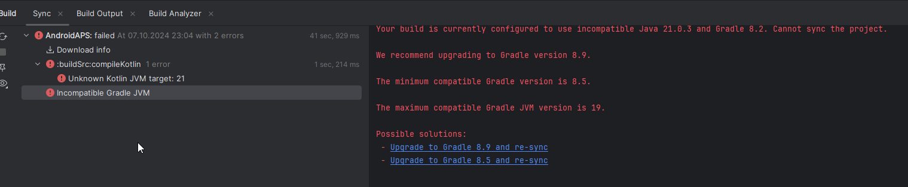
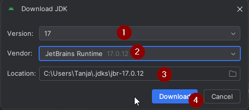

(troubleshooting_androidstudio-troubleshooting-android-studio)=
# פתרון תקלות ב-Android Studio

(troubleshooting_androidstudio-lost-keystore)=
## אבד ה-keystore
If you use the same keystore when updating AAPS you do not have to uninstall the previous version on your smartphone. That's why it is recommended to store the keystore in a save place.

If you try to install the apk, signed with a different keystore than before, you will get an error message that the installation failed!

In case you cannot find your old keystore or its password anymore, proceed as follows:

1. [Export settings](../Maintenance/ExportImportSettings.md) on your phone.
2. העתיקו או העלו את קובץ ההגדרות מהטלפון שלך למיקום חיצוני (כלומר למחשב, שירות אחסון בענן...).
4. Generate signed apk of new version as described on the [Update guide](../Maintenance/UpdateToNewVersion) and transfer it to your phone.
5. הסירו את ההתקנה של גרסת ה-AAPS הקודמת מהטלפון.
6. התקינו את גרסת ה-AAPS החדשה בטלפון.
7. [Import settings](#ExportImportSettings-restoring-from-your-backups-on-a-new-phone-or-fresh-installation-of-aaps) to restore your objectives and configuration.

   אם אינכם מוצאים אותן בטלפון, העתיקו אותן מהאחסון החיצוני אל הטלפון.

8. בדקו את אפשרויות אופטימיזציית הסוללה שלכם והשביתו אותן שוב.
9. Keep on looping.

## Gradle Sync failed
Gradle Sync can fail to various reasons. Wen you get a message saying that gradle sync failed, open the "Build" tab (1) at the bottom of Android Studio and check what error message (2) is displayed.

  

These are the usual gradle sync failures:
* [שינויים שלא הוגשו](#uncommitted-changes)
* [אין גרסה שמור של ... זמינה](#could-not-resolveno-cached-version)
* [Incompatible Gradle JVM](#incompatible-gradle-jvm)
* [Incompatible version of the Android Gradle plugin](#incompatible-version-of-android-gradle-plugin)

*Important*: After you have followed the instructions for your specific problem, you need to trigger the [gradle sync](#gradle-resync) again.

(troubleshooting_androidstudio-uncommitted-changes)=
### שינויים שלא הוגשו

If you receive a failure message like


#### שלב 1 - בדקו את התקנת git
  * פתחו את לשונית terminal (1) בתחתית Android Studio, העתקו והדבקו את הטקסט הבא או הקלדו בטרמינל:
    ```
    git --version
    ```

    

    הערה: יש רווח ושני מקפים בין git ל-version!

  * עליכם לקבל הודעה שאומרת איזו גרסת git מותקנת, כפי שניתן לראות בצילום המסך למעלה. In this case, go to [Step 2](#troubleshooting-android-studio-check-for-uncommitted-changes).

  * למקרה שתקבלו את ההודעה
    ```
    Git: command not found
    ```
    התקנת Git שלכם בעייתית.

  * [בדקו את התקנת git](#BuildingAaps-steps-for-installing-git)

  * אם אתם משתמשי Windows ו-git הותקן זה עתה, עליכם להפעיל מחדש את המחשב כדי להפוך את git לזמינה גלובלית לאחר ההתקנה

  * אם Git מותקן והפעלתם מחדש (אם על Windows), ו-git עדיין לא נמצא:

  * חפשו במחשבכם את הקובץ "git.exe".

    זכרו באיזו ספרייה הקובץ נמצא.

  * עברו אל Environment variables (משתני הסביבה) בחלונות, בחרו את המשתנה "PATH" ולחצו על ערוך. הוסיפו את הספרייה בה מצאתם את התקנת git שלכם.

  * שמירו וסגירו.

  * הפעילו מחדש את Android Studio.

(troubleshooting-android-studio-check-for-uncommitted-changes)=
#### שלב 2: בדקו אם יש שינויים לא שלא הוגשו (uncommitted changes).

  * ב-Android Studio, פתחו את הלשונית "Commit" (1) בצד שמאל.
  * אתם יכולים לראות "Default changeset" (2) או "Unversioned files" (3):

    * עבור "Default changeset", כנראה עדכנתם את Gradle או שיניתם בטעות חלק מתוכן הקובץ.

    * לחצו לחיצה ימנית על "Default Changeset" ובחרו "Rollback"

      

    * הקבצים נשלפים שוב משרת ה-Git. If there are no other changes in the commit tab, go to [Step 3](#gradle-resync).

  * אם אתם יכולים לראות "Unversioned Files", ייתכן שאחסנתם קבצים בספריית sourecode שלך שצריכה להיות במקומות אחרים, למשל קובץ מאגר המפתחות שלך.

    * השתמשו בסייר הקבצים הרגיל במחשב כדי להעביר או לגזור ולהדביק את הקובץ למקום אחר.

    * Go back to Android Studio and click the Refresh button (4) within the Commit tab to make sure the file is not stored in the AAPS directory anymore.

      If there are no other changes in the commit tab, go to [Step 3](#gradle-resync).


(troubleshooting_androidstudio-step-3-gradle-resync)=

#### שלב 3: סנכרן מחדש את Gradle (שוב)

Follow the instructions at [Gradle Resync](#gradle-resync).

(troubleshooting_androidstudio-android-gradle-plugin-requires-java-11-to-run)=

(incompatible-gradle-jvm)=
### Incompatible Gradle JVM

 If you experience the following error message, you need to download a correct JVM version before you can try again:
* Open the gradle view by clicking on the elephant (1) on the right side of Android Studio and open the settings (2) and select **Gradle Settings** (3):


* Open the **Gradle JDK** options, then select **Download JDK...**


* At **Version** (1), you need to select **17**. Then select the **JetBrains Runtime** from the **Vendor** (2) options. Do not change the **Location** (3).



* Close the **Settings** dialog with **OK**.
* You now need to restart the Gradle Sync. Follow the instructions at [Gradle Resync](#gradle-resync).

(incompatible-version-of-android-gradle-plugin)=
### Incompatible version of Android Gradle plugin

  If you experience the following error message

  

  You are using an outdated version of Android Studio. In the menu, go to Help > Check for updates and install any updates of Android Studio and its plugins that are found.

(troubleshooting_androidstudio-could-not-resolve-no-cached-version)=
### Could not resolve/No cached version

  You might get this error message:


  * בצד ימין, פתחו את הלשונית Gradle (1).

    ודאו שהלחצן המוצג ב-(2) *לא נבחר*.

    

  * Now you need to trigger a [Gradle Resync](#gradle-resync)

(troubleshooting_androidstudio-unable-to-start-daemon-process)=
### לא ניתן להפעיל את תהליך daemon

  If you see an error message like the one below you probably use a Windows 10 32-bit system. This is not supported by Android Studio 3.5.1 and above and unfortunately nothing the AAPS developer can do about!

  There are a lot of manuals on the internet how to determine wether you have a 32-bit or 64-bit OS - i.e. [this one](https://support.microsoft.com/en-us/windows/32-bit-and-64-bit-windows-frequently-asked-questions-c6ca9541-8dce-4d48-0415-94a3faa2e13d).

  

(gradle-resync)=
### Gradle Resync

  If you can still see the message that the gradle sync failed, now select the Link "Try again". 


  If you don't see the a message anymore, you can still trigger this manually:

  * פתחו את הלשונית Gradle (1) בגבול הימני של Android Studio.

    

  * Right-click on AAPS (2)

  * לחצו על "Reload Gradle Project" (3)

## Generate Signed APK generated successfully with 0 build variants

When you generate the signed apk, you might get the notification that generation was successfully but are told that 0 build variants where generated:


This is a false warning. Check the directory your selected as "Destination folder" for generation (step [Generate Signed APK](#Building-APK-generate-signed-apk)) and you will find the generated apk there!


## האפליקציה נוצרה עם אזהרות compiler/kotlin

If your build completed successfully but you get compiler or kotlin warnings (indicated by a yellow or blue exclamation mark) then you can just ignore these warnings.

 

Your app was build successfully and can be transferred to phone!


## Key was created with errors

When creating a new keystore for building the signed APK, on Windows the following error message might appear


This seems to be a bug with Android Studio 3.5.1 and its shipped Java environment in Windows. The key is created correctly but a recommendation is falsely displayed as an error. This can currently be ignored.


## No CGM data is received by AAPS

* במקרה שאתם משתמשים באפליקציית Dexcom G6 הפרוצה: אפליקציה זו מיושנת. Use the [BYODA](#DexcomG6-if-using-g6-with-build-your-own-dexcom-app) app instead.

* In case you are using xDrip+: Identify receiver as described on [xDrip+ settings page](#xdrip-identify-receiver).


## אפליקציה לא הותקנה


* ודאו שהעברתם את הקובץ "app-full-release.apk" לטלפון שלכם.
* אם הטלפון מציג הודעת "אפליקציה לא מותקנת", בצעו את השלבים הבאים:

1. [Export settings](../Maintenance/ExportImportSettings.md) (in AAPS version already installed on your phone)
2. הסירו את AAPS מהטלפון.
3. הפעילו מצב טיסה וכבו את הבלוטות'.
4. התקינו גרסה חדשה ("app-full-release.apk")
5. [ייבוא הגדרות](../Maintenance/ExportImportSettings.md)
6. הפעילו שוב את הבלוטות' והשביתן את מצב הטיסה

## האפליקציה מותקנת אך הגרסה ישנה

If you built the app successfully, transferred it to your phone and installed it successfully but the version number stays the same then you might have missed to [update your local copy](#Update-to-new-version-update-your-local-copy)

## אף אחת מהאפשרויות לא עזרה

If non of the above tips helped you might consider building the app from scratch:

1. [Export settings](../Maintenance/ExportImportSettings.md) (in AAPS version already installed on your phone)

2. הכינו את סיסמת המפתח וסיסמת מאגר המפתחות שלכם. במקרה ששכחתם את הסיסמאות, תוכלו לנסות למצוא אותן בקבצי הפרויקט כפי שמתואר [כאן](https://youtu.be/nS3wxnLgZOo).

    או שתצרו מאגר מפתחות חדש.

3. Build app from scratch as described [here](#Building-APK-download-AAPS-code).

4. לאחר בניית ה-APK, מחקו את האפליקציה שבטלפון, העבירו את ה-APK החדש לטלפון והתקינו.
5. [Import settings](../Maintenance/ExportImportSettings.md) again to restore your objectives and settings.
6. בדקו את אפשרויות אופטימיזציית הסוללה שלכם והשביתו אותן שוב.

## במקרה הגרוע ביותר

In case even building the app from scratch does not solve your problem you might want to try to uninstall Android Studio completely. Some Users reported that this solved their problem.

**Make sure to uninstall all files associated with Android Studio.** If you do not completely remove Android Studio with all hidden files, uninstalling may cause new problems instead of solving your existing one(s). Manuals for complete uninstall can be found online i.e.

[https://stackoverflow.com/questions/39953495/how-to-completely-uninstall-android-studio-from-windowsv10](https://stackoverflow.com/questions/39953495/how-to-completely-uninstall-android-studio-from-windowsv10).

Install Android Studio from scratch as described [here](#Building-APK-install-android-studio).
