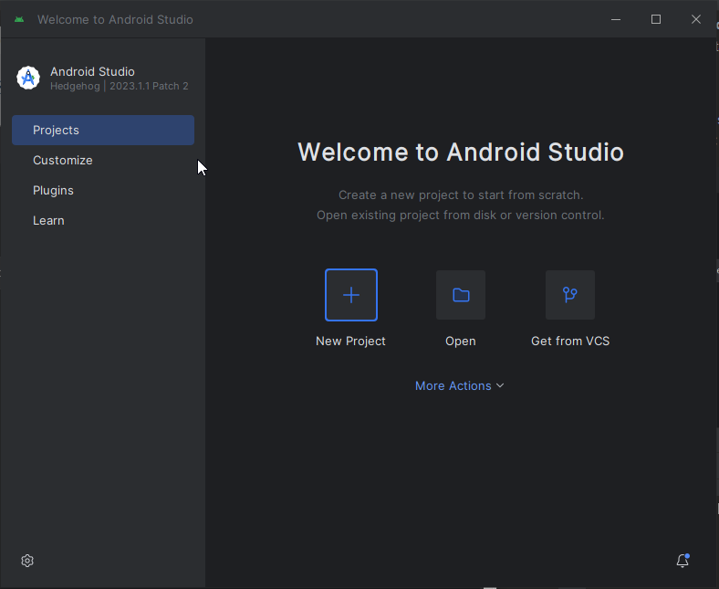
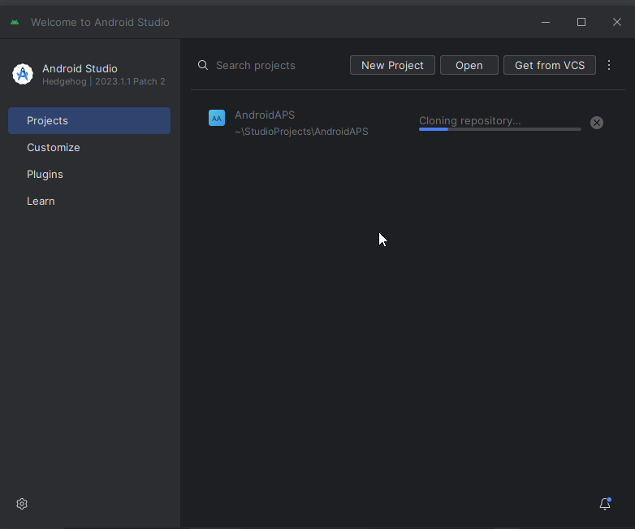
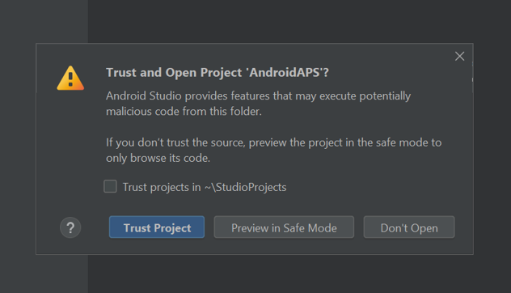

# Building AAPS

## בנייה עצמית במקום הורדה

**The AAPS app (an apk file) is not available for download, due to regulations around medical devices. It is legal to build the app for your own use, but you must not give a copy to others!**

See [FAQ page](../Getting-Started/FAQ.md) for details.

(Building-APK-recommended-specification-of-computer-for-building-apk-file)=

## Computer and software specifications for building AAPS

- Please use the **[Android Studio version called "Hedgehog"(2023.1.1)](https://developer.android.com/studio/)** to build the apk. If you use an older version, please use one which is no older than "**Giraffe**".
- [Windows 32-bit systems](troubleshooting_androidstudio-unable-to-start-daemon-process) are not supported by Android Studio. Please keep in mind that both **64 bit CPU and 64 bit OS are mandatory condition.** If your system DOES NOT meet this condition, you have to change affected hardware or software or the whole system.

<table class="tg">
<thead>
  <tr>
    <th class="tg-baqh">מערכת הפעלה (64 ביט בלבד)</th>
    <th class="tg-baqh">חלונות 8 ומעלה</th>
    <th class="tg-baqh">Mac OS 10.14 ומעלה</th>
    <th class="tg-baqh">כל לינוקס שתומך ב-Gnome, KDE, או Unity DE; GNU C Library 2.31 או מאוחר יותר</th>
  </tr>
</thead>
<tbody>
  <tr>
    <td class="tg-baqh"><p align="center">מעבד (64 ביט בלבד)</td>
    <td class="tg-baqh">ארכיטקטורת מעבד x86_64; דור שני של Intel Core ומעלה, או מעבד AMD עם תמיכה ב-<br><a href="https://developer.android.com/studio/run/emulator-acceleration#vm-windows" target="_blank" rel="noopener noreferrer"><span style="text-decoration:var(--devsite-link-text-decoration,none)">Windows Hypervisor</span></a></td>
    <td class="tg-baqh">מעבדים מבוססי ARM; דור שני של Intel Core ומעלה תמיכה ב-<br><a href="https://developer.android.com/studio/run/emulator-acceleration#vm-mac" target="_blank" rel="noopener noreferrer"><span style="text-decoration:var(--devsite-link-text-decoration,none)">Windows Hypervisor</span></a></td>
    <td class="tg-baqh">ארכיטקטורת מעבד x86_64; דור שני של Intel Core ומעלה, או מעבד AMD עם תמיכה בווירטואליזציה של AMD (AMD-V) ו-SSSE3</td>
  </tr>
  <tr>
    <td class="tg-baqh"><p align="center">RAM</td>
    <td class="tg-baqh" colspan="3"><p align="center">8GB ומעלה</td>
  </tr>
  <tr>
    <td class="tg-baqh"><p align="center">דיסק קשיח</td>
    <td class="tg-baqh" colspan="3"><p align="center">לפחות 30GB פנויים. מומלץ SSD.</td>
  </tr>
  <tr>
    <td class="tg-baqh"><p align="center">רזולוציה</td>
    <td class="tg-baqh" colspan="3"><p align="center">1280 x 800 Minimum <br></td>
  </tr>
  <tr>
    <td class="tg-baqh"><p align="center">אינטרנט</td>
    <td class="tg-baqh" colspan="3"><p align="center">פס רחב</td>
  </tr>
</tbody>
</table>

**It is strongly recommended (not mandatory) to use SSD (Solid State Disk) instead of HDD (Hard Disk Drive) because it will take less time when you are building the AAPS apk file.**  You can still use a HDD when you are building the **AAPS** apk file. If you do, the building process may take a long time to complete, but once it has started, you can leave it running unattended.

## Help and support during the building process

If you run into difficulties in the process of building the **AAPS** app, there is a dedicated [**troubleshooting Android Studio**](../Installing-AndroidAPS/troubleshooting_androidstudio) section, please consult that first.

If you think something in the building instructions is wrong, missing or confusing, or you are still struggling, please reach out to other **AAPS** users on [Facebook](https://www.facebook.com/groups/AndroidAPSUsers) or [Discord](https://discord.gg/4fQUWHZ4Mw). If you want to change something yourself (updating screenshots _etc_), please submit a [pull request (PR)](docs/EN/make-a-PR.md).

## Step-by-step guide to building the AAPS app

The overall steps for building the **AAPS** apk file are as follows:

4.1 [Install Git](Install-Git)

4.2 [Install Android Studio](Building-APK-install-android-studio)

4.3 [Download AAPS code](Building-APK-download-AAPS-code)

4.4. [Set Git path in Android Studio preferences](Building-APK-set-git-path-in-preferences)

4.5. [Build AAPS "signed" apk](Building-APK-generate-signed-apk)

In this guide you will find _example_ screenshots of building of **AAPS** apk file. Because  **Android Studio** - the software which we use to build the **AAPS** apk - is regularly updated, these screenshots may not be identical to your installation, but they should still be possible to follow.

Since **Android Studio** runs on Windows, Mac OS X and Linux platforms, there might be also be minor differences in the steps for the different  platforms.

(Install-Git)=

### Install Git (if you don't have it)

:::{admonition} Why Git?

Git is known as a “_Versioning Control System_” (VCS).\
Git is a program that allows you to track changes in code and to collaborate with others. You will use Git to make a copy of the **AAPS** source code from the Github website to your local computer. Then, you will use Git on your computer to build the **AAPS** application (apk).
:::

#### Steps for Installing Git

1. Check that you don’t already have **Git** installed. You can do this by typing “git” in the Windows search bar – if you see **“Git bash”** or some other form of Git, it is already installed and you can go straight to [installing Android Studio](Building-APK-install-android-studio):


2. If you don’t have Git installed, download and install the latest version for your system from [**here**](https://git-scm.com/downloads). Any recent Git version should work, select the correct version according to your system, either Mac, Windows and Linux.

**Note for Mac users:** the Git webpage will also guide you to install an additional program called "homebrew" to aid the installation. If you install Git via homebrew, there is no need to change any preferences.

(Make_a_note_of_Git_path)=

- During the installation, when you are asked to "select destination location" make a note of _where_ Git is being installed (the "**installation path**") you will need to check it in the next step. It will be something similar to "C:\Program Files\Git\cmd\git.exe"

- As you proceed through several steps of the Git installation, just accept all the default options.

- After the install, if you forgot to make a note of the where Git was installed, you can find it as follows: type "git" into the PC search bar, right click on "Git bash", select "open file location" hover over the "Git bash" icon with your mouse, which will then reveal where it is installed.

- Reboot your computer before the next step.

(Building-APK-install-android-studio)=

### התקנת Android Studio

- **You have to be online all of the time during the following steps, as Android Studio downloads several updates**

:::{admonition} What is Android Studio?
:class: dropdown
Android Studio is a program which runs on your computer. It allows you to download source code from the internet (using Git) and build smartphone (and smartwatch) apps. You cannot "break" a current, looping version of **AAPS** which you might have running on a smartphone by building a new or updated app on your PC with Android Studio, these are totally separate processes.
:::

The following screenshots have been taken from Android Studio Version **Hedgehog**.

One of the most important things when installing Android Studio is **be patient!** During installation and setup, Android Studio is downloading a lot of stuff which will take time.

Download the latest version of Android Studio from [**here**](https://developer.android.com/studio#downloads), locate it in your browser downloads folder, and install it on your computer:


When you first start Android Studio, you will be greeted as follows:


select "Next":


Leave the boxes checked, and select "Next":


Allow the installation at the default location suggested, and select "Next":


When asked to choose the Smart Menu Folder, simply select "Install". You will now need to wait a few minutes while Android Studio is being installed. You should then see that the Installation is Complete, select "Next":


Now select "Finish":


Android Studio will now start.

Decide whether you want to share data with Google or not (if unsure, just select "Don't send").


You will now get a message about a missing software development kit (SDK) (don't worry, this will be solved soon), select "Next":


The software should autoselect the required (SDK) and choose a location.

:::{admonition} What is an Android SDK?

In order to run **AAPS** on the phone the application needs to integrate with Android itself. Android provides “_software development kits_” (SDK) which allow apps like **AAPS** to interface with an Android operating system.
:::

The SDK platform package does **not** relate to the version of Android running on your phone, but to the build of **AAPS**. **AAPS** version 3.2 (and newer) builds on top of API level 34, which is automatically selected in the **Hedgehog** version of **Android Studio**. Therefore, simply click "Next":


When asked to verify settings, just select "Next":


When asked about the Licence Agreement, select "Accept" and then click "Finish":


> **_Note:_**  Depending on your set-up, the licenses to be accepted might vary from what is shown in the screenshot.

Wait while Android Studio downloads additional components, this may take a few minutes:


Once everything is downloaded, the "Finish" button turns blue, and you can click it:


You are now greeted with the "Welcome to Android Studio" screen.\
See that Meet the New UI suggestion bottom right? **Do not** Enable New UI.



(Building-APK-download-AAPS-code)=

### Download the AAPS code

:::{admonition} Why can it take a long time to download the AAPS code?

The first time **AAPS** is downloaded, Android Studio will connect over the internet to the Github website to download the source code for **AAPS**. This should take about 1 minute.

Android Studio will then use **Gradle** (a development tool in  Android studio) to identify other components needed to install these items on your computer.

:::

On the Android Studio Welcome screen, check that "**Projects**" (1) is highlighted on the left. Then click "**Get from VCS**" (2) at the top right:


- We will now tell Android Studio where to get the code from:

- "Repository URL" should be selected (by default) on the left (1).

- "Git" should be selected (by default) as version control (2).

Now copy this URL:

```
https://github.com/nightscout/AndroidAPS.git
```

and paste it into the URL textbox (3).

- Check the (default) directory for saving the cloned code is sensible (4).

- Now click the button "Clone" (5).


You will now see a screen telling you that the repository is being cloned:



At some point, you may be asked whether you want to trust the project. Click on "Trust project":



- If your firewall asks for permission, grant access:


If asked if you want to import settings, select "Do not import settings". We don't want to import settings from previous installations:


After the repository is cloned successfully, Android Studio will open the cloned project. Wait patiently (this may take a few minutes), and particularly, **do not** update the project as suggested in the pop-up.

:::{admonition} **My screen looks different...**

You might have enabled the new graphic **U**ser **I**nterface (i.e. the appearance of Android Studio) by mistake.\
Click on the cog top right and select "**Switch to Classic UI...**" to return to the view used in this documentation.\
Restart Android Studio to validate the change.


:::


:::{admonition} NEVER UPDATE GRADLE!

Android Studio might recommend updating the gradle system. **Never update gradle!** This will lead to difficulties.
:::

_Optional_ - If you want to clear the pop-up for **"project update recommended"**, click on the blue text "More" (1). In the dialog box the select "Don't ask for this project" (2).


If any errors occur, do not continue with the following steps, consult the [troubleshooting section](../Installing-AndroidAPS/troubleshooting_androidstudio) for known problems.

Now close Android Studio (select _File_-_Exit_).

If you have not restarted your computer since installing or updating Git, restart your computer now, and then re-open Android Studio.

(Building-APK-set-git-path-in-preferences)=

### הגדרת נתיב של Git בהעדפות Android Studio

Now we will tell Android studio where to find Git, which you installed [earlier](Install-Git).

- Make sure you have restarted your computer after [installing Git](Install-Git).
- Open **Android Studio** (you can find it by searching in the Start menu).
- In the top left corner of **Android Studio**, navigate to _File-Settings_ (Windows) or _Android Studio > Preferences_ (Mac). This opens the following window, click to expand the dropdown called "version control" (1):


- Now select "**Git**" (2).
- In the lower middle of the page, make sure update method "Merge" (3) is selected.
- Check if **Android Studio** can automatically locate the correct path to **git.exe** automatically by clicking the button "Test" (4):


- If the automatic setting is successful, your current version of **Git** will be displayed next to the path.

  

- If you find that **git.exe** is not found automatically, or that clicking "Test" results in an error (1), you can either manually enter the path which you saved [earlier](Make_a_note_of_Git_path), or click on the folder icon (2) and manually navigating to the directory where **git.exe** is stored:

  

- Use the [search function](https://www.tenforums.com/tutorials/94452-search-file-explorer-windows-10-a.html) in windows explorer to find "git.exe" if you are unsure where git has been installed. How to do this is explained [above](Make_a_note_of_Git_path) in more detail.

- If you have manually selected it, check your selected Git path with the "Test" button as described above.

When the Git version is displayed next to the path (see screenshot above) you have completed this stage successfully and you can close the Android Studio "Settings" window by clicking the "**OK**" button (5):


(Building-APK-generate-signed-apk)=

### Build the AAPS "signed" APK

:::{admonition} Why does the AAPS app need to be "signed"?

Android requires each app to be _signed_, to ensure that it can only be updated later from the same trusted source that released the original app. For more information on this topic, follow [this link](https://developer.android.com/studio/publish/app-signing.html#generate-key). For our purposes, this just means that we generate a signing or "keystore" file and use it when we build the **AAPS** app.
:::

- In the menu bar, click "Build" (1), select "Generate Signed Bundle/APK (2)


- Select "APK" instead of "Android App Bundle" and click "Next":


- In the next screen, make sure that "Module" is set to "AAPS.app" (1).
- Click "Create new\..." (2) to start creating your key store.

**_Note:_** The key store is a file in which the information for signing the app is stored. It is encrypted, and the information is secured with passwords.


- Click the "folder" symbol (1) to select a path on your computer for your key store:


- Click on the drop-down menu (1), to select where you want to save your keystore file. In this example, it is being saved in "My Documents" (2). Do not save the keystore in same folder as your Android Studio files (StudioProject). Type in a simple name for your key store (3) and confirm it with "OK" (4):


This will take you back to the previous screen. Your chosen location for saving the key store file is shown.

Now choose a simple password (make a note of it), enter it in the password box (1), and confirm it (2).  The passwords for key store and key do not have to be sophisticated. If you lose your password in the future, see [troubleshooting for lost key store](troubleshooting_androidstudio-lost-keystore).

The default alias (3) for your key is "key0", leave this unchanged.

You now need a password for your key. To keep it simple, if you want, you can use the same password you used for your keystore, above. Enter a password (4) and confirm (5) it.

The validity (6) is 25 years by default, leave it as it is.

Enter your first and last name (7). No other information needs to be added.

Click "OK" (8) to continue:


On the "Generate signed bundle or APK" page, the path to your keystore will now be displayed. Now re-enter the Key Store password (1) and Key password (2), and tick the box to remember passwords is checked (3), so you don't have to enter them again next time you build the apk (i.e. when updating to a new AAPS version). Click "Next" (4):


On the next screen, select build variant "fullRelease" (1) and click "Create" (2).


Android Studio will now build the **AAPS** apk. It will show "Gradle Build running" at the bottom right. The process takes some time, depending on your computer and internet connection, **be patient!** If you want to watch the progress of the build, click on the small hammer "build" at the bottom of Android Studio:


Now you can watch the building progress:


Android Studio will display the information "BUILD SUCCESSFUL" after build is finished. You may see a popup notification which you can click to select "locate". If you miss this, click on the notification "locate or analyse the APK" (yellow highlight) at the very bottom of the screen to bring up the Notifications:


_If the build was not successful, refer to the [troubleshooting section](../Installing-AndroidAPS/troubleshooting_androidstudio)._

In the Notifications box, click on the blue link "locate":


Your file manager/explorer will open. נווטו אל הספריה "full" (1) > "release (2).


Open the folder "release". The file "app-full-release.apk" (1) is the **AAPS** apk that you have just built, you will be transferring this file to your smartphone in the next section of the docs:

_Optional at this stage - if you are planning to also build the "**AAPS** wear" app for your smartwatch so you can remotely control **AAPS**, delete the "output-metadata" .json file (2) from this folder, to avoid the error of [uncommitted changes](troubleshooting_androidstudio-uncommitted-changes) during the **AAPS** wear app build_:


מזל טוב! Now you have built the **AAPS** apk file, you can move to the next stage of [Transferring and Installing **AAPS**](Transferring-and-installing-AAPS.md).
